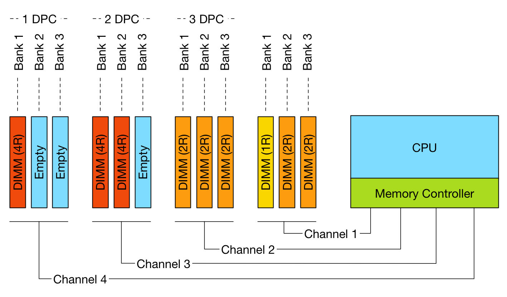

[Memory Deep Dive Series Part1](http://frankdenneman.nl/2015/02/18/memory-configuration-scalability-blog-series/)
[Memory Deep Dive Series Part2](http://frankdenneman.nl/2015/02/18/memory-tech-primer-memory-subsystem-organization/)
[Memory Deep Dive Series Part3](http://frankdenneman.nl/2015/02/19/memory-deep-dive-memory-subsystem-bandwidth/)

# Memory Deep Dive Series

Processor speed and core counts are important factors when designing a new server platform. However with virtualization platforms, the memory subsystem can have equal or sometimes even have a greater impact on application performance than the processor speed.

处理器速度和核心数是设计新服务器平台时的重要因素。但是，对于虚拟化平台，内存子系统可以与处理器速度相等或有时甚至对应用程序性能产生更大的影响。

During my last trip I spend a lot talking about server configurations with customers. vSphere 5.5 update 2 supports up to 6 TB and vSphere 6.0 will support up to 12TB per server. All this memory can be leveraged for Virtual Machine memory and if you run FVP, Distributed Fault Tolerant Memory. With the possibility of creating high-density memory configurations, care must be taken when spec’ing the server. The availability of DIMM slots does not automatically mean expandability. Especially when you want to expand the current memory configuration.

在我上次旅行期间，我花了很多时间与客户讨论服务器配置。`vSphere 5.5 update 2`最多支持 `6 TB`，`vSphere 6.0`最多可支持每台服务器 `12 TB`。所有这些内存都可以用于虚拟机内存，如果你运行 `FVP`，分布式容错内存。有可能创建高密度内存配置，在规范服务器时必须小心。`DIMM` 插槽的可用性并不自动意味着可扩展性。特别是当您想要扩展当前的内存配置时。

The CPU type and generation impacts the memory configuration and when deciding on a new server spec you get a wide variety of options presented. Memory Channels, Memory bus frequency, ranking, DIMM type are just a selection of options you encounter. DIMM type, the number of DIMMs used and how the DIMMs are populated on the server board impact performance and supported maximal memory capacity.

`CPU` 类型和生成会影响内存配置，在决定新服务器规范时，您会看到各种各样的选项。内存通道，内存总线频率，ranking，`DIMM` 类型只是您遇到的一系列选项。`DIMM` 类型，使用的 `DIMM` 数量以及服务器主板上 `DIMM` 的填充方式会影响性能并支持最大内存容量。

In this short series of blog posts, I attempt to provide a primer on memory tech and how it impacts scalability.

在这篇短篇博文中，我试图提供有关内存技术及其如何影响可扩展性的入门知识。

## Memory Deep Dive: Memory Subsystem Organisation

This is part 2 of the memory deep dive. This is a series of articles that I wrote to share what I learned while documenting memory internals for large memory server configurations. This topic amongst others will be covered in the upcoming FVP book. The memory deep dive series:

这是深度记忆的第2部分。这是我写的一系列文章，分享我在记录大内存服务器配置的内存内部时所学到的内容。这篇主题将在即将出版的FVP书中介绍。内存深潜系列：

Today’s CPU micro-architectures contain integrated memory controllers. The memory controller connects through a channel to the DIMMs. DIMM stands for Dual Inline Memory Module and contains the memory modules (DRAM chips) that provide 4 or 8 bits of data. Dual Inline refers to pins on both side of the module. Chips on the DIMM are arranged in groups called ranks that can be accessed simultaneously by the memory controller. Within a single memory cycle 64 bits of data will be accessed. These 64 bits may come from the 8 or 16 DRAM chips depending on how the DIMM is organized.

今天的 `CPU` 微架构包含集成的内存控制器。内存控制器通过通道连接到 `DIMM`。 `DIMM` 代表双列直插式内存模块，包含提供4或8位数据的内存模块（DRAM芯片）。双列直插指模块两侧的引脚。 `DIMM`上的芯片被安排在称为等级（ranks）的组中，可以由存储器控制器同时访问。在单个存储器周期内，将访问`64`位数据。这些`64`位可能来自 `8` 或 `16` 个 `DRAM` 芯片，具体取决于`DIMM` 的组织方式。

### An Overview of Server DIMM types

There are different types of DIMMs, registered and unregistered. Unregistered DIMM (UDIMM) type is targeted towards the consumer market and systems that don’t require supporting very large amounts of memory. An UDIMM allows the memory controller address each memory chip individually and in parallel. Each memory chip places a certain amount of capacitance on the memory channel and weakens the signal. As a result, a limited number of memory chips can be used while maintaining stable and consistent performance.

有不同类型的 `DIMM`，有寄存器和无寄存器。无寄存器的 `DIMM`（`UDIMM`）类型面向消费者市场和不需要支持非常大量内存的系统。`UDIMM` 允许存储器控制器单独地并行地寻址每个存储器芯片。每个存储器芯片在存储器通道上放置一定量的电容并削弱信号。结果，可以使用有限数量的存储器芯片，同时保持稳定和一致的性能。

Servers running virtualized enterprise applications require a high concentration of memory. However with these high concentrations, the connection between the memory controller and the DRAM chips can overload, causing errors and delays in the flow of data. CPU speeds increase and therefor memory speeds have to increase as well. Consequently higher speeds of the memory bus leads to data flooding the channel faster, resulting in more errors occurring.

运行虚拟化企业应用程序的服务器需要高度集中的内存。然而，在这些高密度下，内存控制器和 `DRAM`芯片之间的连接可能过载，从而导致数据流中的错误和延迟。`CPU` 速度增加，因此内存速度也必须增加。因此，内存总线的更高速度导致数据更快地充斥通道，导致更多错误发生。

To increase scale and robustness, a register is placed between the DRAM chips and the memory controller. This register, sometimes referred to as a buffer, isolates the control lines between the memory controller and each DRAM chip. This reduced the electrical load, allowing the memory controller to address more DRAM chips while maintaining stability. Registered DIMMs are referred to as RDIMMs.

为了增加规模和鲁棒性，在 `DRAM` 芯片和内存控制器之间放置寄存器。该寄存器（有时称为缓冲器）隔离存储器控制器和每个 `DRAM` 芯片之间的控制线。这减少了电负载，允许内存控制器在保持稳定性的同时寻址更多的 `DRAM` 芯片。有寄存器的 `DIMM` 称为 `RDIMM`。

Load Reduced DIMMs (LRDIMMs) were introduced in the third generation of DDR memory (DDR3) and buffers both the control and data lines from the DRAM chips. This decreases the electrical load on the memory controller allowing for denser memory configurations. The increased memory capacity leads to increased power consumption, however by implementing the buffer structure differently it provides substantially higher operating data rates than RDIMMs in the same configuration.

减载 `DIMM`（`LRDIMM`）在第三代 `DDR` 内存（`DDR3`）中引入，并缓冲 `DRAM` 芯片的控制线和数据线。这减少了存储器控制器上的电负载，允许更密集的存储器配置。增加的存储器容量导致功耗增加，但是通过不同地实现缓冲器结构，它提供了比相同配置中的 `RDIMM` 明显更高的操作数据速率。

The key to increased capacity and performance of LRDIMMs is the abstraction of DRAM chips and especially the rank count by the buffer. RDIMMs register only buffers the command and address while leaving the more important data bus unbuffered. This leaves the group of DRAM chips (ranks) exposed to the memory controller. A memory controller accesses the grouped DRAM chips simultaneously. A Quad rank DIMM configuration presents four separate electrical loads on the data bus per DIMM. The memory controller can handle up to a certain amount of load and therefor there is a limitation on the number of exposed ranks. LRDIMMs scale to higher speeds by using rank multiplication, where multiple ranks appear to the memory controller as a logical rank of a larger size.

提高`LRDIMM`容量和性能的关键是`DRAM`芯片的抽象，特别是缓冲器的排序计数。`RDIMM`寄存器仅缓冲命令和地址，同时使更重要的数据总线无缓冲。这使得 `DRAM` 芯片组（等级）暴露于存储器控制器。存储器控制器同时访问分组的 `DRAM` 芯片。四列 `DIMM` 配置在每个 `DIMM` 的数据总线上呈现四个单独的电气负载。存储器控制器可以处理高达一定量的负载，因此对暴露的等级的数量有限制。`LRDIMM`通过使用秩乘法扩展到更高的速度，其中多个等级在存储器控制器中显示为更大尺寸的逻辑等级。

### DIMM Ranking

DIMMs come in three rank configurations; single-rank, dual-rank or quad-rank configuration, ranks are denoted as (xR). Together the DRAM chips grouped into a rank contain 64-bit of data. If a DIMM contains DRAM chips on just one side of the printed circuit board (PCB), containing a single 64-bit chunk of data, it is referred to as a single-rank (1R) module. A dual rank (2R) module contains at least two 64-bit chunks of data, one chunk on each side of the PCB. Quad ranked DIMMs (4R) contains four 64-bit chunks, two chunks on each side.

`DIMM` 有三种 `rank` 配置; 单秩，双秩或四秩配置，等级表示为（`xR`）。将分组为等级的DRAM芯片一起包含64位数据。如果 `DIMM` 仅在印刷电路板（PCB）的一侧包含DRAM芯片，其中包含单个64位数据块，则称其为单列（1R）模块。双列（2R）模块包含至少两个64位数据块，`PCB` 的每一侧有一个块。四列`DIMM`（4R）包含四个64位块，每侧两个块。

To increase capacity, combine the ranks with the largest DRAM chips. A quad-ranked DIMM with 4Gb chips equals 32GB DIMM (4Gb x 8bits x 4 ranks). As server boards have a finite amount of DIMM slots, quad-ranked DIMMs are the most effective way to achieve the highest memory capacity. As mentioned before there are some limitations when it comes to the amount of ranks used in a system. Memory controllers use channels to communicate with DIMM slots and each channel supports a limited amount of ranks due to maximal capacitance.

为了增加容量，将 rank 与最大的DRAM芯片结合起来。具有 `4Gb` 芯片的四列DIMM等于32GB DIMM（4Gb x 8位x 4级）。由于服务器主板具有有限数量的 `DIMM` 插槽，因此四列DIMM是实现最高内存容量的最有效方式。如前所述，当涉及系统中使用的等级数量时存在一些限制。内存控制器使用通道与 `DIMM`插槽通信，并且每个通道由于最大电容而支持有限数量的等级。

### Memory Channel

Modern CPU microarchitectures support triple or quadruple memory channels. These multiple independent channels increases data transfer rates due to concurrent access of multiple DIMMs. When operating in triple-channel or in quad-channel mode, latency is reduced due to interleaving. The memory controller distributes the data amongst the DIMM in an alternating pattern, allowing the memory controller to access each DIMM for smaller bits of data instead of accessing a single DIMM for the entire chunk of data. This provides the memory controller more bandwidth for accessing the same amount of data across channels instead of traversing a single channel when it stores all data in one DIMM.

现代 `CPU` 微体系结构支持三重或四重内存通道。由于多个 `DIMM` 的并发访问，这些多个独立通道增加了数据传输速率。在三通道或四通道模式下工作时，由于交错，延迟会降低。内存控制器以交替模式在`DIMM`之间分配数据，允许存储器控制器访问每个 `DIMM` 以获得较小的数据位，而不是访问整个数据块的单个 `DIMM`。这为内存控制器提供了更多带宽，用于跨通道访问相同数量的数据，而不是在将所有数据存储在一个 `DIMM` 中时遍历单个通道。

If the CPU supports triple-channel mode, it is enabled when three identical memory modules are installed in the separate channel DIMM slots. If two of the three-channel slots are populated with identical DIMMs, then the CPU activates dual-channel mode. Quad-channel mode is activated when four identical DIMMs are put in quad-channel slots. When three matched DIMMs are used in Quad-channel CPU architectures, triple-channel is activated, when two identical DIMMs are used, the system will operate in dual-channel mode.

如果 `CPU` 支持三通道模式，则在单独的通道 `DIMM` 插槽中安装三个相同的内存模块时，将启用该模式。如果三个通道插槽中的两个插槽装有相同的 `DIMM`，则CPU会激活双通道模式。当四个相同的 `DIMM` 放入四通道插槽时，四通道模式被激活。当在四通道 `CPU` 架构中使用三个匹配的 `DIMM` 时，激活三通道，当使用两个相同的 `DIMM` 时，系统将以双通道模式运行。

### LRDIMM rank aware controllers

With the introduction of LRDIMMs, memory controllers have been enhanced to improve the utilization of the LRDIMMs memory capacity. Rank multiplication is of of these enhancements and improved latency and bandwidth tremendously.

随着 `LRDIMM` 的引入，内存控制器得到了增强，以提高 `LRDIMM` 内存容量的利用率。排名乘法具有这些增强功能，并且极大地改善了延迟和带宽。

Generally memory controllers of systems prior to 2012 were “rank unaware” when operating in rank multiplication mode. Due to the onboard register on the DIMM it was unaware whether the rank was on the same DIMM it had to account for time to switch between DRAMS on the same bus. This resulted in lower back-to-back read transactions performance, sometimes up to 25% performance penalty. Many tests have been done between RDIMMs and LRDIMMs operating at the same speed. In systems with rank unaware memory controllers you can see a performance loss of 30% when comparing LRDIMMs and RDIMMS.

通常，在等级乘法模式下操作时，2012年之前的系统的存储器控​​制器“不知道”。由于DIMM上的板载寄存器，它不知道等级是否在相同的DIMM上，它必须考虑在同一总线上的DRAM之间切换的时间。这导致背靠背读取事务性能降低，有时性能损失高达25％。在以相同速度运行的RDIMM和LRDIMM之间已经进行了许多测试。在具有排名无意识内存控制器的系统中，您可以在比较LRDIMM和RDIMMS时看到性能损失30％。

Systems after 2012 are referred to generation 2 DDR3 platforms and contain controllers that are aware of the physical ranks behind the data buffer. Allowing the memory controller to adjust the timings and providing better back-to-back reads and writes. Gen 2 DDR3 systems reduce the latency gap between RDIMMs and LRDIMMs but most importantly it reduces the bandwidth gap. Please be aware of this difference when reading memory reviews posted on the net by independent hardware review sites. Verify the date of the publication to understand if they tested a configuration that was rank aware or rank unaware systems.

2012年之后的系统被称为第2代DDR3平台，并包含了解数据缓冲区背后物理等级的控制器。允许内存控制器调整时序并提供更好的背靠背读写。 Gen 2 DDR3系统减少了RDIMM和LRDIMM之间的延迟差距，但最重要的是它减少了带宽差距。阅读独立硬件评论网站在网上发布的内存评论时，请注意这种差异。验证发布日期，以了解它们是否测试了具有排名意识或排名不知道系统的配置。

DDR4 LRDIMMs improves lantencies even further due to use of distributed data buffers. DDR4 memory is covered in the third article in this series.

由于使用分布式数据缓冲区，DDR4 LRDIMM甚至可以进一步提高延迟。 DDR4内存包含在本系列的第三篇文章中。

### Pairing DIMMs per Memory Channel

Depending on the DIMM slot configuration of the server board, multiple DIMMs can be used per channel. If one DIMM is used per channel, this configuration is commonly referred to as 1 DIMM Per Channel (1 DPC). 2 DIMMs per channel (2 DPC) and if 3 DIMMs are used per channel, this configuration is referred to as 3 DPC.

*Figure 1: DPC configurations and channels*

*The diagram illustrates different DPC configurations; please note that balanced DIMM population (same number and type of DIMMs in each channel) is generally recommended for the best overall memory performance. The configuration displayed above is non-functional do not try to repeat.*

However there are some limitations to channels and ranking. To achieve more memory density, higher capacity DIMMs are required. As you move up in the size of gigabytes of memory, you are forced to move up in the ranks of memory. For example single rank and dual rank RDIMMs have a maximum capacity per DIMM of 16GB. DDR3 32GB RDIMMs are available in quad rank (QR). Recently 64GB DIMS are made available, but only in LRDIMM format.

Memory rank impacts the number of DIMMS supported per channel. Modern CPUs can support up to 8 physical ranks per channel. This means that if a large amount of capacity is required quad ranked RDIMMs or LRDIMMs should be used. When using quad ranked RDIMMs, only 2 DPC configurations are possible as 3 DPC equals 12 ranks, which exceeds the 8 ranks per memory rank limit of currents systems.

*Figure 2: Maximum RDIMM configuration (256 GB per CPU)*

When comparing 32GB LRDIMMs and 32GB Quad Rank RDIMMs it becomes apparent that LRDIMMS allow for higher capacity while retaining the bandwidth. For example, a Gen 12 Dell R720 contains two Intel Xeon E5 2600 CPU, allowing up to 1.5TB of RAM. The system contains 24 DIMM slots and allows up to 64GB DDR3 DIMMs up to 1866 Mhz. Dells memory configuration samples only contain configurations up to 1600 MHz.

*Table 1: Total capacity configuration of RDIMMs and LRDIMMs*

|DIMM Type|Capacity |Number of DIMMs|Ranking|Total capacity|Bandwidth
|---------|---------|---------------|-------|--------------|----------
|RDIMM    |16GB     |16             |2R     |256GB         |1600MHz
|RDIMM    |32GB     |16             |4R     |512GB         |1333 MHz
|LRDIMM   |32GB     |24             |4R     |768GB         |1333MHz
|LRDIMM   |64GB     |24             |4R     |1536GB        |1333MHz

### Design consideration

DIMM types impact future expandability of the server. Due to the maximum of ranks support per channel, care must be taken when initially designing the server spec of the server.

Unfortunately, there is a downside when aiming for high memory capacity configurations and that is the loss of bandwidth. The interesting thing is when you increase DIMM count the bandwidth typically decreases. This impacts memory performance. The relationship between frequency and bandwidth is the topic of the next article in this series;

## Memory Deep Dive: Memory Subsystem Bandwidth

This is part 3 of the memory deep dive. This is a series of articles that I wrote to share what I learned while documenting memory internals for large memory server configurations. This topic amongst others will be covered in the upcoming FVP book. The memory deep dive series:

### Memory Subsystem Bandwidth

Unfortunately there is a downside when aiming for high memory capacity configurations and that is the loss of bandwidth. As shown in table 1, using more physical ranks per channel lowers the clock frequency of the memory banks. As more ranks per DIMM are used the electrical loading of the memory module increases. And as more ranks are used in a memory channel, memory speed drops restricting the use of additional memory. Therefore in certain configurations, DIMMs will run slower than their listed maximum speeds.

Let’s use an Intel Xeon E5 v2 (Ivy Bridge) as an example. The Intel Xeon E5 is one of the most popular CPUs used in server platforms. Although the E5 CPU supports 3 DIMMs per channel, most servers are equipped with a maximum of two DIMMs per channel as the memory speed decreases with the use of the third bank.

*Table 2: DDR3 Memory channel pairing impact on memory bandwidth*

|Vendor|DIMM Type|1 DPC   |2 DPC   |3 DPC   |
|------|---------|--------|--------|--------|
|HP    |1R RDIMM |1866 MHz|1866 MHz|1333 MHz|
|HP    |2R RDIMM |1866 MHz|1866 MHz|1333 MHz|
|Dell  |4R RDIMM |1333 MHz|1066 MHz|N/A     |
|HP    |4R LRDIMM|1866 MHz|1866 MHz|1333 MHz|

### Relation of bandwidth and frequency

As is often the case in competitive markets in and out of technology, memory vendors use a lot of different terminology. Sometimes we see MHz to indicate bandwidth, other times transfer rate per seconds (MT/s). Typically, the metric that resonates the most is the bandwidth per second in Megabytes. Some examples of popular designations of DDR modules:

|DIMM Type|Memory Clock|I/O Bus Clock|Data Rate|Module Name|Peak Transfer Rate
|---------|------------|-------------|---------|-----------|-------------------
|DDR3-800 |100 MHz     |400 MHz      |800 MT/s |PC-6400    |6400 MB/s
|DDR3-1066|133 MHz     |533 MHz      |1066 MT/s|PC-8500    |8533 MB/s
|DDR3-1333|166 MHz     |666 MHz      |1333 MT/s|PC-10600   |10600 MB/s
|DDR3-1600|200 MHz     |800 MHz      |1600 MT/s|PC-12800   |12800 MB/s
|DDR3-1866|233 MHz     |933 MHz      |1866 MT/s|PC-14900   |14933 MB/s
|DDR3-2133|266 MHz     |1066 MHz     |2133 MT/s|PC-17000   |17066 MB/s

DDR stands for double data rate which means data is transfers on both the rising and falling edges of the clock signal. Meaning that transfer rate is roughly twice the speed of the I/O bus clock. For example if the I/O bus clock runs at 800 MHz per second, then the effective rate is 1600 megatransfers per second (MT/s) because there are 800 million rising edges per second and 800 million falling edges per second of a clock signal running at 800 MHz.

The transfer rate refers to the number of operations transferring data that occur in each second in the data-transfer channel. Transfer rates are generally indicated by MT/s or gigatransfers per second (GT/s). 1 MT/s is $10^6$ or one million transfers per second; similarly, 1 GT/s means $10^9$, or one billion transfers per second.

Please be aware that sometimes MT/s and MHz are used interchangeably. This is not correct! As mentioned above, the MT/s is normally twice of the I/O clock rate (MHz) due to the sampling, one transfer on the rising clock edge, and one transfer on the falling. Therefor it’s more interesting to calculate the theoretical bandwidth. The transfer rate itself does not specify the bit rate at which data is being transferred. To calculate the data transmission rate, one must multiply the transfer rate by the information channel width. The formula for a data transfer rate is:

$$
Channel\  Width(\frac{bits}{transfer}) \times \frac{transfers}{second} = \frac{bits\space transferred}{second}
$$

This means that a 64-bit wide DDR3-1600 DIMM can achieve a maximum transfer rate of 12800 MB/s. To arrive at 12800 MB/s multiply the memory clock rate (200) by the bus clock multiplier (4) x data rate (2) = 1600 x number of bits transferred (64) = 102400 bits / 8 = 12800 MB/s

### Design considerations

Most popular DDR3 frequencies are DIMMs operating 1600 MHz, 1333 MHz and 1066 MHz. Many tests published on the net show on average 13% decline in memory bandwidth when dropping down from 1600 MHz to 1333 MHz. When using 3 DPC configuration, bandwidth drops down 29% when comparing 1066 MHz with 1600 MHz. It’s recommended to leverage LRDIMMS when spec’ing servers with large capacity memory configurations.

If you want to measure the memory bandwidth on your system, Intel released the tool Intel® VTune™ Performance Analyzer.

### Low Voltage

Low Voltage RAM is gaining more popularity recently. DDR3 RDIMMs require 1.5 volts to operate, low voltage RDIMMS require 1.35 volts. While this doesn’t sound much, dealing with hundreds of servers each equipped with 20 or more DIMM modules this can become a tremendous power saver. Unfortunately using less power results in a lower memory clock cycle of the memory bus. This leads to reduced memory bandwidth. Table xyx shows the memory bandwidth of low voltage DDR3 DIMMs compared to 1.5V DIMM rated voltage.

DIMM Type	Ranking	Speed	1 DPC 1.35V	1 DPC 1.5V	2 DPC 1.35V	2 DPC 1.5V	3 DPC 1.35V	3 DPC 1.5V
RDIMM	SR/DR	1600 MHz	N/A	1600	N/A	1600	N/A	1066
RDIMM	SR/DR	1333 MHz	1333	1333	1333	1333	N/A	1066
RDIMM	QR	1333 MHz	800	1066	800	800	N/A	N/A
LRDIMM	QR	1333 MHz	1333	1333	1333	1333	1066	1066
