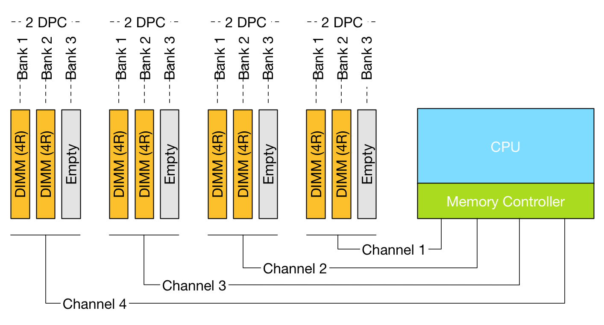
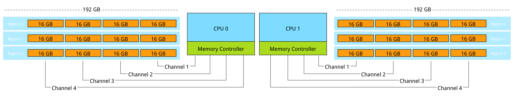
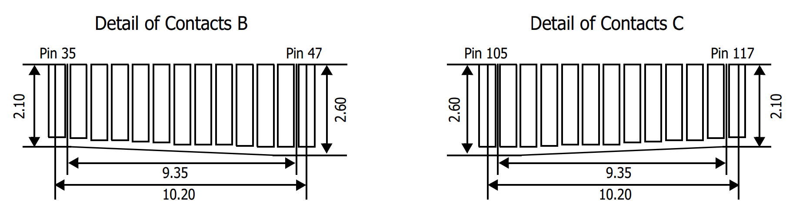
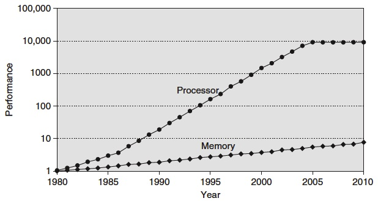
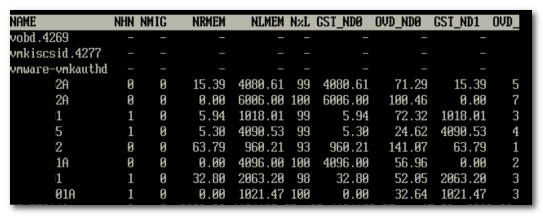
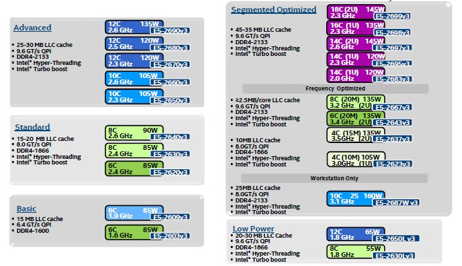
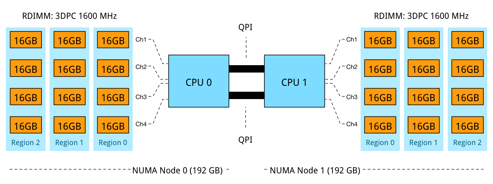
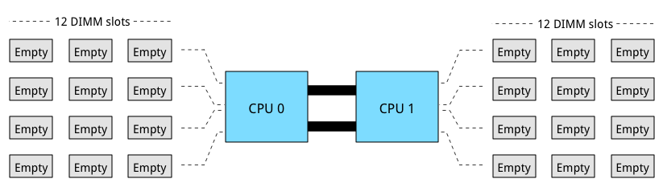
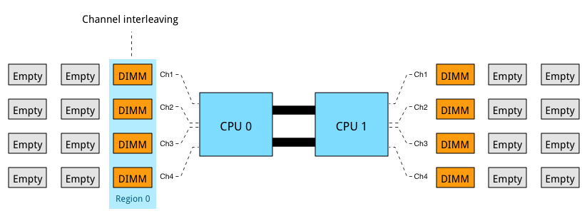
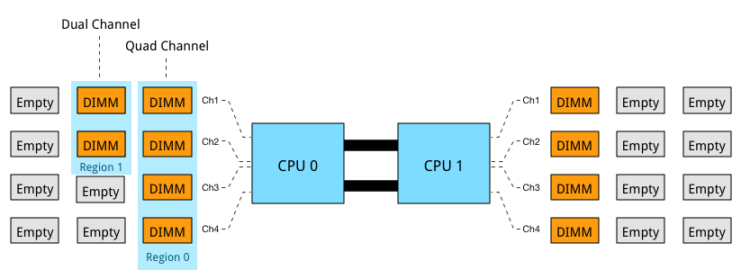

* [Memory Deep Dive Series Part1 : Intro](http://frankdenneman.nl/2015/02/18/memory-configuration-scalability-blog-series/)
* [Memory Deep Dive Series Part2 : Memory subsystem Organisation](http://frankdenneman.nl/2015/02/18/memory-tech-primer-memory-subsystem-organization/)
* [Memory Deep Dive Series Part3 : Memory Subsystem Bandwidth](http://frankdenneman.nl/2015/02/19/memory-deep-dive-memory-subsystem-bandwidth/)
* [Memory Deep Dive Series Part4 : Optimizing for Performance](http://frankdenneman.nl/2015/02/20/memory-deep-dive/)
* [Memory Deep Dive Series Part5 : DDR4 Memory](http://frankdenneman.nl/2015/02/25/memory-deep-dive-ddr4/)
* [Memory Deep Dive Series Part6 : NUMA Architecture and Data Locality](http://frankdenneman.nl/2015/02/27/memory-deep-dive-numa-data-locality/)
* [Memory Deep Dive Series Part7 : Memory Deep Dive Summary](http://frankdenneman.nl/2015/03/02/memory-deep-dive-summary/)

# Memory Deep Dive Series

Processor speed and core counts are important factors when designing a new server platform. However with virtualization platforms, the memory subsystem can have equal or sometimes even have a greater impact on application performance than the processor speed.

处理器速度和核心数是设计新服务器平台时的重要因素。但是，对于虚拟化平台，内存子系统可以与处理器速度相等或有时甚至对应用程序性能产生更大的影响。

During my last trip I spend a lot talking about server configurations with customers. vSphere 5.5 update 2 supports up to 6 TB and vSphere 6.0 will support up to 12TB per server. All this memory can be leveraged for Virtual Machine memory and if you run FVP, Distributed Fault Tolerant Memory. With the possibility of creating high-density memory configurations, care must be taken when spec’ing the server. The availability of DIMM slots does not automatically mean expandability. Especially when you want to expand the current memory configuration.

在我上次旅行期间，我花了很多时间与客户讨论服务器配置。`vSphere 5.5 update 2`最多支持 `6 TB`，`vSphere 6.0`最多可支持每台服务器 `12 TB`。所有这些内存都可以用于虚拟机内存，如果你运行 `FVP`，分布式容错内存。有可能创建高密度内存配置，在规范服务器时必须小心。`DIMM` 插槽的可用性并不自动意味着可扩展性。特别是当您想要扩展当前的内存配置时。

The CPU type and generation impacts the memory configuration and when deciding on a new server spec you get a wide variety of options presented. Memory Channels, Memory bus frequency, ranking, DIMM type are just a selection of options you encounter. DIMM type, the number of DIMMs used and how the DIMMs are populated on the server board impact performance and supported maximal memory capacity.

`CPU` 类型和生成会影响内存配置，在决定新服务器规范时，您会看到各种各样的选项。内存通道，内存总线频率，ranking，`DIMM` 类型只是您遇到的一系列选项。`DIMM` 类型，使用的 `DIMM` 数量以及服务器主板上 `DIMM` 的填充方式会影响性能并支持最大内存容量。

In this short series of blog posts, I attempt to provide a primer on memory tech and how it impacts scalability.

在这篇短篇博文中，我试图提供有关内存技术及其如何影响可扩展性的入门知识。

## Memory Deep Dive: Memory Subsystem Organisation

This is part 2 of the memory deep dive. This is a series of articles that I wrote to share what I learned while documenting memory internals for large memory server configurations. This topic amongst others will be covered in the upcoming FVP book. The memory deep dive series:

这是深度记忆的第2部分。这是我写的一系列文章，分享我在记录大内存服务器配置的内存内部时所学到的内容。这篇主题将在即将出版的FVP书中介绍。内存深潜系列：

Today’s CPU micro-architectures contain integrated memory controllers. The memory controller connects through a channel to the DIMMs. DIMM stands for Dual Inline Memory Module and contains the memory modules (DRAM chips) that provide 4 or 8 bits of data. Dual Inline refers to pins on both side of the module. Chips on the DIMM are arranged in groups called ranks that can be accessed simultaneously by the memory controller. Within a single memory cycle 64 bits of data will be accessed. These 64 bits may come from the 8 or 16 DRAM chips depending on how the DIMM is organized.

今天的 `CPU` 微架构包含集成的内存控制器。内存控制器通过通道连接到 `DIMM`。 `DIMM` 代表双列直插式内存模块，包含提供4或8位数据的内存模块（DRAM芯片）。双列直插指模块两侧的引脚。 `DIMM`上的芯片被安排在称为等级（ranks）的组中，可以由存储器控制器同时访问。在单个存储器周期内，将访问`64`位数据。这些`64`位可能来自 `8` 或 `16` 个 `DRAM` 芯片，具体取决于`DIMM` 的组织方式。

### An Overview of Server DIMM types

There are different types of DIMMs, registered and unregistered. Unregistered DIMM (UDIMM) type is targeted towards the consumer market and systems that don’t require supporting very large amounts of memory. An UDIMM allows the memory controller address each memory chip individually and in parallel. Each memory chip places a certain amount of capacitance on the memory channel and weakens the signal. As a result, a limited number of memory chips can be used while maintaining stable and consistent performance.

有不同类型的 `DIMM`，有寄存器和无寄存器。无寄存器的 `DIMM`（`UDIMM`）类型面向消费者市场和不需要支持非常大量内存的系统。`UDIMM` 允许存储器控制器单独地并行地寻址每个存储器芯片。每个存储器芯片在存储器通道上放置一定量的电容并削弱信号。结果，可以使用有限数量的存储器芯片，同时保持稳定和一致的性能。

Servers running virtualized enterprise applications require a high concentration of memory. However with these high concentrations, the connection between the memory controller and the DRAM chips can overload, causing errors and delays in the flow of data. CPU speeds increase and therefor memory speeds have to increase as well. Consequently higher speeds of the memory bus leads to data flooding the channel faster, resulting in more errors occurring.

运行虚拟化企业应用程序的服务器需要高度集中的内存。然而，在这些高密度下，内存控制器和 `DRAM`芯片之间的连接可能过载，从而导致数据流中的错误和延迟。`CPU` 速度增加，因此内存速度也必须增加。因此，内存总线的更高速度导致数据更快地充斥通道，导致更多错误发生。

To increase scale and robustness, a register is placed between the DRAM chips and the memory controller. This register, sometimes referred to as a buffer, isolates the control lines between the memory controller and each DRAM chip. This reduced the electrical load, allowing the memory controller to address more DRAM chips while maintaining stability. Registered DIMMs are referred to as RDIMMs.

为了增加规模和鲁棒性，在 `DRAM` 芯片和内存控制器之间放置寄存器。该寄存器（有时称为缓冲器）隔离存储器控制器和每个 `DRAM` 芯片之间的控制线。这减少了电负载，允许内存控制器在保持稳定性的同时寻址更多的 `DRAM` 芯片。有寄存器的 `DIMM` 称为 `RDIMM`。

Load Reduced DIMMs (LRDIMMs) were introduced in the third generation of DDR memory (DDR3) and buffers both the control and data lines from the DRAM chips. This decreases the electrical load on the memory controller allowing for denser memory configurations. The increased memory capacity leads to increased power consumption, however by implementing the buffer structure differently it provides substantially higher operating data rates than RDIMMs in the same configuration.

减载 `DIMM`（`LRDIMM`）在第三代 `DDR` 内存（`DDR3`）中引入，并缓冲 `DRAM` 芯片的控制线和数据线。这减少了存储器控制器上的电负载，允许更密集的存储器配置。增加的存储器容量导致功耗增加，但是通过不同地实现缓冲器结构，它提供了比相同配置中的 `RDIMM` 明显更高的操作数据速率。

The key to increased capacity and performance of LRDIMMs is the abstraction of DRAM chips and especially the rank count by the buffer. RDIMMs register only buffers the command and address while leaving the more important data bus unbuffered. This leaves the group of DRAM chips (ranks) exposed to the memory controller. A memory controller accesses the grouped DRAM chips simultaneously. A Quad rank DIMM configuration presents four separate electrical loads on the data bus per DIMM. The memory controller can handle up to a certain amount of load and therefor there is a limitation on the number of exposed ranks. LRDIMMs scale to higher speeds by using rank multiplication, where multiple ranks appear to the memory controller as a logical rank of a larger size.

提高`LRDIMM`容量和性能的关键是`DRAM`芯片的抽象，特别是缓冲器的排序计数。`RDIMM`寄存器仅缓冲命令和地址，同时使更重要的数据总线无缓冲。这使得 `DRAM` 芯片组（等级）暴露于存储器控制器。存储器控制器同时访问分组的 `DRAM` 芯片。四列 `DIMM` 配置在每个 `DIMM` 的数据总线上呈现四个单独的电气负载。存储器控制器可以处理高达一定量的负载，因此对暴露的等级的数量有限制。`LRDIMM`通过使用秩乘法扩展到更高的速度，其中多个等级在存储器控制器中显示为更大尺寸的逻辑等级。

### DIMM Ranking

DIMMs come in three rank configurations; single-rank, dual-rank or quad-rank configuration, ranks are denoted as (xR). Together the DRAM chips grouped into a rank contain 64-bit of data. If a DIMM contains DRAM chips on just one side of the printed circuit board (PCB), containing a single 64-bit chunk of data, it is referred to as a single-rank (1R) module. A dual rank (2R) module contains at least two 64-bit chunks of data, one chunk on each side of the PCB. Quad ranked DIMMs (4R) contains four 64-bit chunks, two chunks on each side.

`DIMM` 有三种 `rank` 配置; 单秩，双秩或四秩配置，等级表示为（`xR`）。将分组为等级的DRAM芯片一起包含64位数据。如果 `DIMM` 仅在印刷电路板（PCB）的一侧包含DRAM芯片，其中包含单个64位数据块，则称其为单列（1R）模块。双列（2R）模块包含至少两个64位数据块，`PCB` 的每一侧有一个块。四列`DIMM`（4R）包含四个64位块，每侧两个块。

To increase capacity, combine the ranks with the largest DRAM chips. A quad-ranked DIMM with 4Gb chips equals 32GB DIMM (4Gb x 8bits x 4 ranks). As server boards have a finite amount of DIMM slots, quad-ranked DIMMs are the most effective way to achieve the highest memory capacity. As mentioned before there are some limitations when it comes to the amount of ranks used in a system. Memory controllers use channels to communicate with DIMM slots and each channel supports a limited amount of ranks due to maximal capacitance.

为了增加容量，将 rank 与最大的DRAM芯片结合起来。具有 `4Gb` 芯片的四列DIMM等于32GB DIMM（4Gb x 8位x 4级）。由于服务器主板具有有限数量的 `DIMM` 插槽，因此四列DIMM是实现最高内存容量的最有效方式。如前所述，当涉及系统中使用的等级数量时存在一些限制。内存控制器使用通道与 `DIMM`插槽通信，并且每个通道由于最大电容而支持有限数量的等级。

### Memory Channel

Modern CPU microarchitectures support triple or quadruple memory channels. These multiple independent channels increases data transfer rates due to concurrent access of multiple DIMMs. When operating in triple-channel or in quad-channel mode, latency is reduced due to interleaving. The memory controller distributes the data amongst the DIMM in an alternating pattern, allowing the memory controller to access each DIMM for smaller bits of data instead of accessing a single DIMM for the entire chunk of data. This provides the memory controller more bandwidth for accessing the same amount of data across channels instead of traversing a single channel when it stores all data in one DIMM.

现代 `CPU` 微体系结构支持三重或四重内存通道。由于多个 `DIMM` 的并发访问，这些多个独立通道增加了数据传输速率。在三通道或四通道模式下工作时，由于交错，延迟会降低。内存控制器以交替模式在`DIMM`之间分配数据，允许存储器控制器访问每个 `DIMM` 以获得较小的数据位，而不是访问整个数据块的单个 `DIMM`。这为内存控制器提供了更多带宽，用于跨通道访问相同数量的数据，而不是在将所有数据存储在一个 `DIMM` 中时遍历单个通道。

If the CPU supports triple-channel mode, it is enabled when three identical memory modules are installed in the separate channel DIMM slots. If two of the three-channel slots are populated with identical DIMMs, then the CPU activates dual-channel mode. Quad-channel mode is activated when four identical DIMMs are put in quad-channel slots. When three matched DIMMs are used in Quad-channel CPU architectures, triple-channel is activated, when two identical DIMMs are used, the system will operate in dual-channel mode.

如果 `CPU` 支持三通道模式，则在单独的通道 `DIMM` 插槽中安装三个相同的内存模块时，将启用该模式。如果三个通道插槽中的两个插槽装有相同的 `DIMM`，则CPU会激活双通道模式。当四个相同的 `DIMM` 放入四通道插槽时，四通道模式被激活。当在四通道 `CPU` 架构中使用三个匹配的 `DIMM` 时，激活三通道，当使用两个相同的 `DIMM` 时，系统将以双通道模式运行。

### LRDIMM rank aware controllers

With the introduction of LRDIMMs, memory controllers have been enhanced to improve the utilization of the LRDIMMs memory capacity. Rank multiplication is of of these enhancements and improved latency and bandwidth tremendously.

随着 `LRDIMM` 的引入，内存控制器得到了增强，以提高 `LRDIMM` 内存容量的利用率。排名乘法具有这些增强功能，并且极大地改善了延迟和带宽。

Generally memory controllers of systems prior to 2012 were “rank unaware” when operating in rank multiplication mode. Due to the onboard register on the DIMM it was unaware whether the rank was on the same DIMM it had to account for time to switch between DRAMS on the same bus. This resulted in lower back-to-back read transactions performance, sometimes up to 25% performance penalty. Many tests have been done between RDIMMs and LRDIMMs operating at the same speed. In systems with rank unaware memory controllers you can see a performance loss of 30% when comparing LRDIMMs and RDIMMS.

通常，在等级乘法模式下操作时，2012年之前的系统的存储器控​​制器“不知道”。由于DIMM上的板载寄存器，它不知道等级是否在相同的DIMM上，它必须考虑在同一总线上的DRAM之间切换的时间。这导致背靠背读取事务性能降低，有时性能损失高达25％。在以相同速度运行的RDIMM和LRDIMM之间已经进行了许多测试。在具有排名无意识内存控制器的系统中，您可以在比较LRDIMM和RDIMMS时看到性能损失30％。

Systems after 2012 are referred to generation 2 DDR3 platforms and contain controllers that are aware of the physical ranks behind the data buffer. Allowing the memory controller to adjust the timings and providing better back-to-back reads and writes. Gen 2 DDR3 systems reduce the latency gap between RDIMMs and LRDIMMs but most importantly it reduces the bandwidth gap. Please be aware of this difference when reading memory reviews posted on the net by independent hardware review sites. Verify the date of the publication to understand if they tested a configuration that was rank aware or rank unaware systems.

2012年之后的系统被称为第2代DDR3平台，并包含了解数据缓冲区背后物理等级的控制器。允许内存控制器调整时序并提供更好的背靠背读写。 Gen 2 DDR3系统减少了RDIMM和LRDIMM之间的延迟差距，但最重要的是它减少了带宽差距。阅读独立硬件评论网站在网上发布的内存评论时，请注意这种差异。验证发布日期，以了解它们是否测试了具有排名意识或排名不知道系统的配置。

DDR4 LRDIMMs improves lantencies even further due to use of distributed data buffers. DDR4 memory is covered in the third article in this series.

由于使用分布式数据缓冲区，DDR4 LRDIMM甚至可以进一步提高延迟。 DDR4内存包含在本系列的第三篇文章中。

### Pairing DIMMs per Memory Channel

Depending on the DIMM slot configuration of the server board, multiple DIMMs can be used per channel. If one DIMM is used per channel, this configuration is commonly referred to as 1 DIMM Per Channel (1 DPC). 2 DIMMs per channel (2 DPC) and if 3 DIMMs are used per channel, this configuration is referred to as 3 DPC.

*Figure 1: DPC configurations and channels*

*The diagram illustrates different DPC configurations; please note that balanced DIMM population (same number and type of DIMMs in each channel) is generally recommended for the best overall memory performance. The configuration displayed above is non-functional do not try to repeat.*

However there are some limitations to channels and ranking. To achieve more memory density, higher capacity DIMMs are required. As you move up in the size of gigabytes of memory, you are forced to move up in the ranks of memory. For example single rank and dual rank RDIMMs have a maximum capacity per DIMM of 16GB. DDR3 32GB RDIMMs are available in quad rank (QR). Recently 64GB DIMS are made available, but only in LRDIMM format.

Memory rank impacts the number of DIMMS supported per channel. Modern CPUs can support up to 8 physical ranks per channel. This means that if a large amount of capacity is required quad ranked RDIMMs or LRDIMMs should be used. When using quad ranked RDIMMs, only 2 DPC configurations are possible as 3 DPC equals 12 ranks, which exceeds the 8 ranks per memory rank limit of currents systems.

*Figure 2: Maximum RDIMM configuration (256 GB per CPU)*

When comparing 32GB LRDIMMs and 32GB Quad Rank RDIMMs it becomes apparent that LRDIMMS allow for higher capacity while retaining the bandwidth. For example, a Gen 12 Dell R720 contains two Intel Xeon E5 2600 CPU, allowing up to 1.5TB of RAM. The system contains 24 DIMM slots and allows up to 64GB DDR3 DIMMs up to 1866 Mhz. Dells memory configuration samples only contain configurations up to 1600 MHz.

*Table 1: Total capacity configuration of RDIMMs and LRDIMMs*

|DIMM Type|Capacity |Number of DIMMs|Ranking|Total capacity|Bandwidth
|---------|---------|---------------|-------|--------------|----------
|RDIMM    |16GB     |16             |2R     |256GB         |1600MHz
|RDIMM    |32GB     |16             |4R     |512GB         |1333 MHz
|LRDIMM   |32GB     |24             |4R     |768GB         |1333MHz
|LRDIMM   |64GB     |24             |4R     |1536GB        |1333MHz

### Design consideration

DIMM types impact future expandability of the server. Due to the maximum of ranks support per channel, care must be taken when initially designing the server spec of the server.

Unfortunately, there is a downside when aiming for high memory capacity configurations and that is the loss of bandwidth. The interesting thing is when you increase DIMM count the bandwidth typically decreases. This impacts memory performance. The relationship between frequency and bandwidth is the topic of the next article in this series;

## Memory Deep Dive: Memory Subsystem Bandwidth

This is part 3 of the memory deep dive. This is a series of articles that I wrote to share what I learned while documenting memory internals for large memory server configurations. This topic amongst others will be covered in the upcoming FVP book. The memory deep dive series:

### Memory Subsystem Bandwidth

Unfortunately there is a downside when aiming for high memory capacity configurations and that is the loss of bandwidth. As shown in table 1, using more physical ranks per channel lowers the clock frequency of the memory banks. As more ranks per DIMM are used the electrical loading of the memory module increases. And as more ranks are used in a memory channel, memory speed drops restricting the use of additional memory. Therefore in certain configurations, DIMMs will run slower than their listed maximum speeds.

Let’s use an Intel Xeon E5 v2 (Ivy Bridge) as an example. The Intel Xeon E5 is one of the most popular CPUs used in server platforms. Although the E5 CPU supports 3 DIMMs per channel, most servers are equipped with a maximum of two DIMMs per channel as the memory speed decreases with the use of the third bank.

*Table 2: DDR3 Memory channel pairing impact on memory bandwidth*

|Vendor|DIMM Type|1 DPC   |2 DPC   |3 DPC   |
|------|---------|--------|--------|--------|
|HP    |1R RDIMM |1866 MHz|1866 MHz|1333 MHz|
|HP    |2R RDIMM |1866 MHz|1866 MHz|1333 MHz|
|Dell  |4R RDIMM |1333 MHz|1066 MHz|N/A     |
|HP    |4R LRDIMM|1866 MHz|1866 MHz|1333 MHz|

### Relation of bandwidth and frequency

As is often the case in competitive markets in and out of technology, memory vendors use a lot of different terminology. Sometimes we see MHz to indicate bandwidth, other times transfer rate per seconds (MT/s). Typically, the metric that resonates the most is the bandwidth per second in Megabytes. Some examples of popular designations of DDR modules:

|DIMM Type|Memory Clock|I/O Bus Clock|Data Rate|Module Name|Peak Transfer Rate
|---------|------------|-------------|---------|-----------|-------------------
|DDR3-800 |100 MHz     |400 MHz      |800 MT/s |PC-6400    |6400 MB/s
|DDR3-1066|133 MHz     |533 MHz      |1066 MT/s|PC-8500    |8533 MB/s
|DDR3-1333|166 MHz     |666 MHz      |1333 MT/s|PC-10600   |10600 MB/s
|DDR3-1600|200 MHz     |800 MHz      |1600 MT/s|PC-12800   |12800 MB/s
|DDR3-1866|233 MHz     |933 MHz      |1866 MT/s|PC-14900   |14933 MB/s
|DDR3-2133|266 MHz     |1066 MHz     |2133 MT/s|PC-17000   |17066 MB/s

DDR stands for double data rate which means data is transfers on both the rising and falling edges of the clock signal. Meaning that transfer rate is roughly twice the speed of the I/O bus clock. For example if the I/O bus clock runs at 800 MHz per second, then the effective rate is 1600 megatransfers per second (MT/s) because there are 800 million rising edges per second and 800 million falling edges per second of a clock signal running at 800 MHz.

The transfer rate refers to the number of operations transferring data that occur in each second in the data-transfer channel. Transfer rates are generally indicated by MT/s or gigatransfers per second (GT/s). 1 MT/s is $10^6$ or one million transfers per second; similarly, 1 GT/s means $10^9$, or one billion transfers per second.

Please be aware that sometimes MT/s and MHz are used interchangeably. This is not correct! As mentioned above, the MT/s is normally twice of the I/O clock rate (MHz) due to the sampling, one transfer on the rising clock edge, and one transfer on the falling. Therefor it’s more interesting to calculate the theoretical bandwidth. The transfer rate itself does not specify the bit rate at which data is being transferred. To calculate the data transmission rate, one must multiply the transfer rate by the information channel width. The formula for a data transfer rate is:

$$
Channel\  Width(\frac{bits}{transfer}) \times \frac{transfers}{second} = \frac{bits\space transferred}{second}
$$

This means that a 64-bit wide DDR3-1600 DIMM can achieve a maximum transfer rate of 12800 MB/s. To arrive at 12800 MB/s multiply the memory clock rate (200) by the bus clock multiplier (4) x data rate (2) = 1600 x number of bits transferred (64) = 102400 bits / 8 = 12800 MB/s

### Design considerations

Most popular DDR3 frequencies are DIMMs operating 1600 MHz, 1333 MHz and 1066 MHz. Many tests published on the net show on average 13% decline in memory bandwidth when dropping down from 1600 MHz to 1333 MHz. When using 3 DPC configuration, bandwidth drops down 29% when comparing 1066 MHz with 1600 MHz. It’s recommended to leverage LRDIMMS when spec’ing servers with large capacity memory configurations.

If you want to measure the memory bandwidth on your system, Intel released the tool Intel® VTune™ Performance Analyzer.

### Low Voltage

Low Voltage RAM is gaining more popularity recently. DDR3 RDIMMs require 1.5 volts to operate, low voltage RDIMMS require 1.35 volts. While this doesn’t sound much, dealing with hundreds of servers each equipped with 20 or more DIMM modules this can become a tremendous power saver. Unfortunately using less power results in a lower memory clock cycle of the memory bus. This leads to reduced memory bandwidth. Table xyx shows the memory bandwidth of low voltage DDR3 DIMMs compared to 1.5V DIMM rated voltage.

*Table 2: Rated voltage and impact on memory bandwidth*

|DIMM Type|Ranking|Speed   |1 DPC 1.35V| 1 DPC 1.5V| 2 DPC 1.35V| 2 DPC 1.5V| 3 DPC 1.35V| 3 DPC 1.5V
|---------|-------|--------|-----------|-----------|------------|-----------|------------|--------------
|RDIMM    |SR/DR  |1600 MHz|N/A        | 1600      | N/A        | 1600      | N/A        | 1066
|RDIMM    |SR/DR  |1333 MHz|1333       | 1333      | 1333       | 1333      | N/A        | 1066
|RDIMM    |QR     |1333 MHz|800        | 1066      | 800        | 800       | N/A        | N/A
|LRDIMM   |QR     |1333 MHz|1333       | 1333      | 1333       | 1333      | 1066       | 1066

Low voltage RDIMMs cannot operate at the highest achievable speed as their 1.5V counterparts. Frequency fall-off is dramatic with Quad-ranked Low voltage operating at 800 MHz.

### ECC Memory

Error Checking and Correction (ECC) memory is essential in enterprise architectures. With the increased capacity and the speed at which memory operates, memory reliability is an utmost concern.

DIMM Modules equipped with ECC contain an additional DRAM chip for every eight DRAM chips storing data. The memory controller to exploits is extra DRAM chip to record parity or use it for error correcting code. The error correcting code provides single bit error correction and double bit error detection (SEC-DED). When a single bit goes bad, ECC can correct this by using the parity to reconstruct the data. When multiple bits are generating errors, ECC memory detects this but is not capable to correct this.

The trade-off for protection of data loss is cost and performance reduction. ECC may lower memory performance by around 2–3 percent on some systems, depending on application and implementation, due to the additional time needed for ECC memory controllers to perform error checking.

Please note that ECC memory cannot be used in a system containing non-ECC memory.

## Memory Deep Dive: Optimizing for Performance

This is part 4 of the memory deep dive. This is a series of articles that I wrote to share what I learned while documenting memory internals for large memory server configurations. This topic amongst others will be covered in the upcoming FVP book. The memory deep dive series:

### Optimizing for Performance

The two primary measurements for performance in storage and memory are latency and throughput. Part 2 covered the relation between bandwidth and frequency. It is interesting to see how the memory components and the how the DIMMs are populated on the server board impact performance. Let’s use the same type of processor used in the previous example’s the Intel Xeon E5 2600 v2. The Haswell edition (v3) uses DDR4, which is covered in part 5.

### Processor Memory Architecture

The Intel E5 2600 family contains 18 different processors. They differ in number of cores, core frequency, amount of cache memory and CPU instruction features. Besides the obvious CPU metrics, system bus speed, memory types, and maximum throughput can differ as well. Instead of listing all 18, I selected three CPUs to show the difference. To compare all 18 processors of the 2600 family, please go to ark.intel.com

|Processor Model|System Bus speed|Max Memory Frequency|Max Memory Bandwidth|
|---------------|----------------|--------------------|--------------------|
|E5-2603 v2     |6.4 GT/s        |1333 MHz            |42.6 GB/s           |
|E5-2620 v2     |7.2 GT/s        |1600 MHz            |51.2 GB/s           |
|E5-2637 v2     |8 GT/s          |1866 MHz            |59.7 GB/s           |

Source: Ark.Intel.com

The system bus speed is important when communicating over the quick path interconnect (QPI) to the other CPU local memory resources. This is a crucial part of the performance of systems with a Non-Uniform Memory Access (NUMA). NUMA will be covered in part 6. Maximum memory frequency and maximum memory bandwidth are closely connected to each other (Review Part 3, Table 2 for Peak Transfer rate calculation).

|Max Memory Frequency|Peak Transfer Rate|Channels|Max Memory Bandwidth|
|--------------------|------------------|--------|--------------------|
|1333 MHz            |10.6 GB/s         |4       |42.6 GB/s           |
|1600 MHz            |12.8 GB/s         |4       |51.2 GB/s           |
|1866 MHz            |14.9 GB/s         |4       |59.7 GB/s           |

### Interleaving across channels

Populating the memory channels equally allows the CPU to leverage its multiple memory controllers. When all four channels are populated the CPU interleaves memory access across the multiple memory channels. This configuration has the largest impact on performance and especially on throughput. To leverage interleaving optimally, the CPU creates regions. The memory controller groups memory across the channels as much as possible. When creating a 1 DIMM per Channel configuration, the CPU creates one region (Region 0) and interleaves the memory access.

Populating four channels provide the best performance, however sometimes extra capacity is required, but not as much as four channels can provide. Populate the DIMMs in groups of two. For example if 384 GB is required and 32 GB DIMMs are used, populate each CPU with 6 DIMMS. The CPU will create two Regions.

The CPU will interleave access to Region 2 across 2 channels. This will decrease the throughput of region 2.

### Interleaving across Ranks

Interleaving is continued from interleaving across the channels to interleaving across the ranks in a channel. This only occurs when using dual or quad rank DIMMs. If a channel is populated with mixed ranking DIMMS and a single rank DIMM is present, rank interleaving will revert back to 1-way interleaving. 1-way rank interleaving results in storing bits in a single DRAM chip until it’s at capacity before moving to another DRAM chip. Rank interleaving provides performance benefits as it provides the memory controller to parallelize the memory request. Typically it results in a better improvement of latency. However the performance difference between dual ranking and quad ranking is minute and comes only into play when squeezing out the very last ounce of performance. Try to avoid single rank DIMMs.

### Number of DIMMs per channel

When adding a single DIMM to each channel in the system, performance (read throughput) scales almost linearly until all eight channels are populated (4 channels per CPU x 2 CPU).

However when adding more DIMMs per channel, due to capacity requirement, throughput per DIMM decreases. When adding more DIMMs to the channel, the memory controller consumes more bandwidth for control commands. Basically you are increasing management overhead by adding more DIMM, reducing available bandwidth for read and write data. The creates a challenge whether the capacity can be solved by using higher capacity DIMMs or taking the throughput hit as more capacity is only obtainable by populating all slots. Populating the channels with 2 DIMMs (2 DPC) does not drastically impact throughput. The system allows to DIMMs to run in native speed. However it becomes interesting when choosing between 2 DPC and 3 DPC configurations.

|Vendor|DIMM Type|1 DPC   |2 DPC   |3 DPC   |
|------|---------|--------|--------|--------|
|HP    |1R RDIMM |1866 MHz|1866 MHz|1333 MHz|
|HP    |2R RDIMM |1866 MHz|1866 MHz|1333 MHz|
|Dell  |4R RDIMM |1333 MHz|1066 MHz|N/A     |
|HP    |4R LRDIMM|1866 MHz|1866 MHz|1333 MHz|

When creating a system with 384 GB of memory, each CPU has 12 slots, divided between 4 channels. Option 1 is to use 32GB LRDIMMs, populating 6 DIMM slots with a 32GB DIMM per CPU. The CPU will create two regions, region 0 interleaves across four channels, region 1 interleaves across 2 channels. Native speed remains the same. However some performance loss occurs due to some control management overhead and asymmetrical configuration. This configuration allows for future upgrade. If quad ranked RDIMMs were used, a total 128 GB ram could be added to the system, 32GB RDIMMs are quad ranked DIMMS, limiting the system to a 2 DPC configuration due to the maximum number or ranks. Quad Rank RDIMMs run at a lower clock cycle speed than LRDIMMs and reduce overal scale-up abilities due to the maximum rank limitation.

Option 2 is to use 16GB RDIMMs, all channels are populated achieving maximum interleaving, however the DIMMs are not able to run in native speed anymore and will be toggled to run at a lower speed. Instead of 1866 MHz they will run at 1333 MHz. 1866 MHz provides a maximum DIMM throughput of 14.9 GB/s, 1333 MHz a maximum throughput of 10.6 GB/s a drop of nearly 30%. This drop of performance is significant, therefor it should be taken into consideration when configuring the server memory.

Be cognisant of the scalability issues with ranking and the native speed drop off when moving towards a multi DPC configuration. The number of DIMM slots does not always mean that you can scale up to a certain capacity configuration. DDR3 LRDIMMs provide a great way to maximise capacity while retaining bandwidth. Begin 2014 DDR4 was released, providing higher density, better performance and decreased drop off rates when using multi DPC configurations.

## Memory Deep Dive: DDR4 Memory

This is part 5 of the memory deep dive. This is a series of articles that I wrote to share what I learned while documenting memory internals for large memory server configurations. This topic amongst others will be covered in the upcoming FVP book. The memory deep dive series:

### DDR4

Released mid-2014, DDR4 is the latest variant of DDR memory. JEDEC is the semiconductor standardization body and published the DDR4 specs (JESD79-4) in September 2012. The standard describes that the per-pin data rate ranges from 1.6 gigatransfers per second to an initial maximum objective of 3.2 gigatransfers per second. However it states that it’s likely that higher performance speed grades will be added in the future.

|DIMM Type|Data Rate|Module Name|Peak Transfer Rate|
|---------|---------|-----------|------------------|
|DDR3-800 |800 MT/s |PC-6400    |6400 MB/s         |
|DDR3-1066|1066 MT/s|PC-8500    |8533 MB/s         |
|DDR3-1333|1333 MT/s|PC-10600   |10600 MB/s        |
|DDR3-1600|1600 MT/s|PC-12800   |12800 MB/s        |
|DDR3-1866|1866 MT/s|PC-14900   |14933 MB/s        |
|DDR3-2133|2133 MT/s|PC-17000   |17064 MB/s        |
|DDR4-2400|2400 MT/s|PC-19200   |19200 MB/s        |
|DDR4-2666|2600 MT/s|PC-20800   |20800 MB/s        |
|DDR4-2800|2800 MT/s|PC-22400   |22400 MB/s        |
|DDR4-3000|3000 MT/s|PC-24000   |17066 MB/s        |
|DDR4-3200|3200 MT/s|PC-25600   |25600 MB/s        |

We are now two years further and DDR4 is the quickly becoming the standard of generic server hardware due to the use of the new Intel Xeon E5 v3 processor with the Haswell-E micro-architecture. This micro-architecture uses DDR4 exclusively. AMD’s upcoming Zen micro-architecture is expected to support DDR4. Zen is expected to appear on the market late 2016.

Note that the pin-layout of DDR4 is different from DDR3. Not only is the key notch at a different location on the PCB, the pin size and arrangement is different as well. Towards the middle of the PCB, there is a change gradient, making some pins longer:

Besides the higher data rate transfer speeds, DDR4 offers higher module density. While DDR3 DRAM chip contains 8 internal banks, DDR4 can contain up to 16 internal banks. The DDR4 standard allows up to 128GB per DIMM, allowing extreme high-density memory configurations. Another major improvements is memory power consumption. DDR4 memory operates at a lower voltage than DDR3. DDR4 modules typically require 1.2 volts with a frequency between 2133MHz and 4266MHz. As a comparison; DDR3 operates between 800 and 2400 MHz with a voltage requirement between 1.5 and 1.65V. DDR3 Low voltage can operates at 800 MHz while requiring 1.35V. DDR4 performance better at a lower voltage, low voltage DDR4 is not yet announced but it’s estimated to operate at 1.05 volts.

### Latency

As mentioned in part 4, the two primary measurements for performance in storage and memory are latency and throughput. Interestingly enough, memory bandwidth increases with every generation, however latency does not always improve immediately. Actually every generation of memory moves the performance dial backwards when comparing latency with its predecessor.

Why does latency lag behind bandwidth? Moore’s law is a big factor. Moore’s law helps bandwidth more than latency as transistors become faster and smaller. This allows the memory vendor to place more transistors on the board. More transistors means more pins, means more bandwidth, but it also means that the communication traverses longer lines. The size of the DRAM chip increases as well, resulting in longer bit and word lines. It basically comes down to distance and as you are all well aware of, distance is a big factor when it comes to latency.

The interesting part is that memory bandwidth is a factor of latency. Latency is a generic term, when reviewing the latency and bandwidth relationship, one has to review unloaded and loaded latencies. Memory latency is measured from the moment the CPU issues a read request to the moment the memory supplies it to the core. This is referred to as load to use.

However the load to use latencies differ when the memory system is idle or when it’s saturated. Unloaded latency is a measurement of an idle system and it represents the lowest latency that the system can achieve. A well-known indicator of memory latency is the CAS timings (Column Address Strobe) and it represents the unloaded latency. Basically it demonstrates the most optimal scenario. CAS timings is a good way to understand the relative latency between two memory DIMMS, however it does not always indicate the real world performance of a system.

Loaded latency is the latency when the memory subsystem is saturated with memory request and that’s where bandwidth has a positive impact on real world latency. Under loaded conditions memory requests spend time in the queue, the more bandwidth speed the memory has, the more quickly the memory controller can process the queued commands. For example, memory running at 1600 MHz has about 20% lower loaded latency than memory running at 1333 MHz. Loaded latency is the real world measurement of performance applications will experience, having bandwidth speed to reduce loaded latency is important when reviewing the DPC configuration (part 4) of your server configuration. Ranks will also have a positive impact on the loaded latency (lower latency). Having more ranks allows the memory controller to empty out its queue’s by parallelize the process of memory requests. Parallelization is covered in part 4 of this series.

### Bandwidth and CAS Timings

The memory area of a memory bank inside a DRAM chip is made up of rows and columns. To access the data, the chip needs to be selected, then the row is selected, and after activating the row the column can be accessed. At this time the actual read command is issued. From that moment onwards to the moment the data is ready at the pin of the module, that is the CAS latency. Its not the same as load to use as that is the round trip time measured from a CPU perspective.

CAS latencies (CL) increase with each new generation of memory, but as mentioned before latency is a factor of clock speed as well as the CAS latency. Generally a lower CL will be better, however they are only better when using the same base clock. If you have faster memory, higher CL could end up better. When DDR3 was released it offered two speeds, 1066MHz CL7 and 1333 MHz CL8. Today servers are equipped with 1600 MHz CL9 memory.DDR4 was released with 2133 MHz CL13. However 2133 MHz CL15 is available at the major server vendors. To work out the unloaded latency is: (CL/Frequency) * 2000.

This means that 1600 MHz CL9 provides an unloaded latency of 11.25ns, while 2133 MHz CL15 provides an unloaded latency of 14.06ns. A drop of 24.9%. However DDR4 latency will drop when bandwidth increases faster then the increase of CAS latency. At the time of writing “prosumer” DDR4 memory is available at higher speeds than the server vendors offer, but it’s just a matter of time before those modules become available for server hardware. Many memory vendors offer DDR4 2800 MHz CL14 to CL 16. When using the same calculation, 2800 MHz CL16 provides an unloaded latency of (16/2800) * 2000 = 11.42ns. Almost the same latency at DDR3 1600 MHz CL9! 2800 MHZ CL14 provides an unloaded latency of 10ns, meaning that CL14 beating CL9 with a lower latency while providing more than 75% bandwidth.

### LRDIMMs

When LRDIMMs were introduced, they delivered higher capacity at the expense of lower bandwidth and higher latency. With the introduction of the new memory controller of Intel Xeon v2, the bandwidth drop was reduced and latency was slightly improved. However still not up to the standards of registered DIMMs. The screenshot below, originating from the IDT DDR4 LRDIMM white paper, shows the bandwidth drops of LRDIMM and RDIMMs in the three Intel Xeon architectures. On the far right the Intel Xeon v1 (Sandy Bridge) is shown, the middle graph shows the Intel Xeon v2 (Ivy Bridge) and the left is the Intel Xeon v3 (Haswell-E microachitecture).

The reason why latency is higher in LRDIMM architecture is due to the use of the memory buffer. The fastest way is always a direct line, with unbuffered DIMMs, the memory controller communicates directly with the DRAM chip. The drawback of this architecture is described in part 2. With registered DIMMs, the memory controller sends control and management messaging to the register but still fetches data straight from the DRAM chip.

DDR3 Load Reduced DIMMs, use a memory buffer for all communication, including data. That means that the distance of data travel, typically referred to as trace lengths is much longer.

Distance is the enemy of latency; therefore DDR4 LRDIMMs leverage data buffers close to the DRAM chips to reduce the I/O trace lengths. With DDR3 LRDIMMs, a trace length is up to 77 millimeter. DDR4 LRDIMM trace lengths are claimed to be between 2 and 8 millimeter.

This reduces the added latency tremendously. DDR4 LRDIMMs trace lengths are comparable to DDR4 RDIMM trace lengths. Where in DDR3 the added component latency of the memory buffer is approximately 2.5 ns when compared to an RDIMM, the component delay of DDR4 LRDIMM is approximately 1.2 ns. DDR4 uses smaller memory buffers with an improved buffering scheme to decrease the latency even further. The reduction of trace lengths decreases the impact on signal integrity, which in turn allows DDR4 DIMMs to operate at a higher bandwidth when using 3DPC configuration.

Anandtech.com compared the memory bandwidth of RDIMMs against LRDIMM in various DPC configurations

Anandtech.com noted the following:

Registered DIMMs are slightly faster at 1 DPC, but LRDIMMs are clearly faster when you insert more than one DIMM per channel. We measured a 16% to 18% difference in performance. It’s interesting to note that LRDIMMs are supposed to run at 1600 at 3DPC according to Intel’s documentation, but our bandwidth measurement points to 1866. The command “dmidecode -type 17” that reads out the BIOS confirmed this.

Article: Intel Xeon E5 Version 3: Up to 18 Haswell EP Cores by Johan De Gelas

By using a buffer for each DRAM chip the latency overhead is thus significantly lower on DDR4 LRDIMMs. Compared to RDIIMMs at the same speed with 1 DPC the latency overhead will be small, but as soon as more DIMMS per channel are used, the LRDIMMs actually offer lower latency as they run at higher bus speeds.

### DDR4 in the real world

Although DDR4 has to fight the perception of much slower memory, real world use need to prove this otherwise. I hope this article proved that just looking as CAS Latency numbers is a futile exercise. Memory speed is a factor in determining latency, and loaded latency (saturated system) is something enteprise applications will experience more than an idle fully unloaded system. High density, high bandwidth configurations that sustain their bandwidth is the real benefit of DDR4. DDR4 memory in general can cope with multi-DPC much better than their counterparts of the previous generation. As more DIMMs are populated the speed typically falls due to previous described electrical load on the memory controller. Multi-DPC frequency fall-off is less steep. Unfortunately at the time of writing DDR4 is still in a premium price range, however its expected to see a decline in price at the end of 2015 making it an interesting choice as a resource for both virtual machine memory and storage acceleration.

## Memory Deep Dive: NUMA and Data Locality

This is part 6 of the memory deep dive. This is a series of articles that I wrote to share what I learned while documenting memory internals for large memory server configurations. This topic amongst others will be covered in the upcoming FVP book. The memory deep dive series:

### Background of multiprocessor architectures

Moore’s law is often misquoted, linking the increase of transistor count to the increase of speed. According Wikipedia Moore’s law is:

An observation made by Intel co-founder Gordon Moore in 1965. He noticed that the number of transistors per square inch on integrated circuits had doubled every year since their invention. Moore’s law predicts that this trend will continue into the foreseeable future.

The interesting thing is that Moore’s law is still applicable to this day. The transistor count has been increasing every year, however the speed increase was barely doubled in the last decade. From 2000 to 2009, the CPU speed went from 1.3 GHz to 2.8 GHz. Transistor-count on the other hand increased from 37.5 million in 2000 to 904 million in 2009. This means that translator count does not automatically translate in raw CPU speed increase. For that we have to get back to 2004 where the heat build-up in the chips cause Intel to abandon the consistent speed improvement and move towards a design with multiple processor (cores) on the same CPU chip. The industry followed soon after.

This fundamental shift in hardware design had a profound impact on software performance. Previously, faster CPU speeds translated directly into faster application performance. When switching to multi-core design, only software that could take advantage of multiple processors would get this benefit.

### Importance of memory architecture

The importance of the memory architecture has increased with the advances in performance and architecture in CPU. The shows the gap in performance, measured as the difference in the time between processor memory requests (for a single processor or core) and the latency of a DRAM access, is plotted over time.

The interesting thing is the plateauing performance of CPU from 2004 and onwards. This due to the increase of core count instead of CPU clock speed. This development increases the bandwidth requirements even more. The aggregate peak bandwidth essentially grows as the number of cores grows.

Simply put, we can process data faster than ever, but we can’t get that data faster. To battle this, CPU design has been focusing on parallel memory architectures, and specifically the attempt to keep the data as close to the executing core as possible.

### Parallel Memory Architecture

Two major parallel memory architectures exist: Distributed Memory Architecture and Shared Memory Architecture. Shared Memory Architecture is split up in two types: Uniform Memory Access (UMA), and Non-Uniform Memory Access (NUMA). Distributed Memory Architecture is an architecture used in clusters, with different hosts connected over the network typically without cache coherency. Shared Memory Architecture is a layout of processors and memory inside a server. With UMA memory is shared across all CPUs. To access memory, the CPUs have to access a Memory Controller Hub (MCH). This type of architecture is limited on scalability, bandwidth and latency. The MCH is connected to an I/O controller across a bus, this bus has finite speed and for any communication the CPUs need to take control of the bus, which leads to contention problems. UMA does not scale after a certain number of processors.

To solve latency, bandwidth and scalability NUMA was introduced. NUMA moves away from a centralized pool of memory and introduces topological properties. By classifying location bases on signal path length from the processor to the memory, latency and bandwidth bottlenecks can be avoided. With NUMA memory is directly attached to the CPU and this is considered to be local. Memory connected to another CPU socket is considered to be remote. Remote memory access has additional latency overhead to local memory access, as it has to traverse the interconnect and connect to the remote memory controller. As a result of the different locations memory can exists, this system experiences “non-uniform” memory access time.

Keeping the memory access local or maximizing memory locality provides the best performance. However due to CPU load balancing in the hypervisor layer it can happen that local memory becomes remote memory. Designing the server that retains the highest bandwidth while offering the highest capacity is key with NUMA configurations.

### NUMA scheduling

ESXi is NUMA aware and has its own NUMA scheduling. When you think about it, how would you characterize NUMA? You want to keep the memory as close to the CPU instruction as possible, so it would make sense to consider it a memory scheduler. Within ESXi it’s a part of the CPU scheduler and this explains the focus of NUMA scheduler. As CPU load balancing across the NUMA nodes is crucial to performance, the emphasis of the NUMA scheduler is to achieve a more balanced CPU load.

When a virtual machine is powered on, the NUMA schedule assigns a home node. A home node, typically referred to as NUMA node, is the set of CPU and its local memory. In an ideal situation the NUMA node provides the CPU and memory resources the virtual machine requires. The NUMA scheduler tries to load balance all virtual machines across the NUMA nodes in the server. The administrator can help the NUMA scheduler by right sizing the virtual machine, attempt to keep the memory footprint within the capacity of a single NUMA node. However when multiple virtual machines run on a server, it can happen that no optimal distribution of virtual machines can be obtained where each virtual machine working set can fit into their local NUMA node. When a virtual machine has a certain amount of memory located remote, the NUMA scheduler migrates it to another NUMA node to improve locality. It’s not documented what threshold must be exceeded to trigger the migration, but its considered poor memory locality when a virtual machine has less than 80% mapped locally. My “educated” guess is that it will be migrated when it’s below the 80%. ESXTOP memory NUMA statistics show the memory location of each virtual machine. Start ESXTOP, press m for memory view, press f for customizing ESXTOP and press f to select the NUMA Statistics.

Memory locality rate can be input for sizing the memory capacity of the server. DIMM type, capacity and DPC configuration need to be taken into account to maintain high throughput values.

### Importance of Interconnect Bandwidth

CPU load varies dynamically and can cause CPU load imbalance between the NUMA nodes. This can trigger the NUMA scheduler to rebalance every couple of seconds (I believe the NUMA scheduler checks every 4 seconds). However unlike vCPUs, memory migrates very slowly because of the cost involved of bandwidth consumption and address mappings updates. VCPUs are nimble and can bounce around the NUMA nodes quite frequently, the last thing you want to do is to migrate memory after every vCPU migration. To solve this, the NUMA scheduler initiates memory migration at a slow pace until the vCPU stops migration and stays on a NUMA node for a long period of time. Once determined the vCPU is settled, the memory migration is accelerated to achieve locality again. This behavior increases the importance of the interconnect bandwidth of a CPU when designing the server platform. With Intel the interconnect is called Intel QuickPath Interconnect, HyperTransport is the name of AMD interconnect technology (HTX 3.1 spec)

Intel categorizes their CPU into roughly five segments: Basic, Standard, Advanced, Segmented Optimized and Low Power.

|Processor Model|QPI Bandwidth|Max Memory Frequency|Max Memory Bandwidth|
|---------------|-------------|--------------------|--------------------|
|E5-2603 v3     |6.4 GT/s     |1600 MHz            |51 GB/s             |
|E5-2620 v3     |8 GT/s       |1866 MHz            |59 GB/s             |
|E5-2637 v3     |9.6 GT/s     |2133 MHz            |68 GB/s             |

The QPI is configured as a link pair, two unidirectional paths exists between the CPU’s. As the links can be simultaneously active, it doubles the bandwidth spec. A clock rate of 4.0 GHz yields a data rate of 32 GB/s.

|QPI Transfer Speed|Clock Rate|Unidirectional Bandwidth|Total Bandwidth|
|------------------|----------|------------------------|---------------|
|6.4 GT/s          |3.20 GHz  |12.8 GB/s               |25.6 GB/s      |
|8 GT/s            |4.0 GHz   |16.0 GB/s               |32.0 GB/s      |
|9.6 GT/s          |4.80 GHz  |19.2 GB/s               |38.4 GB/s      |

Although QPI bandwidth is increased with every new CPU generation, it lags in comparison with local memory bandwidth. Increasing memory capacity and CPU count should help to reduce remote memory access. This of course with right sizing the virtual machine to the application work set however as experience taught me, sometimes the political forces are stronger than financial constraints.

### Local memory optimization

Optimization is done across different axes. Care must be taken when configuring capacity, previous parts of this memory deep dive covered bandwidth reduction of DIMMs Per Channel Configuration. Intel Xeon v3 follows the following spec:

|DIMM Type|1 DPC   |2 DPC   |3 DPC   |
|---------|--------|--------|--------|
|1R RDIMM |2133 MHz|1866 MHz|1600 MHz|
|2R RDIMM |2133 MHz|1866 MHz|1600 MHz|
|4R RDIMM |2133 MHz|1866 MHz|N/A     |
|4R LRDIMM|2133 MHz|2133 MHz|1600 MHz|

Sustaining high levels of bandwidth while providing large amounts of capacity is the key benefit of DDR4 LRDIMMs. Part 5 covered the advancements made with LRDIMM technology of DDR4 and especially the reduction of latency compared to its predecessors.

### Importance of balanced memory population

When designing a server system with NUMA architecture, memory population is very important. Design for an even population of DIMMs across sockets and channels. NUMA configurations are extremely sensitive to unbalanced configurations.

After the required total capacity is calculated ensure that this capacity can be distributed equally across the sockets (NUMA nodes) and the channels. A balanced memory configuration for a 2 socket Intel Xeon v3 system means that 8, 16 or 24 DIMMs are populated, and where the DIMMs are evenly distributed across all 8-memory channels (4 memory channels per CPU). Resulting in a 1 DPC, 2 DPC or 3DPC across all channels. Capacity and Bandwidth requirements impact whether RDIMMs or LRDIMMs are required.

### Scenario:

In this scenario, the server contains 24 DIMM slots and contains two Intel E5-2637 v3 CPUs. The QPI bandwidth is 38.4 GB/s while the total amount of local memory bandwidth per CPU is 68 GB/s. DDR4-2133 provides 17 GB/s allowing quad channel use. Tests demonstrated that using 2 DPC has a minimal impact on bandwidth when using LRDIMMs. When using RDIMM configuration in 2DPC a 16% drop was recorded.

Unfortunately some capacities are not ideal that results in NUMA balance, Channel usage and optimized bandwidth. Take for example the popular memory configuration of 384GB. 12 x 32 GB LRDIMMs can be used or 24 RDIMMs. When using 12 x 32 GB DIMMs problems occur as there are 12 DIMM slot per server managed by 4 channels.

### Problem 1: Unbalanced NUMA configuration:

NUMA Node 0 has 256 GB, while NUMA node 1 contains 128 GB. In this configuration DPC is used to its full extent, leveraging parallelism and memory interleaving. However the optimization of local bandwidth would not help the virtual machines who are scheduled to run in NUMA node 1, less memory available means it is required to fetch it remotely, experiencing the extra latency of multi-hops and the bandwidth constraint of the QPI compared to local memory.

### Problem 2: Unbalanced DPC Regions:

The memory capacity is equally distributed across the NUMA Nodes, however a mixed DPC configuration exists of 1 DPC and 2 DPC. This configuration does not provide a consistent memory performance. Data access is done across 4 channels, 2 channels and across the QPI to the other memory controller than might fetch the data across two or four channels. As described in part 4 – Optimizing Performance, unbalanced DPC configurations can lead to 30% performance decrease and this is without the impact of access data remotely.

### Problem 3: RDIMM 3 DPC Bandwidth reduction:

Using 16GB RDIMMs results in an balanced NUMA configuration, while leveraging 4 channels to its full potential. 3 DIMMs per channel per processor results in a decrease of memory bandwidth, dropping from 2133 MHz to 1600 MHz. While 2133 MHz provides up to 17 GB/s per DIMM, 1600 MHz provides a maximum bandwidth up to 12.8 GB/s per DIMM. A drop of 25%. Unfortunately latency will also be impact by running at a lower clock cycle. Future scaleability is ruled out by using all DIMM slots.

Requirements and the constraints will impact memory configurations, depending on the budget or future requirements it makes sense to increase or decrease the memory configuration or accept that future scale-out capabilities are unavailable after populating all slots.

## Memory Deep Dive Summary

This is last part of the memory deep dive. As the total series count 7667 words, I thought it would be a good idea to create a summary of the previous 6 parts. The memory deep dive series:

The reason why I started this deep dive is to understand the scalability of server memory configurations and constrains certain memory type introduce. Having unpopulated DIMM slot does not always translate into future expandability of memory capacity. A great example is the DIMM layout of today’s most popular server hardware. The server boards of the Cisco UCS B200 M4, HP Proliant DL380 Gen 9, and Dell PowerEdge 730 Gen 13 come equipped with 2 CPU’s and 24 DIMM slots.

Processors used in the aforementioned systems are part of the new Intel Xeon 26xx v3 micro-architecture. It uses multiple onboard memory controllers to provide a multi-channel memory architecture. Multi-channel configurations, DIMM ranking and DIMM types must be considered when designing your new server platform. If these are not taken into account, future scalability might not be possible or the memory will not perform as advertised.

## Multi-channel memory architecture

Modern CPU microarchitectures support triple or quadruple memory channels. This allows the memory controller to access the multiple DIMMs simultaneously. The key to high bandwidth and low latency is interleaving. Data is distributed in small chunks across multiple DIMMs. Smaller bits of data are retrieved from each DIMM across independent channels instead of accessing a single DIMM for the entire chunk of data across one channel. For in-depth information, please go to part 2.

The Intel Xeon 26xx v3 micro-architecture offers a quad-channel memory architecture. To leverage all the available bandwidth each channel should be populated with at least one DIMM.

This configuration has the largest impact on performance and especially on throughput. Part 4 dives into multi-channel configuration in depth. The configuration depicted above leverages all four channels and allows the CPU to interleave memory operations across all four channels. The memory controller groups memory across the channels in a region. When creating a 1 DIMM per Channel configuration, the CPU creates one region (Region 0) and interleaves the memory access. The CPU will use the available bandwidth if less than 4 DIMMs are used, for example when 3 DIMMs are used, the memory controller uses three channels to interleave memory. 2 DIMMs result in two usable channels, and one DIMM will use a single channel, disabling interleaving across channels.

Populating four channels provide the best performance, however sometimes extra capacity is required, but less than DIMMS populating four channels provide. For example if 384 GB is required and 32 GB DIMMs are used, 6 DIMMS are used. The CPU will create two Regions. Region 0 will run in quad channel mode, while region 1 runs in dual channel mode:

This creates an unbalanced memory channel configuration, resulting in inconsistent performance. With Quad Channel configurations its recommended to add memory in groups of 4 DIMMS. Therefor use 4, 8 or 12 DIMMs per CPU to achieve the required memory capacity.

### Memory Ranking

A DIMM groups the chips together in ranks. The memory controller can access ranks simultaneously and that allows interleaving to continue from channel to rank interleaving. Rank interleaving provides performance benefits as it provides the memory controller to parallelize the memory request. Typically it results in a better improvement of latency.

DIMMs come in three rank configurations; single-rank, dual-rank or quad-rank configuration, ranks are denoted as (xR). To increase capacity, combine the ranks with the largest DRAM chips. A quad-ranked DIMM with 4Gb chips equals 32GB DIMM (4Gb x 8bits x 4 ranks). As server boards have a finite amount of DIMM slots, quad-ranked DIMMs are the most effective way to achieve the highest memory capacity. Unfortunately current systems allow up to 8 ranks per channel. Therefor limiting the total capacity and future expandability of the system.

3 DIMMs of QR provide the most capacity however it is not a supported configuration as 12 ranks exceeds the allowable 8 ranks. Ranking impacts the maximum number of DIMMs used per channel. If current memory capacity of your servers needs to be increased, verify the ranking configuration of the current memory modules. Although there might be enough unpopulated DIMM slots, quad rank memory modules might prevent you from utilizing these empty DIMM slots. LRDIMMs allow large capacity configurations by using a memory buffer to obscure the number of ranks on the memory module. Although LRDIMMs are quad ranked, the memory controller only communicates to the memory buffer reducing the electrical load on the memory controller.

### DIMMs per Channel

A maximum of 3 DIMMs per channel are allowed. If one DIMM is used per channel, this configuration is commonly referred to as 1 DIMM Per Channel (1 DPC). 2 DIMMs per channel (2 DPC) and if 3 DIMMs are used per channel, this configuration is referred to as 3 DPC. When multiple DIMMs are used per channel they operate at a slower frequency.

|DIMM Type|1 DPC   |2 DPC   |3 DPC   |
|---------|--------|--------|--------|
|SR RDIMM |2133 MHz|1866 MHz|1600 MHz|
|DR RDIMM |2133 MHz|1866 MHz|1600 MHz|
|QR RDIMM |2133 MHz|1866 MHz|N/A     |
|QR LRDIMM|2133 MHz|2133 MHz|1600 MHz|

The frequency of DDR4 LRDIMMs remains the same whether it is used in 1 DPC or 2 DPC configurations. It drops to RDIMM frequency levels when using it in a 3-DPC configuration. Multiple tests published online show that LRDIMM frequency drop-off is less than the proposed standard. Most tests witnessed a drop from 2133 MHz to 1866 MHz, retaining high levels of performance. Memory frequency impact both available bandwidth and latency.

### Performance

As mentioned in part 5, the two primary measurements for performance in storage and memory are latency and throughput. Interestingly enough, memory bandwidth increases with every generation, however latency does not always improve immediately. Actually every generation of memory moves the performance dial backwards when comparing latency with its predecessor.

The interesting part is that memory bandwidth is a factor of latency. Latency is a generic term, when reviewing the latency and bandwidth relationship, one has to review unloaded and loaded latencies. Memory latency is measured from the moment the CPU issues a read request to the moment the memory supplies it to the core. This is referred to as load to use.

However, the load to use latencies differ when the memory system is idle or when it’s saturated. Unloaded latency is a measurement of an idle system and it represents the lowest latency that the system can achieve. A well-known indicator of memory latency is the CAS timings (Column Address Strobe) and it represents the unloaded latency. Basically it demonstrates the most optimal scenario. CAS timings is a good way to understand the relative latency between two memory DIMMS, however, it does not always indicate the real world performance of a system.

Loaded latency is the latency when the memory subsystem is saturated with memory request and that’s where bandwidth has a positive impact on real world latency. Under loaded conditions memory requests spend time in the queue, the more bandwidth speed the memory has, the more quickly the memory controller can process the queued commands. For example, memory running at 1600 MHz has about 20% lower loaded latency than memory running at 1333 MHz. Loaded latency is the real world measurement of performance applications will experience, having bandwidth speed to reduce loaded latency is important when reviewing the DPC configuration (part 4) of your server configuration. Ranks will also have a positive impact on the loaded latency (lower latency). Having more ranks allows the memory controller to empty out its queue’s by parallelizing the process of memory requests. Parallelization is covered in part 4 of this series.

Please visit the individual parts of the series for more in-depth information. I hope you enjoyed reading this series as much as I have been writing it.
