* [Memory Deep Dive Series Part1 : Intro](http://frankdenneman.nl/2015/02/18/memory-configuration-scalability-blog-series/)
* [Memory Deep Dive Series Part2 : Memory subsystem Organisation](http://frankdenneman.nl/2015/02/18/memory-tech-primer-memory-subsystem-organization/)
* [Memory Deep Dive Series Part3 : Memory Subsystem Bandwidth](http://frankdenneman.nl/2015/02/19/memory-deep-dive-memory-subsystem-bandwidth/)
* [Memory Deep Dive Series Part4 : Optimizing for Performance](http://frankdenneman.nl/2015/02/20/memory-deep-dive/)
* [Memory Deep Dive Series Part5 : DDR4 Memory](http://frankdenneman.nl/2015/02/25/memory-deep-dive-ddr4/)
* [Memory Deep Dive Series Part6 : NUMA Architecture and Data Locality](http://frankdenneman.nl/2015/02/27/memory-deep-dive-numa-data-locality/)
* [Memory Deep Dive Series Part7 : Memory Deep Dive Summary](http://frankdenneman.nl/2015/03/02/memory-deep-dive-summary/)

# [Memory Deep Dive Series Part1 : Intro](http://frankdenneman.nl/2015/02/18/memory-configuration-scalability-blog-series/)

Processor speed and core counts are important factors when designing a new server platform. However with virtualization platforms, the memory subsystem can have equal or sometimes even have a greater impact on application performance than the processor speed.

处理器速度和核心数是设计新服务器平台时的重要因素。但是，对于虚拟化平台，内存子系统可以与处理器速度相等或有时甚至对应用程序性能产生更大的影响。

During my last trip I spend a lot talking about server configurations with customers. `vSphere 5.5 update 2` supports up to `6 TB` and `vSphere 6.0` will support up to `12TB` per server. All this memory can be leveraged for Virtual Machine memory and if you run FVP, Distributed Fault Tolerant Memory. With the possibility of creating high-density memory configurations, care must be taken when spec’ing the server. The availability of DIMM slots does not automatically mean expandability. Especially when you want to expand the current memory configuration.

在我上次旅行期间，我花了很多时间与客户讨论服务器配置。`vSphere 5.5 update 2` 最多支持 `6 TB`，`vSphere 6.0`最多可支持每台服务器 `12 TB`。如果你运行 `FVP`，所有这些内存都可以用于虚拟机内存，分布式容错内存。有可能创建高密度内存配置，在规范服务器时必须小心。`DIMM` 插槽的可用性并不自动意味着可扩展性。特别是当您想要扩展当前的内存配置时。

The CPU type and generation impacts the memory configuration and when deciding on a new server spec you get a wide variety of options presented. Memory Channels, Memory bus frequency, ranking, DIMM type are just a selection of options you encounter. DIMM type, the number of DIMMs used and how the DIMMs are populated on the server board impact performance and supported maximal memory capacity.

`CPU` 类型和生成会影响内存配置，在决定新服务器规范时，您会看到各种各样的选项。内存通道、内存总线频率、ranking，`DIMM` 类型只是您遇到的一系列选项。`DIMM` 类型，使用的 `DIMM` 数量以及服务器主板上 `DIMM` 的填充方式会影响性能并支持最大内存容量。

In this short series of blog posts, I attempt to provide a primer on memory tech and how it impacts scalability.

在这篇短篇博文中，我试图提供有关内存技术及其如何影响可扩展性的入门知识。

## [Memory Deep Dive Series Part2 : Memory subsystem Organisation](http://frankdenneman.nl/2015/02/18/memory-tech-primer-memory-subsystem-organization/)

This is part 2 of the memory deep dive. This is a series of articles that I wrote to share what I learned while documenting memory internals for large memory server configurations. This topic amongst others will be covered in the upcoming FVP book. The memory deep dive series:

这是深度记忆的第2部分。这是我写的一系列文章，分享我在记录大内存服务器配置的内存内部时所学到的内容。这篇主题将在即将出版的FVP书中介绍。内存深潜系列：

* Part 1: Memory Deep Dive Intro
* Part 2: Memory subsystem Organisation
* Part 3: Memory Subsystem Bandwidth
* Part 4: Optimizing for Performance
* Part 5: DDR4 Memory
* Part 6: NUMA Architecture and Data Locality
* Part 7: Memory Deep Dive Summary

Today’s CPU micro-architectures contain integrated memory controllers. The memory controller connects through a channel to the DIMMs. DIMM stands for Dual Inline Memory Module and contains the memory modules (DRAM chips) that provide 4 or 8 bits of data. Dual Inline refers to pins on both side of the module. Chips on the DIMM are arranged in groups called ranks that can be accessed simultaneously by the memory controller. Within a single memory cycle 64 bits of data will be accessed. These 64 bits may come from the 8 or 16 DRAM chips depending on how the DIMM is organized.

今天的 `CPU` 微架构包含集成的内存控制器。内存控制器通过通道连接到 `DIMM`。 `DIMM` 代表双列直插式内存模块，包含提供4或8位数据的内存模块（DRAM芯片）。双列直插指模块两侧的引脚。 `DIMM`上的芯片被安排在称为阵列（ranks）的组中，可以由存储器控制器同时访问。在单个存储器周期内，将访问 `64` 位数据。这些 `64` 位可能来自 `8` 或 `16` 个 `DRAM` 芯片，具体取决于`DIMM` 的组织方式。

### An Overview of Server DIMM types

There are different types of DIMMs, registered and unregistered. Unregistered DIMM (UDIMM) type is targeted towards the consumer market and systems that don’t require supporting very large amounts of memory. An UDIMM allows the memory controller address each memory chip individually and in parallel. Each memory chip places a certain amount of capacitance on the memory channel and weakens the signal. As a result, a limited number of memory chips can be used while maintaining stable and consistent performance.

`DIMM` 有不同类型，有寄存器和无寄存器。无寄存器的 `DIMM`（`UDIMM`）类型面向消费者市场和不需要支持非常大量内存的系统。`UDIMM` 允许存储器控制器单独地并行地寻址每个存储器芯片。每个存储器芯片在存储器通道上放置一定量的电容并削弱信号。结果，可以使用有限数量的存储器芯片，同时保持稳定和一致的性能。

Servers running virtualized enterprise applications require a high concentration of memory. However with these high concentrations, the connection between the memory controller and the DRAM chips can overload, causing errors and delays in the flow of data. CPU speeds increase and therefor memory speeds have to increase as well. Consequently higher speeds of the memory bus leads to data flooding the channel faster, resulting in more errors occurring.

运行虚拟化企业应用程序的服务器需要高度集中的内存。然而，在这些高密度下，内存控制器和 `DRAM`芯片之间的连接可能过载，从而导致数据流中的错误和延迟。`CPU` 速度增加，因此内存速度也必须增加。因此，内存总线的更高速度导致数据更快地充斥通道，导致更多错误发生。

To increase scale and robustness, a register is placed between the DRAM chips and the memory controller. This register, sometimes referred to as a buffer, isolates the control lines between the memory controller and each DRAM chip. This reduced the electrical load, allowing the memory controller to address more DRAM chips while maintaining stability. Registered DIMMs are referred to as RDIMMs.

为了增加规模和鲁棒性，在 `DRAM` 芯片和内存控制器之间放置寄存器。该寄存器（有时称为缓冲器）隔离存储器控制器和每个 `DRAM` 芯片之间的控制线。这减少了电负载，允许内存控制器在保持稳定性的同时寻址更多的 `DRAM` 芯片。有寄存器的 `DIMM` 称为 `RDIMM`。

Load Reduced DIMMs (`LRDIMMs`) were introduced in the third generation of DDR memory (DDR3) and buffers both the control and data lines from the DRAM chips. This decreases the electrical load on the memory controller allowing for denser memory configurations. The increased memory capacity leads to increased power consumption, however by implementing the buffer structure differently it provides substantially higher operating data rates than RDIMMs in the same configuration.

减载 `DIMM`（`LRDIMM`）在第三代 `DDR` 内存（`DDR3`）中引入，并缓冲 `DRAM` 芯片的控制线和数据线。这减少了存储器控制器上的电负载，允许更密集的存储器配置。增加的存储器容量导致功耗增加，但是通过不同地实现缓冲器结构，它提供了比相同配置中的 `RDIMM` 明显更高的操作数据速率。

The key to increased capacity and performance of LRDIMMs is the abstraction of DRAM chips and especially the rank count by the buffer. RDIMMs register only buffers the command and address while leaving the more important data bus unbuffered. This leaves the group of DRAM chips (ranks) exposed to the memory controller. A memory controller accesses the grouped DRAM chips simultaneously. A Quad rank DIMM configuration presents four separate electrical loads on the data bus per DIMM. The memory controller can handle up to a certain amount of load and therefor there is a limitation on the number of exposed ranks. LRDIMMs scale to higher speeds by using rank multiplication, where multiple ranks appear to the memory controller as a logical rank of a larger size.

提高`LRDIMM`容量和性能的关键是`DRAM`芯片的抽象，特别是缓冲器的排序计数。`RDIMM`寄存器仅缓冲命令和地址，同时使更重要的数据总线无缓冲。这使得 `DRAM` 芯片组（等级）暴露于存储器控制器。存储器控制器同时访问分组的 `DRAM` 芯片。四列 `DIMM` 配置在每个 `DIMM` 的数据总线上呈现四个单独的电气负载。存储器控制器可以处理高达一定量的负载，因此对暴露的等级的数量有限制。`LRDIMM`通过使用秩乘法扩展到更高的速度，其中多个等级在存储器控制器中显示为更大尺寸的逻辑等级。

### DIMM Ranking

DIMMs come in three rank configurations; single-rank, dual-rank or quad-rank configuration, ranks are denoted as (xR). Together the DRAM chips grouped into a rank contain 64-bit of data. If a DIMM contains DRAM chips on just one side of the printed circuit board (PCB), containing a single 64-bit chunk of data, it is referred to as a single-rank (1R) module. A dual rank (2R) module contains at least two 64-bit chunks of data, one chunk on each side of the PCB. Quad ranked DIMMs (4R) contains four 64-bit chunks, two chunks on each side.

`DIMM` 有三种阵列（rank）配置; 单阵列，双阵列或四阵列配置，等级表示为（`xR`）。将分组为等级的 `DRAM` 芯片一起包含64位数据。如果 `DIMM` 仅在印刷电路板（PCB）的一侧包含DRAM芯片，其中包含单个64位数据块，则称其为单列（1R）模块。双列（2R）模块包含至少两个64位数据块，`PCB` 的每一侧有一个块。四列`DIMM`（4R）包含四个64位块，每侧两个块。

To increase capacity, combine the ranks with the largest DRAM chips. A quad-ranked DIMM with 4Gb chips equals 32GB DIMM (4Gb x 8bits x 4 ranks). As server boards have a finite amount of DIMM slots, quad-ranked DIMMs are the most effective way to achieve the highest memory capacity. As mentioned before there are some limitations when it comes to the amount of ranks used in a system. Memory controllers use channels to communicate with DIMM slots and each channel supports a limited amount of ranks due to maximal capacitance.

为了增加容量，将 `rank` 与最大的 `DRAM` 芯片结合起来。具有 `4Gb` 芯片的四阵列 `DIMM` 等于 `32GB DIMM`（4Gb x 8位 x 4阵列）。由于服务器主板具有有限数量的 `DIMM` 插槽，因此四阵列 `DIMM` 是实现最高内存容量的最有效方式。如前所述，当涉及系统中使用的等级数量时存在一些限制。内存控制器使用通道与 `DIMM`插槽通信，并且每个通道由于最大电容而支持有限数量的等级。

### Memory Channel

Modern CPU microarchitectures support triple or quadruple memory channels. These multiple independent channels increases data transfer rates due to concurrent access of multiple DIMMs. When operating in triple-channel or in quad-channel mode, latency is reduced due to interleaving. The memory controller distributes the data amongst the DIMM in an alternating pattern, allowing the memory controller to access each DIMM for smaller bits of data instead of accessing a single DIMM for the entire chunk of data. This provides the memory controller more bandwidth for accessing the same amount of data across channels instead of traversing a single channel when it stores all data in one DIMM.

现代 `CPU` 微体系结构支持三重或四重内存通道。由于多个 `DIMM` 的并发访问，这些多个独立通道增加了数据传输速率。在三通道或四通道模式下工作时，由于交错，延迟会降低。内存控制器以交替模式在`DIMM`之间分配数据，允许存储器控制器访问每个 `DIMM` 以获得较小的数据位，而不是访问整个数据块的单个 `DIMM`。这为内存控制器提供了更多带宽，用于跨通道访问相同数量的数据，而不是在将所有数据存储在一个 `DIMM` 中时遍历单个通道。

If the CPU supports triple-channel mode, it is enabled when three identical memory modules are installed in the separate channel DIMM slots. If two of the three-channel slots are populated with identical DIMMs, then the CPU activates dual-channel mode. Quad-channel mode is activated when four identical DIMMs are put in quad-channel slots. When three matched DIMMs are used in Quad-channel CPU architectures, triple-channel is activated, when two identical DIMMs are used, the system will operate in dual-channel mode.

如果 `CPU` 支持三通道模式，则在单独的通道 `DIMM` 插槽中安装三个相同的内存模块时，将启用该模式。如果三个通道插槽中的两个插槽装有相同的 `DIMM`，则CPU会激活双通道模式。当四个相同的 `DIMM` 放入四通道插槽时，四通道模式被激活。当在四通道 `CPU` 架构中使用三个匹配的 `DIMM` 时，激活三通道，当使用两个相同的 `DIMM` 时，系统将以双通道模式运行。

### LRDIMM rank aware controllers

With the introduction of LRDIMMs, memory controllers have been enhanced to improve the utilization of the LRDIMMs memory capacity. Rank multiplication is of of these enhancements and improved latency and bandwidth tremendously.

随着 `LRDIMM` 的引入，内存控制器得到了增强，以提高 `LRDIMM` 内存容量的利用率。排名乘法具有这些增强功能，并且极大地改善了延迟和带宽。

Generally memory controllers of systems prior to 2012 were “rank unaware” when operating in rank multiplication mode. Due to the onboard register on the DIMM it was unaware whether the rank was on the same DIMM it had to account for time to switch between DRAMS on the same bus. This resulted in lower back-to-back read transactions performance, sometimes up to 25% performance penalty. Many tests have been done between RDIMMs and LRDIMMs operating at the same speed. In systems with rank unaware memory controllers you can see a performance loss of 30% when comparing LRDIMMs and RDIMMS.

通常，在等级乘法模式下操作时，2012年之前的系统的存储器控​​制器“无感知阵列”。由于DIMM上的板载寄存器，它不知道阵列是否在相同的 `DIMM` 上，它必须考虑在同一总线上的DRAM之间切换的时间。这导致背靠背读取事务性能降低，有时性能损失高达25％。在以相同速度运行的 `RDIMM` 和 `LRDIMM` 之间已经进行了许多测试。在具有无感知阵列内存控制器的系统中，您可以在比较 `LRDIMM` 和 `RDIMMS` 时看到性能损失30％。

Systems after 2012 are referred to generation 2 DDR3 platforms and contain controllers that are aware of the physical ranks behind the data buffer. Allowing the memory controller to adjust the timings and providing better back-to-back reads and writes. Gen 2 DDR3 systems reduce the latency gap between RDIMMs and LRDIMMs but most importantly it reduces the bandwidth gap. Please be aware of this difference when reading memory reviews posted on the net by independent hardware review sites. Verify the date of the publication to understand if they tested a configuration that was rank aware or rank unaware systems.

2012年之后的系统被称为第2代DDR3平台，并包含了解数据缓冲区背后物理等级的控制器。允许内存控制器调整时序并提供更好的背靠背读写。 `Gen 2 DDR3`系统减少了 `RDIMM` 和 `LRDIMM` 之间的延迟差距，但最重要的是它减少了带宽差距。阅读独立硬件评论网站在网上发布的内存评论时，请注意这种差异。验证发布日期，以了解它们是否测试了具有排名意识或排名不知道系统的配置。

DDR4 LRDIMMs improves lantencies even further due to use of distributed data buffers. DDR4 memory is covered in the third article in this series.

由于使用分布式数据缓冲区，DDR4 LRDIMM甚至可以进一步提高延迟。 DDR4内存包含在本系列的第三篇文章中。

### Pairing DIMMs per Memory Channel

Depending on the DIMM slot configuration of the server board, multiple DIMMs can be used per channel. If one DIMM is used per channel, this configuration is commonly referred to as 1 DIMM Per Channel (1 DPC). 2 DIMMs per channel (2 DPC) and if 3 DIMMs are used per channel, this configuration is referred to as 3 DPC.

根据服务器主板的 `DIMM` 插槽配置，每个通道可以使用多个 `DIMM` 。 如果每个通道使用一个`DIMM`，则此配置通常称为每个通道1个`DIMM`（1个`DPC`）。 每个通道2个`DIMM`（2个`DPC`），如果每个通道使用3个`DIMM`，则此配置称为3个`DPC`。

*Figure 1: DPC configurations and channels*

*The diagram illustrates different DPC configurations; please note that balanced DIMM population (same number and type of DIMMs in each channel) is generally recommended for the best overall memory performance. The configuration displayed above is non-functional do not try to repeat.*

*该图说明了不同的DPC配置; 请注意，通常建议使用平衡DIMM容量（每个通道中相同数量和类型的DIMM）以获得最佳整体内存性能。 上面显示的配置无效，请勿尝试重复。*

However there are some limitations to channels and ranking. To achieve more memory density, higher capacity DIMMs are required. As you move up in the size of gigabytes of memory, you are forced to move up in the ranks of memory. For example single rank and dual rank RDIMMs have a maximum capacity per DIMM of 16GB. DDR3 32GB RDIMMs are available in quad rank (QR). Recently 64GB DIMS are made available, but only in LRDIMM format.

但是通道和阵列存在一些限制。为了实现更高的内存密度，需要更高容量的DIMM。当你向上移动大小为千兆字节的内存时，你不得不在内存行列中向上移动。例如，单列和双列 `RDIMM` 的每 `DIMM` 最大容量为16GB。DDR3 32GB RDIMM有四列（QR）两种版本。最近提供64GB DIMS，但仅限于LRDIMM格式。

Memory rank impacts the number of DIMMS supported per channel. Modern CPUs can support up to 8 physical ranks per channel. This means that if a large amount of capacity is required quad ranked RDIMMs or LRDIMMs should be used. When using quad ranked RDIMMs, only 2 DPC configurations are possible as 3 DPC equals 12 ranks, which exceeds the 8 ranks per memory rank limit of currents systems.

内存阵列会影响每个通道支持的DIMM数量。现代 `CPU` 每个通道最多可支持8个物理阵列。这意味着如果需要大量容量，则应使用四列RDIMM或LRDIMM。 当使用四重排序的RDIMM时，只有2个DPC配置是可能的，因为3个DPC等于12个等级，这超过了当前系统的每个存储器等级限制的8个等级。

*Figure 2: Maximum RDIMM configuration (256 GB per CPU)*

When comparing 32GB LRDIMMs and 32GB Quad Rank RDIMMs it becomes apparent that LRDIMMS allow for higher capacity while retaining the bandwidth. For example, a Gen 12 Dell R720 contains two Intel Xeon E5 2600 CPU, allowing up to 1.5TB of RAM. The system contains 24 DIMM slots and allows up to 64GB DDR3 DIMMs up to 1866 Mhz. Dells memory configuration samples only contain configurations up to 1600 MHz.

当比较 32GB `LRDIMM`和 32GB 四阵列 `RDIMM` 时，很明显LRDIMMS允许更高的容量，同时保留带宽。例如，Gen 12 Dell R720包含两个Intel Xeon E5 2600 CPU，允许高达1.5TB的RAM。该系统包含24个 `DIMM` 插槽，最多可容纳64GB DDR3 DIMM，最高可达1866 Mhz。Dell内存配置示例仅包含高达1600 MHz的配置。

*Table 1: Total capacity configuration of RDIMMs and LRDIMMs*

|DIMM Type|Capacity |Number of DIMMs|Ranking|Total capacity|Bandwidth
|---------|---------|---------------|-------|--------------|----------
|RDIMM    |16GB     |16             |2R     |256GB         |1600MHz
|RDIMM    |32GB     |16             |4R     |512GB         |1333 MHz
|LRDIMM   |32GB     |24             |4R     |768GB         |1333MHz
|LRDIMM   |64GB     |24             |4R     |1536GB        |1333MHz

Source: [Online R720 manual](http://www.dell.com/support/Manuals/us/en/04/Topic/poweredge-r720/720720XDOM-v3/en-us/GUID-7550B0F0-B658-4F09-A3F8-668D9CED36AE)
Source: [Sample Memory configurations](http://www.dell.com/support/Manuals/us/en/04/Topic/poweredge-r720/720720XDOM-v3/en-us/GUID-AFE58651-3836-4641-8D7B-463AFAC05EA6)

### Design consideration

DIMM types impact future expandability of the server. Due to the maximum of ranks support per channel, care must be taken when initially designing the server spec of the server.

DIMM类型会影响服务器的未来可扩展性。 由于每个通道最多支持排名，因此在最初设计服务器的服务器规范时必须小心。

Unfortunately, there is a downside when aiming for high memory capacity configurations and that is the loss of bandwidth. The interesting thing is when you increase DIMM count the bandwidth typically decreases. This impacts memory performance. The relationship between frequency and bandwidth is the topic of the next article in this series;

不幸的是，当针对高内存容量配置而且带宽损失时，存在缺点。 有趣的是，当您增加DIMM计数时，带宽通常会降低。 这会影响内存性能。 频率和带宽之间的关系是本系列下一篇文章的主题;

## [Memory Deep Dive Series Part3 : Memory Subsystem Bandwidth](http://frankdenneman.nl/2015/02/19/memory-deep-dive-memory-subsystem-bandwidth/)

This is part 3 of the memory deep dive. This is a series of articles that I wrote to share what I learned while documenting memory internals for large memory server configurations. This topic amongst others will be covered in the upcoming FVP book. The memory deep dive series:

这是深度记忆的第3部分。这是我写的一系列文章，分享我在记录大内存服务器配置的内存内部时所学到的内容。这篇主题将在即将出版的FVP书中介绍。记忆深潜系列：

* Part 1: Memory Deep Dive Intro
* Part 2: Memory subsystem Organisation
* Part 3: Memory Subsystem Bandwidth
* Part 4: Optimizing for Performance
* Part 5: DDR4 Memory
* Part 6: NUMA Architecture and Data Locality
* Part 7: Memory Deep Dive Summary

### Memory Subsystem Bandwidth

Unfortunately there is a downside when aiming for high memory capacity configurations and that is the loss of bandwidth. As shown in table 1, using more physical ranks per channel lowers the clock frequency of the memory banks. As more ranks per DIMM are used the electrical loading of the memory module increases. And as more ranks are used in a memory channel, memory speed drops restricting the use of additional memory. Therefore in certain configurations, DIMMs will run slower than their listed maximum speeds.

不幸的是，当针对高内存容量配置而且带宽损失时存在缺点。如表1所示，每个通道使用更多的物理阵列会降低存储体的时钟频率。随着每个DIMM使用更多阵列，存储器模块的电负载增加。随着内存通道中使用更多阵列，内存速度下降限制了额外内存的使用。因此，在某些配置中，`DIMM` 的运行速度将低于其列出的最大速度。

Let’s use an Intel Xeon E5 v2 (Ivy Bridge) as an example. The Intel Xeon E5 is one of the most popular CPUs used in server platforms. Although the E5 CPU supports 3 DIMMs per channel, most servers are equipped with a maximum of two DIMMs per channel as the memory speed decreases with the use of the third bank.

我们以Intel Xeon E5 v2（Ivy Bridge）为例。英特尔至强E5是服务器平台中最常用的CPU之一。虽然E5 CPU每个通道支持3个DIMM，但大多数服务器每个通道最多配备两个DIMM，因为使用第三个存储区时内存速度会降低。

*Table 2: DDR3 Memory channel pairing impact on memory bandwidth*

|Vendor|DIMM Type|1 DPC   |2 DPC   |3 DPC   |
|------|---------|--------|--------|--------|
|HP    |1R RDIMM |1866 MHz|1866 MHz|1333 MHz|
|HP    |2R RDIMM |1866 MHz|1866 MHz|1333 MHz|
|Dell  |4R RDIMM |1333 MHz|1066 MHz|N/A     |
|HP    |4R LRDIMM|1866 MHz|1866 MHz|1333 MHz|

### Relation of bandwidth and frequency

As is often the case in competitive markets in and out of technology, memory vendors use a lot of different terminology. Sometimes we see MHz to indicate bandwidth, other times transfer rate per seconds (MT/s). Typically, the metric that resonates the most is the bandwidth per second in Megabytes. Some examples of popular designations of DDR modules:

在竞争性市场内外技术的情况下，内存供应商使用了许多不同的术语。有时我们会看到MHz表示带宽，其他时间表示每秒传输速率（`MT/s`）。通常，最能产生共鸣的指标是以兆字节为单位的每秒带宽。一些流行的DDR模块名称示例：

|DIMM Type|Memory Clock|I/O Bus Clock|Data Rate|Module Name|Peak Transfer Rate
|---------|------------|-------------|---------|-----------|-------------------
|DDR3-800 |100 MHz     |400 MHz      |800 MT/s |PC-6400    |6400 MB/s
|DDR3-1066|133 MHz     |533 MHz      |1066 MT/s|PC-8500    |8533 MB/s
|DDR3-1333|166 MHz     |666 MHz      |1333 MT/s|PC-10600   |10600 MB/s
|DDR3-1600|200 MHz     |800 MHz      |1600 MT/s|PC-12800   |12800 MB/s
|DDR3-1866|233 MHz     |933 MHz      |1866 MT/s|PC-14900   |14933 MB/s
|DDR3-2133|266 MHz     |1066 MHz     |2133 MT/s|PC-17000   |17066 MB/s

DDR stands for double data rate which means data is transfers on both the rising and falling edges of the clock signal. Meaning that transfer rate is roughly twice the speed of the I/O bus clock. For example if the I/O bus clock runs at 800 MHz per second, then the effective rate is 1600 megatransfers per second (MT/s) because there are 800 million rising edges per second and 800 million falling edges per second of a clock signal running at 800 MHz.

DDR代表双倍数据速率，这意味着数据在时钟信号的上升沿和下降沿都是传输。这意味着传输速率大约是`I/O` 总线时钟速度的两倍。例如，如果 `I/O` 总线时钟以每秒 `800 MHz` 的速度运行，则有效速率为每秒 `1600兆` 传输（`MT/s`），因为每秒有8亿个上升沿和每秒8亿个下降沿时钟信号以`800 MHz`运行。

The transfer rate refers to the number of operations transferring data that occur in each second in the data-transfer channel. Transfer rates are generally indicated by MT/s or gigatransfers per second (GT/s). 1 MT/s is $10^6$ or one million transfers per second; similarly, 1 GT/s means $10^9$, or one billion transfers per second.

传输速率是指传输数据传输通道中每秒发生的数据的操作数。传输速率通常用 `MT/s` 或每秒千兆传输（`GT/s`）表示。 `1 MT/s` 是每秒`106`或`100`万次传输；类似地，`1 GT/s` 意味着 `109`，或每秒`10`亿次传输。

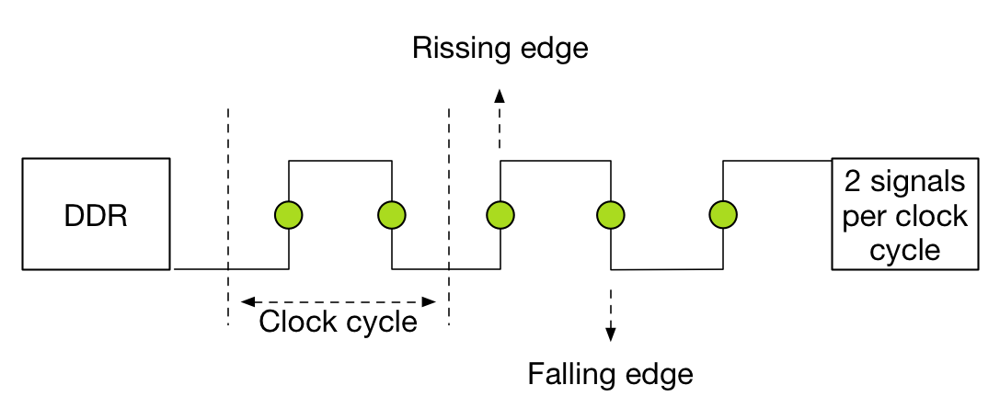

Please be aware that sometimes MT/s and MHz are used interchangeably. This is not correct! As mentioned above, the MT/s is normally twice of the I/O clock rate (MHz) due to the sampling, one transfer on the rising clock edge, and one transfer on the falling. Therefor it’s more interesting to calculate the theoretical bandwidth. The transfer rate itself does not specify the bit rate at which data is being transferred. To calculate the data transmission rate, one must multiply the transfer rate by the information channel width. The formula for a data transfer rate is:

请注意，有时 `MT/s` 和 `MHz` 可互换使用。这不对！如上所述，由于采样，`MT/s` 通常是 `I/O` 时钟速率（`MHz`）的两倍，在时钟上升沿上进行一次传输，在下降时进行一次传输。因此，计算理论带宽更有趣。传输速率本身不指定数据传输的比特率。要计算数据传输速率，必须将传输速率乘以信息信道宽度。数据传输率的公式为：

$$
Channel\  Width(\frac{bits}{transfer}) \times \frac{transfers}{second} = \frac{bits\space transferred}{second}
$$

This means that a 64-bit wide DDR3-1600 DIMM can achieve a maximum transfer rate of 12800 MB/s. To arrive at 12800 MB/s multiply the memory clock rate (200) by the bus clock multiplier (4) x data rate (2) = 1600 x number of bits transferred (64) = 102400 bits / 8 = 12800 MB/s

这意味着 `64位` 宽的 `DDR3-1600 DIMM` 可以实现 `12800 MB/s`的最大传输速率。达到 `12800 MB/s` 乘以总线时钟倍频（4）的内存时钟速率（200）x 数据速率（2）= 1600 x传输的位数（64）= 102400位/8 = 12800 MB/s

### Design considerations

Most popular DDR3 frequencies are DIMMs operating 1600 MHz, 1333 MHz and 1066 MHz. Many tests published on the net show on average 13% decline in memory bandwidth when dropping down from 1600 MHz to 1333 MHz. When using 3 DPC configuration, bandwidth drops down 29% when comparing 1066 MHz with 1600 MHz. It’s recommended to leverage LRDIMMS when spec’ing servers with large capacity memory configurations.

最受欢迎的DDR3频率是运行1600 MHz，1333 MHz和1066 MHz的DIMM。网上发布的许多测试显示，当从1600 MHz降至1333 MHz时，内存带宽平均下降13％。使用3 DPC配置时，将1066 MHz与1600 MHz进行比较时，带宽下降了29％。当指定具有大容量内存配置的服务器时，建议使用LRDIMMS。

If you want to measure the memory bandwidth on your system, Intel released the tool Intel® VTune™ Performance Analyzer.

如果要测量系统的内存带宽，英特尔发布了英特尔®VTune™性能分析器工具。

### Low Voltage

Low Voltage RAM is gaining more popularity recently. DDR3 RDIMMs require 1.5 volts to operate, low voltage RDIMMS require 1.35 volts. While this doesn’t sound much, dealing with hundreds of servers each equipped with 20 or more DIMM modules this can become a tremendous power saver. Unfortunately using less power results in a lower memory clock cycle of the memory bus. This leads to reduced memory bandwidth. Table xyx shows the memory bandwidth of low voltage DDR3 DIMMs compared to 1.5V DIMM rated voltage.

低压RAM最近越来越受欢迎。 DDR3 RDIMM需要1.5伏操作，低压RDIMMS需要1.35伏。虽然这听起来并不多，但是处理数百台服务器，每台服务器配备20个或更多DIMM模块，这可以成为一个巨大的节电器。不幸的是，使用较少的功率导致存储器总线的较低存储器时钟周期。这导致内存带宽减少。表xyx显示了低压DDR3 DIMM与1.5V DIMM额定电压的内存带宽。

*Table 2: Rated voltage and impact on memory bandwidth*

|DIMM Type|Ranking|Speed   |1 DPC 1.35V| 1 DPC 1.5V| 2 DPC 1.35V| 2 DPC 1.5V| 3 DPC 1.35V| 3 DPC 1.5V
|---------|-------|--------|-----------|-----------|------------|-----------|------------|--------------
|RDIMM    |SR/DR  |1600 MHz|N/A        | 1600      | N/A        | 1600      | N/A        | 1066
|RDIMM    |SR/DR  |1333 MHz|1333       | 1333      | 1333       | 1333      | N/A        | 1066
|RDIMM    |QR     |1333 MHz|800        | 1066      | 800        | 800       | N/A        | N/A
|LRDIMM   |QR     |1333 MHz|1333       | 1333      | 1333       | 1333      | 1066       | 1066

Low voltage RDIMMs cannot operate at the highest achievable speed as their 1.5V counterparts. Frequency fall-off is dramatic with Quad-ranked Low voltage operating at 800 MHz.

低压RDIMM不能以1.5V的速度运行在最高可达到的速度。四级低电压工作在800 MHz时，频率下降非常明显。

### ECC Memory

Error Checking and Correction (ECC) memory is essential in enterprise architectures. With the increased capacity and the speed at which memory operates, memory reliability is an utmost concern.

错误检查和更正（ECC）内存在企业体系结构中至关重要。随着容量和内存运行速度的提高，内存可靠性成为最令人担忧的问题。

DIMM Modules equipped with ECC contain an additional DRAM chip for every eight DRAM chips storing data. The memory controller to exploits is extra DRAM chip to record parity or use it for error correcting code. The error correcting code provides single bit error correction and double bit error detection (SEC-DED). When a single bit goes bad, ECC can correct this by using the parity to reconstruct the data. When multiple bits are generating errors, ECC memory detects this but is not capable to correct this.

配备ECC的DIMM模块包含一个额外的DRAM芯片，用于存储数据的每八个DRAM芯片。利用的存储器控​​制器是额外的DRAM芯片以记录奇偶校验或将其用于纠错码。纠错码提供单比特纠错和双比特错误检测（SEC-DED）。当单个位变坏时，ECC可以通过使用奇偶校验来重建数据来纠正此问题。当多个位产生错误时，ECC内存检测到此但无法纠正此错误。

The trade-off for protection of data loss is cost and performance reduction. ECC may lower memory performance by around 2–3 percent on some systems, depending on application and implementation, due to the additional time needed for ECC memory controllers to perform error checking.

保护数据丢失的权衡是成本和性能降低。由于ECC内存控制器执行错误检查所需的额外时间，ECC可能会在某些系统上降低2-3％的内存性能，具体取决于应用程序和实现。

Please note that ECC memory cannot be used in a system containing non-ECC memory.

请注意，ECC内存不能用于包含非ECC内存的系统。

## [Memory Deep Dive Series Part4 : Optimizing for Performance](http://frankdenneman.nl/2015/02/20/memory-deep-dive/)

This is part 4 of the memory deep dive. This is a series of articles that I wrote to share what I learned while documenting memory internals for large memory server configurations. This topic amongst others will be covered in the upcoming FVP book. The memory deep dive series:

这是记忆深度探索的第4部分。这是我写的一系列文章，分享我在记录大内存服务器配置的内存内部时所学到的内容。这篇主题将在即将出版的FVP书中介绍。记忆深潜系列：

* Part 1: Memory Deep Dive Intro
* Part 2: Memory subsystem Organisation
* Part 3: Memory Subsystem Bandwidth
* Part 4: Optimizing for Performance
* Part 5: DDR4 Memory
* Part 6: NUMA Architecture and Data Locality
* Part 7: Memory Deep Dive Summary

### Optimizing for Performance

The two primary measurements for performance in storage and memory are latency and throughput. Part 2 covered the relation between bandwidth and frequency. It is interesting to see how the memory components and the how the DIMMs are populated on the server board impact performance. Let’s use the same type of processor used in the previous example’s the Intel Xeon E5 2600 v2. The Haswell edition (v3) uses DDR4, which is covered in part 5.

存储和内存性能的两个主要衡量指标是延迟和吞吐量。第2部分介绍了带宽和频率之间的关系。有趣的是，了解内存组件以及如何在服务器主板上填充DIMM会影响性能。让我们使用上一个例子中的Intel Xeon E5 2600 v2中使用的相同类型的处理器。 Haswell版（v3）使用DDR4，第5部分对此进行了介绍。

### Processor Memory Architecture

The Intel E5 2600 family contains 18 different processors. They differ in number of cores, core frequency, amount of cache memory and CPU instruction features. Besides the obvious CPU metrics, system bus speed, memory types, and maximum throughput can differ as well. Instead of listing all 18, I selected three CPUs to show the difference. To compare all 18 processors of the 2600 family, please go to ark.intel.com

英特尔E5 2600系列包含18种不同的处理器。它们的核心数，核心频率，高速缓存和CPU指令功能不同。除了明显的CPU指标外，系统总线速度，内存类型和最大吞吐量也可能不同。我没有列出所有18个，而是选择了三个CPU来显示差异。要比较2600系列的所有18个处理器，请访问ark.intel.com

|Processor Model|System Bus speed|Max Memory Frequency|Max Memory Bandwidth|
|---------------|----------------|--------------------|--------------------|
|E5-2603 v2     |6.4 GT/s        |1333 MHz            |42.6 GB/s           |
|E5-2620 v2     |7.2 GT/s        |1600 MHz            |51.2 GB/s           |
|E5-2637 v2     |8 GT/s          |1866 MHz            |59.7 GB/s           |

Source: Ark.Intel.com

The system bus speed is important when communicating over the quick path interconnect (QPI) to the other CPU local memory resources. This is a crucial part of the performance of systems with a Non-Uniform Memory Access (NUMA). NUMA will be covered in part 6. Maximum memory frequency and maximum memory bandwidth are closely connected to each other (Review Part 3, Table 2 for Peak Transfer rate calculation).

在通过快速路径互连（QPI）与其他CPU本地存储器资源进行通信时，系统总线速度非常重要。这是具有非一致性内存访问（NUMA）的系统性能的关键部分。 NUMA将在第6部分中介绍。最大存储器频率和最大存储器带宽彼此紧密相连（回顾第3部分，表2，了解峰值传输速率计算）。

|Max Memory Frequency|Peak Transfer Rate|Channels|Max Memory Bandwidth|
|--------------------|------------------|--------|--------------------|
|1333 MHz            |10.6 GB/s         |4       |42.6 GB/s           |
|1600 MHz            |12.8 GB/s         |4       |51.2 GB/s           |
|1866 MHz            |14.9 GB/s         |4       |59.7 GB/s           |

### Interleaving across channels

Populating the memory channels equally allows the CPU to leverage its multiple memory controllers. When all four channels are populated the CPU interleaves memory access across the multiple memory channels. This configuration has the largest impact on performance and especially on throughput. To leverage interleaving optimally, the CPU creates regions. The memory controller groups memory across the channels as much as possible. When creating a 1 DIMM per Channel configuration, the CPU creates one region (Region 0) and interleaves the memory access.

同样填充内存通道允许CPU利用其多个内存控制器。当所有四个通道都被填充时，CPU在多个存储器通道上交错存储器访问。此配置对性能影响最大，尤其是吞吐量。为了最佳地利用交错，CPU创建区域。存储器控制器尽可能地跨通道对存储器进行分组。在为每个通道配置创建1个DIMM时，CPU会创建一个区域（区域0）并交叉存储器访问。

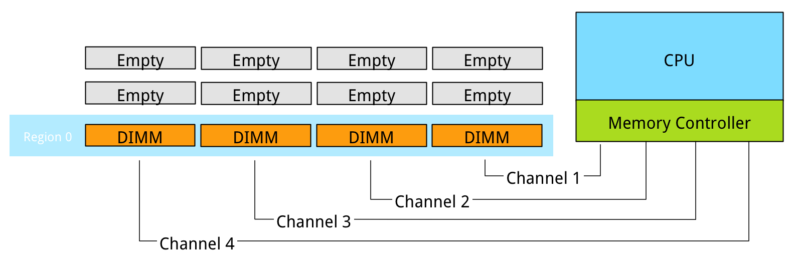

Populating four channels provide the best performance, however sometimes extra capacity is required, but not as much as four channels can provide. Populate the DIMMs in groups of two. For example if 384 GB is required and 32 GB DIMMs are used, populate each CPU with 6 DIMMS. The CPU will create two Regions.

填充四个通道可提供最佳性能，但有时需要额外容量，但不能提供四个通道。以两个为一组填充DIMM。例如，如果需要384 GB且使用32 GB DIMM，请使用6个DIMM填充每个CPU。 CPU将创建两个区域。

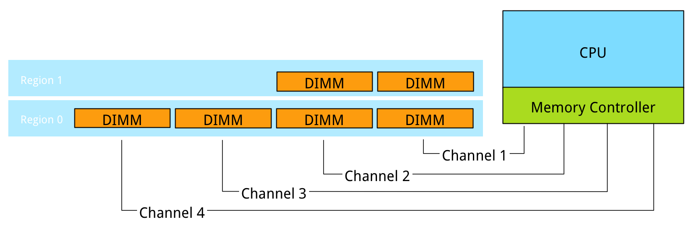

The CPU will interleave access to Region 2 across 2 channels. This will decrease the throughput of region 2.

CPU将跨两个通道交叉访问区域2。这将降低区域2的吞吐量。

### Interleaving across Ranks

Interleaving is continued from interleaving across the channels to interleaving across the ranks in a channel. This only occurs when using dual or quad rank DIMMs. If a channel is populated with mixed ranking DIMMS and a single rank DIMM is present, rank interleaving will revert back to 1-way interleaving. 1-way rank interleaving results in storing bits in a single DRAM chip until it’s at capacity before moving to another DRAM chip. Rank interleaving provides performance benefits as it provides the memory controller to parallelize the memory request. Typically it results in a better improvement of latency. However the performance difference between dual ranking and quad ranking is minute and comes only into play when squeezing out the very last ounce of performance. Try to avoid single rank DIMMs.

交叉继续从跨越信道的交织到跨信道中的阵列的交织。仅在使用双阵列或四阵列DIMM时才会出现这种情况。如果通道填充了混合阵列DIMM并且存在单列DIMM，则阵列交错将恢复为单向交错。单向阵列交错导致在单个DRAM芯片中存储位，直到它在移动到另一个DRAM芯片之前处于容量。阵列交错提供了性能优势，因为它提供了内存控制器来并行化内存请求。通常，它可以更好地改善延迟。然而，双重排名和四重排名之间的性能差异是微小的，并且在挤出最后一盎司的表现时才会发挥作用。尽量避免使用单列DIMM。

### Number of DIMMs per channel

When adding a single DIMM to each channel in the system, performance (read throughput) scales almost linearly until all eight channels are populated (4 channels per CPU x 2 CPU).

向系统中的每个通道添加单个DIMM时，性能（读取吞吐量）几乎呈线性缩放，直到填充所有八个通道（每个CPU 4个通道x 2个CPU）。

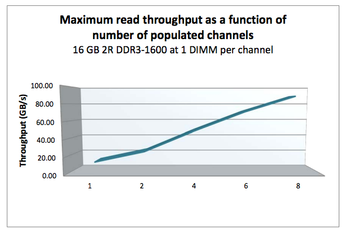

However when adding more DIMMs per channel, due to capacity requirement, throughput per DIMM decreases. When adding more DIMMs to the channel, the memory controller consumes more bandwidth for control commands. Basically you are increasing management overhead by adding more DIMM, reducing available bandwidth for read and write data. The creates a challenge whether the capacity can be solved by using higher capacity DIMMs or taking the throughput hit as more capacity is only obtainable by populating all slots. Populating the channels with 2 DIMMs (2 DPC) does not drastically impact throughput. The system allows to DIMMs to run in native speed. However it becomes interesting when choosing between 2 DPC and 3 DPC configurations.

但是，当每个通道添加更多DIMM时，由于容量要求，每个DIMM的吞吐量会降低。向通道添加更多DIMM时，内存控制器会为控制命令消耗更多带宽。基本上，您通过添加更多DIMM来增加管理开销，从而减少读取和写入数据的可用带宽。无论是通过使用更高容量的DIMM还是通过吞吐量来解决容量，都会产生挑战，因为只有通过填充所有插槽才能获得更多容量。使用2个DIMM（2个DPC）填充通道不会显着影响吞吐量。系统允许DIMM以本机速度运行。然而，在2个DPC和3个DPC配置之间进行选择时会变得很有趣。

|Vendor|DIMM Type|1 DPC   |2 DPC   |3 DPC   |
|------|---------|--------|--------|--------|
|HP    |1R RDIMM |1866 MHz|1866 MHz|1333 MHz|
|HP    |2R RDIMM |1866 MHz|1866 MHz|1333 MHz|
|Dell  |4R RDIMM |1333 MHz|1066 MHz|N/A     |
|HP    |4R LRDIMM|1866 MHz|1866 MHz|1333 MHz|

When creating a system with 384 GB of memory, each CPU has 12 slots, divided between 4 channels. Option 1 is to use 32GB LRDIMMs, populating 6 DIMM slots with a 32GB DIMM per CPU. The CPU will create two regions, region 0 interleaves across four channels, region 1 interleaves across 2 channels. Native speed remains the same. However some performance loss occurs due to some control management overhead and asymmetrical configuration. This configuration allows for future upgrade. If quad ranked RDIMMs were used, a total 128 GB ram could be added to the system, 32GB RDIMMs are quad ranked DIMMS, limiting the system to a 2 DPC configuration due to the maximum number or ranks. Quad Rank RDIMMs run at a lower clock cycle speed than LRDIMMs and reduce overal scale-up abilities due to the maximum rank limitation.

创建具有384 GB内存的系统时，每个CPU有12个插槽，分为4个通道。选项1是使用32GB LRDIMM，每个CPU填充6个DIMM插槽和32GB DIMM。 CPU将创建两个区域，区域0跨四个通道交错，区域1跨两个通道交错。本机速度保持不变。然而，由于一些控制管理开销和不对称配置而发生一些性能损失。此配置允许将来升级。如果使用四列RDIMM，则可以向系统添加总共128 GB的RAM，32GB RDIMM是四列DIMM，由于最大数量或等级，将系统限制为2 DPC配置。四列RDIMM以比LRDIMM更低的时钟周期速度运行，并且由于最大等级限制而降低了总体放大能力。

Option 2 is to use 16GB RDIMMs, all channels are populated achieving maximum interleaving, however the DIMMs are not able to run in native speed anymore and will be toggled to run at a lower speed. Instead of 1866 MHz they will run at 1333 MHz. 1866 MHz provides a maximum DIMM throughput of 14.9 GB/s, 1333 MHz a maximum throughput of 10.6 GB/s a drop of nearly 30%. This drop of performance is significant, therefor it should be taken into consideration when configuring the server memory.

选项2是使用16GB RDIMM，填充所有通道实现最大交错，但是DIMM不再能够以原生速度运行并且将切换为以较低速度运行。它们将以1333 MHz运行，而不是1866 MHz。 1866 MHz的最大DIMM吞吐量为14.9 GB / s，1333 MHz的最大吞吐量为10.6 GB / s，下降了近30％。这种性能下降很重要，因此在配置服务器内存时应该考虑到这一点。

Be cognisant of the scalability issues with ranking and the native speed drop off when moving towards a multi DPC configuration. The number of DIMM slots does not always mean that you can scale up to a certain capacity configuration. DDR3 LRDIMMs provide a great way to maximise capacity while retaining bandwidth. Begin 2014 DDR4 was released, providing higher density, better performance and decreased drop off rates when using multi DPC configurations.

在转向多DPC配置时，要了解排名和本机速度下降时的可扩展性问题。 DIMM插槽的数量并不总是意味着您可以扩展到某个容量配置。 DDR3 LRDIMM提供了一种在保持带宽的同时最大化容量的好方法。 2014年开始发布DDR4，在使用多DPC配置时提供更高的密度，更好的性能和更低的下降率。

## [Memory Deep Dive Series Part5 : DDR4 Memory](http://frankdenneman.nl/2015/02/25/memory-deep-dive-ddr4/)

This is part 5 of the memory deep dive. This is a series of articles that I wrote to share what I learned while documenting memory internals for large memory server configurations. This topic amongst others will be covered in the upcoming FVP book. The memory deep dive series:

这是深度记忆的第5部分。这是我写的一系列文章，分享我在记录大内存服务器配置的内存内部时所学到的内容。这篇主题将在即将出版的FVP书中介绍。记忆深潜系列：

* Part 1: Memory Deep Dive Intro
* Part 2: Memory subsystem Organisation
* Part 3: Memory Subsystem Bandwidth
* Part 4: Optimizing for Performance
* Part 5: DDR4 Memory
* Part 6: NUMA Architecture and Data Locality
* Part 7: Memory Deep Dive Summary

### DDR4

Released mid-2014, DDR4 is the latest variant of DDR memory. JEDEC is the semiconductor standardization body and published the DDR4 specs (JESD79-4) in September 2012. The standard describes that the per-pin data rate ranges from 1.6 gigatransfers per second to an initial maximum objective of 3.2 gigatransfers per second. However it states that it’s likely that higher performance speed grades will be added in the future.

DDR4是2014年中期发布的DDR内存的最新版本。 JEDEC是半导体标准化机构，于2012年9月发布了DDR4规范（JESD79-4）。该标准描述了每引脚数据速率范围从每秒1.6千兆传输到最初每秒3.2千兆传输的最大目标。但是它表示未来可能会增加更高性能的速度等级。

|DIMM Type|Data Rate|Module Name|Peak Transfer Rate|
|---------|---------|-----------|------------------|
|DDR3-800 |800 MT/s |PC-6400    |6400 MB/s         |
|DDR3-1066|1066 MT/s|PC-8500    |8533 MB/s         |
|DDR3-1333|1333 MT/s|PC-10600   |10600 MB/s        |
|DDR3-1600|1600 MT/s|PC-12800   |12800 MB/s        |
|DDR3-1866|1866 MT/s|PC-14900   |14933 MB/s        |
|DDR3-2133|2133 MT/s|PC-17000   |17064 MB/s        |
|DDR4-2400|2400 MT/s|PC-19200   |19200 MB/s        |
|DDR4-2666|2600 MT/s|PC-20800   |20800 MB/s        |
|DDR4-2800|2800 MT/s|PC-22400   |22400 MB/s        |
|DDR4-3000|3000 MT/s|PC-24000   |17066 MB/s        |
|DDR4-3200|3200 MT/s|PC-25600   |25600 MB/s        |

We are now two years further and DDR4 is the quickly becoming the standard of generic server hardware due to the use of the new Intel Xeon E5 v3 processor with the Haswell-E micro-architecture. This micro-architecture uses DDR4 exclusively. AMD’s upcoming Zen micro-architecture is expected to support DDR4. Zen is expected to appear on the market late 2016.

我们现在已经两年了，由于使用了带有Haswell-E微架构的全新英特尔至强E5 v3处理器，DDR4正迅速成为通用服务器硬件的标准。这种微架构专门使用DDR4。 AMD即将推出的Zen微架构有望支持DDR4。 Zen预计将于2016年底上市。

Note that the pin-layout of DDR4 is different from DDR3. Not only is the key notch at a different location on the PCB, the pin size and arrangement is different as well. Towards the middle of the PCB, there is a change gradient, making some pins longer:

请注意，DDR4的引脚布局与DDR3不同。不仅PCB上不同位置的键槽，引脚尺寸和布置也不同。在PCB的中间，有一个变化梯度，使一些引脚更长：

Besides the higher data rate transfer speeds, DDR4 offers higher module density. While DDR3 DRAM chip contains 8 internal banks, DDR4 can contain up to 16 internal banks. The DDR4 standard allows up to 128GB per DIMM, allowing extreme high-density memory configurations. Another major improvements is memory power consumption. DDR4 memory operates at a lower voltage than DDR3. DDR4 modules typically require 1.2 volts with a frequency between 2133MHz and 4266MHz. As a comparison; DDR3 operates between 800 and 2400 MHz with a voltage requirement between 1.5 and 1.65V. DDR3 Low voltage can operates at 800 MHz while requiring 1.35V. DDR4 performance better at a lower voltage, low voltage DDR4 is not yet announced but it’s estimated to operate at 1.05 volts.

除了更高的数据速率传输速度外，DDR4还提供更高的模块密度。虽然DDR3 DRAM芯片包含8个内部存储体，但DDR4最多可包含16个内部存储体。 DDR4标准允许每个DIMM高达128GB，允许极高密度的内存配置。另一项重大改进是内存功耗。 DDR4内存的工作电压低于DDR3。 DDR4模块通常需要1.2伏特，频率在2133MHz和4266MHz之间。作为比较; DDR3工作在800和2400 MHz之间，电压要求在1.5和1.65V之间。 DDR3低电压可在800 MHz下工作，同时需要1.35V。 DDR4性能更好，电压更低，低电压DDR4尚未公布，但估计其工作电压为1.05伏。

### Latency

As mentioned in part 4, the two primary measurements for performance in storage and memory are latency and throughput. Interestingly enough, memory bandwidth increases with every generation, however latency does not always improve immediately. Actually every generation of memory moves the performance dial backwards when comparing latency with its predecessor.

如第4部分所述，存储和内存性能的两个主要测量是延迟和吞吐量。有趣的是，内存带宽随着每一代的增加而增加，但延迟并不总是立即提高。实际上，在将延迟与其前身进行比较时，每一代内存都会向后移动性能拨号。

Why does latency lag behind bandwidth? Moore’s law is a big factor. Moore’s law helps bandwidth more than latency as transistors become faster and smaller. This allows the memory vendor to place more transistors on the board. More transistors means more pins, means more bandwidth, but it also means that the communication traverses longer lines. The size of the DRAM chip increases as well, resulting in longer bit and word lines. It basically comes down to distance and as you are all well aware of, distance is a big factor when it comes to latency.

为什么延迟滞后于带宽？摩尔定律是一个重要因素。随着晶体管变得越来越小，摩尔定律有助于带宽而不是延迟。这允许存储器供应商在电路板上放置更多晶体管。更多的晶体管意味着更多的引脚，意味着更多的带宽，但它也意味着通信遍历更长的线路。 DRAM芯片的尺寸也增加，导致比特和字线更长。它基本上归结为距离，而且你很清楚，距离是延迟的一个重要因素。

The interesting part is that memory bandwidth is a factor of latency. Latency is a generic term, when reviewing the latency and bandwidth relationship, one has to review unloaded and loaded latencies. Memory latency is measured from the moment the CPU issues a read request to the moment the memory supplies it to the core. This is referred to as load to use.

有趣的是，内存带宽是延迟的一个因素。延迟是一个通用术语，在查看延迟和带宽关系时，必须检查卸载和加载的延迟。内存延迟是从CPU发出读取请求的那一刻到内存将其提供给内核的那一刻开始测量的。这被称为负载使用。

However the load to use latencies differ when the memory system is idle or when it’s saturated. Unloaded latency is a measurement of an idle system and it represents the lowest latency that the system can achieve. A well-known indicator of memory latency is the CAS timings (Column Address Strobe) and it represents the unloaded latency. Basically it demonstrates the most optimal scenario. CAS timings is a good way to understand the relative latency between two memory DIMMS, however it does not always indicate the real world performance of a system.

但是，当内存系统空闲或饱和时，使用延迟的负载会有所不同。卸载延迟是对空闲系统的度量，它表示系统可以实现的最低延迟。众所周知的内存延迟指标是CAS时序（列地址选通），它代表卸载的延迟。基本上它展示了最佳方案。 CAS时序是理解两个内存DIMM之间相对延迟的好方法，但它并不总是表明系统的真实性能。

Loaded latency is the latency when the memory subsystem is saturated with memory request and that’s where bandwidth has a positive impact on real world latency. Under loaded conditions memory requests spend time in the queue, the more bandwidth speed the memory has, the more quickly the memory controller can process the queued commands. For example, memory running at 1600 MHz has about 20% lower loaded latency than memory running at 1333 MHz. Loaded latency is the real world measurement of performance applications will experience, having bandwidth speed to reduce loaded latency is important when reviewing the DPC configuration (part 4) of your server configuration. Ranks will also have a positive impact on the loaded latency (lower latency). Having more ranks allows the memory controller to empty out its queue’s by parallelize the process of memory requests. Parallelization is covered in part 4 of this series.

加载延迟是内存子系统内存请求饱和时的延迟，也就是带宽对实际延迟产生积极影响的延迟。在加载条件下，内存请求在队列中花费时间，内存带宽越快，内存控制器处理排队命令的速度就越快。例如，运行在1600 MHz的内存比1333 MHz运行的内存的加载延迟低约20％。加载延迟是性能应用程序将体验到的真实世界度量，在查看服务器配置的DPC配置（第4部分）时，具有带宽速度以减少加载延迟非常重要。排名也将对加载的延迟（较低的延迟）产生积极影响。拥有更多排名允许内存控制器通过并行化内存请求进程来清空其队列。本系列的第4部分介绍了并行化。

### Bandwidth and CAS Timings

The memory area of a memory bank inside a DRAM chip is made up of rows and columns. To access the data, the chip needs to be selected, then the row is selected, and after activating the row the column can be accessed. At this time the actual read command is issued. From that moment onwards to the moment the data is ready at the pin of the module, that is the CAS latency. Its not the same as load to use as that is the round trip time measured from a CPU perspective.

DRAM芯片内的存储体的存储区由行和列组成。要访问数据，需要选择芯片，然后选择行，并且在激活行之后，可以访问该列。此时发出实际的读命令。从那一刻起到数据在模块引脚处就绪的那一刻，即CAS延迟。它与使用的负载不同，因为从CPU角度测量的往返时间。

CAS latencies (CL) increase with each new generation of memory, but as mentioned before latency is a factor of clock speed as well as the CAS latency. Generally a lower CL will be better, however they are only better when using the same base clock. If you have faster memory, higher CL could end up better. When DDR3 was released it offered two speeds, 1066MHz CL7 and 1333 MHz CL8. Today servers are equipped with 1600 MHz CL9 memory.DDR4 was released with 2133 MHz CL13. However 2133 MHz CL15 is available at the major server vendors. To work out the unloaded latency is: (CL/Frequency) * 2000.

CAS延迟（CL）随着每一代新内存的增加而增加，但如前所述，延迟是时钟速度和CAS延迟的一个因素。通常较低的CL会更好，但是在使用相同的基本时钟时它们只会更好。如果你有更快的内存，更高的CL可能会更好。当DDR3发布时，它提供了两种速度，1066MHz CL7和1333 MHz CL8。今天服务器配备1600 MHz CL9内存.DDR4发布时带有2133 MHz CL13。但是，主要服务器供应商提供2133 MHz CL15。计算出卸载的延迟是：（CL /频率）* 2000。

This means that 1600 MHz CL9 provides an unloaded latency of 11.25ns, while 2133 MHz CL15 provides an unloaded latency of 14.06ns. A drop of 24.9%. However DDR4 latency will drop when bandwidth increases faster then the increase of CAS latency. At the time of writing “prosumer” DDR4 memory is available at higher speeds than the server vendors offer, but it’s just a matter of time before those modules become available for server hardware. Many memory vendors offer DDR4 2800 MHz CL14 to CL 16. When using the same calculation, 2800 MHz CL16 provides an unloaded latency of (16/2800) * 2000 = 11.42ns. Almost the same latency at DDR3 1600 MHz CL9! 2800 MHZ CL14 provides an unloaded latency of 10ns, meaning that CL14 beating CL9 with a lower latency while providing more than 75% bandwidth.

这意味着1600 MHz CL9提供11.25ns的无负载延迟，而2133 MHz CL15提供14.06ns的无负载延迟。下跌24.9％。但是，当带宽增加的速度快于CAS延迟的增加时，DDR4延迟将下降。在撰写“prosumer”时，DDR4内存的速度比服务器厂商提供的速度更快，但这些模块可用于服务器硬件只是时间问题。许多内存供应商提供DDR4 2800 MHz CL14至CL 16.当使用相同的计算时，2800 MHz CL16提供（16/2800）* 2000 = 11.42ns的无负载延迟。 DDR3 1600 MHz CL9的延迟几乎相同！ 2800 MHZ CL14提供10ns的空载延迟，这意味着CL14以较低的延迟击败CL9，同时提供超过75％的带宽。

### LRDIMMs

When LRDIMMs were introduced, they delivered higher capacity at the expense of lower bandwidth and higher latency. With the introduction of the new memory controller of Intel Xeon v2, the bandwidth drop was reduced and latency was slightly improved. However still not up to the standards of registered DIMMs. The screenshot below, originating from the IDT DDR4 LRDIMM white paper, shows the bandwidth drops of LRDIMM and RDIMMs in the three Intel Xeon architectures. On the far right the Intel Xeon v1 (Sandy Bridge) is shown, the middle graph shows the Intel Xeon v2 (Ivy Bridge) and the left is the Intel Xeon v3 (Haswell-E microachitecture).

当引入 LRDIMM 时，它们以更低的带宽和更高的延迟为代价提供更高的容量。随着英特尔至强v2的新内存控制器的推出，带宽下降减少，延迟略有改善。但仍未达到已注册DIMM的标准。下面的屏幕截图来自IDT DDR4 LRDIMM白皮书，显示了三种Intel Xeon架构中LRDIMM和RDIMM的带宽下降。在最右侧显示Intel Xeon v1（Sandy Bridge），中间的图表显示Intel Xeon v2（Ivy Bridge），左侧是Intel Xeon v3（Haswell-E microachitecture）。

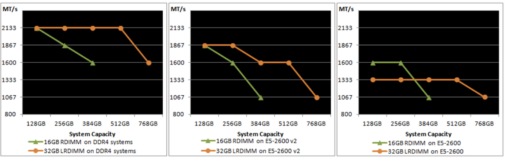

The reason why latency is higher in LRDIMM architecture is due to the use of the memory buffer. The fastest way is always a direct line, with unbuffered DIMMs, the memory controller communicates directly with the DRAM chip. The drawback of this architecture is described in part 2. With registered DIMMs, the memory controller sends control and management messaging to the register but still fetches data straight from the DRAM chip.

LRDIMM架构中延迟较高的原因是由于使用了内存缓冲区。最快的方式始终是直接线路，使用无缓冲的DIMM，存储器控制器直接与DRAM芯片通信。在第2部分中描述了该体系结构的缺点。对于已注册的DIMM，存储器控制器将控制和管理消息发送到寄存器，但仍然直接从DRAM芯片获取数据。

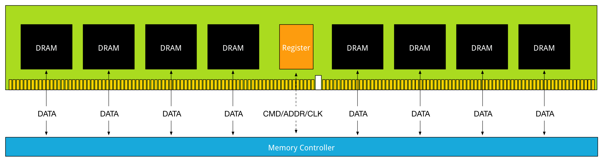

DDR3 Load Reduced DIMMs, use a memory buffer for all communication, including data. That means that the distance of data travel, typically referred to as trace lengths is much longer.

DDR3负载减少DIMM，使用内存缓冲区进行所有通信，包括数据。这意味着数据传播的距离（通常称为跟踪长度）要长得多。

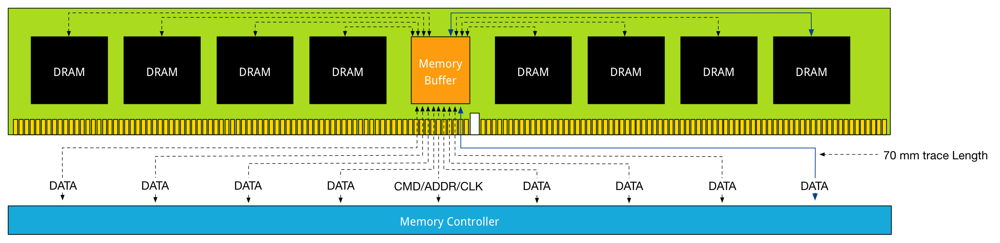

Distance is the enemy of latency; therefore DDR4 LRDIMMs leverage data buffers close to the DRAM chips to reduce the I/O trace lengths. With DDR3 LRDIMMs, a trace length is up to 77 millimeter. DDR4 LRDIMM trace lengths are claimed to be between 2 and 8 millimeter.

距离是潜伏的敌人;因此DDR4 LRDIMM利用靠近DRAM芯片的数据缓冲区来减少I / O走线长度。使用DDR3 LRDIMM，走线长度可达77毫米。据称DDR4 LRDIMM走线长度在2到8毫米之间。

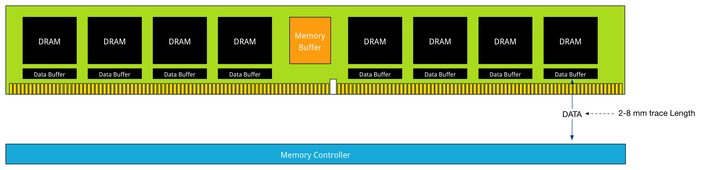

This reduces the added latency tremendously. DDR4 LRDIMMs trace lengths are comparable to DDR4 RDIMM trace lengths. Where in DDR3 the added component latency of the memory buffer is approximately 2.5 ns when compared to an RDIMM, the component delay of DDR4 LRDIMM is approximately 1.2 ns. DDR4 uses smaller memory buffers with an improved buffering scheme to decrease the latency even further. The reduction of trace lengths decreases the impact on signal integrity, which in turn allows DDR4 DIMMs to operate at a higher bandwidth when using 3DPC configuration.

这极大地减少了增加的延迟。 DDR4 LRDIMM的走线长度与DDR4 RDIMM走线长度相当。在DDR3中，与RDIMM相比，存储器缓冲器的附加组件延迟大约为2.5 ns，DDR4 LRDIMM的组件延迟大约为1.2 ns。 DDR4使用较小的内存缓冲区和改进的缓冲方案，以进一步降低延迟。缩短走线长度可降低对信号完整性的影响，从而使DDR4 DIMM在使用3DPC配置时能够以更高的带宽工作。

Anandtech.com compared the memory bandwidth of RDIMMs against LRDIMM in various DPC configurations

Anandtech.com在各种DPC配置中将RDIMM的内存带宽与LRDIMM进行了比较

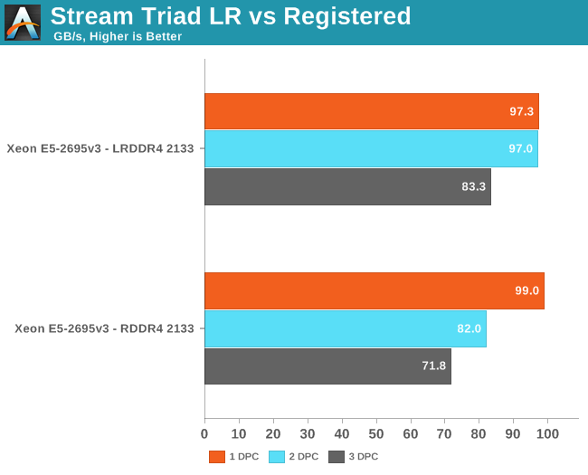

Anandtech.com noted the following:

Anandtech.com注意到以下内容：

*Registered DIMMs are slightly faster at 1 DPC, but LRDIMMs are clearly faster when you insert more than one DIMM per channel. We measured a 16% to 18% difference in performance. It’s interesting to note that LRDIMMs are supposed to run at 1600 at 3DPC according to Intel’s documentation, but our bandwidth measurement points to 1866. The command “dmidecode -type 17” that reads out the BIOS confirmed this.*

*在1 DPC上注册的DIMM稍快一些，但是当您为每个通道插入多个DIMM时，LRDIMM显然更快。我们测量了16％到18％的性能差异。值得注意的是，根据英特尔的文档，LRDIMM应该在1600的3DPC上运行，但我们的带宽测量指向1866.读取BIOS的命令“dmidecode -type 17”证实了这一点。*

Article: [Intel Xeon E5 Version 3: Up to 18 Haswell EP Cores by Johan De Gelas](http://www.anandtech.com/show/8423/intel-xeon-e5-version-3-up-to-18-haswell-ep-cores-)

By using a buffer for each DRAM chip the latency overhead is thus significantly lower on DDR4 LRDIMMs. Compared to RDIIMMs at the same speed with 1 DPC the latency overhead will be small, but as soon as more DIMMS per channel are used, the LRDIMMs actually offer lower latency as they run at higher bus speeds.

通过为每个DRAM芯片使用缓冲器，因此DDR4 LRDIMM上的延迟开销显着降低。与具有1个DPC的相同速度的RDIIMM相比，延迟开销将很小，但是一旦使用每个通道更多的DIMM，LRDIMM实际上提供了更低的延迟，因为它们以更高的总线速度运行。

### DDR4 in the real world

Although DDR4 has to fight the perception of much slower memory, real world use need to prove this otherwise. I hope this article proved that just looking as CAS Latency numbers is a futile exercise. Memory speed is a factor in determining latency, and loaded latency (saturated system) is something enteprise applications will experience more than an idle fully unloaded system. High density, high bandwidth configurations that sustain their bandwidth is the real benefit of DDR4. DDR4 memory in general can cope with multi-DPC much better than their counterparts of the previous generation. As more DIMMs are populated the speed typically falls due to previous described electrical load on the memory controller. Multi-DPC frequency fall-off is less steep. Unfortunately at the time of writing DDR4 is still in a premium price range, however its expected to see a decline in price at the end of 2015 making it an interesting choice as a resource for both virtual machine memory and storage acceleration.

虽然DDR4必须对抗更慢内存的感觉，但现实世界的使用需要证明这一点。我希望这篇文章证明只是看CAS延迟数是徒劳的。内存速度是决定延迟的一个因素，加载延迟（饱和系统）是企业应用程序将比闲置的完全卸载系统更多的体验。支持带宽的高密度，高带宽配置是DDR4的真正优势。 DDR4内存通常可以比上一代产品更好地应对多DPC。随着更多的DIMM被填充，速度通常由于先前描述的存储器控​​制器上的电负载而下降。多DPC频率衰减不那么陡峭。不幸的是，在撰写本文时，DDR4仍处于高端价格区间，但预计2015年底价格会下降，这使其成为虚拟机内存和存储加速资源的有趣选择。

## [Memory Deep Dive Series Part6 : NUMA Architecture and Data Locality](http://frankdenneman.nl/2015/02/27/memory-deep-dive-numa-data-locality/)

This is part 6 of the memory deep dive. This is a series of articles that I wrote to share what I learned while documenting memory internals for large memory server configurations. This topic amongst others will be covered in the upcoming FVP book. The memory deep dive series:

这是深度记忆的第6部分。这是我写的一系列文章，分享我在记录大内存服务器配置的内存内部时所学到的内容。这篇主题将在即将出版的FVP书中介绍。记忆深潜系列：

* Part 1: Memory Deep Dive Intro
* Part 2: Memory subsystem Organisation
* Part 3: Memory Subsystem Bandwidth
* Part 4: Optimizing for Performance
* Part 5: DDR4 Memory
* Part 6: NUMA Architecture and Data Locality
* Part 7: Memory Deep Dive Summary

### Background of multiprocessor architectures

Moore’s law is often misquoted, linking the increase of transistor count to the increase of speed. According Wikipedia Moore’s law is:

摩尔定律经常被错误引用，将晶体管数量的增加与速度的增加联系起来。根据维基百科摩尔定律是：

*An observation made by Intel co-founder Gordon Moore in 1965. He noticed that the number of transistors per square inch on integrated circuits had doubled every year since their invention. Moore’s law predicts that this trend will continue into the foreseeable future.*

*英特尔联合创始人戈登·摩尔于1965年发表的一项观察结果。他注意到，自发明以来，集成电路每平方英寸的晶体管数量每年翻了一番。摩尔定律预测，这种趋势将持续到可预见的未来。*

The interesting thing is that Moore’s law is still applicable to this day. The transistor count has been increasing every year, however the speed increase was barely doubled in the last decade. From 2000 to 2009, the CPU speed went from 1.3 GHz to 2.8 GHz. Transistor-count on the other hand increased from 37.5 million in 2000 to 904 million in 2009. This means that translator count does not automatically translate in raw CPU speed increase. For that we have to get back to 2004 where the heat build-up in the chips cause Intel to abandon the consistent speed improvement and move towards a design with multiple processor (cores) on the same CPU chip. The industry followed soon after.

有趣的是，摩尔定律至今仍适用。晶体管数量每年都在增加，但在过去十年中，速度增长几乎没有增加一倍。从2000年到2009年，CPU速度从1.3 GHz增加到2.8 GHz。另一方面，晶体管数量从2000年的3750万增加到2009年的9.04亿。这意味着翻译计数不会自动转换为原始CPU速度的增加。为此，我们必须回到2004年，芯片中的热量积聚导致英特尔放弃一致的速度提升，并在同一CPU芯片上采用多处理器（内核）设计。不久后，该行业紧随其后。

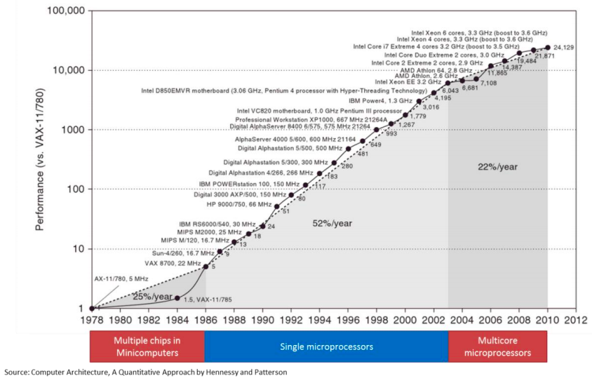

This fundamental shift in hardware design had a profound impact on software performance. Previously, faster CPU speeds translated directly into faster application performance. When switching to multi-core design, only software that could take advantage of multiple processors would get this benefit.

硬件设计的这种根本性转变对软件性能产生了深远的影响。以前，更快的CPU速度直接转化为更快的应用程序性能。当切换到多核设计时，只有可以利用多个处理器的软件才能获得这种优势。

### Importance of memory architecture

The importance of the memory architecture has increased with the advances in performance and architecture in CPU. The shows the gap in performance, measured as the difference in the time between processor memory requests (for a single processor or core) and the latency of a DRAM access, is plotted over time.

随着CPU性能和架构的进步，内存架构的重要性也在增加。显示了性能差距，测量为处理器内存请求（单个处理器或核心）与DRAM访问延迟之间的时间差异随时间的变化。

The interesting thing is the plateauing performance of CPU from 2004 and onwards. This due to the increase of core count instead of CPU clock speed. This development increases the bandwidth requirements even more. The aggregate peak bandwidth essentially grows as the number of cores grows.

有趣的是从2004年开始，CPU的平稳性能。这是由于核心数量的增加而不是CPU时钟速度的增加。这种发展进一步增加了带宽需求。总峰值带宽基本上随着核心数量的增长而增长。

Simply put, we can process data faster than ever, but we can’t get that data faster. To battle this, CPU design has been focusing on parallel memory architectures, and specifically the attempt to keep the data as close to the executing core as possible.

简而言之，我们可以比以往更快地处理数据，但我们无法更快地获得数据。为了解决这个问题，CPU设计一直专注于并行存储器架构，特别是尽可能保持数据尽可能接近执行核心的尝试。

### Parallel Memory Architecture

Two major parallel memory architectures exist: Distributed Memory Architecture and Shared Memory Architecture. Shared Memory Architecture is split up in two types: Uniform Memory Access (UMA), and Non-Uniform Memory Access (NUMA). Distributed Memory Architecture is an architecture used in clusters, with different hosts connected over the network typically without cache coherency. Shared Memory Architecture is a layout of processors and memory inside a server. With UMA memory is shared across all CPUs. To access memory, the CPUs have to access a Memory Controller Hub (MCH). This type of architecture is limited on scalability, bandwidth and latency. The MCH is connected to an I/O controller across a bus, this bus has finite speed and for any communication the CPUs need to take control of the bus, which leads to contention problems. UMA does not scale after a certain number of processors.

存在两种主要的并行存储器架构：分布式存储器架构和共享存储器架构。共享内存架构分为两种类型：一致性内存访问（UMA）和非一致性内存访问（NUMA）。分布式内存体系结构是一种在集群中使用的体系结构，通过网络连接不同的主机，通常没有缓存一致性。共享内存架构是服务器内处理器和内存的布局。 UMA内存在所有CPU之间共享。要访问内存，CPU必须访问内存控制器中枢（MCH）。这种类型的架构受可扩展性，带宽和延迟的限制。 MCH通过总线连接到 I/O 控制器，该总线具有有限的速度，并且对于任何通信，CPU 需要控制总线，这导致争用问题。在一定数量的处理器之后，UMA不会扩展。

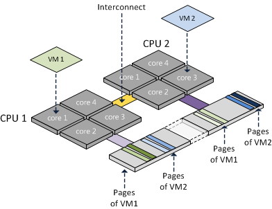

To solve latency, bandwidth and scalability NUMA was introduced. NUMA moves away from a centralized pool of memory and introduces topological properties. By classifying location bases on signal path length from the processor to the memory, latency and bandwidth bottlenecks can be avoided. With NUMA memory is directly attached to the CPU and this is considered to be local. Memory connected to another CPU socket is considered to be remote. Remote memory access has additional latency overhead to local memory access, as it has to traverse the interconnect and connect to the remote memory controller. As a result of the different locations memory can exists, this system experiences “non-uniform” memory access time.

为了解决延迟，带宽和可扩展性，引入了NUMA。 NUMA远离集中的内存池并引入拓扑属性。通过将位置基于从处理器到存储器的信号路径长度分类，可以避免等待时间和带宽瓶颈。NUMA内存直接连接到CPU，这被认为是本地的。连接到另一个 CPU 插槽的内存被认为是远程的。远程内存访问对本地内存访问具有额外的延迟开销，因为它必须遍历互连并连接到远程内存控制器。由于存在不同位置的存储器，该系统经历“非均匀”存储器访问时间。

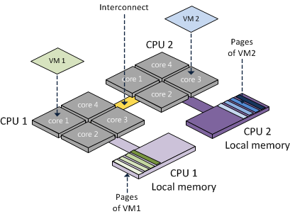

Keeping the memory access local or maximizing memory locality provides the best performance. However due to CPU load balancing in the hypervisor layer it can happen that local memory becomes remote memory. Designing the server that retains the highest bandwidth while offering the highest capacity is key with NUMA configurations.

保持内存访问本地或最大化内存位置可提供最佳性能。但是，由于虚拟机管理程序层中的CPU负载平衡，本地内存可能会成为远程内存。在提供最高容量的同时设计保留最高带宽的服务器是NUMA配置的关键。

### NUMA scheduling

ESXi is NUMA aware and has its own NUMA scheduling. When you think about it, how would you characterize NUMA? You want to keep the memory as close to the CPU instruction as possible, so it would make sense to consider it a memory scheduler. Within ESXi it’s a part of the CPU scheduler and this explains the focus of NUMA scheduler. As CPU load balancing across the NUMA nodes is crucial to performance, the emphasis of the NUMA scheduler is to achieve a more balanced CPU load.

ESXi可识别NUMA并具有自己的NUMA调度。当你想到它时，你会如何描述NUMA？您希望将内存尽可能地靠近CPU指令，因此将其视为内存调度程序是有意义的。在ESXi中，它是CPU调度程序的一部分，这解释了NUMA调度程序的重点。由于NUMA节点上的CPU负载平衡对性能至关重要，因此NUMA调度程序的重点是实现更平衡的CPU负载。

When a virtual machine is powered on, the NUMA schedule assigns a home node. A home node, typically referred to as NUMA node, is the set of CPU and its local memory. In an ideal situation the NUMA node provides the CPU and memory resources the virtual machine requires. The NUMA scheduler tries to load balance all virtual machines across the NUMA nodes in the server. The administrator can help the NUMA scheduler by right sizing the virtual machine, attempt to keep the memory footprint within the capacity of a single NUMA node. However when multiple virtual machines run on a server, it can happen that no optimal distribution of virtual machines can be obtained where each virtual machine working set can fit into their local NUMA node. When a virtual machine has a certain amount of memory located remote, the NUMA scheduler migrates it to another NUMA node to improve locality. It’s not documented what threshold must be exceeded to trigger the migration, but its considered poor memory locality when a virtual machine has less than 80% mapped locally. My “educated” guess is that it will be migrated when it’s below the 80%. ESXTOP memory NUMA statistics show the memory location of each virtual machine. Start ESXTOP, press m for memory view, press f for customizing ESXTOP and press f to select the NUMA Statistics.

当虚拟机启动时，NUMA调度分配主节点。主节点（通常称为NUMA节点）是CPU及其本地存储器的集合。在理想情况下，NUMA节点提供虚拟机所需的CPU和内存资源。 NUMA调度程序尝试对服务器中NUMA节点上的所有虚拟机进行负载平衡。管理员可以通过正确调整虚拟机大小来帮助NUMA调度程序，尝试将内存占用量保持在单个NUMA节点的容量内。但是，当在服务器上运行多个虚拟机时，可能会发生无法获得虚拟机的最佳分布，其中每个虚拟机工作集可以适合其本地NUMA节点。当虚拟机具有一定数量的远程内存时，NUMA调度程序会将其迁移到另一个NUMA节点以改善位置。没有记录触发迁移必须超过的阈值，但是当虚拟机本地映射少于80％时，其被认为是较差的内存位置。我的“受过教育”的猜测是，当它低于80％时，它将被迁移。 ESXTOP内存NUMA统计信息显示每个虚拟机的内存位置。启动ESXTOP，按m查看内存视图，按f键自定义ESXTOP，按f键选择NUMA Statistics。

Memory locality rate can be input for sizing the memory capacity of the server. DIMM type, capacity and DPC configuration need to be taken into account to maintain high throughput values.

可以输入内存位置速率以调整服务器的内存容量。需要考虑DIMM类型，容量和DPC配置以维持高吞吐量值。

### Importance of Interconnect Bandwidth

CPU load varies dynamically and can cause CPU load imbalance between the NUMA nodes. This can trigger the NUMA scheduler to rebalance every couple of seconds (I believe the NUMA scheduler checks every 4 seconds). However unlike vCPUs, memory migrates very slowly because of the cost involved of bandwidth consumption and address mappings updates. VCPUs are nimble and can bounce around the NUMA nodes quite frequently, the last thing you want to do is to migrate memory after every vCPU migration. To solve this, the NUMA scheduler initiates memory migration at a slow pace until the vCPU stops migration and stays on a NUMA node for a long period of time. Once determined the vCPU is settled, the memory migration is accelerated to achieve locality again. This behavior increases the importance of the interconnect bandwidth of a CPU when designing the server platform. With Intel the interconnect is called Intel QuickPath Interconnect, HyperTransport is the name of AMD interconnect technology (HTX 3.1 spec)

CPU负载动态变化，可能导致NUMA节点之间的CPU负载不平衡。这可以触发NUMA调度程序每隔几秒重新平衡一次（我相信NUMA调度程序每4秒检查一次）。但是，与vCPU不同，由于带宽消耗和地址映射更新所涉及的成本，内存迁移速度非常慢。 VCPU非常灵活，可以非常频繁地在NUMA节点周围反弹，您要做的最后一件事是在每次vCPU迁移后迁移内存。为解决此问题，NUMA调度程序以缓慢的速度启动内存迁移，直到vCPU停止迁移并长时间停留在NUMA节点上。一旦确定vCPU已确定，则加速内存迁移以再次实现位置。在设计服务器平台时，此行为会增加CPU的互连带宽的重要性。英特尔的互连称为Intel QuickPath Interconnect，HyperTransport是AMD互连技术的名称（HTX 3.1规范）

Intel categorizes their CPU into roughly five segments: Basic, Standard, Advanced, Segmented Optimized and Low Power.

英特尔将CPU分为大致五个部分：基本，标准，高级，分段优化和低功耗。

|Processor Model|QPI Bandwidth|Max Memory Frequency|Max Memory Bandwidth|
|---------------|-------------|--------------------|--------------------|
|E5-2603 v3     |6.4 GT/s     |1600 MHz            |51 GB/s             |
|E5-2620 v3     |8 GT/s       |1866 MHz            |59 GB/s             |
|E5-2637 v3     |9.6 GT/s     |2133 MHz            |68 GB/s             |

The QPI is configured as a link pair, two unidirectional paths exists between the CPU’s. As the links can be simultaneously active, it doubles the bandwidth spec. A clock rate of 4.0 GHz yields a data rate of 32 GB/s.

QPI配置为链路对，CPU之间存在两条单向路径。由于链路可以同时处于活动状态，因此它可以使带宽规格加倍。时钟速率为4.0 GHz，数据速率为 32 GB/s。

|QPI Transfer Speed|Clock Rate|Unidirectional Bandwidth|Total Bandwidth|
|------------------|----------|------------------------|---------------|
|6.4 GT/s          |3.20 GHz  |12.8 GB/s               |25.6 GB/s      |
|8 GT/s            |4.0 GHz   |16.0 GB/s               |32.0 GB/s      |
|9.6 GT/s          |4.80 GHz  |19.2 GB/s               |38.4 GB/s      |

Although QPI bandwidth is increased with every new CPU generation, it lags in comparison with local memory bandwidth. Increasing memory capacity and CPU count should help to reduce remote memory access. This of course with right sizing the virtual machine to the application work set however as experience taught me, sometimes the political forces are stronger than financial constraints.

尽管随着每一代新CPU的出现，QPI带宽都会增加，但与本地内存带宽相比，它会滞后。增加内存容量和CPU数量应有助于减少远程内存访问。当然，正如经验告诉我的那样，正确地将虚拟机调整到应用程序工作集，有时政治力量比财务约束更强。

### Local memory optimization

Optimization is done across different axes. Care must be taken when configuring capacity, previous parts of this memory deep dive covered bandwidth reduction of DIMMs Per Channel Configuration. Intel Xeon v3 follows the following spec:

跨不同轴进行优化。配置容量时必须小心，此内存的先前部分深入介绍了每通道配置DIMM的带宽减少。 Intel Xeon v3遵循以下规范：

|DIMM Type|1 DPC   |2 DPC   |3 DPC   |
|---------|--------|--------|--------|
|1R RDIMM |2133 MHz|1866 MHz|1600 MHz|
|2R RDIMM |2133 MHz|1866 MHz|1600 MHz|
|4R RDIMM |2133 MHz|1866 MHz|N/A     |
|4R LRDIMM|2133 MHz|2133 MHz|1600 MHz|

Sustaining high levels of bandwidth while providing large amounts of capacity is the key benefit of DDR4 LRDIMMs. Part 5 covered the advancements made with LRDIMM technology of DDR4 and especially the reduction of latency compared to its predecessors.

在提供大容量的同时保持高带宽是DDR4 LRDIMM的关键优势。第5部分介绍了使用DDR4的LRDIMM技术所取得的进步，特别是与其前代产品相比减少了延迟。

### Importance of balanced memory population

When designing a server system with NUMA architecture, memory population is very important. Design for an even population of DIMMs across sockets and channels. NUMA configurations are extremely sensitive to unbalanced configurations.

在设计具有NUMA架构的服务器系统时，内存填充非常重要。设计跨插座和通道的均匀DIMM。 NUMA配置对不平衡配置极为敏感。

After the required total capacity is calculated ensure that this capacity can be distributed equally across the sockets (NUMA nodes) and the channels. A balanced memory configuration for a 2 socket Intel Xeon v3 system means that 8, 16 or 24 DIMMs are populated, and where the DIMMs are evenly distributed across all 8-memory channels (4 memory channels per CPU). Resulting in a 1 DPC, 2 DPC or 3DPC across all channels. Capacity and Bandwidth requirements impact whether RDIMMs or LRDIMMs are required.

在计算所需的总容量之后，确保该容量可以在套接字（NUMA节点）和信道上平均分配。 2插槽Intel Xeon v3系统的平衡内存配置意味着可以安装8,16或24个DIMM，并且DIMM均匀分布在所有8个内存通道（每个CPU 4个内存通道）中。在所有通道中产生1个DPC，2个DPC或3DPC。容量和带宽要求会影响是否需要RDIMM或LRDIMM。

### Scenario:

In this scenario, the server contains 24 DIMM slots and contains two Intel E5-2637 v3 CPUs. The QPI bandwidth is 38.4 GB/s while the total amount of local memory bandwidth per CPU is 68 GB/s. DDR4-2133 provides 17 GB/s allowing quad channel use. Tests demonstrated that using 2 DPC has a minimal impact on bandwidth when using LRDIMMs. When using RDIMM configuration in 2DPC a 16% drop was recorded.

在这种情况下，服务器包含24个DIMM插槽，并包含两个Intel E5-2637 v3 CPU。 QPI带宽为38.4 GB / s，而每个CPU的本地内存带宽总量为68 GB / s。 DDR4-2133提供17 GB / s，允许四通道使用。测试表明，使用2个DPC在使用LRDIMM时对带宽的影响最小。在2DPC中使用RDIMM配置时，记录了16％的下降。

Unfortunately some capacities are not ideal that results in NUMA balance, Channel usage and optimized bandwidth. Take for example the popular memory configuration of 384GB. 12 x 32 GB LRDIMMs can be used or 24 RDIMMs. When using 12 x 32 GB DIMMs problems occur as there are 12 DIMM slot per server managed by 4 channels.

遗憾的是，某些容量并不理想，导致NUMA平衡，信道使用和优化带宽。以384GB的流行内存配置为例。可以使用12 x 32 GB LRDIMM或24个RDIMM。使用12 x 32 GB DIMM时会出现问题，因为每个服务器有12个DIMM插槽由4个通道管理。

### Problem 1: Unbalanced NUMA configuration:

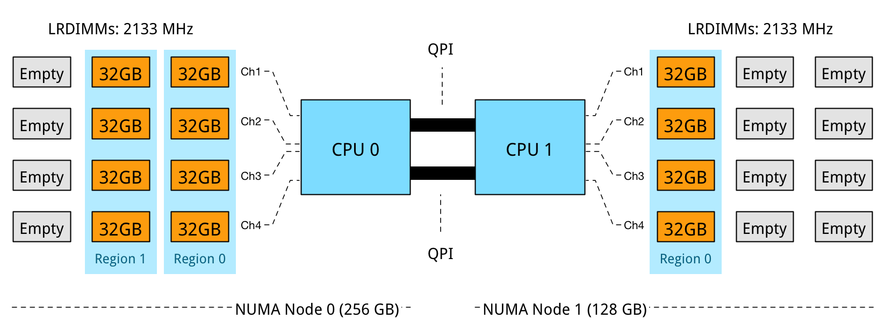

NUMA Node 0 has 256 GB, while NUMA node 1 contains 128 GB. In this configuration DPC is used to its full extent, leveraging parallelism and memory interleaving. However the optimization of local bandwidth would not help the virtual machines who are scheduled to run in NUMA node 1, less memory available means it is required to fetch it remotely, experiencing the extra latency of multi-hops and the bandwidth constraint of the QPI compared to local memory.

NUMA节点0具有256 GB，而NUMA节点1包含128 GB。在这种配置中，DPC被充分利用，利用并行性和存储器交错。然而，本地带宽的优化无助于计划在NUMA节点1中运行的虚拟机，可用内存较少意味着需要远程获取它，遇到多跳的额外延迟和QPI的带宽限制比较到本地记忆。

### Problem 2: Unbalanced DPC Regions:

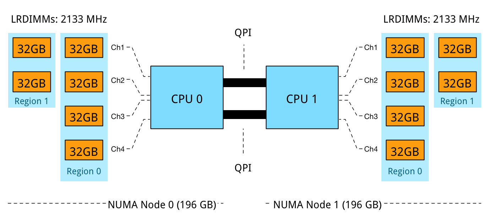

The memory capacity is equally distributed across the NUMA Nodes, however a mixed DPC configuration exists of 1 DPC and 2 DPC. This configuration does not provide a consistent memory performance. Data access is done across 4 channels, 2 channels and across the QPI to the other memory controller than might fetch the data across two or four channels. As described in part 4 – Optimizing Performance, unbalanced DPC configurations can lead to 30% performance decrease and this is without the impact of access data remotely.

存储器容量在NUMA节点上均匀分布，但是存在1个DPC和2个DPC的混合DPC配置。此配置不提供一致的内存性能。数据访问是通过4个通道，2个通道和QPI到另一个内存控制器完成的，而不是通过两个或四个通道获取数据。如第4部分 - 优化性能中所述，非平衡DPC配置可以使性能降低30％，而且不会远程影响访问数据。

### Problem 3: RDIMM 3 DPC Bandwidth reduction:

Using 16GB RDIMMs results in an balanced NUMA configuration, while leveraging 4 channels to its full potential. 3 DIMMs per channel per processor results in a decrease of memory bandwidth, dropping from 2133 MHz to 1600 MHz. While 2133 MHz provides up to 17 GB/s per DIMM, 1600 MHz provides a maximum bandwidth up to 12.8 GB/s per DIMM. A drop of 25%. Unfortunately latency will also be impact by running at a lower clock cycle. Future scaleability is ruled out by using all DIMM slots.

使用16GB RDIMM可实现均衡的NUMA配置，同时充分利用4个通道。每个处理器每个通道3个DIMM导致内存带宽减少，从2133 MHz降至1600 MHz。虽然2133 MHz每个DIMM可提供高达17 GB / s的速率，但1600 MHz可为每个DIMM提供高达12.8 GB / s的最大带宽。下跌25％。不幸的是，延迟也会受到较低时钟周期运行的影响。使用所有DIMM插槽排除了未来的可扩展性。

Requirements and the constraints will impact memory configurations, depending on the budget or future requirements it makes sense to increase or decrease the memory configuration or accept that future scale-out capabilities are unavailable after populating all slots.

要求和约束将影响内存配置，具体取决于预算或未来要求，增加或减少内存配置或接受填充所有插槽后未来的横向扩展功能不可用。

## [Memory Deep Dive Series Part7 : Memory Deep Dive Summary](http://frankdenneman.nl/2015/03/02/memory-deep-dive-summary/)

This is last part of the memory deep dive. As the total series count 7667 words, I thought it would be a good idea to create a summary of the previous 6 parts. The memory deep dive series:

这是记忆深度潜水的最后一部分。由于总系列数为7667个单词，我认为创建前6个部分的摘要是个好主意。记忆深潜系列：

* Part 1: Memory Deep Dive Intro
* Part 2: Memory subsystem Organisation
* Part 3: Memory Subsystem Bandwidth
* Part 4: Optimizing for Performance
* Part 5: DDR4 Memory
* Part 6: NUMA Architecture and Data Locality
* Part 7: Memory Deep Dive Summary

The reason why I started this deep dive is to understand the scalability of server memory configurations and constrains certain memory type introduce. Having unpopulated DIMM slot does not always translate into future expandability of memory capacity. A great example is the DIMM layout of today’s most popular server hardware. The server boards of the Cisco UCS B200 M4, HP Proliant DL380 Gen 9, and Dell PowerEdge 730 Gen 13 come equipped with 2 CPU’s and 24 DIMM slots.

我开始深入研究的原因是为了理解服务器内存配置的可扩展性并限制某些内存类型的引入。没有填充的DIMM插槽并不总能转化为未来的内存容量可扩展性。一个很好的例子是当今最流行的服务器硬件的DIMM布局。 Cisco UCS B200 M4，HP Proliant DL380 Gen 9和Dell PowerEdge 730 Gen 13的服务器主板配备了2个CPU和24个DIMM插槽。

Processors used in the aforementioned systems are part of the new Intel Xeon 26xx v3 micro-architecture. It uses multiple onboard memory controllers to provide a multi-channel memory architecture. Multi-channel configurations, DIMM ranking and DIMM types must be considered when designing your new server platform. If these are not taken into account, future scalability might not be possible or the memory will not perform as advertised.

上述系统中使用的处理器是新的Intel Xeon 26xx v3微架构的一部分。它使用多个板载内存控制器来提供多通道内存架构。在设计新服务器平台时，必须考虑多通道配置，DIMM排名和DIMM类型。如果不考虑这些因素，则可能无法实现未来的可扩展性，或者内存将无法像宣传的那样执行。

### Multi-channel memory architecture

Modern CPU microarchitectures support triple or quadruple memory channels. This allows the memory controller to access the multiple DIMMs simultaneously. The key to high bandwidth and low latency is interleaving. Data is distributed in small chunks across multiple DIMMs. Smaller bits of data are retrieved from each DIMM across independent channels instead of accessing a single DIMM for the entire chunk of data across one channel. For in-depth information, please go to part 2.

现代CPU微体系结构支持三重或四重内存通道。这允许内存控制器同时访问多个DIMM。高带宽和低延迟的关键是交错。数据以小块的形式分布在多个DIMM上。通过独立通道从每个DIMM检索较小的数据位，而不是通过一个通道访问整个数据块的单个DIMM。有关详细信息，请参阅第2部分。

The Intel Xeon 26xx v3 micro-architecture offers a quad-channel memory architecture. To leverage all the available bandwidth each channel should be populated with at least one DIMM.

英特尔至强26xx v3微架构提供四通道内存架构。要利用所有可用带宽，每个通道应至少填充一个DIMM。

This configuration has the largest impact on performance and especially on throughput. Part 4 dives into multi-channel configuration in depth. The configuration depicted above leverages all four channels and allows the CPU to interleave memory operations across all four channels. The memory controller groups memory across the channels in a region. When creating a 1 DIMM per Channel configuration, the CPU creates one region (Region 0) and interleaves the memory access. The CPU will use the available bandwidth if less than 4 DIMMs are used, for example when 3 DIMMs are used, the memory controller uses three channels to interleave memory. 2 DIMMs result in two usable channels, and one DIMM will use a single channel, disabling interleaving across channels.

此配置对性能影响最大，尤其是吞吐量。第4部分深入研究了多通道配置。上述配置利用了所有四个通道，并允许CPU跨所有四个通道交错存储器操作。存储器控制器跨区域中的通道对存储器进行分组。在为每个通道配置创建1个DIMM时，CPU会创建一个区域（区域0）并交叉存储器访问。如果使用少于4个DIMM，CPU将使用可用带宽，例如，当使用3个DIMM时，内存控制器使用三个通道来交错存储器。 2个DIMM产生两个可用通道，一个DIMM将使用单个通道，禁用跨通道的交错。

Populating four channels provide the best performance, however sometimes extra capacity is required, but less than DIMMS populating four channels provide. For example if 384 GB is required and 32 GB DIMMs are used, 6 DIMMS are used. The CPU will create two Regions. Region 0 will run in quad channel mode, while region 1 runs in dual channel mode:

填充四个通道可提供最佳性能，但有时需要额外容量，但小于填充四个通道的DIMMS。例如，如果需要384 GB且使用32 GB DIMM，则使用6个DIMM。 CPU将创建两个区域。区域0将以四通道模式运行，而区域1以双通道模式运行：

This creates an unbalanced memory channel configuration, resulting in inconsistent performance. With Quad Channel configurations its recommended to add memory in groups of 4 DIMMS. Therefor use 4, 8 or 12 DIMMs per CPU to achieve the required memory capacity.

这会创建不平衡的内存通道配置，从而导致性能不一致。对于四通道配置，建议以4个DIMM为一组添加内存。因此，每个CPU使用4个，8个或12个DIMM来实现所需的内存容量。

### Memory Ranking

A DIMM groups the chips together in ranks. The memory controller can access ranks simultaneously and that allows interleaving to continue from channel to rank interleaving. Rank interleaving provides performance benefits as it provides the memory controller to parallelize the memory request. Typically it results in a better improvement of latency.

DIMM将芯片组合在一起。存储器控制器可以同时访问秩，并且允许交织从信道到秩交织继续。秩交错提供了性能优势，因为它提供了内存控制器来并行化内存请求。通常，它可以更好地改善延迟。

DIMMs come in three rank configurations; single-rank, dual-rank or quad-rank configuration, ranks are denoted as (xR). To increase capacity, combine the ranks with the largest DRAM chips. A quad-ranked DIMM with 4Gb chips equals 32GB DIMM (4Gb x 8bits x 4 ranks). As server boards have a finite amount of DIMM slots, quad-ranked DIMMs are the most effective way to achieve the highest memory capacity. Unfortunately current systems allow up to 8 ranks per channel. Therefor limiting the total capacity and future expandability of the system.

DIMM有三种配置;单秩，双秩或四秩配置，等级表示为（xR）。为了增加容量，将排名与最大的DRAM芯片结合起来。具有4Gb芯片的四列DIMM等于32GB DIMM（4Gb x 8位x 4级）。由于服务器主板具有有限数量的DIMM插槽，因此四列DIMM是实现最高内存容量的最有效方式。不幸的是，当前系统允许每个通道最多8个等级。因此限制了系统的总容量和未来的可扩展性。

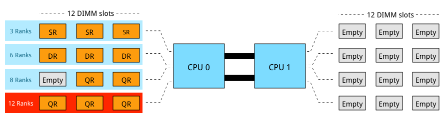

3 DIMMs of QR provide the most capacity however it is not a supported configuration as 12 ranks exceeds the allowable 8 ranks. Ranking impacts the maximum number of DIMMs used per channel. If current memory capacity of your servers needs to be increased, verify the ranking configuration of the current memory modules. Although there might be enough unpopulated DIMM slots, quad rank memory modules might prevent you from utilizing these empty DIMM slots. LRDIMMs allow large capacity configurations by using a memory buffer to obscure the number of ranks on the memory module. Although LRDIMMs are quad ranked, the memory controller only communicates to the memory buffer reducing the electrical load on the memory controller.

3个QR的DIMM提供最大容量，但它不是支持的配置，因为12个等级超过允许的8个等级。排名会影响每个通道使用的最大DIMM数。如果需要增加服务器的当前内存容量，请验证当前内存模块的排名配置。虽然可能有足够的无填充DIMM插槽，但四列内存模块可能会阻止您使用这些空的DIMM插槽。 LRDIMM通过使用内存缓冲区来模糊内存模块上的排名数，从而允许大容量配置。尽管LRDIMM是四列的，但是存储器控制器仅与存储器缓冲器通信以减少存储器控制器上的电负载。

### DIMMs per Channel

A maximum of 3 DIMMs per channel are allowed. If one DIMM is used per channel, this configuration is commonly referred to as 1 DIMM Per Channel (1 DPC). 2 DIMMs per channel (2 DPC) and if 3 DIMMs are used per channel, this configuration is referred to as 3 DPC. When multiple DIMMs are used per channel they operate at a slower frequency.

每个通道最多允许3个DIMM。如果每个通道使用一个DIMM，则此配置通常称为每个通道1个DIMM（1个DPC）。每个通道2个DIMM（2个DPC），如果每个通道使用3个DIMM，则此配置称为3个DPC。当每个通道使用多个DIMM时，它们以较慢的频率运行。

|DIMM Type|1 DPC   |2 DPC   |3 DPC   |
|---------|--------|--------|--------|
|SR RDIMM |2133 MHz|1866 MHz|1600 MHz|
|DR RDIMM |2133 MHz|1866 MHz|1600 MHz|
|QR RDIMM |2133 MHz|1866 MHz|N/A     |
|QR LRDIMM|2133 MHz|2133 MHz|1600 MHz|

The frequency of DDR4 LRDIMMs remains the same whether it is used in 1 DPC or 2 DPC configurations. It drops to RDIMM frequency levels when using it in a 3-DPC configuration. Multiple tests published online show that LRDIMM frequency drop-off is less than the proposed standard. Most tests witnessed a drop from 2133 MHz to 1866 MHz, retaining high levels of performance. Memory frequency impact both available bandwidth and latency.

无论是在1个DPC还是2个DPC配置中使用，DDR4 LRDIMM的频率都保持不变。在3-DPC配置中使用时，它会降至RDIMM频率级别。在线发布的多项测试表明，LRDIMM频率下降小于建议的标准。大多数测试见证了从2133 MHz到1866 MHz的下降，保持了高水平的性能。内存频率会影响可用带宽和延迟。

### Performance

As mentioned in part 5, the two primary measurements for performance in storage and memory are latency and throughput. Interestingly enough, memory bandwidth increases with every generation, however latency does not always improve immediately. Actually every generation of memory moves the performance dial backwards when comparing latency with its predecessor.

如第5部分所述，存储和内存性能的两个主要衡量指标是延迟和吞吐量。有趣的是，内存带宽随着每一代的增加而增加，但延迟并不总是立即提高。实际上，在将延迟与其前身进行比较时，每一代内存都会向后移动性能拨号。

The interesting part is that memory bandwidth is a factor of latency. Latency is a generic term, when reviewing the latency and bandwidth relationship, one has to review unloaded and loaded latencies. Memory latency is measured from the moment the CPU issues a read request to the moment the memory supplies it to the core. This is referred to as load to use.

有趣的是，内存带宽是延迟的一个因素。延迟是一个通用术语，在查看延迟和带宽关系时，必须检查卸载和加载的延迟。内存延迟是从CPU发出读取请求的那一刻到内存将其提供给内核的那一刻开始测量的。这被称为负载使用。

However, the load to use latencies differ when the memory system is idle or when it’s saturated. Unloaded latency is a measurement of an idle system and it represents the lowest latency that the system can achieve. A well-known indicator of memory latency is the CAS timings (Column Address Strobe) and it represents the unloaded latency. Basically it demonstrates the most optimal scenario. CAS timings is a good way to understand the relative latency between two memory DIMMS, however, it does not always indicate the real world performance of a system.

但是，当内存系统空闲或饱和时，使用延迟的负载会有所不同。卸载延迟是对空闲系统的度量，它表示系统可以实现的最低延迟。众所周知的内存延迟指标是CAS时序（列地址选通），它代表卸载的延迟。基本上它展示了最佳方案。 CAS时序是理解两个内存DIMM之间相对延迟的好方法，但是，它并不总是表明系统的真实性能。

Loaded latency is the latency when the memory subsystem is saturated with memory request and that’s where bandwidth has a positive impact on real world latency. Under loaded conditions memory requests spend time in the queue, the more bandwidth speed the memory has, the more quickly the memory controller can process the queued commands. For example, memory running at 1600 MHz has about 20% lower loaded latency than memory running at 1333 MHz. Loaded latency is the real world measurement of performance applications will experience, having bandwidth speed to reduce loaded latency is important when reviewing the DPC configuration (part 4) of your server configuration. Ranks will also have a positive impact on the loaded latency (lower latency). Having more ranks allows the memory controller to empty out its queue’s by parallelizing the process of memory requests. Parallelization is covered in part 4 of this series.

加载延迟是内存子系统内存请求饱和时的延迟，也就是带宽对实际延迟产生积极影响的延迟。在加载条件下，内存请求在队列中花费时间，内存带宽越快，内存控制器处理排队命令的速度就越快。例如，运行在1600 MHz的内存比1333 MHz运行的内存的加载延迟低约20％。加载延迟是性能应用程序将体验到的真实世界度量，在查看服务器配置的DPC配置（第4部分）时，具有带宽速度以减少加载延迟非常重要。排名也将对加载的延迟（较低的延迟）产生积极影响。拥有更多排名允许内存控制器通过并行化内存请求进程来清空其队列。本系列的第4部分介绍了并行化。

Please visit the individual parts of the series for more in-depth information. I hope you enjoyed reading this series as much as I have been writing it.

请访问该系列的各个部分以获取更深入的信息。我希望你喜欢阅读这个系列，就像我一直在写它一样。
