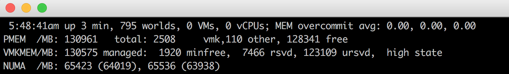
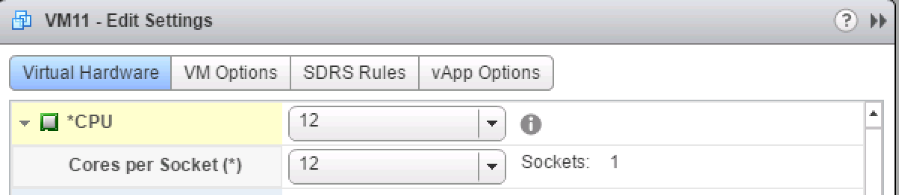

# Introduction 2016 NUMA Deep Dive Series

* [Introduction 2016 NUMA Deep Dive Series](http://frankdenneman.nl/2016/07/06/introduction-2016-numa-deep-dive-series/)

Recently I’ve been analyzing traffic to my site and it appears that a lot CPU and memory articles are still very popular. Even my first article about NUMA published in february 2010 is still in high demand. And although you see a lot of talk about the upper levels and overlay technology today, the focus on proper host design and management remains. After all, it’s the correct selection and configuration of these physical components that produces a consistent high performing platform. And it’s this platform that lays the foundation for the higher services and increased consolidating ratios.

Most of my NUMA content published throughout the years is still applicable to the modern datacenter, yet I believe the content should be refreshed and expanded with the advancements that are made in the software and hardware layers since 2009.

To avoid ambiguity, this deep dive is geared towards configuring and deploying dual socket systems using recent Intel Xeon server processors. After analyzing the dataset of more than 25.000 ESXi host configurations collected from virtual datacenters worldwide, we discovered that more than 80% of ESXi host configuration are dual socket systems. Today, according to IDC, Intel controls 99 percent of the server chip market.

Despite the strong focus of this series on the Xeon E5 processor in a dual socket setup, the VMkernel, and VM content is applicable to systems running AMD processors or multiprocessor systems. No additional research was done on AMD hardware configurations or performance impact when using high-density CPU configurations.

The 2016 NUMA Deep Dive Series
The 2016 NUMA Deep Dive Series consists of 7 parts.The 2016 NUMA deep dive series is split into three main categories; Physical, VMkernel, and Virtual Machine.

**Part 1**: [From UMA to NUMA](http://frankdenneman.nl/2016/07/07/numa-deep-dive-part-1-uma-numa/)
Part 1 covers the history of multi-processor system design and clarifies why modern NUMA systems cannot behave as UMA systems anymore.

**Part 2**: [System Architecture](http://frankdenneman.nl/2016/07/08/numa-deep-dive-part-2-system-architecture/)
The system architecture part covers the Intel Xeon microarchitecture and zooms in on the Uncore. Primarily focusing on Uncore frequency management and QPI design decisions.

**Part 3**: [Cache Coherency](http://frankdenneman.nl/2016/07/11/numa-deep-dive-part-3-cache-coherency/)
The unsung hero of today’s NUMA architecture. Part 3 zooms in to cache coherency protocols and the importance of selection the proper snoop mode.

**Part 4**: [Local Memory Optimization](http://frankdenneman.nl/2016/07/13/numa-deep-dive-4-local-memory-optimization/)
Memory density impacts the overall performance of the NUMA system, part 4 dives into the intricacy of channel balance and DIMM per Channel configuration.

**Part 5**: [ESXi VMkernel NUMA Constructs](http://frankdenneman.nl/2016/08/22/numa-deep-dive-part-5-esxi-vmkernel-numa-constructs/)
The VMkernel has to distribute the virtual machines to provide the best performance. This part explores the NUMA constructs that are subject to initial placement and load-balancing operations.

Part 6: NUMA Initial Placement and Load Balancing Operations
The VMkernel has to distribute the virtual machines to provide the best performance. This part explores the NUMA initial placement and load-balancing operations.

Part 7: From NUMA to UMA
The world of IT moves in loops of iteration, the last 15 years we moved from UMA to NUMA systems, which today’s focus on latency and the looming licensing pressure, some forward-thinking architects are looking into creating high performing UMA systems.

The articles will be published on a daily basis to avoid saturation. Similar to other deep dives, the articles are lengthy and contain lots of detail. Up next, Part 1: From UMA to NUMA

## NUMA Deep Dive Part 1: From UMA to NUMA

* [NUMA Deep Dive Part 1: From UMA to NUMA](http://frankdenneman.nl/2016/07/07/numa-deep-dive-part-1-uma-numa/)

Non-uniform memory access (NUMA) is a shared memory architecture used in today’s multiprocessing systems. Each CPU is assigned its own local memory and can access memory from other CPUs in the system. Local memory access provides a low latency – high bandwidth performance. While accessing memory owned by the other CPU has higher latency and lower bandwidth performance. Modern applications and operating systems such as ESXi support NUMA by default, yet to provide the best performance, virtual machine configuration should be done with the NUMA architecture in mind. If incorrect designed, inconsequent behavior or overall performance degradation occurs for that particular virtual machine or in worst case scenario for all VMs running on that ESXi host.

This series aims to provide insights of the CPU architecture, the memory subsystem and the ESXi CPU and memory scheduler. Allowing you in creating a high performing platform that lays the foundation for the higher services and increased consolidating ratios. Before we arrive at modern compute architectures, it’s helpful to review the history of shared-memory multiprocessor architectures to understand why we are using NUMA systems today.

### The evolution of shared-memory multiprocessors architecture in the last decades

It seems that an architecture called Uniform Memory Access would be a better fit when designing a consistent low latency, high bandwidth platform. Yet modern system architectures will restrict it from being truly uniform. To understand the reason behind this we need to go back in history to identify the key drivers of parallel computing.

With the introduction of relational databases in the early seventies the need for systems that could service multiple concurrent user operations and excessive data generation became mainstream. Despite the impressive rate of uniprocessor performance, multiprocessor systems were better equipped to handle this workload. In order to provide a cost-effective system, shared memory address space became the focus of research. Early on, systems using a crossbar switch were advocated, however with this design complexity scaled along with the increase of processors, which made the bus-based system more attractive. Processors in a bus system are allowed to access the entire memory space by sending requests on the bus, a very cost effective way to use the available memory as optimally as possible.


However, bus-based systems have their own scalability problems. The main issue is the limited amount of bandwidth, this restrains the number of processors the bus can accommodate. Adding CPUs to the system introduces two major areas of concern:

1. The available bandwidth per node decreases as each CPU added.
2. The bus length increases when adding more processors, thereby increasing latency.

The performance growth of CPU and specifically the speed gap between the processor and the memory performance was, and actually still is, devastating for multiprocessors. Since the memory gap between processor and memory was expected to increase, a lot of effort went into developing effective strategies to manage the memory systems. One of these strategies was adding memory cache, which introduced a multitude of challenges. Solving these challenges is still the main focus of today for CPU design teams, a lot of research is done on caching structures and sophisticated algorithms to avoid cache misses.

### Introduction of caching snoop protocols

Attaching a cache to each CPU increases performance in many ways. Bringing memory closer to the CPU reduces the average memory access time and at the same time reducing the bandwidth load on the memory bus. The challenge with adding cache to each CPU in a shared memory architecture is that it allows multiple copies of a memory block to exist. This is called the cache-coherency problem. To solve this, caching snoop protocols were invented attempting to create a model that provided the correct data while not trying to eat up all the bandwidth on the bus. The most popular protocol, write invalidate, erases all other copies of data before writing the local cache. Any subsequent read of this data by other processors will detect a cache miss in their local cache and will be serviced from the cache of another CPU containing the most recently modified data. This model saved a lot of bus bandwidth and allowed for Uniform Memory Access systems to emerge in the early 1990s. Modern cache coherency protocols are covered in more detail by part 3.

### Uniform Memory Access Architecture

Processors of Bus-based multiprocessors that experience the same – uniform – access time to any memory module in the system are often referred to as Uniform Memory Access (UMA) systems or Symmetric Multi-Processors (SMPs).


With UMA systems, the CPUs are connected via a system bus (Front-Side Bus) to the Northbridge. The Northbridge contains the memory controller and all communication to and from memory must pass through the Northbridge. The I/O controller, responsible for managing I/O to all devices, is connected to the Northbridge. Therefore, every I/O has to go through the Northbridge to reach the CPU.

Multiple buses and memory channels are used to double the available bandwidth and reduce the bottleneck of the Northbridge. To increase the memory bandwidth even further some systems connected external memory controllers to the Northbridge, improving bandwidth and support of more memory. However due the internal bandwidth of the Northbridge and the broadcasting nature of early snoopy cache protocols, UMA was considered to have a limited scalability. With today’s use of high-speed flash devices, pushing hundreds of thousands of IO’s per second, they were absolutely right that this architecture would not scale for future workloads.

### Non-Uniform Memory Access Architecture

To improve scalability and performance three critical changes are made to the shared-memory multiprocessors architecture;

1. Non-Uniform Memory Access organization
2. Point-to-Point interconnect topology
3. Scalable cache coherence solutions

#### 1: Non-Uniform Memory Access organization

NUMA moves away from a centralized pool of memory and introduces topological properties. By classifying memory location bases on signal path length from the processor to the memory, latency and bandwidth bottlenecks can be avoided. This is done by redesigning the whole system of processor and chipset. NUMA architectures gained popularity at the end of the 90’s when it was used on SGI supercomputers such as the Cray Origin 2000. NUMA helped to identify the location of the memory, in this case of these systems, they had to wonder which memory region in which chassis was holding the memory bits.

In the first half of the millennium decade, AMD brought NUMA to the enterprise landscape where UMA systems reigned supreme. In 2003 the AMD Opteron family was introduced, featuring integrated memory controllers with each CPU owning designated memory banks. Each CPU has now its own memory address space. A NUMA optimized operating system such as ESXi allows workload to consume memory from both memory addresses spaces while optimizing for local memory access. Let’s use an example of a two CPU system to clarify the distinction between local and remote memory access within a single system.


The memory connected to the memory controller of the CPU1 is considered to be local memory. Memory connected to another CPU socket (CPU2)is considered to be foreign or remote for CPU1. Remote memory access has additional latency overhead to local memory access, as it has to traverse an interconnect (point-to-point link) and connect to the remote memory controller. As a result of the different memory locations, this system experiences “non-uniform” memory access time.

#### 2: Point-to-Point interconnect

AMD introduced their point-to-point connection HyperTransport with the AMD Opteron microarchitecture. Intel moved away from their dual independent bus architecture in 2007 by introducing the QuickPath Architecture in their Nehalem Processor family design.

The Nehalem architecture was a significant design change within the Intel microarchitecture and is considered the first true generation of the Intel Core series. The current Broadwell architecture is the 4th generation of the Intel Core brand (Intel Xeon E5 v4), the last paragraph contains more information on the microarchitecture generations. Within the QuickPath architecture, the memory controllers moved to the CPU and introduced the QuickPath point-to-point Interconnect (QPI) as data-links between CPUs in the system.


The Nehalem microarchitecture not only replaced the legacy front-side bus but reorganized the entire sub-system into a modular design for server CPU. This modular design was introduced as the “Uncore” and creates a building block library for caching and interconnect speeds. Removing the front-side bus improves bandwidth scalability issues, yet intra- and inter-processor communication have to be solved when dealing with enormous amounts of memory capacity and bandwidth. Both the integrated memory controller and the QuickPath Interconnects are a part of the Uncore and are Model Specific Registers (MSR) ). They connect to a MSR that provides the intra- and inter-processor communication. The modularity of the Uncore also allows Intel to offer different QPI speeds, at the time of writing the Intel Broadwell-EP microarchitecture (2016) offers 6.4 Giga-transfers per second (GT/s), 8.0 GT/s and 9.6 GT/s. Respectively providing a theoretical maximum bandwidth of 25.6 GB/s, 32 GB/s and 38.4 GB/s between the CPUs. To put this in perspective, the last used front-side bus provided 1.6 GT/s or 12.8 GB/s of platform bandwidth. When introducing Sandy Bridge Intel rebranded Uncore into System Agent, yet the term Uncore is still used in current documentation. You can find more about QuickPath and the Uncore in part 2.

#### 3: Scalable Cache Coherence

Each core had a private path to the L3 cache. Each path consisted of a thousand wires and you can imagine this doesn’t scale well if you want to decrease the nanometer manufacturing process while also increasing the cores that want to access the cache. In order to be able to scale, the Sandy Bridge Architecture moved the L3 cache out of the Uncore and introduced the scalable ring on-die Interconnect. This allowed Intel to partition and distribute the L3 cache in equal slices. This provides higher bandwidth and associativity. Each slice is 2.5 MB and one slice is associated with each core. The ring allows each core to access every other slice as well. Pictured below is the die configuration of a Low Core Count (LCC) Xeon CPU of the Broadwell Microarchitecture (v4) (2016).


This caching architecture requires a snooping protocol that incorporates both distributed local cache as well as the other processors in the system to ensure cache coherency. With the addition of more cores in the system, the amount of snoop traffic grows, since each core has its own steady stream of cache misses. This affects the consumption of the QPI links and last level caches, requiring ongoing development in snoop coherency protocols. An in-depth view of the Uncore, scalable ring on-Die Interconnect and the importance of caching snoop protocols on NUMA performance will be included in part 3.

### Non-interleaved enabled NUMA = SUMA

Physical memory is distributed across the motherboard, however, the system can provide a single memory address space by interleaving the memory between the two NUMA nodes. This is called Node-interleaving (setting is covered in part 2). When node interleaving is enabled, the system becomes a Sufficiently Uniform Memory Architecture (SUMA). Instead of relaying the topology info and nature of the processors and memory in the system to the operating system, the system breaks down the entire memory range into 4KB addressable regions and maps them in a round robin fashion from each node. This provides an ‘interleaved’ memory structure where the memory address space is distributed across the nodes. When ESXi assigns memory to virtual machine it allocates physical memory located from two different nodes when the physical CPU located in Node 0 needs to fetch the memory from Node 1, the memory will traverse the QPI links.


The interesting thing is that the SUMA system provides a uniform memory access time. Only not the most optimal one and heavily depends on contention levels in the QPI architecture. Intel Memory Latency Checker was used to demonstrate the differences between NUMA and SUMA configuration on the same system.

This test measures the idle latencies (in nanoseconds) from each socket to the other socket in the system. The latency reported of Memory Node 0 by Socket 0 is local memory access, memory access from socket 0 of memory node 1 is remote memory access in the system configured as NUMA.

| NUMA     | Memory Node 0 | Memory Node 1 | – | SUMA     | Memory Node 0 | Memory Node 1 |
|----------|---------------|---------------|---|----------|---------------|---------------|
| Socket 0 | 75.7          | 132.0         | – | Socket 0 | 105.5         | 106.4         |
| Socket 1 | 131.9         | 75.8          | – | Socket 1 | 106.0         | 104.6         |

As expected interleaving is impacted by constant traversing the QPI links. The idle memory test is the best case scenario, a more interesting test is measuring loaded latencies. It would have been a bad investment if your ESXi servers are idling, therefor you can assume that an ESXi system is processing data. Measuring loaded latencies provides a better insight on how the system will perform under normal load. During the test the load injection delays are automatically changed every 2 seconds and both the bandwidth and the corresponding latency is measured at that level. This test uses 100% read traffic.NUMA test results on the left, SUMA test results on the right.


The reported bandwidth for the SUMA system is lower while maintaining a higher latency than the system configured as NUMA. Therefore, the focus should be on optimizing the VM size to leverage the NUMA characteristics of the system.

### Nehalem & Core microarchitecture overview

With the introduction of the Nehalem microarchitecture in 2008, Intel moved away from the Netburst architecture. The Nehalem microarchitecture introduced Intel customers to NUMA. Along the years Intel introduced new microarchitectures and optimizations, according to its famous Tick-Tock model. With every Tick, optimization takes place, shrinking the process technology and with every Tock a new microarchitecture is introduced. Even though Intel provides a consistent branding model since 2012, people tend to Intel architecture codenames to discuss the CPU tick and tock generations. Even the EVC baselines lists these internal Intel codenames, both branding names and architecture codenames will be used throughout this series:

| Microarchitecture DP servers | Branding   | Year    | Cores | LLC (MB) | QPI Speed (GT/s) | Memory Frequency | Architectural change | Fabrication Process |
|------------------------------|------------|---------|-------|----------|------------------|------------------|----------------------|---------------------|
| Nehalem                      | x55xx      | 10-2008 | 4     | 8        | 6.4              | 3xDDR3-1333      | Tock                 | 45nm                |
| Westmere                     | x56xx      | 01-2010 | 6     | 12       | 6.4              | 3xDDR3-1333      | Tick                 | 32nm                |
| Sandy Bridge                 | E5-26xx v1 | 03-2012 | 8     | 20       | 8.0              | 4xDDR3-1600      | Tock                 | 32nm                |
| Ivy Bridge                   | E5-26xx v2 | 09-2013 | 12    | 30       | 8.0              | 4xDDR3-1866      | Tick                 | 22nm                |
| Haswell                      | E5-26xx v3 | 09-2014 | 18    | 45       | 9.6              | 4xDDR3-2133      | Tock                 | 22nm                |
| Broadwell                    | E5-26xx v4 | 03-2016 | 22    | 55       | 9.6              | 4xDDR3-2400      | Tick                 | 14nm                |

## NUMA Deep Dive Part 1: System Architecture

* [NUMA Deep Dive Part 1: System Architecture](https://frankdenneman.nl/2016/07/08/numa-deep-dive-part-2-system-architecture/)

Reviewing the physical layers helps to understand the behavior of the CPU scheduler of the VMkernel. This helps to select a physical configuration that is optimized for performance. This part covers the Intel Xeon microarchitecture and zooms in on the Uncore. Primarily focusing on Uncore frequency management and QPI design decisions.

### Terminology

There a are a lot of different names used for something that is apparently the same thing. Let’s review the terminology of the Physical CPU and the NUMA architecture. The CPU package is the device you hold in your hand, it contains the CPU die and is installed in the CPU socket on the motherboard. The CPU die contains the CPU cores and the system agent. A core is an independent execution unit and can present two virtual cores to run simultaneous multithreading (SMT). Intel proprietary SMT implementation is called Hyper-Threading (HT). Both SMT threads share the components such as cache layers and access to the scalable ring on-die Interconnect for I/O operations.


Interesting entomology; The word “die” is the singular of dice. Elements such as processing units are produced on a large round silicon wafer. The wafer is cut “diced” into many pieces. Each of these pieces is called a die.

### NUMA Architecture

In the following scenario, the system contains two CPUs, Intel 2630 v4, each containing 10 cores (20 HT threads). The Intel 2630 v4 is based on the Broadwell microarchitecture and contains 4 memory channels, with a maximum of 3 DIMMS per channel. Each channel is filled with a single 16 GB DDR4 RAM DIMM. 64 GB memory is available per CPU with a total of 128 GB in the system. The system reports two NUMA Nodes, each NUMA nodes, sometimes called NUMA domain, contains 10 cores and 64 GB.


### Consuming NUMA

The CPU can access both its local memory and the memory controlled by the other CPUs in the system. Memory capacity managed by other CPUs are considered remote memory and is accessed through the QPI (Part 1). The allocation of memory to a virtual machine is handled by the CPU and NUMA schedulers of the ESXi kernel. The goal of the NUMA scheduler is to maximize local memory access and attempts to distribute the workload as efficient as possible. This depends on the virtual machine CPU and memory configuration and the physical core count and memory configuration. A more detailed look into the behavior of the ESXi CPU and NUMA scheduler is done in part 5, how to size and configure your virtual machines is discussed in part 6. This part focusses on the low-level configuration of a modern dual-CPU socket system. ESXtop reports 130961 MB (PMEM /MB) and displays the NUMA nodes with its local memory count.



Each core can address up to 128 GB of memory, as described earlier the NUMA scheduler of the ESXI kernel attempts to place and distribute vCPU as optimal as possible, allocating as much local memory to the CPU workload that is available. When the number of VCPUs of a virtual machine exceeds the core count of a physical CPU, the ESXi server distributes the vCPU even across the minimal number of physical CPUs.It also exposes the physical NUMA layout to the virtual machine operating system, allowing the NUMA-aware operating system and / or application to schedule their processes as optimal as possible. To ensure this all occurs, verify if the BIOS is configured correctly and that the setting NUMA = enabled or Node Interleaving is disabled. In this example a 12 vCPU VM is running on the dual Intel 2630 v4 system, each containing 10 cores. CoreInfo informs us that 6 vCPUs are running on NUMA node 0 and 6 vCPUs are running on NUMA node 1.


### BIOS Setting: Node Interleaving

There seems to be a lot of confusion about this BIOS setting, I receive lots of questions on whether to enable or disable Node interleaving. I guess the term “enable” make people think it some sort of performance enhancement. Unfortunately, the opposite is true and it is strongly recommended to keep the default setting and keep Node Interleaving disabled.

* **Node Interleaving Disabled: NUMA**
  By using the default setting of Node Interleaving (disabled), the ACPI “BIOS” will build a System Resource Allocation Table (SRAT). Within this SRAT, the physical configuration and CPU memory architecture are described, i.e. which CPU and memory ranges belong to a single NUMA node. It proceeds to map the memory of each node into a single sequential block of memory address space. ESXi uses the SRAT to understand which memory bank is local to a physical CPU and attempts to allocate local memory to each vCPU of the virtual machine.
* **Node Interleaving Enabled: SUMA**
  One question that is asked a lot is how do you turn off NUMA? You can turn off NUMA, but remember your system is not a transformer, changing your CPUs and memory layout from a point-to-point-connection architecture to a bus system. Therefore,when enabling Node Interleaving the system will not become a traditional UMA system. Part 1 contains a more info on SUMA.
* **BIOS setting: ACPI SLIT Preferences**
  The ACPI System Locality Information Table (SLIT) provides a matrix that describes the relative distance (i.e. memory latency) between the proximity domains. In the past, a large NUMA system the latency from Node 0 to Node 7 can be much greater than the latency from Node 0 to Node 1, and this kind of information is provided by the SLIT table.

Modern point-to-point architectures moved from a ring topology to a full mesh topology reducing hop counts, reducing the importance of SLIT. Many server vendor whitepapers describing best practices for VMware ESXi recommend enabling ACPI SLIT. Do not worry if you forgot to enable this setting as ESXi does not use the SLIT. Instead, the ESXi kernel determines the inter-node latencies by probing the nodes at boot-time and use this information for initial placement of wide virtual machines. A wide virtual machine contains more vCPUs than the Core count of a physical CPU, more about wide virtual machines and virtual NUMA can be found in the next article.

### CPU System Architecture

Since Sandy Bridge (v1) the CPU system architecture applied by Intel can be described as a System-on-Chip (SoC) architecture, integrating the CPU, GPU, system IO and last level cache into a single package. The QPI and the Uncore are critical components of the memory system and its performance can be impacted by BIOS settings. Available QPI bandwidth depends on the CPU model, therefore it’s of interest to have a proper understanding of the CPU system architecture to design a high performing system.

### Uncore

As mentioned in part 1, the Nehalem microarchitecture introduced a flexible architecture that could be optimized for different segments. In order to facilitate scalability, Intel separated the core processing functionality (ALU, FPU, L1 and L2 cache) from the ‘uncore’ functionality. A nice way to put it is that the Uncore is a collection of components of a CPU that do not carry out core computational functions but are essential for core performance. This architectural system change brought the Northbridge functionality closer to the processing unit, reducing latency while being able to increase the speed due to the removal of serial bus controllers. The Uncore featured the following elements:

|Uncore element|Description|Responsible for:|
|--- |--- |--- |
|QPI Agent|QuickPath Interconnect|QPI caching agent , manages R3QPI and QPI Link Interface|
|PCU|Power Controller|Core/Uncore power unit and thermal manager, governs P-state of the CPU, C-state of the Core and package. It enables Turbo Mode and can throttle cores when a thermal violation occurs|
|Ubox|System Config controller|Intermediary for interrupt traffic between system and core|
|IIO|Integrated IO|Provides the interface to PCIe Devices|
|R2PCI|Ring to PCI Interface|Provides interface to the ring for PCIe access|
|IMC|Integrated Memory Controller|Provides the interface to RAM and communicates with Uncore through home agent|
|HA|Integrated Memory Controller|Provides the interface to RAM and communicates with Uncore through home agent|
|SMI|Scalable Memory Interface|Provides IMC access to DIMMs|

Intel provides a schematic overview of a CPU to understand the relationship between the Uncore and the cores, I’ve recreated this overview to help emphasise certain components. Please note that the following diagram depicts a High Core Count architecture of the Intel Xeon v4 (Broadwell). This is a single CPU package. The cores are spread out in a “chop-able” design, allowing Intel to offer three different core counts, Low, Medium and High. The red line is depicting the scalable on-die ring connecting the cores with the rest of the Uncore components. More in-depth information can be found in part 4 of this series.


If a CPU core wants to access data it has to communicate with the Uncore. Data can be in the last-level cache (LLC), thus interfacing with the Cbox, it might require memory from local memory, interfacing with the home agent and integrated memory controller (IMC). Or it needs to fetch memory from a remote NUMA node, as a consequence, the QPI comes into play. Due to the many components located in the Uncore, it plays a significant part in the overall power consumption of the system. With today’s focus on power reduction, the Uncore is equipped with frequency scaling functionality (UFS).

Haswell (v4) introduces Per Core Power States (PCPS) that allows each core to run at its own frequency. UFS allows the Uncore components to scale their frequency up and down independently of the cores. This allows Turbo Boost 2.0 to turbo up and owns the two elements independently, allowing cores to scale up the frequency of their LLC and ring on-ramp modules, without having to enforce all Uncore elements to turbo boost up and waste power. The feature that regulates boosting of the two elements is called Energy Efficient Turbo, some vendors provide the ability to manage power consumption with the settings Uncore Frequency Override or Uncore Frequency. These settings are geared towards applying performance savings in a more holistic way.

The Uncore provides access to all interfaces, plus it regulates the power states of the cores, therefore it has to be functional even when there is a minimal load on the CPU. To reduce overall CPU power consumption, the power control mechanism attempts to reduce the CPU frequency to a minimum by using C1E states on separate cores. If a C1E state occurs, the frequency of the Uncore is likely to be lowered as well. This could have a negative effect on the I/O throughput of the overall throughput of the CPU. To avoid this from happening some server vendors provide the BIOS option; Uncore Frequency Override. By default this option is set to Disabled, allowing the system to reduce the Uncore frequency to obtain power consumption savings. By selecting Enabled it prevents frequency scaling of the Uncore, ensuring high performance. To secure high levels of throughput of the QPI links, select the option enabled, keep in mind that this can have a negative (increased)effect on the power consumption of the system.

Some vendors provide the Uncore Frequency option of Dynamic and Maximum. When set to Dynamic, the Uncore frequency matches the frequency of the fastest core. With most server vendors, when selecting the dynamic option, the optimization of the Uncore frequency is to save power or to optimize the performance. The bias towards power saving and optimize performance is influenced by the setting of power-management policies. When the Uncore frequency option is set to maximum the frequency remains fixed.

Generally, this modularity should make it more power efficient, however, some IT teams don’t want their system to swing up and down but provide a consistent performance. Especially when the workload is active across multiple nodes in a cluster, running the workload consistently is more important that having a specific node to go as fast as it can.

### Quick Path Interconnect Link

Virtual machine configuration can impact memory allocation, for example when the memory configuration consumption exceeds the available amount of local memory, ESXi allocates remote memory to this virtual machine. An imbalance of VM activity and VM resource consumption can trigger the ESXi host to rebalance the virtual machines across the NUMA nodes which lead to data migration between the two NUMA nodes. These two examples occur quite frequently, as such the performance of remote memory access, memory migration, and low-level CPU processes such as cache snooping and validation traffic depends on the QPI architecture. It is imperative when designing and configuring a system that attention must be given to the QuickPath Interconnect configuration.

Xeon CPUs designated for dual CPU setup (E5-26xx) is equipped with two QPI bi-directional links. Depending on the CPU model selected, the QPI links operates at high frequencies measured in giga-transfers per second (GT/s). Today the majority of E5 Xeons (v4) operate at 9.6 GT/s, while some run at 6.4 GT/sec or 8.6 GT/sec. Giga-transfer per second refers to the number of operations transferring data that occur in each second in a data-transfer channel. It’s an interesting metric, however, it does not specify the bit rate. In order to calculate the data-transmission rate, the transfer rate must be multiplied by the channel width. The QPI link has the ability to transfer 16 bits of data-payload. The calculation is as follows: GT/s x channel width /bits-to-bytes.

9.6 GT/sec x 16 bits = 153.6 Bits per second / 8 = 19.2 GB/s.

The purist will argue that this is not a comprehensive calculation, as this neglects the clock rate of the QPI. The complete calculation is:

QPI clock rate x bits per Hz x channel width × duplex = bits ÷ byte. 4.8 Ghz x 2 bits/Hz x 16 x 2 / 8 = 38.4 GB/s.

Haswell (v3) and Broadwell (v4) offer three QPI clock rates, 3.2 GHz, 4.0 GHz, and 4.8 GHz. Intel does not provide clock rate details, it just provide GT/s. Therefore to simplify this calculations, just multiple GT/s by two (16 bits / 8 bits to bytes = 2). Listed as 9.6 GT/s a QPI link can transmit up to 19.2 GB/s from one CPU to another CPU. As it is bidirectional, it can receive the same amount from the other side. In total, the two 9.6 GT/s links provide a theoretical peak data bandwidth of 38.4 GB/sec in one direction.

|QPI link speed|Unidirectional peak bandwidth|Total peak bandwidth|
|--- |--- |--- |
|6.4 GT/s|12.8 GB/s|25.6 GB/s|
|8.0 GT/s|16.0 GB/s|32 GB/s|
|9.6 GT/s|19.2 GB/s|38.4 GB/s|

There is no direct relationship with core-count and QPI link speeds. For example the v4 product family features 3 8-core count CPUs, each with a different QPI link speed, but there are also 10 core CPUs with a bandwidth of 8.0 GT/s. To understand the logic, you need to know that Intel categorizes their CPU product family into segments. Six segments exist; Basic, Standard, Advanced, Segment Optimized, Low Power and Workstation.


The Segment Optimized features a sub segment of Frequency Optimized, these CPU’s push the gigabit boundaries. And then off course there is the custom-build segment, which is off the list, but if you have enough money, Intel can look into your problems. The most popular CPUs used in the virtual datacenter come from the advanced and segment optimized segments. These CPUs provide enough cores and cache to drive a healthy consolidation ratio. Primarily the high core count CPUs from the Segment Optimized category are used. All CPU’s from these segments are equipped with a QPI link speed of 9.6 GT/s.

|Segment|Model Number|Core count|Clock cycle|TDP|QPI speed|
|--- |--- |--- |--- |--- |--- |
|Advanced|E5-2650 v4|12|2.2 GHz|105W|9.6 GT/s|
|Advanced|E5-2660 v4|14|2.0 GHz|105W|9.6 GT/s|
|Advanced|E5-2680 v4|14|2.4 GHz|120W|9.6 GT/s|
|Advanced|E5-2690 v4|14|2.6 GHz|135W|9.6 GT/s|
|Optimized|E5-2683 v4|16|2.1 GHz|120W|9.6 GT/s|
|Optimized|E5-2695 v4|18|2.1 GHz|120W|9.6 GT/s|
|Optimized|E5-2697 v4|18|2.3 GHz|145W|9.6 GT/s|
|Optimized|E5-2697A v4|16|2.6 GHz|145W|9.6 GT/s|
|Optimized|E5-2698 v4|20|2.2 GHz|135W|9.6 GT/s|
|Optimized|E5-2699 v4|22|2.2 GHz|145W|9.6 GT/s|

### QPI Link Speed Impact on Performance

When opting for a CPU with a lower QPI link speeds, remote memory access will be impacted. During the tests of QPI bandwidth using the Intel Memory Latency Checker v3.1. it reported an average of ˜75% of the theoretical bandwidth when fetching memory from the remote NUMA node.


The peak bandwidth is more a theoretical maximum number as transfer data comes with protocol overhead. Additionally tracking resources are needed when using multiple links to track each data request and maintain coherency. The maximum QPI bandwidth that is available at the time of writing is lower than the minimum supported memory frequency of 1600 MHz (Intel Xeon v3 & v4). The peak bandwidth of DDR4 1600 MHz is 51 GB/s, which exceeds the theoretical bandwidth of the QPI by 32%. As such, QPI bandwidth can impact remote memory access performance. In order to obtain the most performance, it’s recommended to select a CPU with a QPI configuration of 9.6 GT/s to reduce the bandwidth loss to a minimum, the difference between 9.6 GT/s and 8.0 GT/s configuration is a 29% performance drop. AS QPI bandwidth impacts remote memory access, it’s the DIMM configuration and memory frequency that impacts local memory access. Local memory optimization is covered in Part 4.

>Note!
>The reason why I’m exploring nuances of power settings is that high-performance power consumption settings are not always the most optimal setting for today’s CPU microarchitecture. Turbo mode allows cores to burst to a higher clock rate if the power budget allows it. The finer details of Power management and Turbo mode are beyond the scope of this NUMA deep dive, but will be covered in the upcoming CPU Power Management Deep Dive.

### Intel QPI Link Power Management

Some servers allow you to configure the QPI Link Power Management in the BIOS. When enabled, the buffers in the QPI links are allowed to enter a sleep state when the links are not being used. When there is relatively little traffic, the QPI link shuts down some of its data transmissions lanes, this to achieve power consumption reduction. Within a higher state, it only reduces bandwidth, when entering a deeper state memory access will occur latency impact.

A QPI link consists of a transmit circuit (TX), 20 data lanes, 1 clock lane and a receive circuit (RX). Every element can be progressively switched off. When the QPI is under heavy load it will use all 20 lanes, however when experiencing a workload of 40% or less it can decide to modulate to half width. Half width mode, called L0p state saves power by shutting down at least 10 lanes. The QPI power management spec allows to reduce the lanes to a quarter width, but research has shown that power savings are too small compared to modulating to 10 links. Typically when the 10 links are utilized for 80% to 90% the state shifts from L0p back to the full-width L0 state. L0p allows the system to continue to transmit data without any significant latency penalty. When no data transmit occurs, the system can invoke the L0s state. This state only operates the clock lane and its part of the physical TX and RX circuits, due to the sleep mode of the majority of circuits (lane drivers) within the transceivers no data can be sent. The last state, L1, allows the system to shut down the complete link, benefitting from the highest level of power consumption.

L0s and L1 states are costly from a performance perspective, Intel’s’ patent US 8935578 B2 indicates that exiting L1 state will cost multiple microseconds and L0s tens of nanoseconds. Idle remote memory access latency measured on 2133 MHz memory is on average 130 nanoseconds, adding 20 nanoseconds will add roughly 15% latency and that’s quite a latency penalty. A low power state with longer latency and lower power than L0s and is activated in conjunction with package C-states below C00

|State|Description|Properties|Lanes|
|--- |--- |--- |--- |
|L0|Link Normal Operational State|All lanes and Forward Clock active|20|
|L0p|Link power saving state|A lower power state from L0 that reduces the link from full width to half width|10|
|L0s|Low Power Link State|Turns odd most lane drivers, rapid recovery to the L0 state|1|
|L0s|Deeper Low Power State|Lane drivers and Fwd clock turned off, greater power savings than L0s, Longer time to return to L0 state|

If the focus is on architecting a consistent high performing platform, I recommend to disable QPI Power Management in the BIOS. Many vendors have switched their default setting from enabled to disabled, nevertheless its wise to verify this setting.

The memory subsystem and the QPI architecture lay the foundation of the NUMA architecture. Last level cache is a large part of the memory subsystem, the QPI architecture provides the interface and bandwidth between NUMA nodes. It’s the cache coherency mechanisms that play a great part in providing the ability to span virtual machines across nodes, but in turn, will impact overall performance and bandwidth consumption.

## NUMA Deep Dive Part 3: Cache Coherency

When people talk about NUMA, most talk about the RAM and the core count of the physical CPU. Unfortunately, the importance of cache coherency in this architecture is mostly ignored. Locating memory close to CPUs increases scalability and reduces latency if data locality occurs. However, a great deal of the efficiency of a NUMA system depends on the scalability and efficiency of the cache coherence protocol! When researching the older material of NUMA, today’s architecture is primarily labeled as ccNUMA, Cache Coherent NUMA.

>hpcresearch.nl:
>
>*The term “Cache Coherent” refers to the fact that for all CPUs any variable that is to be used must have a consistent value. Therefore, it must be assured that the caches that provide these variables are also consistent in this respect.*

This means that a memory system of a multi-CPU system is coherent if CPU 1 writes to a memory address (X) and later on CPU2 reads X, and no other writes happened to X in between, CPU 2 read operation returns the value written by CPU 1 write operation.

To ensure that the local cache is up to date, the snoopy bus protocol was invented, which allowed caches to listen in on the transport of these “variables” to any of the CPU and update their own copies of these variables if they have them. The interesting thing is that with today’s multicore CPU architecture, cache coherency manifest itself within the CPU package as well as cache coherency between CPU packages. A great deal of memory performance (bandwidth and latency) depends on the snoop protocol.

### Caching Architecture

Sandy Bridge (v1) introduced a new cache architecture. The hierarchy exists of an L1, L2 and a distributed LLC accessed via the on-die scalable ring architecture. Although they are all located on the CPU die, there are differences in latency between L1, L2 and LLC. L1 is the fastest cache and it typically takes the CPU 4 cycles to load data from the L1 cache, 12 cycles to load data from the L2 cache and between 26 and 31 cycles to load the data from L3 cache. In comparison, it takes roughly 190 cycles to get the data from local memory while it could take the CPU a whopping 310 cycles to load the data from remote memory.

Each core has a dedicated L1 and L2 cache, this is referred to as private cache as no other core can overwrite the cache lines, the LLC is shared between cores. The L1 cache is split into two separate elements, the Instruction cache (32KB) and the data cache (L1D) (32KB). The L2 cache (256KB) is shared by instructions and data (Unified) and is considered to be an exclusive cache. That means that it does not have to contain all the bits that is present in the L1 cache (instructions and data). However, it’s likely to have the same data and instructions as it’s bigger (less evictions). When data is fetched from memory it fills all cache levels on the way to the core (LCC->L2->L1). The reason why it’s also in the LCC is because the LCC is designed as an inclusive cache. It must have all the data contained in the L2 or L1 cache. More about LLC in a later paragraph.

#### Data Prefetching

In order to improve performance, data can be speculatively loaded into the L1 and L2 cache, this is called prefetching. It’s the job of the prefetcher to load data into the cache before the core needs it. Performance improvements up to 30% have been quoted by Intel. The Xeon microarchitecture can make use of both hardware and software prefetching. A well-known software prefetching technology is SSE (Streaming SIMD Extension; SIMD: Single Instruction Multiple Data) SSE provides hints to the CPU which data to prefetch for an instruction. The hardware prefetchers are split between L1 and L2 cache.

The component that actual stores the data in the L1D is called the data cache unit (DCU) and is 32KB in size. The L1D manages all the loads and stores of the data. The DCU prefetcher fetches next cache lines from the memory hierarchy when a particular access pattern is detected. The DCU IP prefetcher attempts to load the next instruction before the core actually request it. L2 prefetchers also interact with the LLC. When the L2 contains too many outstanding requests, the L2 prefetchers stores the data in the LLC to avoid eviction of useful cache lines.

#### Note

In storage, the unit of transportation is a block, in memory its called a line.

The Intel Xeon microarchitecture uses a cache line size of 64 bytes.

Two L2 prefetchers exists Spatial Prefetcher and Streamer. The spatial prefetcher attempts to complete every cache line fetched to the L2 cache with another cache line in order to fill a 128-byte aligned chunk. The streamer monitors read requests from the L1D cache and fetch the appropriate data and instructions. Server vendors might use their own designation for L1 and L2 prefetchers

|Intel|Server Vendors|
|--- |--- |
|DCU Prefetcher|DCU Streamer Prefetcher|
|DCU IP-based stride prefetcher|DCU IP Prefetcher|
|Spatial prefetcher|Adjacent Cache Line Prefetch|
|Streamer|Hardware Prefetcher|

All four prefetchers are extremely important for performance. There are some use cases known where prefetchers consume more bandwidth and CPU cycles than actually benefit performance, but these cases are extremely rare. Testing prefetcher effectiveness is extremely difficult as synthetic test are usually focused on measuring best case scenario bandwidth and latency using sequential access patterns. And you guess it, they workload pattern where prefetchers shine. My recommendation is to have the prefetchers set to enabled.

### Last Level Cache

The L1 and L2 cache are private to the core and stores data it reads, writes or modifies. The LLC cache is shared amongst the cores. Sandy Bridge (v1) moved away from a single unified cache entity in the Uncore to a distributed and partitioned cache structure. The total LLC is carved up into 2.5 MB slices and can be fully accessed and utilized by all cores in the system. It’s mentioned in many articles that a core is associated with a core, but the association is just a physical construct. A core cannot control the placement of data in the LCC and has no ability to access anything but the entire LLC. The LCC is accessed through the scalable on-die ring and latency depends on the number of hops to access the data.


### Scalable on-die ring

The cache is an inclusive cache, meaning that it includes all of the data that is stored in the lower level caches. The memory addresses are hashed and distributed amongst the slices. This approach leverages the incredible bandwidth of the scalable on-die interconnect while reducing hot spots and contention for the cache addresses. It also helps coherency. The L3 slices are connected to the scalable on-die interconnect, that connects the cores and the Uncore containing the R3QPI (Ring to QPI interconnect) and the home agent servicing the Integrated Memory Controller. There are two tag arrays, one for data accesses and one for coherency requests and prefetching. The rings run in a clockwise direction as well as a counter-clockwise direction in order to provide the shortest path between core and cache slice. Intel stated the bandwidth of the ring was ~ 844GB/s in the Sandy Bridge Architecture. Since Haswell (v3) the rings are connected by buffered interconnects to allow the rings to operate independently, coinciding with the introduction of Cluster-on-Die cache snoop mode.

The core scalability of the Xeon family results in different die designs. There are three core-count configurations, Low core count (LCC), medium core count (MCC) and high core count (HCC). With every new generation Xeon, the classification of the various configurations change. For example in Haswell (v3) 8 core CPUs were labeled as LCC, in the Broadwell (v4) architecture, 10 core CPUs are labeled as LCC.

|Max core count|Die Design|Core Columns|Memory Controllers|
|--- |--- |--- |--- |
|10|Low Core Count|2|1|
|16*|Medium Core Count|3|2|
|22|High Core Count|4|2|

The Xeon E5-2690 v4 is considered to be a medium core count configuration, while the E5-2683 and E5-2697A are classified as a high core count configuration. Both MCC and HCC configuration have two integrated memory controllers and no performance difference should occur. This configuration outlier should be treated as an academic curiosity. The availability of multiple rings and home agents allows for a specific NUMA optimized cache snoop algorithm. This will become evident in a later section

### Cache Snooping

Data from the LCC slice can be read by any core in the system, once the data is in the private cache it can be modified. When a cache operation occurs that can affect coherence the cache broadcast this to all other caches. Each cache listens (Snoops) for these messages and react accordingly. Cache coherency protocols keep track of these changes and the most popular invalidation-based-protocol is MESI. Within the MESI Protocol data in cache can be in four states, Modified (M), Exclusive (E), Shared (S), Invalid (I).

|L2 Cache State|Definition|State Definition|Cache line exists in|
|--- |--- |--- |--- |
|M|Modified|The cache line is updated relative to memory|Single core|
|E|Exclusive|The cache line is consistent with memory|Single cores|
|S|Shared|The cache line is shared with other cores, the cache line is consistent with other cores, but may not be consistent with memory|Multiple cores|
|I|Invalid|The cache line is not present in this core L1 or L2|Multiple cores|

A simple example, a 2 vCPU VM consuming on core 1 and 2 runs SQL server. The VM runs on a 4 core ESXi host.

1. A SQL query requests memory at address X. The query runs on vCPU1 and core 1 detects it does not have this data in it’s L1 and L2 cache. A snoop request is made to the caching agents. Both the L1 and L2 cache of core 1 do not contain this data and a request is made to the caching agent, this could be the caching agent of the LCC slice or the home agent depending on the snoop algorithm. The agent will send out a snoop request to all the cache agents (or the home agent) to determine if they have the cache line. At this point, no cache has this data and MESI protocol states that data is in an invalid state for all four cores.
2. The data is retrieved from memory and stores it into the LLC and the private cache of the core 1. The MESI state of this cache line changes and is Exclusive for core 1 and invalid for the remaining cores.
3. Core1 updates the data which transitions the state of the cache line from Exclusive to Modified.
4. At this point, another query that runs on core 2 wants X as well. The core checks L1 and L2 and both miss, the request is forwarded to the LCC and determines X is present. It might not be consistent anymore, therefore a snoop is sent to core 1 to determine whether the data is modified. It is and retrieves the data and sends it over to core 2, the MESI state of the cache line is changed and now it’s in an shared state.

The example provided was based on the traditional MESI protocol, however, Intel applies the MESIF protocol. With the introduction of forwarding, it changed the role of the S state. With MESI when data is in a shared state, each cache owning that cache line can respond to the inquiry. In a 20 core count system this can create a lot of traffic, and as a NUMA system shares its memory address space, it can produce many redundant responses between the CPU, often with varying (high) latency. To solve this problem, one cache line is promoted to the F state. This cache line is the only one that can respond and forward data, all the other cache lines containing the data are placed in the shared mode, which now is silent. The F state transitions to the newest version of the data, solving temporal locality problems of the cache, as this cache is the least likely to evict the cache line. The forwarding state reduces interconnect traffic, as in MESI, all caches in S states responds.

Although I would love to go in-depth on this theory, a detailed explanation of the MESIF protocol is out of the scope of this article. I tried to keep it as simple as possible, losing some interesting details, such as Cache Valid Bits (CVB) For more information see the manuscript of J.R. Goodman and H.H.J HUM – MESIF: A Two-Hop Cache Coherency Protocol for Point-to-Point Interconnects

### Snoop Modes

A Snoop mode determine which agent will management snoop operations issues by the cores. Snoops can be sent by the caching agent (Cbox) of each LLC slice or by the home agent. Until now, with every new generation micro-architecture, a new Snoop Mode is introduced. These modes are configurable through BIOS settings and have an effect on cache latency and bandwidth consumption, impact overall performance. Although Intel recommends a default Snoop Mode to the server vendors, not every BIOS conforms to that recommendation. My recommendation is to include QPI Snoop Modes in your documentation as a configuration item. If the system is configured with the default option recommended by Intel do not change this without any data-driven reason. Today four snoop modes are available, one snoop mode (Cluster-on-Die) is available only if two home nodes are available in the package (MCC and HCC die designs)

#### Early Snoop

This snoop mode was introduced by Sandy Bridge (v1) and is available on all newer generations. Within early snoop the caching agent generates the snoop probe or the snoop request, using the scalable on-die ring it can directly send that snoop to other cache agents or broadcast it to all the other agents in the system. This model provides a low latency response time, although the amounts broadcast (especially in HCC die designs) can eat up the bandwidth between the NUMA nodes. Typically this snoop mode is not recommended when using NUMA optimized workload. Some vendors did not optimize the BIOS defaults and use this snoop mode even for their newest models. Please check your BIOS.

#### Home Snoop

This snoop mode was introduced by Ivy Bridge (v2) and is available on all newer generations. Instead of each caching agent generating snoop messages, it’s the home agent tied to the memory controller that generates the snoop request. Since the snoop request has to go to the home agent and travel the on-die scalable ring, it has a higher latency than early snoop. By leveraging a more centralized entity such as the home agent, it does reduce the bandwidth consumption. Home Snoop mode is geared towards workloads which are bandwidth sensitive.

#### Home Snoop with Directory and Opportunistic Snoop Broadcast (OSB)

This mode uses the home agent but it can also speculatively snoop the remote CPU in parallel with the directory read on the home agent. The home agent contains an “in-memory snoop directory” to determine the state of the various cache lines, this reduces snoop traffic primarily on reads. The home agent snoops in parallel with the directory lookup when it thinks there is available system bandwidth to support the snoop traffic…When the system gets more heavily loaded, the snoops are delayed and only sent to the agents the directory information indicates need to be snoop. That way the snoop overhead is kept low in heavily loaded systems and it will focus the available bandwidth on the data instead.

This snoop mode was introduced by Ivy Bridge (v2) and was removed in Haswell (v3). It has been reintroduced by Broadwell (v4) and is the recommended default snoop mode by Intel for the Broadwell generation. Please check your BIOS settings as not every vendor follows Intel recommendations.

#### Cluster-on-Die

Although the Home Snoop with DIR + OSB has the overall best performance, when running a highly optimized NUMA workload you might want to consider the Cluster-on-Die snoop mode. This mode provides the best performance for local operations. It provides the lowest LLC hit latency and a low local memory latency. Remote memory performance depends on the write activity of the workloads.


If you have your workload correctly sized and are able to fit workloads within NUMA nodes, Cluster-on-Die can improve performance. If the virtual data center is designed to run a high consolidation ratio, forcing the ESXi CPU scheduler to span small footprint VMs across NUMA nodes, Home Snoop with Directory and OSB might be a better fit.

#### Cluster-on-Die architecture

Cluster-on-Die (COD) is only available on MCC and HCC die design packages. When enabling COD, it logically divides the CPU into two equal NUMA node, incorporating a part of the scalable ring on-die Interconnect that services the home agent & integrated memory controller. In the MCC and HCC die design, there are two active memory controllers, each servicing two channels. The NUMA nodes are associated with the respective controllers.


Please note that there will be two NUMA nodes in one CPU package! That means there will be four NUMA nodes in a dual socket system. Marc Lang (@marcandreaslang) demonstrated COD on a 512GB system. Before COD, the system created two NUMA nodes, each addressing 256 GB per NUMA node.


After enabling COD the system created four NUMA nodes, each addressing 128 GB per NUMA node.


COD segments the LLC and the RAM. By segmenting the LLC, it decreases the latency by reducing the number of slices in the NUMA node. For example, the E5-2699 v4 contains 22 cores, with COD enabled, it creates two affinity domains of 11 slices. Data will be distributed in only 11 LLC slices inside each affinity domain instead of 22 slices, thereby decreasing hop count. In addition, the COD in Broadwell (v4) microarchitecture eliminates cross buffered interconnect traffic, reducing ring collisions and other overhead that reduces the available bandwidth.

If there is a cache miss in the LLC within the affinity domain, it will contact the home agent responsible for the memory directly. Each home agent tracks the memory lines it is responsible for. Therefore the LLC can contain cache lines of “remote memory” and traffic will occur across the buffered interconnect if the NUMA scheduler cannot “affinitize” the process and the memory properly.

ESXi 5.5 update 3 and ESXi 6.0 supports COD, check https://kb.vmware.com/kb/2142499. As mentioned in part 2, ESXi does not use SLIT information to understand topological distance between the physical CPUs. Instead, ESXi determines the inter-domain latencies by probing the CPUs at boot-time and use this information for initial placement and migration decisions.  Since COD is a boot-time configuration, ESXi has a good view of the latencies of the NUMA domains. Having multiple NUMA nodes presented by a single CPU package is not a new thing. In 2011 AMD released the Magny-Cours architecture, which combined 2 6 core Bulldozer CPUs in one package. Unfortunately, a lot of negative performance results were reported by VMware community members due to the ESXi NUMA round-robin scheduling decisions. The cache architecture of the AMD didn’t help as well.

### Snoop mode recommendation

If the VMs are right-sized to fit into a single NUMA node, COD could deliver a stellar performance, when operating a large collection of Wide VMs I would recommend to select the snoop mode “Home Snoop with Directory and Opportunistic Snoop Broadcast (OSB)” as COD is all about reducing latency through affinity

## NUMA Deep Dive Part 4: Local Memory Optimization

If a cache miss occurs, the memory controller responsible for that memory line retrieves the data from RAM. Fetching data from local memory could take 190 cycles, while it could take the CPU a whopping 310 cycles to load the data from remote memory. Creating a NUMA architecture that provides enough capacity per CPU is a challenge considering the impact memory configuration has on bandwidth and latency. Part 2 of the NUMA Deep Dive covered QPI bandwidth configurations, with the QPI bandwidth ‘restrictions’ in mind, optimizing the memory configuration contributes local access performance the most. Similar to CPU, memory is a very complex subject and I cannot cover all the intricate details in one post. Last year I published the memory deep dive series and I recommend to review that series as well to get a better understanding of the characteristics of memory.

### Memory Channel

The Intel Xeon microarchitecture contains one or two integrated memory controllers. The memory controller connects through a channel to the DIMMs. Sandy Bridge (v1) introduced quadruple memory channels. These multiple independent channels increase data transfer rates due to concurrent access of multiple DIMMs. When operating in quad-channel mode, latency is reduced due to interleaving. The memory controller distributes the data amongst the DIMM in an alternating pattern, allowing the memory controller to access each DIMM for smaller bits of data instead of accessing a single DIMM for the entire chunk of data. This provides the memory controller more bandwidth for accessing the same amount of data across channels instead of traversing a single channel storing all data into a single DIMM. In total, there are four memory channels per processor, each channel connect up to three DIMM slots. Within a 2 CPU system, eight channels are present, connecting the CPUs to a maximum of 24 DIMMs.

Quad-channel mode is activated when four identical DIMMs are put in quad-channel slots. When three identical DIMMs are used in Quad-channel CPU architectures, triple-channel is activated, when two identical DIMMs are used, the system will operate in dual-channel mode.


>Please note that interleaving memory across channels is not the same as the Node Interleaving setting of the BIOS. When enabling Node Interleaving the system breaks down the entire memory range of both CPUs into a single memory address space consisting 4KB addressable regions and maps them in a round robin fashion from each node (more info can be found in part 1). Channel interleaving is done within a NUMA node itself.

#### Regions

When all four channels are populated the CPU interleaves memory access across the multiple memory channels. This configuration has the largest impact on performance, especially on throughput. To leverage interleaving optimally, the CPU creates regions. The memory controller groups memory across the channels as much as possible. When creating a 1 DIMM per Channel (DPC) configuration, the CPU creates one region (Region 0) and interleaves the memory access.


In this example, one DIMM is placed in a DIMM slot of each channel . Both NUMA nodes are configured identically. The total amount of memory is 128 GB, each NUMA node contains 64 GB. Each NUMA node benefits from the quad-channel mode and has its region 1 filled. Each NUMA node controls its own regions.

#### Unbalanced NUMA Configuration


In this example, an additional 64GB is installed in NUMA node 0. CPU 0 will create two regions and will interleave the memory across the four channels and benefit from the extra capacity. NUMA Node 0 contains 128 GB, NUMA node 1 contains 64 GB. However, this level of optimization of local bandwidth would not help the virtual machines who are scheduled to run on NUMA node 1, less memory available means it could require fetching memory remotely. Remote memory access experiences the extra latency of multi-hops and the bandwidth constraint of the QPI compared to local memory access.

#### Unbalanced Channel Configuration


The memory capacity is equally distributed across the NUMA Nodes, both nodes contain 96 GB of RAM. The CPUs create two regions, region 0 (64GB) interleaves across four channels, region 1 (32GB) interleaves across 2 channels. Native DIMM speed remains the same (MHz). However, some performance loss occurs due to control management overhead. With local and remote memory access in mind, this configuration does not provide a consistent memory performance. Data access is done across four channels for region 0 and two channels for region 1. Data access across the QPI to the other memory controller might fetch the data across two or four channels. LCC configurations contain a single memory controller whereas MCC and HCC contain two memory controllers. This memory layout creates an unbalance in load on memory controllers with MCC and HCC configuration as well.

When adding more DIMMs to the channel, the memory controller consumes more bandwidth for control commands. By adding more DIMMs, more management overhead is created which reduces the available bandwidth for read and write data. The question arises, do you solve the capacity requirement by using higher capacity DIMMS or take the throughput hit by moving to a 3 DIMMs per Channel (DPC) configuration.

### DIMMS per Channel

When designing a system that provides memory capacity while maintaining performance requires combining memory ranking configuration , DIMMs per Channel and CPU SKU knowledge. Adding more DIMMS to the channel increases capacity, unfortunately, there is a downside when aiming for high memory capacity configurations and that is the loss of bandwidth. This has to do with the number of ranks per channel.

#### Ranks

DIMMs come in three rank configurations; single-rank, dual-rank or quad-rank configuration, ranks are denoted as (xR). Together the DRAM chips grouped into a rank contain 64-bit of data. If a DIMM contains DRAM chips on just one side of the printed circuit board (PCB), containing a single 64-bit chunk of data, it is referred to as a single-rank (1R) module. A dual rank (2R) module contains at least two 64-bit chunks of data, one chunk on each side of the PCB. Quad ranked DIMMs (4R) contains four 64-bit chunks, two chunks on each side.

To increase capacity, combine the ranks with the largest DRAM chips. A quad-ranked DIMM with 4Gb chips equals 32GB DIMM (4Gb x 8bits x 4 ranks). As server boards have a finite amount of DIMM slots, quad-ranked DIMMs are the most effective way to achieve the highest memory capacity. However, a channel supports a limited amount of ranks due to maximal capacitance.
Ivy Bridge (v2) contained a generation 2 DDR3 memory controller that is aware of the physical ranks behind the data buffer. Allowing the memory controller to adjust the timings and providing better back-to-back reads and writes. Gen 2 DDR3 systems reduce the latency gap between Registered DIMMs (RDIMMS) and Load Reduced DIMMs but most importantly it reduces the bandwidth gap.

Memory rank impacts the number of DIMMS supported per channel. Modern CPUs can support up to 8 physical ranks per channel. This means that if a large amount of capacity is required quad ranked RDIMMs or LRDIMMs should be used. When using quad ranked RDIMMs, only 2 DPC configurations are possible as 3 DPC equals 12 ranks, which exceeds the 8 ranks per memory rank limit of currents systems. The memory deep dive article Memory Subsystem Organisation covers ranks more in-depth.

#### Load Reduced DIMMs

Load Reduced DIMMs (LRDIMMs) buffer both the control and data lines from the DRAM chips. This decreases the electrical load on the memory controller allowing for denser memory configurations. DDR3 LRDIMMS experienced added latency due to the use of a buffer, DDR4 changed the design of the DIMM structure and placed the buffer closer to the DRAM chips removing the extra latency (For more info: Memory Deep Dive: DDR4 Memory).

#### DPC Bandwidth Impact

The CPU SKU determines the maximum memory frequency. Broadwell (v4) LLC support up to 2133 MHz, MCC and HCC configurations support up to 2400 MHz (source: ark.intel.com). Choosing between a 10 core E5-2630 v4 and a 12 core E5-2650 v4, does not only provide you 2 extra cores, it provides an additional memory bandwidth. 2133 MHz equals 17064 MB/s, whereas 2400 MHz has a theoretical bandwidth of 19200 MB/s. By moving to an MCC configuration, your not only increasing the core count, but you will increase the memory subsystem with 13%, each core will benefit from this.

The DIMM type and the DPC value of the memory configuration restrict the frequency. As mentioned, using more physical ranks per channel lowers the clock frequency of the memory banks. When more ranks per DIMM are used the electrical loading of the memory module increases. And as more ranks are used in a memory channel, memory speed drops restricting the use of additional memory. Therefore in certain configurations, DIMMs will run slower than their listed maximum speeds.

|RDIMM|1 DPC|2 DPC|3 DPC|LRDIMM|1 DPC|2 DPC|3 DPC|Source|
|--- |--- |--- |--- |--- |--- |--- |--- |--- |
|Cisco|2400 MHz|2400 MHz|1866 MHz|2400 MHz|2400 MHz|2133 MHz|Cisco PDF|
|Dell|2400 MHz|2400 MHz|1866 MHz|2400 MHz|2400 MHz|2133 MHz|Dell.com|
|Fujitsu|2400 MHz|2400 MHz|1866 MHz|2400 MHz|2400 MHz|1866 MHz|Fujitsu PDF|
|HP|2400 MHz|2400 MHz|1866 MHz|2400 MHz|2400 MHz|2400 MHz*|HP PDF|
|Performance Drop|0|0|28%|0|0|12%/28%|

* I believe this is a documentation error from HP side, DDR4 standards support 2133 MHz with 3 DPC configurations.

When creating a system containing 384 GB, using 16GB and populat every DIMM slot results in a memory frequency of 1866 MHz, while using (and let’s not forget, paying for) 2400 MHZ RDIMMs.


Using previous examples of unbalanced NUMA or unbalanced channel configuration, you simply cannot create a 384GB configuration with 32GB DIMMs alone. The next correct configuration, leveraging quadruple channels, is a mix of 32 GB and 16 GB DIMMs.


Mixed configurations are supported however there are some requirements and limitations server vendors state when using mixed configurations:

* RDIMMS and LRDIMMS must not be mixed.
* RDIMMs of type x4 and x8 must not be mixed.
* The configuration is incrementing from bank 1 to 3 with decreasing DIMM sizes. The larger modules should be installed first.

To get the best performance, select the memory module with the highest rank configuration. Due to the limitation of 8 ranks per channel, Rx4 RDIMMs and LRDIMMS allow for the largest capacity configuration, while maintaining bandwidth. Looking at today’s memory prices, DDR4 32GB memory modules are the sweet spot.


### Bandwidth and CAS Timings

The memory area of a memory bank inside a DRAM chip is made up of rows and columns. To access the data, the chip needs to be selected, then the row is selected, and after activating the row the column can be accessed. At this time the actual read command is issued. From that moment onwards to the moment the data is ready at the pin of the module, that is the CAS latency. It’s not the same as load-to-use as that is the round trip time measured from a CPU perspective.

CAS latencies (CL) increase with each new generation of memory, but as mentioned before latency is a factor of clock speed as well as the CAS latency. Generally, a lower CL will be better, however, they are only better when using the same base clock. If you have faster memory, higher CL could end up better. When DDR3 was released it offered two speeds, 1066MHz CL7 and 1333 MHz CL8. Today servers are equipped with 1600 MHz CL9 memory.DDR4 was released with 2133 MHz CL13. However, 2133 MHz CL15 is available at the major server vendors. To work out the unloaded latency is: (CL/Frequency) * 2000.

This means that 1600 MHz CL9 provides an unloaded latency of 11.25ns, while 2133 MHz CL15 provides an unloaded latency of 14.06ns. A drop of 24.9%. However, there is an interesting correlation with DDR4 bandwidth and CAS latency. Many memory vendors offer DDR4 2800 MHz CL14 to CL 16. When using the same calculation, 2800 MHz CL16 provides an unloaded latency of (16/2800) * 2000 = 11.42ns. Almost the same latency at DDR3 1600 MHz CL9! 2800 MHZ CL14 provides an unloaded latency of 10ns, resulting in similarly loaded latencies while providing more than 75% bandwidth.

### Energy optimized

DDR3 memory runs at 1.5 V, low voltage DDR3 memory runs at 1.3V. There is currently no low-voltage extension for DDR4 (yet), however, DDR4 runs standard at 1.2 V. This reduction in power consumption is a big advantage of DDR4 as it provides energy savings of approximately 30% with the same data rate. Most BIOSes contain energy optimized settings reducing power consumption of memory. Due to the already low voltage, little power savings are gained. However bandwidth drops, Fujitsu states memory frequency drops down to 1866 MHz regardless of DPC configuration when using 2400 MHz memory modules. Be aware when configuring the BIOS and verify memory frequency is not modified when using particular energy settings.

### NUMA system architecture configuration

In order to allow your virtual machines to get the best performance, especially consistent performance, care must be taken when designing and configuring an ESXi host. The selection of CPU die design, low core count, medium core count or high core count, impacts local memory bandwidth (2133 MHz vs 2400 MHz, Interconnect bandwidth (QPI 6.4 GT/s, 8.0 GT/s or 9.6 GT/s) and thus remote memory performance as well well as the cache snoop modes, HS with DR + OSB or Cluster-on-Die. These elements all have an important role in overall performance of your virtual datacenter. This concludes the physical configuration portion of the NUMA Deep Dive series, up next, VMkernel CPU and Memory Scheduling.

## NUMA Deep Dive Part 5: ESXi VMkernel NUMA Constructs

ESXi Server is optimized for NUMA systems and contains a NUMA scheduler and a CPU scheduler. When ESXi runs on a NUMA platform, the VMkernel activates the NUMA scheduler. The primary role of the NUMA scheduler is to optimize the CPU and memory allocation of virtual machines by managing the initial placement and load balance virtual machine workloads dynamically across the NUMA nodes. Allocation of physical CPU resources to virtual machines is carried out by the CPU scheduler.

It is crucial to understand that the NUMA scheduler is responsible for the placement of the virtual machine, but it’s the CPU scheduler that is ultimately responsible for allocating physical CPU resources and scheduling of vCPUs of the virtual machine. The main reason to emphasize this is to understand how hyper-threading fits into CPU and NUMA scheduling.

Before diving into the specifics of NUMA optimizations, let’s calibrate the understanding of the various components used at the physical layer, the ESXi kernel layer, and the virtual machine layer.


A host consist of a CPU Package, that is the physical CPU piece with the pins, this is inserted in a socket (pSocket). Together with the local memory, they form a NUMA node.

Within the CPU package, cores exist. In this example, the CPU package contains four cores and each core has hyper-threading (HT) enabled. All cores (and thus HT) share the same cache architecture.

At the ESXi layer, the PCPU exist. A PCPU is an abstraction layer inside the ESXi kernel and can consume a full core or it can leverage HT.

At the VM layer, a virtual socket, and a vCPU exists. A virtual socket can map to a single PCPU or span multiple PCPUs. This depends on the number of vCPUs and the settings cores per socket inside the UI (cpuid.CoresPerSocket). The vCPU is the logical representation of the PCPU inside the virtual machine. The configuration vCPU and cores per socket impact the ability of applications (and operating systems) to optimize for cache usage.

### ESXi VMkernel NUMA Constructs

In order to apply initial placement and load balancing operations, the NUMA scheduler creates two logical constructs, the NUMA home node (NHN) and the NUMA client.


#### NUMA Home Node

The NUMA home node is a logical representation of a physical CPU package and its local memory. In this example, the NUMA home node consists of 4 cores and its local memory. By default the NUMA Home Node allows the NUMA client to count the physical cores in the CPU package. This count impacts the default NUMA client size.

This NUMA home node size is important to understand for virtual machine sizing. If the number of VCPUs of a VM exceeds the physical core count of one CPU package it is distributed across multiple nodes. If necessary, due to workload characteristics, distribution can be avoided by reducing the number of the vCPUs, or have the NUMA scheduler consider HTs.

By default NUMA optimization does not count the HTs when determining if the virtual machine could fit inside the NUMA home node. For particular workload that benefits from sharing cache and memory, it might be preferable to have the NUMA scheduler count the available HTs during the power-on operation. This setting, preferHT, is expanded upon in a paragraph below.

Similar consideration should be applied when sizing memory for the virtual machine. If the virtual memory configuration exceeds the NUMA home node configuration, then the memory scheduler is forced to consume memory from that is attached to another NUMA node. Please note that the NUMA scheduler is focused on consuming as much local memory as possible, it tries to avoid consuming remote memory.

Typically a CPU Package and its local memory are synonymous with a NUMA home node, exceptions are Intel Cluster-on-Die technology and AMD Opteron (Magny Cours and newer). When Cluster-on-Die is enabled on an Intel Xeon CPU, the CPU package is split up into two NUMA nodes optimizing the local cache structures.

If Cluster-on-Die is enabled on a dual Intel Xeon system , there are two CPU packages but four NUMA nodes. Marc Lang (@marcandreaslang) demonstrated COD on a 512GB system. Before COD, the system created two NUMA nodes, each addressing 256 GB per NUMA node. 3rd line from above NUMA/MB, two nodes are listed both containing ~262000 MB.


After enabling COD the system created four NUMA nodes, each addressing 128 GB per NUMA node.


#### Transparent Page Sharing and NUMA Home Node

Traditionally, the NUMA home node is the boundary for Transparent Page Sharing (TPS). That means that only memory is shared between VMs within a NUMA node and not across NUMA nodes. However, due to multiple modifications to memory management, benefits of TPS during normal operations have been reduced increasingly.

First, large pages sharing index small pages inside the large page, but won’t allow to share and collapse until memory pressure occurs. (Duncan wrote an must read in-depth article about the thresholds of breaking large pages in 6.0) With the introduction of a security patch, described in KB 2080735, salting was introduced. I described salting in detail here, but in short, salting restricts TPS to share only memory within the VM itself. Inter-VM TPS is no longer enabled by default.

Please remember that salting did not increase the memory footprint directly, it just impacts savings when memory pressure occurs and large pages are collapsed. Instead of mapping many VMs to the same memory page, each VM will still have its own memory page.

Although it makes sense to consider TPS, to reduce memory footprint and get more cache hits by referring to memory that is already local, but the overall benefit of large pages is overwhelming due to fewer TLB misses and faster page table look-up time. Up to 30% performance improvements are claimed by VMware.

If you want to use TPS as much as possible during memory pressure, please follow the instructions listed in KB 2080735. Verify is you operating system is using ASLR (Address Space Layout Randomization) for security purposes or SuperFetch (proactive caching), if you run a Windows VDI environment, as both technologies can prevents sharing of memory pages.

#### NUMA Client

A NUMA client is the collection of vCPU and memory configuration of a virtual machine. The NUMA client is the atomic unit of the NUMA scheduler that is subject to initial placement and load balancing operations.

By default, the maximum number of vCPUs grouped with a NUMA client cannot exceed the physical core count of a CPU package. During power-on operations, the number of vCPUs are counted and are compared to the number of physical cores available inside the CPU Package. If the vCPU count does not exceed the physical core count a single NUMA client is created. These VCPUs will consume PCPUs from a single CPU package.

If the number of vCPUs exceeds the number of physical cores inside a single CPU package, multiple NUMA clients are created. For example, if a VM is configured with 12 vCPUs and the CPU package contains 10 cores, two NUMA clients are created for that virtual machine and the vCPUs are equally distributed across the two NUMA clients.


Please note that there is no affinity set between a PCPU and a NUMA client. The CPU scheduler can migrate vCPUs between any PCPU provided by the CPU package! This allows the CPU scheduler to balance the workload optimally.

#### vNUMA Node

If multiple NUMA clients are created for a single virtual machine, then this configuration is considered to be a Wide-VM. The NUMA scheduler provides an extra optimization called vNUMA. vNUMA exposes the NUMA structure of the virtual machine, not the entire NUMA topology of the host, to the Guest OS running in the virtual machine. This means in the case of the 12 vCPU VM, vNUMA exposes two NUMA nodes with each 6 CPUs to the guest operating system. This allows the operating system itself to apply NUMA optimizations.

### NUMA client in-depth

Now that the basics are covered, let’s dive into the NUMA client construct a little deeper and determine why proper sizing and sockets per core count can be beneficial to virtual machine performance.

During power-on, the NUMA scheduler creates a NUMA client, the internal name for a NUMA client is a Physical Proximity Domain (PPD). The vCPUs grouped into a single NUMA client are placed in its entirety on a NUMA node. During load-balancing operations, the group of vCPUs is migrated together. vCPUs remain inside a NUMA client and cannot be migrated between NUMA nodes or NUMA clients individually.

Memory load balancing operations is determined by reviewing the NUMA client configuration and the current overall activity within the system. The NUMA scheduler has different load-balancing types to solve imbalance or improve performance. For example, if a virtual machine has local and remote memory, NUMA determines whether it makes sense to migrate the group of vCPUs or to migrate the memory to the NUMA home node if possible. Initial placement and load balancing operations are covered in more detail in the next article of this series.

A Virtual Proximity Domain (VPD) is presented to the guest as the NUMA node. The size of the VPD is determined by the number of vCPUs and the cpuid.CoresPerSocket configuration or the number of vCPUs and the preferHT setting (PCPU count / Logical CPU count).

By default, the VPD aligns with the PPD, unless the vCPU count exceeds the physical core count and cpuid.CoresPerSocket is more than 1. For example, a virtual machine with 40 vCPUs and cpuid.CoresPerSocket of 20, creates a topology of 2 VPD’s containing 20 vCPUs spanning 4 PPDs containing each 10 PCPUs.


Spanning VPDs across PPDs is something that should be avoided at all times. This configuration can create cache pollution and render most CPU optimizations inside the guest OS and application completely useless. It’s recommended to configure the VMs Cores Per Socket to align with the physical boundaries of the CPU package.

#### Auto sizing vNUMA clients

If multiple vNUMA clients are created, the NUMA scheduler auto-sizes the vNUMA clients. By default, it equally balances the number of vCPUs across the least amount of NUMA clients. Autosizing is done on the first boot of the virtual machine. It sizes the NUMA client as optimally as possible regarding the host it boots. During the initial boot, the VMkernel adds two advanced settings to the virtual machine:

numa.autosize.vcpu.maxPerVirtualNode=X
numa.autosize.cookie = “XXXXXX”

The autosize setting reflects the number of vCPUs inside the NUMA node. This setting is not changed, unless the number of vCPUs of the VM changes. This is particularly of interest for clusters that contain heterogeneous host configurations. If your cluster contains hosts with different core counts, you could end up with a NUMA misalignment. In this scenario, the following advanced settings can be used:

numa.autosize.once = FALSE
numa.autosize = TRUE

This forces the NUMA scheduler to reconfigure the NUMA clients on every power-cycle. Be aware that some workloads that can be negatively impacted when NUMA topology changes. Be careful using this setting.

#### Determining the vNUMA layout

VMware.log of the virtual machine contains information about the VPD and PPD configuration. Instead of downloading the VMware.log file you can use the command-line tool vmdumper to display the information:

```
vmdumper -l | cut -d \/ -f 2-5 | while read path; do egrep -oi "DICT.*(displayname.*|numa.*|cores.*|vcpu.*|memsize.*|affinity.*)= .*|numa:.*|numaHost:.*" "/$path/vmware.log"; echo -e; done
```

Courtesy of Valentin Bondzio of VMware.

Let’s use the scenario of a 12 vCPUs VM on the 10 core system. The VCPU count exceeds the physical core count, therefore two NUMA clients are expected:


The output shows that the virtual machine is backed by two Physical Proximity Domain (PPD0 and PPD1) and that two Virtual Proximity Domain exists (VPD0 and VPD1). Both VPDs are backed by a single PPD. The vCPUs are equally distributed across the proximity domains, vCPU0 – vCPU5 are running on PPD0, vCP6-vCPU11 are running on PPD1.

ESXTOP shows that the VM is running on two NUMA home nodes (ESXTOP, press M for memory, F to adjust fields, G to enable NUMA stats, SHIFT-V to display VMs only). NHM stands for NUMA home node and in this case, the VM has two NUMA home nodes, NHN0 and NHN1.


When running Windows 2012 R2 inside the virtual machine,  the CPU Performance Monitor displays NUMA nodes and displays the NUMA node the CPU belongs to. Another great tool to use to expose the NUMA topology witnessed by the Windows guest OS is the Sysinternals tools CoreInfo. Linux machines contain the command numactl


But what if the virtual machine contains 10 vCPUs instead of 12?


The VM is backed by a single vNUMA client (VPD0) running on a single NUMA home node, NHN0.


Although there is one vNUMA node present, it is not exposed to Windows. Thus windows only detect 10 CPUS. Any reference to NUMA is lacking inside the CPU performance monitor.

### Increasing NUMA client size, by counting threads, not cores (preferHT)

The advanced parameter numa.vcpu.preferHT=TRUE is an interesting one as it is the source of confusion whether a NUMA system utilizes HT or not. In essence, it impacts the sizing of the NUMA client and therefore subsequent scheduling and load balancing behavior.

By default the NUMA scheduler places the virtual machines into as few NUMA nodes as possible, trying spread the workload over the fewest cache structures it can. During placement, it only considers full physical cores for scheduling opportunity, as it wants to live up to the true potential of the core performance. Therefore, the NUMA client size is limited to the number of physical cores per CPU package.

Some applications share lots of memory between its threads (cache intensive footprint) and would benefit from having as much as memory local as possible. And usually benefitting from using a single local cache structure as well. For these workloads, it could make sense to prefer using HTs with local memory, instead of spreading the vCPUs across full cores of multiple NUMA home nodes.

The preferHT setting allows the NUMA scheduler to create a NUMA client that goes beyond the physical core count, by counting the present threads. For example, when running a 12 vCPU virtual machine on a 10 core system, the vCPUs are distributed equally across two NUMA clients (6-6)C. When using numa.vcpu.preferHT=TRUE the NUMA scheduler counts 20 scheduling possibilities and thus a single VPD is created of 12, which allows the NUMA scheduler to place all the vCPU’s into a single CPU package.

Please note that this setting does not force the CPU scheduler to only run vCPUs on HTs. It can still (and possible attempt to) schedule a vCPU on a full physical core. The scheduling decisions are up to the CPU scheduler discretion and typically depends on the over-commitment ratio and utilization of the system.  For more information about this behavior please review the article Reservations and CPU scheduling.

Because logical processors share resources within a physical core, it results in lower CPU progression than running a vCPU on a dedicated physical core.  Therefore, it is imperative to understand whether your application has a cache intensive footprint or whether it relies more on CPU cycles.  When using the numa.vcpu.preferHT=TRUE setting, it instructs the CPU scheduler to prioritize on memory access over CPU resources. As always, test thoroughly and make a data-driven decision before moving away from the default!

I’m maybe overstating the obvious, but in this scenario, make absolutely sure that the memory sizing of the VM fits within a NUMA home node.  The NUMA scheduler attempts to keep the memory local, but if the amount of memory does not fit a single NUMA node it has to place it in a remote node, reducing the optimization of preferHT.

numa.vcpu.preferHT=TRUE is a per-vm setting, if necessary this setting can be applied at host level. KB article 2003582 contains the instructions to apply the setting at VM and host level.

Keep in mind that when you set preferHT on a virtual machine that has already been powered-on once the NUMA client auto size is still active. Adjust the auto size setting in the advanced configuration of the virtual machine or adjust the Cores Per Socket. More about this combination of settings are covered in a paragraph below.

### Reducing NUMA client size

Sometimes it’s necessary to reduce the NUMA client size for application memory bandwidth requirements or for smaller systems. These advanced parameters can help you change the default behavior. As always make a data-driven-decision before you apply advanced parameters in your environment.

#### Advanced parameter numa.vcpu.min

Interesting to note is the size of 10 vCPUs in relationship to the vNUMA setting. One of the most documented settings is the advanced setting numa.vcpu.min. Many sites and articles will tell you that vNUMA is enabled by default on VMs with 8 vCPUs or more. This is not entirely true. vNUMA is enabled by default once the vCPU count is 9 or more AND the vCPU count exceeds the number of physical core count. You can use the numa.vcpu.min setting when your NUMA nodes and VM vCPU configurations are smaller than 8 and you want to expose vNUMA topology to the guest OS.

#### Advanced parameter numa.vcpu.maxPerMachineNode

Some workloads are bandwidth intensive rather than memory latency sensitive. In this scenario, you want to achieve the opposite of what numa.vcpu.preferHT achieves and use the setting numa.vcpu.maxPerMachineNode. This setting allows you to reduce the number of vCPU that is grouped within a NUMA client.  It forces the NUMA scheduler to create multiple NUMA clients for a virtual machine which would have fit inside a single NUMA home node if the default settings were used.

#### Cores per Socket

The UI setting Cores per Socket (Advanced parameter: cpuid.coresPerSocket) directly creates a vNUMA node if a value is used that is higher than 1 (and the number of total vCPUs exceeds the numa.vcpu.min count). Using the 10 vCPU VM example again, when selecting 5 Cores per Socket, the ESXi kernel exposes two vSockets and groups 5 virtual CPUs per vSocket.


When reviewing the VPD and PPD info, the VMware.log shows two virtual nodes are created, running on 2 virtual sockets deployed on 2 physical domains. If you change cpuid.coresPerSocket you also change numa.vcpu.maxPerVirtualNode  and the log files confirms this: Setting.vcpu.maxPerVirtualNode=5 to match cpuid.coresPerSocket.


CoreInfo ran inside the guest os shows the topology of having 5 cores in a single socket (Logical Processor to Socket Map)


### Combine preferHT and Cores Per Socket to leverage application cache optimizations

Now compare the previous output with the Coreinfo output of a virtual machine that has 10 cores split across 2 NUMA nodes but using the default setting cores per socket = 1. It’s the “Logical Processor to Cache Map” that is interesting!


This shows that the virtual socket topology is exposed to the guest operating system, along with its cache topology. Many applications that are designed to leverage multi-CPU systems, run optimizations to leverage the shared caching.Therefore it makes sense that when the option preferHT is used, to retain the vCPUs in a single socket, the Cores Per Socket reflect the physical cache topology.


This allows the application to make full use of the shared cache structure. Take the following steps to align the Cores Per Socket to 12, creating a single vNUMA node to match the physical topology:



Set numa.vcpu.preferHT=TRUE (Edit settings VM, VM Options, Advanced, Edit Configuration, Add Row)


Verify with the vmdumper command that numa.vcpu.preferHT is accepted and that the guest OS will see 1 NUMA node with all vCPUs grouped on a single socket.


When running CoreInfo the following output is shown;


Please note that applications and operating systems can now apply their cache optimizations as they have determined all CPUs share the same last level cache. However, not all applications are this advanced. Contact your software vendor to learn if your application can benefit from such a configuration.

#### NUMA and CPU Hot Add

If CPU Hot Add is enabled, NUMA client cannot be sized deterministically. Remember that NUMA client sizing only happens during power-on operations and the Hot Add option is the complete opposite by avoiding any power operation. Due to this, NUMA optimizations are disabled and memory is interleaved between the NUMA Home Nodes for the virtual machine. This typically results in performance degradation as memory access has to traverse the interconnect. The problem with enabling Hot Add is that this is not directly visible when reviewing the virtual machines with ESXTOP.

If the vCPU count exceeds the physical core count of a CPU package, a single VPD and PPD are created while spanning across two physical domains.


CoreInfo also shows that there are no NUMA nodes.


However, ESXTOP shows something different.The two physical domains is the one that throws people off when reviewing the virtual machine in ESXTOP.


As the virtual machine spans across two physical NUMA nodes, ESXTOP correctly reports it’s using the resources of NHN1 and NHN2. However, memory is spanned across the Nodes. The 100% locality is presented from a CPU perspective, i.e. whether the NUMA clients memory is on the same physical NUMA node its vCPUs are on.In this scenario, where memory is interleaved, you cannot determine whether the virtual machine is accessing local or remote memory.

#### Size your VM correct

For most workloads, the best performance occurs when memory is accessed locally. The VM vCPU and memory configuration should reflect the workload requirements to extract the performance from the system. Typically VMs should be sized to fit in a single NUMA node. NUMA optimizations are a great help when VM configuration span multiple NUMA nodes, but if it can be avoided, aim for a single CPU package design.

If a wide VM configuration is non-avoidable, I recommend researching the CPU consumption of the application. Often HTs provide enough performance to have VM still fit into a single CPU package and leverage 100% memory locality. This is achieved by setting the preferHT setting. If preferHT is used, align the cores per socket to the physical CPU package layout. This to leverage the operating system and application last level cache optimizations.
