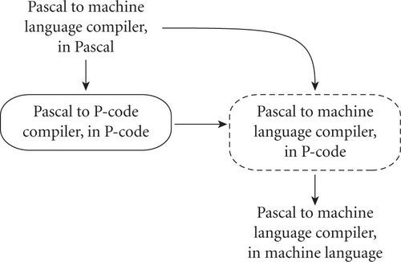

# Compilation and Interpretation

## Example 1.7 Pure compilation

At the highest level of abstraction, the compilation and execution of a program in a high-level language look something like this:

在最高抽象级别，以高级语言编译和执行程序的过程类似于以下内容：

	

The compiler translates the high-level source program into an equivalent target program (typically in machine language), and then goes away. At some arbitrary later time, the user tells the operating system to run the target program. The compiler is the locus of control during compilation; the target program is the locus of control during its own execution. The compiler is itself a machine language program, presumably created by compiling some other high-level program. When written to a file in a format understood by the operating system, machine language is commonly known as object code. 

编译器将高级源程序转换为等效的目标程序（通常使用机器语言），然后消失。在以后任意的某个时间，用户告诉操作系统运行目标程序。编译器是编译期间的控制源。目标程序是其自己执行期间的控制源。编译器本身是机器语言程序，大概是通过编译其他一些高级程序而创建的。当以操作系统可以理解的格式写入文件时，机器语言通常称为目标代码。

## Example 1.8 Pure interpretation

An alternative style of implementation for high-level languages is known as interpretation:

高级语言的另一种实现方式称为解释：

    

Unlike a compiler, an interpreter stays around for the execution of the application. In fact, the interpreter is the locus of control during that execution. In effect, the interpreter implements a virtual machine whose “machine language” is the high-level programming language. The interpreter reads statements in that language more or less one at a time, executing them as it goes along. 

与编译器不同，解释器会在执行应用程序时停留。实际上，解释器是执行期间的控制源。实际上，解释器实现了一种虚拟机，其“机器语言”是高级编程语言。解释器一次或多或少读取一种语言的语句，并随其执行。

In general, interpretation leads to greater flexibility and better diagnostics (error messages) than does compilation. Because the source code is being executed directly, the interpreter can include an excellent source-level debugger. It can also cope with languages in which fundamental characteristics of the program, such as the sizes and types of variables, or even which names refer to which variables, can depend on the input data. Some language features are almost impossible to implement without interpretation: in Lisp and Prolog, for example, a program can write new pieces of itself and execute them on the fly. (Several scripting languages also provide this capability.) Delaying decisions about program implementation until run time is known as late binding; we will discuss it at greater length in Section 3.1.

通常，与编译相比，解释可带来更大的灵活性和更好的诊断（错误消息）。因为源代码是直接执行的，所以解释器可以包括出色的源代码级调试器。它还可以处理程序的基本特征（例如变量的大小和类型，甚至哪个名称指的是哪个变量）所依赖的语言，这些语言可以取决于输入数据。如果不进行解释，则几乎无法实现某些语言功能：例如，在Lisp和Prolog中，程序可以编写自己的新片段并即时执行它们。 （几种脚本语言也提供了此功能。）将有关程序实现的决策延迟到运行时为止，这称为后期绑定。我们将在第3.1节中进行更详细的讨论。

Compilation, by contrast, generally leads to better performance. In general, a decision made at compile time is a decision that does not need to be made at run time. For example, if the compiler can guarantee that variable x will always lie at location 49378, it can generate machine language instructions that access this location whenever the source program refers to x. By contrast, an interpreter may need to look x up in a table every time it is accessed, in order to find its location. Since the (final version of a) program is compiled only once, but generally executed many times, the savings can be substantial, particularly if the interpreter is doing unnecessary work in every iteration of a loop.

相比之下，编译通常会带来更好的性能。通常，在编译时做出的决定是不需要在运行时做出的决定。例如，如果编译器可以保证变量x始终位于位置49378，则编译器可以生成只要源程序引用x都可以访问该位置的机器语言指令。相比之下，解释器可能需要在每次访问表时在表中查找x，以查找其位置。由于（最终版本）程序仅被编译一次，但通常执行多次，因此可以节省大量资金，尤其是如果解释器在循环的每次迭代中都在进行不必要的工作时。

## Example 1.9 Mixing compilation and interpretation

While the conceptual difference between compilation and interpretation is clear, most language implementations include a mixture of both. They typically look like this:

尽管编译和解释之间的概念差异很明显，但是大多数语言实现都将两者结合在一起。它们通常如下所示：

    

We generally say that a language is “interpreted” when the initial translator is simple. If the translator is complicated, we say that the language is “compiled.” The distinction can be confusing because “simple” and “complicated” are subjective terms, and because it is possible for a compiler (complicated translator) to produce code that is then executed by a complicated virtual machine (interpreter); this is in fact precisely what happens by default in Java. We still say that a language is compiled if the translator analyzes it thoroughly (rather than effecting some “mechanical” transformation), and if the intermediate program does not bear a strong resemblance to the source. These two characteristics—thorough analysis and nontrivial transformation—are the hallmarks of compilation. 

我们通常说的是，当初始翻译者很简单时，就可以“解释”一种语言。如果翻译人员很复杂，我们会说该语言是“已编译”的。这种区分可能会造成混淆，因为“简单”和“复杂”是主观术语，并且因为编译器（复杂的翻译器）有可能产生随后由复杂的虚拟机（解释器）执行的代码；实际上，这正是Java默认情况下发生的情况。我们仍然可以说，如果翻译者对语言进行了全面的分析（而不是进行一些“机械”的转换），并且中间程序与源代码没有很大的相似之处，那么就可以编译一种语言。这两个特性-全面的分析和非平凡的转换-是编译的标志。 

## Design & Implementation 

### 1.2 Compiled and interpreted languages

Certain languages (e.g., Smalltalk and Python) are sometimes referred to as “interpreted languages” because most of their semantic error checking must be performed at run time. Certain other languages (e.g., Fortran and C) are sometimes referred to as “compiled languages” because almost all of their semantic error checking can be performed statically. This terminology isn't strictly correct: interpreters for C and Fortran can be built easily, and a compiler can generate code to perform even the most extensive dynamic semantic checks. That said, language design has a profound effect on “compilability.”

某些语言（例如Smalltalk和Python）有时被称为“解释语言”，因为它们的大部分语义错误检查必须在运行时执行。某些其他语言（例如Fortran和C）有时也称为“编译语言”，因为它们的几乎所有语义错误检查都可以静态执行。这个术语并不是严格正确的：C和Fortran的解释器可以轻松构建，并且编译器可以生成代码来执行最广泛的动态语义检查。也就是说，语言设计对“可编译性”具有深远的影响。

In practice one sees a broad spectrum of implementation strategies:

在实践中，人们看到了广泛的实施策略：

## Example 1.10 Preprocessing

Most interpreted languages employ an initial translator (a preprocessor) that removes comments and white space, and groups characters together into tokens such as keywords, identifiers, numbers, and symbols. The translator may also expand abbreviations in the style of a macro assembler. Finally, it may identify higher-level syntactic structures, such as loops and subroutines. The goal is to produce an intermediate form that mirrors the structure of the source, but can be interpreted more efficiently. 

大多数解释语言都使用初始翻译器（预处理器）来删除注释和空格，并将字符组合在一起成为令牌，例如关键字，标识符，数字和符号。翻译器还可以以宏汇编器的形式扩展缩写。最后，它可以标识更高级别的语法结构，例如循环和子例程。目的是产生一种中间形式，该中间形式可以反映源的结构，但可以更有效地进行解释。

In some very early implementations of Basic, the manual actually suggested removing comments from a program in order to improve its performance. These implementations were pure interpreters; they would re-read (and then ignore) the comments every time they executed a given part of the program. They had no initial translator.

在Basic的某些非常早期的实现中，该手册实际上建议从程序中删除注释，以提高其性能。这些实现是纯解释器；他们每次执行程序的给定部分时都会重新阅读（然后忽略）注释。他们没有最初的翻译。

## Example 1.11 Library routines and linking

The typical Fortran implementation comes close to pure compilation. The compiler translates Fortran source into machine language. Usually, however, it counts on the existence of a library of subroutines that are not part of the original program. Examples include mathematical functions (sin, cos, log, etc.) and I/O. The compiler relies on a separate program, known as a linker, to merge the appropriate library routines into the final program:

典型的Fortran实现接近于纯编译。编译器将Fortran源代码翻译成机器语言。但是，通常，它依靠不属于原始程序的子例程库的存在。示例包括数学函数（正弦，余弦，对数等）和I/O。编译器依赖于一个单独的程序（称为链接器）将适当的库例程合并到最终程序中：

    

In some sense, one may think of the library routines as extensions to the hardware instruction set. The compiler can then be thought of as generating code for a virtual machine that includes the capabilities of both the hardware and the library.

从某种意义上讲，人们可能会将库例程视为对硬件指令集的扩展。然后可以将编译器视为为虚拟机生成代码，该代码包括硬件和库的功能。

In a more literal sense, one can find interpretation in the Fortran routines for formatted output. Fortran permits the use of format statements that control the alignment of output in columns, the number of significant digits and type of scientific notation for floating-point numbers, inclusion/suppression of leading zeros, and so on. Programs can compute their own formats on the fly. The output library routines include a format interpreter. A similar interpreter can be found in the printf routine of C and its descendants.

从字面上看，可以在Fortran例程中找到格式输出的解释。Fortran允许使用格式语句来控制列中输出的对齐，有效位数和浮点数的科学计数类型，前导零的包含/抑制等。程序可以动态计算自己的格式。输出库例程包括格式解释器。在C及其后代的printf例程中可以找到类似的解释器。

## Example 1.12 Post-compilation assembly

Many compilers generate assembly language instead of machine language. This convention facilitates debugging, since assembly language is easier for people to read, and isolates the compiler from changes in the format of machine language files that may be mandated by new releases of the operating system (only the assembler must be changed, and it is shared by many compilers):

许多编译器生成汇编语言而不是机器语言。此约定便于调试，因为汇编语言使人们更容易阅读，并且使编译器与操作系统新版本可能要求的机器语言文件格式的更改隔离开来（仅必须更改汇编程序，并且许多编译器共享）：

    

## Example 1.13 The C preprocessor

Compilers for C (and for many other languages running under Unix) begin with a preprocessor that removes comments and expands macros. The preprocessor can also be instructed to delete portions of the code itself, providing a conditional compilation facility that allows several versions of a program to be built from the same source:

C语言（以及在Unix下运行的许多其他语言）的编译器以预处理器开头，该预处理器删除注释并扩展宏。还可以指示预处理器删除代码本身的某些部分，从而提供条件编译工具，该工具允许从同一源构建程序的多个版本：

    

## Example 1.14 Source-to-source translation

A surprising number of compilers generate output in some high-level language—commonly C or some simplified version of the input language. Such source-to-source translation is particularly common in research languages and during the early stages of language development. One famous example was AT&T's original compiler for C++. This was indeed a true compiler, though it generated C instead of assembler: it performed a complete analysis of the syntax and semantics of the C++ source program, and with very few exceptions generated all of the error messages that a programmer would see prior to running the program. In fact, programmers were generally unaware that the C compiler was being used behind the scenes. The C++ compiler did not invoke the C compiler unless it had generated C code that would pass through the second round of compilation without producing any error messages:

数量惊人的编译器以某种高级语言（通常为C或输入语言的某些简化版本）生成输出。这种从源到源的翻译在研究语言中以及语言发展的早期特别普遍。一个著名的例子是AT＆T的原始 C++ 编译器。这确实是一个真正的编译器，尽管它生成的是C而不是汇编程序：它对 C++ 源程序的语法和语义进行了完整的分析，并且几乎没有例外，生成了程序员在运行之前会看到的所有错误消息。该程序。实际上，程序员通常不知道 C 编译器在幕后使用。 C++编译器不会调用C编译器，除非它生成了将通过第二轮编译而不会产生任何错误消息的C代码：

    

Occasionally one would hear the C++ compiler referred to as a preprocessor, presumably because it generated high-level output that was in turn compiled. I consider this a misuse of the term: compilers attempt to “understand” their source; preprocessors do not. Preprocessors perform transformations based on simple pattern matching, and may well produce output that will generate error messages when run through a subsequent stage of translation.

有时候，人们会听到称为预处理器的 C++ 编译器，大概是因为它生成了高级输出，然后又对其进行了编译。我认为这是对术语的滥用：编译器试图“理解”其源代码；预处理器不这样做。预处理器基于简单的模式匹配来执行转换，并且很可能会产生输出，该输出在进行后续翻译阶段时会生成错误消息。

Example 1.15 Bootstrapping

Many compilers are self-hosting: they are written in the language they compile—Ada compilers in Ada, C compilers in C. This raises an obvious question: how does one compile the compiler in the first place? The answer is to use a technique known as bootstrapping, a term derived from the intentionally ridiculous notion of lifting oneself off the ground by pulling on one's bootstraps. In a nutshell, one starts with a simple implementation—often an interpreter—and uses it to build progressively more sophisticated versions. We can illustrate the idea with an historical example.

许多编译器是自托管的：它们是用编译语言编写的-Ada中的Ada编译器，C中的C编译器。这提出了一个明显的问题：一个人如何首先编译该编译器？答案是使用一种称为Bootstrapping的技术，该术语源自故意荒谬的概念，即通过拉紧靴子将自己抬离地面。简而言之，首先是一个简单的实现（通常是解释器），然后使用它来逐步构建更复杂的版本。我们可以用一个历史例子来说明这个想法。

Many early Pascal compilers were built around a set of tools distributed by Niklaus Wirth. These included the following:

许多早期的Pascal编译器都是基于Niklaus Wirth分发的一组工具构建的。其中包括以下内容：

* A Pascal compiler, written in Pascal, that would generate output in P-code, a stack-based language similar to the bytecode of modern Java compilers   用Pascal编写的Pascal编译器，将以P代码生成输出，P代码是一种基于堆栈的语言，类似于现代Java编译器的字节码。
* The same compiler, already translated into P-code   相同的编译器，已转换为P代码
* A P-code interpreter, written in Pascal   用Pascal编写的P代码解释器

To get Pascal up and running on a local machine, the user of the tool set needed only to translate the P-code interpreter (by hand) into some locally available language. This translation was not a difficult task; the interpreter was small. By running the P-code version of the compiler on top of the P-code interpreter, one could then compile arbitrary Pascal programs into P-code, which could in turn be run on the interpreter. To get a faster implementation, one could modify the Pascal version of the Pascal compiler to generate a locally available variety of assembly or machine language, instead of generating P-code (a somewhat more difficult task). This compiler could then be bootstrapped—run through itself—to yield a machine-code version of the compiler:

为了使Pascal在本地计算机上运行并运行，该工具集的用户只需要将P代码解释器（手动）翻译成某种本地可用的语言即可。这项翻译不是一项艰巨的任务。口译员很小。通过在P代码解释器上运行编译器的P代码版本，然后可以将任意Pascal程序编译为P代码，然后可以在解释器上运行。为了获得更快的实现，可以修改Pascal编译器的Pascal版本，以生成本地可用的各种汇编语言或机器语言，而不是生成P代码（这有点困难）。然后可以引导该编译器（通过自身运行）以生成该编译器的机器代码版本：

    

In a more general context, suppose we were building one of the first compilers for a new programming language. Assuming we have a C compiler on our target system, we might start by writing, in a simple subset of C, a compiler for an equally simple subset of our new programming language. Once this compiler was working, we could hand-translate the C code into (the subset of) our new language, and then run the new source through the compiler itself. After that, we could repeatedly extend the compiler to accept a larger subset of the new programming language, bootstrap it again, and use the extended language to implement an even larger subset. “Self-hosting” implementations of this sort are actually quite common. 

在更一般的情况下，假设我们正在为一种新的编程语言构建第一个编译器。假设我们的目标系统上有一个C编译器，我们可能首先在C的一个简单子集中编写一个用于我们新编程语言的同一个简单子集的编译器。一旦该编译器开始工作，我们就可以将C代码手动翻译成我们的新语言（的子集），然后通过编译器本身运行新的源代码。之后，我们可以反复扩展编译器以接受新编程语言的更大子集，再次对其进行引导，然后使用扩展语言来实现更大的子集。这种“自我托管”实施实际上很常见。

## Design & Implementation

### 1.3 The early success of Pascal

The P-code-based implementation of Pascal, and its use of bootstrapping, are largely responsible for the language's remarkable success in academic circles in the 1970s. No single hardware platform or operating system of that era dominated the computer landscape the way the x86, Linux, and Windows do today.8 Wirth's toolkit made it possible to get an implementation of Pascal up and running on almost any platform in a week or so. It was one of the first great successes in system portability.

Pascal的基于P代码的实现及其对引导程序的使用，在很大程度上归因于该语言在1970年代在学术界的巨大成功。那个时代，没有哪个硬件平台或操作系统能像今天的x86，Linux和Windows一样在计算机领域占据主导地位。8 Wirth的工具包使得在一周左右的时间内在几乎任何平台上实现Pascal的实现和运行成为可能。它是系统可移植性的首批重大成功之一。

## Example 1.16 Compiling interpreted languages

One will sometimes find compilers for languages (e.g., Lisp, Prolog, Smalltalk) that permit a lot of late binding, and are traditionally interpreted. These compilers must be prepared, in the general case, to generate code that performs much of the work of an interpreter, or that makes calls into a library that does that work instead. In important special cases, however, the compiler can generate code that makes reasonable assumptions about decisions that won't be finalized until run time. If these assumptions prove to be valid the code will run very fast. If the assumptions are not correct, a dynamic check will discover the inconsistency, and revert to the interpreter. ■

有时人们会找到语言的编译器（例如Lisp，Prolog，Smalltalk），这些编译器允许进行大量后期绑定，并按传统方式进行解释。在一般情况下，必须准备好这些编译器以生成执行解释器的大部分工作的代码，或者生成对执行该工作的库的调用。但是，在重要的特殊情况下，编译器可以生成对运行前不会最终确定的决策做出合理假设的代码。如果这些假设被证明是正确的，那么代码将运行得非常快。如果假设不正确，则动态检查将发现不一致之处，并返回到解释器。

## Example 1.17 Dynamic and just-in-time compilation

In some cases a programming system may deliberately delay compilation until the last possible moment. One example occurs in language implementations (e.g., for Lisp or Prolog) that invoke the compiler on the fly, to translate newly created source into machine language, or to optimize the code for a particular input set. Another example occurs in implementations of Java. The Java language definition defines a machine-independent intermediate form known as Java bytecode. Bytecode is the standard format for distribution of Java programs; it allows programs to be transferred easily over the Internet, and then run on any platform. The first Java implementations were based on byte-code interpreters, but modern implementations obtain significantly better performance with a just-in-time compiler that translates bytecode into machine language immediately before each execution of the program:

在某些情况下，编程系统可能会故意将编译延迟到可能的最后时刻。一个示例发生在语言实现中（例如，对于Lisp或Prolog），该实现即时调用编译器，将新创建的源代码翻译成机器语言或针对特定输入集优化代码。另一个示例出现在Java的实现中。 Java语言定义定义了一种与机器无关的中间形式，称为Java字节码。字节码是分发Java程序的标准格式；它使程序可以轻松地通过Internet传输，然后在任何平台上运行。最初的Java实现是基于字节码解释器的，但是现代的实现使用即时编译器获得了明显更好的性能，该编译器在每次执行程序之前立即将字节码转换为机器语言：

    

C#, similarly, is intended for just-in-time translation. The main C# compiler produces Common Intermediate Language (CIL), which is then translated into machine language immediately prior to execution. CIL is deliberately language independent, so it can be used for code produced by a variety of front-end compilers. We will explore the Java and C# implementations in detail in Section 16.1. 

C# 同样适用于即时翻译。C#主编译器生成通用中间语言（CIL），然后在执行之前立即将其翻译成机器语言。 CIL故意与语言无关，因此它可用于各种前端编译器生成的代码。我们将在16.1节中详细探讨Java和C#实现。

## Example 1.18 Microcode (firmware)

On some machines (particularly those designed before the mid-1980s), the assembly-level instruction set is not actually implemented in hardware, but in fact runs on an interpreter. The interpreter is written in low-level instructions called microcode (or firmware), which is stored in read-only memory and executed by the hardware. Microcode and microprogramming are considered further in Section C-5.4.1.

在某些机器上（特别是1980年代中期以前设计的机器），汇编级指令集实际上不是在硬件中实现的，但实际上是在解释器上运行的。解释器以称为微码（或固件）的低级指令编写，该指令存储在只读存储器中并由硬件执行。C-5.4.1节进一步考虑了微代码和微编程。

As some of these examples make clear, a compiler does not necessarily translate from a high-level programming language into machine language. Some compilers, in fact, accept inputs that we might not immediately think of as programs at all. Text formatters like TEX, for example, compile high-level document descriptions into commands for a laser printer or phototypesetter. (Many laser printers themselves contain pre-installed interpreters for the Postscript page-description language.) Query language processors for database systems translate languages like SQL into primitive operations on files. There are even compilers that translate logic-level circuit specifications into photographic masks for computer chips. Though the focus in this book is on imperative programming languages, the term “compilation” applies whenever we translate automatically from one nontrivial language to another, with full analysis of the meaning of the input.

正如其中一些示例所清楚表明的那样，编译器不一定会从高级编程语言转换为机器语言。实际上，某些编译器接受的输入我们可能根本不会立即将其视为程序。例如，诸如TEX之类的文本格式器会将高级文档描述编译为用于激光打印机或照排机的命令。（许多激光打印机本身都预装了Postscript页面描述语言的解释器。）数据库系统的查询语言处理器将SQL等语言转换为对文件的原始操作。甚至有编译器将逻辑级电路规范转换为计算机芯片的照相掩模。尽管本书的重点是命令式编程语言，但是只要我们对输入的含义进行全面分析，只要我们自动将一种非平凡的语言转换为另一种非平凡的语言，就会使用术语“编译”。
