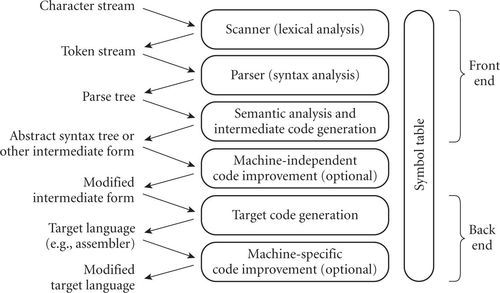
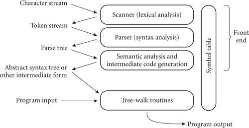
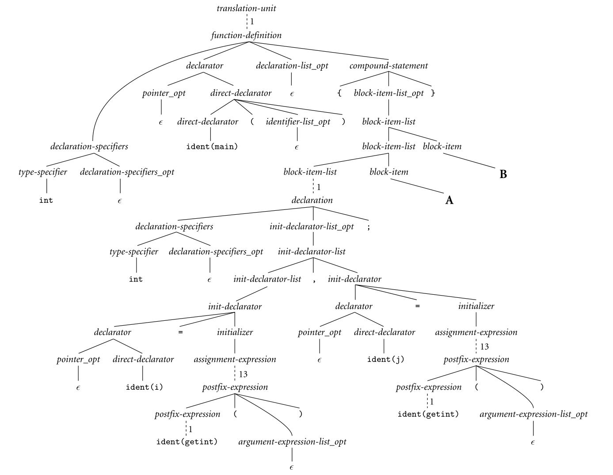
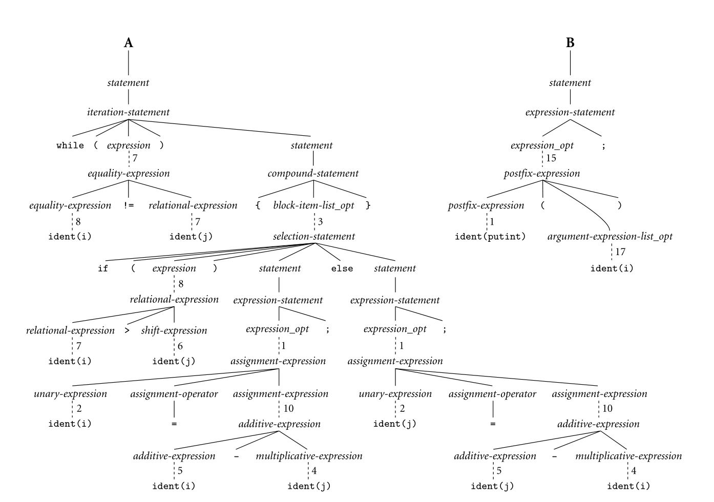

# An Overview of Compilation

Compilers are among the most well-studied computer programs. We will consider them repeatedly throughout the rest of the book, and in chapters 2, 4, 15, and 17 in particular. The remainder of this section provides an introductory overview.

编译器是研究最深入的计算机程序之一。在本书的其余部分，尤其是在第2、4、15和17章中，我们将反复考虑它们。本节的其余部分提供了介绍性概述。

## Example 1.19 Phases of compilation and interpretation

In a typical compiler, compilation proceeds through a series of well-defined phases, shown in Figure 1.3. Each phase discovers information of use to later phases, or transforms the program into a form that is more useful to the subsequent phase.

在典型的编译器中，编译将通过一系列明确定义的阶段进行，如图1.3所示。每个阶段都会发现后续阶段的使用信息，或者将程序转换为对后续阶段更有用的形式。

<p align="center">
	
</p>

FIGURE 1.3 Phases of compilation. Phases are listed on the right and the forms in which information is passed between phases are listed on the left. The symbol table serves throughout compilation as a repository for information about identifiers.

The first few phases (up through semantic analysis) serve to figure out the meaning of the source program. They are sometimes called the front end of the compiler. The last few phases serve to construct an equivalent target program. They are sometimes called the back end of the compiler.

An interpreter (Figure 1.4) shares the compiler's front-end structure, but “executes” (interprets) the intermediate form directly, rather than translating it into machine language. The execution typically takes the form of a set of mutually recursive subroutines that traverse (“walk”) the syntax tree, “executing” its nodes in program order. Many compiler and interpreter phases can be created automatically from a formal description of the source and/or target languages. 

<p align="center">
	
</p>

FIGURE 1.4 Phases of interpretation. The front end is essentially the same as that of a compiler. The final phase “executes” the intermediate form, typically using a set of mutually recursive subroutines that walk the syntax tree.

One will sometimes hear compilation described as a series of passes. A pass is a phase or set of phases that is serialized with respect to the rest of compilation: it does not start until previous phases have completed, and it finishes before any subsequent phases start. If desired, a pass may be written as a separate program, reading its input from a file and writing its output to a file. Compilers are commonly divided into passes so that the front end may be shared by compilers for more than one machine (target language), and so that the back end may be shared by compilers for more than one source language. In some implementations the front end and the back end may be separated by a “middle end” that is responsible for language- and machine-independent code improvement. Prior to the dramatic increases in memory sizes of the mid to late 1980s, compilers were also sometimes divided into passes to minimize memory usage: as each pass completed, the next could reuse its code space.

## 1.6.1 Lexical and Syntax Analysis

### Example 1.20 GCD program in C

Consider the greatest common divisor (GCD) problem introduced at the beginning of this chapter, and shown as a function in Figure 1.2. Hypothesizing trivial I/O routines and recasting the function as a stand-alone program, our code might look like this in C:

```c
int main() {
    int i = getint(), j = getint();
    while (i != j) {
        if (i > j) i = i - j;
        else j = j - i;
    }
    putint(i);
}
```

### Example 1.21 GCD program tokens

Scanning and parsing serve to recognize the structure of the program, without regard to its meaning. The scanner reads characters ('i', 'n', 't', ' ', 'm', 'a', 'i', 'n', '(',')', etc.) and groups them into tokens, which are the smallest meaningful units of the program. In our example, the tokens are

```
int	main	(	)	{	int	i	=
getint	(	)	,	j	=	getint	(
)	;	while	(	i	!=	j	)
{	if	(	i	> 	j	)	i
=	i	−	j	;	else	j	=
j	−	i	;	}	putint	(	i
)	;	}					
```

Scanning is also known as lexical analysis. The principal purpose of the scanner is to simplify the task of the parser, by reducing the size of the input (there are many more characters than tokens) and by removing extraneous characters like white space. The scanner also typically removes comments and tags tokens with line and column numbers, to make it easier to generate good diagnostics in later phases. One could design a parser to take characters instead of tokens as input— dispensing with the scanner—but the result would be awkward and slow.

### Example 1.22 Context-free grammar and parsing

Parsing organizes tokens into a parse tree that represents higher-level constructs (statements, expressions, subroutines, and so on) in terms of their constituents. Each construct is a node in the tree; its constituents are its children. The root of the tree is simply “program”; the leaves, from left to right, are the tokens received from the scanner. Taken as a whole, the tree shows how the tokens fit together to make a valid program. The structure relies on a set of potentially recursive rules known as a context-free grammar. Each rule has an arrow sign (→) with the construct name on the left and a possible expansion on the right.9 In C, for example, a while loop consists of the keyword while followed by a parenthesized Boolean expression and a statement:

```
iteration-statement -> while ( expression ) statement
```

The statement, in turn, is often a list enclosed in braces:

```
statement → compound-statement
compound-statement → { block-item-list_opt }
```

where

```
block-item-list_opt → block-item-list
```

or

```
block-item-list_opt → ε
```

and

```
block-item-list → block-item
block-item-list → block-item-list block-item
block-item → declaration
block-item → statement
```

Here ε represents the empty string; it indicates that block-item-list_opt can simply be deleted. Many more grammar rules are needed, of course, to explain the full structure of a program.

### Example 1.23 GCD program parse tree

A context-free grammar is said to define the syntax of the language; parsing is therefore known as syntax analysis. There are many possible grammars for C (an infinite number, in fact); the fragment shown above is taken from the sample grammar contained in the official language definition [Int99]. A full parse tree for our GCD program (based on a full grammar not shown here) appears in Figure 1.5. While the size of the tree may seem daunting, its details aren't particularly important at this point in the text. What is important is that (1) each individual branching point represents the application of a single grammar rule, and (2) the resulting complexity is more a reflection of the grammar than it is of the input program. Much of the bulk stems from (a) the use of such artificial “constructs” as block_item-list and block_item-list_opt to generate lists of arbitrary length, and (b) the use of the equally artificial assignment-expression, additive-expression, multiplicative-expression, and so on, to capture precedence and associativity in arithmetic expressions. We shall see in the following subsection that much of this complexity can be discarded once parsing is complete. ■

<p align="center">
	
    
</p>

FIGURE 1.5 Parse tree for the GCD program. The symbol ε represents the empty string. Dotted lines indicate a chain of one-for-one replacements, elided to save space; the adjacent number indicates the number of omitted nodes. While the details of the tree aren't important to the current chapter the sheer amount of detail is: it comes from having to fit the (much simpler) source code into the hierarchical structure of a context-free grammar.
