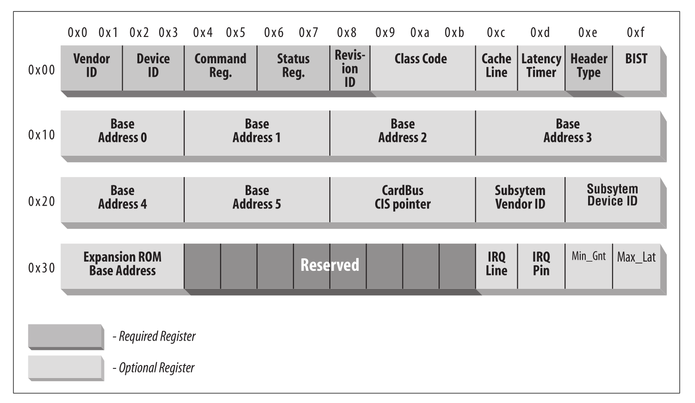
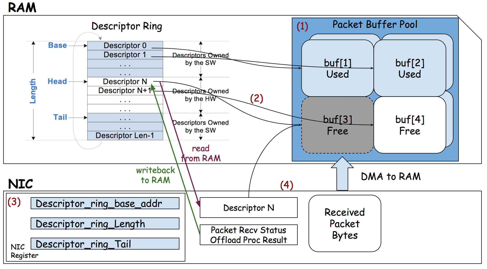

# IXY 代码的阅读笔记

## 1 起点 `ixy-fwd.c`

### 1.1 初始化设备

```c
int main(int argc, char* argv[]) {
    /* 两个参数 分别为 端口1 和 端口 2 的总线地址 */
    if (argc != 3) {
        printf("%s forwards packets between two ports.\n", argv[0]);
        printf("Usage: %s <pci bus id2> <pci bus id1>\n", argv[0]);
        return 1;
    }

    /* 根据总线地址 为两个端口创建 ixy 设备对象 */
    struct ixy_device* dev1 = ixy_init(argv[1], 1, 1);
    struct ixy_device* dev2 = ixy_init(argv[2], 1, 1);
```

#### 1.1.1 创建并初始化 `ixy` 设备对象

```c
struct ixy_device* ixy_init(const char* pci_addr, uint16_t rx_queues, uint16_t tx_queues) {
    // Read PCI configuration space
    int config = pci_open_resource(pci_addr, "config");
    uint16_t vendor_id = read_io16(config, 0);
    uint16_t device_id = read_io16(config, 2);
    uint32_t class_id = read_io32(config, 8) >> 24;
    close(config);
    if (class_id != 2) {
        error("Device %s is not a NIC", pci_addr);
    }
    if (vendor_id == 0x1af4 && device_id >= 0x1000) {
        return virtio_init(pci_addr, rx_queues, tx_queues);
    } else {
        // Our best guess is to try ixgbe
        return ixgbe_init(pci_addr, rx_queues, tx_queues);
    }
}
```

在初始化 设备 对象之前，首先要读取 PCI 设备信息。

```c
int config = pci_open_resource(pci_addr, "config");
uint16_t vendor_id = read_io16(config, 0);
uint16_t device_id = read_io16(config, 2);
uint32_t class_id = read_io32(config, 8) >> 24;
close(config);
```

分别读取了三个变量 `vendor_id` 厂商ID，`device_id` 设备ID，`class_id` 类别的高 8 位（也就是分组信息），这里分组信息必须为 2 也就是 network 类：

```c
    if (class_id != 2) {
        error("Device %s is not a NIC", pci_addr);
    }
```

然后根据厂商 ID 和 设备 ID选择合适的驱动接口初始化：

```c
    if (vendor_id == 0x1af4 && device_id >= 0x1000) {
        return virtio_init(pci_addr, rx_queues, tx_queues);
    } else {
        // Our best guess is to try ixgbe
        return ixgbe_init(pci_addr, rx_queues, tx_queues);
    }
```

##### 1.1.1.1 读取 `PCIe` 设备的配置信息，识别设备类型

读取 `PCIe` 设备的配置信息，是通过读取 `sysfs` 中的文件 `/sys/bus/pci/devices/<bus id>/config` 实现的。

```c
int pci_open_resource(const char* pci_addr, const char* resource) {
    char path[PATH_MAX];
    snprintf(path, PATH_MAX, "/sys/bus/pci/devices/%s/%s", pci_addr, resource);
    debug("Opening PCI resource at %s", path);
    int fd = check_err(open(path, O_RDWR), "open pci resource");
    return fd;
}
```

###### sysfs 中的 `PCI` 设备信息

首先先看一下在我的服务器上实际显示情况：

```sh
[root@localhost ~]# ll /sys/bus/pci/devices/0000\:02\:00.0/
total 0
-rw-r--r--. 1 root root    4096 Oct  1 11:23 broken_parity_status
-r--r--r--. 1 root root    4096 Oct  1 11:23 class
-rw-r--r--. 1 root root    4096 Oct  1 10:55 config
-r--r--r--. 1 root root    4096 Oct  1 11:23 consistent_dma_mask_bits
-rw-r--r--. 1 root root    4096 Oct  1 11:23 d3cold_allowed
-r--r--r--. 1 root root    4096 Oct  1 10:55 device
-r--r--r--. 1 root root    4096 Oct  1 11:23 dma_mask_bits
lrwxrwxrwx. 1 root root       0 Oct  1 10:55 driver -> ../../../../bus/pci/drivers/ixgbe
-rw-r--r--. 1 root root    4096 Oct  1 11:23 driver_override
-rw-r--r--. 1 root root    4096 Oct  1 11:23 enable
lrwxrwxrwx. 1 root root       0 Oct  1 11:23 firmware_node -> ../../../LNXSYSTM:00/device:00/PNP0A08:00/device:6c/device:6d
-r--r--r--. 1 root root    4096 Oct  1 11:23 irq
-r--r--r--. 1 root root    4096 Oct  1 11:23 local_cpulist
-r--r--r--. 1 root root    4096 Oct  1 11:23 local_cpus
-r--r--r--. 1 root root    4096 Oct  1 11:23 modalias
-rw-r--r--. 1 root root    4096 Oct  1 11:23 msi_bus
drwxr-xr-x. 2 root root       0 Oct  1 11:23 msi_irqs
drwxr-xr-x. 3 root root       0 Oct  1 10:55 net
-r--r--r--. 1 root root    4096 Oct  1 11:23 numa_node
drwxr-xr-x. 2 root root       0 Oct  1 11:23 power
--w--w----. 1 root root    4096 Oct  1 11:23 remove
--w--w----. 1 root root    4096 Oct  1 11:23 rescan
--w-------. 1 root root    4096 Oct  1 11:23 reset
-r--r--r--. 1 root root    4096 Oct  1 11:23 resource
-rw-------. 1 root root 8388608 Oct  1 11:23 resource0
-rw-------. 1 root root      32 Oct  1 11:23 resource2
-rw-------. 1 root root   16384 Oct  1 11:23 resource4
-rw-------. 1 root root 4194304 Oct  1 11:23 rom
-rw-rw-r--. 1 root root    4096 Oct  1 11:23 sriov_numvfs
-r--r--r--. 1 root root    4096 Oct  1 11:23 sriov_totalvfs
lrwxrwxrwx. 1 root root       0 Oct  1 10:55 subsystem -> ../../../../bus/pci
-r--r--r--. 1 root root    4096 Oct  1 11:23 subsystem_device
-r--r--r--. 1 root root    4096 Oct  1 11:23 subsystem_vendor
-rw-r--r--. 1 root root    4096 Oct  1 10:55 uevent
-r--r--r--. 1 root root    4096 Oct  1 10:55 vendor
-rw-------. 1 root root   32768 Oct  1 11:23 vpd
```

然后参考文档 [`Documentation/filesystems/sysfs-pci.txt`](https://www.kernel.org/doc/Documentation/filesystems/sysfs-pci.txt)

| file                 | function
|----------------------|------------------------------------------------------
| class                | PCI class (ascii, ro)
| config               | PCI config space (binary, rw)
| device               | PCI device (ascii, ro)
| enable               | Whether the device is enabled (ascii, rw)
| irq                  | IRQ number (ascii, ro)
| local_cpus           | nearby CPU mask (cpumask, ro)
| remove               | remove device from kernel's list (ascii, wo)
| resource             | PCI resource host addresses (ascii, ro)
| resource0..N         | PCI resource N, if present (binary, mmap, rw[1])
| resource0_wc..N_wc   | PCI WC map resource N, if prefetchable (binary, mmap)
| revision             | PCI revision (ascii, ro)
| rom                  | PCI ROM resource, if present (binary, ro)
| subsystem_device     | PCI subsystem device (ascii, ro)
| subsystem_vendor     | PCI subsystem vendor (ascii, ro)
| vendor               | PCI vendor (ascii, ro)

* `ro`      - read only file
* `rw`      - file is readable and writable
* `wo`      - write only file
* `mmap`    - file is mmapable
* `ascii`   - file contains ascii text
* `binary`  - file contains binary data
* `cpumask` - file contains a cpumask type

config 文件为PCI设备的**通用配置空间**的映射，二进制结构，可以读写。

**LDD3** 第12章的描述：

The file `config` is a binary file that allows the raw `PCI` config information to be read from the device (just like the `/proc/bus/pci/*/*` provides.) The files `vendor`, `device`, `subsystem_device`, `subsystem_vendor`, and `class` all refer to the specific values of this `PCI` device (all `PCI` devices provide this information.) The file `irq` shows the current `IRQ` assigned to this `PCI` device, and the file `resource` shows the current memory resources allocated by this device.

`config`文件是一个二进制文件，允许从设备读取原始的 `PCI` 配置信息（就像 `/proc/bus/pci/*/*` 提供的那样）。`vendor`，`device`，`subsystem_device`，`subsystem_vendor` 和 `class` 都表示该 `PCI` 设备的特定值（所有PCI设备都提供此信息）。文件 irq 显示分配给此 `PCI` 设备的当前IRQ，`resource` 显示此设备分配的当前内存资源。



*Figure 12-2. The standardized PCI configuration registers*

Three or five PCI registers identify a device: `vendorID` , `deviceID` , and `class` are the three that are always used. Every PCI manufacturer assigns proper values to these read-only registers, and the driver can use them to look for the device. Additionally, the fields `subsystem vendorID` and `subsystem deviceID` are sometimes set by the vendor to further differentiate similar devices.

用三个或五个PCI寄存器可标识一个设备：`vendorID` , `deviceID` , 和 `class`是常用的三个寄存器。每个PCI制造商会将正确的值赋予这三个只读寄存器，驱动程序可利用它们查询设备。此外，有时厂商利用 `subsystem vendorID` 和 `subsystem deviceID` 两个字段来进一步区分相似的设备。

**vendorID**

This 16-bit register identifies a hardware manufacturer. For instance, every Intel device is marked with the same vendor number, 0x8086 . There is a global registry of such numbers, maintained by the PCI Special Interest Group, and manufacturers must apply to have a unique number assigned to them.

这个 16 位的寄存器，用于标识硬件制造商。例如，每个 Intel 设备被标识为同一个厂商编号 `0x8086`，`PCI Special Interest Group` 维护有一个全球的厂商编号注册表，制造商必须申请一个唯一编号并赋予它们的寄存器。

**deviceID**

This is another 16-bit register, selected by the manufacturer; no official registration is required for the device ID. This ID is usually paired with the vendor ID to make a unique 32-bit identifier for a hardware device. We use the word signature to refer to the vendor and device ID pair. A device driver usually relies on the signature to identify its device; you can find what value to look for in the hardware manual for the target device.

这是另外一个 16 位寄存器，由制造商选择；无需对设备ID进行官方注册。该ID 通常和产商ID配对生成一个唯一的 32位硬件设备标识符。我们使用签名（signature）依次来表示一堆厂商和设备ID。设备驱动程序通常依靠该签名来识别其设备；可以从硬件手册中找到目标设备的签名值。

**class**

Every peripheral device belongs to a class. The class register is a 16-bit value whose top 8 bits identify the “base class” (or group). For example, “ethernet” and “token ring” are two classes belonging to the “network” group, while the “serial” and “parallel” classes belong to the “communication” group. Some drivers can support several similar devices, each of them featuring a different signature but all belonging to the same class; these drivers can rely on the class register to identify their peripherals, as shown later.

每个外部设备属于某个类（class）。class 寄存器是一个 16 位的值，其中，高 8 位标识了 “基类（base class）”，或者组。例如 “ethernet （以太网）”和 “token ring（令牌环）” 是同属 “network （网络）”组的两个类，而 “serial （串行）”和 “parallel（并行）”类同属 “communication（通信）” 组。某些驱动程序可支持多个相似的设备，每个具有不同的签名，但都属于同一个类；这些驱动程序可依靠 class 寄存器来识别他们的外设。如后所述。

**subsystem vendorID**
**subsystem deviceID**

These fields can be used for further identification of a device. If the chip is a generic interface chip to a local (onboard) bus, it is often used in several completely different roles, and the driver must identify the actual device it is talking with. The subsystem identifiers are used to this end.

这两个字段可用来进一步识别设备。如果设备中的芯片是一个连接到本地板载（onboard）总线上的通用接口芯片，则可能会用于完全不同的多种用途，这时，驱动程序必须识别它所关心的实际设备。子系统标识符就用于此目的。

Using these different identifiers, a PCI driver can tell the kernel what kind of devices it supports.

PCI 驱动程序可以使用这些不同的标识符来告诉内核它支持什么样的设备。

##### 1.1.1.2 初始化 `ixgbe` 设备

在厂商ID 为 0x8086 设备 ID 为 万兆网卡的设备ID 如，我的服务器 82599ES 的设备ID为 0x10fb,就会调用 `ixgbe_init`：

```c
struct ixy_device* ixgbe_init(const char* pci_addr, uint16_t rx_queues, uint16_t tx_queues) {
    if (getuid()) {
        warn("Not running as root, this will probably fail");
    }
    if (rx_queues > MAX_QUEUES) {
        error("cannot configure %d rx queues: limit is %d", rx_queues, MAX_QUEUES);
    }
    if (tx_queues > MAX_QUEUES) {
        error("cannot configure %d tx queues: limit is %d", tx_queues, MAX_QUEUES);
    }
    struct ixgbe_device* dev = (struct ixgbe_device*) malloc(sizeof(struct  ixgbe_device));
    dev->ixy.pci_addr = strdup(pci_addr);
    dev->ixy.driver_name = driver_name;
    dev->ixy.num_rx_queues = rx_queues;
    dev->ixy.num_tx_queues = tx_queues;
    dev->ixy.rx_batch = ixgbe_rx_batch;
    dev->ixy.tx_batch = ixgbe_tx_batch;
    dev->ixy.read_stats = ixgbe_read_stats;
    dev->ixy.set_promisc = ixgbe_set_promisc;
    dev->ixy.get_link_speed = ixgbe_get_link_speed;
    dev->addr = pci_map_resource(pci_addr);
    dev->rx_queues = calloc(rx_queues, sizeof(struct ixgbe_rx_queue) + sizeof(void*) * MAX_RX_QUEUE_ENTRIES);
    dev->tx_queues = calloc(tx_queues, sizeof(struct ixgbe_tx_queue) + sizeof(void*) * MAX_TX_QUEUE_ENTRIES);
    reset_and_init(dev);
    return &dev->ixy;
}
```

> 设备ID 的类型 需要参考 《[Intel ® 82599 10 GbE Controller Datasheet](https://www.intel.com/content/dam/www/public/us/en/documents/datasheets/82599-10-gbe-controller-datasheet.pdf)》 和 《[Intel ®  82599 10 GbE Controller Specification Update](https://www.intel.com/content/dam/www/public/us/en/documents/specification-updates/82599-10-gbe-controller-spec-update.pdf)》，在规格说明中 `0x10fb` 的设备类型为 `82599 (SFI/SFP+)`

###### 设备对象

`device.h` 定义的 `struct ixy_device` 为 ixy 设备的通用结构：

```c
struct ixy_device {
    const char* pci_addr;
    const char* driver_name;
    uint16_t num_rx_queues;
    uint16_t num_tx_queues;
    uint32_t (*rx_batch) (struct ixy_device* dev, uint16_t queue_id, struct pkt_buf* bufs[], uint32_t num_bufs);
    uint32_t (*tx_batch) (struct ixy_device* dev, uint16_t queue_id, struct pkt_buf* bufs[], uint32_t num_bufs);
    void (*read_stats) (struct ixy_device* dev, struct device_stats* stats);
    void (*set_promisc) (struct ixy_device* dev, bool enabled);
    uint32_t (*get_link_speed) (const struct ixy_device* dev);
};
```

`ixgbe.h`  中定义了 `ixgbe` 设备的结构 `struct ixgbe_device` ，其中包含了 ixy 的设备对象，也就是继承了 ixy 的对象：

```c
struct ixgbe_device {
    struct ixy_device ixy;
    uint8_t* addr;
    void* rx_queues;
    void* tx_queues;
};
```

###### 映射 `BAR0` 的 `resource`

ixgbe设备通过 `pci_map_resource` 将 BAR0 对应的 `resource` 地址空间映射到 ixy 应用的地址空间，并由 ixgbe 设备结构中的 addr 成员变量指向这个地址空间，这个地址空间包括了 82599 所有的统计和配置寄存器的映射。

```c
dev->addr = pci_map_resource(pci_addr);
```

```c
uint8_t* pci_map_resource(const char* pci_addr) {
    char path[PATH_MAX];
    snprintf(path, PATH_MAX, "/sys/bus/pci/devices/%s/resource0", pci_addr);
    debug("Mapping PCI resource at %s", path);
    remove_driver(pci_addr);
    enable_dma(pci_addr);
    int fd = check_err(open(path, O_RDWR), "open pci resource");
    struct stat stat;
    check_err(fstat(fd, &stat), "stat pci resource");
    return (uint8_t*) check_err(mmap(NULL, stat.st_size, PROT_READ | PROT_WRITE, MAP_SHARED, fd, 0), "mmap pci resource");
}
```

以后 ixgbe 设备的操作都需要通过读写这个内存区域来实现。

参考 《[Intel ® 82599 10 GbE Controller Datasheet](https://www.intel.com/content/dam/www/public/us/en/documents/datasheets/82599-10-gbe-controller-datasheet.pdf)》 *table 8-1 the 82599 Address Regions*


###### 卸载原有驱动程序

在映射 `resource` 之前，需要移除当前设备上已经挂接的驱动程序 `remove_driver`。

```c
void remove_driver(const char* pci_addr) {
    char path[PATH_MAX];
    snprintf(path, PATH_MAX, "/sys/bus/pci/devices/%s/driver/unbind", pci_addr);
    int fd = open(path, O_WRONLY);
    if (fd == -1) {
        debug("no driver loaded");
        return;
    }
    if (write(fd, pci_addr, strlen(pci_addr)) != (ssize_t) strlen(pci_addr)) {
        warn("failed to unload driver for device %s", pci_addr);
    }
    check_err(close(fd), "close");
}
```

* 参考 [Manual driver binding and unbinding](https://lwn.net/Articles/143397/)
* 参考 [使用 `/sys` 文件系统访问 Linux 内核](https://www.ibm.com/developerworks/cn/linux/l-cn-sysfs/index.html)\
* 参考 [Documentation/ABI/testing/sysfs-bus-pci.txt](https://www.kernel.org/doc/Documentation/ABI/testing/sysfs-bus-pci)

sysfs-buf-pci 中的描述：

```text
What:           /sys/bus/pci/drivers/.../bind
Date:           December 2003
Contact:        linux-pci@vger.kernel.org
Description:
                Writing a device location to this file will cause
                the driver to attempt to bind to the device found at
                this location. This is useful for overriding default
                bindings.  The format for the location is: DDDD:BB:DD.F.
                That is Domain:Bus:Device.Function and is the same as
                found in /sys/bus/pci/devices/.  For example:
                # echo 0000:00:19.0 > /sys/bus/pci/drivers/foo/bind
                (Note: kernels before 2.6.28 may require echo -n).

What:           /sys/bus/pci/drivers/.../unbind
Date:           December 2003
Contact:        linux-pci@vger.kernel.org
Description:
                Writing a device location to this file will cause the
                driver to attempt to unbind from the device found at
                this location.	This may be useful when overriding default
                bindings.  The format for the location is: DDDD:BB:DD.F.
                That is Domain:Bus:Device.Function and is the same as
                found in /sys/bus/pci/devices/. For example:
                # echo 0000:00:19.0 > /sys/bus/pci/drivers/foo/unbind
                (Note: kernels before 2.6.28 may require echo -n).
```

###### 启用 DMA 功能

在卸载完驱动之后 需要启动 dma 功能 `enable_dma` ：

```c
void enable_dma(const char* pci_addr) {
    char path[PATH_MAX];
    snprintf(path, PATH_MAX, "/sys/bus/pci/devices/%s/config", pci_addr);
    int fd = check_err(open(path, O_RDWR), "open pci config");
    // write to the command register (offset 4) in the PCIe config space
    // bit 2 is "bus master enable", see PCIe 3.0 specification section 7.5.1.1
    assert(lseek(fd, 4, SEEK_SET) == 4);
    uint16_t dma = 0;
    assert(read(fd, &dma, 2) == 2);
    dma |= 1 << 2;
    assert(lseek(fd, 4, SEEK_SET) == 4);
    assert(write(fd, &dma, 2) == 2);
    check_err(close(fd), "close");
}
```

>**PCIe 3.0 specification section 7.5.1.1**
>
>**Bit Location** : 2
>
>**Bus Master Enable** – Controls the ability of a PCI Express Endpoint to issue Memory 95 and I/O Read/Write Requests, and the ability of a Root or Switch Port to forward Memory and I/O Read/Write Requests in the Upstream direction
>
>Endpoints:
>
>When this bit is Set, the PCI Express Function is allowed to issue Memory or I/O Requests.
>
>When this bit is Clear, the PCI Express Function is not allowed to issue any Memory or I/O Requests.
>
>Note that as MSI/MSI-X interrupt Messages are in-band memory writes, setting the Bus Master Enable bit to 0b disables MSI/MSI-X interrupt Messages as well.
>
>Requests other than Memory or I/O Requests are not controlled by this bit.
>
>Default value of this bit is 0b.
>
>This bit is hardwired to 0b if a Function does not generate Memory or I/O Requests.
>
>Root and Switch Ports:
>
>This bit controls forwarding of Memory or I/O Requests by a Switch or Root Port in the Upstream direction. When this bit is 0b, Memory and I/O Requests received at a Root Port or the Downstream side of a Switch Port must be handled as Unsupported Requests (UR), and for Non-Posted Requests a Completion with UR completion status must be returned. This bit does not affect forwarding of Completions in either the Upstream or Downstream direction. 
>
>The forwarding of Requests other than Memory or I/O Requests is not controlled by this bit.
>
>Default value of this bit is 0b.

###### **申请接收和发送队列**

初始化完毕相应接口后，ixgbe_init 需要申请 接收和发送 队列：

```c
    dev->rx_queues = calloc(rx_queues, sizeof(struct ixgbe_rx_queue) + sizeof(void*) * MAX_RX_QUEUE_ENTRIES);
    dev->tx_queues = calloc(tx_queues, sizeof(struct ixgbe_tx_queue) + sizeof(void*) * MAX_TX_QUEUE_ENTRIES);
```

###### **重置并初始化网卡**

最后 `ixgbe_init` 调用 `reset_and_init` 重置并重新初始化网卡：

```c
// see section 4.6.3
static void reset_and_init(struct ixgbe_device* dev) {
    info("Resetting device %s", dev->ixy.pci_addr);
    // section 4.6.3.1 - disable all interrupts
    set_reg32(dev->addr, IXGBE_EIMC, 0x7FFFFFFF);

    // section 4.6.3.2
    set_reg32(dev->addr, IXGBE_CTRL, IXGBE_CTRL_RST_MASK);
    wait_clear_reg32(dev->addr, IXGBE_CTRL, IXGBE_CTRL_RST_MASK);
    usleep(10000);

    // section 4.6.3.1 - disable interrupts again after reset
    set_reg32(dev->addr, IXGBE_EIMC, 0x7FFFFFFF);

    info("Initializing device %s", dev->ixy.pci_addr);

    // section 4.6.3 - Wait for EEPROM auto read completion
    wait_set_reg32(dev->addr, IXGBE_EEC, IXGBE_EEC_ARD);

    // section 4.6.3 - Wait for DMA initialization done (RDRXCTL.DMAIDONE)
    wait_set_reg32(dev->addr, IXGBE_RDRXCTL, IXGBE_RDRXCTL_DMAIDONE);

    // section 4.6.4 - initialize link (auto negotiation)
    init_link(dev);

    // section 4.6.5 - statistical counters
    // reset-on-read registers, just read them once
    ixgbe_read_stats(&dev->ixy, NULL);

    // section 4.6.7 - init rx
    init_rx(dev);

    // section 4.6.8 - init tx
    init_tx(dev);

    // enables queues after initializing everything
    for (uint16_t i = 0; i < dev->ixy.num_rx_queues; i++) {
        start_rx_queue(dev, i);
    }
    for (uint16_t i = 0; i < dev->ixy.num_tx_queues; i++) {
        start_tx_queue(dev, i);
    }

    // skip last step from 4.6.3 - don't want interrupts
    // finally, enable promisc mode by default, it makes testing less annoying
    ixgbe_set_promisc(&dev->ixy, true);

    // wait for some time for the link to come up
    wait_for_link(dev);
}
```

参考 《[Intel ® 82599 10 GbE Controller Datasheet](https://www.intel.com/content/dam/www/public/us/en/documents/datasheets/82599-10-gbe-controller-datasheet.pdf)》

>*4.6.3 Initialization Sequence*
>
>The following sequence of commands is typically issued to the device by the software device driver in order to initialize the 82599 for normal operation. The major initialization steps are:
>
>通常由软件设备驱动程序向设备发出以下命令序列，以便初始化82599以进行正常操作。 主要的初始化步骤是：
>
>1. Disable interrupts. 禁用中断
>2. Issue global reset and perform general configuration 发出全局重置并执行常规配置 (see Section 4.6.3.2).
>3. Wait for EEPROM auto read completion. 等待EEPROM自动读取完成。
>4. Wait for DMA initialization done 等待DNA初始化完成 (RDRXCTL.DMAIDONE).
>5. Setup the PHY and the link 设置 PHY 和 链路层 (see Section 4.6.4).
>6. Initialize all statistical counters 初始化所有统计计数器 (see Section 4.6.5).
>7. Initialize receive 初始化接收 (see Section 4.6.7).
>8. Initialize transmit 初始化发送 (see Section 4.6.8).
>9. Enable interrupts 初始化中断 (see Section 4.6.3.1).

ixy 代码在禁用中断后并没有重新启用中断。

###### **初始化接收**

```c
// see section 4.6.7
// it looks quite complicated in the data sheet, but it's actually really easy because we don't need fancy features
static void init_rx(struct ixgbe_device* dev) {
    // make sure that rx is disabled while re-configuring it
    // the datasheet also wants us to disable some crypto-offloading related rx paths (but we don't care about them)
    clear_flags32(dev->addr, IXGBE_RXCTRL, IXGBE_RXCTRL_RXEN);
    // no fancy dcb or vt, just a single 128kb packet buffer for us
    set_reg32(dev->addr, IXGBE_RXPBSIZE(0), IXGBE_RXPBSIZE_128KB);
    for (int i = 1; i < 8; i++) {
        set_reg32(dev->addr, IXGBE_RXPBSIZE(i), 0);
    }

    // always enable CRC offloading
    set_flags32(dev->addr, IXGBE_HLREG0, IXGBE_HLREG0_RXCRCSTRP);
    set_flags32(dev->addr, IXGBE_RDRXCTL, IXGBE_RDRXCTL_CRCSTRIP);

    // accept broadcast packets
    set_flags32(dev->addr, IXGBE_FCTRL, IXGBE_FCTRL_BAM);

    // per-queue config, same for all queues
    for (uint16_t i = 0; i < dev->ixy.num_rx_queues; i++) {
        debug("initializing rx queue %d", i);
        // enable advanced rx descriptors, we could also get away with legacy descriptors, but they aren't really easier
        set_reg32(dev->addr, IXGBE_SRRCTL(i), (get_reg32(dev->addr, IXGBE_SRRCTL(i)) & ~IXGBE_SRRCTL_DESCTYPE_MASK) | IXGBE_SRRCTL_DESCTYPE_ADV_ONEBUF);
        // drop_en causes the nic to drop packets if no rx descriptors are available instead of buffering them
        // a single overflowing queue can fill up the whole buffer and impact operations if not setting this flag
        set_flags32(dev->addr, IXGBE_SRRCTL(i), IXGBE_SRRCTL_DROP_EN);
        // setup descriptor ring, see section 7.1.9
        uint32_t ring_size_bytes = NUM_RX_QUEUE_ENTRIES * sizeof(union ixgbe_adv_rx_desc);
        struct dma_memory mem = memory_allocate_dma(ring_size_bytes, true);
        // neat trick from Snabb: initialize to 0xFF to prevent rogue memory accesses on premature DMA activation
        memset(mem.virt, -1, ring_size_bytes);
        set_reg32(dev->addr, IXGBE_RDBAL(i), (uint32_t) (mem.phy & 0xFFFFFFFFull));
        set_reg32(dev->addr, IXGBE_RDBAH(i), (uint32_t) (mem.phy >> 32));
        set_reg32(dev->addr, IXGBE_RDLEN(i), ring_size_bytes);
        debug("rx ring %d phy addr:  0x%012lX", i, mem.phy);
        debug("rx ring %d virt addr: 0x%012lX", i, (uintptr_t) mem.virt);
        // set ring to empty at start
        set_reg32(dev->addr, IXGBE_RDH(i), 0);
        set_reg32(dev->addr, IXGBE_RDT(i), 0);
        // private data for the driver, 0-initialized
        struct ixgbe_rx_queue* queue = ((struct ixgbe_rx_queue*)(dev->rx_queues)) + i;
        queue->num_entries = NUM_RX_QUEUE_ENTRIES;
        queue->rx_index = 0;
        queue->descriptors = (union ixgbe_adv_rx_desc*) mem.virt;
    }

    // last step is to set some magic bits mentioned in the last sentence in 4.6.7
    set_flags32(dev->addr, IXGBE_CTRL_EXT, IXGBE_CTRL_EXT_NS_DIS);
    // this flag probably refers to a broken feature: it's reserved and initialized as '1' but it must be set to '0'
    // there isn't even a constant in ixgbe_types.h for this flag
    for (uint16_t i = 0; i < dev->ixy.num_rx_queues; i++) {
        clear_flags32(dev->addr, IXGBE_DCA_RXCTRL(i), 1 << 12);
    }

    // start RX
    set_flags32(dev->addr, IXGBE_RXCTRL, IXGBE_RXCTRL_RXEN);
}
```

参考 《[Intel ® 82599 10 GbE Controller Datasheet](https://www.intel.com/content/dam/www/public/us/en/documents/datasheets/82599-10-gbe-controller-datasheet.pdf)》 *Table 1-9 Rx Data Flow*

|Step | Description|
|-----|------------|
|1    | The host creates a descriptor ring and configures one of the 82599’s receive queues with the address location, length, head, and tail pointers of the ring (one of 128 available Rx queues) <br> 主机创建一个描述符环，并使用环的地址位置，长度，头和尾指针（128 个可用的 Rx 队列之一）配置 82599 的接收队列之一
|2    | The host initializes descriptor(s) that point to empty data buffer(s). The host places these descriptor(s) in the correct location at the appropriate Rx ring. <br> 主机初始化指向空数据缓冲区的描述符。 主机将这些描述符放在适当的Rx环的正确位置。
|3    | The host updates the appropriate Queue Tail Pointer (RDT). <br> 主机更新相应的队列尾指针（RDT）。
|6    | A packet enters the Rx MAC. <br> 数据包进入Rx MAC。
|7    | The MAC forwards the packet to the Rx filter. <br> MAC将数据包转发到Rx过滤器。
|8    | If the packet matches the pre-programmed criteria of the Rx filtering, it is forwarded to an Rx FIFO. <br> 如果数据包与Rx过滤的预编程标准匹配，则将其转发到Rx FIFO。
|9    | The receive DMA fetches the next descriptor from the appropriate host memory ring to be used for the next received packet. <br> 接收DMA从适当的主机存储器环中取出下一个描述符，以用于下一个接收的数据包。
|10   | After the entire packet is placed into an Rx FIFO, the receive DMA posts the packet data to the location indicated by the descriptor through the PCIe interface. If the packet size is greater than the buffer size, more descriptors are fetched and their buffers are used for the received packet. <br> 在将整个数据包放入Rx FIFO 之后，接收 DMA 通过 PCIe 接口将数据包数据发布到描述符指示的位置。 如果数据包大小大于缓冲区大小，则会获取更多描述符，并将其缓冲区用于接收的数据包。
|11   | When the packet is placed into host memory, the receive DMA updates all the descriptor(s) that were used by the packet data. <br> 当数据包放入主机内存时，接收 DMA 会更新数据包数据使用的所有描述符。
|12   | The receive DMA writes back the descriptor content along with status bits that indicate the packet information including what offloads were done on that packet. <br> 接收 DMA 将描述符内容与状态位一起写回，该状态位指示分组信息，包括对该分组进行的卸载。
|13   | The 82599 initiates an interrupt to the host to indicate that a new received packet is ready in host memory. <br> 82599向主机发起中断，以指示新接收的数据包已准备好在主机内存中。
|14   | The host reads the packet data and sends it to the TCP/IP stack for further processing. The host releases the associated buffer(s) and descriptor(s) once they are no longer in use. <br> 主机读取数据包数据并将其发送到 TCP/IP 堆栈以进行进一步处理。 一旦不再使用，主机就会释放相关的缓冲区和描述符。

参考 [stackoverflow descriptor concept in NIC](https://stackoverflow.com/questions/36625892/descriptor-concept-in-nic)



```c
// allocated for each rx queue, keeps state for the receive function
struct ixgbe_rx_queue {
    volatile union ixgbe_adv_rx_desc* descriptors;
    struct mempool* mempool;
    uint16_t num_entries;
    // position we are reading from
    uint16_t rx_index;
    // virtual addresses to map descriptors back to their mbuf for freeing
    void* virtual_addresses[];
};
```

```c
/* Receive Descriptor - Advanced */
union ixgbe_adv_rx_desc {
    struct {
        __le64 pkt_addr; /* Packet buffer address */
        __le64 hdr_addr; /* Header buffer address */
    } read;
    struct {
        struct {
            union {
                __le32 data;
                struct {
                    __le16 pkt_info; /* RSS, Pkt type */
                    __le16 hdr_info; /* Splithdr, hdrlen */
                } hs_rss;
            } lo_dword;
            union {
                __le32 rss; /* RSS Hash */
                struct {
                    __le16 ip_id; /* IP id */
                    __le16 csum; /* Packet Checksum */
                } csum_ip;
            } hi_dword;
        } lower;
        struct {
            __le32 status_error; /* ext status/error */
            __le16 length; /* Packet length */
            __le16 vlan; /* VLAN tag */
        } upper;
    } wb;  /* writeback */
};
```

```c
// everything here contains virtual addresses, the mapping to physical addresses are in the pkt_buf
struct mempool {
    void* base_addr;
    uint32_t buf_size;
    uint32_t num_entries;
    // memory is managed via a simple stack
    // replacing this with a lock-free queue (or stack) makes this thread-safe
    uint32_t free_stack_top;
    // the stack contains the entry id, i.e., base_addr + entry_id * buf_size is the address of the buf
    uint32_t free_stack[];
};
```

```c
static void start_rx_queue(struct ixgbe_device* dev, int queue_id) {
    debug("starting rx queue %d", queue_id);
    struct ixgbe_rx_queue* queue = ((struct ixgbe_rx_queue*)(dev->rx_queues)) + queue_id;
    // 2048 as pktbuf size is strictly speaking incorrect:
    // we need a few headers (1 cacheline), so there's only 1984 bytes left for the device
    // but the 82599 can only handle sizes in increments of 1 kb; but this is fine since our max packet size
    // is the default MTU of 1518
    // this has to be fixed if jumbo frames are to be supported
    // mempool should be >= the number of rx and tx descriptors for a forwarding application
    uint32_t mempool_size = NUM_RX_QUEUE_ENTRIES + NUM_TX_QUEUE_ENTRIES;
    queue->mempool = memory_allocate_mempool(mempool_size < 4096 ? 4096 : mempool_size, 2048);
    if (queue->num_entries & (queue->num_entries - 1)) {
        error("number of queue entries must be a power of 2");
    }
    for (int i = 0; i < queue->num_entries; i++) {
        volatile union ixgbe_adv_rx_desc* rxd = queue->descriptors + i;
        struct pkt_buf* buf = pkt_buf_alloc(queue->mempool);
        if (!buf) {
            error("failed to allocate rx descriptor");
        }
        rxd->read.pkt_addr = buf->buf_addr_phy + offsetof(struct pkt_buf, data);
        rxd->read.hdr_addr = 0;
        // we need to return the virtual address in the rx function which the descriptor doesn't know by default
        queue->virtual_addresses[i] = buf;
    }
    // enable queue and wait if necessary
    set_flags32(dev->addr, IXGBE_RXDCTL(queue_id), IXGBE_RXDCTL_ENABLE);
    wait_set_reg32(dev->addr, IXGBE_RXDCTL(queue_id), IXGBE_RXDCTL_ENABLE);
    // rx queue starts out full
    set_reg32(dev->addr, IXGBE_RDH(queue_id), 0);
    // was set to 0 before in the init function
    set_reg32(dev->addr, IXGBE_RDT(queue_id), queue->num_entries - 1);
}
```

```c
// allocate a memory pool from which DMA'able packet buffers can be allocated
// this is currently not yet thread-safe, i.e., a pool can only be used by one thread,
// this means a packet can only be sent/received by a single thread
// entry_size can be 0 to use the default
struct mempool* memory_allocate_mempool(uint32_t num_entries, uint32_t entry_size) {
    entry_size = entry_size ? entry_size : 2048;
    // require entries that neatly fit into the page size, this makes the memory pool much easier
    // otherwise our base_addr + index * size formula would be wrong because we can't cross a page-boundary
    if (HUGE_PAGE_SIZE % entry_size) {
        error("entry size must be a divisor of the huge page size (%d)", HUGE_PAGE_SIZE);
    }
    struct mempool* mempool = (struct mempool*) malloc(sizeof(struct mempool) + num_entries * sizeof(uint32_t));
    struct dma_memory mem = memory_allocate_dma(num_entries * entry_size, false);
    mempool->num_entries = num_entries;
    mempool->buf_size = entry_size;
    mempool->base_addr = mem.virt;
    mempool->free_stack_top = num_entries;
    for (uint32_t i = 0; i < num_entries; i++) {
        mempool->free_stack[i] = i;
        struct pkt_buf* buf = (struct pkt_buf*) (((uint8_t*) mempool->base_addr) + i * entry_size);
        // physical addresses are not contiguous within a pool, we need to get the mapping
        // minor optimization opportunity: this only needs to be done once per page
        buf->buf_addr_phy = virt_to_phys(buf);
        buf->mempool_idx = i;
        buf->mempool = mempool;
        buf->size = 0;
    }
    return mempool;
}
```

```c
// allocate memory suitable for DMA access in huge pages
// this requires hugetlbfs to be mounted at /mnt/huge
// not using anonymous hugepages because hugetlbfs can give us multiple pages with contiguous virtual addresses
// allocating anonymous pages would require manual remapping which is more annoying than handling files
struct dma_memory memory_allocate_dma(size_t size, bool require_contiguous) {
    // round up to multiples of 2 MB if necessary, this is the wasteful part
    // this could be fixed by co-locating allocations on the same page until a request would be too large
    // when fixing this: make sure to align on 128 byte boundaries (82599 dma requirement)
    if (size % HUGE_PAGE_SIZE) {
        size = ((size >> HUGE_PAGE_BITS) + 1) << HUGE_PAGE_BITS;
    }
    if (require_contiguous && size > HUGE_PAGE_SIZE) {
        // this is the place to implement larger contiguous physical mappings if that's ever needed
        error("could not map physically contiguous memory");
    }
    // unique filename, C11 stdatomic.h requires a too recent gcc, we want to support gcc 4.8
    uint32_t id = __sync_fetch_and_add(&huge_pg_id, 1);
    char path[PATH_MAX];
    snprintf(path, PATH_MAX, "/mnt/huge/ixy-%d-%d", getpid(), id);
    // temporary file, will be deleted to prevent leaks of persistent pages
    int fd = check_err(open(path, O_CREAT | O_RDWR, S_IRWXU), "open hugetlbfs file, check that /mnt/huge is mounted");
    check_err(ftruncate(fd, (off_t) size), "allocate huge page memory, check hugetlbfs configuration");
    void* virt_addr = (void*) check_err(mmap(NULL, size, PROT_READ | PROT_WRITE, MAP_SHARED | MAP_HUGETLB, fd, 0), "mmap hugepage");
    // never swap out DMA memory
    check_err(mlock(virt_addr, size), "disable swap for DMA memory");
    // don't keep it around in the hugetlbfs
    close(fd);
    unlink(path);
    return (struct dma_memory) {
        .virt = virt_addr,
        .phy = virt_to_phys(virt_addr)
    };
}
```
