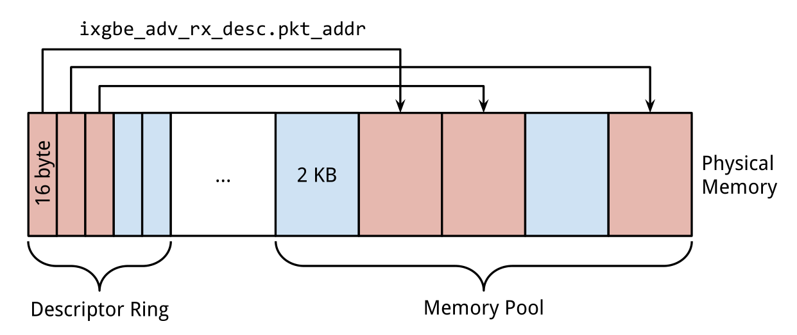
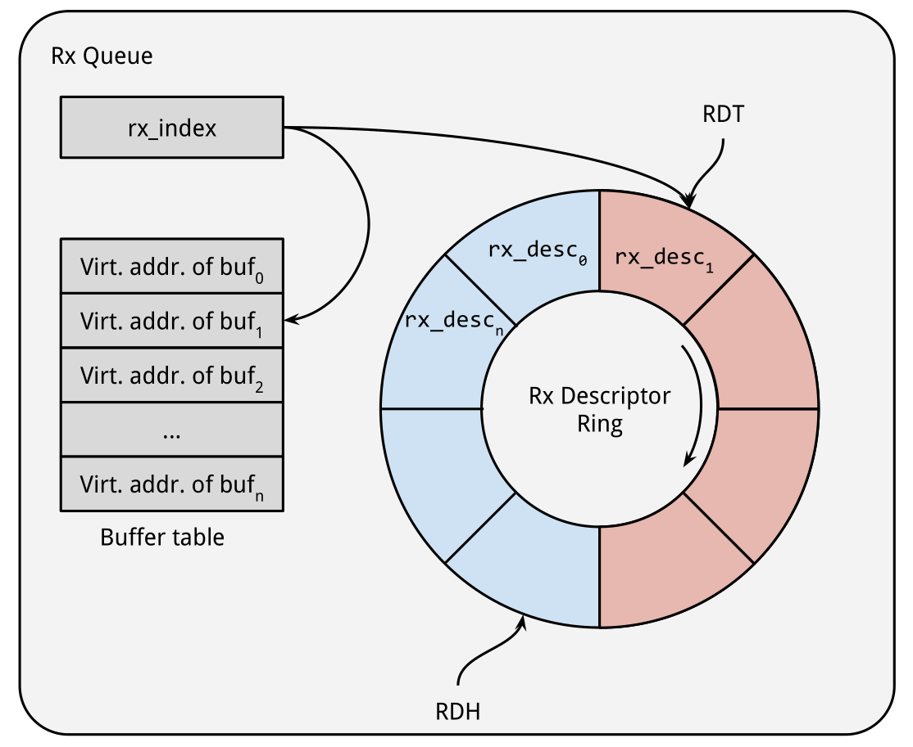
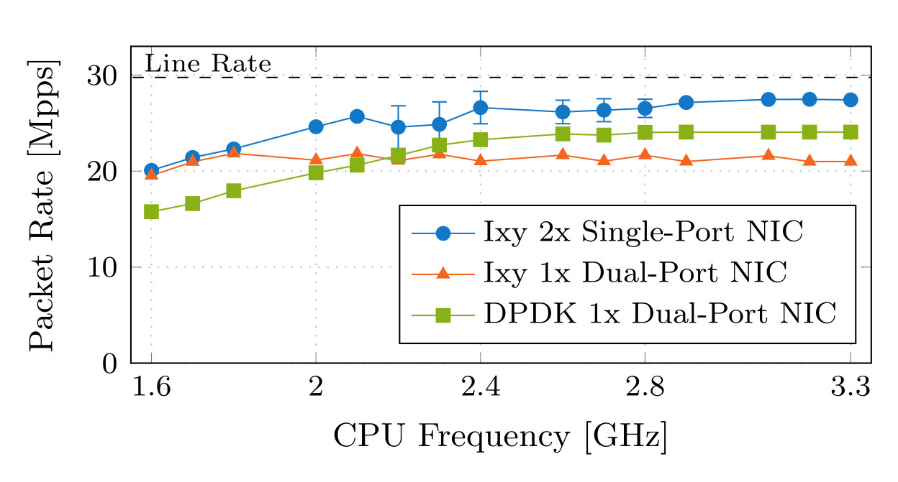
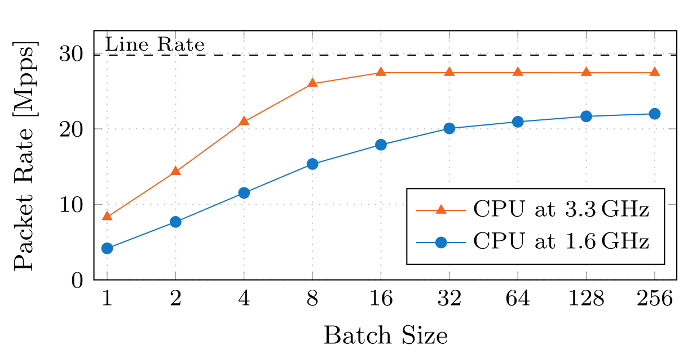

# Demystifying Userspace Packet IO Frameworks

## ABSTRACT

Packet forwarding applications such as virtual switches or routers moved from the kernel to userspace processes in the last years facilitated by frameworks like DPDK or netmap. These frameworks are often regarded as black-boxes by developers due to their perceived inherent complexity. We present ixy, a userspace packet IO framework designed for simplicity and educational purposes to show that fast packet IO in the userspace is not black magic. Ixy avoids external dependencies, unnecessary abstractions, and kernel components completely, allowing the user to understand the whole stack from application logic down to the driver.  A packet forwarder built on ixy is only about 1000 lines of code including the whole driver that runs in the same process. Our code is available as free and open source under the BSD license at [https://github.com/emmericp/ixy](https://github.com/emmericp/ixy).

近些年，由于DPDK或者netmap这些框架的出现，促成了包转发程序（例如虚拟交换机，路由器）从内核空间转移到用户空间。这些框架由于其固有的复杂性，所以通常会被开发人员视为黑盒子。所以我们提出了ixy，一个设计目标为简单和教学为目的的用户空间数据包I/O框架，以显示用户空间快速数据包I/O处理并不是黑科技。Ixy避免了外部以来，不必要的抽象，和完全的内核组件。允许用户理解包括从应用逻辑到下边的驱动程序的整个技术栈。由ixy构建的包转发器只有1000行代码，包括了同一个进程中的驱动程序。我们的代码在BSD许可下可作为免费和开放源代码使用

## CCS Concepts

* Networks→Network performance evaluation; Network experimentation;
* 网络→网络性能评估；网络设备

## Keywords

Userspace, Packet IO, Linux, NIC

用户空间，包I/O，Linux，NIC

## 1. INTRODUCTION

Low-level packet processing on top of traditional socket APIs is too slow for modern requirements and was therefore often done in the kernel in the past. Two examples for packet forwarders utilizing kernel components are OpenvSwitch [21] and the Click modular router [18]. Writing kernel code is not only a relatively cumbersome process with slow turn-around times, it also proved to be too slow for specialized applications as the network stack is designed for a general-purpose operating system. OpenvSwitch was since extended to include DPDK [6] as an optional alternative backend to improve performance [20] over the kernel-based implementation. Click was ported to both netmap [22] and DPDK for the same reasons [1]. Similar moves from kernel-based code to specialized userspace code can also be found in other projects [14, 23].

在传统 `socket APIS` 之上的底层数据包处理方式对于现代需求来说太慢了，因此过去通常在内核中完成。利用内核组件的包转发器有 `OpenvSwitch`[21] 和 `Click Modular Router`[18]。编写内核代码不仅是一个相对繁琐的过程，周转时间很慢，而且对于专门的应用程序来说很慢，因为网络堆栈是为通用操作系统设计的。`OpenvSwitch` 后来扩展到包含 `DPDK`[6] 作为可选的替代后端，以提高基于内核的实现的性能[20]。同样，Click 则包含了 `netmap` 和 `DPDK`。类似的，将基于内核的代码转移到用户空间的实现，可以在另外两个工程中找到[14, 23]。

Developers and researchers still often treat DPDK as a black-box that magically increases speed. One reason for this is that DPDK – unlike netmap and others – does not come from an academic background. It was first developed by Intel and then moved to the Linux Foundation in 2017 [17]. This means that there is no academic paper describing its architecture or implementation. The netmap paper [22] is often used as surrogate to explain how userspace packet IO frameworks work in general. However, DPDK is based on a completely different architecture than seemingly similar frameworks.

开发人员和研究人员仍然经常讲DPDK视为一个神奇的增加速度的黑盒子。其中一个原因就是其没有学术背景，这不像netmap和其他组件那样。它最初由英特尔开发，然后在2017年转移到Linux基金会[17]。这就意味着没有学术论文描述其架构和实现。netmap的论文[22] 通常被用来解释用户空间数据包I/O框架如何工作。然而，DPDK基于完全不同的架构，但又看似相似的框架。

We present ixy, a userspace packet framework that is architecturally similar to DPDK [6] and Snabb [16]. Both usefull userspace drivers, unlike netmap [22], pfring [19], pfq [3] or similar frameworks that rely on a kernel driver. There is currently no academic publication available describing the inner workings of such a full userspace framework.

我们提出了ixy，一个用户空间包处理框架，在结构上类似DPDK [6] 和Snabb [16]。与 netmap [22]，pfring [19]，pfq [3]等其他类似的基于内核驱动的框架不同，这两个框架使用用户空间驱动程序。目前还没有学术刊物可以描述这种完整的用户空间框架的内部工作。

Ixy is designed for educational use only, i.e., you are meant to use it to understand how userspace packet framework sand drivers work, not to use it in a production setting. Our whole architecture aims at simplicity and is trimmed down to the bare minimum. A packet forwarding application is less than 1000 lines of code including the whole driver from device reset and initialization to receiving and sending packets. It is certainly possible to read and understand drivers found in other frameworks, but ixy’s driver is at least an order of magnitude simpler than other implementations. For example, the file ```ixgbe_rxtx.c``` in DPDK implementing the normal receive and transmit paths (there also specialized implementations for vector instruction sets) is 5400 lines long. Ixy’s receive and transmit path is only 127 lines of code. This, of course, means that we support far fewer features. But the goal is to understand the basics of a high-performance implementation, not support every conceivable scenario and hardware feature. Ixy implements all common optimizations like batching at various stages and its speed rivals DPDK.

Ixy只被设计用来教学，例如，你可以用来理解用户空间包处理框架发送驱动程序如何工作，但你不能将其用于生产环境。我们的整个架构旨在简化并将其削减至最低程度。一个包转发应用只有不到一百行代码，但包含了完整的驱动程序，它可以重置设备，初始化设备，接收并发送数据包。当然你可以从其他的框架上阅读并理解驱动，但是 ixy 驱动程序比他们至少简单了一个数量级。举个例子，DPDK中的文件 ```ixgbe_rxtx.c``` 实现了正常接收和发送路径（包含了向量指令集的实现）超过了5400行。Ixy的接收和发送路径的实现只用了127行代码。当然，这意味着我们只提供了非常少的功能。但是我们的目标是理解基本的高性能实现，并不支持每个可以想象的场景和硬件功能。Ixy实现了所有通用的优化，例如各阶段的批量处理，其速度可以媲美DPDK。

The remainder of this paper is structured as follows. We first discuss background and related work, i.e., the basics of other userspace packet IO frameworks and the differences between them. We then dive into ixy’s design and implementation in Sections 3 and 4. A rudimentary performance evaluation is discussed in Section 5. We conclude with an outlook on our future plans for ixy as this is work-in-progress and meant as a basis to evaluate different performance optimization techniques for packet processing and forwarding.

本论文的结构如下，首先，我们讨论背景和相关工作，例如，其他用户空间包I/O框架的基础知识，以及他们之间的区别。接下来我们将在第3和第4节讨论ixy的设计和实现。在第5节给出了一个初步的性能评估。我们对未来ixy计划的展望结束，因为这是工作进行中的，并且意味着评估不同的数据包处理和转发性能优化技术的基础。

## 2. BACKGROUND AND RELATED WORK

A multitude a packet IO frameworks have been built over the past years, each focusing on different aspects with different trade-offs. They can be broadly categorized into two categories: those relying on a driver running in the kernel and those that re-implement the whole driver in userspace. Examples for the former category are netmap [22], PF_RING ZC [19],pfq [3], OpenOnload [24], and XDP [13].  They all use the default driver (sometimes with small custom patches) and an additional kernel component that provides a fast interface based on memory mapping for the userspace application. Packet IO is still handled by the normal driver here, but the driver is attached to the application directly instead of to the normal kernel datapath. This has the advantage that integrating existing kernel components or forwarding packets to the default network stack is relatively simple with these frameworks. By default, these applications still provide an application with exclusive access to the NIC. But the NIC can often still be controlled with standard tools like ethtool to configure hardware features.

过去几年已经建立了众多的数据包IO框架，每个框架都侧重于不同的方面并进行不同的权衡。它们可以大致分为两类: 运行在内核中的驱动程序和在用户空间中重新实现了的驱动程序。前一种例如netmap [22]，PF_RING ZC [19]，pfq [3]，OpenOnload [24] 和 XDP [13]。他们都使用了默认的驱动程序（通常有一些小的补丁）和附加的内核组件，并提供了一个快速的接口，这个接口基于用户空间的内存映射。数据包的I/O操作依然使用传统的驱动程序，但是驱动程序终结挂接到应用程序，而不是传统的内核数据路径。这样做的优势就是可以有效的整合现有的内核组件，并且转发数据包到默认的协议栈也相对简单一些。默认情况下，这些应用程序会独占网卡。但是网卡任然可以用标准的工具控制，例如，ethtool可以配置硬件功能。

In particular, netmap [22] and XDP [13] are good examples of integrating kernel components with specialized applications. netmap (a standard component in FreeBSD and also available on Linux) offers interfaces to pass packets between the kernel network stack and a userspace app, it can even make use of the kernel’s TCP/IP stack with StackMap [25]. Further, netmap supports using a NIC with both netmap and the kernel simultaneously by using hardware filters to steer packets to receive queues either managed by netmap or the kernel [2] (flow bifurcation).  XDP goes one step further as it’s a default part of the Linux kernel and hence very well integrated. It’s technically not a userspace framework: the code is compiled to eBPF which is run by a JIT in the kernel, this restricts the choice of programming language to those that can target eBPF bytecode (typically a restricted subset of C is used). It is commonly used to implement firewalls against DDoS attacks that need to pass on traffic to the network stack [10]. Despite being part of the kernel, XDP does not yet work with all drivers as it requires a new driver API that is still lacking. At the time of writing, XDP in kernel 4.14 supports fewer drivers than DPDK [12, 4].

特别需要指出的是，netmap [22] 和 XDP [13] 是非常好的整合内核组件的应用实例。netmap（FreeBSD的标准组件，也可以用于Linux）提供了内核网络协议栈和用户空间应用之间传递数据包的接口，它甚至可以通过StackMap使用内核的TCP/IP协议栈。netmap支持同时使用netmap和内核，通过使用硬件的过滤器，引导数据包到netmap的接收队列或者内核接收队列 [2] （分流）。XDP更进一步，其作为内核的默认部分和内核之间整合的非常好。XDP从技术上说不是用户空间框架，他的代码使用 eBPF 编译，并使用 JIT 运行在内核空间中，这就限制了编程语言的选择，这个编程语言可以通过 eBPF 编译成 字节码（典型的限制是只能使用 C 语言的一个子集）。它通常被用于实现防火墙，在将数据包传递到协议栈之间抵御 DDoS的攻击。尽管作为内核的一部分，由于缺乏新驱动API，XDP还是不能和所有的驱动一起工作。在我正在写本文时，XDP在内核 4.14版本中支持的驱动少于DPDK [12, 4]。

DPDK <sup>1</sup> [6] and Snabb [16] implement the driver completely in userspace.  DPDK still uses a small kernel module to help with memory mapping, but it does not contain driver logic and is only used during initialization. A main advantages of the full userspace approach is that the application has full control over the driver leading to a far better integration of the application with the driver and hardware. DPDK features the largest selection of offloading and filtering features of all investigated frameworks [5]. Configuring hardware features through the kernel driver while using a framework of the first category is often error-prone, difficult to use, or hardware features might not be supported. The downside is the poor integration with the kernel, DPDK’s KNI (kernel network interface) needs to copy packets to pass them to the kernel unlike XDP or netmap which can just pass a pointer. Moreover, flow bifurcation is only supportedon Mellanox NICs in DPDK. Other big advantages of DPDK are its support in the industry, mature code base, and large community. DPDK had a slow start in academia due to its background, but more and more publications use DPDK fortheir prototypes. DPDK supports virtually all NICs commonly found in servers [4], far more than any other framework we investigated here.

DPDK <sup>1</sup> [6] 和 Snabb [16] 完全在用户空间中实现驱动程序。DPDK仍然在内核使用了一个小内核模块来帮助内存映射，但它并不包含驱动的逻辑，只在初始化时被使用。完全的用户空间方法的一个主要优势就是，应用程序可以通过驱动程序完全控制硬件，这样就使应用程序和硬件很好的整合在了一起。DPDK在所有调查的框架中，拥有最强的卸载和过滤功能。第一种框架通过内核驱动来配置硬件功能经常出错，并且很难使用，或者硬件功能呢可能不支持。DPDK 的不足之处是与内核集成度不强，DPDK的 KNI 模式需要拷贝数据包传递给内核，不想 XDP 或 netmap 那样只传递指针。此外，只有在DPDK中支持 Mellanox 网卡的分流功能。DPDK的一个巨大优势是工业界的支持，成熟的代码库，和巨大的社区。由于其背景，DPDK在学术界的起步较慢，但越来越多的出版物使用DPDK作为原型。DPDK几乎支持服务器中常见的所有NIC [4]，远远超过我们在此调查的任何其他框架。

Ixy’s architecture is based on ideas from both DPDK and Snabb. The initialization and operation without loading a driver is inspired by Snabb, the API based on explicit memory management and batching is based on DPDK.

Ixy的架构基于DPDK和Snabb的想法。在不加载驱动程序的情况下进行初始化和操作的灵感来自Snabb，基于显式内存管理的API和基于DPDK的批处理。

---
> <sup>1</sup> Except when used with Mellanox NICs which still require kernel components 
> <sup>1</sup> 除了与仍然需要内核组件的Mellanox NIC一起使用时

## 3. DESIGN

Ixy is explicitly designed for simplicity and to aid in understanding how a NIC driver works. Our design goals are:

* **Simplicity**. A forwarding application including the driver should be less than 1,000 lines of code.
* **No dependencies**. One self-contained project including the application and driver to aid reading the code.
* **Usability**.  Provide a simple-to-use interface for applications built on it.
* **Speed**. It should be reasonable fast without compromising simplicity, find the right trade-off.

Ixy 简化了设计，并且有助于理解 NIC 驱动程序的工作原理。 我们的设计目标是：

* **简单**，一个转发应用程序，包含驱动程序应该少于1000 行代码。
* **没有依赖**，一个自包含工程，包括应用程序和驱动，这有助于阅读代码。
* **可用性**，为构建于其上的应用程序提供一个简单易用的接口。
* **高速**，在简单和快速之间合理的平衡，不能因为简单而妥协。

The language of choice is C as the lowest common denominator of systems programming languages.

系统编程语言为C语言。

It should be noted that the Snabb project [16] has similar design goals, ixy tries to be one order of magnitude simpler than  Snabb. For example, Snabb targets 10,000 lines of code [15], we target 1,000 lines of code and Snabb builds on Lua with LuaJIT instead of C limiting accessibility.

应该说明的是 Snabb 工程有同样的设计目标，ixy 争取比 Snabb 简单一个数量级。例如，Snabb 有 10000 行代码，我们的目标是 1000 行，并且 Snabb 使用  Lua （LuaJIT 引擎） 脚本替代 C 限制了其可访问性。

### 3.1 Architecture 结构

Ixy’s architecture is very simple due to its lack of abstractions. At its core it’s a custom full userspace implementation of a driver for NICs of the ixgbe family trimmed down for simplicity. This driver exposes functions to initialize the NIC, read statistics, and to receive/send packets. Packet APIs are based on explicit allocation of packet buffers from specialized memory pool data structures. Applications include and use the driver directly in the same project. This means that the driver logic is only a single function call away from the application logic, allowing the user to read the code from a top-down level without jumping between complex abstraction interfaces or userspace and kernelspace boundaries.

由于减少了抽象，Ixy的结构非常简单。它的核心是 ixgbe 系列驱动程序完整用户空间的实现，这样做的目的是简单。这个驱动导出函数用于初始化网卡，读取状态，和收发数据包。数据包 APIs 显示的从专用的内存池中分配数据包内存。应用程序在工程中包含和直接使用此驱动程序。这就意味着驱动程序逻辑只是应用程序逻辑的简单函数调用，允许用户自上而下阅读代码而不需要在复杂的抽象接口，或者用户空间和内核空间之间跳转。

The complete lack of abstraction is currently only possible because we only support a single driver. We plan to introduce at least one additional driver (VirtIO) and hence a small abstraction layer based on function pointers in the device object (same approach as DPDK).

由于我们目前只支持一个驱动程序，所以现在完全没有进行抽象。我们计划至少引入一个额外的驱动程序（VirtIO），因此，基于设备对象中的函数指针的小抽象层（与 DPDK 相同）。

### 3.2  NIC Selection 网卡的选择

Ixy is based on a custom userspace re-implementation of the Intel ixgbe driver cut down to its bare essentials. This means that we only support Intel NICs of the ixgbe family, we have tested it on X540, X550, and 82599ES (aka X520) NICs. All other frameworks except DPDK are also restricted to very few NICs models (typically 3 or fewer) and ixgbe is (except for OpenOnload only supporting their own NICs) always supported. We chose ixgbe for ixy because Intel releases extensive datasheets for all their NICs and the ixgbe NICs are commonly found in commodity servers. These NICs are also interesting because they still exposea relatively low-level interface to the drivers. This is especially visible in some advanced features like filters where implementation details such as chained hash map implementations for filters are directly exposed and configured by the driver.  Other NICs like the newer Intel XL710 series or Mellanox ConnectX-4/5 follow a more firmware-driven design: a lot of functionality is hidden behind a black-box firmware running on the NIC and the driver merely communicates via a message interface with the firmware which does the hard work. This approach has obvious advantages such as abstracting hardware details of different NICs allowing for a simpler more generic driver.  However, our goal with ixy is understanding the full stack – a black-box firmware is hence counterproductive and we do not plan to add  support for such NICs.

Ixy 基于自定义用户空间重新实现的英特尔ixgbe驱动程序，简化为其基本要素。这意味着我们只能支持 Intel ixgbe 系列的网卡，我们测试了 X540、X550、82599ES（也就是X520）网卡。除DPDK之外的所有其他框架也仅限于极少数 NIC 模型（通常为3或更少），并且ixgbe（除了支持自己的 NIC 的OpenOnload除外）始终受支持。我们选择 ixgbe 作为 ixy 的驱动，因为英特尔为其所有NIC发布了大量规格说明，ixgbe网卡通常位于商用服务器中。这些NIC也很有趣，因为它们仍然暴露了驱动程序的相对低级别的接口。这在某些高级功能（如过滤器）中尤其明显，其中实现详细信息（如过滤器的链式哈希映射实现）由驱动程序直接公开和配置。其他NIC（如较新的Intel XL710系列或Mellanox ConnectX-4/5）遵循更加固件驱动的设计：许多功能隐藏在NIC上运行的黑盒固件后面，驱动程序仅通过消息接口与固件通信是艰苦的工作。这种方法具有明显的优势，例如抽象不同NIC的硬件细节，从而允许更简单的更通用的驱动程序。但是，我们使用ixy的目标是了解完整的堆栈 - 黑盒固件因此适得其反，我们不打算添加对此类NIC的支持。

## 4. IMPLEMENTATION 实现

All line numbers referenced in this Section are for commit 436750e of ixy. All page numbers and section numbers for the Intel datasheet refer to Revision 3.3 (March 2016) of the 82599 datasheet [11].  Function names and line numbers are hyperlinked to the implementation on GitHub in the PDF.

本文引用的 ixy 代码基线为 436750e. 参数数据引用自 Intel 82599 datasheet Revision 3.3 (March 2016)。在本文的函数名称直接链接至 Github 中的实现。

### 4.1 Userspace Drivers in Linux Linux 中的用户空间驱动

We want to keep the whole stack inside a single program, i.e., no kernel code can be used. One needs to understand how a driver communicates with a device first to understand how a driver can be written in userspace. This simplified overview skips details but is sufficient to understand how ixy or similar frameworks work. A driver can communicate via two ways with a PCIe device: directly with memory-mapped IO (MMIO) or indirectly with direct memory access (DMA).

我们打算在单一应用程序中保持一个完整的技术堆栈，例如，没有内核代码可以使用。首先，需要理解驱动如何与设备通信，并需要理解如何在用户空间的驱动中实现。这个简化的概述跳过了很多细节，但是足以理解 ixy 或者类似的框架是如何工作的。一个驱动可以通过两种方式与 PCIe设备进行通信：直接通过 memory-mapped IO （MMIO）或者通过  direct memory accress （DMA）。

MMIO maps a memory area to device IO, i.e., reading from or writing to this memory area receives/sends data from/to the device. Devices commonly expose their configuration registers via this interface, the datasheet provides an offset into this memory area where normal reads and writes can be used to access the register. PCIe devices can specify multiple memory areas called Base Address Registers (BARs). These are exposed in Linux via the sysfs pseudo filesystem and can be mapped into a process via mmap. The implementation of this mapping can be found in ```pci_map_resourceinpci.c```. ixgbe devices expose all configuration, statistics, and debugging registers via the BAR0 configuration space. The datasheet [11] lists all registers as offsets in this configuration space. We use ```ixgbe_type.h``` from Intel’s driver as machine-readable version of the datasheet<sup>2</sup>, it contains defines for all register names and offsets for bit fields.

MMIO 将一个内存区域映射到设备 IO，例如，想此内存区域读取或者写入数据，意味着从此设备接收和发送数据。设备通常通过此接口导出其配置寄存器，规格说明提供了此内存区域的偏移，对此区域的读写可以访问此寄存器。PCIe 设备可以提供多个内存区，称为基址寄存器（BARs）。在 Linux中通过 sysfs 文件系统导出，可以将此区域通过 mmap 映射到进程地址空间。ixy的相关映射的实现可以在 ```pci_map_resourceinpci.c``` 找到。ixgbe 设备通过 BAR0 配置空间导出所有的配置，统计和调试寄存器。规格书以在配置空间中偏移的方式列出了所有寄存器。我们使用Intel 驱动中的代码 ```ixgbe_type.h``` 作为规格书机器可读的版本，它包含了所有寄存器的名称和比特位的偏移。

---
> <sup>2</sup> This is technically a violation of both our goal about dependencies and lines of code, but we only effectively use less than 100 lines that are just defines and simple structs. There is nothing to be gained from copy & pasting offsets and names from the datasheet or this file .
> <sup>2</sup> 这在技术上违反了我们关于依赖关系和代码行的目标，但我们只有效地使用少于100行，这些行只是定义和简单的结构。复制和粘贴数据表或此文件中的偏移量和名称无法获得任何结果。

DMA is initiated by the PCIe device and allows it to read/write arbitrary <sup>3</sup> physical addresses. This is used to read/write packet data as well as to transfer the DMA descriptors (pointers to packet data and offloading information) between driver and NIC. The userspace driver hence needs to be able to translate its virtual addresses to physical addresses, this is possible via the procfs pseudo filesystem file ```/proc/self/pagemap```, the translation logic is implemented in ```virt_to_physinmemory.c```. Further, DMA needs to be enabled for the PCI devices on the system, this can be done with the function ```pci_set_master``` in the kernel which is exposed via a bitfield in sysfs that is manipulated in ```enable_dma``` in ```pci.c```.

DMA由 PCIe设备初始化，允许随意读写物理地址。这被用来读写数据包，也就是在驱动和网卡之间传递DMA描述符（指向数据包和卸载信息的指针）。用户空间的驱动需要在虚拟地址和物理地址之间传递此描述符，这个是通过 procfs 伪文件系统文件 ```/proc/self/pagemap``` 来实现的，传输逻辑的实现在代码 ```virt_to_physinmemory.c``` 中。进一步说，DMA在系统中被PCI设备打开，需要使用内核函数 ```pci_set_master```, 实现是通过 sysfs文件系统中的 ```enable_dma```比特位实现，代码在 ```pci.c```。

---
> <sup>3</sup> Utilizing the IOMMU to restrict device access is planned in ixy
> <sup>3</sup> 在 ixy 中计划使用 IOMMU 来限制设备的访问。

These file-based APIs give us full access to the device without needing to write any kernel code. Ixy also unloads any currently loaded kernel driver for the given PCIe device to prevent conflicts, i.e., there is no kernel driver configured for the device while ixy is running. The only capability that is missing is handling interrupts which could be done by loading the ```uio_pci_generic``` driver for the module. Ixy only supports poll-mode at the moment to keep the code simple.

这些 基于文件的 API 使我们可以完全的访问控制设备，而不需要编写任何内核代码。Ixy 也不需要卸载PCIe设备正在使用的驱动程序来防止冲突，例如，在ixy运行时没有内核驱动被初始化。唯一缺失的功能就是中断的处理，这个可以通过加载驱动 ```uio_pci_generic``` 来实现。Ixy为了保持代码简单，目前只支持轮询模式。

### 4.2 Application API and Memory Management 应用接口和内存管理

Ixy builds on an API with explicit memory allocation similar to DPDK which is a very different approach from netmap [22] that exposes a replica of the NIC’s ring buffer to the application. Memory allocation for packets was cited as one of the main reasons why netmap is faster than traditional in-kernel processing [22]. Hence, netmap exposes replicas of the ring buffers <sup>4</sup> to the application, and it’s then up to the application to handle memory. Many simple forwarding cases can then be implemented by simply swapping pointers in the rings. However, more complex scenarios where packets are not forwarded immediately to a NIC (e.g.,because they are passed to a different core in a pipeline setting) do not map well to this API and require adding manual memory management on top of this API. Further, a ring-based API is very cumbersome to use compared to one with memory allocation.

Ixy 通过显示的内存分配构建API，这点与DPDK很像，这点与 netmap 很不一样，它把网卡的 ring buffer 直接暴露给了应用程序，数据包的引用内存分配被认为是 netmap 比传统内核处理更快的原因之一，netmap将 ring buffer 的副本 <sup>4</sup> 暴露给了应用程序，然后由应用程序来控制内存。许多简单的转发情况可以通过在 ring buffer 中交换指针来实现。然而，在更复杂的场景中，数据包不能直接通过网卡转发（例如，数据包通过管道设置被传递到了不同的核心处理），不能很好的映射到此API，所以需要在此API上手动控制内存。基于ring 的 API 相对于内存分配还是比较笨重。

---
> <sup>4</sup> Not the actual ring buffers to prevent the user-space application from crashing the kernel with invalid pointers.
> <sup>4</sup> 非真实ring buffer，防止用户空间应用程序引用无效指针导致内核崩溃。

It is true that memory allocation for packets is a significant overhead in the Linux kernel, we have measured a per-packet overhead of 100 cycles <sup>5</sup> when forwarding packets with Open vSwitch on Linux 3.7 for allocating and freeing packet  memory (measured with ```perf```). However, this overhead is almost completely due to (re-)initialization of the kernel ```sk_buff``` struct – a large data structure  with a lot of metadata fields targeted at a general-purpose network stack. Memory  allocation in ixy with minimum metadata required only adds an overhead of 24 cycles/packet, a price that we are willing to pay for the gained simplicity in the user-facing API. Careful design of the data structure containing the metadata can still keep this approach fast in the face of new features: fields needing a reset should be kept together. For example, DPDK stores 128 bytes of metadata per packet but only needs a single 8 byte write to reset a packet buffer

在linux 内核中数据包的内存分配是一个很大的开销，我们测量得到，一个每个数据包的分配消耗 100 个时钟周期 <sup>5</sup>，通过 Open vSwitch转发数据包，在Linux 3.7 分配和释放数据包内存 （通过 ```perf``` 进行测量）。然而，这个开销几乎完全是因为 重新初始化内核数据结构 ```sk_buff``` 造成的，这是一个巨大的数据结构，包含了很多针对协议栈的元数据字段。在 ixy 中只需要分配很小的元数据，每个数据包消耗 24 个时钟周期，这也是面相用户的API的简单性需要付出的代价。 仔细设计包含元数据的数据结构仍然可以在面对新功能时快速保持这种方法：需要重置的字段应保存在一起。 例如，DPDK每个数据包存储128个字节的元数据，但只需要一个8字节的写入来重置数据包缓冲区

---
> <sup>5</sup> Forwarding 10 Gbit/s with minimum-sized packets on a single 3.0 GHz CPU core leaves a budget of 200 cycles/packet.
> <sup>5</sup> 在单个3.0 GHz CPU内核上使用最小数据包转发 10 Gbit/s 会产生200个周期/数据包的预算。

Ixy’s API is the same as DPDK’s API when it comes to sending and receiving packets and managing memory. It can best be explained by reading the example applications ```ixy-fwd.c``` and ```ixy-pktgen.c```. The transmit-only example ```ixy-pktgen.c``` creates a memory pool, a fixed-size collection of fixed-size buffers that are used as packet buffers and prefills them with packet data. It then allocates a batch of packets from this memory pool and passes them to the transmit function. The driver takes care of freeing packets asynchronously in the transmit function. The forward example ```ixy-fwd.c``` can avoid explicit handling of memory pools in the application: the driver allocates a memory pool for each receive ring and automatically allocates packets, freeing is either handled in the transmit function as before or by dropping the packet explicitly if the output link is full.

在发送和接收数据包以及管理内存时，Ixy的API与DPDK的API相似。最好通过阅读示例应用程序```ixy-fwd.c```和```ixy-pktgen.c```来解释。只有传输的示例```ixy-pktgen.c``` 创建了一个内存池，固定大小的固定大小缓冲区集合，用作数据包缓冲区并使用数据包数据预填充它们。然后，它从该内存池分配一批数据包，并将它们传递给传输函数。驱动程序负责在发送功能中异步释放数据包。转发实例 ```ixy-fwd.c``` 可以避免在应用程序中显式处理内存池：驱动程序为每个接收环分配一个内存池并自动分配数据包，释放要么像以前一样在发送功能中处理或者如果输出链接已满，则显式丢弃数据包。

### 4.3 NIC Ring API 网卡环形数据接口

NICs expose multiple circular buffers called queues or rings to transfer packets. The simplest setup uses only one receive and one transmit queue. Multiple transmit queues are merged on the NIC, incoming traffic is split according to filters or a hashing algorithm (RSS) if multiple receive queues are configured. Both receive and transmit rings work in a similar way: the driver programs a (physical) base address and the size of the ring. It then fills the memory area with DMA descriptors, i.e., pointers to physical addresses where the actual packet data is stored and some metadata. Sending and receiving packets is then done by passing ownership of the DMA descriptors between driver and hardware via a head and tail pointer. The driver controls the tail pointer, hardware the head pointer. Both pointers are stored in device registers accessible via MMIO.

NIC暴露多个称为队列或环的循环缓冲区以传输数据包。 最简单的设置仅使用一个接收和一个传输队列。 如果配置了多个接收队列，接收根据过滤器或散列算法（RSS）分割传入流量，输出流量则在NIC上合并。 接收和发送环都以类似的方式工作：驱动程序编程（物理）基地址和环的大小。 然后，它用DMA描述符填充存储区，即指向存储实际分组数据的物理地址的指针和一些元数据。 然后通过头和尾指针在驱动程序和硬件之间传递DMA描述符的所有权来完成发送和接收分组。 驱动程序控制尾指针，硬件控制头指针。 两个指针都存储在可通过MMIO访问的设备寄存器中。

The initialization code is in ```ixgbe.c``` starting from line 124 for receive queues and from line 179 for transmit queues. Further details are in the datasheet in Section 7.1.9 and in the datasheet sections mentioned in the code.

初始化代码在```ixgbe.c```中，从第124行开始，用于接收队列，从第179行开始，用于传输队列。 更多详细信息，请参见第7.1.9节中的数据表以及代码中提到的数据表部分。

#### 4.3.1 Receiving Packets 接收数据包

The driver fills up the ring buffer with physical pointers to packet buffers in ```start_rx_queue``` on startup. Each time a packet is received, the corresponding buffer is returned to the application and we allocate a new packet buffer and store its physical address in the DMA descriptor and reset the ready flag. It is up to the application to free the packet buffer of received packets. We also need a way to translate the physical addresses in the DMA descriptor found in the ring back to its virtual counterpart on packet reception. This is done by keeping a second copy of the ring that is populated with virtual instead of physical addresses, this is then used as a lookup table for the translation.

驱动程序在启动时用 ```start_rx_queue``` 中的数据包缓冲区的物理指针填充环形缓冲区。每次收到数据包时，相应的缓冲区将返回给应用程序，我们分配一个新的数据包缓冲区并将其物理地址存储在DMA描述符中并重置就绪标志。应用程序可以释放接收数据包的数据包缓冲区。我们还需要一种方法将环中找到的DMA描述符中的物理地址转换回数据包接收时的对应的虚拟地址。这是通过保留用虚拟地址而不是物理地址填充的环的第二个副本来完成的，然后将其用作转换的查找表。

A naive way to check if packets have been received is reading the head register from the NIC. However, reading a NIC register requires a PCIe round trip – a slow operation. The hardware also sets a flag in the descriptor via DMA which is far cheaper to read as the DMA write is handled by the last-level cache on modern CPUs. This is effectively the difference between a cache miss and hit for every received packet. Figure 1 illustrates the memory layout: the DMA descriptors in the ring to the left contain physical pointers to packet buffers stored in a separate location in a memory pool. The packet buffers in the memory pool contain their physical address in a metadata field. Figure 2 shows the RDH (head) and RDT (tail) registers controlling the ring buffer on the right side, and the local copy containing the virtual addresses to translate the physical addresses in the descriptors in the ring back for the application. ```ixgbe_rx_packet``` in ```ixgbe.c``` implements the receive logic as described by Sections 1.8.2 and 7.1 of the datasheet.

检查是否已收到数据包的简单方法是从NIC读取头部寄存器。但是，读取NIC寄存器需要PCIe往返 - 操作缓慢。硬件还通过DMA在描述符中设置一个标志，由于DMA写入由现代CPU上的最后一级高速缓存处理，因此读取消耗很少。这实际上是每个接收到的数据包的高速缓存未命中和命中之间的差异。图 1 说明了内存布局：左侧环中的DMA描述符包含存储在内存池中单独位置的数据包缓冲区的物理指针。内存池中的数据包缓冲区包含元数据字段中的物理地址。图 2 显示了控制右侧环形缓冲区的RDH（头部）和RDT（尾部）寄存器，以及包含虚拟地址的本地副本，用于转换应用程序环中描述符中的物理地址。 ```ixgbe.c```中的```ixgbe_rx_packet``` 实现了接收逻辑，如数据表的第 1.8.2 节和第 7.1 节所述。



Figure 1: DMA descriptors pointing into a memory pool, note that the packets in the memory are unordered as they can be free’d at different times.



Figure 2: Overview of a receive queue. The ring uses physical addresses and is shared with the NIC.

#### 4.3.2 Transmitting Packets 发送数据包

Transmitting packets follows the same concept and API as receiving them, but the function is more complicated because the API between NIC and driver is asynchronous. Placing a packet into the ring does not immediately transfer it and blocking to wait for the transfer is unfeasible. Hence, the ```ixgbe_tx_packet``` function in ```ixgbe.c``` consists of two parts: freeing packets from previous calls that were sent out by the NIC followed by placing the current packets into the ring. The first part is often called cleaning and works similar to receiving packets: the driver checks a flag that is set by the hardware after the packet associated with the descriptor is sent out. Sent packet buffers can then be free’d, making space in the ring. Afterwards, the pointers of the packets to be sent are stored in the DMA descriptors and the tail pointer is updated accordingly.

发送数据包与接收数据包遵循相同的概念和API，但功能更复杂，因为NIC和驱动程序之间的API是异步的。将数据包放入环中不会立即传输它，阻塞等待传输是不可行的。 因此，```ixgbe.c``` 中的```ixgbe_tx_packet``` 函数由两部分组成：从NIC发出的先前调用中释放数据包，然后将当前数据包放入环中。 第一部分通常称为清理，其工作方式类似于接收数据包：驱动程序在发送与描述符关联的数据包之后检查由硬件设置的标志。 然后可以释放已发送的数据包缓冲区，从而在环中创建空间。然后，将要发送的分组的指针存储在DMA描述符中，并相应地更新尾指针。

#### 4.3.3 Batching 批处理

Each successful transmit or receive operation involves an update to the NIC’s tail pointer register (RDT and TDT for receive/transmit), a slow operation. This is one of the reasons why batching is so important for performance. Both the receive and transmit function operate on a batch of packets in ixy, updating the register only once per batch.

每个成功的发送或接收操作都涉及更新NIC的尾指针寄存器（RDT 用于接收，TDT用于发送），这是一种慢速操作。这是批处理对性能如此重要的原因之一。 接收和发送功能都在 ixy 中的一批数据包上运行，每批只更新一次寄存器。

#### 4.3.4 Offloading Features 卸载功能

Ixy currently only enables CRC checksum offloading. Unfortunately, packet IO frameworks (e.g., netmap) are often restricted to this bare minimum of offloading features. DPDK is the exception here as it supports almost all offloading features offered by the hardware. However, as explained earlier its receive and transmit functions pay the price for these features in the form of complexity.

Ixy目前只启用CRC校验和卸载。遗憾的是，数据包 I/O 框架（例如，netmap）通常限于这个最小的卸载功能。 DPDK是例外，因为它支持硬件提供的几乎所有卸载功能。但是，如前所述，其接收和发送功能以复杂的形式为这些功能付出代价。

We will try to find a balance and showcase selected simple offloading features in Ixy in the future. These offloading features can be implemented in the receive and transmit functions, see comments in the code. This is simple for some features like VLAN tag offloading and more involved for more complex features requiring an additional descriptor containing metadata information.

我们将尝试在Ixy中找到平衡并展示选定的简单卸载功能。这些卸载功能可以在接收和发送功能中实现，请参阅代码中的注释。对于某些功能（如VLAN标记卸载）而言，这很简单，对于需要包含元数据信息的附加描述符的更复杂功能则更为复杂。

#### 4.3.5 Huge Pages 大页内存

Ixy requires the use of 2MiB huge pages because we need to allocate memory with contiguous physical addresses for the ring memory storing the DMA descriptors. Each DMA descriptor is 16 bytes, i.e., rings with a size of above 256 (typical ring sizes are 512 and above) would not fit on a single page 4KiB page and allocating multiple pages with contiguous physical addresses from user space is difficult. Memory pools are also allocated on huge pages. Huge pages are used by all such frameworks as they also increase the performance due to reduced dTLB usage.

Ixy需要使用 2MiB 大页面，因为我们需要为存储DMA描述符的环形存储器分配具有连续物理地址的存储器。每个DMA描述符是16个字节，即，大小超过256的环（典型的环大小是512及以上）将不适合单页4KiB页面并且难以从用户空间分配具有连续物理地址的多个页面。内存池也分配在大页面上。所有此类框架都使用了大量页面，因为它们还会因 dTLB 使用率降低而提高性能。

## 5 PERFORMANCE EVALUATION 性能评估

We run the ixy-fwd example under a full bidirectional load of 29.76Mpps (line rate with minimum-sized packets at 2x 10Gbit/s) pinned to a single CPU core.

我们在 29.76Mpps 的完全双向负载下运行ixy-fwd示例（线路速率，最小大小的数据包速率为2x 10Gbit/s）固定在单个CPU内核上。

### 5.1 Throughput 吞吐量

To quantify the baseline performance and identify bottlenecks, we run the forwarding example while increasing the CPU’s clock frequency from 1.6GHz to 3.3GHz. Figure 3 shows the resulting throughput when forwarding across the two ports of a dual-port NIC and when using two separate single-port NICs and compares it to DPDK’s l2fwd example. Ixy is faster than DPDK at low clock speeds,but it plateaus earlier than DPDK when both ports are on the same NIC. This indicates that the bottleneck is the NIC or PCIe bus in this scenario, DPDK’s driver is more optimized and accesses the NIC less often. Both Ixy and DPDK were configured with a batch size of 32.

为了量化基线性能并识别瓶颈，我们运行转发示例，同时将CPU的时钟频率从1.6GHz提高到3.3GHz。 图3显示了在双端口NIC的两个端口上转发时以及使用两个单独的单端口NIC并将其与DPDK的l2fwd示例进行比较时产生的吞吐量。在低时钟速度下，Ixy比DPDK更快，但当两个端口在同一个NIC上时，它比DPDK更早。 这表明在这种情况下瓶颈是NIC或PCIe总线，DPDK的驱动程序更加优化，并且不经常访问NIC。 Ixy和DPDK都配置为批量大小为32。



Figure 3: Bidirectional single-core forwarding performance with varying CPU speed, batch size 32.

### 5.2 Batching 批处理

Batching is one of the main drivers for performance. Receiving or sending a packet involves an access to the queue index registers, invoking a costly PCIe round-trip. Figure 4 shows how the performance increases as the batch size is increased in the bidirectional forwarding scenario with two single-port NICs. Increasing batch sizes have diminishing returns: this is clearly visible when the CPU is only clocked at 1.6GHz. Performance increases logarithmically until a batch size of 32, the gain afterwards drops off. This is caused by an increased cache pressure as more packets are kept in the cache. ixy-fwd does not touch the packet data, so the effect is still small but measurable on slow CPUs.

批处理是性能的主要驱动因素之一。接收或发送数据包涉及访问队列索引寄存器，从而调用昂贵的PCIe往返。 图4显示了在具有两个单端口NIC的双向转发方案中，随着批处理大小的增加，性能如何提高。增加批处理大小的回报会减少：当CPU的时钟频率仅为1.6GHz时，这一点很明显。 性能以对数方式增加，直到批量大小为32，之后的增益下降。 这是由于缓存压力增加引起的，因为更多数据包保留在缓存中。 ixy-fwd 不会触及数据包数据，因此效果仍然很小，但在慢速CPU上可以测量。



Figure 4: Bidirectional single-core forwarding performance between two single-port NICs with varying batch size.

### 5.3 Profiling 性能剖析

We run perf on ixy-fwd running under full bidirectional load at 1.6GHz with two single-port NICs using the default batch size of 32. This configuration ensures that the CPU is the bottleneck. perf allows profiling with the minimum possible effect on the performance (throughput drops by only 3.5% while perf is running). Table 1 shows where CPU time is spent on average per forwarded packet and compared to DPDK. Ixy’s receive function leaves room for improvements, it is far less optimized than the transmit function. There are several places in the receive function where DPDK avoids memory accesses by batching compared to ixy. However,these optimizations were not applied for simplicity in ixy: DPDK’s receive function in ixgbe is quite complex.

我们在ixy-fwd上运行perf，在1.6GHz的完全双向负载下运行两个单端口NIC，默认批量大小为32.这种配置可确保CPU成为瓶颈。perf允许以尽可能小的性能影响分析（在perf运行时吞吐量仅下降3.5％）。表1显示了每个转发数据包平均花费的CPU时间，并与DPDK进行比较。Ixy的接收功能留有改进空间，远不如传输功能优化。接收函数中有几个地方，与ixy相比，DPDK通过批处理避免了内存访问。但是，这些优化并不适用于ixy中的简单性：DPDK在ixgbe中的接收功能非常复杂。

Overhead for memory management is significant (but still low compared to 100 cycles/packet in the Linux kernel). 55% of the time is spent in non-batched memory operations and none of the calls are inlined. Inlining these functions increases throughput by 9.2% but takes away our ability to account time spent in them with perf. Overall, the overhead of memory management is larger than we initially expected, but we still think explicit memory management for the sake of a usable API is a worthwhile trade-off. This is especially true for ixy aiming at simplicity,but also for DPDK or other frameworks targeting complex applications. Simple forwarding can easily be done on an exposed ring interface, but anything more complex that does not sent out packets immediately (e.g., because they are processed further on a different core). Moreover, 24 cycles per packet that could be saved is still a tiny improvement compared to other architectural decisions like batch processing that reduces per-packet processing costs by 300 cycles when going from no batching to a batch size of 32.

内存管理的开销很大（但与Linux内核中的100个周期/数据包相比仍然很低）。 55％的时间用于非批处理内存操作，并且没有内联调用。内联这些函数可以将吞吐量提高9.2％，但却会影响我们使用perf计算在其中花费的时间的能力。总体而言，内存管理的开销比我们最初预期的要大，但我们仍然认为，为了可用的API而进行明确的内存管理是一个值得的权衡。对于针对简单性的ixy，以及针对复杂应用程序的DPDK或其他框架，尤其如此。可以在暴露的环形接口上轻松地进行简单转发，但是任何更复杂的转发都不会立即发送数据包（例如，因为它们在不同的核心上进一步处理）。此外，与其他架构决策（如批量处理）相比，每个数据包可以节省24个周期仍然是一个很小的改进，从无批处理到批量大小为32时，每个数据包的处理成本降低了300个周期。

### 5.4 Reproducible Research 可重复的研究

The full code of ixy and the scripts used to run these benchmarks to reproduce these results is available at GitHub [7, 8]. We used commit 436750e for the evaluation. These results were obtained on an Intel Xeon E3-1230 V2 running Ubuntu 16.04.2 (kernel 4.4) with a dual port Intel X520-T2 (82599ES) NIC and two single port X520-T1 NICs. Turboboost, Hyper-Threading, and power-saving features were disabled. An identical second server was used to run the MoonGen packet generator [9] with the l2-load-latency example script that can generate full bidirectional line rate.

用于运行这些基准以重现这些结果的ixy的完整代码和脚本可以在GitHub上获得[7,8]。我们使用commit 436750e进行评估。这些结果是在运行Ubuntu 16.04.2（内核4.4）的Intel Xeon E3-1230 V2上获得的，其中包括双端口Intel X520-T2（82599ES）NIC和两个单端口X520-T1 NIC。Turboboost，超线程和省电功能已被禁用。使用相同的第二台服务器运行 MoonGen 数据包生成器[9]，其中l2-load-latency示例脚本可以生成完全双向线路速率。

Preliminary tests on other systems show that the performance can vary significantly with the CPU model. In particular, using a fast CPU or less load (e.g., only unidirectional load) will often lead to worse performance. In fact, ixy-fwd fails to achieve line rate in with unidirectional load at 3.3GHz on the hardware used here. Underclocking the CPU or adding artificial workload increases the speed in this case. The likely cause is inefficient utilization of the NIC or PCIe bus, we are still investigating this particular issue. Older versions of DPDK also suffered from this.

对其他系统的初步测试表明，CPU模型的性能可能会有很大差异。特别是，使用快速CPU或更少负载（例如，仅单向负载）通常会导致更差的性能。实际上，ixy-fwd 无法在此处使用的硬件上以3.3GHz的单向负载实现线速。在这种情况下，对CPU进行降频或增加人工工作量会提高速度。可能的原因是 NIC 或 PCIe 总线的利用效率低下，我们仍在研究这个特殊问题。较旧版本的DPDK也受此影响。

## 6 CONCLUSIONS AND FUTURE WORK 结论和未来的工作

We discussed how to build a userspace driver for NICs of the ixgbe family which are commonly found in commodity servers. Ixy is work in progress, this paper only aims to explain the basics of ixy and similar frameworks. We plan to add support for VirtIO NICs to allow simple testing in virtual machines without hardware dependencies. We plan to use ixy to investigate the effects of several optimizations that are commonly found in similar frameworks: batching, huge page size, prefetching, DMA descriptor ring size, mem- ory pool data structures, etc. These individual effects can easily be tested in isolation (or combined with others)in ixy due to its simple and easily modifiable driver.

我们讨论了如何为商用服务器中常见的 ixgbe 系列的 NIC 构建用户空间驱动程序。Ixy正在进行中，本文仅旨在解释ixy和类似框架的基础知识。我们计划添加对 VirtIO NIC 的支持，以允许在没有硬件依赖性的虚拟机中进行简单测试。我们计划使用ixy来研究类似框架中常见的几种优化的影响：批处理，大页面大小，预取，DMA描述符环大小，内存池数据结构等。这些单独的效果可以很容易地在由于其简单且易于修改的驱动程序，在ixy中隔离（或与其他人结合）。

Further, we plan to investigate safety and security features on modern hardware for full userspace packet frameworks. Applications built on DPDK or ixy require full root privileges. These privileges can be dropped after initialization in ixy, but the process still has full access to the hardware which can write to arbitrary memory locations using DMA, posing a safety and security risk. This can be mitigated by using the IOMMU to restrict the device to a pre-defined address space. The IOMMU is a rarely used component with mostly unknown performance characteristics.

此外，我们计划针对完整用户空间数据包框架研究现代硬件的安全性和安全性功能。在 DPDK 或 ixy 上构建的应用程序需要完全root权限。在ixy中初始化后可以删除这些权限，但该进程仍然可以完全访问可以使用 DMA 写入任意内存位置的硬件，从而带来安全和安全风险。这可以通过使用 IOMMU 将设备限制到预定义的地址空间来减轻。IOMMU 是一种很少使用的组件，具有大多数未知的性能特征。

## 7 REFERENCES

* [1] T. Barbette, C. Soldani, and L. Mathy. Fast userspace packet processing. In ACM/IEEE ANCS, 2015.
* [2] G. Bertin. Single RX queue kernel bypass in Netmap for high packet rate networking, Oct. 2015. 
https://blog.cloudflare.com/ 
single-rx-queue-kernel-bypass-with-netmap/.
* [3] N. Bonelli, A. Pietro, S. Giordano, and G. Procissi. On multi-gigabit packet capturing with multi-core commodity hardware. In Passive and Active Measurement 2012, pages 64–73, Mar. 2012.
* [4] DPDK Project. DPDK: Supported NICs. http://dpdk.org/doc/nics. Last visited 2017-11-30.
* [5] DPDK Project. DPDK User Guide: Overview of Networking Drivers. http://dpdk.org/doc/guides/nics/overview.html. Last visited 2017-11-30.
* [6] DPDK Project. DPDK Website. http://dpdk.org/. Last visited 2017-11-30.
* [7] P. Emmerich. ixy code. https://github.com/emmericp/ixy.
* [8] P. Emmerich. Scripts used for the performance evaluation. https://github.com/emmericp/ixy-perf-measurements.
* [9] P. Emmerich, S. Gallenmüller, D. Raumer, F. Wohlfart, and G. Carle. MoonGen: A Scriptable High-Speed Packet Generator. In Internet Measurement Conference 2015 (IMC’15), Tokyo, Japan, Oct. 2015.
* [10] Gilberto Bertin. XDP in practice: integrating XDP into our DDoS mitigation pipeline. In Netdev 2.1, The Technical Conference on Linux Networking, May 2017.
* [11] Intel 82599 10 GbE Controller Datasheet Rev. 3.3. Intel, 2016.
* [12] IO Visor Project. BPF and XDP Features by Kernel Version. https://github.com/iovisor/bcc/blob/master/ 
docs/kernel-versions.md#xdp. Last visited 2017-11-30.
* [13] IO Visor Project. Introduction to XDP. https://www.iovisor.org/technology/xdp Last visited 2017-11-30.
* [14] Jim Thompson. DPDK, VPP & pfSense 3.0. In DPDK Summit Userspace, Sept. 2017.
* [15] Jonathan Corbet. User-space networking with Snabb. In LWN.net, Feb. 2017.
* [16] L. Gorrie et al. Snabb: Simple and fast packet networking. https://github.com/snabbco/snabb.
* [17] Linux Foundation. Networking Industry Leaders Join Forces to Expand New Open Source Community to Drive Development of the DPDK Project, Apr. 2017. Press release.
* [18] R. Morris, E. Kohler, J. Jannotti, and M. Frans Kaashoek. The click modular router. In Operating Systems Review - SIGOPS, volume 33, pages 217–231, Dec. 1999.
* [19] ntop. PF RING ZC (Zero Copy). http://www.ntop.org/products/packet-capture/pf
ring/pf ring-zc-zero-copy/. Last visited 2017-11-30.
* [20] Open vSwitch Project. Open vSwitch with DPDK. http://docs.openvswitch.org/en/latest/intro/install/dpdk/ Last visited 2017-11-30.
* [21] B. Pfaff, J. Pettit, T. Koponen, E. Jackson, A. Zhou, J. Rajahalme, J. Gross, A. Wang, J. Stringer, P. Shelar, K. Amidon, and M. Casado. The design and implementation of open vswitch. In 12th USENIX Symposium on Networked Systems Design and Implementation (NSDI 15), pages 117–130, Oakland, CA, 2015. USENIX Association.
* [22] L. Rizzo. netmap: A Novel Framework for Fast Packet I/O. In USENIX Annual Technical Conference, pages 101–112, 2012.
* [23] Snort Project. Snort 3 User Manual. https://www.snort.org/downloads/snortplus/snort manual.pdf Last visited 2017-11-30.
* [24] Solarflare. OpenOnload Website. http://www.openonload.org/. Last visited 2017-11-30.
* [25] K. Yasukata, M. Honda, D. Santry, and L. Eggert. StackMap: Low-Latency Networking with the OS Stack and Dedicated NICs. In 2016 USENIX Annual Technical Conference (USENIX ATC 16), pages 43–56, Denver, CO, 2016. USENIX Association.