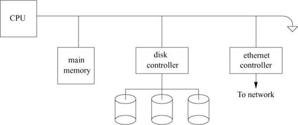
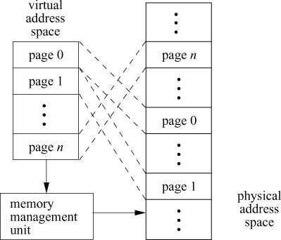
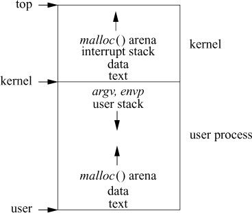
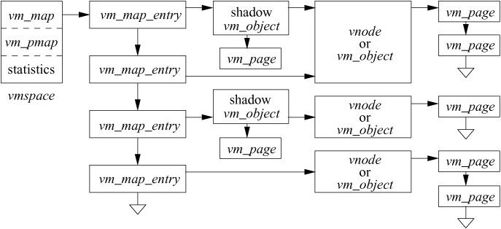
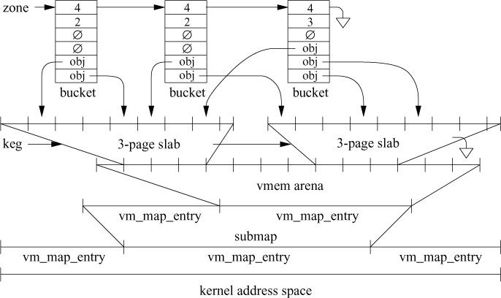
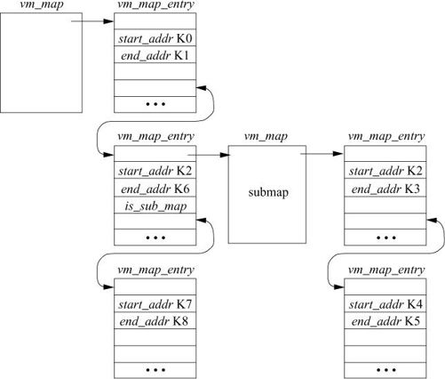
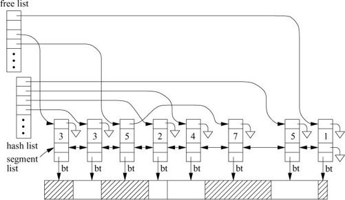
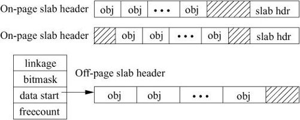
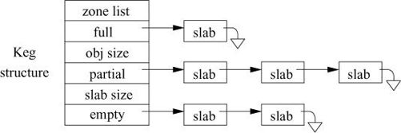
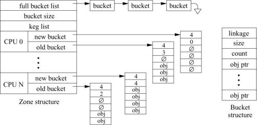

# Chapter 6. Memory Management

## 6.1 Terminology

A central component of any operating system is the memory-management system. As the name implies, memory-management facilities are responsible for the management of memory resources available on a machine. These resources are typically layered in a hierarchical fashion, with memory-access times inversely related to their proximity to the CPU (see Figure 6.1). The primary memory system is main memory; the next level of storage is secondary storage or backing storage. Main-memory systems usually are constructed from random-access memories, whereas secondary stores are placed on disk drives. In certain workstation environments, the common two-level hierarchy is a three-level hierarchy, with the addition of file-server machines or network-attached storage connected to a workstation via a local-area network [Gingell et al., 1987].

任何操作系统的核心组件都是内存管理系统。顾名思义，内存管理设施负责管理机器上可用的内存资源。这些资源通常以分层方式分层，内存访问时间与其与 CPU 的接近程度成反比（见图 6.1）。主存系统是主存；下一级存储是二级存储或后备存储。主存储器系统通常由随机存取存储器构成，而二级存储器则放置在磁盘驱动器上。在某些工作站环境中，常见的两级层次结构是三级层次结构，增加了文件服务器机器或通过局域网连接到工作站的网络附加存储 [Gingell et al., 1987]。

Figure 6.1 Hierarchical layering of memory.

Each level in this hierarchy may have its own hierarchy. For example, there are usually several layers of caches between the CPU and the main memory. The secondary storage often has dynamic- or flash-memory caches to speed access to the moving-head disk drives.

此层次结构中的每个级别都可能有自己的层次结构。例如，CPU 和主存之间通常有几层缓存。二级存储通常具有动态或闪存缓存，以加快对移动磁头磁盘驱动器的访问。

In a multiprogrammed environment, it is critical for the operating system to share available memory resources effectively among the processes. The operation of any memory-management policy is directly related to the memory required for a process to execute. That is, if a process must reside entirely in main memory for it to execute, then a memory-management system must be oriented toward allocating large units of memory. On the other hand, if a process can execute when it is only partially resident in main memory, then memory-management policies are likely to be substantially different. Memory-management facilities usually try to optimize the number of runnable processes that are resident in main memory. This goal must be considered with the goals of the scheduler (Section 4.4) so that conflicts that can adversely affect overall system performance are avoided.

在多道程序环境中，操作系统在进程之间有效共享可用内存资源至关重要。任何内存管理策略的操作都与进程执行所需的内存直接相关。也就是说，如果一个进程必须完全驻留在主内存中才能执行，那么内存管理系统必须面向分配大内存单元。另一方面，如果一个进程在它只部分驻留在主内存中时可以执行，那么内存管理策略可能会有很大的不同。内存管理工具通常会尝试优化驻留在主内存中的可运行进程的数量。该目标必须与调度程序的目标（第 4.4 节）一起考虑，以避免可能对整体系统性能产生不利影响的冲突。

Although the availability of secondary storage permits more processes to exist than can be resident in main memory, it also requires additional algorithms that can be complicated. Space management typically requires algorithms and policies different from those used for main memory, and a policy must be devised for deciding when to move processes between main memory and secondary storage.

尽管辅助存储的可用性允许存在的进程多于驻留在主内存中的进程，但它也需要额外的复杂算法。空间管理通常需要与主存不同的算法和策略，并且必须设计一个策略来决定何时在主存和辅助存储之间移动进程。

### Processes and Memory

Each process operates in a virtual address space that is defined by the architecture of the underlying hardware on which it executes. A virtual address space is a range of memory locations that a process references independently of the physical memory present in the system. In other words, the virtual address space of a process is independent of the physical address space of the CPU. For a machine to support virtual memory, we also require that the whole of a process’s virtual address space does not need to be resident in main memory for that process to execute.

每个进程都在一个虚拟地址空间中运行，该地址空间由它执行的底层硬件的体系结构定义。虚拟地址空间是进程引用的一系列内存位置，独立于系统中存在的物理内存。换句话说，进程的虚拟地址空间独立于 CPU 的物理地址空间。对于支持虚拟内存的机器，我们还要求进程的整个虚拟地址空间不需要驻留在主内存中以便该进程执行。

References to the virtual address space—virtual addresses—are translated by hardware into references to physical memory. This operation, termed address translation, permits programs to be loaded into physical memory at any location without requiring position-dependent virtual addresses in the program to be changed. This relocation of position-dependent addressing is possible because the addresses known to the program do not change. Address translation and virtual addressing are also important in efficient sharing of a CPU, because they permit context switching to be done quickly.

对虚拟地址空间的引用——虚拟地址——由硬件转换为对物理内存的引用。此操作称为地址转换，允许将程序加载到任何位置的物理内存中，而无需更改程序中与位置相关的虚拟地址。这种位置相关寻址的重定位是可能的，因为程序已知的地址不会改变。地址转换和虚拟寻址对于 CPU 的有效共享也很重要，因为它们允许快速完成上下文切换。

When multiple processes are coresident in main memory, we must protect the physical memory associated with each process’s virtual address space to ensure that one process cannot alter the contents of another process’s virtual address space unless they explicitly choose to share parts of their address space. This protection is implemented in hardware and is usually tightly coupled with the implementation of address translation. Consequently, the two operations usually are defined and implemented together as hardware termed the memory-management unit (MMU).

当多个进程共存于主存时，我们必须保护与每个进程的虚拟地址空间相关联的物理内存，以确保一个进程无法更改另一个进程的虚拟地址空间的内容，除非他们明确选择共享部分地址空间。这种保护是在硬件中实现的，通常与地址转换的实现紧密结合。因此，这两个操作通常作为称为内存管理单元 (MMU) 的硬件一起定义和实现。

Virtual memory can be implemented in many ways, some of which are software based, such as overlays. Most effective virtual-memory schemes are, however, hardware based. In these schemes, the virtual address space is divided into fixed-size units, termed pages, as shown in Figure 6.2. Virtual-memory references are resolved by the address-translation unit to a page in main memory and an offset within that page. Hardware protection is applied by the memory-management unit on a page-by-page basis.

虚拟内存可以通过多种方式实现，其中一些是基于软件的，例如覆盖。然而，最有效的虚拟内存方案是基于硬件的。在这些方案中，虚拟地址空间被划分为固定大小的单元，称为页，如图 6.2 所示。地址转换单元将虚拟内存引用解析为主内存中的页面和该页面内的偏移量。内存管理单元逐页应用硬件保护。

### Paging

Address translation provides the implementation of virtual memory by decoupling the virtual address space of a process from what is contained in the physical address space of the CPU. Each page of virtual memory is marked as resident or nonresident in main memory. If a process references a location in virtual memory that is not resident, a hardware trap termed a page fault is generated. The servicing of page faults, or paging, permits processes to execute even if they are only partially resident in main memory.

地址转换通过将进程的虚拟地址空间与 CPU 物理地址空间中包含的内容解耦来提供虚拟内存的实现。虚拟内存的每一页都在主内存中标记为常驻或非常驻。如果一个进程引用了虚拟内存中一个不常驻的位置，则会生成一个称为页面错误的硬件陷阱。页面错误或分页的服务允许进程执行，即使它们仅部分驻留在主内存中。

Coffman & Denning [1973] characterize paging systems by three important policies:

Coffman & Denning [1973] 通过三个重要策略来描述寻呼系统的特征：

1. When the system loads pages into memory—the fetch policy   当系统将页面加载到内存中时——获取策略
2. Where the system places pages in memory—the placement policy   系统在内存中放置页面的位置——放置策略
3. How the system selects pages to be removed from main memory when pages are unavailable for a placement request—the replacement policy   当页面不可用于放置请求时，系统如何选择要从主内存中删除的页面——替换策略

The performance of modern computers is heavily dependent on one or more high-speed hardware caches to reduce the need to access the much slower main memory. The placement policy should ensure that contiguous pages in virtual memory make the best use of the processor-memory cache and the address-translation cache [Kessler & Hill., 1992]. FreeBSD uses superpages to ensure good placement. Under a pure demand-paging system, a demand-fetch policy is used, in which only the missing page is fetched, and replacements occur only when main memory is full. In practice, paging systems do not implement a pure demand-paging algorithm. Instead, the fetch policy often is altered to do prepaging—fetching pages of memory other than the one that caused the page fault—and the replacement policy is invoked before main memory is full.

现代计算机的性能在很大程度上依赖于一个或多个高速硬件缓存，以减少访问速度慢得多的主内存的需要。放置策略应确保虚拟内存中的连续页面充分利用处理器内存缓存和地址转换缓存 [Kessler & Hill., 1992]。 FreeBSD 使用超级页面来确保良好的放置。在纯按需分页系统下，采用的是按需取策略，只取丢失的页面，只有在主存已满时才进行替换。在实践中，寻呼系统并不实现纯粹的请求寻呼算法。取而代之的是，获取策略经常被更改以进行准备（获取导致页面错误的内存页面之外的内存页面），并且在主内存已满之前调用替换策略。

### Replacement Algorithms

The replacement policy is an important aspect of any paging system. There are many algorithms from which we can select in designing a replacement strategy for a paging system. Much research has been carried out in evaluating the performance of different page-replacement algorithms [Jiang et al., 2005; Bansal & Modha, 2004; Belady, 1966; Marshall, 1979; King, 1971].

替换策略是任何寻呼系统的一个重要方面。在为寻呼系统设计替换策略时，我们可以选择多种算法。在评估不同页面替换算法的性能方面进行了大量研究 [Jiang et al., 2005;班萨尔和莫达，2004 年；贝拉迪，1966 年；马歇尔，1979 年；金，1971]。

A process’s paging behavior for a given input is described in terms of the pages referenced over the time of the process’s execution. This sequence of pages, termed a reference string, represents the behavior of the process at discrete times during the process’s lifetime. Corresponding to the sampled references that constitute a process’s reference string are real-time values that reflect whether the associated references resulted in a page fault. A useful measure of a process’s behavior is the fault rate, which is the number of page faults encountered during processing of a reference string, normalized by the length of the reference string.

进程对给定输入的分页行为是根据进程执行期间引用的页面来描述的。这个页面序列，称为参考字符串，代表了在进程生命周期中离散时间的进程行为。与构成进程引用字符串的采样引用相对应的是反映相关引用是否导致页面错误的实时值。进程行为的一个有用度量是故障率，它是在处理参考字符串期间遇到的页面错误的数量，由参考字符串的长度标准化。

Page-replacement algorithms typically are evaluated in terms of their effectiveness on reference strings that have been collected from execution of real programs. Formal analysis can also be used, although it is difficult to do unless many restrictions are applied to the execution environment. The most common metric used in measuring the effectiveness of a page-replacement algorithm is the fault rate.

页面替换算法通常根据它们对从实际程序执行中收集的参考字符串的有效性进行评估。也可以使用形式分析，尽管很难做到，除非对执行环境应用了许多限制。用于衡量页面替换算法有效性的最常用指标是故障率。

Page-replacement algorithms are defined by the criteria that they use for selecting pages to be reclaimed. For example, the optimal replacement policy [Denning, 1970] states that the “best” choice of a page to replace is the one with the longest expected time until its next reference. Clearly, this policy is not applicable to dynamic systems, as it requires a priori knowledge of the paging characteristics of a process. The policy is useful for evaluation purposes, however, as it provides a yardstick for comparing the performance of other page-replacement algorithms.

页面替换算法由它们用于选择要回收的页面的标准定义。例如，最佳替换策略 [Denning, 1970] 指出要替换的页面的“最佳”选择是在下一次引用之前预期时间最长的页面。显然，此策略不适用于动态系统，因为它需要对进程的分页特性有先验知识。然而，该策略对于评估目的很有用，因为它提供了一个标准来比较其他页面替换算法的性能。

Practical page-replacement algorithms require a certain amount of state information that the system uses in selecting replacement pages. This state typically includes the reference pattern of a process, sampled at discrete time intervals. On some systems, this information can be expensive to collect [BabaoImagelu & Joy, 1981]. As a result, the “best” page-replacement algorithm may not be the most efficient.

实用的页面替换算法需要系统在选择替换页面时使用的一定数量的状态信息。这种状态通常包括以离散时间间隔采样的过程的参考模式。在某些系统上，收集这些信息的成本可能很高 [Babaolu & Joy, 1981]。因此，“最佳”页面替换算法可能不是最有效的。

### Working-Set Model

The working-set model helps identify the set of pages that a process is actively using. The working-set model assumes that processes exhibit a slowly changing locality of reference. For a period of time, a process operates in a set of subroutines or loops, causing all its memory references to refer to a fixed subset of its address space, termed the working set. The process periodically changes its working set, abandoning certain areas of memory and beginning to access new ones. After a period of transition, the process defines a new set of pages as its working set. In general, if the system can provide the process with enough pages to hold that process’s working set, the process will experience a low page-fault rate. If the system cannot provide the process with enough pages for the working set, the process will run slowly and will have a high page-fault rate.

工作集模型有助于识别进程正在使用的页面集。工作集模型假设进程表现出缓慢变化的参考位置。在一段时间内，进程在一组子例程或循环中运行，导致其所有内存引用都指向其地址空间的固定子集，称为工作集。该进程会定期更改其工作集，放弃某些内存区域并开始访问新的内存区域。经过一段时间的转换后，该流程将一组新的页面定义为它的工作集。通常，如果系统可以为进程提供足够的页面来保存该进程的工作集，则该进程将遇到较低的页面错误率。如果系统不能为进程提供足够的工作集页面，该进程将运行缓慢并具有很高的页面错误率。

Precise calculation of the working set of a process is impossible without a priori knowledge of that process’s memory-reference pattern. However, the working set can be approximated by various means. One method of approximation is to track the number of pages held by a process and that process’s page-fault rate. If the page-fault rate increases above a high watermark, the working set is assumed to have increased, and the number of pages held by the process is allowed to grow. Conversely, if the page-fault rate drops below a low watermark, the working set is assumed to have decreased, and the number of pages held by the process is reduced.

如果没有进程的内存引用模式的先验知识，就不可能精确计算进程的工作集。然而，工作集可以通过各种方式来近似。一种近似方法是跟踪进程持有的页面数以及该进程的页面错误率。如果页面错误率增加到高水位线以上，则假定工作集已增加，并且允许进程持有的页面数量增加。相反，如果页面错误率降至低水位线以下，则假定工作集已减少，并且进程持有的页面数将减少。

### Swapping

Swapping is the term used to describe a memory-management policy in which entire processes are moved to and from secondary storage when main memory is in short supply. Swap-based memory-management systems usually are less complicated than are demand-paged systems, since there is less bookkeeping to do. However, pure swapping systems typically are less effective than are paging systems, since the degree of multiprogramming is lowered by the requirement that processes be fully resident to execute. Swapping is sometimes combined with paging in a two-tiered scheme, whereby paging satisfies memory demands until a severe memory shortfall requires drastic action, in which case swapping is used.

交换是用于描述内存管理策略的术语，其中当主内存供应不足时，整个进程移入和移出辅助存储。基于交换的内存管理系统通常不如按需分页系统复杂，因为需要做的记账更少。然而，纯交换系统通常不如分页系统有效，因为进程完全驻留以执行的要求降低了多道程序的程度。交换有时与两层方案中的分页相结合，从而分页满足内存需求，直到严重的内存不足需要采取激烈的行动，在这种情况下使用交换。

In this chapter, a portion of secondary storage that is used for paging or swapping is termed a swap area or swap space. The hardware devices on which these areas reside are termed swap devices.

在本章中，用于分页或交换的部分二级存储称为交换区或交换空间。这些区域所在的硬件设备称为交换设备。

### Advantages of Virtual Memory

There are several advantages to the use of virtual memory on computers capable of supporting this facility properly. Virtual memory allows large programs to be run on machines with main-memory configurations that are smaller than the program size. On machines with a moderate amount of memory, it allows more programs to be resident in main memory to compete for CPU time, as the programs do not need to be completely resident. When programs use sections of their program or data space for some time, leaving other sections unused, the unused sections do not need to be present. Also, the use of virtual memory allows programs to start up faster, since they generally require only a small section to be loaded before they begin processing arguments and determining what actions to take. Other parts of a program may not be needed at all during individual runs. As a program runs, additional sections of its program and data spaces are paged in as needed (demand paging). Finally, there are many algorithms that are more easily programmed by sparse use of a large address space than by careful packing of data structures into a small area. Such techniques are too expensive for use without virtual memory, but they may run much faster when that facility is available, without using an inordinate amount of physical memory.

在能够正确支持此功能的计算机上使用虚拟内存有几个优点。虚拟内存允许大型程序在主内存配置小于程序大小的机器上运行。在内存适中的机器上，它允许更多的程序驻留在主内存中以竞争 CPU 时间，因为程序不需要完全驻留。当程序使用其程序或数据空间的部分一段时间，而让其他部分未使用时，未使用的部分不需要存在。此外，虚拟内存的使用允许程序更快地启动，因为在开始处理参数和确定要采取的操作之前，它们通常只需要加载一小部分。在单独运行期间可能根本不需要程序的其他部分。当程序运行时，它的程序和数据空间的附加部分根据需要被分页（请求分页）。最后，有许多算法通过稀疏使用大地址空间比通过将数据结构小心地打包到一个小区域更容易编程。这种技术在没有虚拟内存的情况下使用成本太高，但是当该设施可用时，它们可以运行得更快，而不会使用过多的物理内存。

On the other hand, the use of virtual memory can degrade performance. It is more efficient to load a program all at one time than to load it entirely in small sections on demand. There is a cost for each operation, including saving and restoring state and determining which page must be loaded, so some systems use demand paging for only those programs that are larger than some minimum size.

另一方面，使用虚拟内存会降低性能。一次加载一个程序比按需加载整个小部分更有效。每个操作都有成本，包括保存和恢复状态以及确定必须加载哪个页面，因此一些系统仅对那些大于某个最小大小的程序使用请求分页。

### Hardware Requirements for Virtual Memory

Nearly all versions of UNIX have required some form of memory-management hardware to support transparent multiprogramming. To protect processes from modification by other processes, the memory-management hardware must prevent programs from changing their own address mapping. The FreeBSD kernel runs in a privileged mode (kernel mode or system mode) in which memory mapping can be controlled, whereas processes run in an unprivileged mode (user mode). There are several additional architectural requirements for support of virtual memory. The CPU must distinguish between resident and nonresident portions of the address space, must suspend programs when they refer to nonresident addresses, and must resume programs’ operation once the operating system has placed the required section in memory. Because the CPU may discover missing data at various times during the execution of an instruction, it must provide a mechanism to save the machine state so that the instruction can be continued or restarted later. This ability to restart an instruction is called a precise exception. The CPU may implement restarting by saving enough state when an instruction begins that the state can be restored when a fault is discovered. Alternatively, instructions could delay any modifications or side effects until after any faults would be discovered so that the instruction execution does not need to back up before restarting. On some computers, instruction backup requires the assistance of the operating system.

几乎所有版本的 UNIX 都需要某种形式的内存管理硬件来支持透明的多道程序设计。为了保护进程不被其他进程修改，内存管理硬件必须防止程序改变它们自己的地址映射。 FreeBSD 内核以特权模式（内核模式或系统模式）运行，在该模式下可以控制内存映射，而进程以非特权模式（用户模式）运行。支持虚拟内存还有几个额外的架构要求。 CPU 必须区分地址空间的常驻和非常驻部分，必须在程序引用非常驻地址时暂停程序，并且一旦操作系统将所需的部分放入内存中，就必须恢复程序的操作。因为CPU在执行一条指令的过程中可能会在不同的时间发现丢失的数据，所以它必须提供一种机制来保存机器状态，以便以后可以继续或重新启动该指令。这种重新启动指令的能力称为精确异常。 CPU可以通过在指令开始时保存足够多的状态来实现重启，当发现故障时可以恢复该状态。或者，指令可以延迟任何修改或副作用，直到发现任何故障之后，以便指令执行在重新启动之前不需要备份。在某些计算机上，指令备份需要操作系统的协助。

Most machines designed to support demand-paged virtual memory include hardware support for the collection of information on program references to memory. When the system selects a page for replacement, it must save the contents of that page if they have been modified since the page was brought into memory. The hardware usually maintains a per-page flag showing whether the page has been modified. Many machines also include a flag recording any access to a page for use by the replacement algorithm.

大多数旨在支持按需分页虚拟内存的机器都包括对内存程序引用信息收集的硬件支持。当系统选择要替换的页面时，它必须保存该页面的内容，如果这些内容自该页面被引入内存以来已被修改。硬件通常维护一个每页标志，显示该页是否已被修改。许多机器还包括一个标记，记录对页面的任何访问以供替换算法使用。

## 6.2 Overview of the FreeBSD Virtual-Memory System

The FreeBSD virtual-memory system is based on the Mach 2.0 virtual-memory system [Tevanian, 1987; Rashid et al., 1987], with updates from Mach 2.5 and Mach 3.0. The Mach virtual-memory system was adopted because it features efficient support for sharing and a clean separation of machine-independent and machine-dependent features, as well as multiprocessor support. Although parts of the original Mach abstractions persist, little of the code still remains. None of the original Mach system-call interface remains. It has been replaced with the interface first proposed for 4.2BSD that has been widely adopted by the UNIX industry; the FreeBSD interface is described in Section 6.5.

FreeBSD 虚拟内存系统基于 Mach 2.0 虚拟内存系统 [Tevanian, 1987; Rashid et al., 1987]，更新了 Mach 2.5 和 Mach 3.0。之所以采用 Mach 虚拟内存系统，是因为它具有对共享的有效支持、独立于机器和依赖于机器的特性的清晰分离以及多处理器支持。尽管原始 Mach 抽象的一部分仍然存在，但几乎没有代码仍然存在。原始的 Mach 系统调用接口没有任何保留。它已被UNIX行业广泛采用的4.2BSD首次提出的接口所取代； FreeBSD 接口在第 6.5 节中描述。

The virtual address space of most architectures is divided into two parts: address space dedicated to the kernel at high addresses and address space dedicated to run user processes at low addresses. A typical address space layout is shown in Figure 6.3. Here, the kernel and its associated data structures reside at the top of the address space. The initial text and data areas of the user process start near the beginning of memory. By default, the first 4 or 8 Kbyte of memory are kept off-limits to the process. The reason for this restriction is to limit the ability to convert a kernel null-pointer dereference into a privilege escalation attack. This restriction also eases program debugging; indirecting through a null pointer will cause an invalid address fault instead of reading or writing the program text.

大多数体系结构的虚拟地址空间分为两部分：高地址专用于内核的地址空间和低地址专用于运行用户进程的地址空间。典型的地址空间布局如图 6.3 所示。在这里，内核及其相关的数据结构位于地址空间的顶部。用户进程的初始文本和数据区域在内存的开头附近开始。默认情况下，进程的前 4 或 8 KB 内存是禁止访问的。此限制的原因是限制将内核空指针取消引用转换为权限提升攻击的能力。这种限制也简化了程序调试；通过空指针间接将导致无效地址错误而不是读取或写入程序文本。

Figure 6.3 Layout of virtual address space.

Memory allocations made by the running process using the malloc() library routine are done in the memory that starts immediately following the data area and grows to higher addresses. The argument vector and environment vectors are at the top of the user portion of the address space. The user’s stack starts just below these vectors and grows to lower addresses.

正在运行的进程使用 malloc() 库例程进行的内存分配在内存中完成，该内存紧随数据区域之后开始并增长到更高的地址。参数向量和环境向量位于地址空间的用户部分的顶部。用户的堆栈从这些向量的正下方开始，并增长到较低的地址。

For a process running on an architecture with 64 bits of address space, its stack is mapped so far above its malloc() arena that the two spaces should never run into each other as the process would run out of memory resources long before the two address spaces would meet.

对于在具有 64 位地址空间的体系结构上运行的进程，其堆栈被映射到远高于其 malloc() 区域的位置，因此这两个空间不应该相互碰撞，因为该进程会在两个地址之前很久就耗尽内存资源空间会相遇。

For processes running on 32-bit architectures, the top 1 Gbyte of the address space is reserved for use by the kernel. Systems with many small processes making heavy use of kernel facilities such as networking can be configured to use the top 2 Gbyte for the kernel. The remaining 3 Gbyte or 2 Gbyte of address space is available for use by processes. Unless administratively limited, the stack and malloc() arena of a process can each grow until they meet.

对于在 32 位体系结构上运行的进程，地址空间的前 1 GB 保留供内核使用。具有大量使用内核设施（例如网络）的许多小进程的系统可以配置为将前 2 GB 用于内核。剩余的 3 GB 或 2 GB 地址空间可供进程使用。除非在管理上受到限制，否则进程的堆栈和 malloc() 区域都可以增长，直到它们相遇。

The kernel’s address space on a 64-bit architecture is usually large enough to support a fixed and permanent mapping to all the physical memory on the machine. This direct mapping to the physical address space greatly simplifies many kernel operations since the kernel can always directly read any page of physical memory.

64 位架构上的内核地址空间通常足够大，以支持到机器上所有物理内存的固定和永久映射。这种到物理地址空间的直接映射极大地简化了许多内核操作，因为内核总是可以直接读取物理内存的任何页面。

On a 32-bit architecture, the physical memory usually exceeds the address space dedicated to the kernel. Thus, the kernel must set aside part of its address space to temporarily map in physical pages that it needs to read. Each time that it wants to read a new physical page, it must find an existing page that it can unmap to make room for the new page. It must then manipulate its memory mapping, invalidating the old mapping and any caching associated with that mapping, and then enter the new mapping. The cost of cache invalidation on multiprocessor machines is high because the cache on every CPU must be invalidated.

在 32 位体系结构上，物理内存通常超过内核专用的地址空间。因此，内核必须留出一部分地址空间来临时映射它需要读取的物理页。每次它想要读取一个新的物理页面时，它必须找到一个可以取消映射的现有页面，以便为新页面腾出空间。然后它必须操作其内存映射，使旧映射和与该映射关联的任何缓存无效，然后输入新映射。多处理器机器上缓存失效的成本很高，因为每个 CPU 上的缓存都必须失效。

### User Address-Space Management

The virtual-memory system implements protected address spaces into which can be mapped data sources (objects) such as files, or private and anonymous pieces of swap space. Physical memory is used as a cache of recently used pages from these objects and is managed by a global page-replacement algorithm.

虚拟内存系统实现了受保护的地址空间，可以将文件等数据源（对象）或私有和匿名交换空间块映射到这些地址空间中。物理内存用作这些对象中最近使用的页面的缓存，并由全局页面替换算法管理。

In FreeBSD and other modern UNIX systems that support the mmap system call, address-space usage is less structured. Shared library implementations may place text or data arbitrarily, rendering the notion of predefined regions obsolete. By default, shared libraries are placed just above the run-time configured maximum heap area.

在 FreeBSD 和其他支持 mmap 系统调用的现代 UNIX 系统中，地址空间的使用不太结构化。共享库实现可以任意放置文本或数据，从而使预定义区域的概念过时。默认情况下，共享库位于运行时配置的最大堆区域的正上方。

At any time, the currently executing process is mapped into the virtual address space. When the system decides to context switch to another process, it must save the information about the current-process address mapping, then load the address mapping for the new process to be run. The details of this address-map switching are architecture dependent. Most architectures need to change only a few memory-mapping registers that point to the base, and to give the length of memory-resident page tables.

在任何时候，当前正在执行的进程都被映射到虚拟地址空间中。当系统决定上下文切换到另一个进程时，它必须保存有关当前进程地址映射的信息，然后为要运行的新进程加载地址映射。此地址映射切换的细节取决于体系结构。大多数体系结构只需要更改一些指向基址的内存映射寄存器，并给出内存驻留页表的长度。

Both the kernel and user processes use the same basic data structures for the management of their virtual memory. The data structures used to manage virtual memory are as follows:

内核进程和用户进程都使用相同的基本数据结构来管理它们的虚拟内存。用于管理虚拟内存的数据结构如下：

|                    |                                                                                                                                                                                                                                                      |
| ------------------ | ---------------------------------------------------------------------------------------------------------------------------------------------------------------------------------------------------------------------------------------------------- |
| `vmspace`          | Structure that encompasses both the machine-dependent and machine-independent structures describing a process’s address space   包含描述进程地址空间的机器相关和机器无关结构的结构                                                                |
| `vm_map`           | Highest-level data structure that describes the machine-independent virtual address space   描述与机器无关的虚拟地址空间的最高级数据结构                                                                                                          |
| `vm_map_entry`     | Structure that describes the mapping from a virtually contiguous range of addresses that share protection and inheritance attributes to the backing-store vm_object   描述从共享保护和继承属性的虚拟连续地址范围到后备存储 vm_object 的映射的结构 |
| `vm_object`        | Structure that describes a source of data such as physical memory or other resources containing instructions or data   描述数据源的结构，例如物理内存或其他包含指令或数据的资源                                                                   |
| `shadow vm_object` | Special vm_object that represents modified copy of original data, described in Section 6.5.   表示原始数据的修改副本的特殊 vm_object，在第 6.5 节中描述。                                                                                         |
| `vm_page`          | The lowest-level data structure that represents the physical memory being used by the virtual-memory system   表示虚拟内存系统使用的物理内存的最低级数据结构                                                                                      |

In the remainder of this section, we describe briefly how all these data structures fit together. The remainder of this chapter describes the details of the structures and how the structures are used.

在本节的其余部分，我们将简要描述所有这些数据结构如何组合在一起。本章的其余部分描述了结构的详细信息以及如何使用这些结构。

Figure 6.4 shows a typical process address space and associated data structures. The vmspace structure encapsulates the virtual-memory state of a particular process, including the machine-dependent and machine-independent data structures, as well as statistics. The machine-dependent vm_pmap structure is opaque to all but the lowest level of the system and contains all information necessary to manage the memory-management hardware. This pmap layer is the subject of Section 6.13 and is ignored for the remainder of the current discussion. The machine-independent data structures include the address space that is described by a vm_map structure. The vm_map points to an ordered linked list of vm_map_entry structures, a binary-search tree for speeding up lookups during memory allocation and page-fault handling, and a pointer to the associated machine-dependent vm_pmap structure contained in the vmspace. A vm_map_entry structure describes a virtually contiguous range of addresses that have the same protection and inheritance attributes. Every vm_map_entry points to a chain of vm_object structures that describes sources of data (objects) that are mapped at the indicated address range. At the tail of the vm_object chain is the original mapped data object, usually representing a persistent data source, such as a file. Interposed between that vm_object and the map entry are zero or more transient shadow vm_objects that represent modified copies of the original data. These shadow vm_objects are discussed in detail in Section 6.5.

图 6.4 显示了一个典型的进程地址空间和相关的数据结构。 vmspace 结构封装了特定进程的虚拟内存状态，包括与机器相关和与机器无关的数据结构，以及统计信息。依赖于机器的 vm_pmap 结构对系统的最低层以外的所有层都是不透明的，并且包含管理内存管理硬件所需的所有信息。这个 pmap 层是第 6.13 节的主题，当前讨论的其余部分将被忽略。与机器无关的数据结构包括由 vm_map 结构描述的地址空间。 vm_map 指向 vm_map_entry 结构的有序链表、用于在内存分配和页面错误处理期间加速查找的二叉搜索树，以及指向包含在 vmspace 中的关联机器相关 vm_pmap 结构的指针。 vm_map_entry 结构描述了具有相同保护和继承属性的几乎连续的地址范围。每个 vm_map_entry 指向一个 vm_object 结构链，该链描述了在指定地址范围内映射的数据（对象）源。 vm_object 链的尾部是原始映射的数据对象，通常代表一个持久化的数据源，比如一个文件。介于该 vm_object 和映射条目之间的是零个或多个瞬态阴影 vm_objects，它们表示原始数据的修改副本。这些影子 vm_objects 将在第 6.5 节中详细讨论。

Figure 6.4 Data structures that describe a process address space.

Each vm_object structure contains an ordered list of vm_page structures representing the physical-memory cache of the vm_object. A vm_page structure is most commonly and quickly found using the radix tree maintained for each vm_object. The page is keyed within this radix tree by its logical offset from the start of the vm_object. The cached pages are also kept in an ordered list to provide fast iteration over all the pages within a range of virtual addresses. The vm_page structure also records the type of, and a pointer to, the pager structure (not shown) that contains information on how to page in or page out data from its backing store.

每个 vm_object 结构都包含一个 vm_page 结构的有序列表，表示 vm_object 的物理内存缓存。使用为每个 vm_object 维护的基数树，可以最常见和快速地找到 vm_page 结构。该页在这个基数树中通过其与 vm_object 开头的逻辑偏移量进行键控。缓存的页面也保存在一个有序列表中，以在虚拟地址范围内的所有页面上提供快速迭代。 vm_page 结构还记录了分页器结构（未显示）的类型和指向该结构的指针，该结构包含有关如何从其后备存储中调入或调出数据的信息。

At boot time, the kernel allocates an array of vm_page structures with an entry for every page of physical memory managed by the virtual-memory system where page N is entry N in the array. The structure also contains the status of the page (e.g., modified or referenced) and links for various paging queues.

在启动时，内核为虚拟内存系统管理的物理内存的每个页面分配一个 vm_page 结构数组，其中页面 N 是数组中的条目 N。该结构还包含页面的状态（例如，修改或引用）和各种分页队列的链接。

All structures have the necessary interlocks for multithreading in a multiprocessor environment. The locking is fine grained, with at least one lock per instance of a data structure. Many of the structures have different locks protecting their individual fields.

所有结构都具有在多处理器环境中进行多线程所需的互锁。锁是细粒度的，每个数据结构实例至少有一个锁。许多结构都有不同的锁来保护它们各自的领域。

## 6.3 Kernel Memory Management

For 64-bit address-space architectures, the kernel is always permanently mapped into the high part of every process address space. However, for 32-bit address-space architectures, there are two ways in which the kernel’s memory can be organized. The most common is for the kernel to be permanently mapped into the high part of every process address space. In this model, switching from one process to another does not affect the kernel portion of the address space. The alternative organization is to switch between having the kernel occupy the whole address space and mapping the currently running process into the address space. Having the kernel permanently mapped does reduce the amount of address space available to a large process (and the kernel), but it also reduces the cost of data copying. Many system calls require data to be transferred between the currently running user process and the kernel. With the kernel permanently mapped, the data can be copied via the efficient block-copy instructions. If the kernel is alternately mapped with the process, data copying requires either the use of temporary mappings or the use of special instructions that copy to and from the previously mapped address space. Both of these approaches are up to a factor of 2 slower than the standard block-copy instructions. Since up to one-third of the kernel time is spent in copying between the kernel and user processes, slowing this operation by a factor of 2 significantly slows system throughput.

对于 64 位地址空间体系结构，内核总是永久映射到每个进程地址空间的高位部分。然而，对于 32 位地址空间架构，内核内存的组织方式有两种。最常见的是将内核永久映射到每个进程地址空间的高位部分。在这个模型中，从一个进程切换到另一个进程不会影响地址空间的内核部分。另一种组织是在内核占用整个地址空间和将当前运行的进程映射到地址空间之间切换。使内核永久映射确实减少了大型进程（和内核）可用的地址空间量，但也降低了数据复制的成本。许多系统调用需要在当前运行的用户进程和内核之间传输数据。随着内核永久映射，数据可以通过高效的块复制指令进行复制。如果内核与进程交替映射，则数据复制需要使用临时映射或使用特殊指令来复制到先前映射的地址空间和从之前映射的地址空间复制。这两种方法都比标准块复制指令慢 2 倍。由于多达三分之一的内核时间用于在内核和用户进程之间进行复制，因此将此操作减慢 2 倍会显着降低系统吞吐量。

When the kernel is permanently mapped into the address space, it is able to freely read and write the address space of the user process but the converse is not true. The kernel’s range of virtual address space is marked inaccessible to all user processes. Writing is restricted so user processes cannot tamper with the kernel’s data structures. Reading is restricted so user processes cannot watch sensitive kernel data structures, such as the terminal input queues, that include such things as users typing their passwords.

当内核永久映射到地址空间时，它可以自由地读写用户进程的地址空间，反之则不然。内核的虚拟地址空间范围被标记为所有用户进程都无法访问。写入受到限制，因此用户进程无法篡改内核的数据结构。读取受到限制，因此用户进程无法查看敏感的内核数据结构，例如终端输入队列，其中包括用户输入密码等内容。

Usually, the hardware dictates which organization can be used. All the architectures supported by FreeBSD map the kernel into the top of the address space.

通常，硬件决定了可以使用的组织。 FreeBSD 支持的所有架构都将内核映射到地址空间的顶部。

When the system boots, the first task that the kernel must do is to set up data structures to describe and manage its address space. Table 6.1 lists the kernel’s hierarchy of allocators to manage its address space. The relationship of the elements of the hierarchy are shown in Figure 6.5. The remainder of this section describes this hierarchy starting from the low-level vm_map up to the per-CPU-level buckets.

当系统启动时，内核必须做的第一个任务是设置数据结构来描述和管理其地址空间。表 6.1 列出了内核用于管理其地址空间的分配器层次结构。层次结构元素的关系如图6.5所示。本节的其余部分描述了这个层次结构，从低级 vm_map 到每个 CPU 级的存储区。

| Level   | Purpose                                                 |
| ------- | ------------------------------------------------------- |
| buckets | per-CPU allocation of objects                           |
| zones   | allocation of objects from a keg to buckets             |
| kegs    | collection of slabs holding a particular type of object |
| slabs   | allocation of a set of objects from a vmem arena        |
| vmem    | multiple-of-page allocations within the vm_map          |
| vm_map  | kernel address space partitioning                       |

Table 6.1 Kernel memory allocator hierarchy.

Figure 6.5 Kernel memory allocator hierarchy.

### Kernel Maps and Submaps

Like any process, the kernel has a vm_map with a corresponding set of vm_map_entry structures that describe the use of a range of addresses (see Figure 6.6). Submaps are a special kernel-only construct used to isolate and constrain address-space allocation for kernel subsystems. One use is in subsystems that require contiguous pieces of the kernel address space. To avoid intermixing of unrelated allocations within an address range, that range is covered by a submap, and only the appropriate subsystem can allocate from that map. Maps associate data objects with similar sizes and lifetimes to minimize internal and external fragmentation respectively. Parts of the kernel may also require addresses with particular alignments or even specific addresses. Both can be ensured by use of submaps. Finally, submaps can be used to limit statically the amount of address space and hence the physical memory consumed by a subsystem.

与任何进程一样，内核有一个 vm_map 和一组对应的 vm_map_entry 结构，描述了地址范围的使用（见图 6.6）。子映射是一种特殊的仅内核构造，用于隔离和约束内核子系统的地址空间分配。一种用途是在需要内核地址空间的连续部分的子系统中。为了避免在一个地址范围内混合不相关的分配，该范围由一个子映射覆盖，并且只有适当的子系统可以从该映射中进行分配。映射将具有相似大小和生命周期的数据对象关联起来，以分别最小化内部和外部碎片。内核的某些部分可能还需要具有特定对齐甚至特定地址的地址。两者都可以通过使用子图来确保。最后，子映射可用于静态限制地址空间的数量，从而限制子系统消耗的物理内存。

Figure 6.6 Kernel address-space maps.

An example layout of the kernel map is shown in Figure 6.6. The kernel’s address space is described by the vm_map structure shown in the upperleft corner of the figure. Pieces of the address space are described by the vm_map_entry structures that are linked in ascending address order from K0 to K8 on the vm_map structure. Here, the kernel text, initialized data, uninitialized data, and initially allocated data structures reside in the range K0 to K1 and are represented by the first vm_map_entry. The next vm_map_entry is associated with the address range from K2 to K6. This piece of the kernel address space is being managed via a submap headed by the referenced vm_map structure. This submap currently has two parts of its address space used: the address range K2 to K3, and the address range K4 to K5. These two address ranges represent the kernel exec arguments arena and the pipe buffer arena, respectively. The final part of the kernel address space is being managed in the kernel’s main map, the address range K7 to K8 representing the kernel I/O staging area.

内核映射的示例布局如图 6.6 所示。内核的地址空间由图中左上角的 vm_map 结构描述。地址空间的片段由 vm_map_entry 结构描述，这些结构在 vm_map 结构上按从 K0 到 K8 的升序地址顺序链接。此处，内核文本、初始化数据、未初始化数据和初始分配的数据结构位于 K0 到 K1 范围内，并由第一个 vm_map_entry 表示。下一个 vm_map_entry 与从 K2 到 K6 的地址范围相关联。这块内核地址空间通过以引用的 vm_map 结构为头的子映射进行管理。该子图当前使用了其地址空间的两部分：地址范围 K2 到 K3，以及地址范围 K4 到 K5。这两个地址范围分别代表内核 exec 参数 arena 和管道缓冲区 arena。内核地址空间的最后一部分在内核的主映射中进行管理，地址范围 K7 到 K8 代表内核 I/O 暂存区。

### Kernel Address-Space Allocation

The virtual-memory system implements a set of primitive functions for allocating and freeing the page-aligned, page-size virtual-memory ranges that the kernel uses. These ranges may be allocated either from the main kernel-address map or from a submap. The allocation routines take a map and size as parameters but do not take an address. Thus, specific addresses within a map cannot be selected. There are different allocation routines for obtaining pageable and nonpageable memory ranges.

虚拟内存系统实现了一组原始函数，用于分配和释放内核使用的页面对齐、页面大小的虚拟内存范围。这些范围可以从主内核地址映射或子映射分配。分配例程采用映射和大小作为参数，但不采用地址。因此，无法选择地图内的特定地址。有不同的分配例程用于获取可分页和不可分页的内存范围。

Pageable kernel virtual memory is allocated with kmap_alloc_wait(). A pageable range has physical memory allocated on demand, and this memory can be written out to backing store by the pageout daemon (described in Section 6.12) as part of the latter’s normal replacement policy. The kmap_alloc_wait() function will block until address space is available. The kmap_free_wakeup() function deallocates kernel pageable memory and wakes up any processes waiting for address space in the specified map. Currently, pageable kernel memory is used for temporary storage of exec arguments and for pipe buffering.

可分页内核虚拟内存使用 kmap_alloc_wait() 分配。可分页范围具有按需分配的物理内存，作为后者正常替换策略的一部分，该内存可以由分页守护程序（在第 6.12 节中描述）写出到后备存储。 kmap_alloc_wait() 函数将阻塞，直到地址空间可用。 kmap_free_wakeup() 函数释放内核可分页内存并唤醒所有等待指定映射中地址空间的进程。目前，可分页内核内存用于临时存储 exec 参数和管道缓冲。

A nonpageable, or wired, range has physical memory assigned at the time of the call, and this memory is not subject to replacement by the pageout daemon. Wired pages never cause a page fault as that might result in a blocking operation. Wired memory is allocated from either the general allocator malloc(), or the zone allocator described in the last two subsections of this section.

不可分页或有线范围在调用时分配了物理内存，并且该内存不受分页守护程序的替换。有线页面永远不会导致页面错误，因为这可能会导致阻塞操作。有线内存是从通用分配器 malloc() 或本节最后两个小节中描述的区域分配器分配的。

The base functions used by the general and zone allocators for allocating wired memory are **`kmem_malloc()`** and **`kmem_free()`**. Normally, the allocator will block to wait for memory to be freed to satisfy the allocation if memory is not immediately available. The allocator has a nonblocking option that protects callers against inadvertently blocking. Callers that hold non-sleepable locks use the nonblocking option so they will fail if insufficient physical memory is available to fill the requested range. This nonblocking option is used when allocating memory at interrupt time and during other critical sections of code.

通用分配器和区域分配器用于分配有线内存的基本函数是 **`kmem_malloc()`** 和 **`kmem_free()`**。通常，如果内存不是立即可用，分配器将阻塞以等待释放内存以满足分配。分配器有一个非阻塞选项，可以防止调用者无意中阻塞。持有不可睡眠锁的调用者使用非阻塞选项，因此如果没有足够的物理内存来填充请求的范围，它们将失败。在中断时间和代码的其他关键部分分配内存时使用此非阻塞选项。

Historically, the two general-purpose allocators used kernel submaps to manage their address space. In FreeBSD 10, the management of the allocators address space was replaced with the vmem resource manager first described in Solaris [Bonwick, 1994; Bonwick & Adams, 2001]. At system boot, the kernel address ranges associated with the wired-memory arena are fully allocated in a single large piece and that piece of kernel memory is then managed by the vmem resource allocator.

历史上，这两个通用分配器使用内核子映射来管理它们的地址空间。在 FreeBSD 10 中，分配器地址空间的管理被 vmem 资源管理器取代，最早在 Solaris [Bonwick, 1994;邦威克和亚当斯，2001 年]。在系统启动时，与有线内存领域相关联的内核地址范围被完全分配在一个大块中，然后这块内核内存由 vmem 资源分配器管理。

The motivation for the change to vmem is that the kernel-map allocator tends to fragment its address space badly over time. The time to find a free piece of space goes up logarithmically with the number of allocated pieces that it is managing. By contrast, vmem allocates space in constant-time. The kernel-map allocator uses a first-fit strategy while vmem uses an approximation to a best-fit strategy. Best fit results in lower fragmentation and less wasted memory.

改变 vmem 的动机是内核映射分配器随着时间的推移往往会严重分割其地址空间。找到空闲空间的时间随着它管理的已分配空间的数量呈对数增加。相比之下，vmem 以恒定时间分配空间。内核映射分配器使用最适合的策略，而 vmem 使用最适合策略的近似值。最佳拟合可减少碎片并减少浪费的内存。

The data structures that vmem uses to manage its address-space arena are shown in Figure 6.7. The granularity that it manages are single pages of memory. Shown across the bottom of Figure 6.7 is the set of pages that it is managing. The arena is broken up into the free memory (hashed) and allocated memory (white). Each piece of free or allocated memory is described by a boundary tag. All the boundary tags are linked together in a segment list sorted from lowest to highest address.

vmem 用于管理其地址空间领域的数据结构如图 6.7 所示。它管理的粒度是单页内存。图 6.7 底部显示的是它正在管理的页面集。竞技场被分成空闲内存（散列）和分配的内存（白色）。每一块空闲或分配的内存都由一个边界标记描述。所有的边界标签都在一个段列表中链接在一起，从低到高的地址排序。

Figure 6.7 Vmem data structures. Key: bt—boundary tag.

The boundary tags that reference allocated memory are kept in a hash table using their starting address as their hash key. When a piece of memory is freed, its boundary tag is looked up and removed from the hash table. If either (or both) of its neighbors on the sorted list of boundary tags is free, they can be coalesced. The resulting free piece is then placed on the appropriate freelist. When coalescing has occurred, any unneeded boundary tags are freed. Taking the memory off the hash list when it is freed helps to detect multiple attempts to free the same memory. A second attempt to free it will not find it on the hash list and can issue an appropriate error.

引用分配内存的边界标签保存在一个哈希表中，使用它们的起始地址作为哈希键。当一块内存被释放时，它的边界标签被查找并从哈希表中删除。如果边界标签排序列表上的一个（或两个）邻居是空闲的，则可以合并它们。然后将生成的空闲块放置在适当的空闲列表中。当合并发生时，任何不需要的边界标签被释放。在释放时将内存从哈希列表中删除有助于检测多次尝试释放同一内存。再次尝试释放它不会在哈希列表中找到它，并且可能会发出适当的错误。

The boundary tags that reference free memory are on power-of-two freelists where freelist[n] is a list of free segments that are in the range 2n to 2n+1–1. To allocate a segment, we search the appropriate freelist for a segment large enough to satisfy the allocation. This approach, called segregated fit, approximates best fit because any segment on the chosen freelist is a good fit [Wilson et al., 1995].

引用空闲内存的边界标记位于 2 的幂的空闲列表上，其中 freelist[n] 是 2n 到 2n+1–1 范围内的空闲段列表。为了分配一个段，我们在适当的空闲列表中搜索一个足够大的段以满足分配。这种称为隔离拟合的方法近似于最佳拟合，因为所选空闲列表上的任何段都是很好的拟合 [Wilson et al., 1995]。

Approximations to best fit are appealing because they exhibit low fragmentation in practice for a wide variety of workloads [Johnstone & Wilson, 1998].

最佳拟合的近似值很有吸引力，因为它们在实践中对于各种工作负载表现出低碎片化 [Johnstone & Wilson, 1998]。

The algorithm for selecting a free segment depends on the allocation policy specified in the allocation request. Given a requested size in the range 2n to 2n+1–1, the following policies are available:

选择空闲段的算法取决于分配请求中指定的分配策略。给定 2n 到 2n+1–1 范围内的请求大小，以下策略可用：

* **`VM_BESTFIT`**: Search for the smallest segment on freelist[n] that can satisfy the allocation. If none are found, search for the smallest segment on freelist[n + 1] that can satisfy the allocation.   在 freelist[n] 上搜索可以满足分配的最小段。如果没有找到，则在 freelist[n + 1] 上搜索可以满足分配的最小段。
* **`VM_INSTANTFIT`**: If the size is exactly 2n, take the first segment on freelist[n]. Otherwise, take the first segment on freelist[n+1]. Any segment on this freelist is necessarily large enough to satisfy the allocation, yielding constant-time performance with a reasonably good fit. Instant fit is the default in FreeBSD because it guarantees constant-time performance, provides low fragmentation in practice, and is easy to implement.   如果大小正好是 2n，则取 freelist[n] 上的第一个段。否则，取 freelist[n+1] 上的第一个段。此空闲列表上的任何段都必须足够大以满足分配，从而产生具有合理良好拟合的恒定时间性能。 Instant fit 是 FreeBSD 中的默认设置，因为它保证了恒定时间性能，在实践中提供了低碎片，并且易于实现。
* **`VM_NEXTFIT`**: Ignore the freelists altogether and search the arena for the next free segment after the one previously allocated. This option is not supported in FreeBSD 10. The vmem in Solaris supports it for allocating resources like process identifiers.   完全忽略空闲列表并在arena 中搜索先前分配的空闲段之后的下一个空闲段。 FreeBSD 10 不支持此选项。Solaris 中的 vmem 支持它分配资源，如进程标识符。

There are many other techniques for choosing a suitable free segment in logarithmic time such as keeping all free segments in a size-sorted tree. For a through survey, see Wilson et al. [1995].

还有许多其他技术可以在对数时间内选择合适的空闲段，例如将所有空闲段保留在大小排序树中。有关完整调查，请参阅 Wilson 等人。 [1995]。

Each vmem arena is protected by a single lock as allocations from the vmem arena are infrequent. Most of the allocations are done by the general-purpose allocators that are described in the last two subsections. The general purpose allocators manage their own arenas bringing memory in from vmem when needed, and returning it to vmem when prompted to do so by the pageout daemon. Thus, the fine-grained locking for handling multi-threaded allocations are in these general purpose allocators.

每个 vmem arena 都由一个锁保护，因为来自 vmem arena 的分配很少。大多数分配是由最后两个小节中描述的通用分配器完成的。通用分配器管理他们自己的 arenas，在需要时从 vmem 引入内存，并在 pageout 守护程序提示时将其返回给 vmem。因此，用于处理多线程分配的细粒度锁定在这些通用分配器中。

### The Slab Allocator

A slab is a collection of items of identical size. Figure 6.8 shows how slabs are allocated from the vmem layer. As required by the vmem layer, each slab is a multiple of the page size. The size of the slab is dependent on the size of the objects that it will contain. If a slab contains N objects, then the internal fragmentation is at most 1/N. Thus, the choice of slab size can control the amount of internal fragmentation. However, larger slabs are more likely to cause external fragmentation since the probability of being able to reclaim a slab decreases as the number of objects per slab increases.

平板是相同大小的项目的集合。图 6.8 显示了如何从 vmem 层分配块。根据vmem层的要求，每个slab都是页面大小的倍数。板的大小取决于它将包含的对象的大小。如果一个slab包含N个对象，那么内部碎片最多为1/N。因此，板坯尺寸的选择可以控制内部碎片的量。然而，更大的slab更可能导致外部碎片，因为能够回收slab的概率随着每个slab的对象数量的增加而降低。

Figure 6.8 Slab data structures.

In the Solaris implementation of vmem, the size selected for the slab when allocating large objects must be big enough to hold at least eight of the objects so that waste is at most 12.5 percent. Objects smaller than an eighth of a page are allocated on a single-page slab.

在 vmem 的 Solaris 实现中，分配大对象时为slab 选择的大小必须足够大以容纳至少8 个对象，这样浪费最多为12.5%。小于八分之一页的对象被分配在单页板上。

FreeBSD 11 does not implement the Solaris policy. It limits the slab size to a single page unless the object itself needs more than one page. Here, the allocation will be the number of pages required to hold one object. Historically, the reason for the single-page limitation was to reduce fragmentation in the kernel submap used by the slab allocator. Since the running time for the kernel-map allocator was logarithmic in the number of map entries, the time to allocate memory for the slab was affected by fragmentation. Going to primarily single-page requests mitigated this bad behavior.

FreeBSD 11 没有实现 Solaris 策略。除非对象本身需要多于一页，否则它将slab 大小限制为单页。在这里，分配将是保存一个对象所需的页数。从历史上看，单页限制的原因是为了减少slab分配器使用的内核子映射中的碎片。由于内核映射分配器的运行时间与映射条目的数量呈对数关系，因此为片分配内存的时间受到碎片的影响。主要是单页请求减轻了这种不良行为。

With the addition of the vmem allocator, these concerns have been reduced because it allocates in constant-time regardless of fragmentation. However, the FreeBSD developers chose to gain more operational experience with the vmem allocator before putting it out in a production release with a more challenging workload.

通过添加 vmem 分配器，这些问题已经减少，因为它在恒定时间内进行分配，而不管碎片如何。但是，FreeBSD 开发人员选择使用 vmem 分配器获得更多操作经验，然后再将其用于具有更具挑战性的工作负载的生产版本。

Figure 6.8 shows three slabs. The top two slabs place the header that describes the slab internally to the memory that holds the objects. The bottom slab places the header that describes the slab in a separate allocation external to the memory that holds the objects. The decision on whether to place the header internally or externally is based primarily on the size of the objects. An external header is used if doing so makes it possible to fit an extra object in the memory. For example, if an object is a power-of-2 size, then an internal header would allow one fewer objects per slab than would be possible if an external header were used.

图 6.8 显示了三个平板。顶部的两个slab 将在内部描述slab 的头部放置到保存对象的内存中。底部slab将描述slab的头放在一个单独的分配中，位于保存对象的内存外部。将标题放置在内部还是外部的决定主要基于对象的大小。如果这样做可以在内存中容纳额外的对象，则使用外部标头。例如，如果一个对象是 2 的幂大小，那么与使用外部标题时相比，内部标题将允许每个平板少一个对象。

Most slabs have some unused space. FreeBSD 11 always puts the unused space at the end. In Solaris, the unused space is sprinkled between the front and back in cache-alignment sized steps to improve cache line utilization (hardware caching is described in Section 6.11). For example, if the cache line is 64 bytes and the slab has 160 unused bytes, the slabs will start the object allocations at 0-, 64-, and 128-byte offsets. Solaris reports significant performance improvement using this scheme [Bonwick & Adams, 2001].

大多数平板都有一些未使用的空间。 FreeBSD 11 总是把未使用的空间放在最后。在 Solaris 中，未使用的空间以缓存对齐大小的步骤分布在前后之间，以提高缓存线利用率（硬件缓存在第 6.11 节中描述）。例如，如果缓存行是 64 字节，而 Slab 有 160 个未使用的字节，则 Slab 将在 0、64 和 128 字节偏移量处开始对象分配。 Solaris 报告了使用该方案的显着性能改进 [Bonwick & Adams, 2001]。

When an object is freed, the zone manager must determine the slab to which it belongs to be able to return it. In Solaris, the slab is found using a hash table that maps the address of the object to its corresponding slab header in the same way that the vmem system uses a hash table to find the appropriate boundary tag. Instead of using a hash table, FreeBSD stores a pointer in the vm_page structure that refers back to the slab header. The vm_page structure is found by using pmap_kextract() to get the physical page address from the slab’s virtual address. The physical address indexes the array of vm_page structures. Since every slab uses at least one page, there is always a vm_page structure available to store the back pointer. Because wired memory is not on any page queue, the existing page-queue linkage field can be used for this purpose. Thus, no extra space must be added to the vm_page structure to support this functionality.

当一个对象被释放时，区域管理器必须确定它所属的slab才能返回它。在 Solaris 中，slab 是使用哈希表找到的，该表将对象的地址映射到其相应的slab 头，就像 vmem 系统使用哈希表来查找适当的边界标记一样。 FreeBSD 没有使用哈希表，而是在 vm_page 结构中存储一个指针，该指针指向slab 头。 vm_page 结构是通过使用 pmap_kextract() 从slab 的虚拟地址中获取物理页地址来找到的。物理地址索引 vm_page 结构数组。由于每个slab至少使用一页，所以总有一个vm_page结构可用于存储后向指针。由于有线内存不在任何页面队列中，因此现有的页面队列链接字段可用于此目的。因此，不必向 vm_page 结构添加额外空间来支持此功能。

Because the kernel must allocate a vm_page structure for every physical page of memory on the machine, it is desirable to keep the vm_page structure as small as possible. To keep their size small, vm_page structures do not contain a mutex to control access to their fields like most other kernel data structures. Rather, there is a pool of mutexes from which a vm_page selects a lock using a hash of its address. The result is some lock contention when multiple pages hash to the same lock, but is far better than a single global lock.

因为内核必须为机器上的每个物理内存页分配一个 vm_page 结构，所以希望 vm_page 结构尽可能小。为了保持它们的大小，vm_page 结构不包含互斥锁来控制对其字段的访问，就像大多数其他内核数据结构一样。相反，有一个互斥锁池，vm_page 使用其地址的哈希值从中选择锁。当多个页面散列到同一个锁时，结果是一些锁争用，但比单个全局锁好得多。

The off-page slab header in Figure 6.8 shows its important fields. Slabs are allocated and managed by kegs, described later in this section. Kegs use the linkage fields to track the slabs that they are managing. The use of objects is tracked using the bitmask and the freecount. The bitmask has one bit per object, set when it is free and cleared if it is in use. The freecount tracks the number of available objects in the slab. When it reaches zero, all the objects have been allocated. Finally the data-start field points to the starting location of the first object in the slab. If the objects are offset from the beginning of the slab, the data-start pointer will reflect the offset.

图 6.8 中的页外 Slab 头显示了它的重要字段。 Slabs 由 kegs 分配和管理，在本节后面描述。小桶使用链接字段来跟踪他们正在管理的平板。使用位掩码和自由计数跟踪对象的使用。位掩码每个对象有一位，在空闲时设置，在使用时清除。 freecount 跟踪板中可用对象的数量。当它达到零时，所有对象都已分配。最后，data-start 字段指向slab 中第一个对象的起始位置。如果对象从slab的开头偏移，数据开始指针将反映偏移量。

### The Keg Allocator

A keg is a collection of slabs of items of identical size. Slabs are allocated to the keg as necessary. Figure 6.9 shows how the keg data structure manages its collection of slabs. The keg tracks the number of pages in each of its slabs, the number of objects held in each of its slabs, and a list of its client zones. Typically, a keg has a single client zone, but it may have more than one. The keg maintains its slabs in three lists:

小桶是一组大小相同的物品的集合。根据需要将平板分配给小桶。图 6.9 显示了 keg 数据结构如何管理其平板集合。小桶跟踪其每个平板中的页面数、每个平板中保存的对象数量以及其客户区域的列表。通常，一个小桶只有一个客户区，但也可能有多个。小桶在三个列表中维护其平板：

* Those whose objects are currently all allocated
* Those whose objects are currently partially allocated
* Those whose objects are currently all free

Figure 6.9 Keg data structure.

When an allocation request is made to a keg, it first tries to allocate from a slab on its partially allocated list. If the partially allocated list has no slabs, it tries to allocate from a slab on its fully populated slab list. If the fully populated slab list has no slabs, it calls the vmem layer to allocate a new slab of its selected number of pages. The slab is broken up into the number of objects that it can hold as described above. The newly allocated slab has the requested object removed and is placed on the partially allocated list.

当对小桶发出分配请求时，它首先尝试从其部分分配列表中的一个slab 进行分配。如果部分分配的列表没有slab，它会尝试从其完全填充的slab列表上的slab进行分配。如果完全填充的slab 列表没有slab，它会调用vmem 层来分配一个新slab 的选定页数。如上所述，板被分解为它可以容纳的对象数量。新分配的slab 删除了请求的对象并放置在部分分配的列表中。

When an item is freed, it is returned to the slab from which it came. If it is the first object to be freed, the slab will move from the empty list to the partial list. If it is the last object to be freed, the slab will move from the partial list to the fully populated list.

当一个项目被释放时，它会返回到它来自的slab。如果它是第一个被释放的对象，slab 将从空列表移动到部分列表。如果它是最后一个被释放的对象，slab 将从部分列表移动到完全填充的列表。

Items in a keg with a single client zone are type stable. The memory in the keg will not be used for any other purpose. A structure in the keg need only be initialized the first time that it is handed out for use. Later uses may assume that the initialized values will retain their contents as of the previous free.

具有单个客户区的小桶中的物品类型稳定。小桶中的内存不会用于任何其他目的。小桶中的结构只需在第一次分发使用时进行初始化。以后的使用可能假设初始化的值将保留其先前空闲时的内容。

Objects are handed out and returned as needed. Only when the pageout daemon does a memory callback is an unused slab of objects uninitialized and the slab freed. A callback is provided on each object in the slab to allow any persistent state to be cleaned up before the slab memory is freed.

根据需要分发和返回对象。只有当 pageout 守护进程执行内存回调时，才会有未使用的对象板未初始化并释放板。在板坯中的每个对象上都提供了一个回调，以允许在释放板坯内存之前清除任何持久状态。

### The Zone Allocator

A zone manages a set of objects in one or more kegs. The zone allocator keeps track of the active and free items, and provides functions for allocating items from the zone and for releasing them back to make them available for later use. Figure 6.10 shows how the zone allocator manages the objects in its zone. A zone typically gets its objects from a single keg, though it may source its objects from multiple kegs. The role of the zone is to fill buckets with objects that it then makes available to service allocation requests.

一个区域管理一个或多个小桶中的一组对象。区域分配器跟踪活动和空闲项目，并提供从区域分配项目和释放它们以供以后使用的功能。图 6.10 显示了区域分配器如何管理其区域中的对象。一个区域通常从一个小桶中获取它的物品，尽管它可以从多个小桶中获取它的物品。区域的作用是用对象填充存储桶，然后可用于服务分配请求。

Figure 6.10 Zone and bucket data structures.
 

The details of a bucket are shown on the right of Figure 6.10. A bucket holds an array of pointers to available objects. The size field gives the size of the array and count is the number of available objects in the array. The count is equal to size when the array is full and zero when it is empty.

桶的详细信息显示在图 6.10 的右侧。存储桶包含指向可用对象的指针数组。 size 字段给出数组的大小，count 是数组中可用对象的数量。数组满时计数等于大小，空时计数为零。

Unlike the global lock used by vmem and the slab allocator, each zone and its keg have their own locks, so different zones can be accessed simultaneously without blocking. As described in the next two subsections on kernel malloc() and the kernel zone allocator, most zones are used for specific objects such as vnodes, process entries, etc. A set of zones are used by malloc() to supply power-of-two sized objects ranging in size from 16 bytes to the number of bytes in a page. Since each power-of-2 has its own zone, allocations for one power-of-2 size does not block allocations for other power-of-2 sizes.

与 vmem 和slab分配器使用的全局锁不同，每个区域及其小桶都有自己的锁，因此可以同时访问不同的区域而不会阻塞。如关于内核 malloc() 和内核区域分配器的下两个小节所述，大多数区域用于特定对象，例如 vnode、进程条目等。 malloc() 使用一组区域来提供电源-两个大小的对象，大小从 16 字节到页面中的字节数不等。由于每个 2 的幂都有自己的区域，因此一个 2 的幂大小的分配不会阻止其他 2 的幂大小的分配。

High demand on a single zone can still lead to lock contention. To aid performance on multiprocessor systems, a zone provides separate buckets of objects to each CPU on the system. Each CPU is able to allocate or free objects from its two buckets without the need for any lock. The only requirement is that it needs to put a critical section around the insertion and removal of an object from one of its buckets. As described in Section 4.3, a critical section prevents the currently running thread from being preempted or moved to a different CPU.

对单个区域的高需求仍然会导致锁争用。为了提高多处理器系统的性能，区域为系统上的每个 CPU 提供单独的对象桶。每个 CPU 都能够从它的两个存储桶中分配或释放对象，而无需任何锁定。唯一的要求是它需要在对象从其中一个桶中插入和移除时放置一个临界区。如第 4.3 节所述，临界区可防止当前运行的线程被抢占或移动到不同的 CPU。

As described in Section 4.4, the scheduler uses processor affinity to try to keep a thread running on the same CPU. Objects such as process entries allocated from the CPU’s bucket are more likely to already be in the cache for that processor. Thus, accesses to that structure are likely to be faster than they would be if the object was drawn from a global pool.

如第 4.4 节所述，调度程序使用处理器关联来尝试保持线程在同一 CPU 上运行。从 CPU 的存储桶分配的进程条目等对象更有可能已经在该处理器的缓存中。因此，访问该结构可能比从全局池中提取对象时更快。

Each CPU holds two buckets of size M, its current allocation bucket and its previous allocation bucket. The reason for holding two buckets is to ensure that the CPU can allocate or free at least M objects before it needs to get the zone lock to replenish its supply or to return a full bucket. If it had only one bucket with just one object in it and two allocation requests, it would service the first from its bucket and then need to get a new bucket to service the second allocation request. If it then had two free requests, it would put the first object in its now-full bucket and then would need to replace that bucket with an empty bucket to return the second object.

每个 CPU 持有两个大小为 M 的桶，它的当前分配桶和它以前的分配桶。持有两个桶的原因是为了确保 CPU 在需要获取区域锁以补充其供应或返回满桶之前可以分配或释放至少 M 个对象。如果它只有一个桶，其中只有一个对象和两个分配请求，它将从其桶中为第一个提供服务，然后需要获取一个新的桶来为第二个分配请求提供服务。如果它有两个空闲请求，它会将第一个对象放入现在已满的存储桶中，然后需要用空存储桶替换该存储桶以返回第二个对象。

By having two buckets, it can simply switch the two buckets to continue servicing requests. If both buckets become full, it can turn in a full one and replace it with an empty one. Or, if both become empty, it can turn in an empty one and replace it with a full one. Once it has turned in one bucket, it will be able to service at least M allocation or free requests before having to replace one of its buckets.

通过拥有两个存储桶，它可以简单地切换两个存储桶以继续服务请求。如果两个桶都装满了，它可以转入一个满的桶并用一个空的桶代替它。或者，如果两者都变成空的，它可以变成一个空的并用一个完整的代替它。一旦它转入一个存储桶，它将能够在不得不更换其中一个存储桶之前为至少 M 个分配或空闲请求提供服务。

The zone keeps a list of full buckets. When a CPU requests a full bucket, the zone returns one from its list. If the list becomes empty, the zone allocates an empty bucket (from a bucket zone) and requests that its keg fill it with objects. When a CPU has emptied a bucket, it returns it to its bucket zone.

该区域保留完整存储桶的列表。当 CPU 请求一个完整的存储桶时，区域会从其列表中返回一个。如果列表变为空，则区域分配一个空桶（来自桶区域）并请求其小桶用对象填充它。当 CPU 清空一个桶时，它将它返回到它的桶区。

The level of contention for the keg lock can be controlled by the size of the bucket. If the number of objects held by a bucket doubles, the number of requests to the keg drops by at least half. FreeBSD tunes the size of the bucket based on the measured contention. Low rates of contention get smaller buckets; high rates of contention get larger buckets.

桶锁的争用程度可以通过桶的大小来控制。如果一个桶持有的对象数量增加一倍，那么对桶的请求数量至少会减少一半。 FreeBSD 根据测量到的争用调整桶的大小。低争用率获得更小的桶；高竞争率获得更大的存储桶。

The contention is measured by doing a trylock() for the keg lock when it is needed. If the trylock() fails because some other CPU has the lock, the thread does a blocking lock. Once it gets the lock, it increments the desired bucket size for its keg. Unlike the Solaris implementation, it is not necessary to notify every CPU that the bucket size has changed. The size of each bucket is stored in its header, so the bucket size can change over time. As new buckets are created, they will have the larger size. Eventually, the older and smaller buckets will be retired and all the buckets will have the new size. The more actively a bucket is used, the more quickly it will be replaced, so the remaining small buckets are not involved in creating lock contention.

争用是通过在需要时为桶锁执行 trylock() 来衡量的。如果 trylock() 因为其他 CPU 拥有锁而失败，则线程会执行阻塞锁。一旦获得锁，它就会增加其小桶所需的桶大小。与 Solaris 实现不同，不必通知每个 CPU 存储区大小已更改。每个桶的大小都存储在其标头中，因此桶的大小可以随时间变化。随着新存储桶的创建，它们将具有更大的尺寸。最终，旧的和较小的存储桶将被淘汰，所有存储桶都将具有新的大小。一个bucket被使用得越活跃，它被替换的速度就越快，所以剩余的小bucket不会参与创建锁争用。

Zones only release memory when requested to do so by the paging daemon. Thus, if there is a spike in demand for a zone, it will have a long list of full buckets. When the paging daemon requests that memory be handed back, the zone walks its list of full buckets and, for each bucket, returns all its objects to its keg and frees the bucket. In turn, the keg returns the objects to its slabs. Once the return of objects from the zone to the keg is completed, the keg returns all the slabs on its full list to vmem. The vmem layer then unwires and frees its areas of unused pages so that they are available for other uses. When allocating the freed areas in the future, the vmem layer must first request that the kernel mapping layer populate them with wired pages.

区域仅在分页守护程序请求时才释放内存。因此，如果某个区域的需求激增，它将有一长串完整的存储桶。当分页守护进程请求将内存交还时，区域会遍历其完整存储桶的列表，并且对于每个存储桶，将其所有对象返回到其小桶并释放存储桶。反过来，小桶将物体放回其平板上。一旦完成从区域到桶的对象返回，桶将其完整列表中的所有平板返回给 vmem。然后 vmem 层取消连接并释放其未使用页面的区域，以便它们可用于其他用途。将来分配释放的区域时，vmem 层必须首先请求内核映射层用有线页面填充它们。

During periods of heavy paging activity, the paging daemon can request that the size of buckets be reduced. If memory becomes critically low, the paging daemon can request that the per-CPU caches be flushed. Per-CPU cache flushing requires binding a flushing thread to each CPU in succession so that it can access the private per-CPU bucket pointers.

在大量分页活动期间，分页守护程序可以请求减小桶的大小。如果内存严重不足，分页守护程序可以请求刷新每个 CPU 的缓存。 Per-CPU 缓存刷新需要将一个刷新线程连续绑定到每个 CPU，以便它可以访问私有的 per-CPU 桶指针。

The zone allocator provides the uma_zone_set_max() function to set the upper limit of items in the zone. The limit on the total number of items in the zone includes the allocated and free items, including the items in the per-CPU caches. On multiprocessor systems, it may not be possible to allocate a new item for a particular CPU because the limit has been hit and all the free items are in the caches of the other CPUs. It is not possible to reclaim buckets from the CPU caches because the caches are not protected by locks. Only a thread running on the CPU itself can enter a critical section to manipulate the cache.

zone分配器提供了uma_zone_set_max()函数来设置zone中item的上限。区域中项目总数的限制包括已分配和空闲项目，包括每个 CPU 缓存中的项目。在多处理器系统上，可能无法为特定 CPU 分配新项目，因为已达到限制并且所有空闲项目都在其他 CPU 的缓存中。无法从 CPU 缓存中回收桶，因为缓存不受锁保护。只有在 CPU 本身上运行的线程才能进入临界区来操作缓存。

### Kernel Malloc

The kernel provides a generalized nonpageable memory-allocation and freeing mechanism that can handle requests of arbitrary size, as well as allocate memory at interrupt time. `malloc()` is the preferred way to allocate kernel memory other than large, fixed-size structures that are better handled by the zone allocator. This mechanism has an interface similar to that of the well-known memory allocator provided for applications programmers through the C library routines `malloc()` and `free()`. Like the C library interface, the allocation routine takes a parameter specifying the size of memory that is needed. The range of sizes for memory requests are not constrained. The free routine takes a pointer to the storage being freed, but it does not require the size of the piece of memory being freed.

内核提供了一种通用的不可分页内存分配和释放机制，可以处理任意大小的请求，以及在中断时分配内存。 `malloc()` 是分配内核内存的首选方法，而不是由区域分配器更好地处理的大型固定大小结构。该机制具有类似于通过 C 库例程 `malloc()` 和 `free()` 为应用程序员提供的众所周知的内存分配器的接口。与 C 库接口一样，分配例程采用指定所需内存大小的参数。内存请求的大小范围不受限制。 free 例程需要一个指向被释放的存储的指针，但它不需要被释放的内存块的大小。

Often, the kernel needs a memory allocation for the duration of a single system call. In a user process, such short-term memory would be allocated on the run-time stack. Because the kernel has a limited run-time stack, it is not feasible to allocate even moderate blocks of memory on it. Consequently, such memory must be allocated dynamically. For example, when the system must translate a pathname, it must allocate a 1-Kbyte buffer to hold the name. Other blocks of memory must be more persistent than a single system call and have to be allocated from dynamic memory. Examples include protocol control blocks that remain throughout the duration of a network connection.

通常，内核需要在单个系统调用的持续时间内进行内存分配。在用户进程中，将在运行时堆栈上分配这种短期内存。因为内核有一个有限的运行时堆栈，因此分配甚至可以在其上分配适度的内存块是不可行的。因此，必须动态地分配这种存储器。例如，当系统必须转换路径名时，它必须分配1-kbyte缓冲区以保存名称。其他内存块必须比单个系统调用更持久，并且必须从动态内存分配。示例包括在整个网络连接的持续时间内保留的协议控制块。

The design specification for a kernel memory allocator is similar, but not identical, to the design criteria for a user-level memory allocator. One criterion for a memory allocator is that it make good use of the physical memory. Use of memory is measured by the amount of memory needed to hold a set of allocations at any point in time. Percentage utilization is expressed as Here, requested is the sum of the memory that has been requested and not yet freed; required is the amount of memory that has been allocated for the pool from which the requests are filled. An allocator requires more memory than requested because of fragmentation and a need to have a ready supply of free memory for future requests. A perfect memory allocator would have a utilization of 100 percent. In practice, a 50 percent utilization is considered good [Korn & Vo, 1985].

内核内存分配器的设计规范与用户级内存分配器的设计标准相似，但不完全相同。 内存分配器的一个标准是充分利用物理内存。 内存的使用是通过在任何时间点保存一组分配所需的内存量来衡量的。 百分比利用率表示为这里，requested 为已申请但尚未释放的内存总和； required 是为填充请求的池分配的内存量。 由于碎片和需要为将来的请求准备好可用内存，分配器需要比请求更多的内存。 完美的内存分配器的利用率为 100%。 在实践中，50% 的利用率被认为是好的 [Korn & Vo, 1985]。

$$
\text { utilization }=\frac{\text { requested }}{\text { required }}
$$

Good memory utilization in the kernel is more important than in user processes. Because user processes run in virtual memory, unused parts of their address space can be paged out. Thus, pages in the process address space that are part of the required pool and are not being requested do not need to tie up physical memory. Since the kernel malloc arena is not paged, all pages in the required pool are held by the kernel and cannot be used for other purposes. To keep the kernel-utilization percentage as high as possible, the kernel should release unused memory in the required pool rather than hold it, as is typically done with user processes.

内核中的良好内存利用率比用户流程更重要。因为用户进程在虚拟内存中运行，所以可以分页其地址空间的未使用部分。因此，属于所需池的一部分并且未被请求的过程地址空间中的页面不需要捆绑物理内存。由于未分页内核Malloc竞技场，因此所需池中的所有页面都由内核保存，不能用于其他目的。为了使内核利用率百分比尽可能高，内核应该在所需的池中释放未使用的内存而不是保持它，通常通常使用用户进程完成。

The most important criterion for a kernel memory allocator is that it be fast. A slow memory allocator will degrade the system performance because memory allocation is done frequently. Speed of allocation is more critical when executing in the kernel than it is in user code because the kernel must allocate many data structures that user processes can allocate cheaply on their run-time stack. In addition, the kernel represents the platform on which all user processes run, and if it is slow, it will degrade the performance of every process that is running.

内核内存分配器的最重要标准是它快速。缓慢内存分配器将降低系统性能，因为内存分配经常完成。在内核中执行时，分配的速度比在用户代码中更为关键，因为内核必须分配用户进程可以在运行时堆栈上廉价地分配许多数据结构。此外，内核代表了所有用户进程运行的平台，如果它慢，则会降低运行的每个进程的性能。

Another problem with a slow memory allocator is that programmers of frequently used kernel interfaces will think that they cannot afford to use the memory allocator as their primary one. Instead, they will build their own memory allocator on top of the original by maintaining their own pool of memory blocks. Multiple allocators reduce the efficiency with which memory is used. The kernel ends up with many different free lists of memory instead of a single free list from which all allocations can be drawn. For example, consider the case of two subsystems that need memory. If they have their own free lists, the amount of memory tied up in the two lists will be the sum of the greatest amount of memory that each of the two subsystems has ever used. If they share a free list, the amount of memory tied up in the free list may be as low as the greatest amount of memory that either subsystem used. As the number of subsystems grows, the savings from having a single free list grow.

慢动存储器分配器的另一个问题是常用内核接口的程序员将认为它们不能使用内存分配器作为主机。相反，通过维护自己的存储块池，它们将在原始内存分配器构建自己的内存分配器。多个分配器降低了使用内存的效率。内核最终有许多不同的内存列表而不是可以绘制所有分配的单个免费列表。例如，考虑需要内存的两个子系统的情况。如果他们有自己的免费列表，则两个列表中绑定的内存量将是最大的内存量的总和，即两个子系统都使用过的每个子系统。如果它们共享一个免费列表，则在空闲列表中绑定的内存量可能与所使用子系统的最大内存一样低。随着子系统的数量增长，节省了一个免费列表的成长。

The kernel memory allocator uses a hybrid strategy. Small allocations are done using a power-of-2 list strategy. Using the zone allocator, the kernel creates a set of zones with one for each power-of-two between 16 and the page size. The allocation simply requests a block of memory from the appropriate zone. Usually, the zone will have an available piece of memory in one of the buckets of the CPU on which it is running that it can return. Only if the CPUs buckets are both empty will the zone allocator have to do a full allocation. As described in the zone allocator subsection, when forced to do an additional allocation, it fills a whole bucket with the appropriately sized pieces. This strategy speeds future allocations because several pieces of memory become available as a result of the call into the allocator.

内核内存分配器使用混合策略。使用2个电源列表策略完成小分配。使用区域分配器，内核在16个与页面大小之间为两个电源创建一组区域。分配只请求来自适当区域的内存块。通常，该区域将在CPU的一个桶中具有可用的存储器，它可以在其运行它可以返回。只有当CPU存储桶都是空的，距离区域分配器必须完全分配。如区域分配器小节中所述，当强制执行额外的分配时，它填充了具有适当大小的块的整个桶。此策略速度速度速度拨款，因为几件内存作为进入分配器的调用而可用。

Freeing a small block is also fast. The memory is simply returned to the zone from which it came.

释放一个小块也很快。内存只是返回到它来的区域。

Because of the inefficiency of power-of-2 allocation strategies for allocations larger than a page, the allocation method for blocks larger than a page is based on allocating pieces of memory in multiples of pages. The algorithm switches to the slower but more memory-efficient strategy for allocation sizes larger than a page using the vmem allocator. This value is chosen because the power-of-2 algorithm yields sizes of 2, 4, 8, 16, . . ., n pages, whereas the large block algorithm that allocates in multiples of pages yields sizes of 2, 3, 4, 5, . . ., n pages. Thus, for allocations of greater than one page, the large block algorithm will use less than or equal to the number of pages used by the power-of-2 algorithm, so the threshold between the large and small allocators is set at one page.

由于幂 -  2个分配策略的效率低于页面，因此大于页面的块的分配方法基于分配页面中的页面中的倍数。该算法切换到较慢但更多的内存有效的策略，用于使用VMEM分配器大于页面的分配大小。选择该值，因为电源-2算法产生2,4,8,16的尺寸。 。 。，N页，而大块算法分配在页面的倍数，产生2,3,4,5的尺寸。 。 。，n页。因此，对于大于单页的分配，大的块算法将使用小于或等于电源-2算法使用的页数，因此大小分配器之间的阈值设置在一个页面。

Large allocations are first rounded up to be a multiple of the page size. The allocator then uses the algorithm described in the previous subsection to find space in the vmem arena.

大小分配首先是页面大小的倍数。然后，分配器使用上次子部分中描述的算法来查找VMEM竞技场中的空间。

Because the size is not specified when a block of memory is freed, the allocator must keep track of the sizes of the pieces that it has handed out. Many allocators increase the allocation request by a few bytes to create space to store the size of the block in a header just before the allocation. However, this strategy doubles the memory requirement for allocations that request a power-of-two-size block. Therefore, the kernel memory allocators store the size externally. For allocations up to the size of a page that are allocated from a zone, the zone allocator associates the size information with the memory page. Locating the allocation size outside the allocated block improved utilization far more than expected. The reason is that many allocations in the kernel are for blocks of memory whose size is exactly a power of 2. The size of these requests would be nearly doubled if the more typical strategy were used. Now they can be accommodated with no wasted memory.

由于在释放内存块时未指定大小，则分配器必须跟踪其发出的碎片的尺寸。许多分配器将分配请求提高几个字节以创建空格以在分配之前将块的大小存储在标题中。但是，此策略使请求双尺寸块的分配的内存要求加倍。因此，内核内存分配器将大小存储在外部。要分配到从区域分配的页面大小的分配，区域分配器将大小信息与内存页面相关联。定位分配块外的分配大小提高了远远超过预期的利用率。原因是内核中的许多分配用于存储器的块，其大小正常为2.如果使用了更典型的策略，这些请求的大小将几乎加倍。现在，它们可以容纳，没有浪费的记忆。

The allocator can be called from anywhere in the kernel. Clients show their willingness (and ability) to wait with a flag to the allocation routine. For clients that are willing to wait, the allocator guarantees that their request will succeed. Thus, these clients do not need to check the return value from the allocator. If memory is unavailable and the client cannot wait, the allocator returns a null pointer. These clients must be prepared to cope with this (typically infrequent) condition. Clients that cannot wait because they hold a short-term lock often release it, wait for memory to become available, then reacquire their lock. The other strategy is to give up and hope to succeed later.

可以从内核中的任何位置调用分配器。客户展示了他们的意愿（和能力）等待旗帜到分配例程。对于愿意等待的客户，分配器保证了他们的请求将成功。因此，这些客户端不需要检查分配器的返回值。如果内存不可用，并且客户端不能等待，则分配器返回空指针。必须准备要求这些客户来应对这一（通常是不常见的）条件。等待等待的客户端持有短期锁经常释放它，等待内存变为可用，然后重新击败他们的锁定。其他策略是放弃并希望以后成功。

### Kernel Zone Allocator

Some commonly allocated items in the kernel such as process, thread, vnode, and control-block structures are not well handled by the general purpose malloc() interface. These structures share several characteristics:

内核中的一些常用项目，例如进程，线程，vnode和控制块结构，由通用Malloc（）接口不适合处理。这些结构具有多种特性：

* They tend to be large and hence wasteful of space. For example, the process structure is about 550 bytes, which when rounded up to a power-of-2 size requires 1024 bytes of memory.   它们往往很大，因此浪费了空间。例如，过程结构约为550个字节，当舍入到2个电源尺寸时需要1024个字节的存储器。
* They tend to be common. Because they are individually wasteful of space, collectively they waste too much space compared to a denser representation. 他们往往是常见的。因为它们是单独浪费的空间，而且与密集的表示相比，他们浪费了太多空间。
* They are often linked together in long lists. If the allocation of each structure begins on a page boundary, then the list pointers will all be at the same offset from the beginning of the page. When traversing these structures, the linkage pointers will all be competing for a small set of hardware cache lines causing many steps along the list to produce a cache miss, making the list traversal slow. 它们通常在长名单中联系在一起。如果每个结构的分配在页面边界上开始，则列表指针一切都将从页面开头处于相同的偏移量。在遍历这些结构时，链接指针都将竞争一小组硬件缓存行，导致沿列表的许多步骤生成缓存未命中，使列表横向慢速。
* These structures often contain many lists and locks that must be initialized before use. If there is a dedicated pool of memory for each structure, then these substructures need to be initialized only when the pool is first created rather than after every allocation. 这些结构通常包含必须在使用前初始化的许多列表和锁。如果每个结构都有专用存储器池，则只有在首次创建池时才需要初始化这些子结构，而不是在每个分配之后。

For these reasons, FreeBSD allocates a separate zone for each of these kernel structures. Thus, there is a zone that contains only process structures, another that contains only vnodes, etc.

出于这些原因，FreeBSD为这些内核结构中的每一个分配单独的区域。因此，存在一个仅包含处理结构的区域，另一个仅包含Vnodes等。

A new zone is created with the `uma_zcreate()` function. It must specify the size of the items to be allocated and register two sets of functions. The first set is called whenever an item is allocated or freed from the zone. These routines typically track the number of allocated items. The second set is called whenever memory is allocated or freed from the zone’s keg. When a new slab of memory is allocated to the zone’s keg, all the locks and list heads for each object in the new slab are initialized. When making allocations from the zone, the kernel knows that the locks and list heads are already initialized and ready for use. Similarly, they need not be destroyed when the structure is freed. Only when memory is reclaimed from the zone’s keg is it necessary to destroy the locks.

使用 UMA_ZCREATE（）函数创建一个新区域。它必须指定要分配的项目的大小并注册两组函数。每当项目被分配或从区域中释放时，请调用第一组。这些例程通常跟踪分配的项目的数量。每当存储器被分配或从区域的KEG中释放时，请调用第二组。当为区域的keg分配新的内存板时，初始化新板块中的每个对象的所有锁和列表头。在从区域进行分配时，内核知道锁和列表头已经初始化并准备好使用。同样，当结构被释放时，它们无需被销毁。只有在从区域回收内存时，只有在keg中才能销毁锁定。

Items are allocated with uma_zalloc(), which takes a zone identifier returned by uma_zcreate(). Items are freed with uma_zfree(), which takes a zone identifier and a pointer to the item to be freed. No size is needed when allocating or freeing, since the item size was set when the zone was created.

使用UMA_ZALLOC（）分配项目，该项目采用UMA_ZCREATE（）返回的区域标识符。使用UMA_ZFREE（）释放物品，该UMA_ZFREE（）采用区域标识符和指向要释放的项目的指针。分配或释放时不需要大小，因为在创建区域时设置了项目大小。

The creation of separate zones runs counter to the desire to keep all memory in a single pool to maximize utilization efficiency. However, the benefits from segregating memory for the set of structures for which the zone allocator is appropriate outweighs the efficiency gains from keeping them in the general pool. The zone allocator minimizes the waste of the separate pools by freeing memory from a zone based on a reduction in demand for objects from the zone and when notified of a memory shortage by the pageout daemon.

独立区域的创建运行反击以将所有内存保存在一个池中以最大限度地提高利用效率。但是，从划分器组合的结构集合的偏析存储器的效益超过了将它们保持在普通池中的效率增益。区域分配器通过基于来自区域的对象的对象的需求的降低以及通知页面守护程序的消息丢失，最大限度地减少单独池的浪费。
