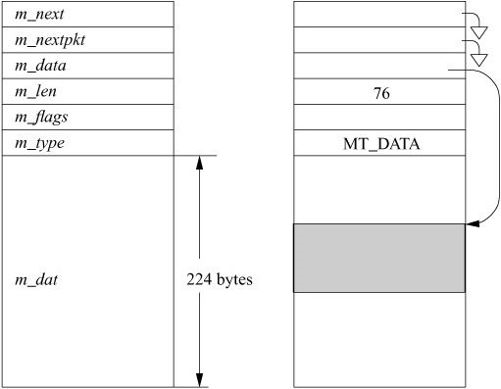

# 12.3 Memory Management

The requirements placed on a memory-management scheme by interprocess-communication and network protocols tend to be substantially different from those of other parts of the operating system. Although all require the efficient allocation and reclamation of memory, communication protocols in particular need memory in widely varying sizes. Memory is needed for variable-size structures such as communication protocol packets. Protocol implementations must frequently prepend headers or remove headers from packetized data. As packets are sent and received, buffered data may need to be divided into packets, and received packets may be combined into a single record. In addition, packets and other data objects must be queued when awaiting transmission or reception. A special-purpose memory-management facility exists for use by the interprocess-communication and networking systems to address these needs.

通过进程间通信和网络协议对存储器管理方案的要求往往与操作系统的其他部分的要求大不相同。 尽管所有这些都需要有效的分配和回收存储器，但是通信协议尤其需要具有各种尺寸的存储器。 对于诸如通信协议分组的可变大小结构，需要存储器。 协议实现必须经常添加标头或从分组数据中删除标头。 当发送和接收分组时，可能需要将缓冲的数据分成分组，并且可以将接收的分组组合成单个记录。 此外，在等待传输或接收时，数据包和其他数据对象必须排队。 存在专用存储器管理工具，供进程间通信和网络系统使用以满足这些需求。

## Mbufs

The memory-management facilities revolve around a data structure called an mbuf (see Figure 12.3). Mbufs, or memory buffers, vary in size depending on what they contain. All mbufs contain a fixed m_hdr structure that keeps track of various bits of bookkeeping about the mbuf. An mbuf that contains only data has space for 224 bytes (256 bytes total for the mbuf minus 32 bytes for the mbuf header). All structure sizes are calculated for 64-bit processors.

内存管理工具围绕一个名为 `mbuf` 的数据结构（参见图12.3）。 `Mbufs` 或内存缓冲区的大小取决于它们包含的内容。 所有 `mbuf` 都包含一个固定的 `m_hdr` 结构，可以跟踪有关 `mbuf` 的各种簿记。仅包含数据的 `mbuf` 具有224字节的空间（`mbuf`总共256字节减去`mbuf`头部的32字节）。 所有结构大小都是针对64位处理器计算的。

**Figure 12.3** Memory-buffer (mbuf) data structure.

For large messages, the system can associate larger sections of data with an mbuf by referencing an external mbuf cluster from a private virtual memory area. The size of an mbuf cluster may vary by architecture, as specified by the macro MCLBYTES, and is 2 Kbyte on the X86.

对于大型消息，系统可以通过从私有虚拟内存区域引用外部 `mbuf集群`，将较大的数据部分与`mbuf`相关联。`mbuf集群`的大小可能因宏`MCLBYTES`指定的体系结构而异，X86上的格式为 2KB。

Data are stored either in the internal data area or in an external cluster, but never in both. To access data in either location, a data pointer within the mbuf is used. In addition to the data-pointer field, a length field is also maintained. The length field shows the number of bytes of valid data to be found at the data-pointer location. The data and length fields allow routines to trim data efficiently at the start or end of an mbuf. In deletion of data at the start of an mbuf, the pointer is incremented and the length is decremented. To delete data from the end of an mbuf, the length is decremented, but the data pointer is left unchanged. When space is available within an mbuf, data can be added at either end. This flexibility to add and delete space without copying is particularly useful in communication-protocol implementation. Protocols routinely strip protocol information off the front or back of a message before the message’s contents are handed to a higher-layer processing module, or they add protocol information as a message is passed to lower layers.

数据存储在内部数据区域或外部群集中，但不会即在内部数据区中同时也在外部集群中。要访问任一位置的数据，请使用`mbuf`中的数据指针。除了数据指针字段之外，还保持长度字段。长度字段显示在数据指针位置找到的有效数据的字节数。数据和长度字段允许例程在`mbuf`的开头或结尾有效地修剪数据。在删除`mbuf`开头的数据时，指针递增并且长度递减。要从`mbuf`的末尾删除数据，长度会减少，但数据指针保持不变。当`mbuf`中有空间时，可以在任一端添加数据。这种在不复制的情况下添加和删除空间的灵活性在通信协议实现中特别有用。协议通常在消息的内容被传递给更高层处理模块之前从消息的前面或后面剥离协议信息，或者当消息传递到较低层时它们添加协议信息。

Multiple mbufs can be linked together to hold an arbitrary quantity of data. This linkage is done with the `m_next` field of the `mbuf`. By convention, a chain of mbufs linked through the `m_next` field is treated as a single object. For example, the communication protocols build packets from chains of mbufs. A second field, `m_nextpkt`, links objects built from chains of mbufs into lists of objects. Throughout our discussions, a collection of mbufs linked together with the `m_next` field will be called a chain; chains of mbufs linked together with the `m_nextpkt` field will be called a queue.

可以将多个`mbuf` 链接在一起以容纳任意数量的数据。这种联系是通过`mbuf`的`m_next`字段完成的。按照惯例，通过`m_next`字段链接的 `mbuf` 链被视为单个对象。例如，通信协议从`mbuf` 链构建数据包。第二个字段 `m_nextpkt` 将由`mbuf`链构建的对象链接到对象列表中。在我们的讨论过程中，与`m_next`字段链接在一起的`mbuf`集合将被称为链; 与`m_nextpkt`字段链接在一起的`mbuf`链将被称为队列。

Each mbuf is typed according to its use. This type serves two purposes. The only operational use of the type is to distinguish optional components of a message in an mbuf chain that is queued for reception on a socket data queue. Otherwise, the type information is used in maintaining statistics about storage use and, if there are problems, as an aid in tracking mbufs.

每个 `mbuf` 都根据其用途进行输入。这种类型有两个目的。该类型的唯一操作用途是区分排队等待在套接字数据队列上接收的 `mbuf链` 中的消息的可选组件。否则，类型信息用于维护有关存储使用的统计信息，如果存在问题，则用于跟踪`mbuf`。

The mbuf flags are logically divided into two sets: flags that describe the usage of an individual mbuf and those that describe an object stored in an mbuf chain. The flags describing an mbuf specify whether the mbuf references external storage (`M_EXT`), whether the mbuf contains a set of packet header fields (`M_PKTHDR`), and whether the mbuf completes a record (`M_EOR`). A packet normally would be stored in an mbuf chain (of one or more mbufs) with the `M_PKTHDR` flag set on the first mbuf of the chain. The mbuf flags describing the packet would be set in the first mbuf and could include either the broadcast flag (`M_BCAST`) or the multicast flag (`M_MCAST`). The latter flags specify that a transmitted packet should be sent as a broadcast or multicast, respectively, or that a received packet was sent in that manner.

`mbuf` 标志在逻辑上分为两组：描述**单个 `mbuf`** 的使用的标志和描述存储在 **`mbuf链`** 中的对象的标志。描述`mbuf`的标志指定`mbuf`是否引用外部存储（`M_EXT`），`mbuf`是否包含一组包头字段（`M_PKTHDR`），以及mbuf是否完成记录（`M_EOR`）。数据包通常存储在`mbuf链`（一个或多个`mbuf`）中，并在链的第一个`mbuf`上设置`M_PKTHDR`标志。 描述数据包的`mbuf`标志将在第一个`mbuf`中设置，并且可以包括广播标志（`M_BCAST`）或多播标志（`M_MCAST`）。后面的标志指定发送的分组应该分别作为广播或多播发送，或者以这种方式发送接收的分组。

If the `M_PKTHDR` flag is set on an `mbuf`, the `mbuf` has a second set of header fields immediately following the standard header. This addition causes the `mbuf` data area to shrink from 224 bytes to 168 bytes. The packet header shown in *Table 12.3* is only used on the first `mbuf` of a chain. It includes several fields: a pointer to the interface on which the packet was received, the total length of the packet, a field relating to packet checksum calculation, and a pointer to a list of arbitrary tags.

如果在`mbuf`上设置`M_PKTHDR`标志，则`mbuf`在标准标题之后紧跟第二组标题字段。这种添加导致`mbuf`数据区从224 字节缩小到 168 字节。 *表12.3* 中所示的包头仅用于链的第一个`mbuf`。 它包括几个字段：指向接收数据包的接口的指针，数据包的总长度，与数据包校验和计算有关的字段，以及指向任意标记列表的指针。

| Field       | Description                                                             |
|-------------|-------------------------------------------------------------------------|
|`rcvif`      | interface mbuf was received from                                        |
|`tags`       | list of tags fom use by various networking subsystems                   |
|`len`        | total packet length                                                     |
|`flowid`     | packet ID: 4-tuple of source an destination network addresses and ports |
|`csum_flags` | checksum and offload features                                           |
|`fibnum`     | forwarding information base to use                                      |
|`rsstype`    | receive-side steering hash to steer packet to a queue                   |
|`ether_vtag` | ethernet VLAN tag                                                       |
|`tso_segsz`  | TCP segmentation offload segment size                                   |
|`csum_data`  | packet checksum data                                                    |

**Table 12.3** Important fields in (`mbuf`) data structure with `M_PKTHDR`.

An mbuf that uses external storage is marked with the `M_EXT` flag. Here, a different header area overlays the internal data area of an `mbuf`. The fields in this header, which is shown in *Figure 12.4*, describe the external storage, including the start of the buffer and its size. One field is designated to point to a routine to free the buffer, in theory allowing various types of buffers to be mapped by mbufs. In the current implementation, the free function is not used and the external storage is assumed to be a standard mbuf cluster. An mbuf may be both a packet header and have external storage. Here, the standard mbuf header is followed by the packet header and then the external storage header.

使用外部存储的mbuf标有`M_EXT`标志。这里，不同的标题区域覆盖了`mbuf`的内部数据区域。此标头中的字段（如图12.4 所示）描述了外部存储，包括缓冲区的开始及其大小。指定一个字段指向释放缓冲区的例程，理论上允许`mbuf`映射各种类型的缓冲区。在当前实现中，不使用自由功能，并且假设外部存储是标准的`mbuf集群`。 `mbuf`既可以是包头，也可以是外部存储器。这里，标准的`mbuf`头后面是数据包头，然后是外部存储头。

**Figure 12.4** Memory-buffer (mbuf) data structure with external storage.

The ability to refer to mbuf clusters from an mbuf permits data to be referenced by different entities within the network code without a memory-to-memory copy operation. When multiple copies of a block of data are required, the same mbuf cluster is referenced from multiple mbufs. Since the mbuf headers are transient, the reference count for the clusters cannot be stored in the m_ext structure. Instead, the reference counts for clusters are managed as a separate array referenced from the mbufs that are sharing mbuf clusters. The array is large enough for every mbuf cluster that could be allocated by the system. The memory dedicated to mbufs and clusters is set based on the kernel parameter maxusers, which is itself based on the amount of physical memory in the system. Basing the amount of memory dedicated to the networking subsystem on the amount of physical memory gives a good default value but can be increased when a system is dedicated to networking tasks such as a Web server, firewall, or router.

从mbuf引用mbuf集群的能力允许数据由网络代码内的不同实体引用，而无需内存到内存的复制操作。当需要多个数据块副本时，从多个mbuf引用相同的mbuf集群。由于mbuf头是瞬态的，因此簇的引用计数不能存储在m_ext结构中。相反，集群的引用计数作为从共享mbuf集群的mbuf引用的单独数组进行管理。该阵列足够大，可用于系统可以分配的每个mbuf集群。专用于mbuf和集群的内存是基于内核参数maxusers设置的，maxusers本身基于系统中的物理内存量。基于物理内存量的专用于网络子系统的内存量可以提供良好的默认值，但是当系统专用于网络任务（如Web服务器，防火墙或路由器）时可以增加该值。

Mbufs have fixed-size, rather than variable-size, data areas for several reasons. First, the fixed size minimizes memory fragmentation. Second, communication protocols are frequently required to prepend or append headers to existing data areas, to split data areas, or to trim data from the beginning or end of a data area. The mbuf facilities are designed to handle such changes without reallocation or copying whenever possible.

由于多种原因，Mbuf具有固定大小而非可变大小的数据区域。首先，固定大小可以最大限度地减少内存碎片。其次，经常需要通信协议来将标头前置或附加到现有数据区域，分割数据区域，或者从数据区域的开头或末尾修剪数据。mbuf工具旨在处理此类更改，而无需重新分配或复制。

Since the mbuf is the central object of all the networking subsystems, it has undergone changes with each large change in the code. It now contains a flags field and two optional sets of header fields. The data pointer replaces a field used as an offset in the initial version of the mbuf. The use of an offset was not portable when the data referenced could be in an mbuf cluster. The addition of a flags field allowed the use of a flag indicating external storage. Earlier versions tested the magnitude of the offset to see whether the data were in the internal mbuf data area. The addition of the broadcast flag allowed network-level protocols to know whether packets were received as link-level broadcasts, as was required for standards conformance. Several other flags have been added for use by specific protocols and to handle fragment processing.

由于mbuf是所有网络子系统的核心对象，因此代码中的每次重大更改都会发生变化。它现在包含一个标志字段和两组可选的标题字段。数据指针替换在mbuf的初始版本中用作偏移的字段。当引用的数据可能位于mbuf集群中时，使用偏移量是不可移植的。添加标志字段允许使用指示外部存储的标志。早期版本测试了偏移的大小，以查看数据是否在内部mbuf数据区域。添加广播标志允许网络级协议知道数据包是否作为链路级广播被接收，这是标准一致性所要求的。添加了几个其他标志以供特定协议使用并处理片段处理。

The optional header fields have undergone the largest changes since 4.4BSD. The two headers were originally designed to avoid redundant calculations of the size of an object, to make it easier to identify the incoming network interface of a received packet, and to generalize the use of external storage by an mbuf. Since FreeBSD 5, the packet header has been expanded to include information on checksum calculation (a traditionally expensive operation that can now be done in hardware) as well as on the management of flows of packets, quality of service parameters, a receive-side scaling hash to steer packets to particular hardware queues, and an arbitrary set of tags.

可选的头字段经历了自4.4BSD以来的最大变化。这两个标头最初设计用于避免冗余计算对象的大小，以便更容易识别接收数据包的传入网络接口，并通过mbuf概括外部存储的使用。从FreeBSD 5开始，数据包标头已经扩展，包括校验和计算信息（传统上可以在硬件上完成的昂贵操作）以及数据包流量管理，服务质量参数，接收端扩展 hash 将数据包引导到特定的硬件队列，以及任意一组标签。

Tags are fixed-size structures that can point to arbitrary pieces of memory and are used to store information relevant to different modules within the networking subsystem. Each tag has a link to the next tag in the list, a 16-bit ID, a 16-bit length, and a 32-bit cookie and a module-defined type. The cookie identifies the module that owns the tag. The type is a piece of data that is private to the module that describes to the module the type of tag it is handling. Tags carry the information about a packet that should not be placed into the packet itself and they are often used as an extension mechanism for the networking subsystem. Instead of modifying the mbuf structures, and thereby losing binary compatibility between versions of FreeBSD, new networking modules can define their own tags as a way of communicating arbitrary out-of-band information between different components of the network stack. Examples of these tags are given in Section 13.7.

标签是固定大小的结构，可以指向任意内存，并用于存储与网络子系统内不同模块相关的信息。每个标记都有一个指向列表中下一个标记的链接，一个16位ID，一个16位长度，一个32位cookie和一个模块定义类型。cookie标识拥有标记的模块。类型是模块专用的一段数据，它向模块描述它正在处理的标记类型。标签包含有关不应放入数据包本身的数据包的信息，它们通常用作网络子系统的扩展机制。新的网络模块不是修改mbuf结构，从而失去FreeBSD版本之间的二进制兼容性，而是可以定义自己的标签，作为在网络堆栈的不同组件之间传递任意带外信息的方式。 这些标签的示例在第13.7节中给出。

## Storage-Management Algorithms

Providing the system with a network stack capable of multiprocessing required a complete rework of the memory-allocation algorithms underlying the mbuf code. Whereas previous versions of BSD allocated memory with the system allocator and then carved it up for mbufs and clusters, such a simple technique does not work when using multiple CPUs.

为系统提供能够进行多处理的网络堆栈需要对mbuf代码下面的内存分配算法进行完整的返工。以前版本的BSD使用系统分配器分配内存，然后将其划分为mbuf和集群，而这种简单的技术在使用多个CPU时不起作用。

As is described in detail in Section 6.3, FreeBSD allocates virtual memory among a series of lists for use by the network memory allocation code. Each CPU has its own private container of mbufs and clusters. There is also a single, general pool of mbufs and clusters from which allocations are attempted when a per-CPU list is empty or to which memory is freed when a per-CPU list is full. A uniprocessor system acts as if it is a multiprocessor system with one CPU, which means that it has one per-CPU list as well as the general one.

正如6.3节中详细描述的那样，FreeBSD在一系列列表中分配虚拟内存以供网络内存分配代码使用。每个CPU都有自己的mbuf和集群的私有容器。还有一个通用的mbuf和集群池，当每个CPU列表为空时，或者当每个CPU列表已满时释放内存时，将从中尝试分配。单处理器系统就好像它是一个带有一个CPU的多处理器系统，这意味着它有一个每CPU列表以及一个CPU列表。

Mbuf-allocation requests specify either that they must be fulfilled immediately or that they can wait for available resources. If a request is marked as “can wait” and the requested resources are unavailable, the process is put to sleep to await available resources. A nonblocking request will fail if no resources are available. Although a nonblocking allocation request is no longer necessary for code that executes at interrupt level, the networking code still operates assuming nonblocking is required. If mbuf allocation has reached its limit or memory is unavailable, the mbuf-allocation routines ask the network-protocol modules to give back any available resources that they can spare.

Mbuf分配请求指定必须立即满足它们或者它们可以等待可用资源。如果请求被标记为“可以等待”并且所请求的资源不可用，则进程将进入休眠状态以等待可用资源。如果没有可用资源，则非阻塞请求将失败。尽管对于在中断级别执行的代码不再需要非阻塞分配请求，但是网络代码仍然在假设需要非阻塞的情况下运行。如果mbuf分配已达到其限制或内存不可用，则mbuf分配例程要求网络协议模块返回它们可以节省的任何可用资源。

An mbuf-allocation request is made through a call to `m_get()`, `m_gethdr()`, or through an equivalent macro. An mbuf is retrieved from the currently running CPU’s per-CPU list by the `mb_alloc()` function and is initialized. For `m_gethdr()`, the mbuf is initialized with the optional packet header. The MCLGET macro adds an mbuf cluster to an mbuf.

`mbuf`分配请求是通过调用 `m_get()`，`m_gethdr()`或通过等效的宏来完成的。 通过 `mb_alloc()`函数从当前运行的 CPU 的每个 CPU 列表中检索 mbuf 并进行初始化。 于 `m_gethdr()`，使用可选的包头初始化mbuf。`MCLGET`宏将`mbuf`集群添加到`mbuf`。

Release of mbuf resources is straightforward: m_free() frees a single mbuf and m_freem() frees a chain of mbufs. When an mbuf that references an mbuf cluster is freed, the reference count for the cluster is decremented. Mbuf clusters are placed onto the currently running CPU’s per-CPU list when their reference counts reach zero.

释放`mbuf`资源非常简单：`m_free()` 释放单个`mbuf`，`m_freem()` 释放一串`mbuf`。 当释放引用`mbuf集群`的`mbuf`时，将减少集群的引用计数。当引用计数达到零时，Mbuf集群将被置于当前运行的CPU的每CPU列表中。

## Mbuf Utility Routines

Many useful utility routines exist for manipulating mbufs within the kernel networking subsystem. The m_copym() routine makes a copy of an mbuf chain starting at a logical offset, in bytes, from the start of the data. This routine may be used to copy all or only part of a chain of mbufs. If an mbuf is associated with an mbuf cluster, the copy will reference the same data by incrementing the reference count on the cluster. The m_copydata() function is similar, but it copies data from an mbuf chain into a caller-provided buffer. This buffer is not an mbuf, or chain, but an area of memory such as an I/O buffer elsewhere in the kernel.

存在许多有用的实用程序例程来操作内核网络子系统中的mbuf。 `m_copym()` 例程从数据的开头以逻辑偏移量（以字节为单位）生成mbuf链的副本。此例程可用于复制`mbuf`链的全部或仅一部分。如果mbuf与mbuf集群关联，则副本将通过增加集群上的引用计数来引用相同的数据。`m_copydata()` 函数类似，但它将数据从`mbuf链`复制到调用者提供的缓冲区中。此缓冲区不是mbuf或链，而是内存区域，例如内核中其他位置的 `I/O` 缓冲区。

The `m_adj()` routine adjusts the data in an mbuf chain by a specified number of bytes, removing data from either the front or back. No data are ever copied; `m_adj()` operates purely by manipulating the offset and length fields in the mbuf structures. The `mtod()` macro takes a pointer to an mbuf header and a data type, and returns a pointer to the data in the buffer, cast to the given type.

`m_adj()`例程将 `mbuf链` 中的数据调整指定的字节数，从前面或后面删除数据。没有数据被复制; `m_adj()`纯粹通过操纵`mbuf`结构中的偏移和长度字段来运行。`mtod()`宏接受一个指向 `mbuf` 头和数据类型的指针，并返回一个指向缓冲区中数据的指针，转换为给定类型。

The `m_pullup()` routine rearranges an mbuf chain such that a specified number of bytes reside in a contiguous data area within the mbuf (not in external storage). This operation is used so that objects such as protocol headers are contiguous and can be treated as normal data structures. If there is room, `m_pullup()` will increase the size of the contiguous region up to the maximum size of a protocol header in an attempt to avoid being called in the future.

`m_pullup()` 例程重新排列 `mbuf链`，使得指定数量的字节驻留在 `mbuf`（而不是外部存储器）中的连续数据区域中。使用此操作使得诸如协议头之类的对象是连续的并且可以被视为普通数据结构。如果有空间，`m_pullup()`会将连续区域的大小增加到协议头的最大大小，以避免将来被调用。

The `M_PREPEND()` macro adjusts an mbuf chain to prepend a specified number of bytes of data. If possible, space is made in place, but an additional mbuf may have to be allocated at the beginning of the chain. It is currently impossible to prepend data within an mbuf cluster because different mbufs might refer to data in different portions of the cluster.

`M_PREPEND()`宏调整`mbuf链`以预先指定数量的字节数据。如果可能，空间就位，但可能必须在链的开头分配额外的`mbuf`。目前不可能在 `mbuf 集群`中预先添加数据，因为不同的 `mbuf` 可能会引用集群不同部分的数据。
