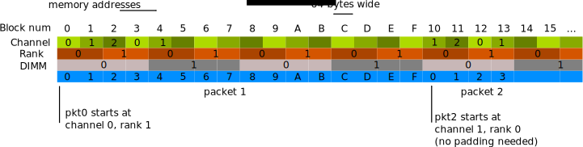

# DPDK Memeory physical

## EAL initialization parameters

```sh
-n CHANNELS         Number of memory channels
-r RANKS            Force number of memory ranks (don't detect)
```

Depending on hardware memory configuration, performance can be greatly improved by adding a specific padding between objects. The objective is to ensure that the beginning of each object starts on a different channel and rank in memory so that all channels are equally loaded.

根据硬件内存配置，通过在对象之间添加特定填充可以大大提高性能。目标是确保每个对象的起始位置存放在内存中不同的通道和阵列，以便所有通道均等加载。

This is particularly true for packet buffers when doing L3 forwarding or flow classification. Only the first 64 bytes are accessed, so performance can be increased by spreading the start addresses of objects among the different channels.

在进行L3转发或流分类时，对于数据包缓冲区尤其如此。只访问前64个字节，因此可以通过在不同通道之间扩展对象的起始地址来提高性能。

The number of ranks on any DIMM is the number of independent sets of DRAMs that can be accessed for the full data bit-width of the DIMM. The ranks cannot be accessed simultaneously since they share the same data path. The physical layout of the DRAM chips on the DIMM itself does not necessarily relate to the number of ranks.

任何DIMM上的阵列数是可以为DIMM的完整数据位宽访问的独立DRAM组的数量。由于它们共享相同的数据路径，因此无法同时访问这些阵列。DIMM 本身上DRAM 芯片的物理布局不一定与阵列数量有关。

When running an application, the EAL command line options provide the ability to add the number of memory channels and ranks.

运行应用程序时，EAL命令行选项提供添加内存通道数和阵列数量。


*Fig. 6.1 Two Channels and Quad-ranked DIMM Example*


*Fig. 6.2 Three Channels and Two Dual-ranked DIMM Example*

>*参考 [Programmer’s Guide : 6.3. Memory Alignment Constraints](https://doc.dpdk.org/guides/prog_guide/mempool_lib.html)*

## Physical structure of memory


*从概念的层次结构上面分为：Channel > DIMM > Rank > Chip > Bank > Row/Column*

>*参考[内存条物理结构分析](https://lzz5235.github.io/2015/04/21/memory.html)*


*DIMMs, ranks, banks, and arrays. A system has potentially many DIMMs, each of which may contain one or more ranks. Each rank is a set of ganged DRAM devices, each of which has potentially many banks. Each bank has potentially many constituent arrays,depending on the part’s data width.*

>*参考《Memory Systems: Cache, DRAM, Disk》 P.319*


*Super Micro X9DRL-3F/X9DRL-iF Quick Reference*


*Super Micro X9DRL-3F/X9DRL-iF System Block Diagram*


*Super Micro X9DRL-3F/X9DRL-iF Processors and their Corresponding Memory Modules*


*Super Micro X9DRL-3F/X9DRL-iF Processor and Memory Module Population*

>*参考 [Super Micro X9DRL-3F/X9DRL-iF Motherboard Manual](https://www.supermicro.org.cn/manuals/motherboard/C606_602/MNL-1298.pdf)*


*When creating a system with 384 GB of memory, each CPU has 12 slots, divided between 4 channels*

>参考 [frankdenneman.nl - Memory Deep Dive: Optimizing for Performance](https://frankdenneman.nl/2015/02/20/memory-deep-dive/)

## Linux view memory

### `dmidecode`

```sh
$ dmidecode -t memroy
```

### `sysfs : /sys/devices/system/edac/`

>参考 [The Linux kernel user’s and administrator’s guide : Reliability, Availability and Serviceability](https://www.kernel.org/doc/html/v4.10/admin-guide/ras.html)
