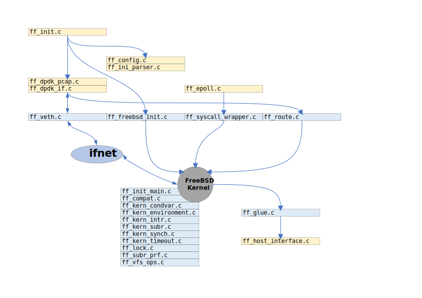

# F-Stack Code Analysis

FreeBSD 协议栈的用户态移植的演进是这样的：

```conf
+--------------+      +--------------+      +--------------+
|  libplebnet  |----->|  libuinet    |----->|  f-stack     |
+--------------+      +--------------+      +--------------+
```

| name |  |
|-:|-|
|[libplebnet](https://gitorious.org/freebsd/kmm-sandbox/commit/fa8a11970bc0ed092692736f175925766bebf6af?p=freebsd:kmm-sandbox.git;a=tree;f=lib/libplebnet;h=ae446dba0b4f8593b69b339ea667e12d5b709cfb;hb=refs/heads/work/svn_trunk_libplebnet) | 基于 FreeBSD 8.2 内核，[Download](http://freebsd.sin.openmirrors.asia/pub/FreeBSD/releases/i386/ISO-IMAGES/8.2/)
|[libuinet](https://github.com/pkelsey/libuinet) | 基于 FreeBSD 9.1-RELEASE 内核 [Download](http://freebsd.sin.openmirrors.asia/pub/FreeBSD/releases/i386/ISO-IMAGES/9.1/)
|[F-Stack](https://github.com/F-Stack/f-stack) | 基于 FreeBSD 11.0 内核 [Download](ftp://ftp14.freebsd.org/pub/FreeBSD/releases/ISO-IMAGES/11.0/)

代码的分析以 `F-Stack` 为主，`libuinet` 次之，然后再参考 `libplebnet`

通过后续的代码分析，发现，这三个里边 `libuinet` 的完成度是最高的，代码的结构比较合理，`f-stack` 的代码结构有些散，完成度并不是很高，有些代码还是直接从 `libuinet` 复制过来的，`libuinet` 是基于 FreeBSD 9.1 的内核实现的，替代的基础设施也是为这个版本的内核实现的，`f-stack` 直接拿过来用，会不会有问题。


## 代码结构

通过分析 `F-Stack/lib/Makefile` 代码分成两个部分，**Kernel** 和 **Host**：

|name    | notes                                                                  |
|-------:|------------------------------------------------------------------------|
|Kernel  | 指的是 FreeBSD Kernel，它的代码包含了部分 FreeBSD 内核代码和 必要的替代代码|
|Host    | 主要是运行期 FreeBSD Kernel 的一些支持文件，包括调用接口，回调接口，配置等等 |




| file | notes |
|-----:|-------|
|`ff_freebsd_init.c` |提供了初始化FreeBSD内核的调用接口，它会初始化内核的一些参数，启动必要的内核模块。
|`ff_veth.c` |提供了网络虚拟设备的创建，配置，使用的接口，数据包的输入和输出都是通过这些接口实现，这个也是f-stack最重要的一个接口文件。
|`ff_route.c` |提供了路由表操作的调用函数
`ff_glue.c` |提供了用户态内核调用宿主OS基础设施的用户态内核侧的一个粘合层，这里的基础设施一般为内存管理。
|`ff_host_interface.c` |用户态内核调用宿主OS基础设施的宿主OS侧的一个粘合层。
|`ff_syscall_wrapper.c` |用户态内核所提供自身系统调用的一个包装层。

## 代码编译

代码编译分为两个部分，Kernel 部分和 Host 部分：

kernel 部分的编译

```make
${ASM_OBJS}: %.o: %.S ${IMACROS_FILE}
    ${NORMAL_S}

${OBJS}: %.o: %.c ${IMACROS_FILE}
    ${NORMAL_C}
```

Host 部分的编译

```make
${HOST_OBJS}: %.o: %.c
    ${HOST_C}
```

链接也分为两个部分

Kernel 部分

```make
#
# The library is built by first incrementally linking all the object
# to resolve internal references.  Then, all symbols are made local.
# Then, only the symbols that are part of the  API are made
# externally available.
#
libfstack.a: machine_includes ff_api.symlist MHEADERS{MSRCS} HOSTOBJS{ASM_OBJS} ${OBJS}
    ${LD} -d -r -o $*.ro ${ASM_OBJS} ${OBJS}
    nm $*.ro  | grep -v ' U ' | cut -d ' ' -f 3 > $*_localize_list.tmp
    objcopy --localize-symbols=$*_localize_list.tmp $*.ro 
    rm $*_localize_list.tmp
    objcopy --globalize-symbols=ff_api.symlist $*.ro
    rm -f $@
```

Host 部分

```make
    ar -cqs $@ $*.ro ${HOST_OBJS}
    rm -f $*.ro
```
