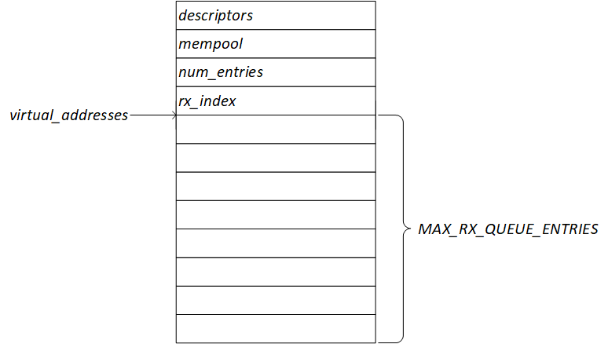
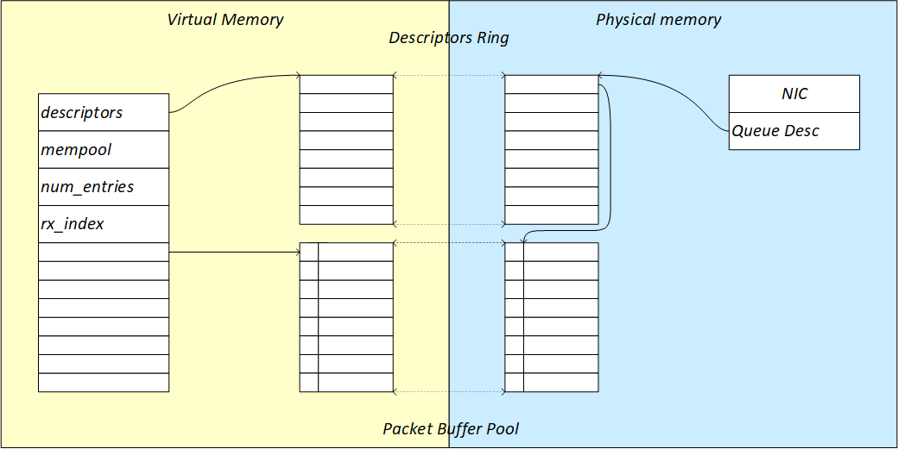
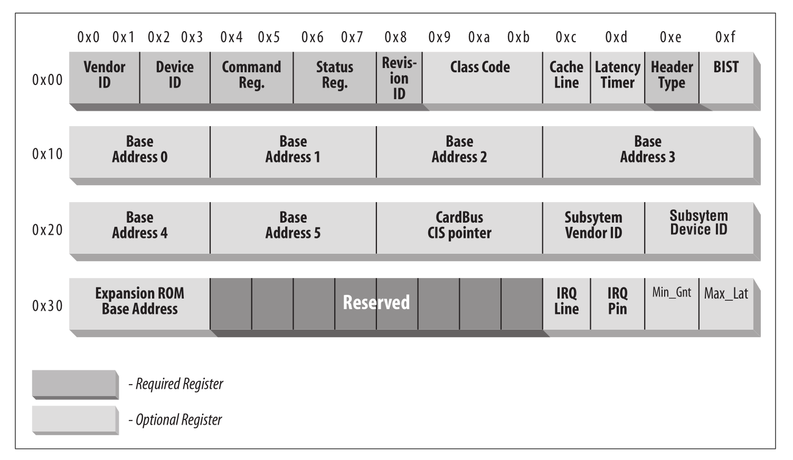

# IXY 代码的阅读笔记

从 ixy 的实例 ixy-fwd  作为起点来阅读代码

```c
int main(int argc, char* argv[]) {
    if (argc != 3) {
        printf("%s forwards packets between two ports.\n", argv[0]);
        printf("Usage: %s <pci bus id2> <pci bus id1>\n", argv[0]);
        return 1;
    }

    struct ixy_device* dev1 = ixy_init(argv[1], 1, 1);
    struct ixy_device* dev2 = ixy_init(argv[2], 1, 1);

    uint64_t last_stats_printed = monotonic_time();
    struct device_stats stats1, stats1_old;
    struct device_stats stats2, stats2_old;
    stats_init(&stats1, dev1);
    stats_init(&stats1_old, dev1);
    stats_init(&stats2, dev2);
    stats_init(&stats2_old, dev2);

    uint64_t counter = 0;
    while (true) {
        forward(dev1, 0, dev2, 0);
        forward(dev2, 0, dev1, 0);

        // don't poll the time unnecessarily
        if ((counter++ & 0xFFF) == 0) {
            uint64_t time = monotonic_time();
            if (time - last_stats_printed > 1000 * 1000 * 1000) {
                // every second
                ixy_read_stats(dev1, &stats1);
                print_stats_diff(&stats1, &stats1_old, time - last_stats_printed);
                stats1_old = stats1;
                if (dev1 != dev2) {
                    ixy_read_stats(dev2, &stats2);
                    print_stats_diff(&stats2, &stats2_old, time - last_stats_printed);
                    stats2_old = stats2;
                }
                last_stats_printed = time;
            }
        }
    }
}
```

## 1 创建并初始化 `ixy` 设备对象

程序的第一步根据总线地址，创建并初始化 `ixy` 设备对象：

```c
    /* 根据总线地址 为两个端口创建 ixy 设备对象 */
    struct ixy_device* dev1 = ixy_init(argv[1], 1, 1);
    struct ixy_device* dev2 = ixy_init(argv[2], 1, 1);
```

创建并初始化 `ixy` 设备对象，调用 `ixy_init` 函数：

```c
struct ixy_device* ixy_init(const char* pci_addr, uint16_t rx_queues, uint16_t tx_queues) {
    // Read PCI configuration space
    // 读取 PCI 设备的配置空间
    int config = pci_open_resource(pci_addr, "config");
    uint16_t vendor_id = read_io16(config, 0);      // 厂商 ID
    uint16_t device_id = read_io16(config, 2);      // 设备 ID
    uint32_t class_id = read_io32(config, 8) >> 24; // 分组信息
    close(config);
    if (class_id != 2) {
        // 如果不是网络设备，则返回错误
        error("Device %s is not a NIC", pci_addr);
    }
    if (vendor_id == 0x1af4 && device_id >= 0x1000) {
        return virtio_init(pci_addr, rx_queues, tx_queues);
    } else {
        // Our best guess is to try ixgbe
        return ixgbe_init(pci_addr, rx_queues, tx_queues);
    }
}
```

### 1.1 打开 `PCIe` 设备的配置空间

初始化设备的第一步，就是要获得 `PCIe` 设备的配置空间，通过函数 `pci_open_resource` 获取 `PCIe` 配置空间映射到 `sysfs` 文件系统的文件描述符：

```c
int config = pci_open_resource(pci_addr, "config");
```

> 详细介绍请参考 3.1

在读取完 `PCIe` 配置后，应关闭此文件。

### 1.2 读取设备识别信息

```c
    uint16_t vendor_id = read_io16(config, 0);
    uint16_t device_id = read_io16(config, 2);
    uint32_t class_id = read_io32(config, 8) >> 24;
```

这里读取了三个配置信息三个变量 `vendor_id` 厂商ID，`device_id` 设备ID，`class_id` 类别的高 8 位（也就是分组信息）。

这里分组信息必须为 2 也就是 `network` 类：

```c
    if (class_id != 2) {
        error("Device %s is not a NIC", pci_addr);
    }
```

对于分组信息 也就是 class_id 的高 8 位信息的含义，需要参考 linux 内核代码 `include/linux/pci_ids.h` ，此处节选网络设备相关定义：

```c
#define PCI_BASE_CLASS_NETWORK          0x02
#define PCI_CLASS_NETWORK_ETHERNET      0x0200
#define PCI_CLASS_NETWORK_TOKEN_RING    0x0201
#define PCI_CLASS_NETWORK_FDDI          0x0202
#define PCI_CLASS_NETWORK_ATM           0x0203
#define PCI_CLASS_NETWORK_OTHER         0x0280
```

然后根据厂商 ID 和 设备 ID选择合适的驱动接口初始化：

```c
    if (vendor_id == 0x1af4 && device_id >= 0x1000) {
        return virtio_init(pci_addr, rx_queues, tx_queues);
    } else {
        // Our best guess is to try ixgbe
        return ixgbe_init(pci_addr, rx_queues, tx_queues);
    }
```

> **厂商ID** 和 **设备ID** 的类型，需要参考 《[Intel ® 82599 10 GbE Controller Datasheet](https://www.intel.com/content/dam/www/public/us/en/documents/datasheets/82599-10-gbe-controller-datasheet.pdf)》 和 《[Intel ®  82599 10 GbE Controller Specification Update](https://www.intel.com/content/dam/www/public/us/en/documents/specification-updates/82599-10-gbe-controller-spec-update.pdf)》，在规格说明中 `0x10fb` 的设备类型为 `82599 (SFI/SFP+)`

### 1.3 创建并初始化 `ixgbe` 设备

在厂商ID 为 `0x8086` 、设备ID 为万兆网卡的设备ID 如，`Intel 82599ES (SFI/SFP+)` 的设备ID为 `0x10fb`，就会调用 `ixgbe_init`：

```c
struct ixy_device* ixgbe_init(const char* pci_addr, uint16_t rx_queues, uint16_t tx_queues) {
    if (getuid()) {
        warn("Not running as root, this will probably fail");
    }
    if (rx_queues > MAX_QUEUES) {
        error("cannot configure %d rx queues: limit is %d", rx_queues, MAX_QUEUES);
    }
    if (tx_queues > MAX_QUEUES) {
        error("cannot configure %d tx queues: limit is %d", tx_queues, MAX_QUEUES);
    }
    struct ixgbe_device* dev = (struct ixgbe_device*) malloc(sizeof(struct  ixgbe_device));
    dev->ixy.pci_addr = strdup(pci_addr);
    dev->ixy.driver_name = driver_name;
    dev->ixy.num_rx_queues = rx_queues;
    dev->ixy.num_tx_queues = tx_queues;
    dev->ixy.rx_batch = ixgbe_rx_batch;
    dev->ixy.tx_batch = ixgbe_tx_batch;
    dev->ixy.read_stats = ixgbe_read_stats;
    dev->ixy.set_promisc = ixgbe_set_promisc;
    dev->ixy.get_link_speed = ixgbe_get_link_speed;
    dev->addr = pci_map_resource(pci_addr);
    dev->rx_queues = calloc(rx_queues, sizeof(struct ixgbe_rx_queue) + sizeof(void*) * MAX_RX_QUEUE_ENTRIES);
    dev->tx_queues = calloc(tx_queues, sizeof(struct ixgbe_tx_queue) + sizeof(void*) * MAX_TX_QUEUE_ENTRIES);
    reset_and_init(dev);
    return &dev->ixy;
}
```

#### 1.3.1 ixgbe 设备对象结构

`ixgbe.h`  中定义了 `ixgbe` 设备的结构 `struct ixgbe_device` ：

```c
struct ixgbe_device {
    struct ixy_device ixy;
    uint8_t* addr;
    void* rx_queues;
    void* tx_queues;
};
```

* `ixy` 为内嵌的 `ixy` 设备对象，可以利用 `offset` 反查 `ixgbe` 设备对象
* `addr` 指针指向 `PCIe` 设备的资源空间
* `rx_queues` 指向接收队列
* `tx_queues` 指向发送队列

`device.h` 定义了 `ixy` 设备的通用结构 `struct ixy_device`, 其中保存了设备的通用信息和接口 ：

```c
struct ixy_device {
    const char* pci_addr;
    const char* driver_name;
    uint16_t num_rx_queues;
    uint16_t num_tx_queues;
    uint32_t (*rx_batch) (struct ixy_device* dev, uint16_t queue_id, struct pkt_buf* bufs[], uint32_t num_bufs);
    uint32_t (*tx_batch) (struct ixy_device* dev, uint16_t queue_id, struct pkt_buf* bufs[], uint32_t num_bufs);
    void (*read_stats) (struct ixy_device* dev, struct device_stats* stats);
    void (*set_promisc) (struct ixy_device* dev, bool enabled);
    uint32_t (*get_link_speed) (const struct ixy_device* dev);
};
```

#### 1.3.2 映射 `BAR0` 的 `resource` 空间

ixgbe设备通过 `pci_map_resource` 将 `PCIe BAR0` 对应的 `resource` 地址空间映射到 `ixy` 应用的地址空间，并由 `struct ixgbe_device` 设备结构中的 `addr` 成员变量指向这个地址空间，这个地址空间包括了网卡设备的所有统计和配置寄存器的映射。

```c
dev->addr = pci_map_resource(pci_addr);
```

> 此函数的详细介绍请参考 3.3

以后 ixgbe 设备的操作都需要通过读写这个内存区域来实现。

参考 《[Intel ® 82599 10 GbE Controller Datasheet](https://www.intel.com/content/dam/www/public/us/en/documents/datasheets/82599-10-gbe-controller-datasheet.pdf)》 *table 8-1 the 82599 Address Regions*

#### 1.3.3 申请接收和发送队列

初始化完毕相应接口后，ixgbe_init 需要申请 接收和发送 队列：

```c
    dev->rx_queues = calloc(rx_queues, sizeof(struct ixgbe_rx_queue) + sizeof(void*) * MAX_RX_QUEUE_ENTRIES);
    dev->tx_queues = calloc(tx_queues, sizeof(struct ixgbe_tx_queue) + sizeof(void*) * MAX_TX_QUEUE_ENTRIES);
```

#### 1.3.4 重置并初始化设备

最后 `ixgbe_init` 调用 `reset_and_init` 重置并重新初始化设备：

```c
// see section 4.6.3
static void reset_and_init(struct ixgbe_device* dev) {
    info("Resetting device %s", dev->ixy.pci_addr);
    // section 4.6.3.1 - disable all interrupts
    // section 4.6.3.1 - 禁用所有中断
    set_reg32(dev->addr, IXGBE_EIMC, 0x7FFFFFFF);

    // section 4.6.3.2 - Global Reset and General Configuration
    // section 4.6.3.2 - 全局重置
    //                   Global Reset = software reset + link reset.
    //                   并等待重置完成
    set_reg32(dev->addr, IXGBE_CTRL, IXGBE_CTRL_RST_MASK);
    wait_clear_reg32(dev->addr, IXGBE_CTRL, IXGBE_CTRL_RST_MASK);
    usleep(10000);

    // section 4.6.3.1 - disable interrupts again after reset
    // section 4.6.3.1 - 在重置后重新禁用中断
    set_reg32(dev->addr, IXGBE_EIMC, 0x7FFFFFFF);

    info("Initializing device %s", dev->ixy.pci_addr);

    // section 4.6.3 - Wait for EEPROM auto read completion
    // section 4.6.3 - 等待EEPROM自动读取完成
    wait_set_reg32(dev->addr, IXGBE_EEC, IXGBE_EEC_ARD);

    // section 4.6.3 - Wait for DMA initialization done (RDRXCTL.DMAIDONE)
    // section 4.6.3 - 等待 DMA 初始化完成 (RDRXCTL.DMAIDONE)
    wait_set_reg32(dev->addr, IXGBE_RDRXCTL, IXGBE_RDRXCTL_DMAIDONE);

    // section 4.6.4 - initialize link (auto negotiation)
    init_link(dev);

    // section 4.6.5 - statistical counters
    // reset-on-read registers, just read them once
    // section 4.6.5 - 统计计数器
    // 读取复位寄存器，只需读取一次
    ixgbe_read_stats(&dev->ixy, NULL);

    // section 4.6.7 - init rx
    init_rx(dev);

    // section 4.6.8 - init tx
    init_tx(dev);

    // enables queues after initializing everything
    for (uint16_t i = 0; i < dev->ixy.num_rx_queues; i++) {
        start_rx_queue(dev, i);
    }
    for (uint16_t i = 0; i < dev->ixy.num_tx_queues; i++) {
        start_tx_queue(dev, i);
    }

    // skip last step from 4.6.3 - don't want interrupts
    // finally, enable promisc mode by default, it makes testing less annoying
    ixgbe_set_promisc(&dev->ixy, true);

    // wait for some time for the link to come up
    wait_for_link(dev);
}
```

1. 禁用中断
2. 发出全局重置并执行常规配置，并等待完成
3. 重新禁用中断
4. 等待EEPROM自动读取完成。
5. 等待DMA初始化完成
6. 设置 PHY 和 链路层
7. 初始化所有统计计数器
8. 初始化接收
9. 初始化发送
10. 设置混杂模式
11. 等待链路层启动

接收和发送的初始化放到后边分析

##### 1.3.4.1 禁用中断，重置，再禁用中断

```c
    info("Resetting device %s", dev->ixy.pci_addr);
    // section 4.6.3.1 - disable all interrupts
    // section 4.6.3.1 - 禁用所有中断
    set_reg32(dev->addr, IXGBE_EIMC, 0x7FFFFFFF);

    // section 4.6.3.2 - Global Reset and General Configuration
    // section 4.6.3.2 - 全局重置
    //                   Global Reset = software reset + link reset.
    //                   并等待重置完成
    set_reg32(dev->addr, IXGBE_CTRL, IXGBE_CTRL_RST_MASK);
    wait_clear_reg32(dev->addr, IXGBE_CTRL, IXGBE_CTRL_RST_MASK);
    usleep(10000);

    // section 4.6.3.1 - disable interrupts again after reset
    // section 4.6.3.1 - 在重置后重新禁用中断
    set_reg32(dev->addr, IXGBE_EIMC, 0x7FFFFFFF);

    info("Initializing device %s", dev->ixy.pci_addr);
```

大多数驱动程序在初始化期间禁用中断以防止重新进入，通过写入EIMC寄存器禁用中断。然后进行软件复位，软件复位将设备置于已知状态并使设备驱动程序能够继续初始化序列。在全局复位之后，软件驱动程序应至少等待10毫秒以启用平滑的初始化流程。然后再通过写入EIMC寄存器禁用中断。

##### 1.3.4.2 设置 PHY 和 链路层

```c
// see section 4.6.4
static void init_link(struct ixgbe_device* dev) {
    // should already be set by the eeprom config, maybe we shouldn't override it here to support weirdo nics?
    set_reg32(dev->addr, IXGBE_AUTOC, (get_reg32(dev->addr, IXGBE_AUTOC) & ~IXGBE_AUTOC_LMS_MASK) | IXGBE_AUTOC_LMS_10G_SERIAL);
    set_reg32(dev->addr, IXGBE_AUTOC, (get_reg32(dev->addr, IXGBE_AUTOC) & ~IXGBE_AUTOC_10G_PMA_PMD_MASK) | IXGBE_AUTOC_10G_XAUI);
    // negotiate link
    set_flags32(dev->addr, IXGBE_AUTOC, IXGBE_AUTOC_AN_RESTART);
    // datasheet wants us to wait for the link here, but we can continue and wait afterwards
}
```

* `AUTOC` - Auto Negotiation Control Register - 自动协商控制寄存器
* `LMS` - Link Mode Select - 链路层模式选择
    * `011b` = `10 GbE` serial link (`SFI` – no backplane auto-negotiation).
* `10G_PMA_PMD_PARALLEL`
    * `00b = XAUI PMA/PMD`
* `XAUI` - `10 Gb/s Ethernet/802.3ae`

##### 1.3.4.3 初始化所有统计计数器

```c
// read stat counters and accumulate in stats
// stats may be NULL to just reset the counters
void ixgbe_read_stats(struct ixy_device* ixy, struct device_stats* stats) {
    struct ixgbe_device* dev = IXY_TO_IXGBE(ixy);
    uint32_t rx_pkts = get_reg32(dev->addr, IXGBE_GPRC);
    uint32_t tx_pkts = get_reg32(dev->addr, IXGBE_GPTC);
    uint64_t rx_bytes = get_reg32(dev->addr, IXGBE_GORCL) + (((uint64_t) get_reg32(dev->addr, IXGBE_GORCH)) << 32);
    uint64_t tx_bytes = get_reg32(dev->addr, IXGBE_GOTCL) + (((uint64_t) get_reg32(dev->addr, IXGBE_GOTCH)) << 32);
    if (stats) {
        stats->rx_pkts += rx_pkts;
        stats->tx_pkts += tx_pkts;
        stats->rx_bytes += rx_bytes;
        stats->tx_bytes += tx_bytes;
    }
}
```

##### 1.3.4.4 设置混杂模式

```c
void ixgbe_set_promisc(struct ixy_device* ixy, bool enabled) {
    struct ixgbe_device* dev = IXY_TO_IXGBE(ixy);
    if (enabled) {
        info("enabling promisc mode");
        set_flags32(dev->addr, IXGBE_FCTRL, IXGBE_FCTRL_MPE | IXGBE_FCTRL_UPE);
    } else {
        info("disabling promisc mode");
        clear_flags32(dev->addr, IXGBE_FCTRL, IXGBE_FCTRL_MPE | IXGBE_FCTRL_UPE);
    }
}
```

##### 1.3.4.5 等待链路层协商完成

```c
static void wait_for_link(const struct ixgbe_device* dev) {
    info("Waiting for link...");
    int32_t max_wait = 10000000; // 10 seconds in us
    uint32_t poll_interval = 100000; // 10 ms in us
    uint32_t speed;
    while (!(speed = ixgbe_get_link_speed(&dev->ixy)) && max_wait > 0) {
        usleep(poll_interval);
        max_wait -= poll_interval;
    }
    info("Link speed is %d Mbit/s", ixgbe_get_link_speed(&dev->ixy));
}
```

```c
uint32_t ixgbe_get_link_speed(const struct ixy_device* ixy) {
    struct ixgbe_device* dev = IXY_TO_IXGBE(ixy);
    uint32_t links = get_reg32(dev->addr, IXGBE_LINKS);
    if (!(links & IXGBE_LINKS_UP)) {
        return 0;
    }
    switch (links & IXGBE_LINKS_SPEED_82599) {
        case IXGBE_LINKS_SPEED_100_82599:
            return 100;
        case IXGBE_LINKS_SPEED_1G_82599:
            return 1000;
        case IXGBE_LINKS_SPEED_10G_82599:
            return 10000;
        default:
            return 0;
    }
}
```

## 2 从 `ixy` 设备接收数据

首先需要说明的是接收数据的初始化，初始化流程在初始化 `ixy` 设备对象中完成。

### 2.1 初始化接收

这里把初始化 `ixy` 设备对象中的分散的代码重新组合，用来说明接收队列初始化的过程：

```c
    dev->rx_queues = calloc(rx_queues, sizeof(struct ixgbe_rx_queue) + sizeof(void*) * MAX_RX_QUEUE_ENTRIES);

    // section 4.6.7 - init rx
    init_rx(dev);

    // enables queues after initializing everything
    for (uint16_t i = 0; i < dev->ixy.num_rx_queues; i++) {
        start_rx_queue(dev, i);
    }
```

1. 申请设备接收队列的对象
2. 初始化设备接收队列
3. 启动设备接收队列

#### 2.1.1 申请设备接收队列的对象

```c
dev->rx_queues = calloc(rx_queues, sizeof(struct ixgbe_rx_queue) + sizeof(void*) * MAX_RX_QUEUE_ENTRIES);
```

* `rx_queues` 为申请队列的个数，82599 最多可以申请 128 个队列
* `MAX_RX_QUEUE_ENTRIES` 单个队列中的元素的上限值

`ixgbe` 设备接收队列的结构

```c
// allocated for each rx queue, keeps state for the receive function
struct ixgbe_rx_queue {
    volatile union ixgbe_adv_rx_desc* descriptors;
    struct mempool* mempool;
    uint16_t num_entries;
    // position we are reading from
    uint16_t rx_index;
    // virtual addresses to map descriptors back to their mbuf for freeing
    void* virtual_addresses[];
};
```

最后一个成员 `virtual_addresses` 为 `Flexible array`

所以单个队列的结构如图：



#### 2.1.2 初始化设备接收队列

```c
// see section 4.6.7
// it looks quite complicated in the data sheet, but it's actually really easy because we don't need fancy features
// 它在手册中看起来相当复杂，但它实际上非常简单，因为我们不需要花哨的功能
static void init_rx(struct ixgbe_device* dev) {
    // make sure that rx is disabled while re-configuring it
    // the datasheet also wants us to disable some crypto-offloading related rx paths (but we don't care about them)
    // 确保在重新配置时禁用rx
    // 手册还希望我们禁用一些加密卸载相关的 `rx` 路径（但我们不关心它们）
    clear_flags32(dev->addr, IXGBE_RXCTRL, IXGBE_RXCTRL_RXEN);
    // no fancy dcb or vt, just a single 128kb packet buffer for us
    // see section 4.6.11.3.4
    set_reg32(dev->addr, IXGBE_RXPBSIZE(0), IXGBE_RXPBSIZE_128KB);
    for (int i = 1; i < 8; i++) {
        set_reg32(dev->addr, IXGBE_RXPBSIZE(i), 0);
    }

    // always enable CRC offloading
    set_flags32(dev->addr, IXGBE_HLREG0, IXGBE_HLREG0_RXCRCSTRP);
    set_flags32(dev->addr, IXGBE_RDRXCTL, IXGBE_RDRXCTL_CRCSTRIP);

    // accept broadcast packets
    set_flags32(dev->addr, IXGBE_FCTRL, IXGBE_FCTRL_BAM);

    // per-queue config, same for all queues
    for (uint16_t i = 0; i < dev->ixy.num_rx_queues; i++) {
        debug("initializing rx queue %d", i);
        // enable advanced rx descriptors, we could also get away with legacy descriptors, but they aren't really easier
        set_reg32(dev->addr, IXGBE_SRRCTL(i), (get_reg32(dev->addr, IXGBE_SRRCTL(i)) & ~IXGBE_SRRCTL_DESCTYPE_MASK) | IXGBE_SRRCTL_DESCTYPE_ADV_ONEBUF);
        // drop_en causes the nic to drop packets if no rx descriptors are available instead of buffering them
        // a single overflowing queue can fill up the whole buffer and impact operations if not setting this flag
        set_flags32(dev->addr, IXGBE_SRRCTL(i), IXGBE_SRRCTL_DROP_EN);
        // setup descriptor ring, see section 7.1.9
        uint32_t ring_size_bytes = NUM_RX_QUEUE_ENTRIES * sizeof(union ixgbe_adv_rx_desc);
        struct dma_memory mem = memory_allocate_dma(ring_size_bytes, true);
        // neat trick from Snabb: initialize to 0xFF to prevent rogue memory accesses on premature DMA activation
        memset(mem.virt, -1, ring_size_bytes);
        set_reg32(dev->addr, IXGBE_RDBAL(i), (uint32_t) (mem.phy & 0xFFFFFFFFull));
        set_reg32(dev->addr, IXGBE_RDBAH(i), (uint32_t) (mem.phy >> 32));
        set_reg32(dev->addr, IXGBE_RDLEN(i), ring_size_bytes);
        debug("rx ring %d phy addr:  0x%012lX", i, mem.phy);
        debug("rx ring %d virt addr: 0x%012lX", i, (uintptr_t) mem.virt);
        // set ring to empty at start
        set_reg32(dev->addr, IXGBE_RDH(i), 0);
        set_reg32(dev->addr, IXGBE_RDT(i), 0);
        // private data for the driver, 0-initialized
        struct ixgbe_rx_queue* queue = ((struct ixgbe_rx_queue*)(dev->rx_queues)) + i;
        queue->num_entries = NUM_RX_QUEUE_ENTRIES;
        queue->rx_index = 0;
        queue->descriptors = (union ixgbe_adv_rx_desc*) mem.virt;
    }

    // last step is to set some magic bits mentioned in the last sentence in 4.6.7
    set_flags32(dev->addr, IXGBE_CTRL_EXT, IXGBE_CTRL_EXT_NS_DIS);
    // this flag probably refers to a broken feature: it's reserved and initialized as '1' but it must be set to '0'
    // there isn't even a constant in ixgbe_types.h for this flag
    for (uint16_t i = 0; i < dev->ixy.num_rx_queues; i++) {
        clear_flags32(dev->addr, IXGBE_DCA_RXCTRL(i), 1 << 12);
    }

    // start RX
    set_flags32(dev->addr, IXGBE_RXCTRL, IXGBE_RXCTRL_RXEN);
}
```

##### 2.1.2.1 接收功能的禁用和启动

在初始化接收之前首先就是要禁用接收功能，将寄存器 `RXCTRL.RXEN` 置 0 

```c
clear_flags32(dev->addr, IXGBE_RXCTRL, IXGBE_RXCTRL_RXEN);
```

在初始化完成后启动接收功能

```c
// start RX
set_flags32(dev->addr, IXGBE_RXCTRL, IXGBE_RXCTRL_RXEN);
```

##### 2.1.2.2 Rx Packet Buffer Allocation

```c
// no fancy dcb or vt, just a single 128kb packet buffer for us
// see section 4.6.11.3.4
set_reg32(dev->addr, IXGBE_RXPBSIZE(0), IXGBE_RXPBSIZE_128KB);
for (int i = 1; i < 8; i++) {
    set_reg32(dev->addr, IXGBE_RXPBSIZE(i), 0);
}
```

在 DCB-Off, VT-Off 情况下，不适用多数据包缓冲，只使用 PB0 申请 128Kb 的数据包缓存。

* `DCB` - Data Center Bridging，参考 7.7
* `VT` - Virtualization，参考 7.10
* `PB` - Packet Buffer

##### 2.1.2.3 启动校验和

```c
// always enable CRC offloading
set_flags32(dev->addr, IXGBE_HLREG0, IXGBE_HLREG0_RXCRCSTRP);
set_flags32(dev->addr, IXGBE_RDRXCTL, IXGBE_RDRXCTL_CRCSTRIP);
```

##### 2.1.2.4 接收广播包

```c
    // accept broadcast packets
    set_flags32(dev->addr, IXGBE_FCTRL, IXGBE_FCTRL_BAM);
```

##### 2.1.2.4 初始化每个队列

初始化一些全局接收配置后，就是循环初始化每个队列，每个队列的初始化是相同的：

```c
    // per-queue config, same for all queues
    for (uint16_t i = 0; i < dev->ixy.num_rx_queues; i++) {
        // ...
    }
```

##### 2.1.2.5 队列启动 `advanced rx descriptors` 

```c
// enable advanced rx descriptors, we could also get away with legacy descriptors, but they aren't really easier
set_reg32(dev->addr, IXGBE_SRRCTL(i), (get_reg32(dev->addr, IXGBE_SRRCTL(i)) & ~IXGBE_SRRCTL_DESCTYPE_MASK) | XGBE_SRRCTL_DESCTYPE_ADV_ONEBUF);
```

##### 2.1.2.6 队列启动接收丢包功能

```c
// drop_en causes the nic to drop packets if no rx descriptors are available instead of buffering them
// a single overflowing queue can fill up the whole buffer and impact operations if not setting this flag
set_flags32(dev->addr, IXGBE_SRRCTL(i), IXGBE_SRRCTL_DROP_EN);
```

##### 2.1.2.7 为队列安装 `rx descriptors ring`

首先申请 `rx descriptors ring` 内存

```c
// setup descriptor ring, see section 7.1.9
struct dma_memory mem = memory_allocate_dma(ring_size_bytes, true);
memset(mem.virt, -1, ring_size_bytes);
```

然后将申请的 `rx descriptors` 的内存的物理地址设置到网卡

```c
set_reg32(dev->addr, IXGBE_RDBAL(i), (uint32_t) (mem.phy & 0xFFFFFFFFull));
set_reg32(dev->addr, IXGBE_RDBAH(i), (uint32_t) (mem.phy >> 32));
set_reg32(dev->addr, IXGBE_RDLEN(i), ring_size_bytes);
```

第三步初始化 `rx descriptors ring` 的 `HEAD` 索引和 `TAIL` 索引

```c
// set ring to empty at start
set_reg32(dev->addr, IXGBE_RDH(i), 0);
set_reg32(dev->addr, IXGBE_RDT(i), 0);
```

最后 `ixgbe` 接收队列对象中的 `struct ixgbe_adv_rx_desc` 指针 `descriptors`，指向 `rx descriptors ring` 的内存的虚拟地址

```c
// private data for the driver, 0-initialized
struct ixgbe_rx_queue* queue = ((struct ixgbe_rx_queue*)(dev->rx_queues)) + i;
queue->num_entries = NUM_RX_QUEUE_ENTRIES;
queue->rx_index = 0;
queue->descriptors = (union ixgbe_adv_rx_desc*) mem.virt;
```

* `rx_index` 为 HEAD 索引，初始化成 0
* `num_entries` 环的大小，也就是成员个数

##### 2.1.2.8 descriptors 联合体 `struct ixgbe_adv_rx_desc`

```c
/* Receive Descriptor - Advanced */
union ixgbe_adv_rx_desc {
    struct {
        __le64 pkt_addr; /* Packet buffer address */
        __le64 hdr_addr; /* Header buffer address */
    } read;
    struct {
        struct {
            union {
                __le32 data;
                struct {
                    __le16 pkt_info; /* RSS, Pkt type */
                    __le16 hdr_info; /* Splithdr, hdrlen */
                } hs_rss;
            } lo_dword;
            union {
                __le32 rss; /* RSS Hash */
                struct {
                    __le16 ip_id; /* IP id */
                    __le16 csum; /* Packet Checksum */
                } csum_ip;
            } hi_dword;
        } lower;
        struct {
            __le32 status_error; /* ext status/error */
            __le16 length; /* Packet length */
            __le16 vlan; /* VLAN tag */
        } upper;
    } wb;  /* writeback */
};
```

rx descriptor 有两种表现模式，在状态为软件可读时，使用 `struct read`，也就是网卡硬件 `DMA` 可写，在网卡硬件通过 `DMA` 将数据包写入到 descriptor 指向的缓冲区后，通过使用 `struct wb` 将数据信息回写入到 descriptor 中，这样软件层就可以读取数据包了。

##### 2.1.2.9 No Snoop Disable

```c
// last step is to set some magic bits mentioned in the last sentence in 4.6.7
set_flags32(dev->addr, IXGBE_CTRL_EXT, IXGBE_CTRL_EXT_NS_DIS);
```

When set to 1b, the 82599 does not set the no snoop attribute in any PCIe packet, independent of PCIe configuration and the setting of individual no snoop enable  bits. 

When set to 0b, behavior of no snoop is determined by PCIe configuration and the setting of individual no snoop enable bits.

> Note: If legacy descriptors are used, this bit should be set to 1b.

This bit must be set during Rx flow initialization for proper device operation.

##### 2.1.2.10 Direct Cache Access (DCA)

```c
// this flag probably refers to a broken feature: it's reserved and initialized as '1' but it must be set to '0'
// there isn't even a constant in ixgbe_types.h for this flag
for (uint16_t i = 0; i < dev->ixy.num_rx_queues; i++) {
    clear_flags32(dev->addr, IXGBE_DCA_RXCTRL(i), 1 << 12);
}
```

#### 2.1.3 启动设备接收队列

```c
static void start_rx_queue(struct ixgbe_device* dev, int queue_id) {
    debug("starting rx queue %d", queue_id);
    struct ixgbe_rx_queue* queue = ((struct ixgbe_rx_queue*)(dev->rx_queues)) + queue_id;
    // 2048 as pktbuf size is strictly speaking incorrect:
    // we need a few headers (1 cacheline), so there's only 1984 bytes left for the device
    // but the 82599 can only handle sizes in increments of 1 kb; but this is fine since our max packet size
    // is the default MTU of 1518
    // this has to be fixed if jumbo frames are to be supported
    // mempool should be >= the number of rx and tx descriptors for a forwarding application
    uint32_t mempool_size = NUM_RX_QUEUE_ENTRIES + NUM_TX_QUEUE_ENTRIES;
    queue->mempool = memory_allocate_mempool(mempool_size < 4096 ? 4096 : mempool_size, 2048);
    if (queue->num_entries & (queue->num_entries - 1)) {
        error("number of queue entries must be a power of 2");
    }
    for (int i = 0; i < queue->num_entries; i++) {
        volatile union ixgbe_adv_rx_desc* rxd = queue->descriptors + i;
        struct pkt_buf* buf = pkt_buf_alloc(queue->mempool);
        if (!buf) {
            error("failed to allocate rx descriptor");
        }
        rxd->read.pkt_addr = buf->buf_addr_phy + offsetof(struct pkt_buf, data);
        rxd->read.hdr_addr = 0;
        // we need to return the virtual address in the rx function which the descriptor doesn't know by default
        queue->virtual_addresses[i] = buf;
    }
    // enable queue and wait if necessary
    set_flags32(dev->addr, IXGBE_RXDCTL(queue_id), IXGBE_RXDCTL_ENABLE);
    wait_set_reg32(dev->addr, IXGBE_RXDCTL(queue_id), IXGBE_RXDCTL_ENABLE);
    // rx queue starts out full
    set_reg32(dev->addr, IXGBE_RDH(queue_id), 0);
    // was set to 0 before in the init function
    set_reg32(dev->addr, IXGBE_RDT(queue_id), queue->num_entries - 1);
}
```

##### 2.1.3.1 申请接收数据内存池

```c
// 2048 as pktbuf size is strictly speaking incorrect:
// we need a few headers (1 cacheline), so there's only 1984 bytes left for the device
// but the 82599 can only handle sizes in increments of 1 kb; but this is fine since our max packet size
// is the default MTU of 1518
// this has to be fixed if jumbo frames are to be supported
// mempool should be >= the number of rx and tx descriptors for a forwarding application
uint32_t mempool_size = NUM_RX_QUEUE_ENTRIES + NUM_TX_QUEUE_ENTRIES;
queue->mempool = memory_allocate_mempool(mempool_size < 4096 ? 4096 : mempool_size, 2048);
```

##### 2.1.3.2 初始化接收数据内存池

为接收队列中的每个节点，在内存池中申请数据包内存，并与对应 descriptors 关联：

```c
for (int i = 0; i < queue->num_entries; i++) {
    volatile union ixgbe_adv_rx_desc* rxd = queue->descriptors + i;
    struct pkt_buf* buf = pkt_buf_alloc(queue->mempool);
    if (!buf) {
        error("failed to allocate rx descriptor");
    }
    rxd->read.pkt_addr = buf->buf_addr_phy + offsetof(struct pkt_buf, data);
    rxd->read.hdr_addr = 0;
    // we need to return the virtual address in the rx function which the descriptor doesn't know by default
    queue->virtual_addresses[i] = buf;
}
```

Receive Descriptor `union ixgbe_adv_rx_desc` 联合体为两个结构，在 DMA 可写的状态下使用结构 `struct read`，其中 pkt_addr 指向 数据包物理内存中的 data 部分：

队列的成员 `virtual_addresses` 每个元素对应每个数据包的虚拟地址

##### 2.1.3.3 启动队列

```c
// enable queue and wait if necessary
set_flags32(dev->addr, IXGBE_RXDCTL(queue_id), IXGBE_RXDCTL_ENABLE);
wait_set_reg32(dev->addr, IXGBE_RXDCTL(queue_id), IXGBE_RXDCTL_ENABLE);
```

##### 2.1.3.4 初始化 `Receive Descriptor Ring` 的 `HEAD `和 `TAIL`

```c
// rx queue starts out full
set_reg32(dev->addr, IXGBE_RDH(queue_id), 0);
// was set to 0 before in the init function
set_reg32(dev->addr, IXGBE_RDT(queue_id), queue->num_entries - 1);
```

#### 2.1.4 初始化完成后的结构



参考 [stackoverflow descriptor concept in NIC](https://stackoverflow.com/questions/36625892/descriptor-concept-in-nic)


### 2.1 读取数据包

ixy-fwd 通过 forward 接口来转发数据包：

```c
    while (true) {
        forward(dev1, 0, dev2, 0);
        forward(dev2, 0, dev1, 0);

        /* Ignore statistics related code */
    }
```

`forward` 通过调用 `ixy_rx_batch` 批量接收数据包

```c
static void forward(struct ixy_device* rx_dev, uint16_t rx_queue, struct ixy_device* tx_dev, uint16_t tx_queue) {
    struct pkt_buf* bufs[BATCH_SIZE];
    uint32_t num_rx = ixy_rx_batch(rx_dev, rx_queue, bufs, BATCH_SIZE);
    if (num_rx > 0) {
        // touch all packets, otherwise it's a completely unrealistic workload if the packet just stays in L3
        for (uint32_t i = 0; i < num_rx; i++) {
            bufs[i]->data[1]++;
        }
        uint32_t num_tx = ixy_tx_batch(tx_dev, tx_queue, bufs, num_rx);
        // there are two ways to handle the case that packets are not being sent out:
        // either wait on tx or drop them; in this case it's better to drop them, otherwise we accumulate latency
        for (uint32_t i = num_tx; i < num_rx; i++) {
            pkt_buf_free(bufs[i]);
        }
    }
}
```

`ixy_rx_batch` 通过调用 `dev->rx_batch` 调用 设备内部的批量接收函数，对于 ixgbe 设备来说就是 `ixgbe_rx_batch`：

```c
static inline uint32_t ixy_rx_batch(struct ixy_device* dev, uint16_t queue_id, struct pkt_buf* bufs[], uint32_t num_bufs) {
    return dev->rx_batch(dev, queue_id, bufs, num_bufs);
}
```

#### 2.1.1 批量读取数据包

```c
// section 1.8.2 and 7.1
// try to receive a single packet if one is available, non-blocking
// see datasheet section 7.1.9 for an explanation of the rx ring structure
// tl;dr: we control the tail of the queue, the hardware the head
uint32_t ixgbe_rx_batch(struct ixy_device* ixy, uint16_t queue_id, struct pkt_buf* bufs[], uint32_t num_bufs) {
    struct ixgbe_device* dev = IXY_TO_IXGBE(ixy);
    struct ixgbe_rx_queue* queue = ((struct ixgbe_rx_queue*)(dev->rx_queues)) + queue_id;
    uint16_t rx_index = queue->rx_index; // rx index we checked in the last run of this function
    uint16_t last_rx_index = rx_index; // index of the descriptor we checked in the last iteration of the loop
    uint32_t buf_index;
    for (buf_index = 0; buf_index < num_bufs; buf_index++) {
        // rx descriptors are explained in 7.1.6 Table 7-18 
        volatile union ixgbe_adv_rx_desc* desc_ptr = queue->descriptors + rx_index;
        uint32_t status = desc_ptr->wb.upper.status_error;
        if (status & IXGBE_RXDADV_STAT_DD) {
            if (!(status & IXGBE_RXDADV_STAT_EOP)) {
                error("multi-segment packets are not supported - increase buffer size or decrease MTU");
            }
            // got a packet, read and copy the whole descriptor
            union ixgbe_adv_rx_desc desc = *desc_ptr;
            struct pkt_buf* buf = (struct pkt_buf*) queue->virtual_addresses[rx_index];
            buf->size = desc.wb.upper.length;
            // this would be the place to implement RX offloading by translating the device-specific flags
            // to an independent representation in the buf (similiar to how DPDK works)
            // need a new mbuf for the descriptor
            struct pkt_buf* new_buf = pkt_buf_alloc(queue->mempool);
            if (!new_buf) {
                // we could handle empty mempools more gracefully here, but it would be quite messy...
                // make your mempools large enough
                error("failed to allocate new mbuf for rx, you are either leaking memory or your mempool is too small");
            }
            // reset the descriptor
            desc_ptr->read.pkt_addr = new_buf->buf_addr_phy + offsetof(struct pkt_buf, data);
            desc_ptr->read.hdr_addr = 0; // this resets the flags
            queue->virtual_addresses[rx_index] = new_buf;
            bufs[buf_index] = buf;
            // want to read the next one in the next iteration, but we still need the last/current to update RDT later
            last_rx_index = rx_index;
            rx_index = wrap_ring(rx_index, queue->num_entries);
        } else {
            break;
        }
    }
    if (rx_index != last_rx_index) {
        // tell hardware that we are done
        // this is intentionally off by one, otherwise we'd set RDT=RDH if we are receiving faster than packets are coming in
        // RDT=RDH means queue is full
        set_reg32(dev->addr, IXGBE_RDT(queue_id), last_rx_index);
        queue->rx_index = rx_index;
    }
    return buf_index; // number of packets stored in bufs; buf_index points to the next index
}
```

以上代码可以总结为以下几个步骤：

1. 判断当前 `rx descriptor` 是否可读
    1. 如果可读那么执行第2步
    2. 如果不可读那么执行第5步
2. 读取当前 `rx descriptor` 指向的数据
3. 在缓冲池中获取新的数据包和当前 `rx descriptor` 关联
4. 更新索引
    1. 如果索引大于 最大读取个数那么执行第5步
    2. 如果索引小于 最大读取个数那么执行第1步
5. 将 `RDH[n]` 更新为当前索引，返回

#### 2.1.2 判断当前 `rx descriptor` 是否可读

```c
// rx descriptors are explained in 7.1.6 Table 7-18 
volatile union ixgbe_adv_rx_desc* desc_ptr = queue->descriptors + rx_index;
uint32_t status = desc_ptr->wb.upper.status_error;
if (status & IXGBE_RXDADV_STAT_DD) {
    if (!(status & IXGBE_RXDADV_STAT_EOP)) {
        error("multi-segment packets are not supported - increase buffer size or decrease MTU");
    }

    // read packet
} else {
    break ;
}
```

必须满足 `RDESC.STATUS.DD == 1 && RDESC.STATUS_EOP == 1` 时才算是一个完整的数据包被写入到了缓冲，即，软件可以读取此数据包了。

#### 2.1.3 读取当前 `rx descriptor` 指向的数据

```c
// got a packet, read and copy the whole descriptor
union ixgbe_adv_rx_desc desc = *desc_ptr;
struct pkt_buf* buf = (struct pkt_buf*) queue->virtual_addresses[rx_index];
buf->size = desc.wb.upper.length;
// this would be the place to implement RX offloading by translating the device-specific flags
// to an independent representation in the buf (similiar to how DPDK works)
```

#### 2.1.4 在缓冲池中获取新的数据包和当前 `rx descriptor` 关联

```c
// need a new mbuf for the descriptor
struct pkt_buf* new_buf = pkt_buf_alloc(queue->mempool);
if (!new_buf) {
    // we could handle empty mempools more gracefully here, but it would be quite messy...
    // make your mempools large enough
    error("failed to allocate new mbuf for rx, you are either leaking memory or your mempool is too small");
}
// reset the descriptor
desc_ptr->read.pkt_addr = new_buf->buf_addr_phy + offsetof(struct pkt_buf, data);
desc_ptr->read.hdr_addr = 0; // this resets the flags
queue->virtual_addresses[rx_index] = new_buf;
```

#### 2.1.5 更新索引

注意处理回绕情况

```c
// advance index with wrap-around, this line is the reason why we require a power of two for the queue size
#define wrap_ring(index, ring_size) (uint16_t) ((index + 1) & (ring_size - 1))

rx_index = wrap_ring(rx_index, queue->num_entries);
```

#### 2.1.6 将 `RDH[n]` 更新为当前索引

```c
if (rx_index != last_rx_index) {
    // tell hardware that we are done
    // this is intentionally off by one, otherwise we'd set RDT=RDH if we are receiving faster than packets are coming in
    // RDT=RDH means queue is full
    set_reg32(dev->addr, IXGBE_RDT(queue_id), last_rx_index);
    queue->rx_index = rx_index;
}
```

## 3 `ixy` 的设备管理

`PCIe` 设备的相关代码主要存在于 `pci.c`

### 3.1 打开 `PCIe` 设备的配置空间

```c
int pci_open_resource(const char* pci_addr, const char* resource) {
    char path[PATH_MAX];
    snprintf(path, PATH_MAX, "/sys/bus/pci/devices/%s/%s", pci_addr, resource);
    debug("Opening PCI resource at %s", path);
    int fd = check_err(open(path, O_RDWR), "open pci resource");
    return fd;
}
```

`sysfs` 中对应总线地址下文件 `config` 文件就是此 `PCIe` 设备的配置空间映射文件:

```sh
/sys/bus/pci/devices/<bus id>/config
```

### 3.2 `PCIe` 配置空间的读写

`ixy` 在 `device.h` 文件中定义了一系列访问 `PCIe` 配置空间的函数：

```c
// getters/setters for pci io port resources

static inline void write_io32(int fd, uint32_t value, size_t offset) {
    if (pwrite(fd, &value, sizeof(value), offset) != sizeof(value))
        error("pwrite io resource");
    __asm__ volatile("" : : : "memory");
}

static inline void write_io16(int fd, uint16_t value, size_t offset) {
    if (pwrite(fd, &value, sizeof(value), offset) != sizeof(value))
        error("pwrite io resource");
    __asm__ volatile("" : : : "memory");
}

static inline void write_io8(int fd, uint8_t value, size_t offset) {
    if (pwrite(fd, &value, sizeof(value), offset) != sizeof(value))
        error("pwrite io resource");
    __asm__ volatile("" : : : "memory");
}

static inline uint32_t read_io32(int fd, size_t offset) {
    __asm__ volatile("" : : : "memory");
    uint32_t temp;
    if (pread(fd, &temp, sizeof(temp), offset) != sizeof(temp))
        error("pread io resource");
    return temp;
}

static inline uint16_t read_io16(int fd, size_t offset) {
    __asm__ volatile("" : : : "memory");
    uint16_t temp;
    if (pread(fd, &temp, sizeof(temp), offset) != sizeof(temp))
        error("pread io resource");
    return temp;
}

static inline uint8_t read_io8(int fd, size_t offset) {
    __asm__ volatile("" : : : "memory");
    uint8_t temp;
    if (pread(fd, &temp, sizeof(temp), offset) != sizeof(temp))
        error("pread io resource");
    return temp;
}
```

这里分别定义了 1字节、2字节、4字节的读写函数，在固定偏移读取内容，这里需要注意的是内存屏障的使用，在读取之前和写入之后，需要调用如下代码：

```c
__asm__ volatile("" : : : "memory");
```


### 3.3 映射 `PCIe` 设备 `BAR0` 的资源空间

```c
uint8_t* pci_map_resource(const char* pci_addr) {
    char path[PATH_MAX];
    snprintf(path, PATH_MAX, "/sys/bus/pci/devices/%s/resource0", pci_addr);
    debug("Mapping PCI resource at %s", path);
    remove_driver(pci_addr);
    enable_dma(pci_addr);
    int fd = check_err(open(path, O_RDWR), "open pci resource");
    struct stat stat;
    check_err(fstat(fd, &stat), "stat pci resource");
    return (uint8_t*) check_err(mmap(NULL, stat.st_size, PROT_READ | PROT_WRITE, MAP_SHARED, fd, 0), "mmap pci resource");
}
```

在映射之前需要移除已经挂接在设备上的驱动程序`remove_driver(pci_addr);`，并启动DMA功能 `enable_dma(pci_addr);`

#### 解绑原有驱动程序

在映射 `resource` 之前，需要解除当前设备上已经绑定的驱动程序 `remove_driver`。

```c
void remove_driver(const char* pci_addr) {
    char path[PATH_MAX];
    snprintf(path, PATH_MAX, "/sys/bus/pci/devices/%s/driver/unbind", pci_addr);
    int fd = open(path, O_WRONLY);
    if (fd == -1) {
        debug("no driver loaded");
        return;
    }
    if (write(fd, pci_addr, strlen(pci_addr)) != (ssize_t) strlen(pci_addr)) {
        warn("failed to unload driver for device %s", pci_addr);
    }
    check_err(close(fd), "close");
}
```

#### 启用 DMA 功能

在卸载完驱动之后 需要启动 dma 功能 `enable_dma` ：

```c
void enable_dma(const char* pci_addr) {
    char path[PATH_MAX];
    snprintf(path, PATH_MAX, "/sys/bus/pci/devices/%s/config", pci_addr);
    int fd = check_err(open(path, O_RDWR), "open pci config");
    // write to the command register (offset 4) in the PCIe config space
    // bit 2 is "bus master enable", see PCIe 3.0 specification section 7.5.1.1
    assert(lseek(fd, 4, SEEK_SET) == 4);
    uint16_t dma = 0;
    assert(read(fd, &dma, 2) == 2);
    dma |= 1 << 2;
    assert(lseek(fd, 4, SEEK_SET) == 4);
    assert(write(fd, &dma, 2) == 2);
    check_err(close(fd), "close");
}
```


>**PCIe 3.0 specification section 7.5.1.1**
>
>**Bit Location** : 2
>
>**Bus Master Enable** – Controls the ability of a PCI Express Endpoint to issue Memory 95 and I/O Read/Write Requests, and the ability of a Root or Switch Port to forward Memory and I/O Read/Write Requests in the Upstream direction
>
>Endpoints:
>
>When this bit is Set, the PCI Express Function is allowed to issue Memory or I/O Requests.
>
>When this bit is Clear, the PCI Express Function is not allowed to issue any Memory or I/O Requests.
>
>Note that as MSI/MSI-X interrupt Messages are in-band memory writes, setting the Bus Master Enable bit to 0b disables MSI/MSI-X interrupt Messages as well.
>
>Requests other than Memory or I/O Requests are not controlled by this bit.
>
>Default value of this bit is 0b.
>
>This bit is hardwired to 0b if a Function does not generate Memory or I/O Requests.
>
>Root and Switch Ports:
>
>This bit controls forwarding of Memory or I/O Requests by a Switch or Root Port in the Upstream direction. When this bit is 0b, Memory and I/O Requests received at a Root Port or the Downstream side of a Switch Port must be handled as Unsupported Requests (UR), and for Non-Posted Requests a Completion with UR completion status must be returned. This bit does not affect forwarding of Completions in either the Upstream or Downstream direction. 
>
>The forwarding of Requests other than Memory or I/O Requests is not controlled by this bit.
>
>Default value of this bit is 0b.

### 3.4 `PCIe` 资源空间的读写

```c
// getters/setters for PCIe memory mapped registers
// this code looks like it's in need of some memory barrier intrinsics, but that's apparently not needed on x86
// dpdk has release/acquire memory order calls before/after the memory accesses, but they are defined as
// simple compiler barriers (i.e., the same empty asm with dependency on memory as here) on x86
// dpdk also defines an additional relaxed load/store for the registers that only uses a volatile access,  we skip that for simplicity

static inline void set_reg32(uint8_t* addr, int reg, uint32_t value) {
    __asm__ volatile ("" : : : "memory");
    *((volatile uint32_t*) (addr + reg)) = value;
}

static inline uint32_t get_reg32(const uint8_t* addr, int reg) {
    __asm__ volatile ("" : : : "memory");
    return *((volatile uint32_t*) (addr + reg));
}

static inline void set_flags32(uint8_t* addr, int reg, uint32_t flags) {
    set_reg32(addr, reg, get_reg32(addr, reg) | flags);
}

static inline void clear_flags32(uint8_t* addr, int reg, uint32_t flags) {
    set_reg32(addr, reg, get_reg32(addr, reg) & ~flags);
}

static inline void wait_clear_reg32(const uint8_t* addr, int reg, uint32_t mask) {
    __asm__ volatile ("" : : : "memory");
    uint32_t cur = 0;
    while (cur = *((volatile uint32_t*) (addr + reg)), (cur & mask) != 0) {
        debug("waiting for flags 0x%08X in register 0x%05X to clear, current value 0x%08X", mask, reg, cur);
        usleep(10000);
        __asm__ volatile ("" : : : "memory");
    }
}

static inline void wait_set_reg32(const uint8_t* addr, int reg, uint32_t mask) {
    __asm__ volatile ("" : : : "memory");
    uint32_t cur = 0;
    while (cur = *((volatile uint32_t*) (addr + reg)), (cur & mask) != mask) {
        debug("waiting for flags 0x%08X in register 0x%05X, current value 0x%08X", mask, reg, cur);
        usleep(10000);
        __asm__ volatile ("" : : : "memory");
    }
}
```

## 4 `ixy` 的内存管理

### 4.1 虚拟地址转换成物理地址

通过 `/proc/self/pagemap` 文件系统完成：

```c
// translate a virtual address to a physical one via /proc/self/pagemap
static uintptr_t virt_to_phys(void* virt) {
    long pagesize = sysconf(_SC_PAGESIZE);
    int fd = check_err(open("/proc/self/pagemap", O_RDONLY), "getting pagemap");
    // pagemap is an array of pointers for each normal-sized page
    check_err(lseek(fd, (uintptr_t) virt / pagesize * sizeof(uintptr_t), SEEK_SET), "getting pagemap");
    uintptr_t phy = 0;
    check_err(read(fd, &phy, sizeof(phy)), "translating address");
    close(fd);
    if (!phy) {
        error("failed to translate virtual address %p to physical address", virt);
    }
    // bits 0-54 are the page number
    return (phy & 0x7fffffffffffffULL) * pagesize + ((uintptr_t) virt) % pagesize;
}
```

### 4.2 申请 `DMA` 内存

`ixy DMA` 内存结构：

```c
struct dma_memory {
    void* virt;
    uintptr_t phy;
};
```

* virt 指向虚拟内存地址
* phy 保存对应的物理内存地址，此地址为 网卡 DMA 能够访问的地址

`ixy DMA` 内存申请接口，通过 `hugetlbfs` 实现：

```c
// allocate memory suitable for DMA access in huge pages
// this requires hugetlbfs to be mounted at /mnt/huge
// not using anonymous hugepages because hugetlbfs can give us multiple pages with contiguous virtual addresses
// allocating anonymous pages would require manual remapping which is more annoying than handling files
struct dma_memory memory_allocate_dma(size_t size, bool require_contiguous) {
    // round up to multiples of 2 MB if necessary, this is the wasteful part
    // this could be fixed by co-locating allocations on the same page until a request would be too large
    // when fixing this: make sure to align on 128 byte boundaries (82599 dma requirement)
    if (size % HUGE_PAGE_SIZE) {
        size = ((size >> HUGE_PAGE_BITS) + 1) << HUGE_PAGE_BITS;
    }
    if (require_contiguous && size > HUGE_PAGE_SIZE) {
        // this is the place to implement larger contiguous physical mappings if that's ever needed
        error("could not map physically contiguous memory");
    }
    // unique filename, C11 stdatomic.h requires a too recent gcc, we want to support gcc 4.8
    uint32_t id = __sync_fetch_and_add(&huge_pg_id, 1);
    char path[PATH_MAX];
    snprintf(path, PATH_MAX, "/mnt/huge/ixy-%d-%d", getpid(), id);
    // temporary file, will be deleted to prevent leaks of persistent pages
    int fd = check_err(open(path, O_CREAT | O_RDWR, S_IRWXU), "open hugetlbfs file, check that /mnt/huge is mounted");
    check_err(ftruncate(fd, (off_t) size), "allocate huge page memory, check hugetlbfs configuration");
    void* virt_addr = (void*) check_err(mmap(NULL, size, PROT_READ | PROT_WRITE, MAP_SHARED | MAP_HUGETLB, fd, 0), "mmap hugepage");
    // never swap out DMA memory
    check_err(mlock(virt_addr, size), "disable swap for DMA memory");
    // don't keep it around in the hugetlbfs
    close(fd);
    unlink(path);
    return (struct dma_memory) {
        .virt = virt_addr,
        .phy = virt_to_phys(virt_addr)
    };
}
```

### 4.3 数据包内存池管理

数据包内存池对象结构：

```c
// everything here contains virtual addresses, the mapping to physical addresses are in the pkt_buf
struct mempool {
    void* base_addr;
    uint32_t buf_size;
    uint32_t num_entries;
    // memory is managed via a simple stack
    // replacing this with a lock-free queue (or stack) makes this thread-safe
    uint32_t free_stack_top;
    // the stack contains the entry id, i.e., base_addr + entry_id * buf_size is the address of the buf
    uint32_t free_stack[];
};
```

数据包内存池申请接口：

```c
// allocate a memory pool from which DMA'able packet buffers can be allocated
// this is currently not yet thread-safe, i.e., a pool can only be used by one thread,
// this means a packet can only be sent/received by a single thread
// entry_size can be 0 to use the default
struct mempool* memory_allocate_mempool(uint32_t num_entries, uint32_t entry_size) {
    entry_size = entry_size ? entry_size : 2048;
    // require entries that neatly fit into the page size, this makes the memory pool much easier
    // otherwise our base_addr + index * size formula would be wrong because we can't cross a page-boundary
    if (HUGE_PAGE_SIZE % entry_size) {
        error("entry size must be a divisor of the huge page size (%d)", HUGE_PAGE_SIZE);
    }
    struct mempool* mempool = (struct mempool*) malloc(sizeof(struct mempool) + num_entries * sizeof(uint32_t));
    struct dma_memory mem = memory_allocate_dma(num_entries * entry_size, false);
    mempool->num_entries = num_entries;
    mempool->buf_size = entry_size;
    mempool->base_addr = mem.virt;
    mempool->free_stack_top = num_entries;
    for (uint32_t i = 0; i < num_entries; i++) {
        mempool->free_stack[i] = i;
        struct pkt_buf* buf = (struct pkt_buf*) (((uint8_t*) mempool->base_addr) + i * entry_size);
        // physical addresses are not contiguous within a pool, we need to get the mapping
        // minor optimization opportunity: this only needs to be done once per page
        buf->buf_addr_phy = virt_to_phys(buf);
        buf->mempool_idx = i;
        buf->mempool = mempool;
        buf->size = 0;
    }
    return mempool;
}
```

首先创建 数据包内存池 对象：

```c
struct mempool* mempool = (struct mempool*) malloc(sizeof(struct mempool) + num_entries * sizeof(uint32_t));
```

这里需要注意的是 结构的最后一个成员是 *Flexible array*，也是一个堆栈结构，保存着数据包实体的 ID：

```c
// the stack contains the entry id, i.e., base_addr + entry_id * buf_size is the address of the buf
uint32_t free_stack[];
```

然后申请 数据包内存池中的内存，参数 false 的意思是，可以物理内存不连续：

```c
struct dma_memory mem = memory_allocate_dma(num_entries * entry_size, false);
mempool->num_entries = num_entries;
mempool->buf_size = entry_size;
mempool->base_addr = mem.virt;
mempool->free_stack_top = num_entries;
```

然后初始化 数据包内存池 中 的每个数据包内存：

```c
struct pkt_buf {
    // physical address to pass a buffer to a nic
    uintptr_t buf_addr_phy;
    struct mempool* mempool;
    uint32_t mempool_idx;
    uint32_t size;
    uint8_t head_room[SIZE_PKT_BUF_HEADROOM];
    uint8_t data[] __attribute__((aligned(64)));
};
```

```c
for (uint32_t i = 0; i < num_entries; i++) {
    mempool->free_stack[i] = i;
    struct pkt_buf* buf = (struct pkt_buf*) (((uint8_t*) mempool->base_addr) + i * entry_size);
    // physical addresses are not contiguous within a pool, we need to get the mapping
    // minor optimization opportunity: this only needs to be done once per page
    buf->buf_addr_phy = virt_to_phys(buf);
    buf->mempool_idx = i;
    buf->mempool = mempool;
    buf->size = 0;
}
```

其中 buf_addr_phy 保存当前数据包的物理地址

## A PCI 设备

### A.1 sysfs 中的 `PCI` 设备信息

首先先看一下在服务器上实际显示情况：

```sh
$ ll /sys/bus/pci/devices/0000\:02\:00.0/
total 0
-rw-r--r--. 1 root root    4096 Oct  1 11:23 broken_parity_status
-r--r--r--. 1 root root    4096 Oct  1 11:23 class
-rw-r--r--. 1 root root    4096 Oct  1 10:55 config
-r--r--r--. 1 root root    4096 Oct  1 11:23 consistent_dma_mask_bits
-rw-r--r--. 1 root root    4096 Oct  1 11:23 d3cold_allowed
-r--r--r--. 1 root root    4096 Oct  1 10:55 device
-r--r--r--. 1 root root    4096 Oct  1 11:23 dma_mask_bits
lrwxrwxrwx. 1 root root       0 Oct  1 10:55 driver -> ../../../../bus/pci/drivers/ixgbe
-rw-r--r--. 1 root root    4096 Oct  1 11:23 driver_override
-rw-r--r--. 1 root root    4096 Oct  1 11:23 enable
lrwxrwxrwx. 1 root root       0 Oct  1 11:23 firmware_node -> ../../../LNXSYSTM:00/device:00/PNP0A08:00/device:6c/device:6d
-r--r--r--. 1 root root    4096 Oct  1 11:23 irq
-r--r--r--. 1 root root    4096 Oct  1 11:23 local_cpulist
-r--r--r--. 1 root root    4096 Oct  1 11:23 local_cpus
-r--r--r--. 1 root root    4096 Oct  1 11:23 modalias
-rw-r--r--. 1 root root    4096 Oct  1 11:23 msi_bus
drwxr-xr-x. 2 root root       0 Oct  1 11:23 msi_irqs
drwxr-xr-x. 3 root root       0 Oct  1 10:55 net
-r--r--r--. 1 root root    4096 Oct  1 11:23 numa_node
drwxr-xr-x. 2 root root       0 Oct  1 11:23 power
--w--w----. 1 root root    4096 Oct  1 11:23 remove
--w--w----. 1 root root    4096 Oct  1 11:23 rescan
--w-------. 1 root root    4096 Oct  1 11:23 reset
-r--r--r--. 1 root root    4096 Oct  1 11:23 resource
-rw-------. 1 root root 8388608 Oct  1 11:23 resource0
-rw-------. 1 root root      32 Oct  1 11:23 resource2
-rw-------. 1 root root   16384 Oct  1 11:23 resource4
-rw-------. 1 root root 4194304 Oct  1 11:23 rom
-rw-rw-r--. 1 root root    4096 Oct  1 11:23 sriov_numvfs
-r--r--r--. 1 root root    4096 Oct  1 11:23 sriov_totalvfs
lrwxrwxrwx. 1 root root       0 Oct  1 10:55 subsystem -> ../../../../bus/pci
-r--r--r--. 1 root root    4096 Oct  1 11:23 subsystem_device
-r--r--r--. 1 root root    4096 Oct  1 11:23 subsystem_vendor
-rw-r--r--. 1 root root    4096 Oct  1 10:55 uevent
-r--r--r--. 1 root root    4096 Oct  1 10:55 vendor
-rw-------. 1 root root   32768 Oct  1 11:23 vpd
```

然后参考文档 [`Documentation/filesystems/sysfs-pci.txt`](https://www.kernel.org/doc/Documentation/filesystems/sysfs-pci.txt)

| file                 | function
|----------------------|------------------------------------------------------
| class                | PCI class (ascii, ro)
| config               | PCI config space (binary, rw) PCI 设备配置空间
| device               | PCI device (ascii, ro)
| enable               | Whether the device is enabled (ascii, rw)
| irq                  | IRQ number (ascii, ro)
| local_cpus           | nearby CPU mask (cpumask, ro)
| remove               | remove device from kernel's list (ascii, wo)
| resource             | PCI resource host addresses (ascii, ro)
| resource0..N         | PCI resource N, if present (binary, mmap, rw[1])
| resource0_wc..N_wc   | PCI WC map resource N, if prefetchable (binary, mmap)
| revision             | PCI revision (ascii, ro)
| rom                  | PCI ROM resource, if present (binary, ro)
| subsystem_device     | PCI subsystem device (ascii, ro)
| subsystem_vendor     | PCI subsystem vendor (ascii, ro)
| vendor               | PCI vendor (ascii, ro)

* `ro`      - read only file
* `rw`      - file is readable and writable
* `wo`      - write only file
* `mmap`    - file is mmapable
* `ascii`   - file contains ascii text
* `binary`  - file contains binary data
* `cpumask` - file contains a cpumask type

### A.2 PCI 设备的配置空间

config 文件为PCI设备的**通用配置空间**的映射，二进制结构，可以读写。

**LDD3** 第12章的描述：

The file `config` is a binary file that allows the raw `PCI` config information to be read from the device (just like the `/proc/bus/pci/*/*` provides.) The files `vendor`, `device`, `subsystem_device`, `subsystem_vendor`, and `class` all refer to the specific values of this `PCI` device (all `PCI` devices provide this information.) The file `irq` shows the current `IRQ` assigned to this `PCI` device, and the file `resource` shows the current memory resources allocated by this device.

`config`文件是一个二进制文件，允许从设备读取原始的 `PCI` 配置信息（就像 `/proc/bus/pci/*/*` 提供的那样）。`vendor`，`device`，`subsystem_device`，`subsystem_vendor` 和 `class` 都表示该 `PCI` 设备的特定值（所有PCI设备都提供此信息）。文件 irq 显示分配给此 `PCI` 设备的当前IRQ，`resource` 显示此设备分配的当前内存资源。



*Figure 12-2. The standardized PCI configuration registers*

Three or five PCI registers identify a device: `vendorID` , `deviceID` , and `class` are the three that are always used. Every PCI manufacturer assigns proper values to these read-only registers, and the driver can use them to look for the device. Additionally, the fields `subsystem vendorID` and `subsystem deviceID` are sometimes set by the vendor to further differentiate similar devices.

用三个或五个PCI寄存器可标识一个设备：`vendorID` , `deviceID` , 和 `class`是常用的三个寄存器。每个PCI制造商会将正确的值赋予这三个只读寄存器，驱动程序可利用它们查询设备。此外，有时厂商利用 `subsystem vendorID` 和 `subsystem deviceID` 两个字段来进一步区分相似的设备。

**vendorID**

This 16-bit register identifies a hardware manufacturer. For instance, every Intel device is marked with the same vendor number, 0x8086 . There is a global registry of such numbers, maintained by the PCI Special Interest Group, and manufacturers must apply to have a unique number assigned to them.

这个 16 位的寄存器，用于标识硬件制造商。例如，每个 Intel 设备被标识为同一个厂商编号 `0x8086`，`PCI Special Interest Group` 维护有一个全球的厂商编号注册表，制造商必须申请一个唯一编号并赋予它们的寄存器。

**deviceID**

This is another 16-bit register, selected by the manufacturer; no official registration is required for the device ID. This ID is usually paired with the vendor ID to make a unique 32-bit identifier for a hardware device. We use the word signature to refer to the vendor and device ID pair. A device driver usually relies on the signature to identify its device; you can find what value to look for in the hardware manual for the target device.

这是另外一个 16 位寄存器，由制造商选择；无需对设备ID进行官方注册。该ID 通常和产商ID配对生成一个唯一的 32位硬件设备标识符。我们使用签名（signature）依次来表示一堆厂商和设备ID。设备驱动程序通常依靠该签名来识别其设备；可以从硬件手册中找到目标设备的签名值。

**class**

Every peripheral device belongs to a class. The class register is a 16-bit value whose top 8 bits identify the “base class” (or group). For example, “ethernet” and “token ring” are two classes belonging to the “network” group, while the “serial” and “parallel” classes belong to the “communication” group. Some drivers can support several similar devices, each of them featuring a different signature but all belonging to the same class; these drivers can rely on the class register to identify their peripherals, as shown later.

每个外部设备属于某个类（class）。class 寄存器是一个 16 位的值，其中，高 8 位标识了 “基类（base class）”，或者组。例如 “ethernet （以太网）”和 “token ring（令牌环）” 是同属 “network （网络）”组的两个类，而 “serial （串行）”和 “parallel（并行）”类同属 “communication（通信）” 组。某些驱动程序可支持多个相似的设备，每个具有不同的签名，但都属于同一个类；这些驱动程序可依靠 class 寄存器来识别他们的外设。如后所述。

**subsystem vendorID**
**subsystem deviceID**

These fields can be used for further identification of a device. If the chip is a generic interface chip to a local (onboard) bus, it is often used in several completely different roles, and the driver must identify the actual device it is talking with. The subsystem identifiers are used to this end.

这两个字段可用来进一步识别设备。如果设备中的芯片是一个连接到本地板载（onboard）总线上的通用接口芯片，则可能会用于完全不同的多种用途，这时，驱动程序必须识别它所关心的实际设备。子系统标识符就用于此目的。

Using these different identifiers, a PCI driver can tell the kernel what kind of devices it supports.

PCI 驱动程序可以使用这些不同的标识符来告诉内核它支持什么样的设备。

### A.3 PCI 设备驱动的绑定与解绑

* 参考 [Manual driver binding and unbinding](https://lwn.net/Articles/143397/)
* 参考 [使用 `/sys` 文件系统访问 Linux 内核](https://www.ibm.com/developerworks/cn/linux/l-cn-sysfs/index.html)\
* 参考 [Documentation/ABI/testing/sysfs-bus-pci.txt](https://www.kernel.org/doc/Documentation/ABI/testing/sysfs-bus-pci)

sysfs-buf-pci 中的描述：

```text
What:           /sys/bus/pci/drivers/.../bind
Date:           December 2003
Contact:        linux-pci@vger.kernel.org
Description:
                Writing a device location to this file will cause
                the driver to attempt to bind to the device found at
                this location. This is useful for overriding default
                bindings.  The format for the location is: DDDD:BB:DD.F.
                That is Domain:Bus:Device.Function and is the same as
                found in /sys/bus/pci/devices/.  For example:
                # echo 0000:00:19.0 > /sys/bus/pci/drivers/foo/bind
                (Note: kernels before 2.6.28 may require echo -n).

What:           /sys/bus/pci/drivers/.../unbind
Date:           December 2003
Contact:        linux-pci@vger.kernel.org
Description:
                Writing a device location to this file will cause the
                driver to attempt to unbind from the device found at
                this location.	This may be useful when overriding default
                bindings.  The format for the location is: DDDD:BB:DD.F.
                That is Domain:Bus:Device.Function and is the same as
                found in /sys/bus/pci/devices/. For example:
                # echo 0000:00:19.0 > /sys/bus/pci/drivers/foo/unbind
                (Note: kernels before 2.6.28 may require echo -n).
```

## B NIC 设备

### B.1 82599 设备的初始化序列

参考 《[Intel ® 82599 10 GbE Controller Datasheet](https://www.intel.com/content/dam/www/public/us/en/documents/datasheets/82599-10-gbe-controller-datasheet.pdf)》 *4.6.3 Initialization Sequence*

The following sequence of commands is typically issued to the device by the software device driver in order to initialize the 82599 for normal operation. The major initialization steps are:

通常由软件设备驱动程序向设备发出以下命令序列，以便初始化82599以进行正常操作。 主要的初始化步骤是：

1. Disable interrupts. 禁用中断
2. Issue global reset and perform general configuration 发出全局重置并执行常规配置 (see Section 4.6.3.2).
3. Wait for EEPROM auto read completion. 等待 `EEPROM` 自动读取完成。
4. Wait for DMA initialization done 等待 `DMA` 初始化完成 (RDRXCTL.DMAIDONE).
5. Setup the PHY and the link 设置 `PHY` 和 链路层 (see Section 4.6.4).
6. Initialize all statistical counters 初始化所有统计计数器 (see Section 4.6.5).
7. Initialize receive 初始化接收 (see Section 4.6.7).
8. Initialize transmit 初始化发送 (see Section 4.6.8).
9. Enable interrupts 初始化中断 (see Section 4.6.3.1).

ixy 代码在禁用中断后并没有重新启用中断。

#### B.1.1 Interrupts During Initialization 初始化时的中断

Most drivers disable interrupts during initialization to prevent re-entrance. Interrupts are disabled by writing to the EIMC registers. Note that the interrupts also need to be disabled after issuing a global reset, so a typical driver initialization flow is:

大多数驱动程序在初始化期间禁用中断以防止重新进入。通过写入EIMC寄存器禁用中断。请注意，在发出全局复位后还需要禁用中断，因此典型的驱动程序初始化流程为：

1. Disable interrupts. 禁用中断
2. Issue a global reset. 发布全局重置。
3. Disable interrupts (again). 重新禁用中断

After initialization completes, a typical driver enables the desired interrupts by writing to the IMS register.

初始化完成后，典型驱动程序通过写入IMS寄存器来启用所需的中断。

#### B.1.2 Global Reset and General Configuration

Note: Global Reset = software reset + link reset.

Device initialization typically starts with a software reset that puts the device into a known state and enables the device driver to continue the initialization sequence. Following a Global Reset the Software driver should wait at least 10msec to enable smooth initialization flow.

设备初始化通常以软件复位开始，该软件复位将设备置于已知状态并使设备驱动程序能够继续初始化序列。在全局复位之后，软件驱动程序应至少等待10毫秒以启用平滑的初始化流程。

To enable flow control, program the FCTTV, FCRTL, FCRTH, FCRTV and FCCFG registers. If flow control is not enabled, these registers should be written with 0x0. If Tx flow control is enabled then Tx CRC by hardware should be enabled as well (HLREG0.TXCRCEN = 1b). Refer to Section 3.7.7.3.2 through Section 3.7.7.3.5 for the recommended setting of the Rx packet buffer sizes and flow control thresholds. Note that FCRTH[n].RTH fields must be set by default regardless if flow control is enabled or not. Typically, FCRTH[n] default value should be equal to RXPBSIZE[n]-0x6000. FCRTH[n].FCEN should be set to 0b if flow control is not enabled as all the other registers previously indicated.

要启用流量控制，请对 `FCTTV`，`FCRTL`，`FCRTH`，`FCRTV` 和 `FCCFG` 寄存器进行编程。如果未启用流控制，则应使用 `0x0` 写入这些寄存器。如果启用了`Tx` 流控制，则也应启用硬件的 `Tx CRC (HLREG0.TXCRCEN = 1b)`。有关 `Rx` 数据包缓冲区大小和流量控制阈值的建议设置，请参见第3.7.7.3.2节至第3.7.7.3.5节。 请注意，无论是否启用流量控制，都必须默认设置 `FCRTH[n].RTH` 字段。通常，`FCRTH[n]` 默认值应等于 `RXPBSIZE[n] - 0x6000`。 如果未启用流控制，则 `FCRTH[n].FCEN` 应设置为 `0b`，因为之前指示的所有其他寄存器。

#### B.1.3 EEPROM Auto-Read Done

EEPROM/Flash Control Register — EEC (0x10010; RW)

bit 9

When set to 1b, this bit indicates that the auto-read by hardware from the EEPROM is done. This bit is also set when the EEPROM is not present or when its signature field is not valid.

#### B.1.4 DMA Init Done

Receive DMA Control Register — RDRXCTL (0x02F00; RW)

bit 3

When read as 1b, indicates that the DMA initialization cycle is done (RO).

#### B.1.5 100 Mb/s, 1 GbE, and 10 GbE Link Initialization

##### BX/ SGMII Link Setup Flow

1. BX link electrical setup is done according to EEPROM configuration to set the analog interface to the appropriate setting.
2. Configure the Link Mode Select field in the AUTOC register to the appropriate operating mode.
3. Configure any interface fields in the SERDESC register if necessary.
4. Restart the link using the Restart Auto Negotiation field in the AUTOC register.
5. Verify correct link status (sync, link_up, speed) using the LINKS register.

翻译

1. `BX` 链路电气设置根据 `EEPROM` 配置完成，将模拟接口设置为适当的设置。
2. 将 `AUTOC` 寄存器中的链接模式选择字段配置为适当的操作模式。
3. 如有必要，配置 `SERDESC` 寄存器中的任何接口字段。
4. 使用 `AUTOC` 寄存器中的 `Restart Auto Negotiation` 字段重新启动链接。
5. 使用 `LINKS` 寄存器验证正确的链接状态（sync，link_up，speed）。

##### XAUI / BX4 / CX4 / SFI Link Setup Flow

1. XAUI / BX4 / CX4 / SFI link electrical setup is done according to EEPROM configuration to set the analog interface to the appropriate setting.
2. Configure the Link Mode Select field in the AUTOC register, `AUTOC.10G_PARALLEL_PMA_PMD` and `AUTOC2.10G_PMA_PMD_Serial` to the appropriate operating mode.
3. Configure any interface fields in the SERDESC register if necessary.
4. Restart the link using the Restart Auto Negotiation field in the AUTOC register.
5. Verify correct link status (align, link_up, speed) using the LINKS register.

翻译

1. 根据EEPROM配置完成 `XAUI / BX4 / CX4 / SFI` 链路电气设置，将模拟接口设置为适当的设置。
2. 将 `AUTOC` 寄存器中的链接模式选择字段 `AUTOC.10G_PARALLEL_PMA_PMD` 和 `AUTOC2.10G_PMA_PMD_Serial` 配置为适当的操作模式。
3. 如有必要，配置 `SERDESC` 寄存器中的任何接口字段。
4. 使用 `AUTOC` 寄存器中的 `Restart Auto Negotiation` 字段重新启动链接。
5. 使用 `LINKS` 寄存器验证正确的链接状态（对齐，link_up，速度）。

##### KX / KX4 / KR Link Setup Flow Without Auto-Negotiation

1. KX / KX4 / KR link electrical setup is done according to EEPROM configuration to set the analog interface to the appropriate setting.
2. Configure the Link Mode Select field in the AUTOC register, AUTOC.10G_PARALLEL_PMA_PMD and AUTOC2.10G_PMA_PMD_Serial to the appropriate operating mode.
3. Configure any interface fields in the SERDESC register if necessary.
4. Restart the link using the Restart Auto Negotiation field in the AUTOC register.
5. Verify correct link status (sync, align, link_up, speed) using the LINKS register.

##### KX / KX4 / KR Link Setup Flow With Auto-Negotiation

1. KX / KX4 / KR link electrical setup is done according to EEPROM configuration to set the analog interface to the appropriate setting.
2. Configure the Link Mode Select field in the AUTOC register, AUTOC.10G_PARALLEL_PMA_PMD and AUTOC2.10G_PMA_PMD_Serial to the appropriate operating mode.
3. Configure any interface fields in the SERDESC register if necessary.
4. Configure the KX_Support field and any other auto-negotiation related fields in the AUTOC register.
5. Restart the link using the Restart Auto Negotiation field in the AUTOC register.
6. Verify correct link status (sync, align, link_up, speed) using the LINKS register.

#### B.1.6 Initialization of Statistics

Statistics registers are hardware-initialized to values as detailed in each particular register's description. The initialization of these registers begins upon transition to D0 active power state (when internal registers become accessible, as enabled by setting the Memory Access Enable field of the PCIe Command register), and is guaranteed to be completed within 1 ms of this transition. Note that access to statistics registers prior to this interval might return indeterminate values.

All of the statistical counters are cleared on read and a typical device driver reads them (thus making them zero) as a part of the initialization sequence.

Queue counters are mapped using the RQSMR registers for Rx queues, and TQSM registers for Tx queues. Refer to Section 8.2.3.23.71 for RQSMR setup, and Section 8.2.3.23.73 for TQSM setup. Note that if software requires the queue counters, the RQSMR and TQSM registers must be re-programmed following a device reset.

#### B.1.7 Interrupt Initialization

Operating with Legacy or MSI Interrupts:

* The software driver associates between Tx and Rx interrupt causes and the EICR register by setting the IVAR[n] registers. 
* Program SRRCTL[n].RDMTS (per receive queue) if software uses the receive descriptor minimum threshold interrupt. 
* All interrupts should be set to 0b (no auto clear in the EIAC register). Following an interrupt, software might read the EICR register to check for the interrupt causes. 
* Set the auto mask in the EIAM register according to the preferred mode of operation.
* Set the interrupt throttling in EITR[n] and GPIE according to the preferred mode of operation.
* Software clears EICR by writing all ones to clear old interrupt causes.
* Software enables the required interrupt causes by setting the EIMS register.

Operating with MSI-X:

* The operating system / BIOS sets the hardware to MSI-X mode and programs the MSI-X table as part of the device enumeration procedure.
* The software driver associates between interrupt causes and MSI-X vectors and the throttling timers EITR[n] by programming the IVAR[n] and IVAR_MISC registers.
* Program SRRCTL[n].RDMTS (per receive queue) if software uses the receive descriptor minimum threshold interrupt.
* The EIAC[n] registers should be set to auto clear for transmit and receive interrupt causes (for best performance). The EIAC bits that control the other and TCP timer interrupt causes should be set to 0b (no auto clear).
* Set the auto mask in the EIAM and EIAM[n] registers according to the preferred mode of operation.
* Set the interrupt throttling in EITR[n] and GPIE according to the preferred mode of operation.
* Software enables the required interrupt causes by setting the EIMS[n] registers.

### B.2 82599 接收数据流程

#### Receive Initialization

Initialize the following register tables before receive and transmit is enabled:

* Receive Address (RAL[n] and RAH[n]) for used addresses.
* Receive Address High (RAH[n].VAL = 0b) for unused addresses.
* Unicast Table Array (PFUTA).
* VLAN Filter Table Array (VFTA[n]).
* VLAN Pool Filter (PFVLVF[n]).
* MAC Pool Select Array (MPSAR[n]).
* VLAN Pool Filter Bitmap (PFVLVFB[n]).

Program the Receive Address register(s) (RAL[n], RAH[n]) per the station address. This can come from the EEPROM or from any other means (for example, it could be stored anywhere in the EEPROM or even in the platform PROM for LOM design).

Set up the Multicast Table Array (MTA) registers. This entire table should be zeroed and only the desired multicast addresses should be permitted (by writing 0x1 to the corresponding bit location). Set the MCSTCTRL.MFE bit if multicast filtering is required.

Set up the VLAN Filter Table Array (VFTA) if VLAN support is required. This entire table should be zeroed and only the desired VLAN addresses should be permitted (by writing 0x1 to the corresponding bit location). Set the VLNCTRL.VFE bit if VLAN filtering is required.

Initialize the flexible filters 0…5 — Flexible Host Filter Table registers (FHFT).

After all memories in the filter units previously indicated are initialized, enable ECC reporting by setting the RXFECCERR0.ECCFLT_EN bit.

Program the different Rx filters and Rx offloads via registers FCTRL, VLNCTRL, MCSTCTRL, RXCSUM, RQTC, RFCTL, MPSAR, RSSRK, RETA, SAQF, DAQF, SDPQF, FTQF, SYNQF, ETQF, ETQS, RDRXCTL, RSCDBU. 

Note that RDRXCTL.CRCStrip and HLREG0.RXCRCSTRP must be set to the same value. At the same time the RDRXCTL.RSCFRSTSIZE should be set to 0x0 as opposed to its hardware default.

Program RXPBSIZE, MRQC, PFQDE, RTRUP2TC, MFLCN.RPFCE, and MFLCN.RFCE according to the DCB and virtualization modes (see Section 4.6.11.3).

Enable jumbo reception by setting HLREG0.JUMBOEN in one of the following two cases:

1. Jumbo packets are expected. Set the MAXFRS.MFS to expected max packet size.
2. LinkSec encapsulation is expected.

In these cases set the MAXFRS.MFS bit in the Max Frame Size register to the expected maximum packet size plus 32 bytes for the LinkSec encapsulation. Refer to Section 8.2.3.22.13 for details about the correct handling of VLAN and double VLAN headers.

Enable receive coalescing if required as described in Section 4.6.7.2.

The following should be done per each receive queue:

1. Allocate a region of memory for the receive descriptor list.
2. Receive buffers of appropriate size should be allocated and pointers to these buffers should be stored in the descriptor ring.
3. Program the descriptor base address with the address of the region (registers RDBAL, RDBAL).
4. Set the length register to the size of the descriptor ring (register RDLEN).
5. Program SRRCTL associated with this queue according to the size of the buffers and the required header control.
6. If header split is required for this queue, program the appropriate PSRTYPE for the appropriate headers.
7. Program RSC mode for the queue via the RSCCTL register.
8. Program RXDCTL with appropriate values including the queue Enable bit. Note that packets directed to a disabled queue are dropped.
9. Poll the RXDCTL register until the Enable bit is set. The tail should not be bumped before this bit was read as 1b.
10. Bump the tail pointer (RDT) to enable descriptors fetching by setting it to the ring length minus one.
11. Enable the receive path by setting RXCTRL.RXEN. This should be done only after all other settings are done following the steps below.
    * Halt the receive data path by setting SECRXCTRL.RX_DIS bit. 
    * Wait for the data paths to be emptied by HW. Poll the SECRXSTAT.SECRX_RDY bit until it is asserted by HW.
    * Set RXCTRL.RXEN
    * Clear the SECRXCTRL.SECRX_DIS bits to enable receive data path
    * If software uses the receive descriptor minimum threshold Interrupt, that value should be set.

#### Receive Data

参考 《[Intel ® 82599 10 GbE Controller Datasheet](https://www.intel.com/content/dam/www/public/us/en/documents/datasheets/82599-10-gbe-controller-datasheet.pdf)》 *Table 1-9 Rx Data Flow*

|Step | Description|
|-----|------------|
|1    | The host creates a descriptor ring and configures one of the 82599’s receive queues with the address location, length, head, and tail pointers of the ring (one of 128 available Rx queues) <br> 主机创建一个描述符环，并使用环的地址位置，长度，头和尾指针（128 个可用的 Rx 队列之一）配置 82599 的接收队列之一
|2    | The host initializes descriptor(s) that point to empty data buffer(s). The host places these descriptor(s) in the correct location at the appropriate Rx ring. <br> 主机初始化指向空数据缓冲区的描述符。 主机将这些描述符放在适当的Rx环的正确位置。
|3    | The host updates the appropriate Queue Tail Pointer (RDT). <br> 主机更新相应的队列尾指针（RDT）。
|6    | A packet enters the Rx MAC. <br> 数据包进入Rx MAC。
|7    | The MAC forwards the packet to the Rx filter. <br> MAC将数据包转发到Rx过滤器。
|8    | If the packet matches the pre-programmed criteria of the Rx filtering, it is forwarded to an Rx FIFO. <br> 如果数据包与Rx过滤的预编程标准匹配，则将其转发到Rx FIFO。
|9    | The receive DMA fetches the next descriptor from the appropriate host memory ring to be used for the next received packet. <br> 接收DMA从适当的主机存储器环中取出下一个描述符，以用于下一个接收的数据包。
|10   | After the entire packet is placed into an Rx FIFO, the receive DMA posts the packet data to the location indicated by the descriptor through the PCIe interface. If the packet size is greater than the buffer size, more descriptors are fetched and their buffers are used for the received packet. <br> 在将整个数据包放入Rx FIFO 之后，接收 DMA 通过 PCIe 接口将数据包数据发布到描述符指示的位置。 如果数据包大小大于缓冲区大小，则会获取更多描述符，并将其缓冲区用于接收的数据包。
|11   | When the packet is placed into host memory, the receive DMA updates all the descriptor(s) that were used by the packet data. <br> 当数据包放入主机内存时，接收 DMA 会更新数据包数据使用的所有描述符。
|12   | The receive DMA writes back the descriptor content along with status bits that indicate the packet information including what offloads were done on that packet. <br> 接收 DMA 将描述符内容与状态位一起写回，该状态位指示分组信息，包括对该分组进行的卸载。
|13   | The 82599 initiates an interrupt to the host to indicate that a new received packet is ready in host memory. <br> 82599向主机发起中断，以指示新接收的数据包已准备好在主机内存中。
|14   | The host reads the packet data and sends it to the TCP/IP stack for further processing. The host releases the associated buffer(s) and descriptor(s) once they are no longer in use. <br> 主机读取数据包数据并将其发送到 TCP/IP 堆栈以进行进一步处理。 一旦不再使用，主机就会释放相关的缓冲区和描述符。

### B.3 82599 发送数据流程

参考 《[Intel ® 82599 10 GbE Controller Datasheet](https://www.intel.com/content/dam/www/public/us/en/documents/datasheets/82599-10-gbe-controller-datasheet.pdf)》 *Table 1-8 Tx Data Flow*

|Step |Description
|-----|------------
|1    | The host creates a descriptor ring and configures one of the 82599’s transmit queues with the address location, length, head, and tail pointers of the ring (one of 128 available Tx queues). <br> 主机创建一个描述符环，并使用环的地址位置，长度，头和尾指针（128个可用的Tx队列之一）配置82599的传输队列之一。
|2    | The host is requested by the TCP/IP stack to transmit a packet, it gets the packet data within one or more data buffers. <br> TCP/IP 堆栈请求主机发送数据包，它在一个或多个数据缓冲区内获取数据包数据。
|3    | The host initializes the descriptor(s) that point to the data buffer(s) and have additional control parameters that describes the needed hardware functionality. The host places that descriptor in the correct location at the appropriate Tx ring. <br> 主机初始化指向数据缓冲区的描述符，并具有描述所需硬件功能的附加控制参数。 主机将该描述符放置在适当的 Tx 环的正确位置。
|4    | The host updates the appropriate Queue Tail Pointer (TDT) <br> 主机更新相应的队列尾指针（TDT）
|5    | The 82599’s DMA senses a change of a specific TDT and as a result sends a PCIe request to fetch the descriptor(s) from host memory. <br> 82599 的 DMA 检测到特定TDT 的更改，因此发送PCIe请求以从主机内存中获取描述符。
|6    | The descriptor(s) content is received in a PCIe read completion and is written to the appropriate location in the descriptor queue. <br> 在PCIe读取完成中接收描述符内容，并将其写入描述符队列中的适当位置。
|7    | The DMA fetches the next descriptor and processes its content. As a result, the DMA sends PCIe requests to fetch the packet data from system memory. <br> DMA 获取下一个描述符并处理其内容。 结果，DMA 发送 PCIe 请求以从系统存储器获取分组数据。
|8    | The packet data is being received from PCIe completions and passes through the transmit DMA that performs all programmed data manipulations (various CPU offloading tasks as checksum offload, TSO offload, etc.) on the packet data on the fly. <br> 正在从 PCIe 完成接收分组数据，并通过发送 DMA，该 DMA 在运行中对分组数据执行所有编程数据操作（各种CPU卸载任务，如校验和卸载，TSO卸载等）。
|9    | While the packet is passing through the DMA, it is stored into the transmit FIFO. After the entire packet is stored in the transmit FIFO, it is then forwarded to transmit switch module. <br> 当数据包通过 DMA 时，它被存储到发送 FIFO 中。 在将整个数据包存储在发送 FIFO 中之后，将其转发到发送交换模块。
|10   | The transmit switch arbitrates between host and management packets and eventually forwards the packet to the MAC. <br> 发送交换机在主机和管理数据包之间进行仲裁，并最终将数据包转发到MAC。
|11   | The MAC appends the L2 CRC to the packet and sends the packet over the wire using a pre-configured interface. <br> MAC将L2 CRC附加到数据包，并使用预配置的接口通过线路发送数据包。
|12   | When all the PCIe completions for a given packet are complete, the DMA updates the appropriate descriptor(s). <br> 当给定数据包的所有PCIe完成完成后，DMA将更新相应的描述符。
|13   | The descriptors are written back to host memory using PCIe posted writes. The head pointer is updated in host memory as well. <br> 使用PCIe发布的写入将描述符写回主机存储器。 头指针也在主机内存中更新。
|14   | An interrupt is generated to notify the host driver that the specific packet has been read to the 82599 and the driver can then release the buffer(s). <br> 生成中断以通知主机驱动程序已将特定数据包读取到82599，然后驱动程序可以释放缓冲区。
