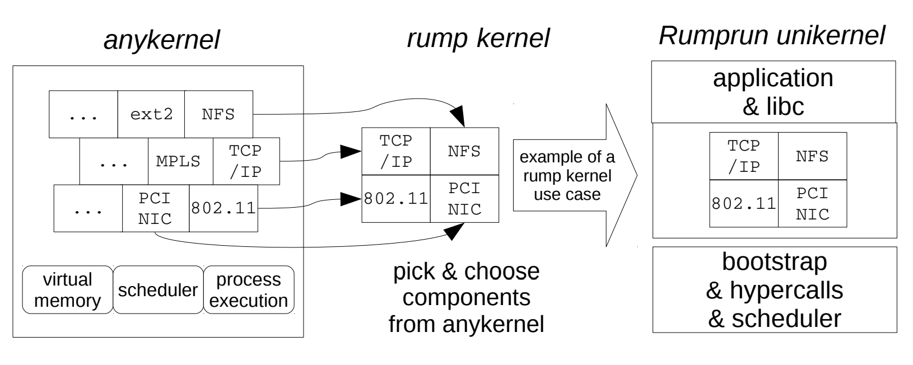

# The Design and Implementation of the Anykernel and Rump Kernels - 01. Introduction

The mission of the first edition of this book (2012) was to introduce the anykernel and rump kernels and motivate their existence. Additionally, we explored the characteristics of the technology through various experiments. The paramount, often criminally overlooked experiment was the one hiding in plain sight: is it possible to construct the system in a sustainable, real-world compatible fashion. That paramount experiment was shown to be a success, and that result has not changed since the original publication, only strengthened. The core technology is still almost identical to the one described in the original book.

本书第一版（2012年）的任务是介绍Anykernel和Rump内核并激发它们的存在。 此外，我们通过各种实验探索了该技术的特性。 最重要的，通常被犯罪分子忽视的实验是一个显而易见的隐匿现象：是否可以以一种可持续的，与现实世界兼容的方式构造该系统。 该最重要的实验被证明是成功的，并且自原始出版物以来，结果没有改变，只是得到了加强。 核心技术仍与原书中描述的技术几乎相同。

This new edition has been written to account for the practical experiences from new use cases, many of which were proposed in the first edition, but which have since become reality.

编写此新版本是为了说明新用例的实践经验，其中许多是在第一版中提出的，但自那以后已成为现实。

To start off, we will look at operating systems in general: what one is, how they developed throughout history, where they are now, what the problem is, and why the time is now ripe for change. After that, we will briefly introduce the Anykernel and Rump Kernels, and argue why they are part of the solution to the problem.

首先，我们将总体上看待操作系统：什么是操作系统，它们在整个历史中是如何发展的，现在的位置，问题是什么，以及为什么现在是进行变革的时机成熟了。 之后，我们将简要介绍Anykernel和Rump Kernels，并争论为什么它们是解决问题的一部分。

## 1.1 Operating Systems

The term operating system originally meant a system which aids computer operators in loading tapes and punchcards onto the computer [15]. We take a slightly more modern approach, and define an operating system as a collection of subroutines which allow application programs to run on a given platform. The platform can be for example a physical unit of hardware, or be virtually provisioned such as on the cloud. Additionally, an operating system may, for example, multiplex the platform for a number of applications, protect applications from each other, be distributed in nature, or provide an interface which is visually appealing to some people.

术语“操作系统”最初是指帮助计算机操作员将磁带和打孔卡加载到计算机上的系统[15]。 我们采用稍微更现代的方法，并将操作系统定义为子例程的集合，这些子例程允许应用程序在给定平台上运行。 该平台可以是例如硬件的物理单元，也可以是虚拟提供的，例如在云上。 另外，操作系统可以例如为多个应用程序复用平台，相互保护应用程序，在本质上进行分布或提供在视觉上吸引某些人的界面。

The majority of the operating system is made up of drivers, which abstract some underlying entity. For example, device drivers know which device registers to read and write for the desired result, file system drivers know which blocks contain which parts of which files, and so forth. In essence, a driver is a protocol translator, which transforms requests and responses to different representations.

操作系统的大部分由驱动程序组成，这些驱动程序抽象了一些基础实体。 例如，设备驱动程序知道要读取和写入哪个设备寄存器以获得所需的结果，文件系统驱动程序知道哪些块包含哪些文件的哪些部分，依此类推。 本质上，驱动程序是协议转换器，它将请求和响应转换为不同的表示形式。

There is nothing about protocol translation which dictates that a driver must be an integral part of an operating system as opposed to being part of application code. However, operating system drivers may also be used as a tool for imposing protection boundaries. For example, an operating system may require that applications access a storage device through the file system driver. The file system can then enforce that users are reading or writing only the storage blocks that they are supposed to have access to. As we shall see shortly, imposing privilege boundaries grew out of historic necessity when computers were few and the operating system was a tool to multiplex a single machine for many users.

协议转换没有什么要求驱动程序必须是操作系统的组成部分，而不是应用程序代码的一部分。 但是，操作系统驱动程序也可以用作施加保护边界的工具。 例如，操作系统可能要求应用程序通过文件系统驱动程序访问存储设备。 然后，文件系统可以强制用户正在读取或写入他们应该有权访问的存储块。 正如我们将很快看到的那样，当计算机很少且操作系统是为许多用户多路复用一台计算机的工具时，施加特权边界是出于历史的需要。

### 1.1.1 Historical Perspective

Computers were expensive in the 1950’s and 1960’s. For example, the cost of the UNIVAC I in 1951 was just short of a million dollars. Accounting for inflation, that is approximately 9 million dollars in today’s money. Since it was desirable to keep expensive machines doing something besides idling, batch scheduling was used to feed new computations and keep idletime to a minimum.

在1950年代和1960年代，计算机价格昂贵。 例如，1951年的UNIVAC I的成本只有一百万美元。 考虑到通货膨胀，按今天的汇率大约是900万美元。 由于希望让昂贵的机器执行除空闲之外的其他操作，因此使用批处理调度来提供新的计算并将空闲时间保持在最低限度。

As most of us intuitively know, reaching the solution of a problem is easier if you are allowed to stumble around with constant feedback, as compared to a situation where you must have holistic clairvoyance over the entire scenario before you even start. The lack of near-instant feedback was a problem with batch systems. You submitted a job, context switched to something else, came back the next day, context switched back to your computation, and discovered your program was missing a comma.

正如我们大多数人凭直觉知道的那样，与允许您在不停地获得反馈的情况下绊倒相比，解决问题要容易得多，而在这种情况下，您甚至必须在开始之前就对整个情况进行全面的了解。 批处理系统存在缺乏即时反馈的问题。 您提交了一份工作，上下文切换到其他内容，第二天又回来，上下文切换回您的计算，发现您的程序缺少逗号。

To address the feedback problem, timesharing was invented. Users logged into a machine via a terminal and got the illusion of having the whole system to themselves. The timesharing operating system juggled between users and programs. Thereby, poetic justice was administered: the computer was now the one context-switching, not the human. Going from running one program at a time to running multiple at the “same” time required more complex control infrastructure. The system had to deal with issues such as hauling programs in and out of memory depending on if they were running or not (swapping), scheduling the tasks according to some notion of fairness, and providing users with private, permanent storage (file system). In other words, 50 years ago they had the key concepts of current operating systems figured out. What has happened since?

为了解决反馈问题，发明了分时。 用户通过终端登录到一台机器上，并幻想自己拥有整个系统。 分时操作系统在用户和程序之间摇摆不定。 因此，管理了诗意的正义：计算机现在是上下文切换的一种，而不是人类的。 从一次运行一个程序到同时“运行”多个程序，需要更复杂的控制基础架构。 系统必须处理一些问题，例如根据程序是否在运行来将它们拖入内存或从内存中拖出（交换），根据某种公平性计划任务，以及为用户提供私有的永久存储（文件系统） 。 换句话说，50年前，他们已经弄清了当前操作系统的关键概念。 此后发生了什么事？

### 1.1.2 And Where It Got Us

The early timesharing systems isolated users from other users. The average general purpose operating system still does a decent job at isolating users from each other. However, that type of isolation does little good in a world which does not revolve around people logging into a timesharing system. The increasing problem is isolating the user from herself or himself. Ages ago, when you yourself wrote all of the programs you ran, or at least had a physical interaction possibility with the people who did, you could be reasonably certain that a program you ran did not try to steal your credit card numbers. These days, when you download a million lines of so-so trusted application code from the Internet, you have no idea of what happens when you run it on a traditional operating system.

早期的分时系统将用户与其他用户隔离开。 一般的通用操作系统在隔离用户之间仍然做得不错。 但是，这种隔离在一个不以人们登录分时系统为中心的世界中并没有多大用处。 日益严重的问题是使用户与她自己或他自己隔离。 多年以前，当您自己编写了所运行的所有程序，或者至少与进行该操作的人有身体上的互动时，您可以合理地确定所运行的程序没有尝试窃取您的信用卡号码。 如今，当您从Internet下载百万行如此受信任的应用程序代码时，您不知道在传统操作系统上运行该代码会发生什么。

The timesharing system also isolates the system and hardware components from the unprivileged user. In this age when everyone has their own hardware — virtual if not physical — that isolation vector is of questionable value. It is no longer a catastrophe if an unprivileged process binds to transport layer ports less than 1024. Everyone should consider reading and writing the network medium unlimited due to hardware no longer costing a million, regardless of what the operating system on some system does. The case for separate system and user software components is therefore no longer universal. Furthermore, the abstract interfaces which hide underlying power, especially that of modern I/O hardware, are insufficient for  high performance computing [45].

分时系统还将系统和硬件组件与非特权用户隔离开。 在这个时代，每个人都有自己的硬件-虚拟的甚至不是物理的-隔离向量的价值值得怀疑。 如果没有特权的进程绑定到小于1024的传输层端口，这将不再是灾难。每个人都应该考虑无限地读写网络介质，因为硬件不再需要花费一百万美元，而与某些系统上的操作系统无关。 因此，用于单独的系统和用户软件组件的情况不再普遍。 此外，隐藏底层功能（尤其是现代 I/O硬件的功能）的抽象接口不足以实现高性能计算[45]。

In other words, since the operating system does not protect the user from evil or provide powerful abstractions, it fails its mission in the modern world. Why do we keep on using such systems? Let us imagine the world of computing as a shape sorter. In the beginning, all holes were square: all computation was done on a million dollar machine sitting inside of a mountain. Square pegs were devised to fit the square holes, as one would logically expect. The advent of timesharing brought better square pegs, but it did so in the confines of the old scenario of the mountain machine. Then the world of computing diversified. We got personal computing, we got mobile devices, we got IoT, we got the cloud. Suddenly, we had round holes, triangular holes and the occasional trapezoid and rhombus. Yet, we are still fascinated by square-shaped pegs, and desperately try to cram them into every hole, regardless of if they fit or not.

换句话说，由于操作系统无法保护用户免受邪恶或提供强大的抽象，因此它无法履行其在现代世界中的使命。 为什么我们继续使用这种系统？ 让我们想象一下作为形状分类器的计算世界。 最初，所有的孔都是正方形的：所有的计算都是在山顶上的一百万美元机器上完成的。 正如人们所希望的那样，设计了方钉以适合方孔。 分时度假的到来带来了更好的方钉，但这是在山区机器的旧方案的范围内做到的。 然后，计算世界变得多样化。 我们有了个人计算，我们有了移动设备，我们有了物联网，我们有了云。 突然，我们有了圆孔，三角形孔以及不规则的梯形和菱形。 但是，我们仍然对方形的钉子着迷，并拼命尝试将它们塞入每个孔中，无论它们是否合适。

Why are we so fascinated with square-shaped pegs? What happens if we throw away the entire operating system? The first problem with that approach is, and it is a literal show-stopper, that applications will fail to run. Already in the late 1940’s computations used subroutine libraries [8]. The use of subroutine libraries has not diminished in the past 70 years, quite to the contrary. An incredible amount of application software keeping the Internet and the world running has been written against the POSIX-y interfaces offered by a selection of operating systems. No matter how much you do not need the obsolete features provided by the square peg operating system, you do want to keep your applications working.

为什么我们对方形的钉子如此着迷？ 如果我们丢掉整个操作系统会怎样？ 这种方法的第一个问题是，应用程序将无法运行，并且它确实是一个显示障碍。 在1940年代后期，计算已使用子例程库[8]。 恰恰相反，在过去的70年中，子例程库的使用并未减少。 针对各种操作系统提供的POSIX-y接口编写了数量众多的应用软件，它们使Internet和整个世界保持运转。 无论您不需要多少方钉操作系统提供的过时功能，都希望保持应用程序正常运行。

From-scratch implementations of the services provided by operating systems are far from trivial undertakings. Just implementing the 20-or-so flags for the open() call in a real-world-bug-compatible way is far from trivial. Assuming you want to run an existing libc/application stack, you have to keep in mind that you still have roughly 199 system calls to go after open(). After you are done with the system calls, you then have to implement the actual components that the system calls act as an interface to: networking, file systems, device drivers, and various other driver stacks.

从头开始实现操作系统提供的服务绝非易事。 仅仅以一种与现实世界中的错误兼容的方式为 `open()` 调用实现20左右的标志并不是一件容易的事。 假设您要运行现有的 libc/ 应用程序堆栈，则必须记住，在 `open()`之后仍需要进行大约199个系统调用。 完成系统调用后，您必须实现系统调用充当接口的实际组件：网络，文件系统，设备驱动程序以及各种其他驱动程序堆栈。

After the completing the above steps for a from-scratch implementation, the most time-consuming part remains: testing your implementation in the real world and fixing it to work there. This step is also the most difficult one, since no amount of conformance to formal specification or testing in a laboratory is a substitute for being "bug-compatible" with the real world.

在完成了从头开始实现的上述步骤之后，最耗时的部分仍然是：在现实世界中测试实现并将其修复以在其中工作。 这一步也是最困难的一步，因为对形式规范或实验室测试的任何符合都不能替代与现实世界的 “bug兼容” 。

So in essence, we are fascinated by square-shaped pegs because our applications rest on the support provided by those pegs. That is why we are stuck in a rut and few remember to look at the map.

因此，从本质上讲，我们对方形钉子着迷，因为我们的应用依靠这些钉子提供的支撑。 这就是为什么我们陷入困境，很少有人记得看地图的原因。

### 1.1.3 What We Really Need

We want applications to run. We need the operating system to adapt to the scenario the application is deployed in, not for the application to adapt to a 1950’s understanding of computing and hardware cost.

我们希望应用程序运行。 我们需要操作系统适应于应用程序部署的场景，而不是为了适应1950年对计算和硬件成本的理解而适应的应用程序。

Let us consider embedded systems. Your system consists of one trust-domain on one piece of hardware. There, you simply need at set of subroutines (drivers) to enable your application to run. You do not need any code which allows the single user, single-application system to act like a timesharing system with multiple users. However, for example the implementation of the TCP/IP driver can, assuming you do not want to scale to kilobyte-sized system or to the bleeding edge of performance, be the same as one for a multiuser system. After all, the TCP/IP protocols are standard, and therefore the protocol translation the driver needs to perform is also standard.

让我们考虑嵌入式系统。 您的系统由一个硬件上的一个信任域组成。 在那里，您只需要一组子例程（驱动程序）即可使您的应用程序运行。 您不需要任何代码即可使单用户单应用程序系统像具有多个用户的分时系统一样工作。 但是，例如，假设您不想扩展到千字节大小的系统或性能的极限，TCP/IP 驱动程序的实现可以与多用户系统的实现相同。 毕竟，TCP/IP 协议是标准的，因此驱动程序需要执行的协议转换也是标准的。

Let us consider the cloud and especially microservices running on the cloud. We can indeed run the services on top of a timesharing operating system, A paravirtualized timesharing OS takes time to bootstrap [26] and consumes resources even for the features which are not used by the microservice. OS virtualization via containers [27] provides better performance and resource consumption than paravirtualization [53, 57], but at the cost of putting millions of lines of code into the trusted computing base.

让我们考虑云，尤其是在云上运行的微服务。 我们确实可以在分时操作系统上运行这些服务。半虚拟化分时OS会花一些时间进行引导[26]，甚至会消耗微服务未使用的功能。 通过容器进行的OS虚拟化[27]比半虚拟化[53，57]提供了更好的性能和资源消耗，但是是以将数百万行代码放入可信计算库中为代价的。

Using timesharing systems en masse will allow applications to run in both cases, but not adapting to the scenario comes with a price. In effect, tradeoffs are made either for performance or security.

整体上使用分时共享系统将允许应用程序在两种情况下运行，但不能适应这种情况带来的代价。 实际上，权衡是为了性能或安全性。

## 1.2 The Anykernel and Rump Kernels

This work is about how to move from the world of timesharing systems to the world of the future in a fashion in which applications continue to function. The two key terms are anykernel and rump kernel, both of which we will introduce and describe shortly.

这项工作是关于如何以应用程序继续运行的方式从分时系统的世界过渡到未来的世界。 两个关键术语是Anykernel和Rump内核，我们将在短期内介绍和描述这两个关键术语。

Applications need subroutines to work, and those subroutines are provided by operating systems. We call those subroutines drivers, and state that not only does a typical application require a large set of drivers, but also that those drivers are also non-trivial to write and maintain. While operating systems built around a timesharing model are rich in drivers due to having a lot of history behind them, they are not sufficient for the use cases required by the modern world. We need to start treating drivers as library-like components instead of requiring a separate implementation for each operating system. The library-approach will allow to build the software stack to suit the scenario, instead of having to build the scenario to suit the available operating systems.

应用程序需要子例程才能工作，并且这些子例程由操作系统提供。 我们称这些子例程为驱动程序，并声明不仅典型的应用程序需要大量的驱动程序，而且这些驱动程序的编写和维护也很简单。 尽管基于分时共享模型构建的操作系统具有丰富的驱动程序，但它们背后已有许多历史，但对于现代世界所需要的用例而言，它们还不够。 我们需要开始将驱动程序视为类库组件，而不是为每个操作系统都要求单独的实现。 库方法将允许构建适用于方案的软件堆栈，而不必构建适用于可用操作系统的方案。

The term anykernel was coined in response to the ever-increasing number of operating system models: monolithic kernel, microkernel, exokernel, multikernel, unikernel, etc. As the saying goes, creating something new is is 5% inspiration and 95% perspiration. While the inspiration required to come up with a new model should not be undervalued, after that 95% of the work for reaching a usable software stack remains. That 95% consists largely of the drivers. For example, even the most trivial cloud operating system requires a TCP/IP driver, and creating one from scratch or even porting one is far from trivial. The anykernel is a term describing a kernel type codebase from which drivers, the 95%, can be extracted and integrated to any operating system model — or at least near any — without porting and maintenance work.

术语Anykernel是为响应不断增长的操作系统模型数量而创造的：整体内核，微内核，exokernel，多内核，unikernel等。俗话说，创造新事物是5％的灵感和95％的汗水 。 虽然提出新模型所需的灵感不应被低估，但在此之后，仍然需要95％的工作来获得可用的软件堆栈。 这95％的人主要是司机。 例如，即使是最琐碎的云操作系统也需要TCP/IP 驱动程序，并且从头创建一个甚至移植一个都不是很简单的。 Anykernel是描述内核类型代码库的一个术语，无需移植和维护工作，就可以从中提取95％的驱动程序并将其集成到任何操作系统模型（或至少接近于任何一种操作系统模型）。

A rump kernel, as the name implies, is a timesharing style kernel from which portions have been removed. What remains are drivers and the basic support routines required for the drivers to function – synchronization, memory allocators, and so forth. What is gone are policies of thread scheduling, virtual memory, application processes, and so forth. Rump kernels have a well-defined (and small!) portability layer, so they are straightforward to integrate into various environments.

臀部内核，顾名思义，是一种分时共享样式的内核，已从其中删除了部分内容。 剩下的是驱动程序以及驱动程序运行所需的基本支持例程–同步，内存分配器等。 不再涉及线程调度，虚拟内存，应用程序进程等策略。 臀部内核具有良好定义的（并且很小！）可移植性层，因此可以直接集成到各种环境中。


Figure 1.1: Relationship between key concepts: The anykernel allows driver components to be lifted out of the original source tree and rump kernels to be formed out of those drivers. Rump kernels can be used to build products and platforms; one example of a use case is illustrated.<br>图1.1：关键概念之间的关系：Anykernel允许将驱动程序组件从原始源代码树中取出，并在这些驱动程序中形成臀部内核。 臀部内核可用于构建产品和平台。 举例说明了一个用例。

Figure 1.1 illustrates how a timesharing system, anykernel and rump kernel are related. The figure indeed illustrates only one example, and by extension, only one example platform for hosting rump kernels.

图1.1说明了分时系统，anykernel和rump内核之间的关系。 该图确实仅示出了一个示例，并且通过扩展仅示出了一个用于托管臀部内核的示例平台。

Throughout most of the technical discussion in this book we will consider a userspace program as the platform for hosting a rump kernel. There are two reasons why it is so. First, the original motivation for rump kernels back in 2007 was developing, debugging and testing kernel drivers. What better place to do it than in userspace? Second, userspace is in itself a "hosted" platform, and we do not have full control of for example the symbol namespace or the scheduler. Therefore, if rump kernels can work in userspace, they can also easily work on platforms which are custom-built to host rump kernels.

在本书的大部分技术讨论中，我们都将用户空间程序视为托管臀部内核的平台。 这样做有两个原因。 首先，早在2007年，后备内核的最初动机就是开发，调试和测试内核驱动程序。 有比在用户空间中更好的地方吗？ 其次，用户空间本身就是一个“托管”平台，我们无法完全控制例如符号名称空间或调度程序。 因此，如果臀部内核可以在用户空间中工作，它们也可以轻松地在为宿主臀部内核而定制构建的平台上工作。

The implementation we discuss is available in NetBSD. It is crucial to differentiate between the implementation being in NetBSD, and it being available as patches for NetBSD. The idea of the anykernel is that it is an inherent property of a code base, so as to keep things maintained. What, in fact, keeps the implementation working is NetBSD’s internal use of rump kernels for testing kernel drivers. This testing also allows NetBSD to provide better quality drivers, so there is clear synergy. However, we will not focus on the testing aspects in this book; if curious, see the first edition for more discussion on development and testing.

NetBSD中提供了我们讨论的实现。 区分NetBSD中的实现与NetBSD的修补程序之间的区别至关重要。 Anykernel的想法是，它是代码库的固有属性，可以保持所有内容。 实际上，使实施保持正常运行的是NetBSD在内部使用臀部下的内核来测试内核驱动程序。 此测试还允许NetBSD提供更好的质量驱动程序，因此具有明显的协同作用。 但是，我们不会将重点放在本书的测试方面。 如果好奇，请参阅第一版，以获取有关开发和测试的更多讨论。

## 1.3 Book Outline

The remainder of the book is as follows. Chapter 2 defines the concept of the anykernel and rump kernels and Chapter 3 discusses the implementation and provides microbenchmarks as supporting evidence for implementation decisions. Essentially, the two previous chapters are a two-pass flight over the core subject. The intent is to give the reader a soft landing by first introducing the new concept in abstract terms, and then doing the same in terms of the implementation. That way, we can include discussion of worthwhile implementation details without confusing the high-level picture. If something is not clear from either chapter alone, the recommendation is to study the relevant text from the other one. If you read the first edition of this book, you may choose to only lightly skim these two chapters; the main ideas are the same as in the first edition.

本书的其余部分如下。 第2章定义了Anykernel和Rump内核的概念，第3章讨论了实现，并提供了微基准作为实现决策的支持证据。 本质上，前两章是对核心主题的两次通过。 目的是通过首先以抽象术语介绍新概念，然后在实现方面进行相同的操作，以使读者有一个软着陆。 这样，我们可以包括有价值的实现细节的讨论，而不会混淆高级概貌。 如果仅从任一章中都不清楚，则建议研究另一章中的相关文本。 如果您阅读了本书的第一版，则可以选择仅略读这两个章节。 主要思想与第一版相同。

Chapter 4 gives an overview of what we have built on top of rump kernels. A brief history of the project is presented in Chapter 5. The history chapter can be read first, last, or anywhere in between, or not at all. Finally, Chapter 6 provides concluding remarks.

第4章概述了我们在臀部内核之上构建的内容。 第5章介绍了该项目的简要历史记录。历史记录章节可以首先阅读，最后阅读，或介于两者之间的任何地方阅读，或者根本不用阅读。 最后，第6章提供了结束语。

### What this book is not

This book is not a user manual. You will not learn how to use rump kernels in day-to-day operations from this book. However, you will gain a deep understanding of rump kernels which, when coupled with the user documentation, will give you superior knowledge of how to use rump kernels. Most of the user documentation is available as a wiki at http://wiki.rumpkernel.org/.

这本书不是用户手册。 您将不会从本书中学到如何在日常操作中使用臀部内核。 但是，您将对臀部内核有深入的了解，当与用户文档一起使用时，将为您提供有关如何使用臀部内核的高级知识。 大多数用户文档可在http://wiki.rumpkernel.org/上以Wiki的形式获得。

## 1.4 Further Material

In general, further material is reachable from the rump kernel project website at http://rumpkernel.org/.

通常，可以从臀部内核项目网站http://rumpkernel.org/获得更多资料。

### 1.4.1 Source Code

The NetBSD source files and their respective development histories are available for study from repository provided by the NetBSD project, e.g. via the web interface at cvsweb.NetBSD.org. These files are most relevant for the discussion in Chapter 2 and Chapter 3.

可以从NetBSD项目提供的存储库中研究NetBSD源文件及其各自的发展历史，例如 通过cvsweb.NetBSD.org上的Web界面。 这些文件与第2章和第3章中的讨论最相关。

The easiest way to fetch the latest NetBSD source code in bulk is to run the following commands (see Section 4.1.4 for further information):

批量获取最新NetBSD源代码的最简单方法是运行以下命令（有关更多信息，请参见第4.1.4节）：

```bash
git clone http://repo.rumpkernel.org/src-netbsd
cd src-netbsd
git checkout all-src
```

Additionally, there is infrastructure to support building rump kernels for various platforms hosted at http://repo.rumpkernel.org/. The discussion in Chapter 4 is mostly centered around source code available from that location.

另外，在 http://repo.rumpkernel.org/ 上托管的基础架构可支持为各种平台构建臀部内核。 第4章中的讨论主要围绕可从该位置获得的源代码进行。

#### Code examples

This book includes code examples from the NetBSD source tree. All such examples are copyright of their respective owners and are not public domain. If pertinent, please check the full source for further information about the licensing and copyright of each such example.

本书包括NetBSD源代码树中的代码示例。 所有此类示例均为其各自所有者的版权，而不是公共领域。 如果相关，请检查完整的源，以获取有关每个此类示例的许可和版权的更多信息。

### 1.4.2 Manual Pages

Various manual pages are cited in the document. They are available as part of the NetBSD distribution, or via the web interface at http://man.NetBSD.org/.

文档中引用了各种手册页。 它们可以作为NetBSD发行版的一部分，也可以通过Web界面（http://man.NetBSD.org/）获得。