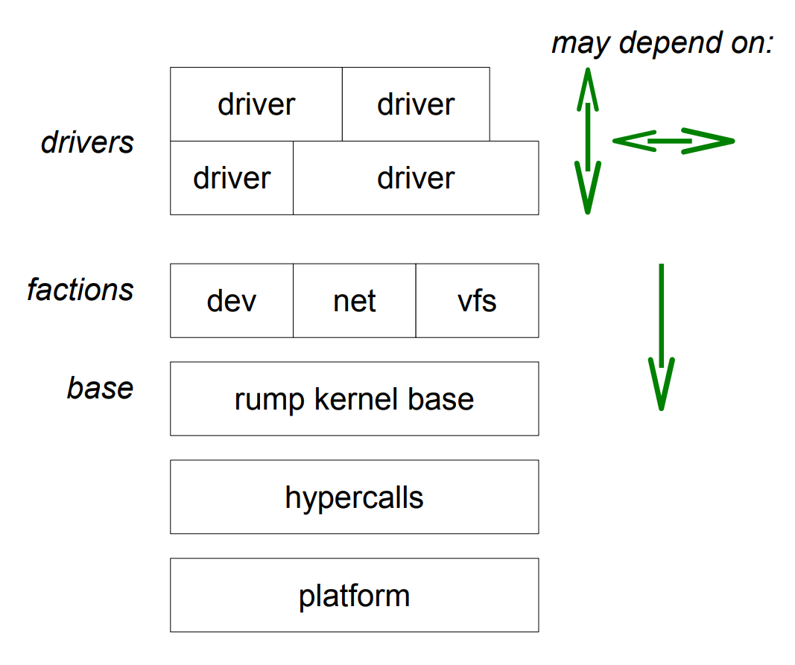
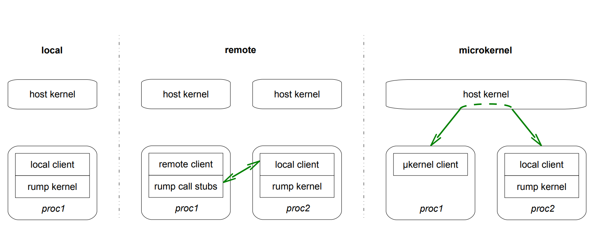
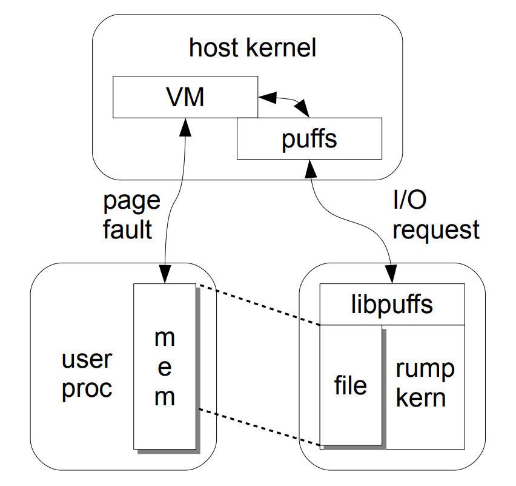

# 2 Concepts: Anykernel and Rump Kernels

As a primer for the technical discussion in this book, we consider the elements that make up a modern Unix-style operating system. Commonly, the operating system is cleft in twain with the kernel providing basic support, and userspace being where applications run. Since this chapter is about the anykernel and rump kernels, we limit the following discussion to the kernel.

作为本书技术讨论的基础，我们考虑构成现代Unix风格操作系统的元素。 通常，操作系统是两全其美的，内核提供了基本的支持，而用户空间是应用程序运行的地方。 由于本章是关于Anykernel和Rump内核的，因此下面的讨论仅限于内核。

The CPU specific code is on the bottom layer of the operating system. This code takes care of low level bootstrap and provides an abstract interface to the hardware. In most, if not all, modern general purpose operating systems the CPU architecture is abstracted away from the bulk of the kernel and only the lowest layers have knowledge of it. To put the previous statement into terms which are used in our later discussions, the interfaces provided by the CPU specific code are the“hypercall” interfaces that the OS runs on. In the NetBSD kernel these functions are usually prefixed with “cpu”.

CPU专用代码位于操作系统的底层。 此代码负责低级引导，并提供了与硬件的抽象接口。 在大多数（如果不是全部）现代通用操作系统中，CPU体系结构是从大量内核中抽象出来的，只有最底层的人才知道。 为了将前面的陈述放到后面的讨论中使用的术语中，由CPU特定代码提供的接口是操作系统在其上运行的“ hypercall”接口。 在NetBSD内核中，这些功能通常以“ cpu”为前缀。

The virtual memory subsystem manages the virtual address space of the kernel and application processes. Virtual memory management includes defining what happens when a memory address is accessed. Examples include normal read/write access to the memory, flagging a segmentation violation, or a file being read from the file system.

虚拟内存子系统管理内核和应用程序进程的虚拟地址空间。 虚拟内存管理包括定义访问内存地址时发生的情况。 示例包括对内存的常规读/写访问，标记分段违例或正在从文件系统读取文件。

The process execution subsystem understands the formats that executable binaries use and knows how to create a new process when an executable is run.

流程执行子系统了解可执行二进制文件使用的格式，并且知道在运行可执行文件时如何创建新流程。

The scheduling code includes a method and policy to define what code a CPU is executing. Scheduling can be cooperative or preemptive. Cooperative scheduling means that the currently running thread decides when to yield — sometimes this decision is implicit, e.g. waiting for I/O to complete. Preemptive scheduling means that also the scheduler can decide to unschedule the current thread and schedule a new one, typically because the current thread exceeded its allotted share of CPU time. When a thread is switched, the scheduler calls the CPU specific code to save the machine context of the current thread and load the context of the new thread. NetBSD uses preemptive scheduling both in userspace and in the kernel.

调度代码包括定义CPU正在执行什么代码的方法和策略。 调度可以是合作的，也可以是抢先的。 合作调度意味着当前运行的线程决定何时屈服-有时此决定是隐式的，例如 等待I / O完成。 抢占式调度意味着调度器还可以决定取消调度当前线程并调度新线程，通常是因为当前线程超出了其分配的CPU时间份额。 切换线程时，调度程序调用特定于CPU的代码以保存当前线程的计算机上下文并加载新线程的上下文。 NetBSD在用户空间和内核中都使用抢占式调度。

Atomic operations enable modifying memory atomically and avoid race conditions in for example a read-modify-write cycle. For uniprocessor architectures, kernel atomic operations are a matter of disabling interrupts and preemption for the duration of the operation. Multiprocessor architectures provide machine instructions for atomic operations. The operating system’s role with atomic operations is mapping function interfaces to the way atomic operations are implemented on that particular machine architecture.

原子操作使原子修改内存成为可能，并避免了竞争情况，例如在读-修改-写周期中。 对于单处理器体系结构，内核原子操作是在操作过程中禁用中断和抢占的问题。 多处理器体系结构为原子操作提供了机器指令。 操作系统在原子操作上的作用是将功能接口映射到在特定计算机体系结构上实现原子操作的方式。

Synchronization routines such as mutexes and condition variables build upon atomic operations and interface with the scheduler. For example, if locking a mutex is attempted, the condition for it being free is atomically tested and set. If a sleep mutex was already locked, the currently executing thread interfaces with the scheduling code to arrange for itself to be put to sleep until the mutex is released.

同步例程（例如互斥体和条件变量）建立在原子操作上并与调度程序接口。 例如，如果尝试锁定互斥锁，则对其进行释放的条件将自动进行测试和设置。 如果睡眠互斥锁已被锁定，则当前正在执行的线程与调度代码对接，以安排自身进入睡眠状态，直到释放互斥锁为止。

Various support interfaces such CPU cross-call, time-related routines, kernel linkers, etc. provide a basis on which to build drivers.

各种支持接口，例如CPU交叉调用，与时间有关的例程，内核链接器等，为构建驱动程序提供了基础。

Resource management includes general purpose memory allocation, a pool and slab [7] allocator, file descriptors, PID namespace, vmem/extent resource allocators etc. Notably, in addition to generic resources such as memory, there are more specific resources to manage. Examples of more specific resources include vnodes [30] for file systems and mbufs [58] for the TCP/IP stack.

资源管理包括通用内存分配，池和平板[7]分配器，文件描述符，PID名称空间，vmem /扩展资源分配器等。值得注意的是，除了诸如内存之类的通用资源之外，还有更多特定的资源需要管理 。 更具体的资源示例包括用于文件系统的vnode [30]和用于TCP / IP堆栈的mbufs [58]。

Drivers deal with translating various protocols such as file system images, hardware devices, network packets, etc. Drivers are what we are ultimately interested in using in rump kernels, but to make them available we must deal with everything they depend on. We will touch this subject more in the next section.

驱动程序处理各种协议的转换，例如文件系统映像，硬件设备，网络数据包等。驱动程序是我们最终对在臀部内核中使用的兴趣，但是要使它们可用，我们必须处理它们所依赖的所有内容。 我们将在下一部分中更详细地讨论这个主题。

## 2.1 Driving Drivers

To run drivers without having to run the entire timesharing OS kernel, in essence we have to provide semantically equivalent implementations of the support routines that the drivers use. The straightforward way indeed is to run the entire kernel, but it is not the optimal approach, as we argued in the introduction. The key is to figure out what to reuse verbatim and what needs rethinking.

要运行驱动程序而不必运行整个分时操作系统内核，从本质上讲，我们必须提供驱动程序使用的支持例程的语义等效实现。 直截了当的方法确实是运行整个内核，但这不是最佳方法，正如我们在引言中所述。 关键是弄清楚要重用的内容和需要重新考虑的内容。

### 2.1.1 Relegation and Reuse

There are essentially two problems to solve. One is coming up with an architecture which allows rump kernels to maximally integrate with the underlying platform. The second one is figuring out how to satisfy the closure of the set of support routines used by desirable drivers. Those two problems are in fact related. We will clarify in the following.

本质上有两个问题要解决。 一个正在提出一种架构，该架构允许臀部内核最大程度地与基础平台集成。 第二个是弄清楚如何满足期望的驾驶员使用的一组支持例程。 这两个问题实际上是相关的。 我们将在下面进行澄清。

The key to drivers being able to adapt to situations is to allow them to use the features of the underlying world directly. For example, drivers need a memory address space to execute in; we use the underlying one instead of simulating a second one on top of it. Likewise, we directly use the threading and scheduling facilities in our rump kernel instead of having the scheduling a virtual kernel with its own layer of scheduling. Relegating support functionality to the host avoids adding a layer of indirection and overhead.

驾驶员能够适应情况的关键是允许他们直接使用基础世界的功能。 例如，驱动程序需要一个内存地址空间才能执行。 我们使用底层的而不是在其上面模拟第二个。 同样，我们直接在臀部内核中使用线程和调度功能，而不是使用自己的调度层来调度虚拟内核。 将支持功能委派给主机可避免增加间接和开销层。

Rump kernels are never full kernels which can independently run directly on bare metal, and always need lower layer support from the host. This layer can be a spartan, specially-constructed one consisting of some thousands of lines of code, or an extremely complex such as a current generation general purpose operating system.

臀部内核从来都不是可以直接在裸机上独立运行的完整内核，并且始终需要主机的较低层支持。 该层可以是由数以千计的代码行组成的斯巴达式的，经过特殊构造的层，也可以是极其复杂的层，例如当前一代的通用操作系统。

Drivers in a rump kernel remain unmodified over the original ones. A large part of the support routines remain unmodified as well. Only in places where support is relegated to the host do we require specifically written glue code. As was indicated already in the introductory chapter, we use the term anykernel to describe a kernel code base with the property of being able use unmodified drivers and the relevant support routines in rump kernels.

臀部内核中的驱动程序在原始驱动程序上保持不变。 大部分支持例程也保持不变。 仅在将支持权移交给主机的地方，我们才需要专门编写的粘合代码。 正如在介绍性章节中已经指出的那样，我们使用术语Anykernel来描述内核代码库，该代码库具有能够在臀部内核中使用未经修改的驱动程序和相关支持例程的特性。

It should be noted that unlike for example the terms microkernel or unikernel, the term anykernel does not convey information about how the drivers are organized at runtime, but rather that it is possible to organize them in a number of ways.

应当注意，与例如术语微内核或单内核不同，术语“任何内核”不传达有关在运行时如何组织驱动程序的信息，而是可以以多种方式组织它们。

We examine the implementation details of an anykernel more closely in Chapter 3 where we turn the NetBSD kernel into an anykernel.

在第3章中，我们将NetBSD内核转换为Anykernel，将更详细地研究Anykernel的实现细节。

### 2.1.2 Base, Orthogonal Factions, Drivers

A monolithic kernel, as the name implies, is one single entity. The runtime footprint of a monolithic kernel contains support functionality for all subsystems, such as sockets for networking, vnodes for file systems and device autoconfiguration for drivers. All of these facilities cost resources, especially memory, even if they are not used. They may also impose dependencies on the underlying platform, e.g. MMU for some aspects of virtual memory support.

顾名思义，单片内核是一个单独的实体。 整体内核的运行时占用空间包含所有子系统的支持功能，例如用于网络的套接字，用于文件系统的vnode和用于驱动程序的设备自动配置。 所有这些功能都消耗资源，尤其是内存，即使不使用它们也是如此。 它们还可能对基础平台施加依赖性，例如 MMU对虚拟内存的某些方面提供支持。


Figure 2.1: Rump kernel hierarchy. The desired drivers dictate the required components. The factions are orthogonal and depend only on the rump kernel base. The rump kernel base depends purely on the hypercall layer. <br> 图2.1：臀部内核层次结构。 所需的驱动程序指示所需的组件。 派系是正交的，仅取决于臀部内核。 臀部内核的基础完全取决于超级调用层。

We have divided a rump kernel, and therefore the underlying NetBSD kernel codebase, into three layers which are illustrated in Figure 2.1: the base, factions and drivers. The base contains basic support such as memory allocation and locking. The dev, net and vfs factions, which denote devices, networking and [virtual] file systems, respectively, provide subsystem level support. To minimize runtime resource consumption, we require that factions are orthogonal. By orthogonal we mean that the code in one faction must be able to operate irrespective if any other faction is present in the rump kernel configuration or not. Also, the base may not depend on any faction, as that would mean the inclusion of a faction in a rump kernel is mandatory instead of optional.

我们将一个粗俗的内核（因此将底层的NetBSD内核代码库）划分为三层，如图2.1所示：基层，派系和驱动程序。 该基础包含诸如内存分配和锁定之类的基本支持。 dev，net和vfs派别分别表示设备，网络和[虚拟]文件系统，它们提供子系统级别的支持。 为了最大程度地减少运行时资源消耗，我们要求各派系是正交的。 正交是指一个派系中的代码必须能够运行，而不管臀部内核配置中是否存在任何其他派系。 而且，基础可能不依赖任何派系，因为这意味着在臀部内核中包含派系是强制性的，而不是可选的。

We use the term component to describe a functional unit for a rump kernel. For example, a file system driver is a component. A rump kernel is constructed by linking together the desired set of components, either at compile-time or at run-time. A loose similarity exists between kernel modules and the rump kernel approach: code is compiled once per target architecture, and a linker is used to determine runtime features. For a given driver to function properly, the rump kernel must be linked with the right set of dependencies. For example, the NFS component requires both the file system and networking factions, but in contrast the tmpfs component requires only the file system faction.

我们使用术语组件来描述臀部内核的功能单元。 例如，文件系统驱动程序是一个组件。 臀部内核是通过在编译时或运行时将所需的组件集链接在一起而构造的。 内核模块和臀部内核方法之间存在松散的相似性：每个目标体系结构仅对代码进行一次编译，并且使用链接器确定运行时功能。 为了使给定的驱动程序正常运行，臀部内核必须与正确的依赖关系集链接。 例如，NFS组件既需要文件系统派系，也需要文件系统派系，但是相反，tmpfs组件仅需要文件系统派系。

User interfaces are used by applications to request services from rump kernels. Any dependencies induced by user interfaces are optional, as we will illustrate next. Consider Unix-style device driver access. Access is most commonly done through file system nodes in /dev, with the relevant user interfaces being open and read/write (some exceptions to the file system rule exist, such as Bluetooth and Ethernet interfaces which are accessed via sockets on NetBSD). To access a /dev file system node in a rump kernel, file systems must be supported. Despite file system access being the standard way to access a device, it is possible to architect an application where the device interfaces are called directly without going through file system code. Doing so means skipping the permission checks offered by file systems, calling private kernel interfaces and generally having to write more fragile code. Therefore, it is not recommended as the default approach, but if need be due to resource limitations, it is a possibility. For example, let us assume we have a rump kernel running a TCP/IP stack and we wish to use the BSD Packet Filter (BPF) [34]. Access through /dev is presented in Figure 2.2, while direct BPF access which does not use file system user interfaces is presented in Figure 2.3. You will notice the first example is similar to a regular application, while the latter is more complex. We will continue to refer to these examples in this chapter when we go over other concepts related to rump kernels.

应用程序使用用户界面从臀部内核请求服务。用户界面引起的任何依赖关系都是可选的，我们将在下面说明。考虑Unix风格的设备驱动程序访问。访问通常是通过/ dev中的文件系统节点完成的，相关的用户界面处于打开和读写状态（存在一些文件系统规则的例外，例如可以通过NetBSD上的套接字访问的蓝牙和以太网接口）。要访问臀部内核中的/ dev文件系统节点，必须支持文件系统。尽管文件系统访问是访问设备的标准方法，但是可以构建一个无需通过文件系统代码即可直接调用设备接口的应用程序。这样做意味着跳过文件系统提供的权限检查，调用私有内核接口，并且通常不得不编写更易碎的代码。因此，不建议将其作为默认方法，但是如果由于资源限制而需要，则有可能。例如，假设我们有一个运行TCP / IP堆栈的臀部内核，并且希望使用BSD数据包过滤器（BPF）[34]。图2.2中显示了通过/ dev进行的访问，图2.3中显示了不使用文件系统用户界面的直接BPF访问。您会注意到第一个示例类似于常规应用程序，而后者则更为复杂。当我们遍历与臀部内核相关的其他概念时，我们将在本章中继续参考这些示例。

The faction divisions allow cutting down several hundred kilobytes of memory overhead and milliseconds in startup time per instance. While the saving per instance is not dramatic, the overall savings are sizeable in scenarios such as IoT, network testing [24], or cloud services, which demand thousands of instances. For example, a rump kernel TCP/IP stack without file system support is 40% smaller (400kB) than one which contains file system support.

派系划分可减少每个实例数百KB的内存开销和毫秒的启动时间。 虽然每个实例的节省并不大，但是在需要数千个实例的IoT，网络测试[24]或云服务等场景中，总体节省额是可观的。 例如，没有文件系统支持的臀部内核TCP/IP 堆栈（400kB）比包含文件系统支持的臀部内核 TCP/IP 堆栈小40％。

### 2.1.3 Hosting

To function properly, a rump kernel must access certain underlying resources such as memory and the scheduler. These resources are accessed through the rumpuser hypercall interface. We will analyze and describe this interface in detail in Section 3.2.3. We call the underlying platform-specific software layer the host; the hypercalls are implemented on top of the host.

为了正常运行，臀部内核必须访问某些基础资源，例如内存和调度程序。 这些资源是通过rumpuser超级调用接口访问的。 我们将在3.2.3节中详细分析和描述此接口。 我们将底层特定于平台的软件层称为主机。 超级调用是在主机顶部实现的。

Notably, as we already hinted earlier, the platform requirements for a rump kernel are extremely minimal, and a rump kernel can run virtually everywhere. For example, there is no need to run the rump kernel in privileged hardware mode. Ultimately, the host has full control and fine-grained control of what a rump kernel has access to.

值得注意的是，正如我们之前已经暗示的那样，臀部内核的平台要求极低，并且臀部内核几乎可以在任何地方运行。 例如，不需要在特权硬件模式下运行Rump内核。 最终，主机对臀部内核可以访问的内容具有完全控制和细粒度控制。

## 2.2 Rump Kernel Clients

We define a rump kernel client to be an entity which requests services from a rump kernel. Examples of rump kernel clients are userspace applications which access the network through a TCP/IP stack provided by a rump kernel, userspace applications which read files via a file system driver provided by a rump kernel, or simply any application running on the Rumprun unikernel (Section 4.2). Likewise, a test program that is used to test kernel code by means of running it in a rump kernel is a rump kernel client.

我们将臀部内核客户端定义为一个向臀部内核请求服务的实体。 臀部内核客户端的示例包括可通过臀部内核提供的 TCP/IP 堆栈访问网络的用户空间应用程序，可通过臀部内核提供的文件系统驱动程序读取文件的用户空间应用程序，或仅在Rumprun Unikernel上运行的任何应用程序（ 第4.2节）。 同样，用于通过在臀部内核中运行来测试内核代码的测试程序是臀部内核客户端。

```c
int
main(int argc, char *argv[])
{
	struct ifreq ifr;
	int fd;

	/* bootstrap rump kernel */
	rump_init();

	/* open bpf device, fd is in implicit process */
	if ((fd = rump_sys_open(_PATH_BPF, O_RDWR, 0)) == -1)
		err(1, "bpf open");

	/* create virt0 in the rump kernel the easy way and set bpf to use it */
	rump_pub_virtif_create(0);
	strlcpy(ifr.ifr_name, "virt0", sizeof(ifr.ifr_name));
	if (rump_sys_ioctl(fd, BIOCSETIF, &ifr) == -1)
		err(1, "set if");

	/* rest of the application */
	[....]
}

```

Figure 2.2: BPF access via the file system. This figure demonstrates the system call style programming interface of a rump kernel <br> 图2.2：通过文件系统的BPF访问。 该图演示了臀部内核的系统调用样式编程接口

```c
int rumpns_bpfopen(dev_t, int, int, struct lwp *);

int
main(int argc, char *argv[])
{
        struct ifreq ifr;
        struct lwp *mylwp;
        int fd, error;

        /* bootstrap rump kernel */
        rump_init();

        /* create an explicit rump kernel process context */
        rump_pub_lwproc_rfork(RUMP_RFCFDG);
        mylwp = rump_pub_lwproc_curlwp();

        /* schedule rump kernel CPU */
        rump_schedule();

        /* open bpf device */
        error = rumpns_bpfopen(0, FREAD|FWRITE, 0, mylwp);
        if (mylwp->l_dupfd < 0) {
                rump_unschedule();
                errx(1, "open failed");
        }

        /* need to jump through a hoop due to bpf being a "cloning" device */
        error = rumpns_fd_dupopen(mylwp->l_dupfd, &fd, 0, error);
        rump_unschedule();
        if (error)
                errx(1, "dup failed");

        /* create virt0 in the rump kernel the easy way and set bpf to use it */
        rump_pub_virtif_create(0);
        strlcpy(ifr.ifr_name, "virt0", sizeof(ifr.ifr_name));
        if (rump_sys_ioctl(fd, BIOCSETIF, &ifr) == -1)
                err(1, "set if");

        /* rest of the application */
        [....]
}
```

Figure 2.3: BPF access without a file system. This figure demonstrates the ability to directly call arbitrary kernel routines from a user program. For comparison, it implements the same functionality as Figure 2.2. This ability is most useful for writing kernel unit tests when the calls to the unit under test cannot be directly invoked by using the standard system call interfaces.

图2.3：没有文件系统的BPF访问。 该图展示了从用户程序直接调用任意内核例程的能力。 为了进行比较，它实现了与图2.2相同的功能。 当无法使用标准系统调用接口直接调用对被测单元的调用时，此功能对于编写内核单元测试最有用。


Figure 2.4: Client types illustrated. For local clients the client and rump kernel reside in a single process, while remote and microkernel clients reside in separate processes and therefore do not have direct memory access into the rump kernel. <br> 图2.4：所示的客户端类型。 对于本地客户端，客户端和臀部内核位于单个进程中，而远程和微内核客户端位于单独的进程中，因此无法直接访问臀部内核中的内存。

The relationship between a rump kernel and a rump kernel client is an almost direct analogy to an application process executing on an operating system and requesting services from the host kernel.

臀部内核和臀部内核客户端之间的关系几乎直接类似于在操作系统上执行并向主机内核请求服务的应用程序进程。

There are several possible relationship types the client and rump kernel can have. Each of them have different implications on the client and kernel. The possibilities are: local, remote and microkernel. The configurations are also depicted in Figure 2.4. The implications of each are available in summarized form in Table 2.1. Next, we will discuss the configurations and explain the table.

客户端和臀部内核可以具有几种可能的关系类型。 它们中的每一个对客户端和内核都有不同的含义。 可能是：本地，远程和微内核。 图2.4中也描述了这些配置。 表2.1以汇总形式提供了每种方法的含义。 接下来，我们将讨论配置并解释该表。

|Type |Request Policy |Access |Available Interface|
|-----|---------------|-------|-------------------|
|local| client |full |all|
|remote |client |limited |system call
|microkernel |host kernel |limited |depends on service

Table 2.1: Comparison of client types. Local clients get full access to a rump kernel, but require explicit calls in the program code. Remote clients have standard system call access with security control and can use unmodified binaries. In microkernel mode, the rump kernel is run as a microkernel style system server with requests routed by the host kernel. <br> 表2.1：客户端类型的比较。 本地客户端可以获得对臀部内核的完全访问权限，但需要在程序代码中进行显式调用。 远程客户端具有安全控制的标准系统调用访问权限，并且可以使用未修改的二进制文件。 在微内核模式下，臀部内核作为微内核样式的系统服务器运行，请求由主机内核路由。

* Local clients exist in the same application process as the rump kernel itself. They have full access to the rump kernel’s address space, and make requests via function calls directly into the rump kernel. Typically requests are done via established interfaces such as the rump kernel syscall interface, but there is nothing preventing the client from jumping to any routine inside the rump kernel. <br>
本地客户端与臀部内核本身存在于相同的应用程序进程中。 他们具有对臀部内核地址空间的完全访问权限，并可以通过函数调用直接向臀部内核发出请求。 通常，请求是通过已建立的接口（例如臀部内核syscall接口）完成的，但是没有什么可以阻止客户端跳转到臀部内核内部的任何例程。 <br>
The benefits of local clients include speed and compactness. Speed is due to a rump kernel request being essentially a function call. A null rump kernel system call is twice as fast as a native system call. Compactness results from the fact that there is only a single program and can make managing the whole easier.  The drawback is that the single program must configure the kernel to a suitable state before the application can act. Examples of configuration tasks include adding routing tables (the route utility) and mounting file systems (the mount utility). Since existing configuration tools are built around the concept of executing different configuration steps as multiple invocations of the tool, adaptation of the configuration code may not always be simple. <br>
当地客户的利益包括速度和紧凑性。 速度归因于臀部内核请求本质上是一个函数调用。 空臀部内核系统调用的速度是本机系统调用的两倍。 紧凑性源于以下事实：只有一个程序，可以简化整个程序的管理。 缺点是单个程序必须先将内核配置为合适的状态，然后应用程序才能执行操作。 配置任务的示例包括添加路由表（route实用程序）和挂载文件系统（mount实用程序）。 由于现有的配置工具围绕执行不同的配置步骤作为工具的多次调用的概念而构建，因此配置代码的适应可能并不总是那么简单。 <br>
Local clients do not have meaningful semantics for a host fork() call. This lack of semantics is because the rump kernel state would be duplicated and could result in for example two kernels accessing the same file system or having the same IP address. <br>
本地客户端对于主机fork（）调用没有有意义的语义。 缺乏语义是因为臀部内核状态将被复制，并且可能导致例如两个内核访问相同的文件系统或具有相同的IP地址。 <br>
A typical example of a local client is an application which uses the rump kernel as a programming library e.g. to access a file system. <br>
本地客户端的典型示例是使用后臀内核作为编程库的应用程序，例如 访问文件系统。<br> _

* Remote clients use a rump kernel which resides elsewhere, either in a different address space on the local host or on a remote one. The request routing policy is up to the client. The policy locus is an implementation decision, not a design decision, and alternative implementations can be considered [20] if it is important to have the request routing policy outside of the client. <br>
远程客户端使用一个位于其他位置的臀部内核，该内核位于本地主机上的另一个地址空间中或位于远程主机上的另一个地址空间中。 请求路由策略取决于客户端。 策略位置是实现决策，而不是设计决策，如果将请求路由策略置于客户端外部很重要，则可以考虑使用其他实现[20]。 <br>
Since the client and kernel are separated, kernel side access control is fully enforced — if the client and rump kernel are on the same host, we assume that the host enforces separation between the respective processes. This separation means that a remote client will not be able to access resources except where the rump kernel lets it, and neither will it be able to dictate the thread and process context in which requests are executed. The client not being able to access arbitrary kernel resources in turn means that real security models are possible, and that different clients may have varying levels of privileges. <br>
由于客户端和内核是分开的，因此内核端访问控制得到了全面实施-如果客户端和臀部内核在同一主机上，则我们假定主机在各个进程之间实施了分离。 这种分离意味着，远程客户端将无法访问资源，除非臀部内核允许该资源访问，并且远程客户端也不能决定执行请求的线程和进程上下文。 客户端无法依次访问任意内核资源意味着实际的安全模型是可能的，并且不同的客户端可能具有不同的特权级别。 <br>
By default, we provide support for remote clients which communicate with a rump kernel using host local domain sockets or TCP sockets. Using sockets is not the only option on general purpose operating systems, and for example the ptrace() facility can also be used to implement remote clients [16, 20]. Also, we know that the protocol can be implemented over various media in non-POSIX environments, e.g. over a hardware bus. <br>
默认情况下，我们为使用主机本地域套接字或TCP套接字与臀部内核通信的远程客户端提供支持。 使用套接字不是通用操作系统上的唯一选择，例如ptrace（）工具也可用于实现远程客户端[16，20]。 另外，我们知道该协议可以在非POSIX环境中的各种媒体上实现。 通过硬件总线。 <br>
Remote clients are not as performant as local clients due to IPC overhead. However, since multiple remote clients can run against a single rump kernel, they lead to more straightforward use of existing code and even that of unmodified binaries. Such binaries can be useful to configure and inspect a rump kernel (e.g. ifconfig). We discuss these binaries and their advantages further in Section 3.12 and Section 4.3. <br>
由于IPC开销，远程客户端的性能不如本地客户端。 但是，由于多个远程客户端可以在单个臀部内核上运行，因此它们可以更直接地使用现有代码，甚至可以使用未经修改的二进制文件。 这样的二进制文件对于配置和检查臀部内核（例如ifconfig）可能很有用。 我们将在第3.12节和第4.3节中进一步讨论这些二进制文件及其优势。 <br>
Remote clients, unlike local clients, have meaningful semantics for fork() since both the host kernel context and rump kernel contexts can be correctly preserved: the host fork() duplicates only the client and not the rump kernel. Of course, this statement applies only to hosts which support a fork() call. <br>
与本地客户端不同，远程客户端对fork（）具有有意义的语义，因为可以正确保留主机内核上下文和臀部内核上下文：主机fork（）仅复制客户端，而不复制臀部内核。 当然，该语句仅适用于支持fork（）调用的主机。 <br> _
* Microkernel client requests are routed by the host kernel to a separate server which handles the requests using a driver in a rump kernel. While microkernel clients can be seen to be remote clients, the key difference to remote clients is that the request routing policy is in the host kernel instead of in the client. Furthermore, the interface used to access the rump kernel is below the system call layer. We implemented microkernel callbacks for file systems (puffs [28]) and character/block device drivers (pud [43]). They use the NetBSD kernel VFS/vnode and cdev/bdev interfaces to access the rump kernel, respectively <br> 
主机内核将微内核客户端请求路由到单独的服务器，该服务器使用臀部内核中的驱动程序处理请求。 虽然可以将微内核客户端视为远程客户端，但与远程客户端的主要区别在于请求路由策略位于主机内核中而不是客户端中。 此外，用于访问臀部内核的接口在系统调用层之下。 我们为文件系统（puff [28]）和字符/块设备驱动程序（pud [43]）实现了微内核回调。 他们分别使用NetBSD内核的 VFS/vnode 和 cdev/bdev 接口访问后备内核

It needs to be noted that rump kernels accepting multiple different types of clients are possible. For example, remote clients can be used to configure a rump kernel, while the application logic still remains in the local client. The ability to use multiple types of clients on a single rump kernel makes it possible to reuse existing tools for the configuration job and still reap the speed benefit of a local client.

需要注意的是，接受多种不同类型客户端的臀部内核是可能的。 例如，远程客户端可用于配置臀部内核，而应用程序逻辑仍保留在本地客户端中。 在单个臀部内核上使用多种类型的客户端的能力使得可以将现有工具重用于配置作业，并且仍然可以从本地客户端获得速度上的收益。

Rump kernels used by remote or microkernel clients always include a local client as part of the process the rump kernel is hosted in. This local client is responsible for forwarding incoming requests to the rump kernel, and sending the results back after the request has been processed.

远程或微内核客户端使用的臀部内核始终将本地客户端作为该臀部内核托管过程的一部分。该本地客户端负责将传入的请求转发至臀部内核，并在处理请求后将结果发送回 。

## 2.3 Threads and Schedulers

Next, we will discuss the theory and concepts related to processes, threads, CPUs, scheduling and interrupts in a rump kernel. An example scenario is presented after the theory in Section 2.3.4. This subject is revisited in Section 3.3 where we discuss it from a more concrete perspective along with the implementation.

接下来，我们将讨论与臀部内核中的进程，线程，CPU，调度和中断有关的理论和概念。 根据2.3.4节中的理论介绍了一个示例场景。 在第3.3节中将重新讨论该主题，我们将在更具体的角度讨论该主题以及实现方法。

As stated earlier, a rump kernel uses the host’s thread and scheduling facilities. To understand why we still need to discuss this topic, let us first consider what a thread represents to an operating system. First, a thread represents machine execution context, such as the program counter, other registers and the virtual memory address space. We call this machine context the hard context. It determines how machine instructions will be executed when a thread is running on a CPU and what their effects will be. The hard context is determined by the platform that the thread runs on. Second, a thread represents all auxiliary data required by the operating system. We call this auxiliary data the soft context. It comprises for example of information determining which process a thread belongs to, and e.g. therefore what credentials and file descriptors it has. The soft context is determined by the operating system.

如前所述，臀部内核使用主机的线程和调度工具。 为了理解为什么我们仍然需要讨论这个主题，让我们首先考虑一个线程代表了一个操作系统。 首先，线程代表机器执行上下文，例如程序计数器，其他寄存器和虚拟内存地址空间。 我们将此机器上下文称为硬上下文。 它确定当线程在CPU上运行时如何执行机器指令，以及它们的作用。 硬上下文由线程在其上运行的平台确定。 其次，线程代表操作系统所需的所有辅助数据。 我们称此辅助数据为软上下文。 它包括例如信息，该信息确定线程属于哪个进程，以及例如。 因此，它具有什么凭据和文件描述符。 软上下文由操作系统确定。

To further illustrate, we go over a simplified version of what happens on NetBSD when an application process creates a thread:

为了进一步说明，我们回顾了当应用程序进程创建线程时在NetBSD上发生的事情的简化版本：

1. The application calls pthread_create() and passes in the necessary parameters, including the address of the new thread’s start routine.
2. The pthread library does the necessary initialization, including stack allocation. It creates a hard context by calling _lwp_makecontext() and passing the start routine’s address as an argument. The pthread library then invokes the _lwp_create() system call.
3. The host kernel creates the kernel soft context for the new thread and the thread is put into the run queue.
4. The newly created thread will be scheduled and begin execution at some point in the future.

A rump kernel uses host threads for the hard context. Local client threads which call a rump kernel are created as described above. Since host thread creation does not involve the rump kernel, a host thread does not get an associated rump kernel thread soft context upon creation.

Nonetheless, a unique rump kernel soft context must exist for each thread executing within the rump kernel because the code we wish to run relies on it. For example, code dealing with file descriptors accesses the relevant data structure by dereferencing curlwp->l_fd <sup>1</sup>. The soft context determines the value of curlwp.

> <sup>1</sup> curlwp is not variable in the C language sense. It is a platform-specific macro which produces a pointer to the currently executing thread’s kernel soft context. Furthermore, since file descriptors are a process concept instead of a thread concept, it would be more logical to access them via curlwp->l_proc->p_fd. This commonly referenced pointer is cached directly in the thread structure as an optimization to avoid indirection.


We must solve the lack of a rump kernel soft context resulting from the use of host threads. Whenever a host thread makes a function call into the rump kernel, an entry point wrapper must be called. Conversely, when the rump kernel routine returns to the client, an exit point wrapper is called. These calls are done automatically for official interfaces, and must be done manually in other cases — compare Figure 2.2 and Figure 2.3 and see that the latter includes calls to rump_schedule() and rump_unschedule(). The wrappers check the host’s thread local storage (TLS) to see if there is a rump kernel soft context associated with the host thread. The soft context may either be set or not set. We discuss both cases in the following paragraphs.

1. implicit threads: the soft context is not set in TLS. A soft context will be created dynamically and is called an implicit thread. Conversely, the implicit thread will be released at the exit point. Implicit threads are always attached to the same rump kernel process context, so callers performing multiple calls, e.g. opening a file and reading from the resulting file descriptor, will see expected results. The rump kernel thread context will be different as the previous one no longer exists when the next call is made. A different context does not matter, as the kernel thread context is not exposed to userspace through any portable interfaces — that would not make sense for systems which implement a threading model where userspace threads are multiplexed on top of kernel provided threads [2].
2. bound threads: the soft context is set in TLS. The rump kernel soft context in the host thread’s TLS can be set, changed and disbanded using interfaces further described in the manual page rump lwproc.3. We call a thread with the rump kernel soft context set a bound thread. All calls to the rump kernel made from a host thread with a bound thread will be executed with the same rump kernel soft context.

The soft context is always set by a local client. Microkernel and remote clients are not able to directly influence their rump kernel thread and process context. Their rump kernel context is set by the local client which receives the request and makes the local call into the rump kernel.

### Discussion

There are alternative approaches to implicit threads. It would be possible to require all local host threads to register with the rump kernel before making calls. The registration would create essentially a bound thread. There are two reasons why this approach was not chosen. First, it increases the inconvenience factor for casual users, e.g. in kernel testing use cases, as now a separate call per host thread is needed. Second, some mechanism like implicit threads must be implemented anyway: allocating a rump kernel thread context requires a rump kernel context for example to be able to allocate memory for the data structures. Our implicit thread implementation doubles as a bootstrap context.

Implicit contexts are created dynamically because because any preconfigured reasonable amount of contexts risks application deadlock. For example, n implicit threads can be waiting inside the rump kernel for an event which is supposed to be delivered by the n + 1’th implicit thread, but only n implicit threads were precreated. Creating an amount which will never be reached (e.g. 10,000) may avoid deadlock, but is wasteful. Additionally, we assume all users aiming for high performance will use bound threads.

Notably, in some rump kernel use cases where rump kernel and host threads are always 1:1-mapped, such as with the Rumprun unikernel, all threads are established as bound threads transparently to the applications. However, the implicit thread mechanism is still used to bootstrap the contexts for those threads.

### 2.3.1 Kernel threads

Up until now, we have discussed the rump kernel context of threads which are created by the client, e.g. by calling pthread_create() on a POSIX host. In addition, kernel threads exist. The creation of a kernel thread is initiated by the kernel and the entry point lies within the kernel. Therefore, a kernel thread always executes within the kernel except when it makes a hypercall. Kernel threads are associated with process 0 (struct proc0). An example of a kernel thread is the workqueue worker thread, which the workqueue kernel subsystem uses to schedule and execute asynchronous work units.

On a regular system, both an application process thread and a kernel thread have their hard context created by the kernel. As we mentioned before, a rump kernel cannot create a hard context. Therefore, whenever kernel thread creation is requested, the rump kernel creates the soft context and uses a hypercall to request the hard context from the host. The entry point given to the hypercall is a bouncer routine inside the rump kernel. The bouncer first associates the kernel thread’s soft context with the newly created host thread and then proceeds to call the thread’s actual entry point.

### 2.3.2 A CPU for a Thread

First, let us use broad terms to describe how scheduling works in regular virtualized setup. The hypervisor has an idle CPU it wants to schedule work onto and it schedules a guest system. While the guest system is running, the guest system decides which guest threads to run and when to run them using the guest system’s scheduler. This means that there are two layers of schedulers involved in scheduling a guest thread.

We also point out that a guest CPU can be a purely virtual entity, e.g. the guest may support multiplexing a number of virtual CPUs on top of one host CPU. Similarly, the rump kernel may be configured to provide any number of CPUs that the guest OS supports regardless of the number of CPUs present on the host. The default for a rump kernel is to provide the same number of virtual CPUs as the number of physical CPUs on the host. Then, a rump kernel can fully utilize all the host’s CPUs, but will not waste resources on virtual CPUs where the host cannot schedule threads for them in parallel.

As a second primer for the coming discussion, we will review CPU-local algorithms. CPU-local algorithms are used avoid slow cross-CPU locking and hardware cache invalidation. Consider a pool-style resource allocator (e.g. memory): accessing a global pool is avoided as far as possible because of the aforementioned reasons of locking and cache. Instead, a CPU-local allocation cache for the pools is kept. Since the local cache is tied to the CPU, and since there can be only one thread executing on one CPU at a time, there is no need for locking other than disabling thread preemption in the kernel while the local cache is being accessed. Figure 2.5 gives an illustrative example.

```c
void *
pool_cache_get_paddr(pool_cache_t pc)
{
	pool_cache_cpu_t *cc;

	cc = pc->pc_cpus[curcpu()->ci_index];
	pcg = cc->cc_current;
	if (__predict_true(pcg->pcg_avail > 0)) {
		/* fastpath */
		object = pcg->pcg_objects[--pcg->pcg_avail].pcgo_va;
		return object;
	} else {
		return pool_cache_get_slow();
	}
}
```
Figure 2.5: Use of curcpu() in the pool allocator simplified as pseudocode from sys/kern/subr_pool.c. An array of CPU-local caches is indexed by the current CPU’s number to obtain a pointer to the CPU-local data structure. Lockless allocation from this cache is attempted before reaching into the global pool.

The host thread doubles as the guest thread in a rump kernel and the host schedules guest threads. The guest CPU is left out of the relationship. The one-to-one relationship between the guest CPU and the guest thread must exist because CPU local algorithms rely on that invariant. If we remove the restriction of each rump kernel CPU running at most one thread at a time, code written against CPU-local algorithms will cause data structure corruption. Therefore, it is necessary to uphold the invariant that a CPU has at most one thread executing on it at a time.

Since selection of the guest thread is handled by the host, we select the guest CPU instead. The rump kernel virtual CPU is assigned for the thread that was selected by the host, or more precisely that thread’s rump kernel soft context. Simplified, scheduling in a rump kernel can be considered picking a CPU data structure off of a freelist when a thread enters the rump kernel and returning the CPU to the freelist once a thread exits the rump kernel. A performant implementation is more delicate due to multiprocessor efficiency concerns. One is discussed in more detail along with the rest of the implementation in Section 3.3.1

Scheduling a CPU and releasing it are handled at the rump kernel entrypoint and exitpoint, respectively. The BPF example with VFS (Figure 2.2) relies on rump kernel interfaces handling scheduling automatically for the clients. The BPF example which calls kernel interfaces directly (Figure 2.3) schedules a CPU before it calls a routine inside the rump kernel.

### 2.3.3 Interrupts and Preemption

An interrupt is an asynchronously occurring event which preempts the current thread and proceeds to execute a compact handler for the event before returning control back to the original thread. The interrupt mechanism allows the OS to quickly acknowledge especially hardware events and schedule the required actions for a suitable time (which may be immediately). Taking an interrupt is tied to the concept of being able to temporarily replace the currently executing thread with the interrupt handler. Kernel thread preemption is a related concept in that code currently executing in the kernel can be removed from the CPU and a higher priority thread selected instead.

The rump kernel uses a cooperative scheduling model where the currently executing thread runs to completion. There is no virtual CPU preemption, neither by interrupts nor by the scheduler. A thread holds on to the rump kernel virtual CPU until it either makes a blocking hypercall or returns from the request handler. A host thread executing inside the rump kernel may be preempted by the host. Preemption will leave the virtual CPU busy until the host reschedules the preempted thread and the thread runs to completion in the rump kernel.

What would be delivered by a preempting interrupt in the monolithic kernel is always delivered via a schedulable thread in a rump kernel. In the event that later use cases present a strong desire for fast interrupt delivery and preemption, the author’s suggestion is to create dedicated virtual rump CPUs for interrupts and real-time threads and map them to high-priority host threads. Doing so avoids interaction with the host threads via signal handlers (or similar mechanisms on other non-POSIX host architectures). It is also in compliance with the paradigm that the host handles all scheduling in a rump kernel.

### 2.3.4 An Example

We present a clarifying example. Let us assume two host threads, A and B, which both act as local clients. The host schedules thread A first. It makes a call into the rump kernel requesting a bound thread. First, the soft context for an implicit thread is created and a CPU is scheduled. The implicit thread soft context is used to create the soft context of the bound thread. The bound thread soft context is assigned to thread A and the call returns after free’ing the implicit thread and releasing the CPU. Now, thread A calls the rump kernel to access a driver. Since it has a bound thread context, only CPU scheduling is done. Thread A is running in the rump kernel and it locks mutex M. Now, the host scheduler decides to schedule thread B on the host CPU instead. There are two possible scenarios:

1. The rump kernel is a uniprocessor kernel and thread B will be blocked. This is because thread A is still scheduled onto the only rump kernel CPU. Since there is no preemption for the rump kernel context, B will be blocked until A runs and releases the rump kernel CPU. Notably, it makes no difference if thread B is an interrupt thread or not — the CPU will not be available until thread A releases it.
2. The rump kernel is a multiprocessor kernel and there is a chance that other rump kernel CPUs may be available for thread B to be scheduled on. In this case B can run.

We assume that B can run immediately. Thread B uses implicit threads, and therefore upon entering the rump kernel an implicit thread soft context gets created and assigned to thread B, along with a rump kernel CPU.

After having received a rump kernel CPU and thread context, thread B wants to lock mutex M. M is held, and thread B will have to block and await M’s release. Thread B will release the rump kernel CPU and sleep until A unlocks the mutex. After the mutex is unlocked, the host marks thread B as runnable and after B wakes up, it will attempt to schedule a rump kernel CPU and after that attempt to lock mutex M and continue execution. When B is done with the rump kernel call, it will return back to the application. Before doing so, the CPU will be released and the implicit thread context will be free’d.

Note that for thread A and thread B to run in parallel, both the host and the rump kernel must have multiprocessor capability. If the host is uniprocessor but the rump kernel is configured with multiple virtual CPUs, the threads can execute inside the rump kernel concurrently. In case the rump kernel is configured with only one CPU, the threads will execute within the rump kernel sequentially irrespective of if the host has one or more CPUs available for the rump kernel.

## 2.4 Virtual Memory

Virtual memory address space management in a rump kernel (if any!) is relegated to the host, because requiring support in a rump kernel would impose restrictions on the platform and host. For example, emulating page faults and memory protection in a usermode OS exhibits over tenfold performance penalty and can be significant in other, though not all, hypervisors [3]. Virtual memory support was not seen worth the increased implementation complexity and potentially reduced performance.


Figure 2.6: Providing memory mapping support on top of a rump kernel. The file is mapped into the client’s address space by the host kernel. When non-resident pages in the mapped range are accessed by the client, a page fault is generated and the rump kernel is invoked via the host kernel’s file system code to supply the desired data.

The implication of a rump kernel not implementing full memory protection is that it does not support accessing resources via page faults. There is no support in a rump kernel for memory mapping a file to a client. Supporting page faults inside a rump kernel would not work for remote clients anyway, since the page faults need to be trapped on the client machine.

However, it is possible to provide memory mapping support on top of rump kernels. In fact, when running file systems as microkernel servers, the puffs [28] userspace file system framework and the host kernel provide memory mapping support for the microkernel client. The page fault is resolved in the host kernel, and the I/O request for paging in the necessary data sent to the rump kernel. After the rump kernel has satisfied the request and responded via puffs, the host kernel unblocks the process that caused the page fault (Figure 2.6). If a desirable use case is found, distributed shared memory [40] can be investigated for memory mapping support in remote clients.

Another implication of the lack of memory protection is that a local client can freely access the memory in a rump kernel. Consider the BPF example which accesses the kernel directly (Figure 2.3). Not only does the local client call kernel routines, it also examines the contents of a kernel data structure.

## 2.5 Distributed Services with Remote Clients

As mentioned in our client taxonomy in Section 2.2, remote clients use services from a rump kernel hosted either on the same host in another process or on a remote host. We describe the general concept here and provide implementation details later in Section 3.12.

It is known to be possible to build a Unix system call emulation library on top of a distributed system [41]. We go further: while we provide the Unix interface to applications, we also use existing Unix kernel code at the server side.

Running a client and the rump kernel on separate hosts is possible because on a fundamental level Unix already works like a distributed system: the kernel and user processes live in different address spaces and information is explicitly moved across this boundary by the kernel. Copying data across the boundary simplifies the kernel, since data handled by the kernel can always be assumed to be resident and non-changing. Explicit copy requests in the kernel code make it possible to support remote clients by implementing only a request transport layer. System calls become RPC requests from the client to the kernel and routines which copy data between arbitrary address spaces become RPC requests from the kernel to the client.

When a remote client connects to a rump kernel, it gets assigned a rump kernel process context with appropriate credentials. After the handshake is complete, the remote client can issue service requests via the standard system call interface. First, the client calls a local stub routine, which marshals the request. The stub then sends the request to the server and blocks the caller. After the rump kernel server has processed the request and responded, the response is decoded and the client is unblocked. When the connection between a rump kernel and a remote client is severed, the rump kernel treats the client process as terminated.

The straightforward use of existing data structures has its limitations: the system the client is hosted on must share the same ABI with the system hosting the rump kernel. Extending support for systems which are not ABI-compatible is beyond the scope of our work. However, working remote client support shows that it is possible to build distributed systems out of a Unix codebase without the need for a new design and codebase such as Plan 9 [46].

## 2.6 Summary

Rump kernels provide lightweight driver stacks which can run on practically any platform. To be as lightweight and portable as possible, rump kernels rely on two features: relegating support functionality to the host and an anykernel codebase where different units of the kernel (e.g. networking and file systems) are disjoint enough to be usable in configurations where all parties are not present.

Rump kernels support three types of clients: local, microkernel and remote. Each client type has its unique properties and varies for example in access rights to a rump kernel, the mechanism for making requests, and performance characteristics. Remote clients are able to access a rump kernel over the Internet and other media.

For drivers to function, a rump kernel must possess runtime context information. This information consists of the process/thread context and a unique rump kernel CPU that each thread is associated with. A rump kernel does not assume virtual memory, and does not provide support for page faults or memory protection. Virtual memory protection and page faults, where necessary, are always left to be performed by the host of the rump kernel client.


