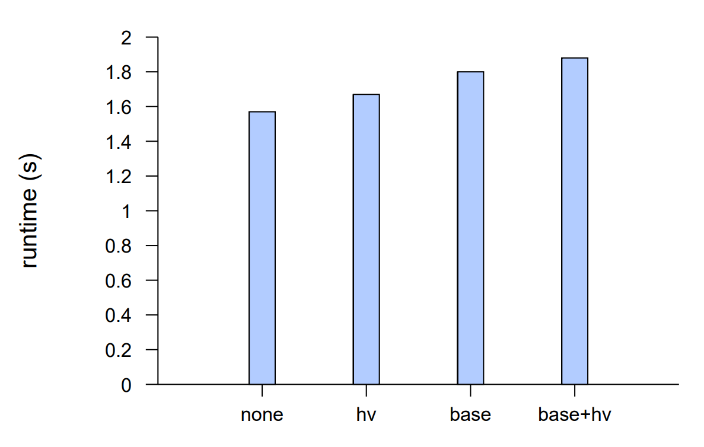
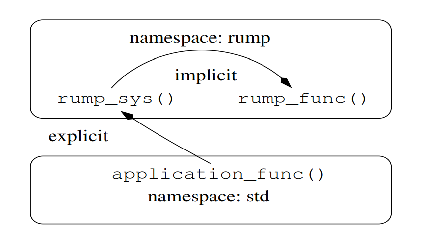
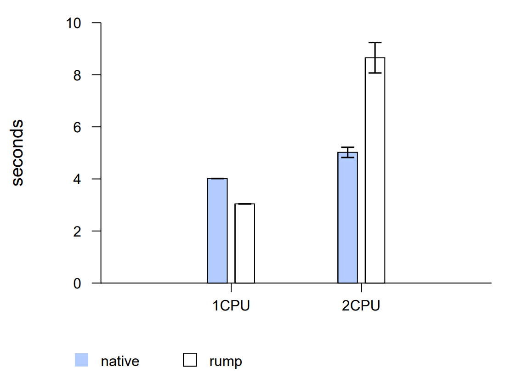
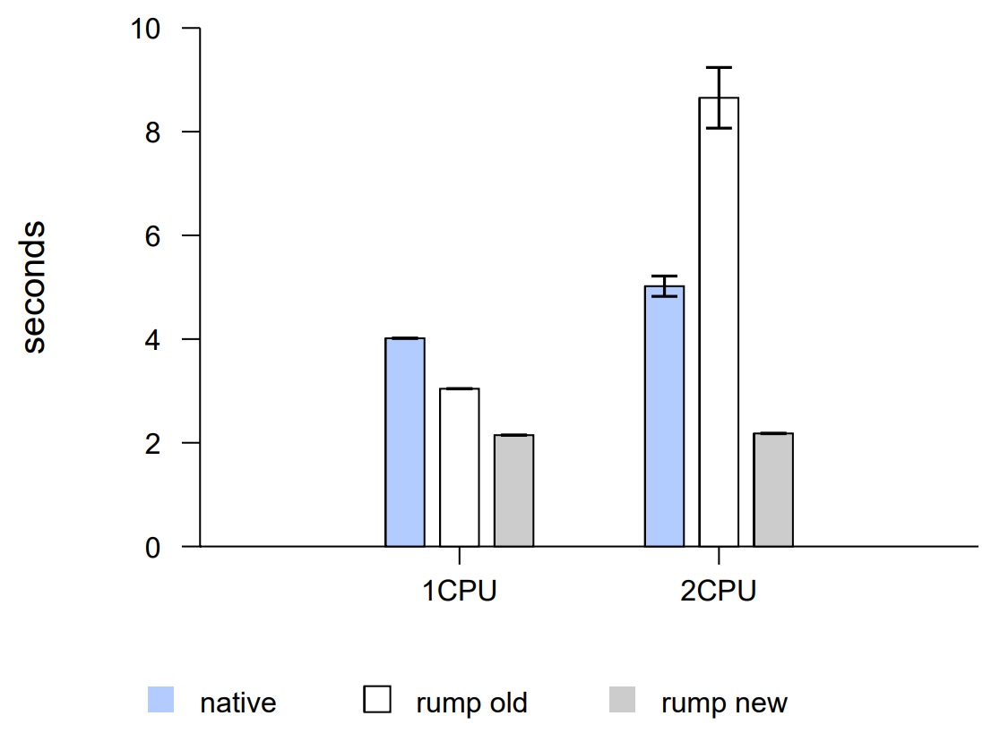

# 3 Implementation: Anykernel and Rump Kernels

The previous chapter discussed the concept of an anykernel and rump kernels. This chapter describes the code level modifications that were necessary for a production quality implementation on NetBSD. The terminology used in this chapter is mainly that of NetBSD, but the concepts apply to other similar operating systems as well.

In this chapter we reduce the number of variables in the discussion by limiting our examination to rump kernels and their clients running on a NetBSD host. See the next chapter (Chapter 4) for discussion on rump kernels and their clients running on hosts beyond NetBSD userspace.

## 3.1 Kernel Partitioning

As mentioned in Section 2.1.2, to maximize the lightweight nature of rump kernels, the kernel code was several logical layers: a base, three factions (dev, net and vfs) and drivers. The factions are orthogonal, meaning they do not depend on each other. Furthermore, the base does not depend on any other part of the kernel. The modifications we made to reach this goal of independence are described in this section.

As background, it is necessary to recall how the NetBSD kernel is linked. In C linkage, symbols which are unresolved at compile-time must be satisfied at binary linktime. For example, if a routine in file1.c wants to call myfunc() and myfunc() is not present in any of the object files or libraries being linked into a binary, the linker flags an error. A monolithic kernel works in a similar fashion: all symbols must be resolved when the kernel is linked. For example, if an object file with an unresolved symbol to the kernel’s pathname lookup routine namei() is included, then either the symbol namei must be provided by another object file being linked, or the calling source module must be adjusted to avoid the call. Both approaches are useful for us and the choice depends on the context.

We identified three obstacles for having a partitioned kernel:

1. Compile-time definitions (#ifdef) indicating which features are present in the kernel. Compile-time definitions are fine within a component, but do not work between components if linkage dependencies are created (for example a cross-component call which is conditionally included in the compilation).
2. Direct references between components where we do not allow them. An example is a reference from the base to a faction.
3. Multiclass source modules contain code which logically belongs in several components. For example, if the same file contains routines related to both file systems and networking, it belongs in this problem category.

Since our goal is to change the original monolithic kernel and its characteristics as little as possible, we wanted to avoid heavy approaches in addressing the above problems. These approaches include but are not limited to converting interfaces to be called only via pointer indirection. Instead, we observed that indirect interfaces were already used on most boundaries (e.g. struct fileops, struct protosw, etc.) and we could concentrate on the exceptions. Code was divided into functionality groups using source modules as boundaries.

The two techniques we used to address problems are as follows:

1. code moving. This solved cases where a source module belonged to several classes. Part of the code was moved to another module. This technique had to be used sparingly since it is very intrusive toward other developers who have outstanding changes in their local trees. However, we preferred moving over splitting a file into several portions using #ifdef, as the final result is clearer to anyone looking at the source tree. <br>
In some cases code, moving had positive effects beyond rump kernels. One such example was splitting up sys/kern/init_sysctl.c, which had evolved to include sysctl handlers for many different pieces of functionality. For example, it contained the routines necessary to retrieve a process listing. Moving the process listing routines to the source file dealing with process management (sys/kern/kern_proc.c) not only solved problems with references to factions, but also grouped related code and made it easier to locate. <br> _
2. function pointers. Converting direct references to calls via function pointers removes link-time restrictions. A function pointer gets a default value at compile time. Usually this value is a stub indicating the requested feature is not present. At runtime the pointer may be adjusted to point to an actual implementation of the feature if it is present.

Previously, we also used weak symbol aliases sparingly to provide stub implementations which were overridden by the linker if the component providing the actual implementation was linked. Weak aliases were found to be problematic with dynamically linked libraries on some userspace platforms, e.g. Linux with glibc. In lazy binding, a function is resolved by the dynamic linker only when the function is first called, so as to avoid long program startup times due to resolving symbols which are never used at runtime. As a side-effect, lazy binding theoretically allows dlopen()’ing libraries which override weak aliases as long as the libraries are loaded before the overridden functions are first called. Namely, in the case of rump kernels, loading must take place before rump_init() is called. However, some dynamic linkers treat libraries loaded with dlopen() different from ones loaded when the binary is executed. For example, the aforementioned glibc dynamic linker overrides weak aliases with symbols from dlopen()’d libraries only if the environment variable LD_DYNAMIC_WEAK is set. With some other dynamic linkers, overriding weak symbols is not possible at all. Part of the power of rump kernels is the ability to provide a single binary which dynamically loads the necessary components at runtime depending on the configuration or command line parameters. Therefore, to ensure that rump kernels work the same on all userspace platforms, we took the extra steps necessary to remove uses of weak aliases and replace them with the above-mentioned two techniques.

To illustrate the problems and our necessary techniques, we discuss the modifications to the file sys/kern/kern_module.c. The source module in question provides support for loadable kernel modules (discussed further in Section 3.8.1). Originally, the file contained routines both for loading kernel modules from the file system and for keeping track of them. Having both in one module was a valid possibility before the anykernel faction model. In the anykernel model, loading modules from a file system is VFS functionality, while keeping track of the modules is base functionality.

To make the code comply with the anykernel model, we used the code moving technique to move all code related to file system access to its own source file in kern_module_vfs.c. Since loading from a file system must still be initiated by the kernel module management routines, we introduced a function pointer interface. By default, it is initialized to a stub:

```c
int (*module_load_vfs_vec)(const char *, int, bool, module_t *,
                            prop_dictionary_t *) = (void *)eopnotsupp;
```

If VFS is present, the routine module_load_vfs_init() is called during VFS subsystem init after the vfs_mountroot() routine has successfully completed to set the value of the function pointer to module_load_vfs(). In addition to avoiding a direct reference from the base to a faction in rump kernels, this pointer has another benefit: during bootstrap it protects the kernel from accidentally trying to load kernel modules from the file system before the root file system has been mounted <sup>2</sup>.

> <sup>2</sup> `sys/kern/vfs_subr.c rev 1.401`

### 3.1.1 Extracting and Implementing

We have two methods for providing functionality in the rump kernel: we can extract  it out of the kernel sources, meaning we use the source file as such, or we can implement it, meaning that we do an implementation suitable for use in a rump kernel. We work on a source file granularity level, which means that either all of an existing source file is extracted, or the necessary routines from it (which may be all of them) are implemented. Implemented source files are placed under sys/rump, while extracted ones are picked up by Makefiles from other subdirectories under sys/.

The goal is to extract as much as possible for the features we desire, as to minimize implementation and maintenance effort and to maximize the semantic correctness of the used code. Broadly speaking, there are three cases where extraction is not possible.

1. code that does not exist in the regular kernel: this means drivers specific to rump kernels. Examples include anything using rump hypercalls, such as the virtual block device driver.
2. code dealing with concepts not supported in rump kernels. An example is the virtual memory fault handler: when it is necessary to call a routine which in a regular kernel is invoked from the fault hander, it must be done from implemented code.
It should be noted, though, that not all VM code should automatically be disqualified from extraction. For instance, VM readahead code is an algorithm which does not have anything per se to do with virtual memory, and we have extracted it from sys/uvm/uvm_readahead.c.
3. bypassed layers such as scheduling. They need different handling.

In some cases a source module contained code which was desirable to be extracted, but it was not possible to use the whole source module because others parts were not suitable for extraction. Here we applied the code moving technique. As an example, we once again look at the code dealing with processes (kern_proc.c). The source module contained mostly process data structure management routines, e.g. the routine for mapping a process ID number (pid_t) to the structure describing it (struct proc *). We were interested in being able to extract this code. However, the same file also contained the definition of the lwp0 variable. Since that definition included references to the scheduler (“concept not supported in a rump kernel”), we could not extract the file as such. However, after moving the definition of lwp0 to kern_lwp.c, where it arguably belongs, kern_proc.c could be extracted.

### 3.1.2 Providing Components

We provide components as libraries. The kernel base library is called librump and the hypervisor library is called librumpuser. The factions are installed with the names librumpdev, librumpnet and librumpvfs for dev, net and vfs, respectively. The driver components are named with the pattern librump<faction>_driver, e.g. librumpfs_nfs (NFS client driver). The faction part of the name is an indication of what type of driver is in question, but it does not convey definitive information on what the driver’s dependencies are. For example, consider the NFS client: while it is a file system driver, it also depends on networking.


Figure 3.1: Performance of position independent code (PIC). A regular kernel is compiled as non-PIC code. This compilation mode is effectively the same as “none” in the graph. If the hypervisor and rump kernel base use PIC code, the execution time increases as is expected. In other words, rump kernels allow to make a decision on the tradeoff between execution speed and memory use.

Two types of libraries are available: static and dynamic. Static libraries are linked by the toolchain into the binary, while dynamic binaries are linked at runtime. Commonly, dynamic linking is used with shared libraries compiled as position independent code (PIC), so as to allow one copy of a library to be resident in memory and be mapped into an arbitrary number of programs. Rump kernels support both types of libraries, but it needs to be noted that dynamic linking depends on the host supporting that runtime feature. It also need to be noted that while shared libraries save memory in case they are needed more than once, they have inherently worse performance due to indirection [21]. Figure 3.1 illustrates that performance penalty by measuring the time it takes to create and disband 300k threads in a rump kernel. As can be deduced from the combinations, shared and static libraries can be mixed in a single rump kernel instance so as to further optimize the behavior with the memory/CPU tradeoff.

## 3.2 Running the Kernel in an Hosted Environment

Software always runs on top of an entity which provides the interfaces necessary for the software to run. A typical operating system kernel runs on top of hardware and uses the hardware’s “interfaces” to fulfill its needs. When running on top a hardware emulator the emulator provides the same hardware interfaces. In a paravirtualized setup the hypervisor provides the necessary interfaces. In a usermode OS setup, the application environment of the hosting OS makes up the hypervisor. In this section we discuss details related to hosting a rump kernel in any environment. We use POSIX userspace as the case for the bulk of the discussion, since that host induces the superset of issues related to hosting rump kernels.

### 3.2.1 C Symbol Namespaces

In the regular case, the kernel and userspace C namespaces are disjoint. Both the kernel and application can contain the same symbol name, for example printf, without a collision occurring. When we run the kernel in a process container, we must take care to preserve this property. Calls to printf made by the client still need to go to libc, while calls to printf made by the rump kernel need to be handled by the in-kernel implementation.

Single address space operating systems provide a solution [12], but require a different calling convention. On the other hand, C preprocessor macros were used by OSKit [18] to rename conflicting symbols and allow multiple different namespaces to be linked together. UML [16] uses a variant of the same technique and renames colliding symbols using a set of preprocessor macros in the kernel build Makefile, e.g. -Dsigprocmask=kernel_sigprocmask. This manual renaming approach is inadequate for a rump kernel; unlike a usermode OS kernel which is an executable application, a rump kernel is a library which is compiled, shipped, and may be linked with any other libraries afterwards. This set of libraries is not available at compile time and therefore we cannot know which symbols will cause conflicts at link time. Therefore, the only option is to assume that any symbol may cause a conflict.


Figure 3.2: C namespace protection. When referencing a rump kernel symbol from outside of the rump kernel, the prefix must be explicitly included in the code. All references from inside the rump kernel implicitly contain the prefix due to bulk symbol renaming. Corollary: it is not possible to access a symbol outside the rump kernel namespace from inside the rump kernel without using a hypercall.

We address the issue by protecting all symbols within the rump kernel. The objcopy utility’s rename functionality is used ensure that all symbols within the rump kernel have a prefix starting with “rump” or “RUMP”. Symbol names which do not begin with “rump” or “RUMP” are renamed to contain the prefix “rumpns ”. After renaming, the kernel printf symbol will be seen as rumpns_printf by the linker. Prefixes are illustrated in Figure 3.2: callers outside of a rump kernel must include the prefix explicitly, while the prefix for routines inside a rump kernel is implicit since it is automatically added by objcopy. Table 3.1 illustrates further by providing examples of the outcome of renaming.

However, renaming all symbols also creates a problem. Not all symbols in a kernel object file come from kernel source code. Some symbols are a property of the toolchain. An example is _GLOBAL_OFFSET_TABLE_, which is used by position independent code to store the offsets. Renaming toolchain-generated symbols causes failures, since the toolchain expects to find symbols where it left them.

| rump kernel object | original symbol name | symbol after renaming |
| ------------------ | -------------------- | --------------------- |
| yes                | rump_sys_call        | rump_sys_call         |
| yes                | printf               | rumpns_printf         |
| no                 | rump_sys_call        | rump_sys_call         |
| no                 | printf               | printf                |

Table 3.1: Symbol renaming illustrated. Objects belonging to a rump kernel have their exported symbols and symbol dereferences renamed, if necessary, so that they are inside the rump kernel namespace. Objects which do not belong to a rump kernel are not affected.

We observed that almost all of the GNU toolchain’s symbols are in the double underscore namespace “ ”, whereas the NetBSD kernel exported under 10 symbols in that namespace. The decision was to rename existing kernel symbols in the double underscore namespace to a single underscore namespace and exclude the double underscore namespace from the rename. There were two exceptions to the double underscore rule which had to be excluded from the rename as well: _GLOBAL_OFFSET_TABLE_ and architecture specific ones. We handle the architecture specific ones with a quirk table. There is one quirk each for PA-RISC, MIPS, and PowerPC64. For example, the MIPS toolchain generates the symbol _gp_disp, which needs to be excluded from the renaming. Experience of over 5 years shows that once support for an architecture is added, no maintenance is required.

We conclude mass renaming symbols is a practical and feasible solution for the symbol collision problem which, unlike manual renaming, does not require knowledge of the set of symbols that the application namespace exports.

### 3.2.2 Privileged Instructions

Kernel code dealing with for example the MMU may execute CPU instructions which are available only in privileged mode. Executing privileged instructions while in non-privileged mode should cause a trap and the host OS or VMM to take control. Typically, this trap will result in process termination.

Virtualization and CPU emulation technologies solve the problem by not executing privileged instructions on the host CPU in unprivileged mode. For example, paravirtualized Xen [3] uses hypercalls, User Mode Linux [16] does not use privileged instructions in the usermode machine dependent code, QEMU [5] handles such instructions in the machine emulator, and CPU virtualization extensions trap the handling of those instructions to the hypervisor.

In practice kernel drivers do not use privileged instructions because they are found only in the architecture specific parts of the kernel. Therefore, we can solve the problem by defining that it does not exist in our model — if there are any it is a failure in modifying the OS to support rump kernels.

### 3.2.3 The Hypercall Interface(s)

The hypercall interfaces allow a rump kernel to access host platform resources and integrate with the host. For example, page level memory allocation and the blocking and running of threads is accomplished via the hypercall interface. Essentially, the hypercall interface represents the minimal interface for running kernel drivers. As we shall see later in Section 4.2, transitively the hypercall interface is also the minimal interface for running POSIX applications. Notably, the Embassies project [25] investigated a minimal execution interface for applications, and ended up with a similar interface, thereby increasing our confidence in our result being correct.

Historically, all hypercalls were globally implemented by a single library. This was found to be inflexible for I/O devices for two reasons:

* Different I/O devices have different requirements. Imagine the hypercalls for a network interface necessary to send and receive packets. If you imagined a PCI network interface card, the necessary hypercalls are completely different from if you imagined /dev/tap or netmap [50]. With a growing number of different I/O devices being supported, codifying the different requirements under a compact, fast and understandable interface was not seen to be reasonably possible.
* Not all platforms require all I/O devices to be supported. Globally pooling all hypercalls together obfuscates what is the minimal required set of hypercall functionality to run rump kernel on a given platform with a given set of I/O devices.

Therefore, there are now two types of hypercalls: main hypercalls, which are always required by every rump kernel, and I/O hypercalls, which allow given types of I/O drivers to operate. The main hypercall interface is a single, stable and versioned interface. The I/O hypercalls are private to the I/O bus or the I/O driver, and an implementation is required only if the component using the hypercall is linked into the rump kernel. The versioning of I/O hypercalls and changes to them are up to individual drivers, and for example over the course of optimizing networking packet processing performance, we made several tweaks to the hypercalls used by the virtual packet I/O drivers (Section 3.9.1). These changes provided for example the ability to deliver packets in bursts and zero-copy processing. For the remainder of this section we will describe the main hypercall interface.

#### Main hypercalls

For the historical reason of rump kernels initially running in userspace, the hypercall interface is called rumpuser ; for example rumphyper would be a more descriptive name, but changing it now brings unnecessary hassle. The version of the hypercall revision we describe here is 17. In reality, version 17 means the second stable rendition of the interface, as during initial development the interface was changed frequently and the version was bumped often. The canonical implementation for the interface is the POSIX platform implementation, currently found from lib/librumpuser in the NetBSD tree. Implementations for other platforms are found from http://repo.rumpkernel.org/, and also from 3rd parties.

As an example of a hypercall, we consider allocating memory from the host. A hypercall is the only way that a rump kernel can allocate memory at runtime. Notably, though, in the fastpath case the hypercall is used to allocate page-sized chunks of memory, which are then dosed out by the pool and slab allocators in the rump kernel. The signature of the memory allocation hypercall is the following:

```c
int rumpuser_malloc(size_t howmuch, int alignment, void **retp);
```

If a hypercall can fail, its return type is int, and it returns 0 for success or an error code. If a hypercall cannot fail, it is of type void. If successful, the memory allocation hypercall will have allocated howmuch bytes of memory and returns a pointer to that memory in retp. The pointer is guaranteed to be aligned to alignment bytes. For example on POSIX the implementation of this interface is a call to posix_memalign() or equivalent.

The header file sys/rump/include/rump/rumpuser.h defines the hypercall interface. All hypercalls by convention begin with the string “rumpuser”. This naming convention prevents hypercall interface references in the rump kernel from falling under the jurisdiction of symbol renaming and hence the hypercalls are accessible from the rump kernel.

The hypercalls required to run rump kernels can be categorized into the following groups:

* initialization: bootstrap the hypercall layer and check that the rump kernel hypercall version matches a version supported by the hypercall implementation. This interface is called as the first thing when a rump kernel initializ
* memory management: allocate aligned memory, free
* thread management: create and join threads, TLS access
* synchronization routines: mutex, read/write lock, condition variable.
* time management: get clock value, suspend execution of calling thread for the specified duration
* exit: terminate the platform. Notably, in some cases it is not possible to implement this fully, e.g. on bare metal platforms without software power control. In that case, a best effort approximation should be provided.

There are also a number of optional hypercalls, which are not strictly speaking required in all cases, but are nevertheless part of core functionality:

* errno handling: If system calls are to be made, the hypervisor must be able to set a host thread-specific errno so that the client can read it. Note: errno handling is unnecessary if the clients do not use the rump system call API.
* putchar: output character onto console. Being able to print console output is helpful for debugging purposes.
* printf: a printf-like call. see discussion below.

#### The Benefit of a printf-like Hypercall

The rumpuser_dprintf() call has the same calling convention as the NetBSD kernel printf() routine. It is used to write debug output onto the console, or elsewhere if the implementation so chooses. While the kernel printf() routine can be used to produce debug output via rumpuser_putchar(), the kernel printf routine inkernel locks to synchronize with other in-kernel consumers of the same interface. These locking operations may cause the rump kernel virtual CPU context to be relinquished, which in turn may cause inaccuracies in debug prints especially when hunting racy bugs. Since the hypercall runs outside of the kernel, and will not unschedule the current rump kernel virtual CPU, we found that debugging information produced by it is much more accurate. Additionally, a hypercall can be executed without a rump kernel context. This property was invaluable when working on the low levels of the rump kernel itself, such as thread management and CPU scheduling.

## 3.3 Rump Kernel Entry and Exit

As we discussed in Chapter 2, a client must possess an execution context before it can successfully operate in a rump kernel. These resources consist of a rump kernel process/thread context and a virtual CPU context. The act of ensuring that these resources have been created and selected is presented as pseudocode in Figure 3.3 and available as real code in sys/rump/librump/rumpkern/scheduler.c. We will discuss obtaining the thread context first.

Recall from Section 2.3 that there are two types of thread contexts: an implicit one which is dynamically created when a rump kernel is entered and a bound one which the client thread has statically set. We assume that all clients which are critical about their performance use bound threads.

The entry point rump_schedule() <sup>3</sup> starts by checking if the host thread has a bound rump kernel thread context. This check maps to consulting the host’s thread local storage with a hypercall. If a value is set, it is used and the entrypoint can move to scheduling a CPU.

> <sup>3</sup> rump_schedule() / rump_unschedule() are slight misnomers and for example rump_enter()
/ rump_exit() would be more descriptive. The interfaces are exposed to clients, so changing the
names is not worth the effort anymore.

In case an implicit thread is required, we create one. We use the system thread lwp0 as the bootstrap context for creating the implicit thread. Since there is only one instance of this resource, it must be locked before use. After a lock on lwp0 has been obtained, a CPU is scheduled for it. Next, the implicit thread is created and it is given the same CPU we obtained for lwp0. Finally, lwp0 is unlocked and servicing the rump kernel request can begin.

The exit point is the converse: in case we were using a bound thread, just releasing the CPU is enough. In case an implicit thread was used it must be released. Again, we need a thread context to do the work and again we use lwp0. A critical detail is noting the resource acquiry order which must be the same as the one used at the entry point. The CPU must be unscheduled before lwp0 can be locked. Next, a CPU must be scheduled for lwp0 via the normal path. Attempting to obtain lwp0 while holding on to the CPU may lead to a deadlock.

Instead of allocating and free’ing an implicit context at every entry and exit point, respectively, a possibility is to cache them. Since we assume that all performance conscious clients use bound threads, caching would add unwarranted complexity

```c
void
rump_schedule()
{
    struct lwp *lwp;

    if (__predict_true(lwp = get_curlwp()) != NULL) {
            rump_schedule_cpu(lwp);
    } else {
            lwp0busy();

            /* allocate & use implicit thread.  uses lwp0's cpu */
            rump_schedule_cpu(&lwp0);
            lwp = rump_lwproc_allocateimplicit();
            set_curlwp(lwp);

            lwp0rele();
    }
}

void
rump_unschedule()
{
    struct lwp *lwp = get_curlwp();

    rump_unschedule_cpu(lwp);
    if (__predict_false(is_implicit(lwp))) {
            lwp0busy();

            rump_schedule_cpu(&lwp0);
            rump_lwproc_releaseimplicit(lwp);

            lwp0rele();
            set_curlwp(NULL);
    }
}
```

Figure 3.3: Rump kernel entry/exit pseudocode. The entrypoint and exit point are rump_schedule() and rump_unschedule(), respectively. The assignment of a CPU and implicit thread context are handled here.

### 3.3.1 CPU Scheduling

Recall from Section 2.3.2 that the purpose of the rump kernel CPU scheduler is to map the currently executing thread to a unique rump CPU context. In addition to doing this mapping at the entry and exit points as described above, it must also be done around potentially blocking hypercalls as well. One reason for releasing the CPU around hypercalls is because the wakeup condition for the hypercall may depend on another thread being able to run. Holding on to the CPU could lead to zero available CPUs for performing a wakeup, and the system would deadlock.

The straightforward solution is to maintain a list of free virtual CPUs: allocation is done by taking an entry off the list and releasing is done by putting it back on the list. A list works well for uniprocessor hosts. However, on a multiprocessor system with multiple threads, a global list causes cache contention and lock contention. The effects of cache contention can be seen from Figure 3.4 which compares the wall time for executing 5 million getpid() calls per thread per CPU. This run was done 10 times, and the standard deviation is included in the graph (if it is not visible, it is practically nonexistent). The multiprocessor run took approximately three times as long as the uniprocessor one — doubling the number of CPUs made the normalized workload slower. To optimize the multiprocessor case, we developed an improved CPU scheduling algorithm.

#### Improved algorithm

The purpose of a rump kernel CPU scheduling algorithm is twofold. First, it ensures that at most one thread is using the CPU at any point in time. Second, it ensures that cache coherency is upheld. We dissect the latter point further. On a physical system, when thread A relinquishes a CPU and thread B is scheduled onto the same CPU, both threads will run on the same physical CPU, and therefore all data they see in the CPU-local cache will trivially be coherent. In a rump kernel, when host thread A relinquishes the rump kernel virtual CPU, host thread B may acquire the same rump kernel virtual CPU on a different physical CPU. Unless the physical CPU caches are properly updated, thread B may see incorrect data. The simple way to handle cache coherency is to do a full cache update at every scheduling point. However, a full update is wasteful in the case where a host thread is continuously scheduled onto the same rump kernel virtual CPU.


Figure 3.4: System call performance using the trivial CPU scheduler. While a system call into the rump kernel is faster in a single-threaded process, it is both jittery and slow for a multithreaded process. This deficiency is something we address with the advanced rump kernel CPU scheduler presented later.

The improved algorithm for CPU scheduling is presented as pseudocode in Figure 3.5. It is available as code in sys/rump/librump/rumpkern/scheduler.c. The scheduler is optimized for the case where the number of active worker threads is smaller than the number of configured virtual CPUs. This assumption is reasonable for rump kernels, since the amount of virtual CPUs can be configured based on each individual application scenario.

The fastpath is taken in cases where the same thread schedules the rump kernel consecutively without any other thread running on the virtual CPU in between. The fastpath not only applies to the entry point, but also to relinquishing and rescheduling a CPU during a blocking hypercall. The implementation uses atomic operations to minimize the need for memory barriers which are required by full locks.

Next, we offer a verbose explanation of the scheduling algorithm.

1. Use atomic compare-and-swap (CAS) to check if we were the previous thread to be associated with the CPU. If that is the case, we have locked the CPU and the scheduling fastpath was successful.
2. The slow path does a full mutex lock to synchronize against another thread releasing the CPU. In addition to enabling a race-free sleeping wait, using a lock makes sure the cache of the physical CPU the thread is running on is up-to-date.
3. Mark the CPU as wanted with an atomic swap. We examine the return value and if we notice the CPU was no longer busy at that point, try to mark it busy with atomic CAS. If the CAS succeeds, we have successfully scheduled the CPU. We proceed to release the lock we took in step 2. If the CAS did not succeed, check if we want to migrate the lwp to another CPU.
4. In case the target CPU was busy and we did not choose to migrate to another CPU, wait for the CPU to be released. After we have woken up, loop and recheck if the CPU is available now. We must do a full check to prevent races against a third thread which also wanted to use the CPU.

```c
void
schedule_cpu()
{
        struct lwp *lwp = curlwp;

        /* 1: fastpath */
        cpu = lwp->prevcpu;
        if (atomic_cas(cpu->prevlwp, lwp, CPU_BUSY) == lwp)
                return;

        /* 2: slowpath */
        mutex_enter(cpu->mutex);
        for (;;) {
                /* 3: signal we want the CPU */
                old = atomic_swap(cpu->prevlwp, CPU_WANTED);
                if (old != CPU_BUSY && old != CPU_WANTED) {
                        membar();
                        if (atomic_cas(cpu->prevlwp, CPU_WANTED, CPU_BUSY) == CPU_WANTED) {
                                break;
                        }
                }
                newcpu = migrate(lwp, cpu);
                if (newcpu != cpu) {
                        continue;
                }

                /* 4: wait for CPU */
                cpu->wanted++;
                cv_wait(cpu->cv, cpu->mutex);
                cpu->wanted--;
        }
        mutex_exit(cpu->mutex);
        return;
}
```

Figure 3.5: CPU scheduling algorithm in pseudocode. See the text for a detailed description.

Releasing a CPU requires the following steps. The pseudocode is presented in Figure 3.6. The fastpath is taken if no other thread wanted to take the CPU while the current thread was using it.

1. Issue a memory barrier: even if the CPU is currently not wanted, we must perform this step. <br>
In more detail, the problematic case is as follows. Immediately after we release the rump CPU, the same rump CPU may be acquired by another hardware thread running on another physical CPU. Although the scheduling operation must go through the slowpath, unless we issue the memory barrier before releasing the CPU, the releasing CPU may have cached data which has not reached global visibility. <br> _
2. Release the CPU with an atomic swap. The return value of the swap is used to determine if any other thread is waiting for the CPU. If there are no waiters for the CPU, the fastpath is complete. <br> _
3. If there are waiters, take the CPU lock and perform a wakeup. The lock necessary to avoid race conditions with the slow path of schedule_cpu().

```c
void
unschedule_cpu()
{
        struct lwp *lwp = curlwp;

        /* 1: membar */
        membar();

        /* 2: release cpu */
        old = atomic_swap(cpu->prevlwp, lwp);
        if (old == CPU_BUSY) {
                return;
        }

        /* 3: wake up waiters */
        mutex_enter(cpu->mutex);
        if (cpu->wanted)
                cv_broadcast(cpu->cv);
        mutex_exit(cpu->mutex);
        return;
}
```

Figure 3.6: CPU release algorithm in pseudocode. See the text for a detailed description.


Figure 3.7: System call performance using the improved CPU scheduler. The advanced rump kernel CPU scheduler is lockless and cache conscious. With it, simultaneous system calls from multiple threads are over twice as fast as against the host kernel and over four times as fast as with the old scheduler.

#### Performance

The impact of the improved CPU scheduling algorithm is shown in Figure 3.7. The new algorithm performs four times as good as the freelist algorithm in the dual CPU multithreaded case. It also performs twice as fast as a host kernel system call. Also, there is scalability: the dual CPU case is within 1% of the performance of the single CPU case — native performance is 20% weaker with two CPUs. Finally, the jitter we set out to eliminate has been eliminated.

#### CPU-bound lwps

A CPU-bound lwp will execute only on a specific CPU. This functionality is required for example for delivering a clock interrupt on every virtual CPU. Any lwp which is bound to a certain rump kernel virtual CPU simply has migration disabled. This way, the scheduler will always try to acquire the same CPU for the thread.

#### Scheduler Priorities

The assumption is that a rump kernel is configured with a number of virtual CPUs which is equal or greater to the number of frequently executing threads. Despite this configuration, a rump kernel may run into a situation where there will be competition for virtual CPUs. There are two ways to approach the issue of deciding in which order threads should be given a rump CPU context: build priority support into the rump CPU scheduler or rely on host thread priorities.

To examine the merits of having priority support in the rump CPU scheduler, we consider the following scenario. Thread A has higher priority than thread B in the rump kernel. Both are waiting for the same rump kernel virtual CPU. Even if the rump CPU scheduler denies thread B entry because the higher priority thread A is waiting for access, there is no guarantee that the host schedules thread A before thread B could theoretically run to completion in the rump kernel. By this logic, it is better to let host priorities dictate, and hand out rump kernel CPUs on a first-come-first-serve basis. Therefore, we do not support thread priorities in the rump CPU scheduler. It is the client’s task to call pthread_setschedparam() or equivalent if it wants to set a thread’s priority.

### 3.3.2 Interrupts and Soft Interrupts

As mentioned in Section 2.3.3, a rump kernel CPU cannot be preempted. The mechanism of how an interrupt gets delivered requires preemption, so we must examine that we meet the requirements of both hardware interrupts and soft interrupts. Hardware interrupt handlers are typically structured to only do a minimal amount of work for acknowledging the hardware. They then schedule the bulk work to be done in a soft interrupt (softint) handler at a time when the OS deems suitable.

As mentioned in Section 2.3.3, we implement interrupts as threads which schedule a rump kernel CPU, run the handler, and release the CPU. The only difference to a regular system is that interrupts are scheduled instead of preempting the CPU.

Softints in NetBSD are almost like regular threads. However, they have a number of special properties to keep scheduling and running them cheap:

1. Softints are run by level (e.g. networking and clock). Only one softint per level per CPU may be running, i.e. softints will run to finish before the next one may be started. Multiple outstanding softints will be queued until the currently running one has finished.
2. Softints may block briefly to acquire a short-term lock (mutex), but may not sleep. This property is a corollary of the previous property.
3. Softint handlers must run on the same CPU they were scheduled to. By default, softints are scheduled on the calling CPU. However, to distribute interrupt load, NetBSD also allows scheduling softints to other CPUs. Regardless, once the handler has been scheduled, it runs entirely on the scheduled CPU.
4. A softint may run only after the hardware interrupt finishes. That is to say, the softint handler may not run immediately after it is scheduled, only when the hardware interrupt handler that scheduled it has completed execution.

Although in a rump kernel even “hardware” interrupts are already scheduled, a fair amount of code in NetBSD assumes that softint semantics are supported. For example, the callout framework [9] schedules soft interrupts from hardware clock interrupts to run periodic tasks (used e.g. by TCP timers).

The users of the kernel softint facility expect them to operate exactly according to the principles we listed. Initially, for simplicity, softints were implemented as regular threads. The use of regular threads resulted in a number of problems. For example, when the Ethernet code schedules a soft interrupt to do IP level processing for a received frame, code first schedules the softint and only later adds the frame to the processing queue. When softints were implemented as regular threads, the host could run the softint thread before the Ethernet interrupt handler had put the frame on the processing queue. If the softint ran before the packet was queued, the packet would not be handled until the next incoming packet.

Soft interrupts are implemented in sys/rump/librump/rumpkern/intr.c. The NetBSD implementation was not usable for rump kernels since that implementation is based on interaction with the NetBSD scheduler. Furthermore, the NetBSD implementation uses interprocess interrupts (IPIs) to schedule softints onto other CPUs. Rump kernels do not have interrupts or interprocessor interrupts. Instead, a helper thread is used. When scheduling a softint onto another rump kernel CPU, the helper thread schedules itself onto that virtual CPU and schedules the softint like for a local CPU. While that approach is not as performant as using IPIs, our assumption is that in high-performance computing the hardware interrupt is already scheduled onto the CPU where the work should be handled, thereby making the cost of scheduling a softint onto another CPU a non-issue.