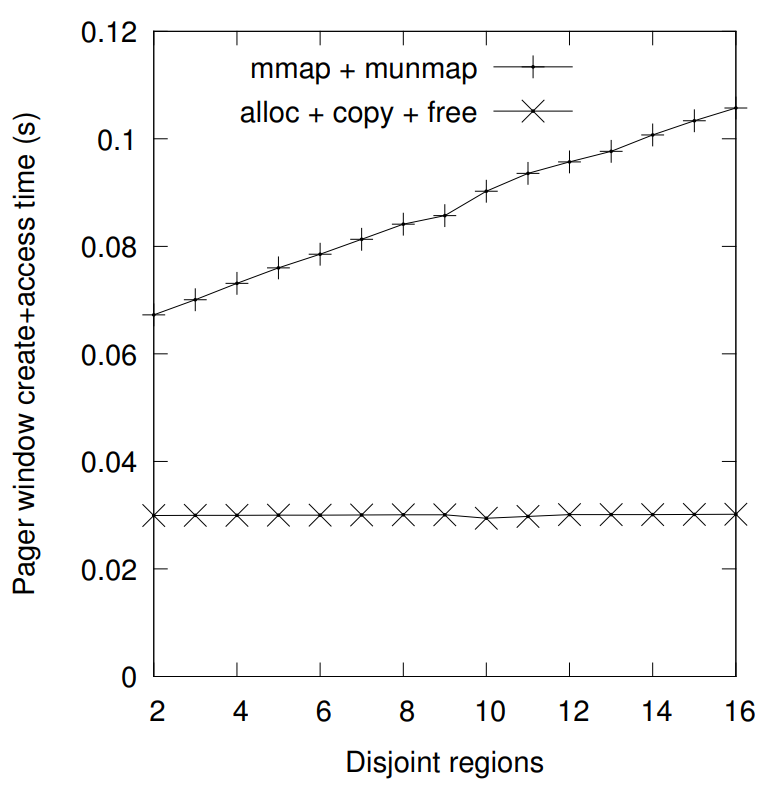
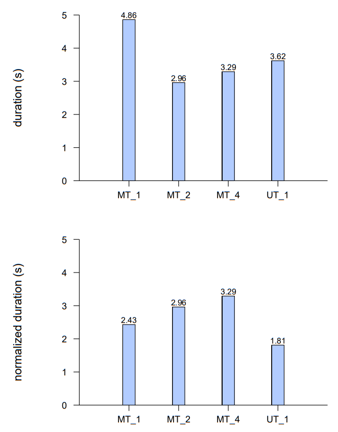

## 3.4 Virtual Memory Subsystem

The main purpose of the NetBSD virtual memory subsystem is to manage memory address spaces and the mappings to the backing content [10]. While the memory address spaces of a rump kernel and its clients are managed by their respective hosts, the virtual memory subsystem is conceptually exposed throughout the kernel. For example, file systems are tightly built around being able to use virtual memory subsystem data structures to cache file data. To illustrate, consider the standard way the kernel reads data from a file system: memory map the file, access the mapped range, and possibly fault in missing data [51].

Due to the design choice that a rump kernel does not use (nor require) a hardware MMU, the virtual memory subsystem implementation is different from the regular NetBSD VM. As already explained in Section 2.4, the most fundamental difference is that there is no concept of page protection or a page fault inside the rump kernel.

The details of the rump kernel VM implementation along with their implications are described in the following subsections. The VM is implemented in the source module sys/rump/librump/rumpkern/vm.c. Additionally, routines used purely by the file system faction are in sys/rump/librump/rumpvfs/vm_vfs.c.

### Pages

When running on hardware, the pages described by the struct vmpage data structure correspond with hardware pages <sup>4</sup> . Since the rump kernel does not interface with the MMU, the size of the memory page is merely a programmatical construct: the kernel hands out physical memory in multiples of the page size. In a rump kernel this memory is allocated from the host and since there is no memory protection or faults, the page size can in practice be any power of two within a sensible size range. However, so far there has been no reason to use anything different than the page size for the machine architecture the rump kernel is running on.

> <sup>4</sup> This correspondence is not a strict rule. For example the NetBSD VAX port uses clusters of 512 byte contiguous hardware pages to create logical 4kB pages to minimize management overhead.

The VM tracks status of when a page was last used. It does this tracking either by asking the MMU on CPU architectures where that is supported, e.g. i386, or by using memory protection and updating the information during page faults on architectures where it is not, e.g. alpha. This information is used by the page daemon during memory shortages to decide which pages are best suited to be paged to secondary storage so that memory can be reclaimed for other purposes. Instead of requiring a MMU to keep track of page usage, we observe that since memory pages allocated from a rump kernel cannot be mapped into a client’s address space, the pages are used only in kernel code. Every time kernel code wants to access a page, it does a lookup for it using uvm_pagelookup(), uses it, and releases the reference. Therefore, we hook usage information tracking to the lookup routine: whenever a lookup is done, the page is deemed as accessed.

### 3.4.1 Page Remapping

In practice, the kernel does not map physical pages in driver code. However, there is one exception we are interested in: the file system independent vnode pager. We will explain the situation in detail. The pages associated with a vnode object are cached in memory at arbitrary memory locations [51]. Consider a file which is the size of three memory pages. The content for file offset 0x0000-0x0FFF might be in page X, 0x1000-0x1FFF in page X-1 and 0x2000-0x2FFF in page X+1. In other words, reading and writing a file is a scatter-gather operation with respect to memory addresses. When the standard vnode pager (sys/miscfs/genfs/genfs_io.c) writes contents from memory to backing storage, it first maps all the pages belonging to the appropriate offsets in a continuous memory address by calling uvm_pagermapin(). This routine in turn uses the pmap interface to request the MMU to map the physical pages to the specified virtual memory range in the kernel’s address space. After this step, the vnode pager performs I/O on this pager window. When I/O is complete, the pager window is unmapped. Reading works essentially the same way: pages are allocated, mapped into a contiguous window, I/O is performed, and the pager window is unmapped.

To support the standard NetBSD vnode pager with its remapping feature, there are three options for dealing with uvm_pagermapin():

1. Create the window by allocating a new block of contiguous anonymous memory and use memory copy to move the contents. This approach works because pages are unavailable to other consumers during I/O; otherwise e.g. write() at an inopportune time might cause a cache flush to write half old half new contents and cause a semantic break.
2. Modify the vnode pager to issue multiple I/O requests in case the backing pages for a vnode object are not at consecutive addresses.
3. Accept that memory remapping support is necessary in a rump kernel.

It should be noted that a fourth option is to implement a separate vnode pager which does not rely on mapping pages. This option was our initial approach. While the effort produced a superficially working result, we could not get all corner cases to function exactly the same as with the regular kernel — for example, the VOP_GETPAGES() interface implemented by the vnode pager takes 8 different parameters and 14 different flags. The lesson learnt from this attempt with the vnode pager reflects our premise for the entire work: it is easy to write superficially working code, but getting all corner cases right for complicated drivers is extremely difficult.

So, which of the three options is the best? When comparing the first and the second option, the principle used is that memory I/O is several orders of magnitude faster than device I/O. Therefore, anything which affects device I/O should be avoided, especially if it might cause extra I/O operations and thus option 1 is preferable over option 2.


Figure 3.8: Performance of page remapping vs. copying. Allocating a
pager window from anonymous memory and copying file pages to it for the purpose of pageout by the vnode pager is faster than remapping memory backed by a file. Additionally, the cost of copying is practically independent of the amount of noncontiguous pages. With remapping, each disjoint region requires a separate call to mmap().

To evaluate the first option against third option, let us ignore MMU-less environments where page remapping is not possible, and consider an environment where it is possible albeit clumsy: userspace. Usermode operating systems typically use a memory mapped file to represent the physical memory of the virtual kernel [16, 17]. The file acts as a handle and can be mapped to the location(s) desired by the usermode kernel using the mmap() system call. The DragonFly usermode vkernel uses special host system calls to make the host kernel execute low level mappings [17].

We simulated pager conditions and measured the amount of time it takes to construct a contiguous 64kB memory window out of non-contiguous 4kB pages and to write the window out to a file backed by a memory file system. The result for 1000 loops as a function of non-contiguous pages is presented in Figure 3.8.

The conclusion is that without direct access to a MMU, page remapping is either slower than memory copy or impossible. The downside of memory copy is that in low-memory environments you need twice the amount of memory of the largest allowed pager window size. Furthermore, the pagedaemon (Section 3.4.3) needs the window’s worth of reserved memory to ensure that it is possible to flush out pages and release memory. The simple choice is to mitigate the problems by restricting the pager window size.

### 3.4.2 Memory Allocators

Although memory allocators are not strictly speaking part of the virtual memory subsystem, they are related to memory so we describe them here.

The lowest level memory allocator in NetBSD is the UVM kernel memory allocator (uvm_km). It is used to allocate memory on a pagelevel granularity. The standard implementation in sys/uvm/uvm_km.c allocates a virtual memory address range and, if requested, allocates physical memory for the range and maps it in. Since mapping is incompatible with a rump kernel, we did a straightforward implementation which allocates a page or contiguous page range with a hypercall.

The kmem, pool and pool cache allocators are general purpose allocators meant to be used by drivers. Fundamentally, they operate by requesting pages from uvm_km and handing memory out in requested size chunks. The flow of memory between UVM and the allocators is dynamic, meaning if an allocator runs out of memory, it will request more from UVM, and if there is a global memory shortage, the system will attempt to reclaim cached memory from the allocators. We have extracted the implementations for these allocators from the standard NetBSD kernel and provide them as part of the rump kernel base.

### 3.4.3 Pagedaemon

The NetBSD kernel uses idle memory for caching data. As long as free memory is available, it will be used for caching. NetBSD’s pagedaemon serves the purpose of pushing out unnecessary data to recycle pages when memory is scarce. A mechanism is required to keep long-running rump kernels from consuming all memory for caching. The choices are to either eliminate caching and free memory immediately after it has been used, or to create a pagedaemon which can operate despite memory access information not being available with the help of a MMU. Since eliminating caching is undesirable for performance reasons, we chose the latter option.

Typically, a system will have a specific amount of memory assigned to it. A straight forward example is a system running directly on hardware. While we could always require that the amount of memory be specified, that would introduce a default and configurable which is not always necessary. Since host memory is dynamically allocated using hypercalls, we can observe that in some cases we simply do not have to configure the amount of available memory. For example, short-lived test cases for kernel drivers running on a userspace host do not need one. For the rest of the discussion, we do assume that we have an “inflexible” use case and host, and do need to configure the amount of available memory.

When the available memory is close to being exhausted, the rump kernel invokes the pagedaemon, which is essentially a kernel thread, to locate and free memory resources which are least likely to be used in the near future. There are fundamentally two types of memory: pageable and wired.

* Pageable memory means that a memory page can be paged out. Paging is done using the pager construct that the NetBSD VM (UVM) inherited from the Mach VM [49] via the 4.4BSD VM. A pager has the capability to move the contents of the page in and out of secondary storage. NetBSD currently supports three classes of pagers: anonymous, vnode and device. Device pagers map device memory, so they can be left out of a discussion concerning RAM. We extract the standard UVM anonymous memory object implementation (sys/uvm/uvm_aobj.c) mainly because the tmpfs file system requires anonymous memory objects. However, we compile uvm_aobj.c without defining VMSWAP, i.e. the code for support moving memory to and from secondary is not included. Our view is that paging anonymous memory should be handled by the host. What is left is the vnode pager, i.e. moving file contents between the memory cache and the file system.
* Wired memory is non-pageable, i.e. it is always present and mapped. Still, it needs to be noted that the host can page memory which is wired in the rump kernel barring precautions such as a hypercall invoking mlock() — DMAsafe memory notwithstanding (Section 4.2.5), this paging has no impact on the rump kernel’s correctness. During memory shortage, the pagedaemon requests the allocators to return unused pages back to the system.

The pagedaemon is implemented in the uvm_pageout() routine in the source file sys/rump/librump/rumpkern/vm.c. The pagedaemon is invoked when memory use exceeds the critical threshold, and additionally when the memory allocation hypercall fails. The pagedaemon releases memory in stages, from the ones most likely to bring benefit to the least likely. The use case the pagedaemon was developed against was the ability to run file systems with a rump kernel with limited memory. Measurements showing how memory capacity affects file system performance are presented in Table 3.2.

Since all pages managed by the VM are dynamically allocated and free’d, shrinking the virtual kernel or allowing it to allocate more memory is trivial. It is done by adjusting the limit. Making the limit larger causes the pagedaemon to cease activity until future allocations cause the new limit to be reached. Making the limit smaller causes the pagedaemon to clear out cached memory until the smaller limit is satisfied. In contrast to the ballooning technique [56], a rump kernel will fully release pages and associated metadata when memory is returned to the host.

| rump kernel memory limit         | relative performance |
| -------------------------------- | -------------------- |
| 0.5MB                            | 50%                  |
| 1MB                              | 90%                  |
| 3MB                              | 100%                 |
| unlimited (host container limit) | 100%                 |

Table 3.2: File system I/O performance vs. available memory. If memory is extremely tight, the performance of the I/O system suffers. A few megabytes of rump kernel memory was enough to allow file I/O processing at full media speed.

#### Multiprocessor Considerations for the Pagedaemon

A rump kernel is more susceptible than a regular kernel to a single object using a majority of the available memory, if not all. This phenomenon exists because in a rump kernel it is a common scenario to use only one VM object at a time, e.g. a single file is being written/read via a rump kernel. In a regular kernel there minimally are at least a small number of active files due to various daemons and system processes running.

Having all memory consumed by a single object leads to the following scenario on a multiprocessor rump kernel:

1. A consumer running on CPU1 allocates memory and reaches the pagedaemon wakeup limit.
2. The pagedaemon starts running on CPU2 and tries to free pages.
3. The consumer on CPU1 consumes all available memory for a single VM object and must go to sleep to wait for more memory. It is still scheduled on CPU1 and has not yet relinquished the memory object lock it is holding.
4. The pagedaemon tries to lock the object that is consuming all memory. However, since the consumer is still holding the lock, the pagedaemon is unable to acquire it. Since there are no other places to free memory from, the pagedaemon can only go to a timed sleep and hope that memory and/or unlocked resources are available when it wakes up.

This scenario killed performance, since all activity stalled at regular intervals while the pagedaemon went to sleep to await the consumer going to sleep. Notably, in a virtual uniprocessor setup the above mentioned scenario did not occur, since after waking up the pagedaemon the consumer would run until it got to sleep. When the pagedaemon got scheduled on the CPU and started running, the object lock had already been released and the pagedaemon could proceed to free pages. To remedy the problem in virtual multiprocessor setups, we implemented a check to see if the object lock holder is running on another virtual CPU. If the pagedaemon was unable to free memory, but it detects an object lock holder running on another CPU, the pagedaemon thread yields. This yield usually gives the consumer a chance to release the object lock so that the pagedaemon can proceed to free memory without a full sleep like it would otherwise do in a deadlock situation.

## 3.5 Synchronization

The NetBSD kernel synchronization primitives are modeled after the ones from Solaris [33]. Examples include mutexes, read/write locks and condition variables. Regardless of the type, all of them have the same basic idea: a condition is checked for and if it is not met, the calling thread is put to sleep. Later, when another thread has satisfied the condition, the sleeping thread is woken up.

The case we are interested in is when the thread checking the condition blocks. In a regular kernel when the condition is not met, the calling thread is put on the scheduler’s sleep queue and another thread is scheduled. Since a rump kernel is not in control of thread scheduling, it cannot schedule another thread if one blocks. When a rump kernel deems a thread to be unrunnable, it has two options: 1) spin until the host decides to schedule another rump kernel thread 2) notify the host that the current thread is unrunnable until otherwise announced.

Option 2 is desirable since it saves resources. However, no such standard interface for implementing it exists on for example a POSIX host. The closest option would be to suspend for an arbitrary period (yield, sleep, etc.). To solve the problem, we define a set of hypercall interfaces which provide the mutex, read/write lock and condition variable primitives. On for example POSIX hosts, the implementations of those hypercalls are simply thin pass-through layers to the underlying locking primitives (pthread_mutex_lock() etc.). Where the rump kernel interfaces do not map 1:1, such as with the msleep() interface, we emulate the correct behavior using the hypercall interfaces (sys/rump/librump/rumpkern/ltsleep.c).

As usual, for a blocking hypercall we need to unschedule and reschedule the rump kernel virtual CPU context. For condition variables making the decision to unschedule is straightforward, since we know the wait routine is going to block, and we can always release the CPU before the hypervisor calls libpthread. With some underlying locking primitives (e.g. pthread), for mutexes and read/write locks we do not know a priori if we are going to block. However, in those cases we can make a logical guess: code should be architectured to minimize lock contention, and therefore not blocking should be a more common operation than blocking. We first call the try variant of the lock operation. It does a non-blocking attempt and returns true or false depending on if the lock was taken or not. In case the lock was taken, we can return directly. If not, we unschedule the rump kernel CPU and call the blocking variant. When the blocking variant returns, perhaps immediately in a multiprocessor rump kernel, we reschedule a rump kernel CPU and return from the hypercall.

### 3.5.1 Passive Serialization Techniques

Passive serialization [23] is essentially a variation of a reader-writer lock where the read side of the lock is cheap and the write side of the lock is expensive, i.e. the lock is optimized for readers. It is called passive serialization because readers do not take an atomic hardware level lock. The lack of a read-side lock is made up for by deferred garbage collection, where an old copy is released only after it has reached a quiescent state, i.e. there are no readers accessing the old copy. In an operating system kernel the quiescent state is usually established by making the old copy unreachable and waiting until all CPUs in the system have run code.

An example of passive serialization used for example in the Linux kernel is the readcopy update (RCU) facility [35]. However, the algorithm is patented and can be freely implemented only in GPL or LGPL licensed code. Both licenses are seen as too restrictive for the NetBSD kernel and are not allowed by the project. Therefore, RCU itself cannot be implemented in NetBSD. Another example of passive serialization is the rmlock (read-mostly lock) facility offered by FreeBSD. It is essentially a reader/writer locking facility with a lockless fastpath for readers. The write locks are expensive and require cross calling other CPUs and running code on them.

One example of where NetBSD uses passive synchronization is in the loading and unloading of system calls in sys/kern/kern_syscall.c. These operations require atomic locking so as to make sure no system call is loaded more than once, and also to make sure a system call is not unloaded while it is still in use. Having to take a regular lock every time a system call is executed would be wasteful, given that unloading of system calls during runtime takes place relatively seldom, if ever. Instead, the implementation uses a passive synchronization algorithm where a lock is used only for operations which are not performance-critical. We describe the elements of the synchronization part of the algorithm, and then explain how it works in a rump kernel.

Four cases must be handled:

1. execution of a system call which is loaded and functional (fast path)
2. loading a system call
3. attempting to execute an absent system call
4. unloading a system call

#### 1: Regular Execution

Executing a system call is considered a read side lock. The essential steps are:

1. Set currently executing system call in curlwp->l_sysent. This step is executed lockless and without memory barriers.
2. Execute system call.
3. Clear curlwp->l_sysent.

#### 2: Loading a System Call

Modifying the syscall vector is serialized using a lock. Since modification happens seldom compared to syscall execution, this is not a performance issue.

1. Take the kernel configuration lock.
2. Check that the system call handler was not loading before we got the lock. If it was, another thread raced us into loading the call and we abort.
3. Patch the new value to the system call vector.
4. Release the configuration lock.

#### 3: Absent System Call

NetBSD supports autoloading absent system calls. This means that when a process makes a system call that is not supported, loading a handler may be automatically attempted. If loading a handler is successful, the system call may be able to complete without returning an error to the caller. System calls which may be loaded at runtime are set to the following stub in the syscall vector:

1. Take the kernel configuration lock. Locking is not a performance problem, since any unloaded system calls will not be frequently used by applications, and therefore will not affect system performance.
2. Check that the system call handler was not loading before we got the lock. If it was, another thread raced us into loading the call and we restart handling. Otherwise, we attempt to load the system call and patch the syscall vector.
3. Release the configuration lock. 
4. If the system call handler was loaded (by us or another thread), restart system call handling. Otherwise, return ENOSYS and, due to Unix semantics, post SIGSYS.

```c
/*
 * Run a cross call to cycle through all CPUs.  This does two
 * things: lock activity provides a barrier and makes our update
 * of sy_call visible to all CPUs, and upon return we can be sure
 * that we see pertinent values of l_sysent posted by remote CPUs.
 */
where = xc_broadcast(0, (xcfunc_t)nullop, NULL, NULL);
xc_wait(where);
```
Figure 3.9: Using CPU cross calls when checking for syscall users.

#### 4: Unloading a System Call

Finally, we discuss the most interesting case for passive serialization: the unloading of a system call. It showcases the technique that is used to avoid read-side locking.

1. Take the configuration lock.
2. Replace the system call with the stub in the system call vector. Once this operation reaches the visibility of other CPUs, the handler can no longer be called. Autoloading is prevented because we hold the configuration lock.
3. Call a cross-CPU broadcast routine to make sure all CPUs see the update (Figure 3.9, especially the comment) and wait for the crosscall to run on all CPUs. This crosscall is the key to the algorithm. There is no difference in execution between a rump kernel with virtual CPUs and a regular kernel with physical CPUs.
4. Check if there are any users of the system call by looping over all thread soft contexts and checking l_sysent. If we see no instances of the system call we want to unload, we can now be sure there are no users. Notably, if we do see a non-zero amount of users, they may or may not still be inside the system call at the time of examination.
5. In case we saw threads inside the system call, prepare to return EBUSY: unroll step 2 by reinstating the handler in the system call vector. Otherwise, unload the system call.
6. Release the configuration lock and return success or an error code.

#### Discussion

The above example for system calls is not the only example of passive serialization in a rump kernel. It is also used for example to reap threads executing in a rump kernel when a remote client calls exec (sys/rump/librump/rumpkern/rump.c). Nevertheless, we wanted to describe a usage which existed independently of rump kernels.

In conclusion, passive synchronization techniques work in a rump kernel. There is no reason we would not expect them to work. For example, RCU works in a userspace environment [14] (a more easily obtained description is available in “Paper 3” here [13]). In fact, the best performing userspace implementation is one which requires threads to inform the RCU manager when they enter a quiescent state where they will not use any RCU-related resources. Since a rump kernel has a CPU model, this quiescent state reached when there has been scheduler activity on all rump kernel CPUs. In the syscall example this was accomplished by running the CPU crosscall (Figure 3.9). Therefore, no modification is required as opposed to what is required for pure userspace applications to support the quiescence based RCU userspace approach [14].

### 3.5.2 Spinlocks on a Uniprocessor Rump Kernel

In a non-preemptive uniprocessor kernel there is no need to take memory bus level atomic locks since nonexistent CPUs cannot race into a lock. The only thing the kernel needs to do is make sure interrupts or preemption do not occur in critical sections. Recall, there is no thread preemption in a rump kernel. While other physical CPUs may exist on the host, the rump kernel scheduler will let only one thread access the rump kernel at a time. Hence, for example the mutex lock fastpath becomes a simple variable assignment without involving the memory bus. As we mentioned already earlier, locking a non-taken lock is the code path we want to optimize, as the assumption is that lock contention should be low in properly structured code. Only in the case the mutex is locked must a hypercall be made to arrange for a sleep while waiting for the lock to be released.

We implemented alternative uniprocessor optimized locking for rump kernels in the file `sys/rump/librump/rumpkern/locks_up.c` <sup>5</sup> . This implementation can be used only in rump kernels with a single virtual CPU. As explained above, this implementation does not use the synchronization hypercalls unless it needs to arrange for a thread to sleep while waiting for a lock to be released.

> <sup>5</sup> "up" stands for uniprocessor.

To see how effective uniprocessor-only locking is, we measured the performance of a program which creates 200,000 files on the NetBSD tmpfs memory file system. The results are presented in Figure 3.10. Next, we analyze the results.


Figure 3.10: Cost of atomic memory bus locks on a twin core host. The first figure presents the raw measurements and the second figure presents the normalized durations per physical processor. MT means a multiprocessor rump kernel with hardware atomic locks and UT designates a uniprocessor rump kernel without hardware atomic locks. The number designates the amount of threads concurrently executing within the rump kernel. Notably, in the case of four threads there are twice as many threads executing within the rump kernel as there are physical CPUs.

The kernel with uniprocessor locking performs 34% better than the multiprocessor version on a uniprocessor rump kernel. This significant difference can be explained by the fact that creating files on memory file systems (rump_sys_open(O_CREAT)) is very much involved with taking and releasing locks (such as file descriptor locks, directory locks, file object locks ...) and very little involved with I/O or hypervisor calls. To verify our results, we examined the number of mutex locks and reader/writer locks and we found out they are taken 5,438,997 and 1,393,596 times, respectively. This measurement implies the spinlock/release cycle fastpath in the 100ns range, which is what we would expect from a Core2 CPU on which the test was run. The MT 4 case is slower than MT 2, because the test host has only two physical cores, and four threads need to compete for the same physical cores.

The multiprocessor version where the number of threads and virtual CPUs matches the host CPU allocation wins in wall time. However, if it is possible to distribute work in single processor kernels on all host CPUs, they will win in total performance due to IPC overhead being smaller than memory bus locking overhead [4].

## 3.6 Application Interfaces to the Rump Kernel

Application interfaces are used by clients to request services from the rump kernel. Having the interfaces provided as part of the rump kernel framework has two purposes: 1) it provides a C level prototype for the client 2) it wraps execution around the rump kernel entry and exit points, i.e. thread context management and rump kernel virtual CPU scheduling.

The set of available interfaces depends on the type of the client. Since the rump kernel provides a security model for remote clients, they are restricted to the system call interface — the system call interface readily checks the appropriate permissions of a caller. A local client and a microkernel server’s local client are free to call any functions they desire. We demonstrated the ability to call arbitrary kernel interfaces with the example on how to access the BPF driver without going through the file system (Figure 2.3). In that example we had to provide our own prototype and execute the entry point manually, since we did not use predefined application interfaces.

### 3.6.1 System Calls

On a regular NetBSD system, a user process calls the kernel through a stub in libc. The libc stub’s task is to trap into the kernel. The kernel examines the trapframe to see which system call was requested and proceeds to call the system call handler. After the call returns from the kernel, the libc stub sets errno.

We are interested in preserving the standard libc application interface signature for rump kernel clients. Preserving the signature will make using existing code in rump kernel clients easier, since the calling convention for system calls will remain the same. In this section we will examine how to generate handlers for rump kernels with minimal manual labor. All of our discussion is written against how system calls are implemented in NetBSD. We use lseek() as an example of the problem and our solution.

The signature of the lseek() system call stub in libc is as follows:

```c
off_t
lseek(int fildes, off_t offset, int whence)
```

Prototypes are provided in header files. The header file varies from call to call. For example, the prototype of lseek() is made available to an application by including the header file <unistd.h> while open() comes from <fcntl.h>. The system call prototypes provided in the header files are handwritten. In other words, they are not autogenerated. On the other hand, almost all libc stubs are autogenerated from a list of system calls. There are some manually written exceptions for calls which do not fit the standard mould, e.g. fork(). Since the caller of the libc stub arranges arguments according to the platform’s calling convention per the supplied prototype and the kernel picks them up directly from the trapframe, the libc stub in principle has to only execute the trap instruction to initiate the handling of the system call.

In contrast to the libc application interface, the signature of the kernel entry point for the handler of the lseek system call is:

```c
int
sys_lseek(struct lwp *l, const struct sys_lseek_args *uap, register_t *rv)
```

This function is called by the kernel trap handler after it has copied parameters from the trapframe to the args structure.

Native system calls are described by a master file in kernel source tree located at sys/kern/syscalls.master. The script sys/kern/makesyscalls.sh uses the data file to autogenerate, among other things, the above prototype for the in-kernel implementation and the definition of the args structure.

We added support to the makesyscalls script for generating the necessary wrappers and headers for rump kernel clients. For a caller to be able to distinguish between a native system call and a rump kernel system call, the latter is exported with a rump_sys-prefix, e.g. rump_sys_lseek(). The makesyscalls script generates rump system call prototypes to sys/rump/include/rump/rump_syscalls.h. A wrapper which takes care of arranging the function parameters into the args struct is generated into sys/rump/librump/rumpkern/rump_syscalls.c — in our example this arranging means moving the arguments that rump_sys_lseek() was called with into the fields of struct sys_lseek_args. The wrapper for lseek is presented in Figure 3.11. The name of the wrapper in the illustration does not match rump_sys_lseek() but the reference will be correctly translated by an alias in the rump system call header. We will not go into details, except to say that the reason for it is to support compatibility system calls. For interested parties, the details are available in the rump_syscalls.h header file.

```c
off_t
rump___sysimpl_lseek(int fd, off_t offset, int whence)
{
        register_t retval[2] = {0, 0};
        int error = 0;
        off_t rv = -1;
        struct sys_lseek_args callarg;

        SPARG(&callarg, fd) = fd;
        SPARG(&callarg, PAD) = 0;
        SPARG(&callarg, offset) = offset;
        SPARG(&callarg, whence) = whence;

        error = rsys_syscall(SYS_lseek, &callarg, sizeof(callarg), retval);
        rsys_seterrno(error);
        if (error == 0) {
                if (sizeof(off_t) > sizeof(register_t))
                        rv = *(off_t *)retval;
                else
                        rv = *retval;
        }
        return rv;
}
```

Figure 3.11: Call stub for rump_sys_lseek(). The arguments from the client are marshalled into the argument structure which is supplied to the kernel entry point. The execution of the system call is requested using the rsys_syscall() routine. This routine invokes either a direct function call into the rump kernel or a remote request, depending on if the rump kernel is local or remote, respectively.

The same wrapper works both for local and remote clients. For a local client, rsys_syscall() does a function call into the rump kernel, while for a remote client it invokes a remote procedure call so as to call the rump kernel. Remote clients are discussed in more detail in Section 3.12. In both cases, the implementation behind rsys_syscall() calls the rump kernel entry and exit routines.

While modifying the makesyscalls script to generate prototypes and wrappers, we ran into a number of unexpected cases:

1. Almost all system calls return -1 (or NULL) in case of an error and set the errno variable to indicate which error happened. However, there are exceptions. For example, the posix_fadvise() call is specified to return an error number and not to adjust errno. In libc this discrepancy between error variable conventions is handled by a field in the Makefile which autogenerates syscall stubs. For our purposes of autogeneration, we added a NOERR flag to syscalls.master. This flag causes the generator to create a stub which does not set errno, much like what the libc build process does.
2. Some existing software looks only at errno instead of the system call’s return value. Our initial implementation set errno only in case the system call returned failure. This implementation caused such software to not function properly and we adjusted errno to always be set to reflect the value from the latest call.
3. System calls return three values from the kernel: an integer and an array containing two register-size values (the register_t *rv parameter). In the typical case, the integer carries errno and rv[0] carries the return value. In almost all cases the second element of the register vector can be ignored. The first exception to this rule is the system call pipe(int fildes[2]), which returns two file descriptors from the kernel: one in rv[0] and the other in rv[1]. We handle pipe() as a special case in the generator script.
4. The second exception to the above is the lseek() call on 32bit architectures. The call returns a 64bit off_t <sup>6</sup> with the low bits occupying one register and the high bits the other one. Since NetBSD supports all combinations of 32bit, 64bit, little endian and big endian architectures, care had to be taken to have the translation from a two-element register_t vector to a variable work for all calls on all architectures. We use a compile-time check for data type sizes and typecast accordingly. To see why the check is required, consider the following. If the typecast is never done, lseek breaks on 32bit architectures. If the typecast to the return type is done for all calls, system calls returning an integer break on 64bit big-endian architectures.
The above is not the only way to solve the problem. The makesyscalls.sh script detects 64bit return values and sets the SYCALL_RET_64 flag in a system call’s description. We could have hooked into the facility and created a special wrapper for lseek without the “if (sizeof())” clause. The compiled code is the same for both approaches (Figure 3.12), so the choice is a matter of taste instead of runtime performance.
5. Some calling conventions (e.g. ARM EABI) require 64bit parameters to be passed in even numbered registers. For example, consider the lseek call. The first parameter is an integer and is passed to the system call in register 0. The second parameter is 64bit, and according to the ABI it needs to be passed in registers 2+3 instead of registers 1+2. To ensure the alignment constraint matches in the kernel, the system call description table syscalls.master contains padding parameters. For example, lseek is defined as lseek(int fd, int pad, off_t offset, int whence). Since “pad” is not a part of the application API, we do not want to include it in the
rump kernel system call signature. However, we must include padding in the struct sys_lseek_args parameter which is passed to the kernel. We solved the issue by first renaming all pad parameters to the uppercase “PAD” to decrease the possibility of conflict with an actual parameter called “pad”. Then, we modified makesyscalls.sh to ignore all parameters named “PAD”for the application interface side.

> <sup>6</sup> off_t is always 64bit on NetBSD instead of depending on the value of _FILE_OFFSET_BITS which used on for example Linux and Solaris.

```asm
    [ .... ]
    2194:       e8 fc ff ff ff          call   2195 <rump___sysimpl_lseek+0x52>
    2199:       85 db                   test   %ebx,%ebx
    219b:       75 0c                   jne    21a9 <rump___sysimpl_lseek+0x66>
    219d:       8b 45 f4                mov    0xfffffff4(%ebp),%eax
    21a0:       8b 55 f8                mov    0xfffffff8(%ebp),%edx
    21a3:       83 c4 24                add    $0x24,%esp
    21a6:       5b                      pop    %ebx
    21a7:       5d                      pop    %ebp
    21a8:       c3                      ret    
    [ .... ]
```

Figure 3.12: Compile-time optimized sizeof() check. The assembly of the generated code compiled for i386 is presented.

A possibility outside of the scope of this work is to examine if the libc system call stubs and prototypes can now be autogenerated from syscalls.master instead of requiring separate code in the NetBSD libc Makefiles and system headers.

### 3.6.2 vnode Interface

The vnode interface is a kernel internal interface. The vnode interface routines take a vnode object along with other parameters, and call the respective method of the file system associated with the vnode. For example, the interface for reading is the following: int VOP_READ(struct vnode *, struct uio *, int, kauth_cred_t); if the first parameter is a pointer to a FFS vnode, the call will be passed to the FFS driver.

```c
int
RUMP_VOP_READ(struct vnode *vp, struct uio *uio, int ioflag, struct kauth_cred *cred)
{
        int error;

        rump_schedule();
        error = VOP_READ(vp, uio, ioflag, cred);
        rump_unschedule();

        return error;
}
```

Figure 3.13: Implementation of RUMP_VOP_READ(). The backend kernel call is wrapped around the rump kernel entrypoint and exitpoint.

The rump vnode interface exports the vnode interfaces to rump kernel clients. The intended users are microkernel file servers which use rump kernels as backends. The benefits for exporting this interface readily are the ones we listed in the beginning of this section: a prototype for client code and automated entry/exit point handling.

The wrappers for the vnode interface are simpler than those of the system call interface. This simplicity is because there is no need translate parameters and we can simply pass them on to the kernel internal interface as such. To distinguish between the internal implementation and the rump application interface, we prefix rump client vnode interfaces with RUMP_.

The kernel vnode interface implementations and prototypes are autogenerated from the file sys/kern/vnode_if.src by sys/kern/vnode_if.sh. We made the script to generate our prototypes into sys/rump/include/rump/rumpvnode_if.h and wrapper functions into sys/rump/librump/rumpvfs/rumpvnode_if.c. An example result showing the RUMP_VOP_READ() interface is presented in Figure 3.13. The VOP_READ() routine called by the wrapper is the standard implementation which is extracted into a rump kernel from sys/kern/vnode_if.c.

```c
int
rump_pub_lwproc_rfork(int arg1)
{
        int rv;

        rump_schedule();
        rv = rump_lwproc_rfork(arg1);
        rump_unschedule();

        return rv;
}
```
Figure 3.14: Application interface implementation of lwproc rfork(). The backend kernel call is wrapped around the rump kernel entrypoint and exitpoint.

### 3.6.3 Interfaces Specific to Rump Kernels

Some interfaces are available only in rump kernels, for example the lwp/process context management interfaces (manual page rump lwproc.3 ). In a similar fashion to other interface classes we have discussed, we supply autogenerated prototypes and wrappers.

The application interface names are prefixed with rump_pub_ (shorthand for public). The respective internal interfaces are prefixed rump_. As an example, we present the wrapper for rump_pub_lwproc_rfork() in Figure 3.14. The public interface wraps the internal interface around the entrypoint and exitpoint.

The master files for rump kernel interfaces are contained in the subdirectory of each faction in an .ifspec file. The script sys/rump/librump/makeifspec.sh analyzes this file and autogenerates the prototypes and wrappers.

Additionally, there exist bootstrap interfaces which can be called only before the rump kernel is bootstrapped. An example is rump_boot_sethowto() which sets the boothowto variable. Since there is no virtual CPU to schedule before bootstrap, no entry/exit wrappers are necessary. These bootstrap interfaces provided as nongenerated prototypes in sys/rump/include/rump/rump.h.

