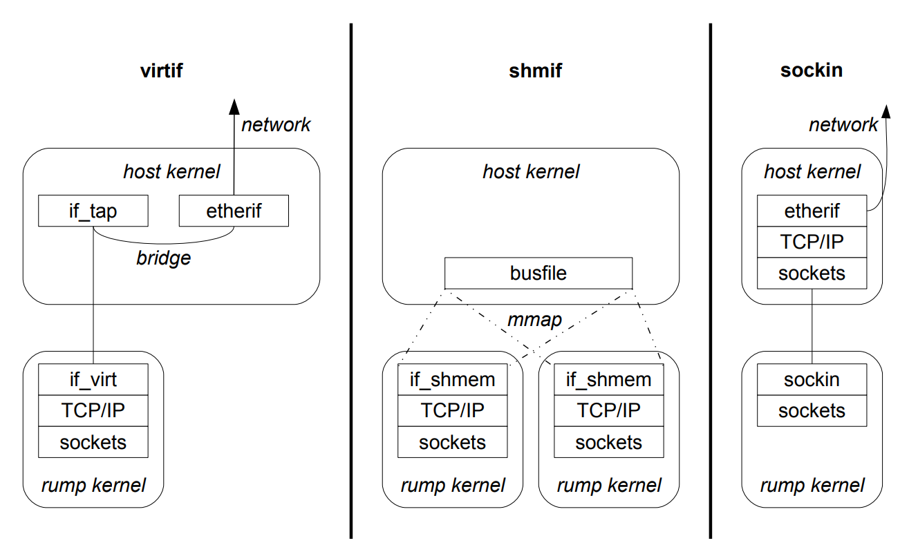

## 3.7 Rump Kernel Root File System

Full operating systems require a root file system with persistent storage for files such as /bin/ls and /etc/passwd. A rump kernel does not inherently require such files. This relaxed requirement is because a rump kernel does not have a default userspace and because client binaries are executed outside of the rump kernel. However, specific drivers or clients may require file system support for example to open a device, load firmware or access a file system image. In some cases, such as for firmware files and file system images, it is likely that the backing storage for the data to be accessed resides on the host.

We explicitly want to avoid mandating the association of persistent storage with a rump kernel because the storage image requires setup and maintenance and would hinder especially one-time invocations. It is not impossible to store the file system hierarchy and data required by a specific rump kernel instance on persistent storage. We are merely saying it is not required.

A file system driver called rumpfs was written. It is implemented in the source module sys/rump/librump/rumpvfs/rumpfs.c. Like tmpfs, rumpfs is an in-memory file system. Unlike tmpfs, which is as fast and as complete as possible, rumpfs is as lightweight as possible. Most rumpfs operations have only simple implementations and support for advanced features such as rename and NFS export has been omitted. If these features are desired, an instance of tmpfs can be mounted within the rump kernel when required. The lightweight implementation of rumpfs makes the compiled size 3.5 times smaller than that of tmpfs.

By convention, file system device nodes are available in /dev. NetBSD does not feature a device file system which dynamically creates device nodes based on the drivers in the kernel. A standard installation of NetBSD relies on precreated device nodes residing on persistent storage. We work around this issue in two ways. First, during bootstrap, the rump kernel VFS faction generates a selection of common device nodes such as /dev/zero. Second, we added support to various driver attachments to create device driver nodes when the drivers are attached. These adjustments avoid the requirement to have persistent storage mounted on /dev.

### 3.7.1 Extra-Terrestrial File System

The Extra-Terrestrial File System (etfs) interface provides a rump kernel with access to files on the host. The etfs (manual page rump etfs.3 ) interface is used to register host file mappings with rumpfs. Fundamentally, the purpose of etfs is the same as that of a hostfs available on most full system virtualization solutions. Unlike a hostfs, which typically mounts a directory from the host, etfs is oriented towards mapping individual files. The interface allows the registration of type and offset translators for individual host files; a feature we will look at more closely below. In addition, etfs only supports reading and writing files and cannot manipulate the directory namespace on the host. This I/O-oriented approach avoids issues such as how to map permissions on newly created hostfs files. Furthermore, it makes etfs usable also on hosts which do not support a directory namespace.

The mapping capability of etfs is hooked up to the lookup operation within rumpfs. Recall, a lookup operation for a pathname will produce an in-memory file system structure referencing the file behind that pathname. If the pathname under lookup consists of a registered etfs key, the in-memory structure will be tagged so that further I/O operations, i.e. read and write, will be directed to the backing file on the host.

Due to how etfs is implemented as part of the file system lookup routine, the mapped filenames is not browseable (i.e. readdir). However, it does not affect the intended use cases such as access to firmware images, since the pathnames are hardcoded into the kernel.

In addition to taking a lookup key and the backing file path, the etfs interface takes an argument controlling how the mapped path is presented inside the rump kernel. The following three options are valid for non-directory host files: regular file, character device or block device. The main purpose of the type mapping feature is to be able to present a regular file on the host as a block device in the rump kernel. This mapping addresses an implementation detail in the NetBSD kernel: the only valid backends for disk file systems are block devices.

Assuming that the host supports a directory namespace, it is also possible to map directories. There are two options: a single-level mapping or the mapping of the whole directory subtree. For example, if /rump_a from the host is directory mapped to /a in the rump kernel, it is possible to access /rump_a/b from /a/b in both single level and subtree mappings. However, /rump_a/b/c is visible at /a/b/c only if the directory subtree was mapped. Directory mappings do not allow the use of the type and offset/size translations, but allow mappings without having to explicitly add them for every single file. The original use case for the directory mapping functionality was to get the kernel module directory tree from /stand on the host mapped into the rump kernel namespace so that a rump kernel could read kernel module binaries from the host.

### 3.7.2 External Storage

Another special feature of rumpfs is the possibility to attach external storage to regular files. This external storage is provided in the form of memory, and is made available via files in a zero-copy fashion. The intent is to allow rump kernels to provide file content without having to rely on the presence of any block I/O device. The content itself can be linked into the data segment of the binary at the time that the binary is built. External storage is attached by opening a writable file and calling rump_sys_ioctl(fd, RUMP_FCNTL_EXTSTORAGE_ADD, ...). Adding external storage is limited to local clients, as pointers provided by remote clients are meaningless in this context.

## 3.8 Attaching Components

A rump kernel’s initial configuration is defined by the components that are linked in when the rump kernel is bootstrapped. At bootstrap time, the rump kernel needs to detect which components were included in the initial configuration and attach them. If drivers are loaded at runtime, they need to be attached to the rump kernel as well.

In this section we go over how loading and attaching components in a rump kernel is similar to a regular kernel and how it is different. The host may support static linking, dynamic linking or both. We include both alternatives in the discussion. There are two methods for attaching components, called kernel modules and rump components. We will discuss both and point out the differences. We start the discussion with kernel modules.

### 3.8.1 Kernel Modules

In NetBSD terminology, a driver which can be loaded and unloaded at runtime is said to be modular. The loadable binary image containing the driver is called a kernel module, or module for short. We adopt the terminology for our discussion.

The infrastructure for supporting modular drivers on NetBSD has been available since NetBSD 5.0 <sup>7</sup>. Some drivers offered by NetBSD are modular, and others are being converted. A modular driver knows how to attach to the kernel and detach from the kernel both when it is statically included and when it is loaded at runtime. A non-modular driver does not know.

> <sup>7</sup> NetBSD 5.0 was released in 2009. Versions prior to 5.0 provided kernel modules through a different mechanism called Loadable Kernel Modules (LKM ). The modules available from 5.0 onward are incompatible with the old LKM scheme. The reasons why LKM was retired in favor of the new system are available from mailing list archives and beyond the scope of this document.

NetBSD divides kernel modules into three classes depending on their source and when they are loaded. These classes are summarized in Table 3.3. Builtin modules are linked into the kernel image when the kernel is built. The bootloader can load kernel modules into memory at the same time as it loads the kernel image. These modules must later be linked by the kernel during the bootstrap process. Finally, at runtime modules must be both loaded and linked by the kernel.

| source      | loading  | linking  | initiated by             |
| ----------- | -------- | -------- | ------------------------ |
| builtin     | external | external | external toolchain       |
| bootloader  | external | kernel   | bootloader               |
| file system | kernel   | kernel   | syscall, kernel autoload |

Table 3.3: Kernel module classification. These categories represent the types of kernel modules that were readily present in NetBSD independent of this work.

The fundamental steps of loading a kernel module on NetBSD at runtime are:

1. The kernel module is loaded into the kernel’s address space.
2. The loaded code is linked with the kernel’s symbol table.
3. The module’s init routine is run. This routine informs other kernel subsystems that a new  module is present. For example, a file system module at a minimum informs the VFS layer that it is possible to mount a new type of file system.

After these steps have been performed, code from the newly loaded kernel module can be used like it had been a part of the original monolithic kernel build. Unloading a kernel module is essentially reversing the steps.

We divide loading a module into a rump kernel in two separate cases depending on a pivot point in the execution: the bootstrapping of the rump kernel by calling rump_init(). The officially supported way of including modules in rump kernels is to have them loaded and linked (i.e. steps 1+2) before rump_init() is called. This may be done either by linking them into a static image, or, on hosts where dynamic linking is supported, loading and linking the component after main() is called but before rump_init() is called. Modules loaded that way are essentially builtin modules.

We also point out that on some hosts, especially userspace, it is possible to load components after rump_init() by using the host dynamic linker and then calling rump_pub_module_init(). However, will we not discuss the latter approach in this document.

#### `init/fini`

A NetBSD kernel module defines an init routine (“modcmd_init”) and a fini routine (“modcmd_fini”) using the MODULE() macro. The indicated routines attach and detach the module with respect to the kernel. The MODULE() macro creates a structure (struct modinfo) containing that information. We need to locate the structure at runtime so that the init routine can be run to complete module loading step “3”.

The method of locating the modinfo structures depends on the platform. There are two functionally equivalent options, but they have different platform requirements.

1. A pointer to the structure is placed into a .rodata section called modules. At linktime, the linker generates __start_section and __end_section symbols. At runtime, all present modules can be found by traversing pointers in the memory between these two symbols. Notably, not all linkers can be coerced into generating these symbols. Furthermore, the scheme is not directly compatible with dynamic linkers because a dynamic linker cannot produce a global pair of such symbols – consider the scenario where libraries are loaded at runtime. Therefore, if this scheme is to be used with dynamic linking, each shared object must be examined separately.
2. The structure is located via \_\_attribute__((\_\_constructor\_\_)). We cannot make any assumptions about when the constructor runs, and therefore the constructor only places the structure on a linked list. This linked list is traversed when the rump kernel boots. The constructor is a static function generated by the MODULE() macro. Notably, this scheme requires platform support for running constructors.

#### The NetBSD Kernel Linker

Using the NetBSD kernel linker means loading the module from the file system after rump_init() and letting the code in sys/kern/subr_kobj.c handle linking. This linker is included as part of the base of a rump kernel. The in-kernel linker supports only relocatable objects (with ELF, type ET_REL), not shared libraries. 

Since linking is performed in the [rump] kernel, the [rump] kernel must be aware of the addresses of the symbols it exports. For example, for the linker to be able to satisfy an unresolved symbol to kmem_alloc(), it must know where the implementation of kmem_alloc() is located in that particular instance. In a regular kernel the initial symbol table is loaded at bootstrap time by calling the ksyms_addsyms_explicit() or mostly equivalent ksyms_addsyms_elf() routine.

In the current rumpuser hypercall revision, the symbol table is populated by the rumpuser_dl_bootstrap() hypercall, which is always called during rump kernel bootstrap. For the next hypercall revision, the plan is to make symbol loading a just-in-time operation which is called only if the in-kernel linker is used. This change is planned because loading the symbol table – and in dynamically linked environments harvesting it for loading – is a time-consuming operating. Based on experience, the use of the in-kernel linker is a rare operation, and unconditionally populating the symbol table is therefore wasteful

The in-kernel linker itself works the same way as in a regular kernel. Loading a module can be initiated either by a client by using the modctl() system call. Notably, the kernel module is loaded from the rump kernel file system namespace, so only rump kernels with the file system faction can support the in-kernel linker. 

### 3.8.2 Modules: Supporting Standard Binaries

By a binary kernel module we mean a kernel module object file built for the regular monolithic kernel and shipped with NetBSD in /stand/$arch/release/modules. Support for binary kernel modules means these objects can be loaded and linked into a rump kernel and the drivers used. This support allows a rump kernel to use drivers for which source code is not available. Short of a full virtual machine (e.g. QEMU), rump kernels are the only form of virtualization in NetBSD capable of using binary kernel modules without recompilation.

There are two requirements for using binary kernel modules to be possible. First, the kernel module must not contain any CPU instructions which cannot be executed in unprivileged mode. As we examined in Section 3.2.2, drivers do not contain privileged instructions. Second, the rump kernel and the host kernel must share the same binary interface (ABI).

In practical terms, ABI compatibility means that the rump kernel code does not provide its own headers to override system headers and therefore all the data type definitions are the same for a regular kernel and a rump kernel. Problematic scenarios arise because, mainly due to historical reasons, some architecture specific kernel interfaces are provided as macros or inline functions. This approach does not produce a clean interface boundary, as at least part of the implementation is leaked into the caller. From our perspective, this leakage means that providing an alternate interface is more difficult.

Shortly before we started investigating kernel module compatibility, some x86 CPU family headers were changed from inline/macro definitions to function interfaces by another NetBSD developer. The commit message <sup>8</sup> states that the change was done to avoid ABI instability issues with kernel modules. This change essentially solved our problem with inlines and macros. It also reinforced our belief that the anykernel architecture follows naturally from properly structured code.

A remaining example of macro use in an interface is the pmap interface. The pmap is the interface to the architecture dependent memory management features. The interface specification explicitly allows some parts of the interface to be implemented as macros. Figure 3.15 illustrates how the x86 pmap header overrides the MI function interface for pmap_is_modified(). To be x86 kernel ABI compatible we provide an implementation for pmap_test_attrs() in the rump kernel base (sys/rump/librump/rumpkern/arch/i386/pmap_x86.c).

> <sup>8</sup> revision 1.146 of sys/arch/i386/include/cpu.h

sys/arch/x86/include/pmap.h:

```c
#define pmap_is_modified(pg) pmap_test_attrs(pg, PG_M)
```

sys/uvm/uvm pmap.h (MI definition):

```c
#if !defined(pmap_is_modified)
bool            pmap_is_modified(struct vm_page *);
#endif
```

Figure 3.15: Comparison of pmap_is_modified definitions. The definition specific to the i386 port causes a dereference of the symbol pmap_test_attrs(), while for all ports which do not override the definition, pmap_is_modified() is used.

Due to the MD work required, the kernel module ABI support is currently restricted to the AMD64 and i386 architectures. Support for AMD64 has an additional restriction which derives from the addressing model used by kernel code on AMD64. Since most AMD64 instructions accept only 32bit immediate operands, and since an OS kernel is a relatively small piece of software, kernel code is compiled with a memory model which assumes that all symbols are within the reach of a 32bit offset. Since immediate operands are sign extended, the values are correct when the kernel is loaded in the upper 2GB of AMD64’s 64bit address space [32]. This address range is not available to user processes at least on NetBSD. Instead, we used the lowest 2GB — the lowest 2GB is the same as the highest 2GB without sign-extension. As long as the rump kernel and the binary kernel module are loaded into the low 2GB, the binary kernel module can be used as part of the rump kernel.

For architectures which do not support the standard kernel ABI, we provide override machine headers under the directory sys/rump/include/machine. This directory is specified first in the include search path for rump kernel compilation, and therefore headers contained in there override the NetBSD MD headers. Therefore, definitions contained in the headers for that directory override the standard NetBSD definitions. This way we can override problematic definitions in machine dependent code.

sys/arch/x86/include/cpu.h:

```c
#define curlwp                  x86_curlwp()
```

sys/arch/sparc64/include/{cpu,param}.h (simplified for presentation):

```c
#define curlwp          curcpu()->ci_curlwp
#define curcpu()        (((struct cpu_info *)CPUINFO_VA)->ci_self)
#define CPUINFO_VA      (KERNEND+0x018000)
#define KERNEND         0x0e0000000     /* end of kernel virtual space */
```

Figure 3.16: Comparison of curlwp definitions. The i386 port definition results in a function symbol dereference, while the sparc64 port definition causes a dereference to an absolute memory address.

An example of what we consider problematic is SPARC64’s definition of curlwp, which we previously illustrated in Figure 3.16. This approach allows us to support rump kernels on all NetBSD architectures without having to write machine specific counterparts or edit the existing MD interface definitions. The only negative impact is that architectures which depend on override headers cannot use binary kernel modules and must operate with the components compiled specifically for rump kernels.

Lastly, the kernel module must be converted to the rump kernel symbol namespace (Section 3.2.1) before linking. This conversion can be done with the objcopy tool similar to what is done when components are built. However, using objcopy would require generating another copy of the same module file. Instead of the objcopy approach, we modified the module load path in sys/kern/subr_kobj.c to contain a call to kobj_renamespace() after the module has been read from storage but before it is linked. On a regular kernel this interface is implemented by a null operation, while in a rump kernel the call is implemented by a symbol renaming routine in sys/rump/librump/rumpkern/kobj_rename.c. Since the translation is done in memory, duplicate files are not required. Also, it enables us to autoload binary modules directly from the host, as we describe next.

### 3.8.3 Rump Component Init Routines

In the previous section we discussed the attachment of drivers that followed the kernel module framework. Now we discuss the runtime attachment of drivers that have not yet been converted to a kernel module, or code that applies to a only rump kernel environment.

If a driver is modular, the module’s init routine should be preferred over any rump kernel specific routines since the module framework is more generic. However, a module’s init routine is not always enough for a rump kernel. Consider the following cases. On a regular system, parts of the kernel are configured by userspace utilities. For example, the Internet address of the loopback interface (127.0.0.1) is configured by the rc scripts instead of by the kernel. Another example is the creation of device nodes on the file system under the directory /dev. NetBSD does not have a dynamic device file system and device nodes are pre-created with the MAKEDEV script. Since a rump kernel does not have an associated userland or a persistent root file system, these configuration actions must be performed by the rump kernel itself. A rump component init routine may be created to augment the module init routine.

By convention, we place the rump component init routines in the component’s source directory in a file called $name_component.c, e.g. bpf_component.c. To define an init routine, the component should use the RUMP_COMPONENT() macro. The use of this macro serves the same purpose as the MODULE() macro and ensures that the init routine is automatically called during rump kernel bootstrap.

The RUMP_COMPONENT() macro takes as arguments a single parameter indicating when the component should be initialized with respect to other components. This specifier is required because of interdependencies of components that the NetBSD kernel code imposes. For example, the networking domains must be attached before interfaces can be configured. It is legal (and sometimes necessary) for components to define several init routines with different configuration times. The init level parameters are listed in Table 3.4 in order of runtime initialization. Notably, the multitude of networking-related initialization levels conveys the current status of the NetBSD TCP/IP stack: it is not yet modular — a modular TCP/IP stack would encode the cross-dependencies in the drivers themselves.

An example of a component file is presented in Figure 3.17. The two routines specified in the component file will be automatically executed at the appropriate times during rump kernel bootstrap so as to ensure that any dependent components have been initialized before. The full source code for the file can be found from the source tree path sys/rump/net/lib/libnetinet/netinet_component.c. The userspace rc script etc/rc/network provides the equivalent functionality in a regular monolithic NetBSD setup

## 3.9 I/O Backends

I/O backends allow a rump kernel to access I/O resources on the host and beyond. Access to I/O devices always stems from hypercalls, and like we learned in Section 3.2.3, hypercalls for accessing I/O devices are specific to the bus or device. For example, accessing a PCI NIC is completely different from accessing /dev/tap.

In this section we will discuss the implementation possibilities and choices for the I/O backends for networking and file systems (block devices) in userspace. Other related sections are the ones which discuss USB via ugen (Section 3.10) and PCI on the Rumprun unikernel (Section 4.2.5). There is also support for accessing PCI devices from userspace available at http://repo.rumpkernel.org/pci-userspace, but we do not discuss that implementation in this book.

| level                           | purpose                                                                                                            |
| ------------------------------- | ------------------------------------------------------------------------------------------------------------------ |
| RUMP_COMPONENT_KERN             | base initialization which is done before any factions are attached                                                 |
| RUMP_COMPONENT_VFS              | VFS components                                                                                                     |
| RUMP_COMPONENT_NET              | basic networking, attaching of networking domains                                                                  |
| RUMP_COMPONENT_NET_ROUTE        | routing, can be done only after all domains have attached                                                          |
| RUMP_COMPONENT_NET_IF           | interface creation (e.g. lo0)                                                                                      |
| RUMP_COMPONENT_NET_IFCFG        | interface configuration, must be done after interfaces are created                                                 |
| RUMP_COMPONENT_DEV              | device components                                                                                                  |
| RUMP_COMPONENT_DEV_AFTERMAINBUS | device components run which after the device tree root (mainbus) has attached                                      |
| RUMP_COMPONENT_KERN_VFS         | base initialization which is done after the VFS faction has attached, e.g. base components which do VFS operations |
| RUMP_COMPONENT_SYSCALL          | establish non-modular syscalls which are available in the factions present                                         |
| RUMP_COMPONENT_POSTINIT         | misc. components that attach right before rump_init() returns                                                      |

Table 3.4: Component classes. The RUMP_COMPONENT facility allows to specify component initialization at rump kernel bootstrap time. Due to interdependencies between subsystems, the component type specifies the order in which components are initialized. The order of component initialization is from top to bottom. The initializers designated DEV, NET and VFS are run only if the respective faction is present.

```c
RUMP_COMPONENT(RUMP_COMPONENT_NET)
{
        DOMAINADD(inetdomain);

        [ omitted: attach other domains ]
}

RUMP_COMPONENT(RUMP_COMPONENT_NET_IFCFG)
{
        [ omitted: local variables ]

        if ((error = socreate(AF_INET, &so, SOCK_DGRAM, 0, curlwp, NULL)) != 0)
                panic("lo0 config: cannot create socket");

        /* configure 127.0.0.1 for lo0 */
        memset(&ia, 0, sizeof(ia));
        strcpy(ia.ifra_name, "lo0");
        sin = (struct sockaddr_in *)&ia.ifra_addr;
        sin->sin_family = AF_INET;
        sin->sin_len = sizeof(struct sockaddr_in);
        sin->sin_addr.s_addr = inet_addr("127.0.0.1");

        [ omitted: define lo0 netmask and broadcast address ]

        in_control(so, SIOCAIFADDR, &ia, lo0ifp, curlwp);
        soclose(so);
}
```

Figure 3.17: Example: selected contents of netinet_component.c. The inet domain is attached in one constructor. The presence of the domain is required for configuring an inet address for lo0. The interface itself is provided and created by the net component (not shown).


Figure 3.18: Networking options for rump kernels. The virtif facility provides a full networking stack by interfacing with, for example, the host’s tap driver (depicted). The shmem facility uses interprocess shared memory to provide an Ethernet-like bus to communicate between multiple rump kernels on a single host without requiring elevated privileges on the host. The sockin facility provides unprivileged network access for all in-kernel socket users via the host’s sockets.

### 3.9.1 Networking

The canonical way an operating system accesses the network is via an interface driver. The driver is at bottom of the network stack and has the capability for sending and receiving raw networking packets. On most general purpose OSs, sending and receiving raw network data is regarded as a privileged operation. Rather, unprivileged programs have only the capability to send and receive data via the sockets interfaces instead of deciding the full contents of a networking packet.

We have three distinct cases we wish to support in rump kernels. The cases are illustrated in Figure 3.18 and discussed next.

1. full network stack with raw access to the host’s network. In this case the rump kernel can send and receive raw network packets. An example of when this type of access is desired is an IP router. Elevated privileges are required, as well as selecting a host device through which the network is accessed. <br> _
2. full network stack without access to the host’s network. In this use case we are interested in being able to send raw networking packets between rump kernels, but are not interested in being able to access the network on the host. Automated kernel driver testing in userspace is the main use case for this type of setup. We can fully use all of the networking stack layers, with the exception of the physical device driver, on a fully unprivileged account without any prior host resource allocation. <br> _
3. unprivileged use of host’s network for sending and receiving data. In this case we are interested in the ability to send and receive data via the host’s network, but do not care about the IP address associated with our rump kernel. Though sending data via the host’s network stack requires that the host has a properly configured network stack, we argue that this assumption is commonly true. 
An example use case is the NFS client driver: we wish to isolate and virtualize the handling of the NFS protocol (i.e. the file system portion). However, we still need to transmit the data to the server. Using a full networking stack would not only require privileges, but also require configuring the networking stack (IP address, etc.). Using the host’s stack to send and receive data avoids these complications.
This option is directed at client side services, since all rump kernel instances will share the host’s port namespace, and therefore it is not possible to start multiple instances of the same service.

#### Raw network access

The commonly available way for accessing an Ethernet network from a virtualized TCP/IP stack running in userspace is to use the tap driver with the /dev/tap device node. The tap driver presents a file type interface to packet networking, and raw Ethernet frames can be received and sent from an open device node using the read() and write() calls. If the tap interface on the host is bridged with a hardware Ethernet interface, access to a physical network is available since the hardware interface’s traffic will be available via the tap interface as well. This tap/bridge scenario was illustrated in Figure 3.18.

The commands for bridging a tap interface on NetBSD are provided in Figure 3.19. Note that IP addresses are not configured for the tap interface on the host.

```c
# ifconfig tap0 create
# ifconfig tap0 up
# ifconfig bridge0 create
# brconfig bridge0 add tap0 add re0
# brconfig bridge0 up
```
Figure 3.19: Bridging a tap interface to the host’s re0. The allows the tap device to send and receive network packets via re0.

The virt (manual page virt.4 ) network interface driver we implemented uses hypercalls to open the tap device on the host and to transmit packets via it. The source code for the driver is located in sys/rump/net/lib/libvirtif.

Notably, while the tap method is near-ubiquitous and virtualizes the underlying network device for multiple consumers, it is not a high-performance option. At http://repo.rumpkernel.org/ we host high-performance network driver implementations for DPDK and netmap [50] backends. While we will not discuss implementations in this book, we want to note that the rump kernel side of the driver is shared between the one use for tap (i.e. virt). The difference comes from alternative hypercall implementations.

#### Full network stack without host network access

Essentially, we need an unprivileged Ethernet-like bus. All interfaces which are attached to the same bus will be able to talk to each other directly, while nodes with interfaces on other buses may be reached via routers.

One option for implementing packet distribution is to use a userland daemon which listens on a local domain socket [16]. The client kernels use hypercalls to access the local domain socket of the daemon. The daemon takes care of passing Ethernet frames to the appropriate listeners. The downside of the daemon is that there is an extra program to install, start and stop. Extra management is in conflict with the goals of rump kernels, and that is why we chose another implementation strategy. 

We use shared memory provided by a memory mapped file as the network bus. The filename is the bus handle — all network interfaces on the same bus use the same filename. The shmif driver (manual page shmif.4 ) in the rump kernel accesses the bus. Each driver instance accesses one bus, so it is possible to connect a rump kernel to multiple different busses by configuring multiple drivers. Since all nodes have full access to bus contents, the approach does not protect against malicious nodes. As our main use case is testing, this lack of protection is not an issue. Also, the creation of a file on the host is not an issue, since testing is commonly carried out in a working directory which is removed after a test case has finished executing.

The shmif driver memory maps the file and uses it as a ring buffer. The header contains pointers to the first and last packet and a generation number, along with bus locking information. The bus lock is a spinlock based on cross-process shared memory. A downside to this approach is that if a rump kernel crashes while holding the bus lock, the whole bus will halt. Since the main purpose of shmif is testing, we do not consider the bus halting a serious flaw.

Sending a packet requires locking the bus and copying the contents of the packet to the buffer. Receiving requires knowing when to check for new packets. It is the job of a hypercall to monitor the bus and wake up the receive side when the bus changes. This monitoring is, for example, implemented by using the kqueue facility on BSD and inotify on Linux. The receive side of the driver locks the bus and analyzes the bus header. If there are new packets for the interface on question, the driver passes them up to the IP layer.

An additional benefit of using a file is that there is always one ringbuffer’s worth of traffic available in a postmortem situation. The shmif_dumpbus tool (manual page shmif dumpbus.1 ) can be used to convert a busfile into the pcap format which the tcpdump tool understands. This conversion allows running a post-mortem tcpdump on a rump kernel’s network packet trace.

#### Unprivileged use of the host’s network in userspace

Some POSIX-hosted virtualization solutions such as QEMU and UML provide unprivileged zero-configuration network access via a facility called Slirp [1]. Slirp is a program which was popular during the dial-up era. It enables running a SLIP [52] endpoint on top of a regular UNIX shell without a dedicated IP. Slirp works by mapping the SLIP protocol to socket API calls. For example, when an application on the client side makes a connection, Slirp processes the SLIP frame from the client and notices a TCP SYN is being sent. Slirp then opens a socket and initiates a TCP connection on it. Note that both creating a socket and opening the connection are performed at this stage. This bundling happens because opening the socket in the application does not cause network traffic to be sent, and therefore Slirp is unaware of it.

Since the host side relies only on the socket API, there is no need to perform network setup on the host. Furthermore, elevated privileges are not required for the use of TCP and UDP (except for opening ports <1024). On the other hand, ICMP is not available since using it requires access to raw sockets on the host. Also, any IP address configured on the guest will be purely fictional, since socket traffic sent from Slirp will use the IP address of the host Slirp is running on.

Since Slirp acts as the peer for the guest’s TCP/IP stack, it requires a complete TCP/IP stack implementation. The code required for complete TCP/IP processing is sizeable: over 10,000 lines of code.

Also, extra processing power is required, since the traffic needs to be converted multiple times: the guest converts the application data to IP datagrams, Slirp converts it back into data and socket family system call parameters, and the host’s TCP/IP stack converts input from Slirp again to IP datagrams.

Our implementation is different from the one described above. Instead of doing transport and network layer processing in the rump kernel, we observe that regardless of what the guest does, processing will be done by the host. At best, we would need to undo what the guest did so that we can feed the payload data to the host’s sockets interface. Instead of using the TCP/IP protocol suite in the rump kernel, we redefine the inet domain, and attach our implementation at the protocol switch layer [58]. We call this new implementation sockin to reflect it being socket inet. The attachment to the kernel is illustrated in Figure 3.20. Attaching at the domain level means communication from the kernel’s socket layer is done with usrreq’s, which in turn map to the host socket API in a very straightforward manner.

```c
DOMAIN_DEFINE(sockindomain);

const struct protosw sockinsw[] = {
{
    .pr_type = SOCK_DGRAM, /* UDP */
    .pr_domain = &sockindomain,
    .pr_protocol = IPPROTO_UDP,
    .pr_flags = PR_ATOMIC | PR_ADDR,
    .pr_usrreq = sockin_usrreq,
    .pr_ctloutput = sockin_ctloutput,
},{
    .pr_type = SOCK_STREAM, /* TCP */
    .pr_domain = &sockindomain,
    .pr_protocol = IPPROTO_TCP,
    .pr_flags = PR_CONNREQUIRED | PR_WANTRCVD | PR_LISTEN | PR_ABRTACPTDIS,
    .pr_usrreq = sockin_usrreq,
    .pr_ctloutput = sockin_ctloutput,
}};

struct domain sockindomain = {
    .dom_family = PF_INET,
    .dom_name = "socket_inet",
    .dom_init = sockin_init,
    .dom_externalize = NULL,
    .dom_dispose = NULL,
    .dom_protosw = sockinsw,
    .dom_protoswNPROTOSW = &sockinsw[__arraycount(sockinsw)],
    .dom_rtattach = rn_inithead,
    .dom_rtoffset = 32,
    .dom_maxrtkey = sizeof(struct sockaddr_in),
    .dom_ifattach = NULL,
    .dom_ifdetach = NULL,
    .dom_ifqueues = { NULL },
    .dom_link = { NULL },
    .dom_mowner = MOWNER_INIT("",""),
    .dom_rtcache = { NULL },
    .dom_sockaddr_cmp = NULL
};
```

Figure 3.20: sockin attachment. Networking domains in NetBSD are attached by specifying a struct domain. Notably, the sockin family attaches a PF_INET type family since it aims to provide an alternative implementation for inet sockets.

For example, for PRU_ATTACH we call socket(), for PRU_BIND we call bind(), for PRU_CONNECT we call connect(), and so forth. The whole implementation is 500 lines of code (including whitespace and comments), making it 1/20th of the size of Slirp.

Since sockin attaches as the Internet domain, it is mutually exclusive with the regular TCP/IP protocol suite. Furthermore, since the interface layer is excluded, the sockin approach is not suitable for scenarios which require full TCP/IP processing within the virtual kernel, e.g. debugging the TCP/IP stack. In such cases one of the other two networking models should be used. This choice may be made individually for each rump kernel instance.

### 3.9.2 Disk Driver

A disk block device driver provides storage medium access and is instrumental to the operation of disk-based file systems. The main interface is simple: a request instructs the driver to read or write a given number of sectors at a given offset. The disk driver queues the request and returns. The request is handled in an order according to a set policy, e.g. the disk head elevator. Once the request is complete, the driver signals the kernel that the request has been completed. In case the caller waits for the request to complete, the request is said to be synchronous, otherwise asynchronous.

There are two ways to provide a disk backend: buffered and unbuffered. A buffered backend stores writes to a buffer and flushes them to the backing storage later. Notably, to maintain file system on-disk correctness, synchronous writes must still be flushed to storage immediately. An unbuffered backend will always write to storage immediately. Examples of these backend types are a regular file and a character special device, respectively.

There are three approaches to implementing the block driver hypercalls using standard userspace interfaces.

* Use read() and write() in caller context: this is the simplest method. However, this method effectively makes all requests synchronous. Additionally, this method blocks other read operations when read-ahead is being performed.
* Asynchronous read/write: in this model the request is handed off to an I/O thread. When the request has been completed, the I/O thread signals completion.
A buffered backend must flush synchronously executed writes. The only standard interface available for flushing is fsync(). However, it will flush all buffered data before returning, including previous asynchronous writes. Nonstandard ranged interfaces such as fsync_range() exist, but they usually flush at least some file metadata in addition the actual data causing extra unnecessary I/O.
A userlevel write to an unbuffered backend goes directly to storage. The system call will return only after the write has been completed. No flushing is required, but since userlevel I/O is serialized on Unix, it is not possible to issue another write before the first one finishes. This ordering means that a synchronous write must block and wait until any earlier write calls have been fully executed.
The O_DIRECT file descriptor flag causes a write on a buffered backend to bypass cache and go directly to storage. The use of the flag also invalidates the cache for the written range, so it is safe to use in conjunction with buffered I/O. However, the flag is advisory. If conditions are not met, the I/O will silently fall back to the buffer. The direct I/O method can therefore be used only when it is certain that direct I/O applies.
* Memory-mapped I/O: this method works only for regular files. The benefits are that the medium access fastpath does not involve any system calls and that the msync() system call can be portably used to flush ranges instead of the whole memory cache.
The file can be mapped using windows. Windows provide two advantages. First, files larger than the available VAS can be accessed. Second, in case of a crash, the core dump is only increased by the size of the windows instead of the size of the entire file. We found that the number of windows does not have a significant performance impact; we default to 16 1MB windows with LRU recycling.
The downside of the memory mapping approach is that to overwrite data, the contents must first be paged in, then modified, and only after that written. The pagein step is to be contrasted to explicit I/O requests, where it is possible to decide if a whole page is being written, and if so, skip pagein before write.

Of the above, we found that on buffered backends O_DIRECT works best. Ranged syncing and memory mapped I/O have roughly equal performance and full syncing performs poorly.
