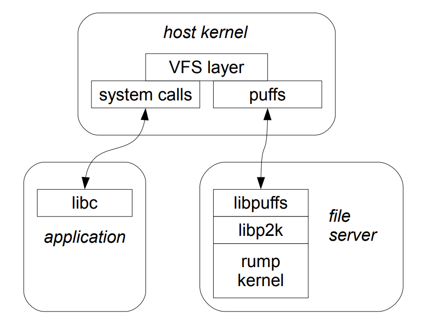

## 3.10 Hardware Devices: A Case of USB

A general purpose OS kernel USB driver stack may choose to export USB device access to userspace via the USB generic driver, or ugen. After ugen attaches to a USB bus node, it provides access to the attached hardware (i.e. not the entire USB bus) from userspace via the /dev/ugen\<n\> device nodes and read/write/ioctl calls. Providing access via a device node means that any entity on the host with the appropriate privileges to access the device node may communicate with the hardware without having full access to the device registers. A key point is that the USB protocol offered by ugen is essentially unchanged from the USB hardware protocol. This protocol compatibility allows preexisting kernel drivers to use ugen without protocol translation.

At the root of the USB bus topology is a USB host controller. It controls all traffic on the USB bus. All device access on the bus is done through the host controller using an interface called USBDI, or USB Driver Interface. The role of the host controller, along with ugen, is a detail which makes USB especially suitable for userspace drivers: we need to implement a host controller which maps USBDI to the ugen device node instead of having to care about all bus details.

We implemented a host controller called ugenhc. When the kernel’s device autoconfiguration subsystem calls the ugenhc driver to probe the device, the ugenhc driver tries to open /dev/ugen on the host. If the open is successful, the host kernel has attached a device to the respective ugen instance and ugenhc can return a successful match. Next, the ugenhc driver is attached in the rump kernel, along with a USB bus and a USB root hub. The root hub driver explores the bus to see which devices are connected to it, causing the probes to be delivered first to ugenhc and through /dev/ugen to the host kernel and finally to the actual hardware. The device driver instance can be used from the rump kernel just like any other device driver, e.g. USB network interfaces can be used by the networking stack to shuffle packets.

### 3.10.1 Conclusions of the USB Approach

The USB approach is not recommended for hooking device drivers to rump kernels. To implement ugenhc, support for the USB protocol stack must already exist on the host. Even though USB is supported by many hosts, the current implementation of ugenhc is still NetBSD-specific. Furthermore, we found that though in theory access through /dev/ugen is safe, during development we were able to tickle the host’s USB protocol stack in surprising ways causing host kernel panics. Supposedly, this instability is caused by the compound effect of both the USB protocol stack implementation being huge, and accessing it via /dev/ugen not being the frequently exercised access path.

## 3.11 Microkernel Servers: Case Study with File Servers

In this section we investigate using rump kernels as microkernel style servers for file systems. Our key motivation is to prevent a malfunctioning file system driver from damaging the host kernel by isolating it in a userspace server. 

The NetBSD framework for implementing file servers in userspace is called puffs [28]. We use puffs to attach the rump kernel file server to the host’s file system namespace. Conceptually, after the file system has been mounted, the service works as follows: a file system request is transported from the host kernel to the userspace server using puffs. The server makes a local call into the rump kernel to service the request. When servicing the request is complete, the response is returned to the host kernel using puffs. The architecture of this solution is presented in Figure 3.21. It is worth noting that a userlevel application is not the only possible consumer. Any VFS user, such as an NFS server running in the host kernel, is a valid consumer in this model.

### 3.11.1 Mount Utilities and File Servers

Before a file system can be accessed, it must be mounted. Standard kernel file systems are mounted with utilities such as mount_efs, mount_tmpfs, etc. These utilities parse the command line arguments and call the mount() system call with a file system specific argument structure built from the command line arguments.


Figure 3.21: File system server. The request from the microkernel client is transported by the host kernel to the rump kernel running providing the kernel file system driver. Although only system calls are illustrated, page faults created by the client may be handled by the server as well.

One typical way of invoking these utilities is to use the mount command with an argument specifying the file system. For example, mount -t efs /dev/sd0e /mnt invokes mount_efs to do the actual mounting.

Instead of directly calling mount(), our server does the following: we bootstrap a rump kernel, mount the file system in the rump kernel, and attach this process as a puffs server to the host. All of these tasks are performed by our mount commands counterparts: rump_efs, rump_tmpfs, etc. The usage of the rump kernel variants is unchanged from the originals, only the name is different. To maximize integration, these file servers share the same command line argument parsing code with the regular mount utilities. Sharing was accomplished by restructuring the mount utilities to provide an interface for command line argument parsing and by calling those interfaces from the rump_xfs utilities.

Sharing argument parsing means that the file servers have the same syntax. This feature makes usage interchangeable just by altering the command name. We also in-kernel mount:

```conf
/dev/sd0e               /m/usb          msdos           rw,-u=1000
10.181.181.181:/m/dm    /m/dm           nfs             rw,-p
```

equivalent rump kernel file server mount:

```conf
/dev/sd0e               /m/usb          msdos           rw,-u=1000,rump
10.181.181.181:/m/dm    /m/dm           nfs             rw,-p,rump
```

Figure 3.22: Use of -o rump in /etc/fstab. The syntax for a file system served by an in-kernel driver or a rump kernel is the same apart from the rump flag.

added a rump option to the mount command. For example, consider the following command: mount -t efs -o rump /dev/sd0e /mnt. It will invoke rump_efs instead of mount_efs and therefore the file system will be mounted with a rump kernel file system driver. The rump option works also in /etc/fstab, as is illustrated in Figure 3.22. The flag allows the use of rump kernel file servers to handle specific mounts such as USB devices and CD/DVD by adding just one option. The figure also demonstrates how the NFS client (same applies to SMBFS/CIFS) running inside a rump kernel or the host kernel are completely interchangeable since the rump kernel drivers use the sockin networking facility (Section 3.9.1) and therefore share the same IP address with the host.

The list of kernel file system drivers available as rump servers is available in the “SEE ALSO” section of the mount(8) manual page on a NetBSD system. Support in 5.99.48 consists of ten disk-based and two network-based file systems.

### 3.11.2 Requests: The p2k Library

We attach to the host as a puffs file server, so the file system requests we receive are in the format specified by puffs. We must feed the requests to the rump kernel to access the backend file system. To be able to do so, we must convert the requests to a suitable format. Since the interface offered by puffs is close to the kernel’s VFS/vnode interface [36] we can access the rump kernel directly at the VFS/vnode layer if we translate the puffs protocol to the VFS/vnode protocol.

We list some examples of differences between the puffs protocol and VFS/vnode protocol that we must deal with by translations. For instance, the kernel references a file using a struct vnode pointer, whereas puffs references one using a puffs_cookie_t value. Another example of a difference is the way (address, size) - tuples are indicated. In the kernel struct uio is used. In puffs, the same information is passed as separate pointer and byte count parameters.

The p2k, or puffs-to-kernel, library is a request translator between the puffs userspace file system interface and the kernel virtual file system interface (manual page p2k.3 ). It also interprets the results from the kernel file systems and converts them back to a format that puffs understands.

Most of the translation done by the p2k library is a matter of converting data types back and forth. To give an example of p2k operation, we discuss reading a file, which is illustrated by the p2k read routine in Figure 3.23. We see the uio structure being created by rump_uio_setup() before calling the vnode operation and being freed after the call while saving the results. We also notice the puffs credit type being converted to the opaque kauth_cred_t type used in the kernel. This conversion is done by the p2k library’s cred_create() routine, which in turn uses rump_pub_cred_create().

```c
int
p2k_node_read(struct puffs_usermount *pu, puffs_cookie_t opc,
        uint8_t *buf, off_t offset, size_t *resid, const struct puffs_cred *pcr, int ioflag)
{
        struct vnode *vp = OPC2VP(opc);
        struct kauth_cred *cred = cred_create(pcr);
        struct uio *uio = rump_pub_uio_setup(buf, *resid, offset, RUMPUIO_READ);
        int rv;

        RUMP_VOP_LOCK(vp, LK_SHARED);
        rv = RUMP_VOP_READ(vp, uio, ioflag, cred);
        RUMP_VOP_UNLOCK(vp);
        *resid = rump_pub_uio_free(uio);
        cred_destroy(cred);

        return rv;
}
```

Figure 3.23: Implementation of p2k_node_read(). The parameters from the puffs interface are translated to parameters expected by the kernel vnode interface. Kernel data types are not exposed to userspace, so rump kernel public routines are used to allocate, initialize and release such types.

The RUMP_VOP_LOCK() and RUMP_VOP_UNLOCK() macros deal with NetBSD kernel VFS locking protocol. They take a lock on the vnode and unlock it, respectively. From one perspective, locking at this level is irrelevant, since puffs in the host kernel takes care of locking. However, omitting lock operations from the rump kernel causes assertions such as KASSERT(VOP_ISLOCKED(vp)); in kernel drivers to fire. Therefore, proper locking is necessary at this layer to satisfy the driver code.

### 3.11.3 Unmounting

A p2k file server can be unmounted from the host’s namespace in two ways: either using the umount command (and the unmount() system call) on the host or by killing the file server. The prior method is preferred, since it gives the kernel cache in puffs a chance to flush all data. It also allows the p2k library to call the rump kernel and ask it to unmount the file system and mark it clean.

```shell
golem> mount -t msdos -o rump /dev/sd0e /mnt
panic: buf mem pool index 23
Abort (core dumped)
golem>
```

### 3.11.4 Security Benefits

Drivers for disk-based file systems are written assuming that file system images contain trusted input. With USB sticks and DVDs untrusted images are common. Still, without thinking, users mount untrusted file systems using kernel drivers. Arbitrary memory access is known to be possible using a suitable crafted file system image and fixing each file system driver to be bullet-proof is at best difficult [59].

When run in a rump kernel, a file system driver dealing with an untrusted image is isolated in its own domain. This separation mitigates the possibility of a direct memory access attack on the kernel.

To give an example of a useful scenario, a mailing list posting described a problem with mounting a FAT file system from a USB stick causing a kernel crash and complete system failure. By using a rump kernel with microkernel clients, the problem is only an application core dump. Figure 3.24 illustrates what happens when the file system is mounted with the driver running in a rump kernel. Of course, the driver was fixed to deal graciously with this particular bug, but others remain.

It needs to be stressed that mounting a file system as a server is feature wise no different than using a driver running in the host kernel. The user and administrator experience remains the same, and so does the functionality. Only the extra layer of security is added. It is the author’s opinion and recommendation that untrusted disk file systems should be never be mounted using a file system driver running in kernel space.

A rump kernel has the same privileges as a process, so from the perspective of the host system its compromise is the same as the compromise of any other application. In case rogue applications are a concern, on most operating systems access can be further limited by facilities such as jails [27] or sandboxing [19]. Networked file system clients (such as NFS and CIFS) may also benefit from the application of firewalls.


