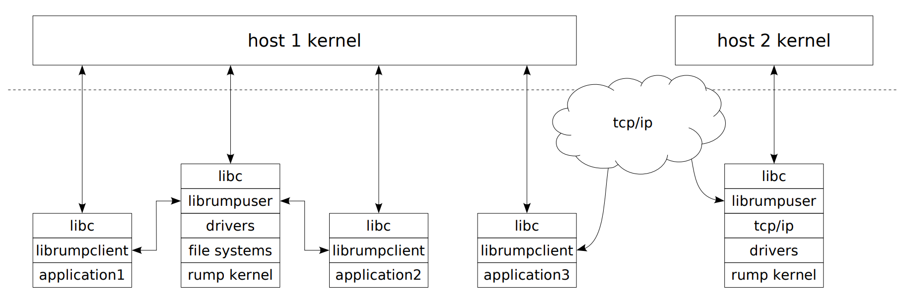
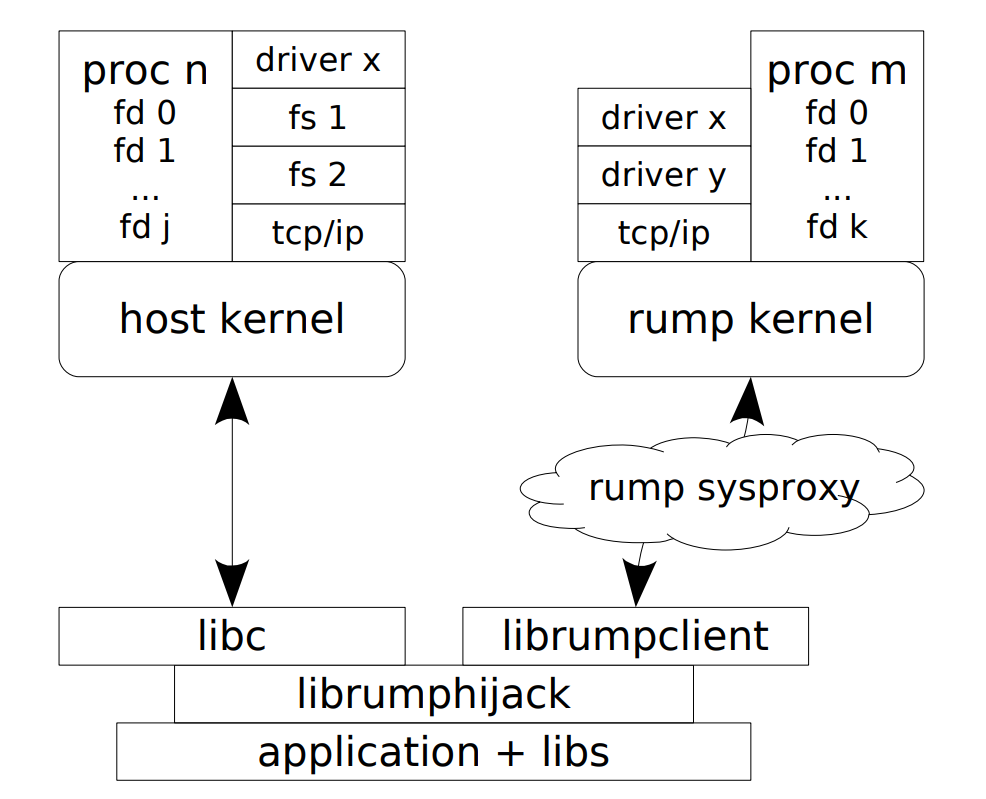
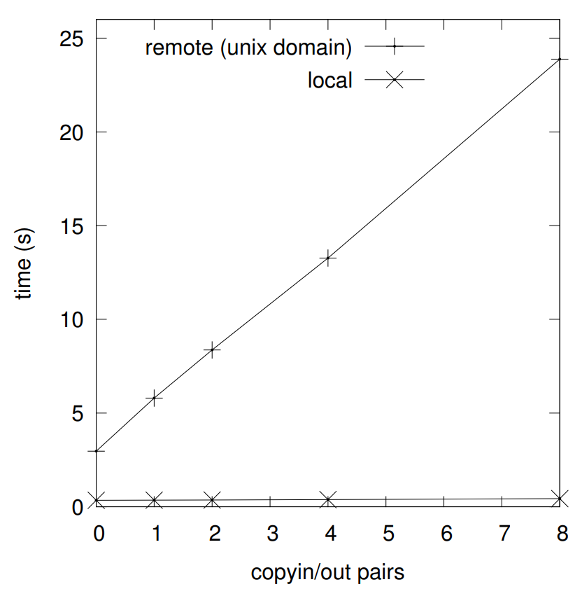

## 3.12 Remote Clients

Remote clients are clients which are disjoint from the rump kernel. For example, on POSIX hosts remote clients run in different processes than their respective rump kernels, either on the same host or not. The advantage of a remote client is that the relationship between the remote client and a rump kernel is much like that of a regular kernel and a process: the clients start up, run and exit independently. This independence makes it straightforward to adapt existing programs as rump kernel clients, and as we will see later in this section, allows existing POSIX binaries to use services from a rump kernel without recompilation. For example, it is possible to hijack an unmodified Firefox browser to use a TCP/IP stack provided by a rump kernel. Remote clients are also the basis for rumpctrl (Section 4.3).



Figure 3.25: Remote client architecture. Remote clients communicate with the rump kernel through the rumpclient library. The client and rump kernel may or may not reside on the same host or same type of host.

The general architecture of remote rump clients is illustrated in Figure 3.25. It is explained in detail in the following sections.

Communication can be done over virtually any type of bus.  The requirements for the bus are merely to be able to read and write datagrams.  By default, we provide the implementation for two socket-based protocol families: Unix domain sockets and TCP/IP.  The advantages of Unix domain sockets are that the available namespace is virtually unlimited and it is easy to bind a private server in a local directory without fear of a resource conflict. Also, it is possible to use host credentials (via `chmod`) to control who has access to the server.  The TCP method does not have these advantages --- in the general case it is not possible to guarantee that a predefined port is not in use --- but TCP does work over the Internet. Generally speaking, Unix domain sockets should be used when the server and client reside on the same host.

### 3.12.1 Client-Kernel Locators

Before the client is able to contact the rump kernel, the client must know where the kernel is located. In the traditional Unix model locating the kernel is simple, since there is one unambiguous kernel (“host kernel”) which is the same for every process. However, remote clients can communicate with any rump kernel which may or may not reside on the same host.

The client and rump kernel find each other by specifying a location using a URL. For example, the URL tcp://1.2.3.4:4321/ specifies a TCP connection on IP address 1.2.3.4 port 4321, while unix://serversocket specifies a UNIX domain socket relative to the current working directory.

While service discovery models [11] are possible, they are beyond our current scope, and manual configuration is currently required. In most cases, such as for all the rump kernel using tests we have written, the URL can simply be hardcoded.

### 3.12.2 The Client

A remote client, unlike a local client, is not linked against the rump kernel. Instead, it is linked against librumpclient (manual page rumpclient.3 ). Linking can happen either when a program is compiled or when it is run — we mentioned this aspect of linking earlier in Section 3.1.2. The former approach is usually used when writing programs with explicit rump kernel knowledge. The latter approach uses the dynamic linker and can be used for pre-existing programs which were written and compiled without knowledge of a rump kernel.

The rumpclient library provides support for connecting to a rump kernel and abstracts communication between the client and the server. Furthermore, it provides function interfaces for system calls, as described in Section 3.6.1. Other interfaces such as the VFS interfaces and rump kernel private interfaces are not provided, since they do not implement the appropriate access control checks for remote clients.

The librumpclient library supports both singlethreaded and multithreaded clients. Multithreaded clients are supported transparently, i.e. all the necessary synchronization is handled internally by the library. The librumpclient library also supports persistent operation, meaning it can be configured to automatically try to reconnect in case the connection with the server is severed. Notably, as a reconnect may mean for instance that the kernel server crashed and was restarted, the applications using this facility need to be resilient against kernel state loss. One example is a web browser, which requires only a page reload in case a TCP/IP server was killed in the middle of loading a page.

The server URL is read from the RUMP_SERVER environment variable. The environment is used instead of a command line parameter so that applications which were not originally written to be rump kernel clients can still be used as rump kernel clients without code changes.

### 3.12.3 The Server

A rump kernel can be configured as a server by calling the rump kernel interface rump_init_server(const char *url) from the local client. The argument is a URL indicating an address the server will be listening to. The server will handle remote requests automatically in the background. Initializing the serverside will not affect the local client’s ability to communicate with the rump kernel.

The rump_server daemon (manual page rump server.1 ) is a configurable userspace daemon for serving rump kernel remote clients. The factions and drivers supported

A tmpfs server listening on INADDR_ANY port 12765:

```shell
$ rump_server -lrumpvfs -lrumpfs_tmpfs tcp://0:12765/
```

Map 1GB host file dk.img as the block device /dev/dk using etfs, specify local domain URL using a relative path:

```shell
$ rump_allserver -d key=/dev/dk,hostpath=dk.img,size=1g unix://dkserv
```

A TCP/IP server with the if_virt driver, specify socket using an absolute path:

```shell
$ rump_server -lrumpnet -lrumpnet_net -lrumpnet_netinet \
    -lrumpnet_virt unix:///tmp/tcpip
```

Figure 3.26: Example invocations for rump_server. All invocations create rump kernels listening for clients at different addresses with different capabilities.

by the server instance are given as command line arguments and dynamically loaded by the server. The variant rump_allserver includes all rump kernel components that were available at the time that the system was built. Figure 3.26 illustrates server usage with examples.

The data transport and protocol layer for remote clients is implemented entirely within the hypervisor. The original implementation <sup>9</sup> utilized userspace host sockets, so the hypervisor seemed like a convenient place to implement support. Later, that also turned out to be the only sensible place, as it avoids having to teach the rump kernel about the specifics of each bus.

> <sup>9</sup> Actually, that was the second implementation, but it was the first implementation which was not purely experimental.

The implementation locus means that the kernel side of the server and the hypercall layer need to communicate with each other. The interfaces used for communication are a straightforward extension of the protocol we will discuss in detail next (Section 3.12.4); we will not discuss the interfaces. The interfaces are defined in sys/rump/include/rump/rumpuser.h and are implemented for the POSIX hypervisor in lib/librumpuser/rumpuser_sp.c. The rump kernel side of the implementation is provided by the rumpkern_sysproxy component. As a corollary of the implementation being a component, support is optional in any given rump kernel instance.

### 3.12.4 Communication Protocol

The communication protocol between the client and server is a protocol where the main feature is a system call. The rest of the requests are essentially support features for the system call. To better understand the request types, let us first look at an example of what happens when a NetBSD process requests the opening of /dev/null from a regular kernel.

1. The user process calls the routine open("/dev/null", O_RDWR);. This routine resolves to the system call stub in libc.
2. The libc system call stub performs a system call trap causing a context switch to the kernel. The calling userspace thread is suspended until the system call returns.
3. The kernel receives the request, examines the arguments and determines which system call the request was for. It begins to service the system call.
4. The path of the file to be opened is required by the kernel. A pointer to the path string is passed as part of the arguments. The string is copied in from the process address space only if it is required. The copyinstr() routine is called to copy the pathname from the user process address space to the kernel address space.
5. The file system code does a lookup for the pathname. If the file is found, and the calling process has permissions to open it in the mode specified, and various other conditions are met, the kernel allocates a file descriptor for the current process and sets it to reference a file system node describing /dev/null.
6. The system call returns the fd (or error along with errno) to the user process and the user process continues execution.

We created a communication protocol between the client and rump kernel which supports interactions of the above type. The request types from the client to the kernel are presented and explained in Table 3.5 and the requests from the kernel to the client are presented and explained in Table 3.6.

| Request   | Arguments                                                   | Response              | Description                                               |
| --------- | ----------------------------------------------------------- | --------------------- | --------------------------------------------------------- |
| handshake | type (guest, authenticated or exec), name of client program | success/fail          | Establish or update a process context in the rump kernel. |
| syscall   | syscall number, syscall args                                | return value, errno   | Execute a system call.                                    |
| prefork   | none                                                        | authentication cookie | Establish a fork authentication cookie.                   |

Table 3.5: Requests from the client to the kernel.

Now that we know the communication protocol, we will compare the operations executed in the regular case and in the rump kernel remote client case side-by-side. The first part of the comparison is in Table 3.7 and the second part is in Table 3.8.

| Request | Arguments | Response | Description |
|---------|-----------|----------|-------------|
| copyin + copyinstr | client address space pointer, length | data | The client sends data from its address space to the kernel. The “str” variant copies up to the length of a null-terminated string, i.e. length only determines the maximum. The actual length is implicitly specified by the response frame length.
| copyout + copyoutstr | address, data, data length | none (kernel does not expect a response) |Requests the client to copy the attached data to the given address in the client’s address space. |
| anonmmap | mmap size | address anon memory was mapped at | Requests the client to mmap a window of anonymous memory. This request is used by drivers which allocate userspace memory before performing a copyout.
| raise | signal number | none (kernel does not expect a response) | Deliver a host signal to the client process. This request is used to implement the rump kernel “raise” signal model.

Table 3.6: Requests from the kernel to the client.

| Host syscall | rump syscall |
|--------------|--------------|
| 1. `open("/dev/null", O_RDWR)` | 1. `rump_sys_open("/dev/null", O_RDWR)` is called |
| 2. libc executes the syscall trap. | 2. librumpclient marshals the arguments and sends a “syscall” request over the communication socket. the calling thread is suspended until the system call returns.
| 3. syscall trap handler calls `sys_open()` | 3. rump kernel receives syscall request and uses a thread associated with the process to handle request <br> 4. thread is scheduled, determines that sys_open() needs to be called, and proceeds to call it.
| 4. pathname lookup routine calls `copyinstr()` | 5. pathname lookup routine needs the path string and calls copyinstr() which sends a copyinstr request to the client <br> 6. client receives copyinstr request and responds with string datum <br> 7. kernel server receives a response to its copyinstr request and copies the string datum to a local buffer

Table 3.7: Step-by-step comparison of host and rump kernel syscalls, part 1/2.

| Host syscall | rump syscall |
|--------------|--------------|
| 5. the lookup routine runs and allocates a file descriptor referencing a backing file system node for `/dev/null` | 8. same |
| 6. the system call returns the fd  | 9. the kernel sends the return values and errno to the client <br> 10. the client receives the response to the syscall and unblocks the thread which executed this particular system call <br> 11. the calling thread wakes up, sets errno (if necessary) and returns with the return value received from the kernel |

Table 3.8: Step-by-step comparison of host and rump kernel syscalls, part 2/2.

### 3.12.5 Of Processes and Inheritance

The process context for a remote client is controlled by the rump kernel server. The rump lwproc interfaces available for local clients (manual page rump lwproc.3 ) cannot be used by remote clients. Whenever a client connects to a rump kernel and performs a handshake, a new process context is created in the rump kernel. All requests executed through the same connection are executed on the same rump kernel process context.

A client’s initial connection to a rump kernel is like a login: the client is given a rump kernel process context with the specified credentials. After the initial connection, the client builds its own process family tree. Whenever a client performs a fork after the initial connection, the child must inherit both the properties of the host process and the rump kernel process to ensure correct operation. When a client performs exec, the process context must not change.

Meanwhile, if another client, perhaps but not necessarily from another physical machine, connects to the rump kernel server, it gets its own pristine login process and starts building its own process family tree through forks.

By default, all new connections currently get root credentials by performing a guest handshake. We recognize that root credentials are not always optimal in all circumstances, and an alternative could be a system where cryptographic verification is used to determine the rump kernel credentials of a remote client. Possible examples include Kerberos [39] and TLS [47] with clientside certificates. For the use cases so far, limiting access to the server URL has been sufficient.

When a connection is severed, the meaning of which is bus-dependent, the rump kernel treats the process context as a killed process. The rump kernel wakes up any and all threads associated with the connection currently blocking inside the rump kernel, waits for them to exit, and then proceeds to free all resources associated with the process.

### 3.12.6 Host System Call Hijacking

The only difference in calling convention between a rump client syscall function and the corresponding host syscall function in libc is the rump_sys-prefix for a rump kernel syscall. In other words, it is possible to select the entity the service is requested from by adding or removing a prefix from the system call name. The benefit of explicit source-level selection is that there is full control of which system call goes where. The downside is that it requires source level control and compilation. To use unmodified binaries, we must come up with a policy which determines which kernel handles each syscall.

A key point for us to observe is that in Unix a function call API in libc (e.g. open(const char *path, int flags, mode_t mode)) exists for all system calls. The libc stub abstracts the details of user-kernel communication. The abstraction makes it possible to change the nature of the call just by intercepting the call to open() and directing it elsewhere. If the details of making the request were embedded in the application itself, it would be much more difficult to override them to call a remote rump kernel instead of the local host kernel.

The rumphijack library (lib/librumphijack, Figure 3.27) provides a mechanism and a configurable policy for unmodified applications to capture and route part of their system calls to a rump kernel instead of the host kernel. Rumphijack is based on the technique of using LD_PRELOAD to instruct the dynamic linker to load a library so that all unresolved symbols are primarily resolved from that library. The library provides its own system call stubs that select which kernel the call should go to. While the level of granularity is not per-call like in the explicit source control method, using the classification technique we present below, this approach works in practice for all applications.


Figure 3.27: System call hijacking. The rumphijack library intercepts system calls and determines whether the syscall request should be sent to the rump kernel or the host kernel for processing.

From the perspective of librumphijack, system calls can be divided into roughly the following categories. These categories determine where each individual system call is routed to.

* purely host kernel calls: These system calls are served only by the host kernel and never the rump kernel, but nevertheless require action on behalf of the rump kernel context. Examples include fork() and execve().
* create an object: the system call creates a file descriptor. Examples include open() and accept().
* decide the kernel based on an object identifier: the system call is directed either to the host kernel or rump kernel based on a file descriptor value or pathname.
* globally pre-directed to one kernel: the selection of kernel is based on user configuration rather than parameter examination. For example, calls to socket() with the same parameters will always be directed to a predefined kernel, since there is no per-call information available.
* require both kernels to be called simultaneously: the asynchronous I/O calls (select(), poll() and variants) pass in a list of descriptors which may contain file descriptors from both kernels.

Note: the categories are not mutually exclusive. For example, socket() and open() belong to several of them. In case open() is given a filename under a configurable prefix (e.g. /rump), it will call the rump kernel to handle the request and new rump kernel file descriptor will be returned to the application as a result.

The rest of this section describes advanced rumphijack features beyond simple system call routing. Nevertheless, those features are commonly required for supporting many real-world applications.

#### File Descriptor Games

A rump kernel file descriptor is differentiated from a host kernel file descriptor by the numerical value of the file descriptor. Before a rump kernel descriptor is returned to the application, it is offset by a per-process configurable constant. Generally speaking, if the file descriptor parameter for a system call is greater than the offset, it belongs to the rump kernel and the system call should be directed to the rump kernel.

The default offset was selected to be half of select()’s FD_SETSIZE and is 128. This value allows almost all applications to work, including historic ones that use select() and modern ones that use a fairly large number of file descriptors. In case the host returns a file descriptor which is equal to or greater than the process’s hijack fd offset, rumphijack closes the fd and sets errno to ENFILE.

A problem arises from the dup2() interface which does not fit the above model: in dup2 the new file descriptor number is decided by the caller. For example, a common scheme used e.g. by certain web servers is accepting a connection on a socket, forking a handler, and dup2’ing the accepted socket connection to stdin/stdout. The new file descriptor must belong to the same kernel as the old descriptor, but in case of stdin/stdout, the new file descriptor numbers always signify the host kernel. To solve this conflict, we maintain a file descriptor aliasing table which keeps track of cross-kernel dup2’s. There are a number of details involved, such as making sure that closing the original fd does not close the dup2’d fd in the different kernel namespace, and making sure we do not return a host descriptor with a value duplicate to one in the dup2 space. In fact, a large portion of the code in the hijack library exists solely to deal with complexities related to dup2. All of the complexity is fully contained within the hijack and rumpclient libraries and it is not visible to applications using the libraries.

Another issue we must address is protecting the file descriptors used internally by librumpclient. Recall, the connection between the remote client and the rump kernel associates the remote client with a rump kernel process context, and if the connection is lost all rump kernel process state such as file descriptors are lost with it. In some scenarios applications want to close file descriptors en masse. One example of such a scenario is when an application prepares to call exec(). There are two approaches to mass closing: either calling close() in a loop up to an arbitrary descriptor number or calling closefrom() (which essentially calls fcntl(F_DUPFD)). Since the application never sees the rumpclient internal file descriptors and hence should not close them, we take precautions to prevent it from happening. The hijack library notifies rumpclient every time a descriptor is going to be closed. There are two distinct cases:

* A call closes an individual host descriptor. In addition to the obvious close() call, dup2() also belongs into this category. Here we inform rumpclient of a descriptor being closed and in case it is a rumpclient descriptor, it is dup’d to another value, after which the hijack library can proceed to invalidate the file descriptor by calling close or dup2.
* The closefrom() routine closes all file descriptors equal to or greater than the given descriptor number. We handle this operation in two stages. First, we loop and call close() for all descriptors which are not internal to rumpclient. After we reach the highest rumpclient internal descriptor we can execute a host closefrom() using one greater than the highest rumpclient descriptor as the argument. Next, we execute closefrom() for the rump kernel, but this time we avoid closing any dup2’d file descriptors.

Finally, we must deal with asynchronous I/O calls that may have to call both kernels. For example, in networking clients it is common to pass in one descriptor for the client’s console and one descriptor for the network socket. Since we do not have a priori knowledge of which kernel will have activity first, we must query both. This simultaneous query is done by creating a thread to call the second kernel. Since only one kernel is likely to produce activity, we also add one host kernel pipe and one rump kernel pipe to the file descriptor sets being polled. After the operation returns from one kernel, we write to the pipe of the other kernel to signal the end of the operation, join the thread, collect the results, and return.

### 3.12.7 A Tale of Two Syscalls: `fork()` and `execve()`

The fork() and execve() system calls require extra consideration both on the client side and the rump kernel side due to their special semantics. We must preserve those semantics both for the client application and the rump kernel context. While these operations are implemented in librumpclient, they are most relevant when running hijacked clients. Many programs such as the OpenSSH [44] sshd or the mutt [42] MUA fail to operate as remote rump clients if support is handled incorrectly.

#### Supporting `fork()`

Recall, the fork() system call creates a copy of the calling process which essentially differs only by the process ID number. After forking, the child process shares the parent’s file descriptor table and therefore it shares the rumpclient socket. A shared connection cannot be used, since use of the same socket from multiple independent processes will result in corrupt transmissions. Another connection must be initiated by the child. However, as stated earlier, a new connection is treated like an initial login and means that the child will not have access to the parent’s rump kernel state, including file descriptors. Applications such as web servers and shell input redirection depend on the behavior of file descriptors being correctly preserved over fork.

We solve the issue by dividing forking into three phases. First, the forking process informs the rump kernel that it is about to fork. The rump kernel does a fork of the rump process context, generates a cookie and sends that to the client as a response. Next, the client process calls the host’s fork routine. The parent returns immediately to the caller. The newly created child establishes its own connection to the rump kernel server. It uses the cookie to perform a handshake where it indicates it wants to attach to the rump kernel process the parent forked off earlier. Only then does the child return to the caller. Both host and rump process contexts retain expected semantics over a host process fork. The client side fork() implementation is illustrated in Figure 3.28. A hijacked fork call is a simple case of calling rumpclient_fork().

#### Supporting `execve()`

The requirements of exec are the “opposite” of fork. Instead of creating a new process, the same rump process context must be preserved over a host’s exec call.

Since calling exec replaces the memory image of a process with that of a new one from disk, we lose all of the rump client state in memory. Important state in memory includes for example rumpclient’s file descriptors. For hijacked clients the clearing of memory additionally means we will lose e.g. the dup2 file descriptor alias table. Recall, though, that exec closes only those file descriptors which are set FD_CLOEXEC

Before calling the host’s execve, we first augment the environment to contain all the rump client state; librumpclient and librumphijack have their own sets of state as was pointed out above. After that, execve() is called with the augmented environment. When the rump client constructor runs, it will search the environment for these variables. If found, it will initialize state from them instead of starting from a pristine state.

As with fork, most of the kernel work is done by the host system. However, there is also some rump kernel state we must attend to when exec is called. First, the process command name changes to whichever process was exec’d. Furthermore, although file descriptors are in general not closed during exec, ones marked with FD_CLOEXEC should be closed, and we call the appropriate kernel routine to have them closed.

The semantics of exec also require that only the calling thread is present after exec. While the host takes care of removing all threads from the client process, some of them might have been blocking in the rump kernel and will continue to block until their condition has been satisfied. If they alter the rump kernel state after their blocking completes at an arbitrary time in the future, incorrect operation may result. Therefore, during exec we signal all lwps belonging to the exec’ing process that they should exit immediately. We complete the exec handshake only after all such lwps have returned from the rump kernel.

### 3.12.8 Performance

Figure 3.29 shows the amount of time it takes to perform 100,000 system call requests as a function of the amount of copyin/out pairs required for servicing the system call. A system call which does nothing except copyin/out on 64 byte buffers was created for the experiment. The measurement was done both for a local client and a remote client accessing a server hosted on the same system. We see that for the remote client copyin/out dominates the cost — if the system call request itself is interpreted as a copyin and copyout operation, the time is a linear function of the number of copyin/out operations. In contrast, for the local case the duration increases from 0.34s to 0.43s when going from 0 to 8 copyin/out requests. This data shows that copyin/out I/O is a factor in total cost for local calls, but it does not have a dominant impact. Therefore, we conclude that the IPC between the client and server is the dominating cost for remote system calls.


Figure 3.29: Local vs. Remote system call overhead. The cost of remote system calls is dominated by the amount of client-kernel roundtrips necessary due to copying data in and out. For local clients the cost of a system call is virtually independent of the amount of copies in and out.

The straightforward optimization which does not involve modifying the host system is to decrease the number of remote copyin/out requests required for completing a syscall request. This decrease can be reached in a fairly straightforward manner by augmenting the syscall definitions and pre-arranging parameters so that pre-known copyin/out I/O can be avoided. Possible options are piggy-backing the data copy as part of syscall request/response, or by using interprocess shared memory in case the client and server are on the same machine. For example, the open() syscall will, barring an early error, always copy in the pathname string. We can make the syscall code set things up so that the pathname copyin is immediately satisfied with a local copy operation instead of a remote request and the associated round trip delay.

#### Anecdotal analysis

For several weeks the author did his day-to-day web browsing with Firefox acting as a remote client for a rump kernel TCP/IP stack. There was no human-perceivable difference between the performance of a rump networking stack and the host networking stack, either in bulk downloads, flash content or interactive page loads. The only human-perceivable difference was the ability to reboot the TCP/IP stack from under the browser without having to close the browser first.

Microbenchmarks show that remote system calls are orders of magnitude slower than local system calls especially due to copyin/out I/O. However, this“macrobenchmark” suggests that others factors in real application hugely mitigate this performance difference. We conclude that without a specific application use case any optimizations are premature. In the event of such use cases emerging, optimizations know from literature [6, 31] may be attempted.
