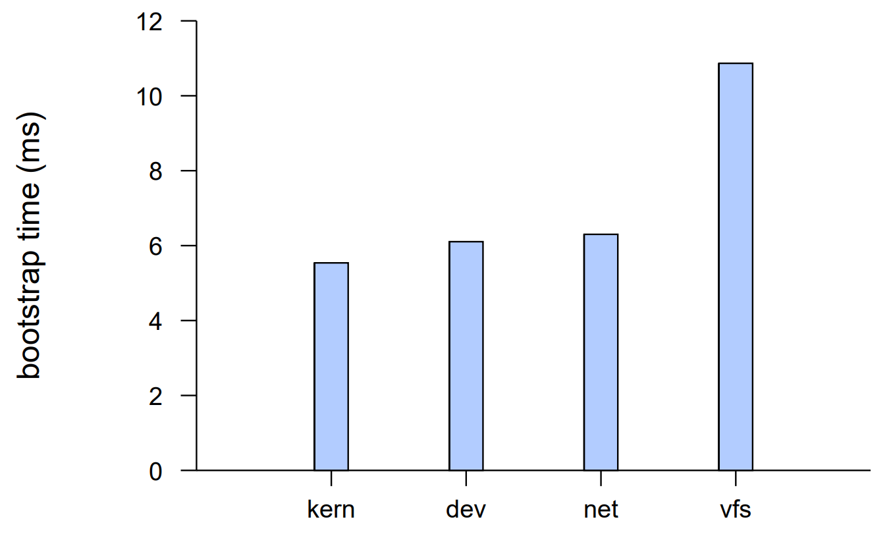
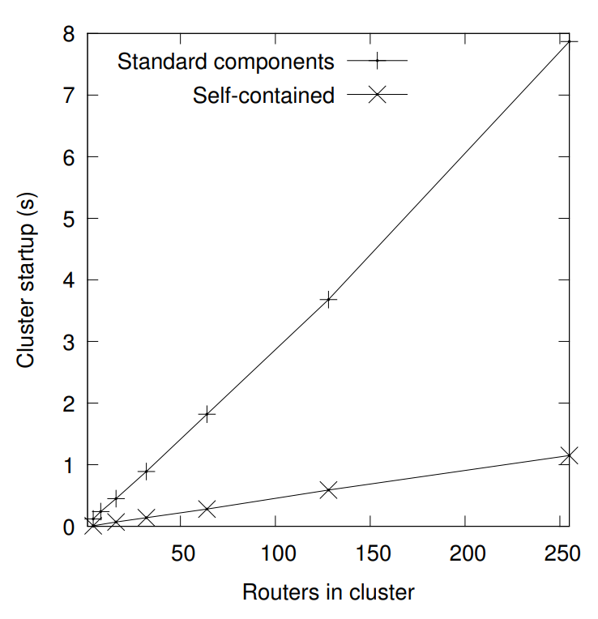

## 3.13 Experiment: Bootstrap Time

Startup time is important when the rump kernel is frequently bootstrapped and “thrown away”. This transitory execution happens for example with utilities and in test runs. It is also an enjoyment factor with interactive tasks, such as development work with a frequent iteration, as delays of over 100ms are perceivable to humans [38].

The bootstrap times for various rump kernel faction configurations are presented in Figure 3.30. In general, it can be said that a rump kernel bootstraps itself in a matter of milliseconds, i.e. a rump kernel outperforms a full operating system by a factor of 1000 with this metric. Furthermore, booting a rump kernel is faster than the time required for a hypervisor to launch a new instance. We conclude that a rump kernel boots fast enough.


Figure 3.30: Time required to bootstrap one rump kernel. The time varies from configuration to configuration because of the the initialization code that must be run during bootstrap.

### Network clusters

Bootstrapping a single node was measured to be an operation measured in milliseconds. High scalability and fast startup times make rump kernel a promising option for large-scale networking testing [24] by enabling physical hosts to have multiple independent networking stacks and routing tables.

We measure the total time it takes to bootstrap such a cluster in userspace, and to configure and send an ICMP ECHO packet through a networking cluster with up to 255 instances of a rump kernel. The purpose of the ICMP ECHO is to verify that all nodes are functional. The cluster is of linear topology, where node n can talk to the neighboring n−1 and n+ 1. This topology means that there are up to 254 hops in the network, from node 1 to 255.

We measured two different setups. In the first one we used standard binaries provided by a NetBSD installation to start and configure the rump kernels acting as the nodes. This remote client approach is most likely the one that will be used by most for casual testing, since it is simple and requires no coding or compiling. We timed the script shown in Figure 3.31. In the second setup we wrote a self-contained C program which bootstrapped a TCP/IP stack and configured its interfaces and routing tables. This local client approach is slightly more work to implement, but can be a valuable consideration if node startup and configuration is a bottleneck. Both approaches provide the same features during runtime. The results are presented in Figure 3.32.

```bash
#!/bin/sh

RUMP_COMP='-lrumpnet -lrumpnet_net -lrumpnet_netinet -lrumpnet_shmif'
[ $# -ne 1 ] && echo 'need count' && exit 1
[ ! $1 -ge 3 -o ! $1 -le 255 ] && echo 'count between 3 and 255' && exit 1
tot=$1

startserver()
{
        net=${1}
        export RUMP_SERVER=unix://rumpnet${net}
        next=$((${net} + 1))
        rump_server ${RUMP_COMP} ${RUMP_SERVER}

        rump.ifconfig shmif0 create
        rump.ifconfig shmif0 linkstr shm/shmif${net}
        rump.ifconfig shmif0 inet 1.2.${net}.1 netmask 0xffffff00

        if [ ${net} -ne ${tot} ]; then
                rump.ifconfig shmif1 create
                rump.ifconfig shmif1 linkstr shm/shmif${next}
                rump.ifconfig shmif1 inet 1.2.${next}.2 netmask 0xffffff00
        fi

        [ ${net} -ne 1 ] && \
            rump.route add -net 1.2.1.0 -netmask 0xffffff00 1.2.${net}.2
        [ ${next} -ne ${tot} -a ${net} -ne ${tot} ] && \
            rump.route add -net 1.2.${tot}.0 -netmask 0xffffff00 1.2.${next}.1
}

for x in `jot ${tot}`; do
        startserver ${x}
done

env RUMP_SERVER=unix://rumpnet${tot} rump.ping -c 1 1.2.1.1
```
Figure 3.31: Script for starting, configuring and testing a network cluster. This script can be used to test routing in up to the IP MAXTTL linearly chained TCP/IP stacks.


Figure 3.32: Network cluster startup time. The time is measured through starting the instances, configuring them, and up until the first packet sent from one end has made a full round-trip.

The standard component approach takes under 8s to start and configure a networking cluster of 255 nodes. Although this approach is fast enough for most practical purposes, when testing clusters with 10-100x as many nodes, this startup time can already constitute a noticeable delay in case a full cluster is to be restarted. Assuming linear scaling continues, i.e. hardware limits such as available memory are not hit, the local client approach can bootstrap 10k nodes in 45 seconds, which is likely fast enough for all cluster reboot purposes.

## 3.14 Summary

We began this chapter by describing the cornerstone techniques for how to convert an existing monolithic kernel codebase into an anykernel. To retain the existing properties of the monolithic kernel, we did not introduce any new technologies, and adjusted the codebase using code moving and function pointers. These techniques were enough to convert the NetBSD kernel into an anykernel with an independent base and orthogonal factions.

We went over the various rump kernel implementation aspects such as implicit thread creation and the CPU scheduler. After that, we studied the effects that feature relegation has on the implementation of the virtual memory subsystem and locking facilities. The rest of the chapter discussed various segments of the implementation, such as microkernel style file servers with rump kernel backends, USB hardware drivers and accessing rump kernels over the Internet.

We found out that many of the adjustments we did to NetBSD pertaining to the subject matter had a wider benefit. One example was the addition of the ioconf and pseudo-root keywords to a config file. This improvement simplified creating kernel modules out of device drivers and has been used by dozens of non rump kernel drivers since. Another modification we did was the ability to disable builtin kernel modules. This modification made it possible to disable drivers with newly discovered vulnerabilities without having to immediately reboot the system. These out-of-band benefits show that not only were our modifications useful in addressing our problem set, but they also benefit the original monolithic kernel.

