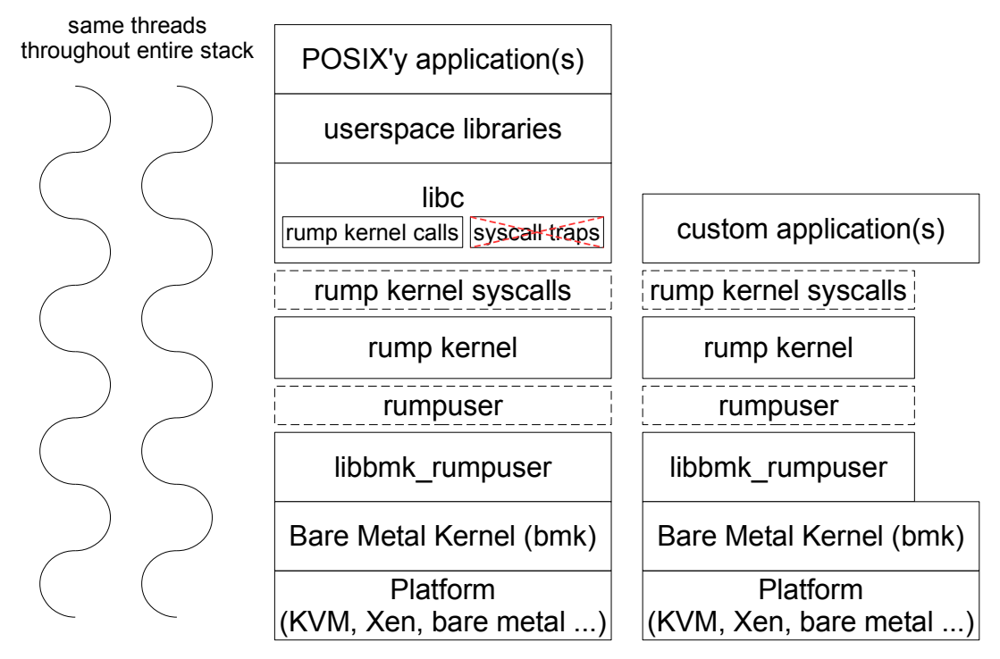
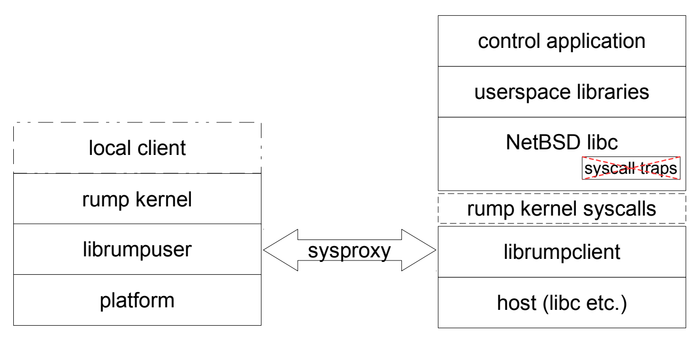

# 4 Rump Kernel Ecosystem

In the previous chapters we examined the core architectures of the anykernel and rump kernels. In this chapter, we will look at more practical aspects: how to build rump kernels on/for practically any architecture/OS, how to link rump kernels into software stacks and how to use the resulting software stacks. In other words, this chapter presents some use cases for rump kernels. As opposed to the previous chapter, we no longer limit the discussion to running rump kernels in NetBSD userspace.

We discuss software available from http://repo.rumpkernel.org.

## 4.1 `buildrump.sh`

To be able to run software, one must first compile software. Compiling software is done through a build framework, at least for any non-trivial project consisting of more than a handful of source modules. The rump kernel implementation grew around the native build framework of NetBSD. When building rump kernels for userspace as part of a NetBSD-targeted build, the right tools are automatically present and properly configured. Those tools are not automatically present in other situations, especially on non-NetBSD build hosts. The buildrump.sh script addresses the need of building rump kernel components on practically any POSIX-like host. The possible target platforms are legion.

At the core of buildrump.sh is NetBSD’s intrinsic ability to cross-build itself on any platform. The build involves first building the build tools as host binaries, and then moving on to build the rump kernel binaries for the target system. The crossbuild is accomplished by a script called build.sh [37]. After a fashion, the naming of buildrump.sh pays homage to the underlying script.

The script is available from http://repo.rumpkernel.org/buildrump.sh, along with related subroutine scripts.

### 4.1.1 The Double-crossing Toolchain

Let us first consider what cross-building is. A cross-build can be from one OS or version to another, from one machine architecture to another, neither, or both. buildrump.sh always assumes the case of both, which means for example that it will not perform probes which require executing the target code.

The common case for the build host is an x86 Linux and the target is building rump kernel components for x86. In other words, in the common case we are building from one OS to another, but are building for the same machine architecture as the host. Therefore, the host’s compiler knows how to generate target binaries. We will use this knowledge to optimize the user experience in the common case, while still supporting other cases as well.

The typical approach to cross-building is to first obtain a cross-toolchain and only after that proceed with the build. Contrary to standard practice, buildrump.sh does not build a toolchain. Instead, it creates wrappers around a user-supplied toolchain and builds the target binaries using those wrappers. The wrappers make the user-supplied toolchain look like a NetBSD toolchain, so that the NetBSD Makefiles work. For example, most compilers do not recognize the option -cxx-isystem. If the wrapper detects a compiler where that option is not supported, the option is translated to -isystem before the compiler is run.

The rationale behind using wrappers is convenience. First, downloading and building a cross-toolchain takes several times longer than building the actual rump kernel components. Second, since in the most common case (and a few others) there already is a usable toolchain sans wrappers, we would unnecessarily be burdening the user if we always required a NetBSD-targeting toolchain.

In cases where there is no possibility to use the host’s toolchain, e.g. when on Mac OS X which uses a different object format (MACH-O vs. ELF), the user must obtain a suitable toolchain before running buildrump.sh. The same requirement for first having to obtain a suitable toolchain also applies when compiling to a different machine architecture, e.g. to ARM from an x86 host.

Some compilers may generate code for different machine architectures based on the supplied flags. For example, gcc targeting x86 64 will generate code for 32bit x86 if -m32 is passed as an argument. As part of its output, buildrump.sh will publish the wrappers which include the toolchain flags passed to buildrump.sh. So, for example, if an x86 64 toolchain and -m32 is passed to buildrump.sh, a i386--netbsdelf toolchain will be generated by buildrump.sh. In Section 4.2 we will look at how this set of wrappers can be used for further constructs on top of rump kernels.

### 4.1.2 POSIX Host Hypercalls

The first use case of buildrump.sh was to make building the rump kernel for Linux userspace practical and user-friendly. For the result to also be functional, a hypercall implementation was required. Due to that historical reason, the default mode of operation of buildrump.sh is to also build the POSIX hypercall implementation from src-netbsd/lib/librumpuser and also a handful of other libraries and utilities such as src-netbsd/lib/librumphijack and src-netbsd/usr.bin/rump_server.

Different POSIX’y platforms have subtle differences, for example in which POSIX version they conform to, and therefore what the exact set of supported interfaces is. The first phase of building with a POSIX platform as the target runs a probe. The probe is a normal GNU autoconfigure script which is hosted in src-netbsd/lib/librumpuser/configure. The configure script checks for example if clock_nanosleep() is available, and therefore if it can be used to accurately implement rumpuser_clock_sleep() or if a best-effort use of nanosleep() is all that is possible.

When not building for a POSIX platform, the POSIX hypercall build must be explicitly disabled by the user. Disabling the POSIX hypercall build also disables the associated probe.

### 4.1.3 Full Userspace Build

Though the original purpose of buildrump.sh was to build kernel components, especially after work on the Rumprun unikernel (Section 4.2) began, it became clear that some easily invoked method for producing the corresponding NetBSD kernel and userspace headers and core userspace libraries, e.g. libc and libm, was required. This functionality was bolted on to buildrump.sh, and can optionally be invoked. It is worth taking the time to understand that producing full headers and libraries is orthogonal to building to run on a userspace platform.

### 4.1.4 src-netbsd

To build rump kernel components, buildrump.sh needs the source code for the relevant parts of the NetBSD tree. Theoretically, any vintage of the NetBSD source tree would work. However, in practice, a new enough vintage of the NetBSD tree is required. Historically, the user was required to obtain the NetBSD source tree before running buildrump.sh. Since the full NetBSD tree is large and since a majority of the tree is not relevant for rump kernels, the relevant parts of the tree are now mirrored at http://repo.rumpkernel.org/src-netbsd. This source tree represents a known-good and tested vintage of the NetBSD source tree for use with rump kernels; the contents are a regularly updated snapshot of the NetBSD development head. The checkout.sh script in the buildrump.sh repository handles the details of the mirroring process.

| branch name | description |
| ----------- | ----------- |
| kernel-src  | bare minimum sources necessary for building rump kernels. In addition to the kernel sources, the tools required for building rump kernels are also included in this branch. |
| user-src    | various userspace libraries and utilities useful for common rump kernel applications, e.g. libm and ifconfig |
| posix-src | rumpuser implementation for POSIX platforms |
| buildrump-src | kernel + posix, i.e. what buildrump.sh builds by default |
| appstack-src | kernel + user, useful for e.g. unikernels (Section 4.2) |
| all-src | kernel + posix + user |

Table 4.1: src-netbsd branches. The first set of branches are base branches which contain no overlap. The second set of branches are the convenience branches which contain a certain union of the base branches. You will most likely want to use a convenience branch for your project. The precise content lists for the base branches are available from src/sys/rump/listsrcdirs.

The src-netbsd repository supplies several branches, with the idea being that the user can choose the minimal set of sources required for their particular application. The branches are listed in Table 4.1. These branches may be used as either a submodule, or fully duplicated into third party repositories.

## 4.2 Rumprun Unikernel

The Rumprun unikernel is a unikernel [55] OS framework built on top of driver components provided by a rump kernels. Essentially, a unikernel is akin to an embedded system, where there is no separation between the application and system components of the software stack. Rump kernels are well-suited to building a unikernel framework, since the OS side of a unikernel is composed almost exclusively of drivers, as can be verified by examining the amount of non-driver code in Rumprun. While Rumprun is also applicable for bare metal embedded systems, the trend towards the cloud and microservices has made Rumprun particularly relevant due to the ability to run existing application-level programs.

The general idea of a unikernel is to bundle the operating system side components and application(s) into a single image. When that image is booted on a given platform, the instance is set up and the application is run according to the specified configuration. Notably, even though the application and system side components are bundled into a single image, the concept is orthogonal to whether or not both run in the same hardware protection domain.

The goal of Rumprun is to provide the simplest possible glue code for rump kernels to realize the target. We will discuss the inner workings of Rumprun. As usual, the exact details of how to build and configure the image are left to the user documentation.

The scope of the Rumprun unikernel is to enable creating bootable unikernel images from application-level source code. Those images may be manually launched to create instances. Details on how to deploy and manage a“fleet”of unikernel instances is beyond the scope of Rumprun. In other words, the Orchestrating System for the Rumprun unikernel is expected to be provided by 3rd parties

As an option, Rumprun can provide a POSIX-like userspace environment which allows turning unmodified POSIX programs into unikernel images. An explicit goal of Rumprun was to enable existing POSIX’y code to run with zero modifications. That is not to say that everything will work without modification — consider that code occasionally must be ported to run between regular Unix platforms — rather that the ideal case will not require code modifications. Non-trivial applications and libraries, e.g. libcurl, mpg123 and sqlite, do work without any changes. As we discuss Rumprun in this chapter, we will point out some limitations in Rumprun to further illustrate when code changes may be required.

A packaging system for tested and, where necessary, ported POSIX’y code to run on Rumprun is available at http://repo.rumpkernel.org/rumprun-packages. Further discussion on the packaging system is beyond the scope of this book.

The Rumprun unikernel works on top of x86 platforms on bare metal, Xen [3], KVM [29], and others. As of writing this, there is also nascent ARM support and Rumprun has successfully run networked services on an ARM evaluation board. In the following discussion, for machine dependent details, we will cover only x86, and more specifically x86_64.

Rumprun source code is available from http://repo.rumpkernel.org/rumprun. For an architecture diagram of the software stack, refer to Figure 4.1.



### 4.2.1 bmk – Bare Metal Kernel

Since a rump kernel is not a real kernel, we need a real kernel in our Rumprun software stack to provide functions which rump kernels do not give us. For review, these functions include for example bootstrap, thread creation, scheduling, interrupts and page level memory management. We call that kernel the Bare Metal Kernel, or bmk for short. We will use the shorthand form from now on. bmk was originally written to demonstrate how to run rump kernels on top of bare metal. The more common recent use case is to run as a virtualized service on top of e.g. KVM, but the name stuck nonetheless.

The platform-specific implementations of bmk for Xen and non-Xen (e.g. KVM and bare metal) are different in places. We will limit our discussion to non-Xen platforms. The parts of the implementation common to all platforms can be found under the source tree in lib/libbmk_core. Platform-specific code is in platform/xen and platform/hw for Xen and non-Xen, respectively

#### Bootstrap

The first stages of bootstrap are beyond Rumprun and relegated to a multiboot compatible bootloader, provided by e.g. GRUB [22] or QEMU [48]. The assembly entry point for bmk is at _start in platform/hw/arch/amd64/locore.S. At the entry point, we save information provided by multiboot (e.g. memory size), set up bootstrap pagetables, switch the CPU to 64bit mode — a multiboot loader will leave the CPU in 32bit mode — set up the stack, and proceed to call the C entry point x86_boot(). In other words, we do the minimum of what more or less every operating system does at the early bootstrap stage.

The C startup code initializes the console and performs various architecture-specific initializations such as setting up the interrupt controller. Then, the scheduler is initialized, the page allocator is set up, and finally the main thread is created by calling bmk_sched_startmain(). The main thread eventually launches the application.

#### Threads and Scheduling

Recall, everything in a rump kernel runs in thread context (Section 2.3). On Rumprun, everything except the lowest-level interrupt acknowledgement runs in cooperatively scheduled thread context. The scheduler, including thread creation and TLS support, is implemented in lib/libbmk_core/sched.c. The Rumprun stack has no knowledge of processes, apart from what rump kernels provide.

The rationale for cooperative scheduling is that it produces not only a more readily repeatable result from one execution to another, but also ensures that a thread is never preempted unless it has finished its work and is ready to block. In fact, a cooperative thread scheduler matches the run-to-completion behavior of the rump kernel CPU scheduler. Therefore, the Rumprun unikernel will never encounter the situation where a host thread is preempted with the rump kernel context held, and therefore unnecessary host thread context switches are avoided.

In environments where the scheduler must protect against threads hogging all CPU time and preventing other threads from running, cooperative scheduling is not possible. Since in a unikernel all threads are essentially working towards the same goal, we can assume that there are no hostile threads. Of course, there is no reason why preemptive scheduling could not be implemented for bmk, just that we have chosen not to do so. Generally speaking, we are of the opinion that cooperative scheduling is more effective for the Rumprun unikernel, due to reasons mentioned in the previous paragraph.

The rump kernel interacts with the scheduler via the hypercalls, as usual. When a rump kernel hypercall encounters a situation where it decides to block, it unschedules the rump kernel context, sets up the conditions for the wakeup, and calls bmk_sched_block(). The scheduler then selects the next thread to run, or if none are available, blocks and waits for an interrupt to generate work. Blocking via the rump kernel happens completely transparently to POSIX-style applications using rump kernel system calls. Custom non-POSIX applications, in addition to blocking via a rump kernel system call, may also call the bmk scheduler directly. Figure 4.2 illustrates with a stack trace how a POSIX application interacts with the bmk scheduler. In that particular case, the wakeup will be generated by a timer interrupt; the timer interrupt will wake the interrupt thread, which in turn will wake up the application thread.

The cooperative scheduling model exhibits a feature over the typical preemptively scheduled pthreads. Any program with a thread which runs in a busy-loop without making blocking system calls will block the entire system. However, this type of behavior is not common and mostly found in programs for scientific computation. Nonetheless, one must be aware of the limitation when choosing the programs which run on Rumprun. If it is absolutely necessary to run such programs, the best option is to insert yield calls into the busy-looping thread. To ensure correct execution of periodic tasks, application threads should yield or block dozens of times per second. Since yielding is cheap, it is better to err on the side of doing it more often than necessarily. Still, we want to stress that in our experience, regular I/O bound programs “just work” without modification.

```asm
#0  bmk_sched_block ()                  [bmk]
#1  rumpuser_clock_sleep ()             [rumpuser]
#2  kpause ()                           [rump kernel]
#3  nanosleep1 ()                       [rump kernel]
#4  sys___nanosleep50 ()                [rump kernel]
#5  sy_call ()                          [rump kernel]
#6  sy_invoke ()                        [rump kernel]
#7  rump_syscall ()                     [rump kernel]
#8  rump___sysimpl_nanosleep50 ()       [rump kernel]
#9  __nanosleep50 ()                    [libpthread]
#10 _sleep ()                           [libc]
#11 main ()                             [application]
```

Figure 4.2: Rumprun stack trace for sleep(). The trace starts from the application and ends where bmk schedules another thread. The stack trace is annotated on the right with descriptions of which logical component each stack frame belongs to.

### 4.2.2 Rumpuser

The rumpuser hypercall interface for the rump kernel is implemented on top of bmk. The implementation resides in rumprun/lib/lib/libbmk_rumpuser. The implementation can be used as a reference implementation for rumpuser especially for cases with underlying cooperative threading. We leave perusing the implementation to the interested reader.

### 4.2.3 To Userspace (or Not To Userspace)

As indicated in Figure 4.1, two modes of operation are available: one which is capable of running POSIX’y userspace and one which is not capable of that. There are tradeoffs to including a full userspace stack in your unikernel instance. Throughout this text, by “userspace” we mean the normal userspace environment available on a regular POSIX’y operating system. On a unikernel, there is strictly speaking no hard division between the kernel and userspace, but we nonetheless use the term “userspace” to describe the POSIX’y application portion of the stack.

Like on a regular operating system, the userspace environment is a collection of library interfaces on top of which normal programs run. The system call interface is an analogous, lower level set of interfaces, but in most cases programs will run on top of the userspace environment, not directly on system calls. There are some exceptions, such as programs written in Go [54], where the language runtime is implemented directly on top of system calls.

The advantage of including userspace support is not only that POSIX programs work out-of-the-box, but also that userspace interfaces are mostly standard and stable. Therefore, no matter the future work we do on the Rumprun unikernel, we will always guarantee that userspace interfaces remain stable. We do not offer the same level of guarantee for bmk, even if we attempt to minimize churn.

The disadvantage of the full userspace stack is its extra footprint. Not only are userspace libraries mandated, but in practise the rump kernel file system components are needed because of various libc interfaces implicitly assuming the presence of certain files, e.g. /etc/services and /etc/resolv.conf. Therefore, if you need to minimize your footprint, and you do not have an existing, complex application written against POSIX interfaces, you most likely want to avoid the userspace layers.

```c
#ifdef RUMP_KERNEL_IS_LIBC
__weak_alias(lseek,rump___sysimpl_lseek);
__weak_alias(_lseek,rump___sysimpl_lseek);
__strong_alias(_sys_lseek,rump___sysimpl_lseek);
#endif /* RUMP_KERNEL_IS_LIBC */
```

Figure 4.3: Userspace aliases for rump kernel syscalls. Conditionally, a rump kernel can provide system calls with names that a userspace environment expects. Both user-visible overridable (weak) and system-internal non-overridable (strong) aliases are provided. Not all aliases are necessary for all system calls, but since they do no harm, we provide them. For discussion on the system call entry point itself, see Section 3.6.1. As usual, there is a naming problem (with the macro name), but since the name is not user-visible, it has not been worth the fuss to adjust the name.

#### System Calls

We know from Section 3.6.1 that a rump kernel provides ABI-identical system calls apart from a rump_sys_ prefix in the symbol name. We also implicitly understand that some component in the Rumprun software stack must provide the system calls under the same name as a regular libc. Furthermore, performing a system call must result in the handler in the rump kernel being invoked.

The system call entry points in libc invoke the kernel via a hardware trap. Those entry points may be useful in the future if we wish to run the application portion and system portion of the Rumprun stack in separate protection domains. However, in the simplest model we do not wish to assume anything about the underlying platform’s capability to support privilege levels, and therefore the standard libc entry points are not applicable.

We augment the rump kernel system call handlers to conditionally alias the rump kernel entry point symbol to the libc symbols. These aliases are illustrated in Figure 4.3. For the Rumprun unikernel, we build the rump kernel with that conditional knob turned on. Furthermore, we build libc without the usual trap-generating entry points. When everything is linked together, an application unaware of rump kernels calling foo() results in the same as an application aware of rump kernels calling rump_sys_foo(). In effect, POSIX applications on Rumprun act as local rump kernel clients without being aware of it.

#### POSIX Threads (pthreads)

The POSIX threads or pthreads library offers a set of interfaces upon which multithreaded applications can be realized. Those interfaces include for example ones for creating threads and performing synchronization between threads. Given the standard nature and widespread use of pthreads, we wish to support programs which use pthreads.

Again, there are multiple straightforward ways on how to realize pthread support. One is to write a pthread library from scratch. Another one is to port a pthread library from another operating system. However, both of those approaches incur implementation effort and maintenance, and are against our general principles of design.

We observe that the NetBSD pthread library is implemented 1:1 on top of NetBSD’s kernel threads, i.e. the relation between an application pthread and a kernel thread is a bijection. To for example create a new thread, libpthread uses the _lwp_create() system call, and to put the current thread to sleep awaiting wakeup, _lwp_park() is called.

To support the NetBSD pthread library on top of the threads offered by bmk, we implemented the _lwp interfaces against bmk in lib/librumprun_base/_lwp.c. After that, we could use NetBSD’s libpthread to provide pthreads on Rumprun.

As an implementation detail, as of writing this, _lwp.c is implemented as libc-level symbols in the userspace package (rumprun base). Henceforth, software wanting to bypass libc and use the lwp interfaces to implement their own threading, e.g. the Go runtime, must include userspace support. This feature may be fixed at a future date by pushing the implementation of the lwp interfaces into the rump kernel.

#### Limitations

Recall, rump kernels do not support virtual memory or preempting threads. Therefore, rump kernels do not provide memory mapping (mmap(), madvise() and friends) or signals. These two facilities are used by some userspace applications.

For signals, we simply resort to stating “signals are evil”. (There are advantages to this book no longer being an academic text.) Therefore, any application requiring signals for basic functionality will not work without porting. Coming up with mostly functional signal emulation, where handlers are called at select points without preempting threads, may be done at a future date. Regardless of whether that will be emulated or not, signals still are evil.

We emulate some aspects of memory mapping in the component library located at lib/librumpkern_mman. Notably, emulation is hooked in as rump kernel syscalls so that custom applications may use that emulation. Anonymous memory mapping is simply a matter of allocating the right amount of memory, though Rumprun will not respect the read/write/execute protection flags. Memory mapping files is more complicated, since the contents need to be paged in and out. Since there is no virtual memory, there are no page faults, and contents cannot be paged in on demand. As of writing this, read-only mapping are emulated by reading in the full contents at the time of the mapping. While the approach is not perfect in many ways, it allows a decent set of programs to work in some cases at the cost of a handful lines of code.

### 4.2.4 Toolchain

The Rumprun unikernel is always cross-compiled, which means that the build process never runs on a Rumprun instance. Instead, the build process runs on a build host, e.g. a regular Linux system. To [cross-]build software, a toolchain is required.

For custom applications, we have no external standards to bow down towards, nor do we want to impose any limitations on how to build custom applications. Therefore, it is up to the builder of the custom application how to build and link the unikernel image. A straightforward way is to use the toolchain wrappers generated by buildrump.sh (Section 4.1.1). We will not further discuss toolchains for custom applications.

For POSIX’y userspace applications, we do have external standards to bow down to. Application are engineered to build using a build system (e.g. GNU autotools or CMake). Build systems assume that the toolchain looks a certain way, and that the build consists of certain steps. Those steps can be for example, probe, build and link. Recall, in the best case scenario unmodified applications work on a Rumprun unikernel. It would be convenient if those applications could also be built for the Rumprun unikernel without having to introduce changes to the build system. That was the goal of the application toolchain. The rest of the discussion in this section is on how that goal was accomplished.

#### The ABI

When building application source code, one must decide which ABI to build for. That ABI will determine where the program can run. Typically, the ABI is signified by the tuple ingrained into the toolchain. For example, a x86_64-linux-gnu toolchain will produce a binary which can run on an x86-64 machine with a Linux kernel and a GNU userspace. In other words, there is a machine architecture component and a system side component to the ABI. The binary can be run only on a machine architecture and an operating system which supports the given ABI. The obvious example of an operating system supporting the Linux-GNU ABI is Linux, but it is also possible to other operating systems to emulate various ABIs to allow running programs complied for a non-native ABI.

For Rumprun, we use the same tuple as NetBSD, e.g. x86_64--netbsd, but insert “rumprun” into the otherwise empty vendor field. Therefore, for x86 64 the ABI tuple of Rumprun is x86_64-rumprun-netbsd. The installed toolchain for building Rumprun images follows the standard convention of naming binaries, e.g. x86_64-rumprun-netbsd-ar and x86_64-rumprun-netbsd-gcc. Internally, the toolchain is a set of wrappers around the toolchain provided by buildrump.sh, which in turn is a set of wrappers around the toolchain supplied by the user.

#### The Implementation of the ABI

In the normal case, the operating system implementing the system side of the ABI is not bundled with the binary. The operating system itself comes to be when a certain selection of drivers implementing that ABI is booted. Notably, there is no strict contract between the ABI and which drivers the operating system must provide for the program to run correctly. A Linux kernel without networking support can still run Linux binaries, but programs using networking will not run as expected on that particular Linux instance.

In other words, in the normal model, building & booting the operating system and building & running applications are separate steps. Normal build systems also assume them to be separate steps, and do not include a step to determine which operating system components should be linked into the binary. If we wish normal build systems to work without modification, we must address this disparity on our side.

#### Pseudo-linking and Baking

One solution for specifying the implementation of the ABI would be to hardcode the set of rump kernel components into the toolchain and to identify the set in the toolchain tuple. However, that solution would mean creating a separate set of toolchain wrappers for every desired component combination, and would be hard to manage. Another option would be to always include all drivers, but it would be wasteful, and also possibly would not work — consider situations where you have two mutually exclusive drivers for the same backend.

A more flexible solution comes from what we call pseudo-linking. When the application part of the binary is linked, the operating system components are not attached to the binary. Instead, the application link phase produces non-runnable intermediate format, which includes the objects and libraries specified on the link command line.

The pseudo-link phase checks that all application symbol dependencies are satisfied. Again, doing so honors existing conventions; this check is required for example by the probe phase of some build frameworks, which determine if a certain interface is supported by the given system by trying to link a test program using that interface, and iff the link succeeds, mark that interface as available. It needs to be noted that these types of checks apply only to userspace interfaces, and not to the kernel drivers backing those interfaces, so things may still fail at runtime. However, limiting the check to userspace interfaces is what current POSIX’y applications expect.

To produce the bootable unikernel image, the pseudo-linked intermediate representation is baked. The baking process attaches the operating system side driver components to the image, analogous to the normal case where the operating system implementing the ABI is booted. Baking is done using the rumprun-bake tool.

The entire set of steps require for transforming source code to a bootable unikernel image is illustrated in Figure 4.4.

```shell
$ cat > hello.c << EOF
> #include <stdio.h>
> int main() {printf("Hello, Rumprun!\n");}
> EOF
$ x86_64-rumprun-netbsd-gcc -c -o hello.o hello.c   # compile
$ x86_64-rumprun-netbsd-gcc -o hello hello.o        # pseudo-link
$ rumprun-bake hw_virtio hello.bin hello            # bake
```
Figure 4.4: Building a runnable Rumprun unikernel image. The different phases of the build are illustrated. First, the object files are compiled. Second, the object files are pseudo-linked. Any objects and libraries specified at this stage will be carried by the intermediate representation. Finally, the remainder of the Rumprun stack is baked into the pseudo-linked intermediate representation. In this example, we used the hw virtio configuration, which contains the I/O drivers for cloud hypervisors. In case hw generic is specified instead, drivers for bare metal would be included.

#### Pipelines and Multibaking

Consider the Unix pipeline: a program generates output which is fed to the next stage in the pipeline as input. Therefore, a program does not need the knowledge of how to generate the input or how to store the output, as long as the program has the knowledge of how to process the data. Assume we have such a program which knows how to process data, but not whence the data is coming or where it is going to. We wish to support that concept in Rumprun, for example for cases where POSIX’y programs are used as highly isolated data processors.

For example, imagine that the user wishes the main program to read input using HTTP, but the program lacks intrinsic HTTP support. This feat would be accomplished on a regular system with e.g. “curl http://add.ress/input | prog”. There are a few possible routes to support the same in Rumprun. We will discuss some of those possibilities before discussing the option we chose.

* adjusting the main program: our guiding principle throughout this entire work is to avoid unnecessary forking and modification. In some cases teaching the main program may be necessary, for example when processing multiple small files is desired. However, for this discussion we will consider adding knowledge of HTTP to the main program as a last resort.
* use of a file system driver: a file system is akin to a system-side pipeline, though possessing the additional features of named streams and seeking, among others. It would be possible to hide the details of HTTP from an application inside a file system driver. However, due to the above-mentioned additional features which are usually not not required in a pipeline, file system drivers require implementing a dozen-or-so methods to have even bare-bones functionality. Therefore, the implementation effort of what could be accomplished with a handful of lines of application code is increased by at least an order of magnitude.

To solve the pipeline problem, we observe that a rump kernel already supports multiple processes, as required by remote client support (Section 2.5), and pipes between those processes (rump_sys_pipe()). Using a regular pipe between the rump kernel processes allows data to flow between the programs. The remaining puzzle pieces come from the separation of pseudo-linking and baking. We allow rumprun-bake to take multiple binaries which are baked into the final executable. For example, the following command will include both the processor and transporter in the final runnable binary:

```shell
$ rumprun-bake hw_virtio rumprun.bin processor transporter
```

This unikernel can then be run so as to imitate the following pipeline:

```shell
$ ./transporter r src | ./processor - | ./transporter w dst
```

Note, in the current implementation the transporter and processor share for example the same libc state and symbol namespace. Therefore, as of writing this, multibaking cannot be used to include multiple arbitrary programs in the same Rumprun image. However, the approach works in cases where the transporter program is judiciously crafted to suit the purpose. Support for arbitrary programs may or may not be added at a future date.

### 4.2.5 PCI: Big Yellow Bus

In Section 3.10 we looked at using USB devices in rump kernels. Ignoring the desirability of that approach, for Rumprun the same approach of relying on a thick underlying layer is not feasible — the only underlying software layer is bmk. For Rumprun on x86 hardware(/KVM), the desired peripheral I/O devices are on PCI busses. To use those devices, we provide PCI bus access via hypercalls, and use the PCI device drivers provided by the rump kernel for actual device access. The hypercalls follow the boundaries of the MI/MD (machine in/dependent) code boundary in NetBSD. We stress that the discussion in this section is about x86 bare metal.

Essentially there are three classes of hypercalls that are required to support PCI
devices:

* PCI configuration space access. By accessing configuration space registers, software can determine which devices are present, alter PCI-specific behavior of the device, and gain access to the device-specific registers. Configuration space access is done using x86 I/O operations (inl(), outl()). While those instructions could be used within the rump kernel without resorting to hypercalls, we use hypercalls for the benefit of being able to share the PCI code with other platforms which are not described here.
* Interrupt handling. Establishing an interrupt means that when an interrupt is triggered on the CPU, the corresponding interrupt handler gets called to inspect the device. While the process is simple in theory, a problem arises from mapping the device’s idea of an interrupt line to the corresponding line detected by the CPU. Most systems attempt to establish this relationship by parsing the relevant ACPI tables. We take a simplistic approach which does not require thousands of lines of code: since there are typically only 1-2 PCI I/O devices on a given Rumprun instance, we assume that all devices share an interrupt and call all handlers when any PCI interrupt arrives. We may include proper support for interrupt routing at a future date, if a need arises.
* DMA-safe memory handling. DMA is not a PCI-specific construct, but since PCI devices are the only devices on Rumprun which do DMA, we discuss DMA here. Essentially, DMA is a matter of being able to allocate “DMA safe” memory. In practice, safety means physically contiguous memory which is allocated according to certain boundary and alignment constraints. The boundary constraint means the range must not cross a certain multiple, and alignment means that the range must start from the multiple. Since bmk uses 1:1 mapped memory, any contiguous address range is also physically contiguous.
In theory, NetBSD PCI drivers may request to allocate DMA memory in multiple physical segments and then map those segments to a virtually contiguous range in the kernel VA. A general solution for such a mapping need virtual memory support; however, we have not yet come across drivers which would use this functionality, and hence have not felt a need to solve the unencountered problem.

## 4.3 rumpctrl

A normal operating system is configured for operation and inspected at runtime by a selection of userspace utilities. Examples of these utilities on NetBSD include ifconfig, mount, sysctl and raidctl. Those utilities are useful for controlling and monitoring the runtime state of for example the Rumprun unikernel. From our discussion in Section 3.12, we know that we can run such binaries as remote clients. However, the problem arises from where to host such binaries.

On a NetBSD system, the right set of utilities are available as regular host binaries, and we can run those binaries as hijacked remote clients (Section 3.12.6). The system calls and data structures used by the utilities are non-portable, and mechanisms such as ioctl(), sysctl() and the routing socket are used. Therefore, it is highly nontrivial to port and compile those utilities on other operating systems. Furthermore, the system call interfaces used by the utilities evolve as the capabilities of the kernel drivers evolve, and therefore it is not enough to port the utilities once. In effect, the utilities cannot be used on non-NetBSD systems and porting the utilities to those systems involves the porting work and continuous maintenance work.

One possibility would be to require running the control utilities on a NetBSD system, perhaps in a virtual machine. However, that would be against our principle of convenience for the user.

The solution comes from running a unikernel-like stack in userspace coupled with remote system calls (librumpclient). Notably, no hijacking of system calls is required since system calls are directed against the rump kernel by default, just like in the case of Rumprun. To avoid collisions between the host’s libc and the NetBSD libc, careful symbol renaming is performed during the build stage. The architecture of the solution is depicted in Figure 4.5.



The usage of rumpctrl follows the same principles as remote clients (Section 3.12.2); the environment variable RUMP_SERVER contains the URL which points the client to the server. Additionally, rumpctrl provides a source’able script which sets the rumpctrl commands at the front of PATH. In the following demonstration we have a rump kernel server (in this case a Rumprun unikernel) listening to sysproxy commands on a management interface at 10.0.0.2:12345. Additionally, we demonstrate the rumpctrl_listcmds command, which prints the commands provided by rumpctrl .

```shell
$ . rumpctrl.sh
rumpctrl (NULL)$ sysctl hw.model
error: RUMP_SERVER not set
rumpclient init failed
rumpctrl (NULL)$ export RUMP_SERVER=tcp://10.0.0.2:12345
rumpctrl (tcp://10.0.0.2:12345)$ sysctl hw.model
hw.model = rumpcore (virtual)
rumpctrl (tcp://10.0.0.2:12345)$ rumpctrl_listcmds
arp             ed              mkdir           newfs_ext2fs    rndctl
cat             fsck            mknod           newfs_msdos     route
cgdconfig       fsck_ext2fs     modstat         npfctl          rtadvd
chmod           fsck_ffs        mount           pax             sysctl
chown           fsck_msdos      mount_ext2fs    pcictl          umount
cp              halt            mount_ffs       ping            vnconfig
dd              ifconfig        mount_msdos     ping6           wlanctl
df              ktrace          mount_tmpfs     raidctl         wpa_passphrase
disklabel       ln              mv              reboot          wpa_supplicant
dump            ls              ndp             rm
dumpfs          mixerctl        newfs           rmdir
```

## 4.4 fs-utils

Fs-utils [60] (http://repo.rumpkernel.org/fs-utils) is a suite of userspace file system utilities (hence the name) which intrinsically contain file system drivers; the utilities do not use file system drivers from the host kernel. The motivations for building such a suite are the usual: running the file system driver in userspace does only not depend on having support in the host kernel, but also does not risk a host kernel compromise in case of a corrupt or maliciously corrupted file system image. In the permissions department, read and optionally write permissions to the image are enough, no elevated permissions are needed by the user running the utilities.

The implementation of fs-utils consists of standard standard NetBSD file utilities (ls, cat, mv, etc.) which use rump kernel file system drivers as local clients. Doing so preserves the normal usage of the utilities, e.g. ls accepts the familiar -ABcFhL parameter string.

The only exception to command line arguments is that the first parameter is interpreted as the location specifier the file system is mounted from. The tools make an attempt to auto-detect the type of file system, so passing the file system type is optional. For example, fsu_ls /dev/rwd0a -l might list the contents of a FFS on the hard drive, while fsu_ls 10.181.181.181:/m/dm -l would do the same for an NFS export <sup>10</sup>

> <sup>10</sup> In case of NFS, the sockin networking facility (Section 3.9.1) is used, so no TCP/IP stack
configuration is required.

Alternative ways of implementing such a file system utility suite are to write or port the file system drivers, or use full operating systems in virtual machines. Those approaches are demanding in terms of programming work or runtime resources, respectively.

## 4.5 Summary

In this chapter we examined the ecosystem of tools and products built on top of rump kernels. At the center of the ecosystem is the buildrump.sh script, which allows building rump kernels on any POSIX-like system for a variety of targets. We discussed examples of what to build on top. One example was the Rumprun unikernel, which allows running POSIX’y applications on bare metal and the cloud. Another example was the fs-utils tool suite, which consists of tools capable of accessing and modifying file system images.