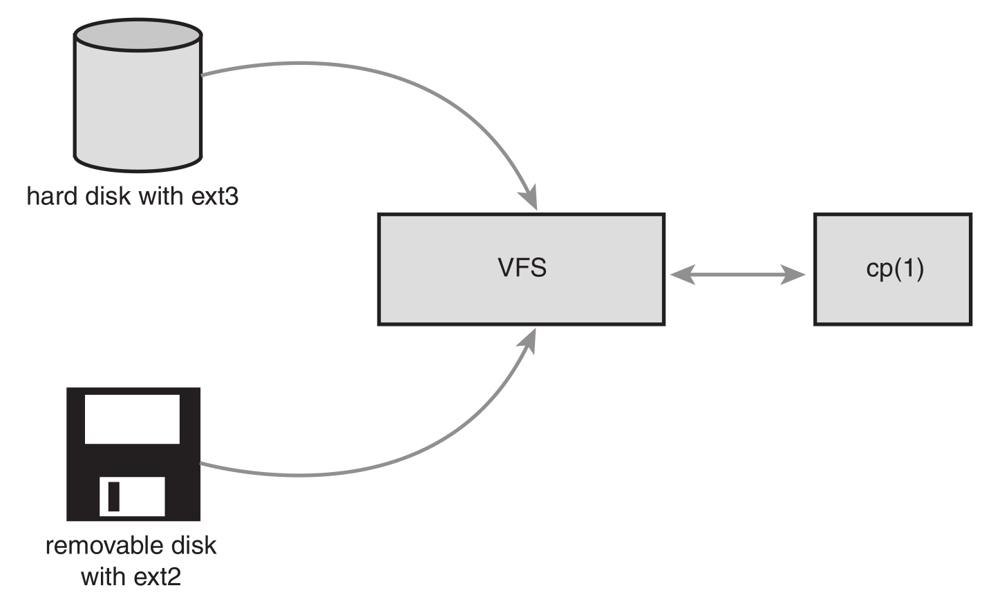
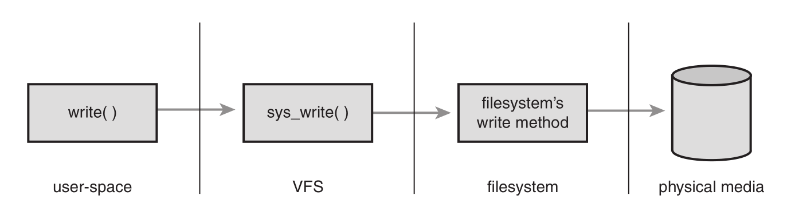

# The Virtual Filesystem

The Virtual Filesystem (sometimes called the Virtual File Switch or more commonly simply the VFS) is the subsystem of the kernel that implements the file and filesystem-related interfaces provided to user-space programs.All filesystems rely on the VFS to enable them not only to coexist, but also to interoperate.This enables programs to use standard Unix system calls to read and write to different filesystems, even on different media, as shown in Figure 13.1.

虚拟文件系统（有时也称作虚拟文件交换，更常见的是简称VSF）作为内核子系统，为用户空间程序提供了文件和文件系统相关的接口。系统中所有文件系统不但依赖VFS共存，而且也依靠VSF系统协同工作。通过虚拟文件系统，程序可以利用标准的unix 系统调用对不同的文件系统，甚至不同介质上的文件系统进行读写操作，如图 13-1 所示：



*Figure 13.1 The VFS in action: Using the cp(1) utility to move data from a hard disk mounted as ext3 to a removable disk mounted as ext2. Two different filesystems, two different media, one VFS.*

## Common Filesystem Interface

The VFS is the glue that enables system calls such as open() , read() , and write() to work regardless of the filesystem or underlying physical medium.These days,that might not sound novel—we have long been taking such a feature for granted—but it is a nontrivial feat for such generic system calls to work across many diverse filesystems and varying media. More so, the system calls work between these different filesystems and media — we can use standard system calls to copy or move files from one filesystem to another. In older operating systems, such as DOS, this would never have worked; any access to a nonnative filesystem required special tools. It is only because modern operating systems, such as Linux, abstract access to the filesystems via a virtual interface that such interoperation and generic access is possible.

VFS 是的用户可以直接使用 `open()`、`read()`和 `write()` 这样的系统调用而无需考虑具体文件系统和实际物理介质。现在听起来这并没有什么新奇的（我们早就认为这是理所当然的），但是，使得这些通用的系统调用可以跨越各种文件系统和不同介质执行，绝非微不足道的成绩。更了不起的是，系统调用可以在这些不同的文件系统和介质之间执行 —— 我们可以使用标准的系统调用从一个文件系统拷贝或移动数据到另外一个文件系统。老式的操作系统（比如DOS）是无力完成上述工作的，任何对非本地文件系统的访问都必须依靠特殊的工具才能完成。正是由于现代操作系统引入抽象层，比如Linux，通过虚拟接口访问文件系统，才使得这种协作性和泛型存取成为可能。

New filesystems and new varieties of storage media can find their way into Linux,and programs need not be rewritten or even recompiled. In this chapter, we will discuss the VFS, which provides the abstraction allowing myriad filesystems to behave as one. In the next chapter, we will discuss the block I/O layer, which allows various storage devices — CD to Blu-ray discs to hard drives to  CompactFlash.Together, the VFS and the block I/O layer provide the abstractions, interfaces, and glue that allow user-space programs to issue generic system calls to access files via a uniform naming policy on any filesystem, which itself exists on any storage medium.

新的文件系统和新类型的存储介质都能找到进入 Linux 之路，程序无需重写，甚至无需重新编译。在本章中。我们将讨论 VFS，它把各种不同的文件系统抽象后采用统一的方式进行操作。在第 14 章中，我们将讨论 块I/O 层，它支持各种各样的存储设备 —— 从 CD 到蓝光光盘，从硬件设备再到压缩闪存。VFS 与块 I/O 相结合，提供抽象、接口以及粘合层，使得用户空间的程序调用统一的系统调用访问各种文件，不管文件系统是什么，也不管文件系统位于何种介质，采用命名策略是统一的。

## Filesystem Abstraction Layer

Such a generic interface for any type of filesystem is feasible only because the kernel implements an abstraction layer around its low-level filesystem interface.This abstraction layer enables Linux to support different filesystems, even if they differ in supported features or behavior.This is possible because the VFS provides a common file model that can represent any filesystem’s general feature set and behavior. Of course, it is biased toward Unix-style filesystems. (You see what constitutes a Unix-style filesystem later in this chapter.) Regardless, wildly differing filesystem types are still supportable in Linux, from DOS’s FAT to Windows’s NTFS to many Unix-style and Linux-specific filesystems.

之所以可以使用这种通用接口对所有类型的文件系统进行操作，是因为内核在它的底层文件系统接口上建立了一个抽象层。该抽象层使 Linux 能够支持各种文件系统，即便是它们在功能和行为上存在很大差别。为了支持多文件系统，VFS 提供了一个通用的文件系统模型，该模型囊括了任何文件系统的常用功能集和行为。当然，该模型偏重于 Unix 风格的文件系统（我们将在后边的小节看到 Unix 风格的文件系统构成）。但即使这样， Linux 仍然可以支持很多种差异很大的文件系统，从DOS 系统的 FAT 到Windows 系统的NTFS，再到各种 Unix风格文件系统和 Linux 特有的文件系统。

The abstraction layer works by defining the basic conceptual interfaces and data structures that all filesystems support.The filesystems mold their view of concepts such as “this is how I open files” and “this is what a directory is to me” to match the expectations of the VFS.The actual filesystem code hides the implementation details.To the VFS layer and the rest of the kernel, however, each filesystem looks the same.They all support notions such as files and directories, and they all support operations such as creating and deleting files.

VFS 抽象层之所以能衔接各种各样的文件系统，是因为它定义了所有文件系统都支持的、基本的、概念上的接口和数据结构。同时实际文件系统也将自身的诸如“如何打开文件”，“目录是什么”等概念在形式上与VFS 的定义保持一致。因为实际文件系统的代码在统一的接口和数据结构下隐藏了具体的实现细节，所以在VFS层和内核的其他部分看来，所有文件系统都是相同的。它们都支持像文件和目录这样的概念，同时也支持像创建文件和删除文件这样的操作。

The result is a general abstraction layer that enables the kernel to support many types of filesystems easily and cleanly.The filesystems are programmed to provide the abstracted interfaces and data structures the VFS expects; in turn, the kernel easily works with any filesystem and the exported user-space interface seamlessly works on any filesystem.

内核通过抽象层能够方便，简单地支持各种类型文件系统。实际文件系统通过编程提供 VFS 所期望的抽象接口和数据结构，这样，内核就可以毫不费力地和任何文件系统协同工作，并且这样提供给用户空间的接口，也可以和任何文件系统无缝地连接在一起，完成实际工作。

In fact, nothing in the kernel needs to understand the underlying details of the filesystems, except the filesystems themselves. For example, consider a simple user-space program that does :

其实在内核中，除了文件系统本身外，其他部分并不需要了解文件系统的内部细节。比如一个简单的用户空间程序执行如下的操作：

```c
ret = write (fd, buf, len);
```

This system call writes the len bytes pointed to by buf into the current position in the file represented by the file descriptor fd .This system call is first handled by a generic `sys_write()` system call that determines the actual file writing method for the filesystem on which fd resides.The generic write system call then invokes this method, which is part of the filesystem implementation, to write the data to the media (or whatever this filesystem does on write). Figure 13.2 shows the flow from user-space’s write() call through the data arriving on the physical media. On one side of the system call is the generic VFS interface, providing the frontend to user-space; on the other side of the system call is the filesystem-specific backend, dealing with the implementation details.The rest of this chapter looks at how theVFS achieves this abstraction and provides its interfaces.

该系统调用将 buf 指针指向长度为 len 字节的数据写入文件描述符 fd 对应的文件的当前位置。这个系统调用首先被一个通用系统调用 `sys_write()` 处理，`sys_write()` 函数要找到 fd 所在的文件系统实际给出的是哪个写操作，然后再执行该操作。实际文件系统的写方法是文件系统实现的一部分，数据最终通过该操作写入介质（或执行这个文件系统想要完成的写动作）。图 13-2 描述了从用户空间的 `write()` 调用到数据被写入磁盘介质的整个流程。一方面，系统调用时通用 VFS接口，提供给用户空间的前端；另一方面，系统调用时具体文件系统的后端，处理时限细节。接下来的小节中我们会具体看到 VFS 抽象模型以及它提供的接口。



## Unix Filesystems

Historically, Unix has provided four basic filesystem-related abstractions: files, directory entries, inodes, and mount points.

Unix 使用了四种和文件系统相关的抽象概念：文件、目录项、索引节点和挂载点。

A filesystem is a hierarchical storage of data adhering to a specific structure. Filesystems contain files, directories, and associated control information. Typical operations performed on filesystems are creation, deletion, and mounting. In Unix, filesystems are mounted at a specific mount point in a global hierarchy known as a namespace. 1 This enables all mounted filesystems to appear as entries in a single tree. Contrast this single, unified tree with the behavior of DOS and Windows, which break the file namespace up into drive letters, such as C: .This breaks the namespace up among device and partition boundaries, “leaking” hardware details into the filesystem abstraction.As this delineation may be arbitrary and even confusing to the user, it is inferior to Linux’s unified namespace.

从本质上讲文件系统是个数的数据分层存储结构，它包含文件、目录和相关的控制信息。文件系统的通用操作包括创建、删除和安装等。在 Unix 中，文件系统被安装在一个特定的挂载点上，该挂载点在全局层次结构中被称为命名空间，所有的已安装文件系统都作为根文件系统树的枝叶出现在系统中。与这种单一、统一的树形成鲜明对比的就是 DOS 和 Windows 的表现，它们将文件的命名空间分类为驱动字母，例如 `C:`，这种将命名空间划分为设备和分区的做法，相当于把硬件细节“泄露”给文件系统抽象层。对用户而言，如此的描述有点随意，甚至产生混淆，这是 Linux 统一命名空间所不屑一顾的。

> 1 Recently, Linux has made this hierarchy per-process, to give a unique namespace to each process. Because each process inherits its parent’s namespace (unless you specify otherwise), there is seemingly one global namespace.
>
> 近来，Linux已经将这种层次化概念引入和单个进程中，每个进程都指定一个唯一的命名空间。因为每个进程都会集成父进程的命名空间（除非是特别声明的情况），所以所有进程往往都只有一个全局命名空间。

A file is an ordered string of bytes.The first byte marks the beginning of the file, and the last byte marks the end of the file. Each file is assigned a human-readable name for identification by both the system and the user.Typical file operations are read, write, create, and delete.The Unix concept of the file is in stark contrast to record-oriented filesystems, such as OpenVMS’s Files-11. Record-oriented filesystems provide a richer, more structured representation of files than Unix’s simple byte-stream abstraction, at the cost of simplicity and flexibility.

一个文件其实可以看做是一个有序字节串，字节串的第一个字节是文件的头，最后一个字节是文件的尾。每一个文件为了便于系统和用户识别，都被分配了一个便于理解的名字。典型的文件操作有读、写、创建、和删除等。Unix 文件的概念与面向记录的文件系统（如 OpenVMS 的 File-11）形成了鲜明的对照。面型记录的文件系统提供更丰富、更结构化的表示，而简单的面向字节流抽象的文件则以简单性和相当的灵活性为代价。

Files are organized in directories.A directory is analogous to a folder and usually contains related files. Directories can also contain other directories, called subdirectories. In this fashion, directories may be nested to form paths. Each component of a path is called a directory entry. A path example is `/home/wolfman/butter` — the root directory `/` , the directories `home` and `wolfman` , and the file `butter` are all directory entries, called dentries. In Unix, directories are actually normal files that simply list the files contained therein. Because a directory is a file to the VFS, the same operations performed on files can be performed on directories.

文件通过目录组织起来。文件目录好比一个文件夹，用来容纳相关的文件。因为目录也可以包含其他目录，即子目录，所以目录可以层层嵌套，形成文件路径。路径中每一部分都被称为目录条目。`/home/wolfman/butter` 是文件路径的一个例子 —— 根目录 `/` ，目录 `home`，`wolfman` 和文件 `buffer` 都是目录条目，它们统称为目录项。在 Unix 中，目录属于普通文件，它列出包含在其中的所有文件。由于VFS 把目录当做文件对待，所以可以对目录执行和文件相同的操作。

Unix systems separate the concept of a file from any associated information about it, such as access permissions, size, owner, creation time, and so on. This information is sometimes called file metadata (that is, data about the file’s data) and is stored in a separate data structure from the file, called the inode. This name is short for index node, although these days the term inode is much more ubiquitous.

Unix 系统将文件的相关信息和文件本身这两个概念加以区分，例如访问控制权限、大小、拥有者、创建时间等信息。文件相关信息，有时被称作文件的元数据（也就是文件的相关数据），被存储在一个单独的数据结构中，该结构被称为索引节点（inode），它其实是  index node 的缩写，不过近来术语 “inode” 使用的更普遍一些。

All this information is tied together with the filesystem’s own control information, which is stored in the superblock.The superblock is a data structure containing information about the filesystem as a whole. Sometimes the collective data is referred to as filesystem metadata. Filesystem metadata includes information about both the individual files and the filesystem as a whole.

所有这些信息都和文件系统的控制信息密切相关，文件系统的控制信息存储在超级块中，超级块是一种包含文件系统信息的数据结构。有时，把这些收集起来的信息称为文件系统数据元，它集单独文件信息和文件系统的信息于一身。

Traditionally, Unix filesystems implement these notions as part of their physical on-disk layout. For example, file information is stored as an inode in a separate block on the disk; directories are files; control information is stored centrally in a superblock, and so on.The Unix file concepts are physically mapped on to the storage medium.The Linux VFS is designed to work with filesystems that understand and implement such concepts. Non-Unix filesystems, such as FAT or NTFS, still work in Linux, but their filesystem code must provide the appearance of these concepts. For example, even if a filesystem does not support distinct inodes, it must assemble the inode data structure in memory as if it did. Or if a filesystem treats directories as a special object, to the VFS they must represent directories as mere files. Often, this involves some special processing done on-the-fly by the non-Unix filesystems to cope with the Unix paradigm and the requirements of the VFS. Such filesystems still work, however, and the overhead is not unreasonable.

一直以来，Unix 文件系统在它们物理磁盘布局中也是按照上述概念实现的。比如说在磁盘上，文件（目录也属于文件）信息按照索引节点形式存储在单独的块中：控制信息被击中存储在磁盘的超级块中，等等。Unix 中文件的概念从物理上被映射到存储介质中。 Linux 的 VFS 的设计目标就是要保证能与支持和实现了这些概念的文件系统协同工作。像如 FAT 或 NTFS 这样的非 Unix 风格的文件系统，虽然也可以在 Linux 上工作，但是它们必须经过封装，提供一个符合这些概念的界面。比如，即使一个文件系统不再支持索引节点，它也必须在内存中装配索引节点结构体，就像它本身包含索引节点一样。在比如，如果一个文件系统将目录看做一种特殊对象，那么要想使用 VFS ，就必须将目录重新表示为文件形式。通常这种转换需要在使用现场（on the fly）引入一些特殊处理，使得非 Unix 文件系统能够兼容 Unix 文件系统的使用规则并满足 VFS 的需求。这种文件系统当然仍能工作，但是其带来的开销则不可思议（开销太大了）。

## VFS Objects and Their Data Structures

The VFS is object-oriented. 2 A family of data structures represents the common file model.These data structures are akin to objects. Because the kernel is programmed strictly in C, without the benefit of a language directly supporting object-oriented paradigms, the data structures are represented as C structures.The structures contain both data and pointers to filesystem-implemented functions that operate on the data.

VFS 其实采用的是面向对象 2 的设计思路，使用一组数据结构来代表通用文件对象。这些数据结构类似于对象。因为内核纯粹使用 C 代码实现，没有直接利用面相对象的语言，所以内核中的数据结构都使用 C 语言的结构体实现，而这些结构体包含数据的同时也包含操作这些数据的函数指针，其中的操作函数由具体文件系统实现。

> 2 People often miss this, or even deny it, but there are many examples of object-oriented programming in the kernel. Although the kernel developers may shun C++ and other explicitly object-oriented languages, thinking in terms of objects is often useful. The VFS is a good example of how to do clean and efficient OOP in C, which is a language that lacks any OOP constructs.
>
> 人们时常忽略，甚至会否认，但是在内核中确实存在很多利用面向对象思想编程的例子。虽然内核开发者可能有意避免 C++ 和其他的面相对象语言，但是面相对象的思想仍然经常被借鉴 —— 虽然 C 语言缺乏面相对象的机制。VFS 就是一个利用 C 代码来有效和简洁地实现 OOP 的例子。

The four primary object types of the VFS are

VFS 中有四个主要的对象类型，它们分别是：

* The superblock object, which represents a specific mounted filesystem. <br> 超级块对象，它代表一个具体的已安装文件系统。
* The inode object, which represents a specific file. <br> 索引节点对象，它代表一个具体文件
* The dentry object, which represents a directory entry, which is a single component of a path. <br> 目录项对象，它代表一个目录项，是路径的一个组成部分。
* The file object, which represents an open file as associated with a process. <br> 文件对象，它代表由进程打开的文件。

Note that because the VFS treats directories as normal files, there is not a specific directory object. Recall from earlier in this chapter that a dentry represents a component in a path, which might include a regular file. In other words, a dentry is not the same as a directory, but a directory is just another kind of file. Got it?

注意，因为 VFS 将目录作为一个文件来处理，所以不存在目录对象。回忆本章前面提到的目录项代表的是路径中的一个组成部分，它可能包括一个普通文件。换句话说，目录项不同于目录，但目录确实另一种形式的文件，明白了吗？

An operations object is contained within each of these primary objects.These objects describe the methods that the kernel invokes against the primary objects:

每个主要对象中都包含一个操作对象，这些操作对象描述了内核针对主要对象可以使用的方法：

* The `super_operations` object, which contains the methods that the kernel can invoke on a specific filesystem, such as `write_inode()` and `sync_fs()` <br> `super_operations` 对象，其中包括内核针对特定文件系统所能调用的方法，比如 `write_inode()` 和 `sync_fs()` 等方法。
* The `inode_operations` object, which contains the methods that the kernel can invoke on a specific file, such as `create()` and `link()` <br> `inode_operations` 对象，其中包括内核针对特定文件所能调用的方法，比如 `create()` 和 `link()` 等方法。
* The `dentry_operations` object, which contains the methods that the kernel can invoke on a specific directory entry, such as `d_compare()` and `d_delete()` <br> `dentry_operations` 对象，其中包括内核针对特定目录所能调用的方法，比如 `d_compare()` 和 `d_delete()` 等方法。
* The `file_operations` object, which contains the methods that a process can invoke on an open file, such as `read()` and `write()` <br> `file_operations` 对象，其中包括进程针对已打开文件所能调用的方法，比如 `read()` 和 `write()` 等方法。

The operations objects are implemented as a structure of pointers to functions that operate on the parent object. For many methods, the objects can inherit a generic function if basic functionality is sufficient. Otherwise, the specific instance of the particular filesystem fills in the pointers with its own filesystem-specific methods.

操作对象作为一个结构体指针来实现，此结构体中包含指向操作其父对象的函数指针。对于其中许多方法来说，可以继承使用 VFS 提供的通用函数，如果通用函数提供的基本功能无法满足需要，那么就必须使用实际文件系统的独有方法来填充这些函数指针，使其指向文件系统实例。

Again, note that objects refer to structures—not explicit class types, such as those in C++ or Java.These structures, however, represent specific instances of an object, their associated data, and methods to operate on themselves.They are very much objects.

再次提醒，我们这里所说的对象就是指结构体，而不是像 C++ 或者 JAVA 那样的真正面向对象数据类类型。但是这些结构体的确代表的是一个对象，它含有相关的数据和对这些数据的操作，所以可以说它们就是对象。

The VFS loves structures, and it is comprised of a couple more than the primary objects previously discussed. Each registered filesystem is represented by a `file_system_type` structure. This object describes the filesystem and its capabilities. Furthermore, each mount point is represented by the `vfsmount` structure.This structure contains information about the mount point, such as its location and mount flags.

VFS 使用了大量结构体对象，它所包括的对象远远多于上面提到的这几种主要对象，比如，每个注册的文件系统都由 `file_system_type` 结构体来表示，它描述了文件系统及其性能：另外，每一个挂接点也都用 `vfsmount` 结构体表示，它包含的是挂接点的相关信息，如位置和挂接标志。

Finally, two per-process structures describe the filesystem and files associated with a process.They are, respectively, the `fs_struct` structure and the `file` structure.

在本章的最后还要介绍两个与进程相关的结构体，它们描述了文件系统以及和进程相关的文件，分别是 `fs_struct` 结构体和 `file` 结构体

The rest of this chapter discusses these objects and the role they play in implementing the VFS layer.

13.5 节将讨论这些对象以及它们在 VFS 层的实现中扮演的角色。

## The Superblock Object

The superblock object is implemented by each filesystem and is used to store information describing that specific filesystem.This object usually corresponds to the filesystem superblock or the filesystem control block, which is stored in a special sector on disk (hence the object’s name). Filesystems that are not disk-based (a virtual memory–based filesystem, such as sysfs, for example) generate the superblock on-the-fly and store it in memory.

各种文件系统都必须实现超级块对象，该对象用于存储特定文件系统信息，通常对应于存放在磁盘特定扇区中的文件系统超级块或文件系统控制块（所以称为超级块对象）。对于并非基于磁盘的文件系统（如基于内存的文件系统，比如`sysfs`），它们会在使用现场创建超级块并将其保存在内存中。

The superblock object is represented by `struct super_block` and defined in `<linux/fs.h>` . Here is what it looks like, with comments describing each entry:

超级块对象由 `struct super_block` 结构体表示，定义在文件 `<linux/fs.h>` 中，下面给出它的结构和各个域的描述：

```c
struct super_block {
    struct list_head           s_list;                    /* list of all superblocks 指向所有超级块的链表*/
    dev_t                      s_dev;                     /* identifier 设备标识符*/
    unsigned long              s_blocksize;               /* block size in bytes 以字节为单位的块大小*/
    unsigned char              s_blocksize_bits;          /* block size in bits 以位为单位的块大小*/
    unsigned char              s_dirt;                    /* dirty flag 修改（脏）标志*/
    unsigned long long         s_maxbytes;                /* max file size 文件大小上限*/
    struct file_system_type    s_type;                    /* filesystem type 文件系统类型*/
    struct super_operations    s_op;                      /* superblock methods 超级块方法 */
    struct dquot_operations   *dq_op;                     /* quota methods 磁盘限额方法*/
    struct quotactl_ops       *s_qcop;                    /* quota control methods 限额控制方法*/
    struct export_operations  *s_export_op;               /* export methods 导出方法*/
    unsigned long              s_flags;                   /* mount flags 挂载标志*/
    unsigned long              s_magic;                   /* filesystem’s magic number 文件系统的幻数*/
    struct dentry             *s_root;                    /* directory mount point 目录挂载点*/
    struct rw_semaphore        s_umount;                  /* unmount semaphore 卸载信号量 */
    struct semaphore           s_lock;                    /* superblock semaphore 超级块信号量*/
    int                        s_count;                   /* superblock ref count 超级块引用计数*/
    int                        s_need_sync;               /* not-yet-synced flag 尚未同步标志 */
    atomic_t                   s_active;                  /* active reference count 活动引用计数*/
    void                      *s_security;                /* security module 安全模块*/
    struct xattr_handler     **s_xattr;                   /* extended attribute handlers *扩展的属性操作/
    struct list_head           s_inodes;                  /* list of inodes inodes 链表*/
    struct list_head           s_dirty;                   /* list of dirty inodes 脏数据链表*/
    struct list_head           s_io;                      /* list of writebacks 回写链表 */
    struct list_head           s_more_io;                 /* list of more writeback 更多的回写链表*/
    struct hlist_head          s_anon;                    /* anonymous dentries 匿名目录项*/
    struct list_head           s_files;                   /* list of assigned files 被分配的文件列表*/
    struct list_head           s_dentry_lru;              /* list of unused dentries 未被使用目录项链表*/
    int                        s_nr_dentry_unused;        /* number of dentries on list 链表中目录项的数目*/
    struct block_device       *s_bdev;                    /* associated block device 相关的块设备*/
    struct mtd_info           *s_mtd;                     /* memory disk information 存储磁盘信息*/
    struct list_head           s_instances;               /* instances of this fs 文件系统的实例*/
    struct quota_info          s_dquot;                   /* quota-specific options 限制相关选项*/
    int                        s_frozen;                  /* frozen status 冻结状态标志*/
    wait_queue_head_t          s_wait_unfrozen;           /* wait queue on freeze 冻结的等待队列*/
    char                       s_id[32];                  /* text name 文本名称*/
    void                      *s_fs_info;                 /* filesystem-specific info 文件系统特殊信息*/
    fmode_t                    s_mode;                    /* mount permissions 挂载权限*/
    struct semaphore           s_vfs_rename_sem;          /* rename semaphore 重命名信号量*/
    u32                        s_time_gran;               /* granularity of timestamps 时间戳粒度*/
    char                      *s_subtype;                 /* subtype name 子类型名称*/
    char                      *s_options;                 /* saved mount options 已挂载选项*/
};
```

The code for creating, managing, and destroying superblock objects lives in `fs/super.c`. A superblock object is created and initialized via the `alloc_super()` function. When mounted, a filesystem invokes this function, reads its superblock off of the disk, and fills in its superblock object.

创建、管理和撤销超级块对象的代码位于文件 `fs/super.c` 中。超级块对象通过 `alloc_super()` 函数创建并初始化。在文件系统安装时，文件系统会调用该函数以便从磁盘读取文件系统超级块，并且将其信息填充到内存中的超级块对象中。

## Superblock Operations

The most important item in the superblock object is `s_op` , which is a pointer to the superblock operations table.The superblock operations table is represented by `struct super_operations` and is defined in `<linux/fs.h>` . It looks like this:

超级块对象中最重要的一个域是 `s_op`，它指向超级块的操作函数表，超级块操作函数表由 `struct super_operations` 结构体表示，定义在文件 `<linux/fs.h>` 中，其形式如下：

```c
struct super_operations {
    struct inode *(*alloc_inode)(struct super_block *sb);
    void (*destroy_inode)(struct inode *);
    void (*dirty_inode) (struct inode *);
    int (*write_inode) (struct inode *, int);
    void (*drop_inode) (struct inode *);
    void (*delete_inode) (struct inode *);
    void (*put_super) (struct super_block *);
    void (*write_super) (struct super_block *);
    int (*sync_fs)(struct super_block *sb, int wait);
    int (*freeze_fs) (struct super_block *);
    int (*unfreeze_fs) (struct super_block *);
    int (*statfs) (struct dentry *, struct kstatfs *);
    int (*remount_fs) (struct super_block *, int *, char *);
    void (*clear_inode) (struct inode *);
    void (*umount_begin) (struct super_block *);
    int (*show_options)(struct seq_file *, struct vfsmount *);
    int (*show_stats)(struct seq_file *, struct vfsmount *);
    ssize_t (*quota_read)(struct super_block *, int, char *, size_t, loff_t);
    ssize_t (*quota_write)(struct super_block *, int, const char *, size_t, loff_t);
    int (*bdev_try_to_free_page)(struct super_block*, struct page*, gfp_t);
};
```

Each item in this structure is a pointer to a function that operates on a superblock object.The superblock operations perform low-level operations on the filesystem and its inodes.

该结构体中的每一项都是一个纸箱超级块操作函数的指针，超级块操作函数执行文件系统和索引节点的底层操作。

When a filesystem needs to perform an operation on its superblock, it follows the pointers from its superblock object to the desired method. For example, if a filesystem wanted to write to its superblock, it would invoke :

当文件系统需要对其超级块进行操作时，首先要在超级块对象中寻找需要的操作方法。比如，如果一个文件系统要写自己的超级块，需要调用：

```c
sb->s_op->write_super(sb);
```

In this call, `sb` is a pointer to the filesystem’s superblock. Following that pointer into `s_op` yields the superblock operations table and ultimately the desired `write_super()` function, which is then invoked. Note how the `write_super()` call must be passed a superblock, despite the method being associated with one.This is because of the lack of object-oriented support in C. In C++, a call such as the following would suffice: `sb.write_super()` ;

在这个调用中 `sb` 是指向文件系统超级块的指针，沿着该指针进入超级块操作函数表 `s_op`，并从表中取得希望得到的 `write_super()` 函数，该函数执行写入超级块的实际操作。注意，尽管 `write_super()` 方法来自超级块，但是在调用时，还是要把超级块作为参数传递给它，这是因为 C 语言中缺少对面向对象的支持，而在 C++ 中，使用如下的调用就足够了：

```c++
sb.write_super();
```

In C, there is no way for the method to easily obtain its parent, so you have to pass it.

由于在 C 语言中无法直接得到操作函数的父对象，所以必须将父对象以参数的形式传递给操作函数。

Let’s take a look at some of the superblock operations that are specified by `super_operations` :

下面给出 `super_operations` 中，超级块操作函数的用法：

* `struct inode * alloc_inode(struct super_block *sb)` <br> Creates and initializes a new inode object under the given superblock. <br> 在给定的超级块下创建和初始化一个新的索引节点对象。
* `void destroy_inode(struct inode *inode)` <br> Deallocates the given inode. <br> 用于释放给定的索引节点。
* `void dirty_inode(struct inode *inode)` <br> Invoked by the VFS when an inode is dirtied (modified). Journaling filesystems such as ext3 and ext4 use this function to perform journal updates. <br> VFS 在索引节点脏（被修改）时会调用此函数。日志文件系统（如 ext3 和 ext4）执行该函数进行日志更新。
* `void write_inode(struct inode *inode, int wait)` <br> Writes the given inode to disk. The `wait` parameter specifies whether the operation should be synchronous. <br> 用于给定的索引节点写入磁盘，`wait` 参数指明写操作是否需要同步。
* void drop_inode(struct inode *inode) <br> Called by the VFS when the last reference to an inode is dropped. Normal Unix filesystems do not define this function, in which case the VFS simply deletes the inode. <br> 在最后一个指向索引节点的引用被释放后，VFS 会表用该函数。 VFS只需要简单地删除这个索引节点后，普通 Unix 文件系统就不会定义这个函数了。
* `void delete_inode(struct inode *inode)` <br> Deletes the given inode from the disk. <br> 用户从磁盘上删除给定的索引节点。
* `void put_super(struct super_block *sb)` <br> Called by the VFS on unmount to release the given superblock object.The caller must hold the `s_lock` lock. <br> 在卸载文件系统时调由 VFS 调用，用来释放超级块。调用者必须持有 `s_lock` 锁。
* `void write_super(struct super_block *sb)` <br> Updates the on-disk superblock with the specified superblock. The VFS uses this function to synchronize a modified in-memory superblock with the disk. The caller must hold the `s_lock` lock. <br> 用给定的超级块更新磁盘上的超级块。VFS 通过该函数对内存中的超级块和磁盘中的超级块进行同步。调用者必须持有 `s_lock` 锁。
* `int sync_fs(struct super_block *sb, int wait)` <br> Synchronizes filesystem metadata with the on-disk filesystem. The `wait` parameter specifies whether the operation is synchronous. <br> 使文件系统的数据元与磁盘上的文件系统同步，`wait` 参数指定操作是否同步。
* `void write_super_lockfs(struct super_block *sb)` <br> Prevents changes to the filesystem, and then updates the on-disk superblock with the specified superblock. It is currently used by LVM (the LogicalVolume Manager). <br> 首先禁止对文件系统做改变，再使用给定的超级块更新磁盘上的超级块。目前 LVM （逻辑卷标管理）会调用该函数。
* `void unlockfs(struct super_block *sb)` <br> Unlocks the filesystem against changes as done by `write_super_lockfs()` . <br> 对文件系统解除锁定，它是 `write_super_lockfs()` 的逆操作。
* `int statfs(struct super_block *sb, struct statfs *statfs)` <br> Called by the VFS to obtain filesystem statistics.The statistics related to the given filesystem are placed in `statfs`. <br> VFS 通过调用该函数获取文件系统状态。指定文件系统相关的统计信息将放置在 `statfs` 中。
* `int remount_fs(struct super_block *sb, int *flags, char *data)` <br> Called by the VFS when the filesystem is remounted with new mount options.The caller must hold the `s_lock` lock. <br> 当指定新的挂载选项重新挂载文件系统时，VFS会调用该函数。调用者必须持有 's_lock' 锁。
* `void clear_inode(struct inode *inode)` <br> Called by the VFS to release the inode and clear any pages containing related data. <br> VFS 调用该函数释放索引节点。并清空包含相关数据的所有页。
* `void umount_begin(struct super_block *sb)` <br> Called by the VFS to interrupt a mount operation. It is used by network filesystems, such as NFS. <br> VFS 调用该函数中断挂载操作。该函数被网络文件系统使用，如NFS。

All these functions are invoked by the VFS, in process context.All except `dirty_inode()` may all block if needed.

所有以上函数都是由 VFS 在进程上下文中调用。除了 `dirty_inode()`，其他函数在必要时都可以阻塞。

Some of these functions are optional; a specific filesystem can then set its value in the superblock operations structure to `NULL` . If the associated pointer is `NULL` , the VFS either calls a generic function or does nothing, depending on the operation.

这其中的一部分函数是可选的。在超级块操作函数表中，文件系统可以将不需要的函数指针设置成 `NULL`。如果 VFS 发现操作函数指针是 `NULL`，那它要么就会调用通用函数执行相关操作，要么什么也不做，如何选择取决于具体操作。

## The Inode Object

The inode object represents all the information needed by the kernel to manipulate a file or directory. For Unix-style filesystems, this information is simply read from the on-disk inode. If a filesystem does not have inodes, however, the filesystem must obtain the information from wherever it is stored on the disk. Filesystems without inodes generally store file-specific information as part of the file; unlike Unix-style filesystems, they do not separate file data from its control information. Some modern filesystems do neither and store file metadata as part of an on-disk database.Whatever the case, the inode object is constructed in memory in whatever manner is applicable to the filesystem.

The inode object is represented by `struct inode` and is defined in `<linux/fs.h>` . Here is the structure, with comments describing each entry:

```c
struct inode {
    struct hlist_node        i_hash;             /* hash list */
    struct list_head         i_list;             /* list of inodes */
    struct list_head         i_sb_list;          /* list of superblocks */
    struct list_head         i_dentry;           /* list of dentries */
    unsigned long            i_ino;              /* inode number */
    atomic_t                 i_count;            /* reference counter */
    unsigned int             i_nlink;            /* number of hard links */
    uid_t                    i_uid;              /* user id of owner */
    gid_t                    i_gid;              /* group id of owner */
    kdev_t                   i_rdev;             /* real device node */
    u64                      i_version;          /* versioning number */
    loff_t                   i_size;             /* file size in bytes */
    seqcount_t               i_size_seqcount;    /* serializer for i_size */
    struct timespec          i_atime;            /* last access time */
    struct timespec          i_mtime;            /* last modify time */
    struct timespec          i_ctime;            /* last change time */
    unsigned int             i_blkbits;          /* block size in bits */
    blkcnt_t                 i_blocks;           /* file size in blocks */
    unsigned short           i_bytes;            /* bytes consumed */
    umode_t                  i_mode;             /* access permissions */
    spinlock_t               i_lock;             /* spinlock */
    struct rw_semaphore      i_alloc_sem;        /* nests inside of i_sem */
    struct semaphore         i_sem;              /* inode semaphore */
    struct inode_operations *i_op;               /* inode ops table */
    struct file_operations  *i_fop;              /* default inode ops */
    struct super_block      *i_sb;               /* associated superblock */
    struct file_lock        *i_flock;            /* file lock list */
    struct address_space    *i_mapping;          /* associated mapping */
    struct address_space     i_data;             /* mapping for device */
    struct dquot            *i_dquot[MAXQUOTAS]; /* disk quotas for inode */
    struct list_head         i_devices;          /* list of block devices */
    union {
        struct pipe_inode_info *i_pipe; /* pipe information */
        struct block_device    *i_bdev; /* block device driver */
        struct cdev            *i_cdev; /* character device driver */
    };
    unsigned long          i_dnotify_mask;  /* directory notify mask */
    struct dnotify_struct *i_dnotify;       /* dnotify */
    struct list_head       inotify_watches; /* inotify watches */
    struct mutex           inotify_mutex;   /* protects inotify_watches */
    unsigned long          i_state;         /* state flags */
    unsigned long          dirtied_when;    /* first dirtying time */
    unsigned int           i_flags;         /* filesystem flags */
    atomic_t               i_writecount;    /* count of writers */
    void                  *i_security;      /* security module */
    void                  *i_private;       /* fs private pointer */
};
```

An inode represents each file on a filesystem, but the inode object is constructed in memory only as files are accessed.This includes special files, such as device files or pipes. Consequently, some of the entries in struct inode are related to these special files. For example, the i_pipe entry points to a named pipe data structure, i_bdev points to a block device structure, and i_cdev points to a character device structure.These three pointers are stored in a union because a given inode can represent only one of these (or none of them) at a time.

It might occur that a given filesystem does not support a property represented in the inode object. For example, some filesystems might not record an access timestamp. In that case, the filesystem is free to implement the feature however it sees fit; it can store zero for i_atime , make i_atime equal to i_mtime , update i_atime in memory but never flush it back to disk, or whatever else the filesystem implementer decides.

## Inode Operations

As with the superblock operations, the inode_operations member is important. It describes the filesystem’s implemented functions that the VFS can invoke on an inode. As with the superblock, inode operations are invoked via :

```c
i->i_op->truncate(i)
```

In this call, i is a reference to a particular inode. In this case, the `truncate()` operation defined by the filesystem on which i exists is called on the given inode. The inode_operations structure is defined in `<linux/fs.h>`:

```c
struct inode_operations {
    int (*create)(struct inode *, struct dentry *, int, struct nameidata *);
    struct dentry *(*lookup)(struct inode *, struct dentry *,
                             struct nameidata *);
    int (*link)(struct dentry *, struct inode *, struct dentry *);
    int (*unlink)(struct inode *, struct dentry *);
    int (*symlink)(struct inode *, struct dentry *, const char *);
    int (*mkdir)(struct inode *, struct dentry *, int);
    int (*rmdir)(struct inode *, struct dentry *);
    int (*mknod)(struct inode *, struct dentry *, int, dev_t);
    int (*rename)(struct inode *, struct dentry *, struct inode *,
                  struct dentry *);
    int (*readlink)(struct dentry *, char __user *, int);
    void *(*follow_link)(struct dentry *, struct nameidata *);
    void (*put_link)(struct dentry *, struct nameidata *, void *);
    void (*truncate)(struct inode *);
    int (*permission)(struct inode *, int);
    int (*setattr)(struct dentry *, struct iattr *);
    int (*getattr)(struct vfsmount *mnt, struct dentry *, struct kstat *);
    int (*setxattr)(struct dentry *, const char *, const void *, size_t, int);
    ssize_t (*getxattr)(struct dentry *, const char *, void *, size_t);
    ssize_t (*listxattr)(struct dentry *, char *, size_t);
    int (*removexattr)(struct dentry *, const char *);
    void (*truncate_range)(struct inode *, loff_t, loff_t);
    long (*fallocate)(struct inode *inode, int mode, loff_t offset, loff_t len);
    int (*fiemap)(struct inode *, struct fiemap_extent_info *, u64 start,
                  u64 len);
};
```

The following interfaces constitute the various functions that the VFS may perform, or ask a specific filesystem to perform, on a given inode:

* `int create(struct inode *dir, struct dentry *dentry, int mode)` <br> The VFS calls this function from the `creat()` and `open()` system calls to create a new inode associated with the given dentry object with the specified initial access mode.
* `struct dentry * lookup(struct inode *dir, struct dentry *dentry)` <br> This function searches a directory for an inode corresponding to a filename specified in the given dentry.
* `int link(struct dentry *old_dentry, struct inode *dir, struct dentry *dentry)` <br> Invoked by the link() system call to create a hard link of the file old_dentry in the directory dir with the new filename dentry .
* `int unlink(struct inode *dir, struct dentry *dentry)` <br> Called from the unlink() system call to remove the inode specified by the directory entry dentry from the directory dir .
* `int symlink(struct inode *dir, struct dentry *dentry, const char *symname)` <br> Called from the symlink() system call to create a symbolic link named symname to the file represented by dentry in the directory dir.
* `int mkdir(struct inode *dir, struct dentry *dentry, int mode)` <br> Called from the mkdir() system call to create a new directory with the given initial mode.
* `int rmdir(struct inode *dir, struct dentry *dentry)` <br> Called by the rmdir() system call to remove the directory referenced by dentry from the directory dir .
* `int mknod(struct inode *dir, struct dentry *dentry, int mode, dev_t rdev)` <br> Called by the mknod() system call to create a special file (device file, named pipe, or socket).The file is referenced by the device rdev and the directory entry dentry in the directory dir .The initial permissions are given via mode.
* `int rename(struct inode *old_dir, struct dentry *old_dentry, struct inode *new_dir, struct dentry *new_dentry` <br> Called by the VFS to move the file specified by old_dentry from the old_dir directory to the directory new_dir , with the filename specified by new_dentry .
* `int readlink(struct dentry *dentry, char *buffer, int buflen)` <br> Called by the readlink() system call to copy at most buflen bytes of the full path associated with the symbolic link specified by dentry into the specified buffer.
* `int follow_link(struct dentry *dentry, struct nameidata *nd)` <br> Called by the VFS to translate a symbolic link to the inode to which it points.The link pointed at by dentry is translated, and the result is stored in the `nameidata` structure pointed at by nd .
* `int put_link(struct dentry *dentry, struct nameidata *nd)` <br> Called by the VFS to clean up after a call to `follow_link()` .
* `void truncate(struct inode *inode)` <br> Called by the VFS to modify the size of the given file. Before invocation, the inode’s `i_size` field must be set to the desired new size.
* `int permission(struct inode *inode, int mask)` <br> Checks whether the specified access mode is allowed for the file referenced by inode. This function returns zero if the access is allowed and a negative error code otherwise. Most filesystems set this field to NULL and use the generic VFS method, which simply compares the mode bits in the inode’s objects to the given mask. More complicated filesystems, such as those supporting access control lists (ACLs), have a specific permission() method.
* `int setattr(struct dentry *dentry, struct iattr *attr)` <br> Called from notify_change() to notify a “change event” after an inode has been modified.
* `int getattr(struct vfsmount *mnt, struct dentry *dentry, struct kstat *stat)` <br> Invoked by the VFS upon noticing that an inode needs to be refreshed from disk. Extended attributes allow the association of key/values pairs with files.
* `int setxattr(struct dentry *dentry, const char *name, const void *value, size_t size, int flags)` <br> Used by the VFS to set the extended attribute name to the value value on the file referenced by dentry .
* `ssize_t getxattr(struct dentry *dentry, const char *name, void *value, size_t size)` <br> Used by the VFS to copy into value the value of the extended attribute name for the specified file.
* `ssize_t listxattr(struct dentry *dentry, char *list, size_t size)` <br> Copies the list of all attributes for the specified file into the buffer list .
* `int removexattr(struct dentry *dentry, const char *name)` <br> Removes the given attribute from the given file.

## The Dentry Object

As discussed, the VFS treats directories as a type of file. In the path /bin/vi , both bin and vi are files— bin being the special directory file and vi being a regular file. An inode object represents each of these components. Despite this useful unification, the VFS often needs to perform directory-specific operations, such as path name lookup. Path name lookup involves translating each component of a path, ensuring it is valid, and following it to the next component.

To facilitate this, the VFS employs the concept of a directory entry (dentry).A dentry is a specific component in a path. Using the previous example, / , bin , and vi are all dentry objects.The first two are directories and the last is a regular file.This is an important point: Dentry objects are all components in a path, including files. Resolving a path and walking its components is a nontrivial exercise, time-consuming and heavy on string operations, which are expensive to execute and cumbersome to code.The dentry object makes the whole process easier.

Dentries might also include mount points. In the path /mnt/cdrom/foo , the components / , mnt , cdrom , and foo are all dentry objects.The VFS constructs dentry objects on-the-fly, as needed, when performing directory operations.

Dentry objects are represented by struct dentry and defined in `<linux/dcache.h>` . Here is the structure, with comments describing each member:

```c
struct dentry {
    atomic_t                  d_count;   /* usage count */
    unsigned int              d_flags;   /* dentry flags */
    spinlock_t                d_lock;    /* per-dentry lock */
    int                       d_mounted; /* is this a mount point? */
    struct inode             *d_inode;   /* associated inode */
    struct hlist_node         d_hash;    /* list of hash table entries */
    struct dentry            *d_parent;  /* dentry object of parent */
    struct qstr               d_name;    /* dentry name */
    struct list_head          d_lru;     /* unused list */
    union {
        struct list_head      d_child;   /* list of dentries within */
        struct rcu_head       d_rcu;     /* RCU locking */
    } d_u;
    struct list_head          d_subdirs; /* subdirectories */
    struct list_head          d_alias;   /* list of alias inodes */
    unsigned long             d_time;    /* revalidate time */
    struct dentry_operations *d_op;      /* dentry operations table */
    struct super_block       *d_sb;      /* superblock of file */
    void                     *d_fsdata;  /* filesystem-specific data */
    unsigned char             d_iname[DNAME_INLINE_LEN_MIN]; /* short name */
};
```

Unlike the previous two objects, the dentry object does not correspond to any sort of on-disk data structure.The VFS creates it on-the-fly from a string representation of a path name. Because the dentry object is not physically stored on the disk, no flag in struct dentry specifies whether the object is modified (that is, whether it is dirty and needs to be written back to disk).

### Dentry State

A valid dentry object can be in one of three states: used, unused, or negative.

A used dentry corresponds to a valid inode ( d_inode points to an associated inode) and indicates that there are one or more users of the object ( d_count is positive).A used dentry is in use by the VFS and points to valid data and, thus, cannot be discarded.

An unused dentry corresponds to a valid inode ( d_inode points to an inode), but the VFS is not currently using the dentry object ( d_count is zero). Because the dentry object still points to a valid object, the dentry is kept around—cached—in case it is needed again. Because the dentry has not been destroyed prematurely, the dentry need not be recreated if it is needed in the future, and path name lookups can complete quicker than if the dentry was not cached. If it is necessary to reclaim memory, however, the dentry can be discarded because it is not in active use.

A negative dentry is not associated with a valid inode ( d_inode is NULL ) because either the inode was deleted or the path name was never correct to begin with.The dentry is kept around, however, so that future lookups are resolved quickly. For example, consider a daemon that continually tries to open and read a config file that is not present.The open() system calls continually returns ENOENT , but not until after the kernel constructs the path, walks the on-disk directory structure, and verifies the file’s inexistence. Because even this failed lookup is expensive, caching the “negative” results are worthwhile. Although a negative dentry is useful, it can be destroyed if memory is at a premium because nothing is actually using it.

A dentry object can also be freed, sitting in the slab object cache, as discussed in the previous chapter. In that case, there is no valid reference to the dentry object in any VFS or any filesystem code.

### The Dentry Cache

After the VFS layer goes through the trouble of resolving each element in a path name into a dentry object and arriving at the end of the path, it would be quite wasteful to throw away all that work. Instead, the kernel caches dentry objects in the dentry cache or, simply, the dcache.

The dentry cache consists of three parts:

* Lists of “used” dentries linked off their associated inode via the i_dentry field of the inode object. Because a given inode can have multiple links, there might be multiple dentry objects; consequently, a list is used.
* A doubly linked “least recently used” list of unused and negative dentry objects. The list is inserted at the head, such that entries toward the head of the list are newer than entries toward the tail.When the kernel must remove entries to reclaim memory, the entries are removed from the tail; those are the oldest and presumably have the least chance of being used in the near future.
* A hash table and hashing function used to quickly resolve a given path into the associated dentry object.

The hash table is represented by the dentry_hashtable array. Each element is a pointer to a list of dentries that hash to the same value.The size of this array depends on the amount of physical RAM in the system.

The actual hash value is determined by `d_hash()`. This enables filesystems to provide a unique hashing function.

Hash table lookup is performed via d_lookup() . If a matching dentry object is found in the dcache, it is returned. On failure, NULL is returned.

As an example, assume that you are editing a source file in your home directory, `/home/dracula/src/the_sun_sucks.c`. Each time this file is accessed (for example, when you first open it, later save it, compile it, and so on), the VFS must follow each directory entry to resolve the full path: `/` , `home` , `dracula`, `src`, and finally `the_sun_sucks.c`. To avoid this time-consuming operation each time this path name is accessed, the VFS can first try to look up the path name in the dentry cache. If the lookup succeeds, the required final dentry object is obtained without serious effort. Conversely, if the dentry is not in the dentry cache, the VFS must manually resolve the path by walking the filesystem for each component of the path.After this task is completed, the kernel adds the dentry objects to the dcache to speed up any future lookups.

The dcache also provides the front end to an inode cache, the icache. Inode objects that are associated with dentry objects are not freed because the dentry maintains a positive usage count over the inode.This enables dentry objects to pin inodes in memory. As long as the dentry is cached, the corresponding inodes are cached, too. Consequently, when a path name lookup succeeds from cache, as in the previous example, the associated inodes are already cached in memory.

Caching dentries and inodes is beneficial because file access exhibits both spatial and temporal locality. File access is temporal in that programs tend to access and reaccess the same files over and over.Thus when a file is accessed, there is a high probability that caching the associated dentries and inodes will result in a cache hit in the near future. File access is spatial in that programs tend to access multiple files in the same directory.Thus caching directories entries for one file have a high probability of a cache hit, as a related file is likely manipulated next.

## Dentry Operations

The dentry_operations structure specifies the methods that the VFS invokes on directory entries on a given filesystem.

The dentry_operations structure is defined in `<linux/dcache.h>` :

```c
struct dentry_operations {
    int (*d_revalidate)(struct dentry *, struct nameidata *);
    int (*d_hash)(struct dentry *, struct qstr *);
    int (*d_compare)(struct dentry *, struct qstr *, struct qstr *);
    int (*d_delete)(struct dentry *);
    void (*d_release)(struct dentry *);
    void (*d_iput)(struct dentry *, struct inode *);
    char *(*d_dname)(struct dentry *, char *, int);
};
```

The methods are as follows:

* `int d_revalidate(struct dentry *dentry, struct nameidata *)` <br> Determines whether the given dentry object is valid.The VFS calls this function whenever it is preparing to use a dentry from the dcache. Most filesystems set this method to NULL because their dentry objects in the dcache are always valid.
* `int d_hash(struct dentry *dentry, struct qstr *name)` <br> Creates a hash value from the given dentry.The VFS calls this function whenever it adds a dentry to the hash table.
* `int d_compare(struct dentry *dentry, struct qstr *name1, struct qstr *name2)` <br> Called by the VFS to compare two filenames, name1 and name2 . Most filesystems leave this at the VFS default, which is a simple string compare. For some filesystems, such as FAT, a simple string compare is insufficient.The FAT filesystem is not casesensitive and therefore needs to implement a comparison function that disregards case.This function requires the dcache_lock .
* `int d_delete (struct dentry *dentry)` <br> Called by the VFS when the specified dentry object’s d_count reaches zero. This function requires the dcache_lock and the dentry’s d_lock. 
* `void d_release(struct dentry *dentry)` <br> Called by the VFS when the specified dentry is going to be freed.The default function does nothing.
* `void d_iput(struct dentry *dentry, struct inode *inode)` <br> Called by the VFS when a dentry object loses its associated inode (say, because the entry was deleted from the disk). By default, the VFS simply calls the iput() function to release the inode. If a filesystem overrides this function, it must also call `iput()` in addition to performing whatever filesystem-specific work it requires.

## The File Object

The final primary VFS object that we shall look at is the file object.The file object is used to represent a file opened by a process.When we think of the VFS from the perspective of user-space, the file object is what readily comes to mind. Processes deal directly with files, not superblocks, inodes, or dentries. It is not surprising that the information in the file object is the most familiar (data such as access mode and current offset) or that the file operations are familiar system calls such as `read()` and `write()` .

The file object is the in-memory representation of an open file.The object (but not the physical file) is created in response to the open() system call and destroyed in response to the close() system call.All these file-related calls are actually methods defined in the file operations table. Because multiple processes can open and manipulate a file at the same time, there can be multiple file objects in existence for the same file.The file object merely represents a process’s view of an open file.The object points back to the dentry (which in turn points back to the inode) that actually represents the open file. The inode and dentry objects, of course, are unique.

The file object is represented by struct file and is defined in `<linux/fs.h>` . Let’s look at the structure, again with comments added to describe each entry:

```c
struct file {
    union {
        struct list_head fu_list;    /* list of file objects */
        struct rcu_head  fu_rcuhead; /* RCU list after freeing */
    } f_u;
    struct path             f_path;            /* contains the dentry */
    struct file_operations *f_op;              /* file operations table */
    spinlock_t              f_lock;            /* per-file struct lock */
    atomic_t                f_count;           /* file object’s usage count */
    unsigned int            f_flags;           /* flags specified on open */
    mode_t                  f_mode;            /* file access mode */
    loff_t                  f_pos;             /* file offset (file pointer) */
    struct fown_struct      f_owner;           /* owner data for signals */
    const struct cred      *f_cred;            /* file credentials */
    struct file_ra_state    f_ra;              /* read-ahead state */
    u64                     f_version;         /* version number */
    void                   *f_security;        /* security module */
    void                   *private_data;      /* tty driver hook */
    struct list_head        f_ep_links;        /* list of epoll links */
    spinlock_t              f_ep_lock;         /* epoll lock */
    struct address_space   *f_mapping;         /* page cache mapping */
    unsigned long           f_mnt_write_state; /* debugging state */
};
```

Similar to the dentry object, the file object does not actually correspond to any on-disk data.Therefore, no flag in the object represents whether the object is dirty and needs to be written back to disk.The file object does point to its associated dentry object via the f_dentry pointer.The dentry in turn points to the associated inode, which reflects whether the file itself is dirty.

## File Operations

As with all the otherVFS objects, the file operations table is quite important.The operations associated with struct file are the familiar system calls that form the basis of the standard Unix system calls.

The file object methods are specified in file_operations and defined in `<linux/fs.h>` :

```c
struct file_operations {
    struct module *owner;
    loff_t (*llseek)(struct file *, loff_t, int);
    ssize_t (*read)(struct file *, char __user *, size_t, loff_t *);
    ssize_t (*write)(struct file *, const char __user *, size_t, loff_t *);
    ssize_t (*aio_read)(struct kiocb *, const struct iovec *, unsigned long,
                        loff_t);
    ssize_t (*aio_write)(struct kiocb *, const struct iovec *, unsigned long,
                         loff_t);
    int (*readdir)(struct file *, void *, filldir_t);
    unsigned int (*poll)(struct file *, struct poll_table_struct *);
    int (*ioctl)(struct inode *, struct file *, unsigned int, unsigned long);
    long (*unlocked_ioctl)(struct file *, unsigned int, unsigned long);
    long (*compat_ioctl)(struct file *, unsigned int, unsigned long);
    int (*mmap)(struct file *, struct vm_area_struct *);
    int (*open)(struct inode *, struct file *);
    int (*flush)(struct file *, fl_owner_t id);
    int (*release)(struct inode *, struct file *);
    int (*fsync)(struct file *, struct dentry *, int datasync);
    int (*aio_fsync)(struct kiocb *, int datasync);
    int (*fasync)(int, struct file *, int);
    int (*lock)(struct file *, int, struct file_lock *);
    ssize_t (*sendpage)(struct file *, struct page *, int, size_t, loff_t *,
                        int);
    unsigned long (*get_unmapped_area)(struct file *, unsigned long,
                                       unsigned long, unsigned long,
                                       unsigned long);
    int (*check_flags)(int);
    int (*flock)(struct file *, int, struct file_lock *);
    ssize_t (*splice_write)(struct pipe_inode_info *, struct file *, loff_t *,
                            size_t, unsigned int);
    ssize_t (*splice_read)(struct file *, loff_t *, struct pipe_inode_info *,
                           size_t, unsigned int);
    int (*setlease)(struct file *, long, struct file_lock **);
};
```

Filesystems can implement unique functions for each of these operations, or they can use a generic method if one exists.The generic methods tend to work fine on normal Unix-based filesystems.A filesystem is under no obligation to implement all these methods—although not implementing the basics is silly—and can simply set the method to NULL if not interested.

Here are the individual operations:

* `loff_t llseek(struct file *file, loff_t offset, int origin)` <br> Updates the file pointer to the given offset. It is called via the llseek() system call.
* `ssize_t read(struct file *file, char *buf, size_t count, loff_t *offset)` <br> Reads count bytes from the given file at position offset into buf .The file pointer is then updated.This function is called by the read() system call.
* `ssize_t aio_read(struct kiocb *iocb, char *buf, size_t count, loff_t offset)` <br> Begins an asynchronous read of count bytes into buf of the file described in iocb . This function is called by the aio_read() system call.
* `ssize_t write(struct file *file, const char *buf, size_t count, loff_t *offset)` <br> Writes count bytes from buf into the given file at position offset .The file pointer is then updated.This function is called by the write() system call. 
* `ssize_t aio_write(struct kiocb *iocb, const char *buf, size_t count, loff_t offset)` <br> Begins an asynchronous write of count bytes into buf of the file described in iocb. This function is called by the aio_write() system call.
* `int readdir(struct file *file, void *dirent, filldir_t filldir)` <br> Returns the next directory in a directory listing.This function is called by the readdir() system call.
* `unsigned int poll(struct file *file, struct poll_table_struct *poll_table)` <br> Sleeps, waiting for activity on the given file. It is called by the poll() system call.
* `int ioctl(struct inode *inode, struct file *file, unsigned int cmd, unsigned long arg)` <br> Sends a command and argument pair to a device. It is used when the file is an open device node.This function is called from the ioctl() system call. Callers must hold the BKL.
* `int unlocked_ioctl(struct file *file, unsigned int cmd, unsigned long arg)` <br> Implements the same functionality as ioctl() but without needing to hold the BKL.The VFS calls unlocked_ioctl() if it exists in lieu of ioctl() when userspace invokes the ioctl() system call.Thus filesystems need implement only one, preferably unlocked_ioctl().
* `int compat_ioctl(struct file *file, unsigned int cmd, unsigned long arg)` <br> Implements a portable variant of ioctl() for use on 64-bit systems by 32-bit applications.This function is designed to be 32-bit safe even on 64-bit architectures, performing any necessary size conversions. New drivers should design their ioctl commands such that all are portable, and thus enable compat_ioctl() and unlocked_ioctl() to point to the same function. Like unlocked_ioctl(), compat_ioctl() does not hold the BKL.
* `int mmap(struct file *file, struct vm_area_struct *vma)` <br> Memory maps the given file onto the given address space and is called by the `mmap()` system call.
* `int open(struct inode *inode, struct file *file)` <br> Creates a new file object and links it to the corresponding inode object. It is called by the open() system call.
* `int flush(struct file *file)` <br> Called by the VFS whenever the reference count of an open file decreases. Its purpose is filesystem-dependent.
* `int release(struct inode *inode, struct file *file)` <br> Called by the VFS when the last remaining reference to the file is destroyed — for example, when the last process sharing a file descriptor calls close() or exits. Its purpose is filesystem-dependent.
* `int fsync(struct file *file, struct dentry *dentry, int datasync)` <br> Called by the fsync() system call to write all cached data for the file to disk.
* `int aio_fsync(struct kiocb *iocb, int datasync)` <br> Called by the aio_fsync() system call to write all cached data for the file associated with iocb to disk.
* `int fasync(int fd, struct file *file, int on)` <br> Enables or disables signal notification of asynchronous I/O.
* `int lock(struct file *file, int cmd, struct file_lock *lock)` <br> Manipulates a file lock on the given file.
* `ssize_t readv(struct file *file, const struct iovec *vector, unsigned long count, loff_t *offset)` <br> Called by the readv() system call to read from the given file and put the results into the count buffers described by vector .The file offset is then incremented.
* `ssize_t writev(struct file *file, const struct iovec *vector, unsigned long count, loff_t *offset)` <br> Called by the writev() system call to write from the count buffers described by vector into the file specified by file .The file offset is then incremented. 
* `ssize_t sendfile(struct file *file, loff_t *offset, size_t size, read_actor_t actor, void *target)` <br> Called by the sendfile() system call to copy data from one file to another. It performs the copy entirely in the kernel and avoids an extraneous copy to user-space.
* `ssize_t sendpage(struct file *file, struct page *page, int offset, size_t size, loff_t *pos, int more)` <br> Used to send data from one file to another.
* `unsigned long get_unmapped_area(struct file *file, unsigned long addr, unsigned long len, unsigned long offset, unsigned long flags)` <br> Gets unused address space to map the given file.
* `int check_flags(int flags)` <br> Used to check the validity of the flags passed to the fcntl() system call when the SETFL command is given.As with many VFS operations, filesystems need not implement check_flags() ; currently, only NFS does so.This function enables filesystems to restrict invalid SETFL flags otherwise enabled by the generic fcntl() function. In the case of NFS, combining O_APPEND and O_DIRECT is not enabled.
* `int flock(struct file *filp, int cmd, struct file_lock *fl)` <br> Used to implement the flock() system call, which provides advisory locking.

> **So Many Ioctls!**
> 
> Not long ago, there existed only a single ioctl method. Today, there are three methods. unlocked_ioctl() is the same as ioctl() , except it is called without the Big Kernel Lock (BKL). It is thus up to the author of that function to ensure proper synchronization. Because the BKL is a coarse-grained, inefficient lock, drivers should implement unlocked_ioctl() and not ioctl().
> 
> compat_ioctl() is also called without the BKL, but its purpose is to provide a 32-bit compatible ioctl method for 64-bit systems. How you implement it depends on your existing ioctl commands. Older drivers with implicitly sized types (such as long ) should implement a compat_ioctl() method that works appropriately with 32-bit applications. This generally means translating the 32-bit values to the appropriate types for a 64-bit kernel. New drivers that have the luxury of designing their ioctl commands from scratch should ensure all their arguments and data are explicitly sized, safe for 32-bit apps on a 32-bit system, 32-bit apps on a 64-bit system, and 64-bit apps on a 64-bit system. These drivers can then point the compat_ioctl() function pointer at the same function as unlocked_ioctl().

## Data Structures Associated with Filesystems

In addition to the fundamental VFS objects, the kernel uses other standard data structures to manage data related to filesystems.The first object is used to describe a specific variant of a filesystem, such as ext3, ext4, or UDF. The second data structure describes a mounted instance of a filesystem.

Because Linux supports so many different filesystems, the kernel must have a special structure for describing the capabilities and behavior of each filesystem. The file_system_type structure, defined in `<linux/fs.h>` , accomplishes this:

```c
struct file_system_type {
    const char              *name;      /* filesystem’s name */
    int                      fs_flags;  /* filesystem type flags */

    /* the following is used to read the superblock off the disk */
    struct super_block    *(*get_sb)(struct file_system_type *, int, char *,
                                  void *);
    /* the following is used to terminate access to the superblock */
    void                   (*kill_sb)(struct super_block *);

    struct module           *owner;     /* module owning the filesystem */
    struct file_system_type *next;      /* next file_system_type in list */
    struct list_head         fs_supers; /* list of superblock objects */

    /* the remaining fields are used for runtime lock validation */
    struct lock_class_key    s_lock_key;
    struct lock_class_key    s_umount_key;
    struct lock_class_key    i_lock_key;
    struct lock_class_key    i_mutex_key;
    struct lock_class_key    i_mutex_dir_key;
    struct lock_class_key    i_alloc_sem_key;
};
```

The get_sb() function reads the superblock from the disk and populates the superblock object when the filesystem is loaded.The remaining functions describe the filesystem’s properties.

There is only one file_system_type per filesystem, regardless of how many instances of the filesystem are mounted on the system, or whether the filesystem is even mounted at all.

Things get more interesting when the filesystem is actually mounted, at which point the vfsmount structure is created.This structure represents a specific instance of a filesystem — in other words, a mount point.

The vfsmount structure is defined in `<linux/mount.h>`. Here it is:

```c
struct vfsmount {
    struct list_head      mnt_hash;        /* hash table list */
    struct vfsmount      *mnt_parent;      /* parent filesystem */
    struct dentry        *mnt_mountpoint;  /* dentry of this mount point */
    struct dentry        *mnt_root;        /* dentry of root of this fs */
    struct super_block   *mnt_sb;          /* superblock of this filesystem */
    struct list_head      mnt_mounts;      /* list of children */
    struct list_head      mnt_child;       /* list of children */
    int                   mnt_flags;       /* mount flags */
    char                 *mnt_devname;     /* device file name */
    struct list_head      mnt_list;        /* list of descriptors */
    struct list_head      mnt_expire;      /* entry in expiry list */
    struct list_head      mnt_share;       /* entry in shared mounts list */
    struct list_head      mnt_slave_list;  /* list of slave mounts */
    struct list_head      mnt_slave;       /* entry in slave list */
    struct vfsmount      *mnt_master;      /* slave’s master */
    struct mnt_namespace *mnt_namespace;   /* associated namespace */
    int                   mnt_id;          /* mount identifier */
    int                   mnt_group_id;    /* peer group identifier */
    atomic_t              mnt_count;       /* usage count */
    int                   mnt_expiry_mark; /* is marked for expiration */
    int                   mnt_pinned;      /* pinned count */
    int                   mnt_ghosts;      /* ghosts count */
    atomic_t              __mnt_writers;   /* writers count */
};
```

The complicated part of maintaining the list of all mount points is the relation between the filesystem and all the other mount points.The various linked lists in vfsmount keep track of this information.

The vfsmount structure also stores the flags, if any, specified on mount in the mnt_flags field.Table 13.1 is a list of the standard mount flags.

Table 13.1 **Standard Mount Flags**
|Flag         | Description
|-------------|-------------------------------------------------------------------
|`MNT_NOSUID` | Forbids setuid and setgid flags on binaries on this filesystem
|`MNT_NODEV`  | Forbids access to device files on this filesystem
|`MNT_NOEXEC` | Forbids execution of binaries on this filesystem

These flags are most useful on removable devices that the administrator does not trust. They are defined in `<linux/mount.h>` along with other, lesser used, flags.

## Data Structures Associated with a Process

Each process on the system has its own list of open files, root filesystem, current working directory, mount points, and so on.Three data structures tie together the VFS layer and the processes on the system: files_struct , fs_struct , and namespace .

The files_struct is defined in <linux/fdtable.h> .This table’s address is pointed to by the files entry in the processor descriptor.All per-process information about open files and file descriptors is contained therein. Here it is, with comments:

```c
struct files_struct {
    atomic_t                count;                     /* usage count */
    struct fdtable         *fdt;                       /* pointer to other fd table */
    struct fdtable          fdtab;                     /* base fd table */
    spinlock_t              file_lock;                 /* per-file lock */
    int                     next_fd;                   /* cache of next available fd */
    struct embedded_fd_set  close_on_exec_init;        /* list of close-on-exec fds */
    struct embedded_fd_set  open_fds_init;             /* list of open fds */
    struct file            *fd_array[NR_OPEN_DEFAULT]; /* base files array */
};
```

The array fd_array points to the list of open file objects. Because NR_OPEN_DEFAULT is equal to BITS_PER_LONG , which is 64 on a 64-bit architecture; this includes room for 64 file objects. If a process opens more than 64 file objects, the kernel allocates a new array and points the fdt pointer at it. In this fashion, access to a reasonable number of file objects is quick, taking place in a static array. If a process opens an abnormal number of files, the kernel can create a new array. If the majority of processes on a system opens more than 64 files, for optimum performance the administrator can increase the NR_OPEN_DEFAULT preprocessor macro to match.

The second process-related structure is fs_struct , which contains filesystem information related to a process and is pointed at by the fs field in the process descriptor. The structure is defined in `<linux/fs_struct.h>`. Here it is, with comments:

```c
struct fs_struct {
    int         users;   /* user count */
    rwlock_t    lock;    /* per-structure lock */
    int         umask;   /* umask */
    int         in_exec; /* currently executing a file */
    struct path root;    /* root directory */
    struct path pwd;     /* current working directory */
};
```

This structure holds the current working directory ( pwd ) and root directory of the current process.

The third and final structure is the namespace structure, which is defined in `<linux/mnt_namespace.h>` and pointed at by the mnt_namespace field in the process descriptor. Per-process namespaces were added to the 2.4 Linux kernel.They enable each process to have a unique view of the mounted filesystems on the system—not just a unique root directory, but an entirely unique filesystem hierarchy. Here is the structure, with the usual comments:

```c
struct mnt_namespace {
    atomic_t          count; /* usage count */
    struct vfsmount  *root;  /* root directory */
    struct list_head  list;  /* list of mount points */
    wait_queue_head_t poll;  /* polling waitqueue */
    int               event; /* event count */
};
```

The list member specifies a doubly linked list of the mounted filesystems that make up the namespace.

These data structures are linked from each process descriptor. For most processes, the process descriptor points to unique files_struct and fs_struct structures. For processes created with the clone flag CLONE_FILES or CLONE_FS, however, these structures are shared. 3 Consequently, multiple process descriptors might point to the same files_struct or fs_struct structure.The count member of each structure provides a reference count to prevent destruction while a process is still using the structure. 

The namespace structure works the other way around. By default, all processes share the same namespace. (That is, they all see the same filesystem hierarchy from the same mount table.) Only when the CLONE_NEWNS flag is specified during clone() is the process given a unique copy of the namespace structure. Because most processes do not provide this flag, all the processes inherit their parents’ namespaces. Consequently, on many systems there is only one namespace, although the functionality is but a single CLONE_NEWNS flag away.

## Conclusion

Linux supports a wide range of filesystems, from native filesystems, such as ext3 and ext4, to networked filesystems, such as NFS and Coda—more than 60 filesystems alone in the official kernel.The VFS layer provides these disparate filesystems with both a framework for their implementation and an interface for working with the standard system calls. The VFS layer, thus, both makes it clean to implement new filesystems in Linux and enables those filesystems to automatically interoperate via the standard Unix system calls.

> <up>3</up> Threads usually specify `CLONE_FILES` and `CLONE_FS` and, thus, share a single files_struct and fs_struct among themselves. Normal processes, on the other hand, do not specify these flags and consequently have their own filesystems information and open files tables.

This chapter described the purpose of the VFS and discussed its various data structures, including the all-important inode, dentry, and superblock objects. Chapter 14,“The Block I/O Layer,” discusses how data physically ends up in a filesystem.
