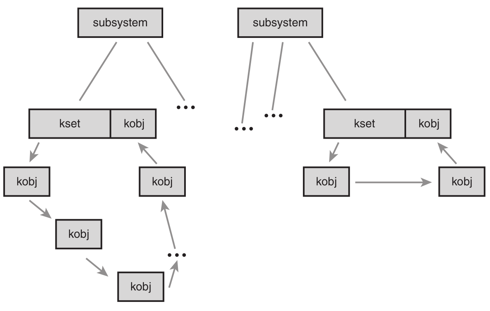

# Devices and Modules 设备与模块

In this chapter, we discuss four kernel components related to device drivers and device management:

* **Device types**—Classifications used in all Unix systems to unify behavior of common devices
* **Modules**—The mechanism by which the Linux kernel can load and unload object code on demand
* **Kernel objects**—Support for adding simple object-oriented behavior and a parent/child relationship to kernel data structures
* **Sysfs**—A filesystem representation of the system’s device tree

在本章中，关于设备驱动和设备管理，我们讨论四种内核成分（组件）

* **设备类型**：在所有Unix系统中为了统一普通设备的操作所采用的分类。
* **模块**：Linux内核中用于按需加载和卸载目标码的机制。
* **内核对象**：内核数据结构中支持面向对象的简单操作，还支持维护对象之间的父子关系。
* **Sysfs**：标识系统中设备树的一个文件系统。

## Device Types 设备类型

In Linux, as with all Unix systems, devices are classified into one of three types:

* Block devices
* Character devices
* Network devices

在Linux 以及所有 Unix 系统中，设备被分为以下三种类型：

* 块设备
* 字符设备
* 网络设备

Often abbreviated blkdevs, *block devices* are addressable in device-specified chunks called blocks and generally support seeking, the random access of data. Example block devices include hard drives, Blu-ray discs, and memory devices such as flash. Block devices are accessed via a special file called a block device node and generally mounted as a filesystem. We discuss filesystems in Chapter 13,“The Virtual Filesystem,” and block devices in Chapter 14,“The Block I/O Layer.”

块设备通常缩写为 blkdevs, 它是可寻址的，寻址以块为单位，块大小随设备不同而不同：块设备通常支持重定位操作，也就是对数据的随机访问。块设备的例子有硬盘、蓝光光碟。还有如 Flash 这样的存储设备。块设备是通过称为“块设备节点”的特殊文件系统来访问的，并且通常还被挂载为文件系统。我们在第13张已经讨论过了文件系统，在第14章已经讨论过了块设备。

Often abbreviated cdevs, character devices are generally not addressable, providing access to data only as a stream, generally of characters (bytes). Example character devices include keyboards, mice, printers, and most pseudo-devices. Character devices are accessed via a special file called a character device node. Unlike with block devices, applications interact with character devices directly through their device node.

字符设备通常缩写为cdevs，它是不可寻址的，仅提供数据的流式访问，就是一个一个字符（字节）。字符设备的例子有键盘、鼠标、打印机，还有大部分伪设备。字符设备是通过称为“字符设备节点”的特殊文件来访问的。与块设备不同，应用程序通过直接访问设备节点与字符设备交互。

Sometimes called Ethernet devices after the most common type of network devices,network devices provide access to a network (such as the Internet) via a hysical adapter (such as your laptop’s 802.11 card) and a specific protocol (such as IP). Breaking Unix’s “everything is a file” design principle, network devices are not accessed via a device node but with a special interface called the socket API.

网络设备最常见的类型有时也以以太网设备来称呼，它提供了对网络（例如 Internet）的访问，这是通过一个物理适配器（例如你的笔记本电脑上的 802.11 网卡）和一种特定的协议（如 IP 协议）进行的。网络设备打破了 Unix 的 “所有东西都是文件” 的设计原则，它不是通过设备节点来访问，而是通过 socket API 这样的特殊接口来访问。

Linux provides a handful of other device types, but they are specialized to a single task and not common. One exception is miscellaneous devices, often abbreviated miscdevs, which are actually a simplified form of character devices. Miscellaneous devices enable a device driver author to represent simple devices easily, trading functionality for common infrastructure.

Linux 还提供了不少其他设备类型，但都是针对单个任务，而非通用的。一个特例是“杂项设备”，通常简写为 miscdevs， 它实际上是建华的字符设备。杂项设备使驱动程序开发者能够很容易地标识一个简单设备，实际上是对通用基本架构的一个折中。

Not all device drivers represent physical devices. Some device drivers are virtual,providing access to kernel functionality.We call these pseudo devices; some of the most common are the kernel random number generator (accessible at /dev/random and /dev/urandom ), the null device (accessible at /dev/null ), the zero device (accessible at /dev/zero ), the full device (accessible at /dev/full ), and the memory device (accessible at /dev/mem ). Most device drivers, however, represent physical hardware.

并不是所有的设备驱动都表示物理设备。有些设备驱动是虚拟的，仅提供访问内核功能而已。我们成为“为设备”（pseudo device），最常见的如内核随机数发生器（通过 /dev/random 和 /dev/urandom 访问）、空设备（通过 /dev/null 访问）、零设备（通过 /dev/zero 访问）、满设备（通过 /dev/full 访问），还有内存设备（通过 /dev/mem 访问）。然而，大部分设备驱动是表示物理设备的。

## Modules 模块

Despite being “monolithic,” in the sense that the whole kernel runs in a single address space, the Linux kernel is modular, supporting the dynamic insertion and removal of code from itself at runtime. Related subroutines, data, and entry and exit points are grouped together in a single binary image, a loadable kernel object, called a module. Support for modules allows systems to have only a minimal base kernel image, with optional features and drivers supplied via loadable, separate objects. Modules also enable the removal and reloading of kernel code, facilitate debugging, and allow for the loading of new drivers on demand in response to the hot plugging of new devices.

尽管 Linux 是“宏内核”操作系统 —— 这就是说整个系统内核都运行与一个单独的保护域中，但是 Linux 内核是模块化的，他允许内核在运行时动态地向其中插入或者从中删除代码。这些代码（包括相关的子例程、数据、函数入口和函数出口）被一并组合在一个单独的二进制景象中，即所谓的可装载内核模块中，或简称为模块。支持模块的好处是基本内核镜像可以尽可能地小，英文可选的功能和驱动程序可以利用模块形式再提供。模块允许我们方便地删除和重新载入内核代码，也方便了调试工作。而且当热插拔新设备时，可以通过命令载入新的驱动程序。

This chapter looks at the magic behind modules in the kernel and how you can write your own module.

本章我们将探寻内核模块的奥秘，同时也学习如何编写自己的内核模块。

### Hello, World!

Unlike development on core subsystems of the kernel—which is much of the material
discussed thus far—module development is more like writing a new application, at least in the sense that modules have entry points and exit points and live in their own files.

与开发我们已经讨论过的大多数内核核心子系统不同，模块开发更接近编写新的应用系统，因为至少在模块文件中具有入口和出口点。

It might be cliché, but it would be a travesty to have the opportunity to write a Hello, World! and not capitalize on the occasion. Here is a Hello,World! kernel module:

虽然编写 “Hello world” 程序作为实例实属陈词滥调了，但它的确让人喜爱。内核模块 Hello world 出场了：

```c

/*
 * hello.c – The Hello, World! Kernel Module
 */
#include <linux/init.h>
#include <linux/module.h>
#include <linux/kernel.h>

/*
 * hello_init – the init function, called when the module is loaded.
 * Returns zero if successfully loaded, nonzero otherwise.
 */
static int hello_init(void)
{
    printk(KERN_ALERT “I bear a charmed life.\n”);
    return 0;
}

/*
 * hello_exit – the exit function, called when the module is removed.
 */
static void hello_exit(void)
{
    printk(KERN_ALERT “Out, out, brief candle!\n”);
}

module_init(hello_init);
module_exit(hello_exit);

MODULE_LICENSE(“GPL”);
MODULE_AUTHOR(“Shakespeare”);
MODULE_DESCRIPTION(“A Hello, World Module”);

```

This is as simple a kernel module as one can get.The hello_init() function is registered as this module’s entry point via module_init() .The kernel invokes hello_init() when the module is loaded.The call to module_init() is not actually a function call but a macro that assigns its sole parameter as the initialization function for this module.All init functions must have the form,

这大概使我们所能见到的最简单的内核模块了，hello_init() 函数是模块的入口点，它通过 module_init() 例程注册到系统中，在内核装载是被调用。调用 module_init() 实际上不是真正的函数调用，而是一个宏调用，它唯一的参数便是模块的初始化函数。模块的所有初始化幻术必须符合下面的形式：

```c
int my_init(void);
```

Because init functions are typically not directly invoked by external code, you don’t need to export the function beyond file-level scope, and it can be marked as static .

因为 init 函数通常不会被哇哦不函数直接调用，所以你不必导出该函数，所以它可以标记为 static 。

Init functions return an int . If initialization (or whatever your init function does) was successful, the function must return zero. On failure, the function must unwind any initialization and return nonzero.

init 函数返回一个 int 值，如果初始化（或者你的init函数想做的事情）成功完成，这个函数必须返回 0， 如果失败，init 程序必须执行反初始化，并返回非 0 值。

This init function merely prints a simple message and returns zero. In actual modules, init functions register resources, initialize hardware, allocate data structures, and so on. If this file were compiled statically into the kernel image, the init function would be stored in the kernel image and run on kernel boot.

上边程序的 init 函数仅仅打印了一条简单的消息，然后返回 0。 在实际的模块中， init函数还会注册资源、初始化硬件，分配数据结构等。如果这个文件被静态编译进内核镜像中，其 init 函数将存放在内核镜像中，并在内核启动时运行。

The module_exit() function registers a module’s exit point. In this example, we register the function hello_exit() .The kernel invokes the exit point when the module is removed from memory. Exit functions might free resources, shutdown and reset hardware, and perform other cleanup before returning. Simply put, exit functions are responsible for undoing whatever the init function and lifetime of the module did—essentially cleaning up after the module.After the exit function returns, the module is unloaded.

module_exti() 函数注册模块的出口点，在上边的例子中，我们注册了一个函数 hello_exit()。当模块从内存中卸载时，内核会触发这个出口点。退出函数可能会在返回前清理资源，关闭或者重置硬件，以保证硬件处于一致状态；或者在退出前做一些其他的清理工作。简单来说，exit 函数负责对 init 函数以及在模块生命周期过程中所做的一切事情进行撤销工作，基本上就是清理工作。在退出函数返回后，模块就被卸载了。

Exit functions must have the form

退出函数必须符合以下形式：

```c
void my_exit(void);
```

As with the init function, you probably want to mark it static .

与 init 函数一样，你也可以将其标记为 static 。

If this file were compiled into the static kernel image, the exit function would not be included, and it would never be invoked because if it were not a module, the code could never be removed from memory.

如果上述文件被静态地编译到内核镜像中，那么退出函数将不被包含，而且永远都不会被调用，因为如果不是模块的话，代码永远也不会被内核从内存中卸载。

The MODULE_LICENSE() macro specifies the copyright license for this file. Loading a non-GPL module into memory results in the tainted flag being set in the kernel.The copyright license serves two purposes. First, it is for informational purposes; many kernel developers give bug reports less credence when the tainted flag is set in an oops, because they presume a binary-only module (that is, a module that they cannot debug) was loaded into the kernel. Second, non-GPL modules cannot invoke GPL-only symbols.We cover GPL-only symbols in the section “Exported Symbols” later in this chapter.

MODULE_LICENSE() 宏用于指定模块的版权许可信息。如果载入非 GPL 模块到系统内存，则会在内核中设置被污染标识 —— 这个标识只起到记录信息的作用。版权许可有两个目的。 首先，它具有通告的目的；当 oops 中设置了被污染标识时，很多内核开发者对 bug 的报告缺乏信任，因为他们认为二进制模块（也就是开发者不能调试它）被装载到了内核。其次，非 GPL 模块不能调用 GPL_only 符号，本章后续的 “导出符号表” 一节将对其加以描述。

Finally, the MODULE_AUTHOR() and MODULE_DESCRIPTION() macros provide, respectively, the module’s author and a brief description of the module.The value of these macros is entirely informational.

最后还要说明，MODULE_AUTHOR() 宏和 MODULE_DESCRIPTION()宏指定了代码作者和模块的简要描述，他们完全是用作信息记录目的。

### Building Modules

In the 2.6 kernel, building modules is easier than in previous versions, thanks to the new kbuild build system.The first decision in building modules is deciding where the module source is to live.You can add the module source to the kernel source proper, either as a patch or by eventually merging your code into the official tree.Alternatively, you can maintain and build your module source outside the source tree.

在 2.6 内核中，由于采用了新的 “kbuild” 构建系统，现在构建模块想不从前更加容易。构建过程的第一步是决定在哪里管理模块源码。你可以吧模块源码加入到内核源码树种，或者是作为一个补丁，或者是最终把你的代码合并到正式的内核源码树中；另一种可行的方式是在内核源代码树之外维护和构建你的模块代码。

#### Living in the Source Tree

Ideally, your module is an official part of Linux and thus lives in the kernel source tree. Getting your work into the kernel proper might require more work at first, but it is the preferred path because when your code is in the Linux kernel, the entire kernel community can help maintain and debug it.

最理想的情况莫过于你的模块正式成为Linux内核的一部分，这样就会被放入内核源代码树种。把你的模块代码正确地置入内核中，开始的时候难免需要更多的维护，但这样通常是一劳永逸的解决之道

When you decide to place your module in the kernel source tree, the next step is deciding where in the tree your module is to live. Drivers are stored in subdirectories of the drivers/ directory in the root of the kernel source tree. Inside drivers/ , class, type, and specific device further organize drivers. For example, drivers for character devices live in drivers/char/ , block devices live in drivers/block/ , and USB devices live in drivers/usb/ .The rules are flexible because many devices belong in multiple categories ---- for instance, many USB devices are character devices, but they reside in drivers/usb/ not drivers/char/ . Despite such complications, when you get the hang of it, the organization is understandable and descriptive.、

当你决定了把你的模块放入内核源代码树种，下一步要清楚你的模块应在内核源代码树中处于何处。设备驱动程序存放在内核源代码树根目录下 ```/drivers``` 的子目录下，在其内部，设备驱动文件被进一步按照类别。类型或特殊驱动程序等更有序地组织起来。如字符设备存在于 ```drivers/char/``` 目录下，而块设备存放在 ```drivers/block/``` 目录下，USB设备则存放在 ```drivers/usb/``` 目录下。文件的具体组织规则并不须绝对默守陈规，不容打破，你可看到许多USB设备也属于字符设备。但是不管怎样，这些组织关系对我们来说想当容易理解，而且也很准确。

Let’s assume you have a character device and want to store it in drivers/char/ . Inside this directory are numerous C source files and a handful of other directories. Drivers with only one or two source files might simply stick their source in this directory. Drivers with multiple source files or other accompanying data might create a new subdirectory.There is no hard and fast rule. Presume that you want to create your own subdirectory. Let’s further assume that your driver is for a fishing pole with a computer interface, the Fish Master XL 3000, so you need to create a fishing subdirectory inside ```drivers/char/``` .

假定你有一个字符设备，而且希望他存放在 ```drivers/char``` 目录下，那么要注意，在该目录下同事会存在大量的C 源代码文件和许多其他目录。所以对于仅仅只有一两个源文件的设备驱动程序，可以直接放在该目录下：但如果驱动程序包含许多源文件和其他辅助文件，那么可以创建一个新子目录。这期间并没有什么金科玉律。假设想建立自己代码的子目录，你的驱动程序是一个钓鱼竿和计算机的借口，名为 Fish Master XL 3000，那么你需要在 ```drivers/char/``` 目录下建立一个名为 fishing 的子目录

Next, you need to add a line to the Makefile in drivers/char/ . So you edit
drivers/char/Makefile and add

接下来需要向 ```drivers/char``` 下的 ```Makefile``` 文件中添加一行。编辑 ```drivers/char/Makefile``` 并加入：

```s
obj-m += fishing/
```

This causes the build system to descend into the fishing/ subdirectory whenever it compiles modules. More likely, your driver’s compilation is contingent on a specific configuration option; for example, perhaps CONFIG_FISHING_POLE (see the section “Managing Configuration Options” later in this chapter for how to add a new configuration option). In that case, you would instead add the line

这行编译指令告诉模块构建系统，在编译模块时需要进入 ```fishing/``` 子目录中。更可能发生的情况是，你的驱动程序的编译取决于一个特殊配置选项：比如，可能得 ```CONFIG_FISHING_POLE``` (请看在本章后边的“Managing Configureation Options”一节，它会告诉你如何添加一个新的编译选项)。如果这样，你需要用下边的指令代替刚才那条指令：

```s
obj-$(CONFIG_FISHING_POLE) += fishing/
```

Finally, inside drivers/char/fishing/ , you add a new Makefile with the following line:

最后，在 ```drivers/char/fishing/``` 下，需要添加一个新的 Makefile 文件，其中需要有下面这行指令

```s
obj-m += fishing.o
```

The build system now descends into fishing/ and builds the module fishing.ko from fishing.c .Yes, confusingly, you write an extension of .o but the module is compiled as .ko .As before, more likely your fishing pole driver’s compilation is conditional on a configuration option. So you probably want to write the following:

一切就绪，刺客构建系统运行将会进入 ```fishing/``` 目录下，并且将 fishing.c 编译成 fishing.ko 模块，虽然你写的扩展名是 .o 但是模块被编译后的扩展名确实 .ko 。再有一个可能，要是你的钓鱼竿驱动程序编译时有编译选项，那么你可能需要这么来做：

```s
obj-$(CONFIG_FISHING_POLE) += fishing.o
```

One day, your fishing pole driver might get so complicated—autodetection of fishing line test is just the latest “must have!”—that it grows to occupy more than one source file. No problem, anglers! You simply make your Makefile read the following:

以后，假如你的钓鱼竿驱动程序需要更加智能化 —— 它可以自动检测钓鱼线，这可是最新钓鱼竿必备需求啊，这时驱动程序源文件可能就不再只有一个了。别怕，朋友，你只要把你的 Makefile 文件做如下修改就可以搞定：

```s
obj-$(CONFIG_FISHING_POLE) += fishing.o
fishing-objs := fishing-main.o fishing-line.o
```

Now, ```fishing-main.c``` and ```fishing-line.c``` will be compiled and linked into ```fishing.ko``` whenever ```CONFIG_FISHING_POLE``` is set.

现在，只要设置了 CONFIG_FISHING_POLE， fishing_main.c 和 fishing_line.c就一起呗编译和链接到 fishing.ko 模块内了。

Finally, you might need to pass to the C compiler additional compile flags during the build process solely for your file. To do so, simply add a line such as the following to your Makefile:

最后一个注意事项是，在构建文件时你可能需要额外的编译标记，如果这样，你只需在 Makefile 中添加如下指令：

```s
EXTRA_CFLAGS += -DTITANIUM_POLE
```

If you opted to place your source file(s) in drivers/char/ and not create a new subdirectory, you would merely place the preceding lines (that you placed in your Makefile in ```drivers/char/fishing/``` ) into drivers/char/Makefile.

如果你喜欢吧你的源文件置于 ```drivers/char/``` 目录下，并且不建立新目录的话，那么你需要做的便是将前面提到的行（也就是原来处于 ```drivers/char/fishing``` 下你自己的Makefile中的）都加入到 ```/drivers/char/Makefile``` 中 。

To compile, run the kernel build process as usual. If your module’s build was conditioned on a configuration option, as it was with CONFIG_FISHING_POLE , make sure that the option is enabled before beginning.

开始编译，运行内核构建过程和原来一样。如果你的模块编译取决于配置选项，比如有CONFIG_FISHING_POLE 约束，那么在编译钱首先要确保选项被允许。

#### Living Externally

If you prefer to maintain and build your module outside the kernel source tree, to live the life of an outsider, simply create a Makefile in your own source directory with this single line:

如果你喜欢脱离内核源代码树来维护和构建你的模块，把自己作为一个圈外人，那你需要做的就是在你自己的源代码树目录中建立一个Makefile文件，它只需要一行指令：

```s
obj-m := fishing.o
```

This compiles fishing.c into fishing.ko . If your source spans multiple files, two lines will suffice:

这条指令就可以吧 fishing.c 编译成 fishing.ko。如果你有多个源文件，那么用两行就足够了：

```s
obj-m := fishing.o
fishing-objs := fishing-main.o fishing-line.o
```

This example compiles fishing-main.c and fishing-line.c into fishing.ko .

这样，fishing_main.c 和 fishing_line.c 就一起呗编译和链接到 fishing.ko 模块内了。

The main difference in living externally is the build process. Because your module lives outside the kernel tree, you need to instruct make on how to find the kernel source files and base Makefile.This is also easy:

模块在内核内和内核外构建的最大区别在于构建过程，当模块在内核源代码树外围时，你必须告诉make 如何找到内核源代码文件和基础 Makefile 文件。 不过要完成这个工作同样不难：

```s
make -C /kernel/source/location SUBDIRS=$PWD modules
```

In this example, /kernel/source/location is the location of your configured kernel source tree. Recall that you should not store your working copy of the kernel source tree in /usr/src/linux but somewhere else, easily accessible, in your home directory.

在这个例子中，```/kernel/source/location``` 是你配置的内核源代码目录树。回想一下，不要把要处理的内核源代码树放在 ```/usr/src/linux``` 下，而要一道你 home 目录下的某个方便访问的地方。

### Installing Modules

Compiled modules are installed into ```/lib/modules/version/kernel/``` , where each directory under ```kernel/``` corresponds to the module’s location in the kernel source tree. For example, with a kernel version of 2.6.34, the compiled fishing pole module would live at ```/lib/modules/2.6.34/kernel/drivers/char/fishing.ko``` if you stuck it directly in ```drivers/char/``` .

编译后的模块被装入到目录  ```/lib/modules/version/kernel/``` 下，在 ```kernel/``` 目录下的每一个目录都对应着内核源代码树中的模块位置。如果使用的是 2.6.24 内核，而且将你的模块源代码直接放在 ```drivers/char/``` 下，那么编译后的钓鱼竿驱动程序的存放路径将是：```/lib/modules/2.6.34/kernel/drivers/char/fishing.ko```。

The following build command is used to install compiled modules into the correct
location:

下面的构建命令用来安装编译的模块到合适的目录下：

```s
make modules_install
```

This needs to be run as root.

需要在root权限下运行。

### Generating Module Dependencies

The Linux module utilities understand dependencies.This means that module chum can depend on module bait , and when you load the chum module, the module loader automatically loads the bait module.This dependency information must be generated. Most Linux distributions generate the mapping automatically and keep it up to date on each boot. To build the module dependency information, as root simply run

Linux 模块之间存在依赖性，也就是说钓鱼模块依赖于鱼饵模块，那么当你载入钓鱼模块时，鱼饵模块会被自动载入。这里需要的依赖信息必须事先生成。多数Linux 发布版都能自动产生这些依赖关系信息，而且在每次启动时更新。弱项产生内核依赖关系信息，root 用户可以运行命令：

```s
depmod
```

To perform a quick update, rebuilding only the information for modules newer than the dependency information, run as root

为了执行更快的更新操作，那么可以只为新模块生成依赖信息，而不是生成所有依赖关系，这是root用户可运行命令：

```s
depmod -A
```

The module dependency information is stored in the file

模块的依赖信息存放在如下文件中：

```s
/lib/modules/ version /modules.dep 
```

### Loading Modules

The simplest way to load a module is via insmod .This utility is basic. It simply asks the kernel to load the module you specify.The insmod program does not perform any dependency resolution or advanced error checking. Usage is trivial. As root, simply run this command:

载入模块最简单的方法是通过 insmod 命令，这是个功能很有限的命令，它能做的就是请求内核载入指定的模块。insmod 程序不执行仁和依赖性分析或进一步的错误检查。它的用法很简单，以root身份运行命令：

```s
insmod module.ko
```

Here, module.ko is the filename of the module that you want to load. To load the fishing pole module, you would run this command as root:

这里，module.ko 就是要载入模块的名称。比如装载钓鱼竿模块，那么你就执行命令：

```s
insmod fishing.ko
```

In a similar fashion, to remove a module, you use the rmmod utility. As root, simply run the following, where module is the name of an already-loaded module:

类似的，卸载一个模块，你可以使用 rmmod 命令，它同样需要以root身份运行：

```s
rmmod module
```

For example, this command removes the fishing pole module:

比如，rmmod fishing 命令卸载钓鱼竿模块。

```s
rmmod fishing
```

These utilities, however, are unintelligent.The utility modprobe provides dependency resolution, error checking and reporting, configurable behavior, and more advanced features. Its use is highly encouraged.

这两个命令是很简单，但是他们一点也不智能。先进工具 modprobe 提供了模块依赖性分析、错误智能检查、错误报告以及许多其他功能和选项。我强烈建议大家用这个命令。

To insert a module into the kernel via modprobe , run as root:

通过 modprobe 向内核插入模块，root下运行：

```s
modprobe module [ module parameters ]
```

Here, module is the name of the module to load.Any following arguments are taken as parameters to pass to the module on load. See the section “Module Parameters” for a discussion on module parameters.

其中，参数 module 指定了需要载入模块的名称，后面的参数将在模块加载时传入内核。请看“Module Parameters”一节，我们将讨论模块参数。

The modprobe command attempts to load not only the requested module, but also any
modules on which it depends. Consequently, it is the preferred mechanism for loading kernel modules.

modprobe 命令不但会加载指定的模块，而且会自动加载任何它所依赖的有关模块。所以说他是加载模块的最佳机制。

The modprobe command can also be used to remove modules from the kernel. To remove a module, as root, run

modprobe 也可以用来从内核中卸载模块，当然这也需要在 root 下运行：

```s
modprobe –r modules
```

Here, modules specifies one or more modules to remove. Unlike rmmod , modprobe also removes any modules on which the given module depends, if they are unused. Section 8 of the Linux manual pages provides a reference on its other, less used, options.

参数 modules 指定一个或者多个需要卸载的模块。与 rmmod 命令不同，modprobe 也会卸载给定模块所依赖的相关模块，但其前提是这些相关模块没有被使用。Linux 手册第8 部分提供了上述命令的使用参考，里面包括了命令选项和用法。

### Managing Configuration Options

An earlier section in this chapter looked at compiling the fishing pole module only if the CONFIG_FISHING_POLE configuration option was set. Configuration options have been discussed in earlier chapters, too, but now let’s look at actually adding a new one, continuing with the fishing pole device driver example.

在前面的内容中我们看到，只要设置了 CONFIG_FISHING_POLE 配置选项，钓鱼竿模块就将被自动编译。虽然配置选项在前面已经讨论过了，但这里我们将继续以钓鱼竿驱动程序为例，再看看一个新的配置选项如何加入。

Thanks to the new “kbuild” system in the 2.6 kernel, adding new configuration options is easy.All you have to do is add an entry to the Kconfig file responsible for the applicable branch of the kernel source tree. For drivers, this is usually the directory in which the source lives. If the fishing pole driver lives in drivers/char/ , you use drivers/char/Kconfig .

感谢2.6内核引入了“kbuild”系统，因此，加入一个新配置选项现在可以说是易如反掌。你所需要做的就是想kconfig文件中添加一项，用以对应内核源码树。对驱动程序而言，kconfig通常和源代码处于同一目录。如果钓鱼竿驱动程序在目录 drivers/char/ 下，那么你便会发现 drivers/char/kconfig 也同时存在。

If you created a new subdirectory and want a new Kconfig file to live there, you need to source it from an existing Kconfig .You do this by adding a line such as the following to an existing Kconfig file:

如果你建立了一个新的子目录，而且也希望kconfig 文件存在于该目录中的话，那么你必须在一个已存在的kconfig文件中将它引入。你需要加入下面一行命令：

```bash
source "drivers/char/fishing/Kconfig"
```

In this example, you would add this line to drivers/char/Kconfig .

这里所谓存在的 Kconfig 文件可能是 drivers/char/Kconfig 。

Entries in Kconfig are easy to add. Our fishing pole module would look like this:

Kconfig 文件很方便加入一个配置类型，请看钓鱼竿模块的选项，如下所示：

```conf
config FISHING_POLE
    tristate "Fish Master 3000 support"
    default n
    help
        If you say Y here, support for the Fish Master 3000 with computer
        interface will be compiled into the kernel and accessible via a
        device node. You can also say M here and the driver will be built as a
        module named fishing.ko.

        If unsure, say N.
```

The first line defines what configuration option this entry represents. Note that the CONFIG_ prefix is assumed and not written.

配置选项第一行定义了该选项所代表的配置目标。注意 CONFIG_ 前缀并不需要写上。

The second line states that this option is a tristate, meaning that it can be built into the kernel (Y), built as a module (M), or not built at all (N).To remove the option of building as a module—say, if this option represented a feature and not a device driver—use the directive bool instead of tristate .The quoted text following the directive provides the name of this option in the various configuration utilities.

第二行声明选项类型为 tristate， 也就是说可以编译进内核（Y），也可以作为模块编译（M）或者干脆不编译它（N）。如果编译选项代表的是一个系统功能，而不是以一个模块，那么编译选项将用于bool 指令代替 tristate，这说明它不允许被编译成模块。处于指令之后的引号内文字为该选项指定了名称。

The third line specifies the default for this option, which is not built ( n ).You can also specify the default as built into the kernel ( y ) or built as a module ( m ). For device drivers, the default is usually to not build it ( n ).

第三行指定了该选项的默认选择，这里默认操作是不编译它（N）。也可以吧默认选择指定为编译进内核（Y），或者编译成一个模块（M）。对驱动程序而言，默认选择通常为不编译进内核（N）。

The help directive signifies that the rest of the test, indented as it is, is the help text for this entry.The various configuration tools can display this text when requested. Because this text is for developers building their own kernels, it can be succinct and technical. End users do not typically build kernels and, if they did, they could presumably understand the configuration help.

help 指令的目的是为该选项提供帮助文档。各种配置工具都可以按要求显示这些帮助。因为这些帮助是面向编译内核的用户和开发者的，所以帮助内容简洁扼要。一般的用户不会编译内核，如果他们想试试，旺旺也能理解配置帮助的意思。

There are other options, too.The depends directive specifies options that must be set before this option can be set. If the dependencies are not met, the option is disabled. For example, if you added the following directive to the Kconfig entry, the device driver could not be enabled ( y or m ) until the CONFIG_FISH_TANK option is enabled:

除了上述选项以外，还存在其他选项。比如 depends 指令规定了在该选项被设置前，首先要设置的选项。如果依赖性不满足，那么该选项就被禁止。例如，如果你加入下边的指令到配置选项中，那么久意味着在 CONFIG_FISH_TANK 被选择前，我们的钓鱼竿模块是不能使用的（Y 或 M）。

```conf
depends on FISH_TANK
```

The select directive is like depends , except that it forces the given option if our option is selected.The select directive should not be used as frequently as depends because it automatically enables other configuration options.The following line enables CONFIG_BAIT whenever CONFIG_FISHING_POLE is enabled:

select 指令和 depends 类似，他们只有一点不同之处 ———— 只要是 select 指定了谁，他就会强行将被指定的选项打开。所以这个指令可不能想 depends 那样滥用一通，因为他会自动的激活其他配置选项，他的用法和 depends 一样，例如命令，意味着当 CONFIG_FISHING_POLE 被激活时，配置选项CONFIG_BAIT 必然一起被激活。

```conf
select BAIT
```

For both select and depends , you can request multiple options via && .With depends, you can also specify that an option not be enabled by prefixing the option with an exclamation mark. For example :

如果 select 和 depends 同事指定多个选项，那就需要通过 ```&&``` 指令来进行多选。使用 depends 时，你还可以利用感叹号前缀来指明禁止某个选项，比如：

```conf
depends on EXAMPLE_DRIVERS && !NO_FISHING_ALLOWED
```

This line specifies that the driver depends on CONFIG_EXAMPLE_DRIVERS being set and CONFIG_NO_FISHING_ALLOWED being unset.

这行指令就指定驱动程序安装要求打开 CONFIG_EXAMPLE_DRIVERS 选项，同时要禁止 CONFIG_NO_FISHING_ALLOWED 选项。

The tristate and bool options can be followed by the directive if , which makes the entire option conditional on another configuration option. If the condition is not met, the configuration option is not only disabled but also does not appear in the configuration utilities. For example, this directive instructs the configuration system to display an option only if CONFIG_OCEAN is set. Here, deep sea mode is available only if CONFIG_OCEAN is enabled:

tristate 和 bool 选项往往会结合 if 指令一起使用，这表示某个选项取决于另一个配置选项。如果条件不满足，配置选项不但会被禁止，甚至不会显示在配置工具中，比如，要求配置系统只有在 CONFIG_OCEAN 配置选项设置时才显示某选项。请看下面命令：

```conf
bool "Deep Sea Mode" if OCEAN
```

The if directive can also follow the default directive, enforcing the default only if the conditional is met.

if 指令也可以与 default 指令结合使用，强制只有在条件满足时 default 选项才有效。

The configuration system exports several meta-options to help make configuration easier.The option CONFIG_EMBEDDED is enabled only if the users specified that they want to see options designed for disabling key features (presumably to save precious memory on embedded systems).The option CONFIG_BROKEN_ON_SMP is used to specify a driver that is not SMP-safe. Normally this option is not set, forcing the user to explicitly acknowledge the brokenness. New drivers, of course, should not use this flag.The option CONFIG_DEBUG_KERNEL enables the selection of debugging-related options. Finally, the CONFIG_EXPERIMENTAL option is used to flag options that are experimental or otherwise of beta quality.The option defaults to off, again forcing users to explicitly acknowledge the risk before they enable your driver.

配置系统道出了一些元选项（meta-option）以简化生成配置文件。比如选项 CONFIG_EMBEDDED 是用于关闭那些用户想要禁止的关键功能（比如要在嵌入系统中节省珍贵的内存）；选项 CONFIG_BROKEN_ON_SMP 用来表示驱动程序并非多处理器安全的。通常该选项不应设置，标记他的目的是确保用户能知道该驱动程序的弱点。当然，新的驱动程序不应该使用该标志。租后要说明的是CONFIG_EXPERIMENTAL 选项，它是一个用于说明某项功能尚在试验或处于 beta 版本阶段的标志选项。该选项默认情况下关闭，同样，标记他的目的是为了让用户在使用驱动程序前明白潜在的风险。

### Module Parameters

The Linux kernel provides a simple framework, enabling drivers to declare parameters that the user can specify on either boot or module load and then have these parameters exposed in your driver as global variables.These module parameters also show up in sysfs (see later in this chapter). Consequently, creating and managing module parameters that can be specified in a myriad of convenient ways is trivial. Defining a module parameter is done via the macro module_param() :

Linux 提供了这样一个简单框架 ———— 它可允许驱动程序声明参数，从而用户可以在系统启动或者模块装载时再指定参数值，这些参数对于驱动程序属于全局变量。值得一提的是，模块参数同时也将出现在 sysfs 文件系统中（见本章后面的介绍），这样一来，无论是生成模板参数，还是管理模板参数的方式都变得灵活多样了。定义一个模块参数可以通过宏 module_param() 完成：

```c
module_param( name , type , perm );
```

Here, name is the name of both the parameter exposed to the user and the variable holding the parameter inside your module.The type argument holds the parameter’s data type; it is one of byte , short , ushort , int , uint , long , ulong , charp , bool , or invbool . These types are, respectively, a byte, a short integer, an unsigned short integer, an integer, an unsigned integer, a long integer, an unsigned long integer, a pointer to a char, a Boolean, and a Boolean whose value is inverted from what the user specifies.The byte type is stored in a single char and the Boolean types are stored in variables of type int . The rest are stored in the corresponding primitive C types. Finally, the perm argument specifies the permissions of the corresponding file in sysfs.The permissions can be specified in the usual octal format, for example 0644 (owner can read and write, group can read, everyone else can read), or by ORing together the usual S_Ifoo defines, for example S_IRUGO | S_IWUSR (everyone can read; user can also write).A value of zero disables the sysfs entry altogether.

参数 name 既是用户课件的参数名，也是你模块中存放模块参数的变量名。参数 type 则存放了参数的类型，它可以是 byte、 short、ushort、int、uint、long、ulong、charp、bool、或 invbool。他们分别代表了，字节型、短整型、无符号短整型、整型、无符号整型、长整型、无符号长整型、字符指针、布尔型、以及应用户要求转换得来的布尔型。其中byte类型存放在 char 类型变量中，boolean 类型存放在 int 变量中，其余的类型都一直对应 C 语言的变量类型。最后一个参数 param 指定了模块在 sysfs 文件系统下对应文件的权限，该值可以是八进制的格式，不如 0644（所有者可以读写，组内可以读，其他人可以读）；或者是 S_Ifoo 的定义形式，比如 ```S_IRUGO | S_IWUSR``` （任何人可读，user 可写）；如果该值为零，则表示禁止所有的sysfs项。

The macro does not declare the variable for you.You must do that before using the macro.Therefore, typical use might resemble

上面的宏其实并没有定义变量，你必须在使用该宏之前进行变量定义。通常使用类似下面的语句完成定义：

```c

/* module parameter controlling the capability to allow live bait on the pole */
static int allow_live_bait = 1;            /* default to on */
module_param(allow_live_bait, bool, 0644); /* a Boolean type */

```

This would be in the outermost scope of your module’s source file. In other words, allow_live_bait is global to the file. It is possible to have the internal variable named differently than the external parameter.This is accomplished via module_param_named() :

这个值处于模块代码文件外部，换句话说，allow_live_bait 是个全局变量。有可能模块的外部参数名称不同于它对应的内部变量名称。 这时就该使用宏 module_pararm_named() 定义了：

```c
module_param_named( name , variable , type , perm );
```

Here, name is the externally viewable parameter name, and variable is the name of the internal global variable. For example

参数 name 是外部课件的参数名称，参数 variable 是参数对应的内部全局变量名称，比如：

```c
static unsigned int max_test = DEFAULT_MAX_LINE_TEST;
module_param_named(maximum_line_test, max_test, int, 0);
```

Normally, you would use a type of charp to define a module parameter that takes a string.The kernel copies the string provided by the user into memory and points your variable to the string. For example

通常，需要用一个 charp 类型来定义模块参数（一个字符串），内核将用户提供的这个字符串拷贝到内存，而且将变量只想该字符串，例如：

```c
static char *name;
module_param(name, charp, 0);
```

If so desired, it is also possible to have the kernel copy the string directly into a character array that you supply.This is done via module_param_string() :

如果需要，也可以使内核直接拷贝字符串到指定的字符数组。宏 module_param_string() 可以完成上述任务：

```c
module_param_string( name , string , len , perm );
```

Here, name is the external parameter name, string is the internal variable name, len is the size of the buffer named by string (or some smaller size, but that does not make much sense), and perm is the sysfs permissions (or zero to disable a sysfs entry altogether). For example:

这里参数 name 作为外部参数名称，参数 string 是对应的内部变量名称，参数 len 是 string 命名缓冲区的长度（或更小的长度，但是没什么太大的意义），参数 param 是 sysfs 文件系统访问权限（如果为零，则表示完全禁止 sysfs 项），比如：

```c
static char species[BUF_LEN];
module_param_string(specifies, species, BUF_LEN, 0);
```

You can accept a comma-separated list of parameters stored in a C array via module_param_array() :

你可接受逗号分隔的参数序列，这些参数序列可通过宏 module_param_array() 存储在 C

```c
module_param_array(name, type, nump, perm);
```

Here, name is again the external parameter and internal variable name, type is the data type, and perm is the sysfs permissions.The new argument, nump , is a pointer to an integer in which the kernel stores the number of entries stored into the array. Note that the array pointed to by name must be statically allocated.The kernel determines the array’s size at compile-time and ensures that it does not cause an overrun. Use is simple. For example

参数 name 仍然是外部参数以及对应内部变量名，参数 type 是数据类型，参数 param 是 sysfs 文件系统访问权限，这里新参数是 nump，它是一个整型指针，该整型存放数组项数。注意由参数name 指定的数据必须是静态分配的，内核需要在编译时确定数组大小，从而保证不会造成溢出。该函数用法想当简单，比如：

```c
static int fish[MAX_FISH];
static int nr_fish;
module_param_array(fish, int, &nr_fish, 0444);
```

You can name the internal array something different than the external parameter with module_param_array_named() :

你可以将内部参数数组命名区别于外部参数，这时你需要使用宏：

```c
module_param_array_named( name , array , type , nump , perm );
```

The parameters are identical to the other macros.
Finally, you can document your parameters by using MODULE_PARM_DESC() 

其中参数和其他宏一致

最后，你可使用 MODULE_PARM_DESC() 描述你的参数：

```c
static unsigned short size = 1;
module_param(size, ushort, 0644);
MODULE_PARM_DESC(size, “The size in inches of the fishing pole.”);
```

All these macros require the inclusion of ```<linux/module.h> ```

上述所有宏需要包含 ```<linux/module.h> ``` 头文件。

### Exported Symbols

When modules are loaded, they are dynamically linked into the kernel.As with userspace, dynamically linked binaries can call only into external functions explicitly exported for use. In the kernel, this is handled via special directives called EXPORT_SYMBOL() and EXPORT_SYMBOL_GPL() .

模块被载入后，就会被动态地链接到内核。注意，它与用户空间中的动态链接库类似，只有被显示导出后的外部函数，才可以被动态库调用。在内核中，导出内核函数需要使用特殊指令 EXPORT_SYMBOL() 和 EXPORT_SYMBOL_GPL() 。

Exported functions are available for use by modules. Functions not exported cannot be invoked from modules.The linking and invoking rules are much more stringent for modules than code in the core kernel image. Core code can call any nonstatic interface in the kernel because all core source files are linked into a single base image. Exported symbols, of course, must be nonstatic, too.The set of exported kernel symbols are known as the exported kernel interfaces.

导出的内核函数可以被模块调用，儿未导出的函数模块则无法被调用。模块代码的链接和调用规则相比核心内核镜像中的代码而言，要更加严格。核心代码在内核中可以调用任意非静态接口，因为素有的核心源代码文件被链接成了同一个镜像。当然，被导出的符号表所含的函数也要是非静态的。

Exporting a symbol is easy. After the function is declared, it is usually followed by an EXPORT_SYMBOL() . For example ：

导出的内核符号表被看做导出的内核接口，甚至成为内核API 。导出符号表相当简单，在声明函数后，紧跟上 EXPORT_SYMBOL()指令就搞定了，比如：

```c

/*
 * get_pirate_beard_color - return the color of the current pirate’s beard.
 * @pirate is a pointer to a pirate structure
 * the color is defined in <linux/beard_colors.h>.
 */
int get_pirate_beard_color(struct pirate *p)
{
    return p->beard.color;
}
EXPORT_SYMBOL(get_pirate_beard_color);

```

Presuming that get_pirate_beard_color() is also declared in an accessible header file, any module can now access it.

假定 get_priate_beard_color() 同时也定义在一个可访问的头文件中，那么现在任何模块都可以访问它。

Some developers want their interfaces accessible to only GPL-compliant modules.The kernel linker enforces this restriction through use of the MODULE_LICENSE() directive. If you want the previous function accessible to only modules that labeled themselves as GPL-licensed, use instead

有一些开发者希望自己的接口仅仅对GPL兼容的模块可见，内核连接器使用 MODULE_LICENSE()宏可以满足这个要求。如果你希望先前的函数仅仅对标记为GPL 协议的模块可见，那么你就要用：

```c
EXPORT_SYMBOL_GPL(get_pirate_beard_color);
```

If your code is configurable as a module, you must ensure that when compiled as a module all interfaces that it uses are exported. Otherwise linking errors (and a broken module) result.

如果你的代码被配置成了模块，那么你就必须确保当它被编译为模块时，它所用的全部接口都以被导出，否则就会产生链接错误（而且模块不能成功编译）。

## The Device Model

A significant new feature in the 2.6 Linux kernel is the addition of a unified device model. The device model provides a single mechanism for representing devices and describing their topology in the system. Such a system provides several benefits:

2.6内核增加了一个引人注目的新特性 — 统一设备模型（device module）。设备模型提供了一个独立的机制专门来标识设备，并描述骑在系统的拓扑结构，从而使得系统具有以下优点：

* Minimization of code duplication
* A mechanism for providing common facilities, such as reference counting
* The capability to enumerate all the devices in the system, view their status, and see to what bus they attach
* The capability to generate a complete and valid tree of the entire device structure of the system, including all buses and interconnections
* The capability to link devices to their drivers and vice versa
* The capability to categorize devices by their class, such as input device, without the need to understand the physical device topology
* The capability to walk the tree of devices from the leaves up to the root, powering down devices in the correct order

-----

* 最大程度减少代码重复
* 提供统一的公共设施，例如，引用计数
* 可以列举系统中所有设备，观察他们的状态，并且查看它们的总线。
* 可以将系统中的全部设备结构以树的形式完整、有效的展现出来 ———— 包括所有的总线和内部连接。
* 可以将设备和其对应的驱动联系起来，反之亦然。
* 可以将设备按照类型加以归类，比如分类为输入设备，而无需理解物理设备的拓扑结构。
* 可以盐设备树的叶子向其根方向依次遍历，以保证能以正确顺序关闭各设备的电源。

The initial motivation for the device model was this final point: providing an accurate device tree to facilitate power management. To implement device-level power management in the kernel, you need to build a tree representing the device topology in the system: for example, what drive connects to what controller, and what device connects to what bus.When powering down, the kernel must power down the lower (leaf) nodes of the tree before the higher nodes. For example, the kernel needs to turn off a USB mouse before it turns off the USB controller, and the kernel must power down the USB controller before the PCI bus. To do this accurately and efficiently for the entire system, the kernel needs a tree of devices.

最后一点是实现设备模型的最初动机。若想在内核中实现智能的电源管理，就需要建立表示系统中设备拓扑关系的树结构。当在树上端的设备关闭电源时，内核必须首先关闭该设备节点一下的（处于叶子结点上的）设备电源。比如内核需要关闭一个USB 鼠标，然后才可以关闭USB控制器；同样内核也必须在关闭PCI总线钱先关闭USB控制器。简而言之，若要准确而又高效低完成上述电源管理目标，内核无疑需要一棵设备树。

### Kobjects

At the heart of the device model is the kobject, short for kernel object, which is represented by struct kobject and defined in ```<linux/kobject.h>``` .The kobject is similar to the Object class in object-oriented languages such as C# or Java. It provides basic facilities, such as reference counting, a name, and a parent pointer, enabling the creation of a hierarchy of objects.

设备模型的核心部分就是 kobject， kernel object 的简写，它由 struct kobject 结构体表示，定义在头文件 ```<linux/kobject.h>``` 中。kobject 类似于 C# 或 Java 这些面相独享语言中的对象（object）类，提供了诸如引用计数、名称和父指针等字段，可以创建对象的层次结构。

Without further ado:

看下面的具体结构：

```c
struct kobject {
    const char          *name;
    struct list_head     entry;
    struct kobject      *parent;
    struct kset         *kset;
    struct kobj_type    *ktype;
    struct sysfs_dirent *sd;
    struct kref          kref;
    unsigned int         state_initialized:1;
    unsigned int         state_in_sysfs:1;
    unsigned int         state_add_uevent_sent:1;
    unsigned int         state_remove_uevent_sent:1;
    unsigned int         uevent_suppress:1;
};
```

The name pointer points to the name of this kobject.

name 指针指向此 kobject的名称。

The parent pointer points to this kobject’s parent. In this manner, kobjects build an object hierarchy in the kernel and enable the expression of the relationship between multiple objects.As you shall see, this is actually all that sysfs is: a user-space filesystem representation of the kobject object hierarchy inside the kernel.

parent 指针指向 kobject 的父对象。这样一来，kobject 就会在内核中构造一个对象层次结构，并且可以将多个对象之间的关系表现出来。就如你所看到的，这边是 sysfs 的真正面目：一个用户空间的文件系统，用来表示内核中 kobject 对象的层次结构。

The sd pointer points to a sysfs_dirent structure that represents this kobject in sysfs. Inside this structure is an inode structure representing the kobject in the sysfs filesystem.

sd 指针指向 sysfs_dirent 结构体，该结构体在 sysfs 中表示的就是这个 kobject。从sysfs文件系统内部看，这个结构体是表示 kobject 的一个 inode 结构体。

The kref structure provides reference counting.The ktype and kset structures describe and group kobjects.We look at them in the next two subsections.

kref 提供引用计数。ktype 和 kset 结构体对 kobject 对象进行描述和分类。在下面的内容中将详细介绍它们。

Kobjects are usually embedded in other structures and are generally not interesting on their own. Instead, a more important structure, such as struct cdev, defined in ```<linux/cdev.h>```, has a kobj member:

Kobject 通常是嵌入其他结构体中的，其单独意义其实并不大。相反，那些更为重要的结构体，比如定义于 ```<linux/cdev.h>``` 中的 struct cdev 使用 kobj 作为成员：

```c
/* cdev structure - object representing a character device */
struct cdev {
    struct kobject                kobj;
    struct module                *owner;
    const struct file_operations *ops;
    struct list_head              list;
    dev_t                         dev;
    unsigned int                  count;
};
```

When kobjects are embedded inside other structures, the structures receive the standardized functions that a kobject provides. Most important, the structure’s embedded kobject now enables the structure to become part of an object hierarchy. For example, the cdev structure is presentable in an object hierarchy via the parent pointer ```cdev->kobj.parent``` and the list ```cdev->kobj.entry```.

当 kobject 被嵌入到其他结构体时，该结构变拥有了 kobject 提供的标准功能。更重要的是，嵌入 kobject 的结构体可以成为对象层次架构中的一部分。比如 cdev 结构体就可以通过其父指针 ```cdev->kobj.parent``` 和链表 ```cdev->kobj.entry``` 插入到对象层次结构中。

### Ktypes

Kobjects are associated with a specific type, called a ktype, short for kernel object type. Ktypes are represented by struct kobj_type and defined in ```<linux/kobject.h>``` :

kobject 对象呗关联到一种特殊的类型，即 ktype，kernel object type 的缩写，ktype 由 kobj_type 结构体表示，定义于头文件 ```<linux/kobject.h>``` 中：

```c
struct kobj_type {
    void (*release)(struct kobject *);
    const struct sysfs_ops  *sysfs_ops;
    struct attribute       **default_attrs;
};
```

Ktypes have the simple job of describing default behavior for a family of kobjects. Instead of each kobject defining its own behavior, the behavior is stored in a ktype, and kobjects of the same “type” point at the same ktype structure, thus sharing the same behavior.

ktype 的存在是为了描述一族 kobject 所具有的的普遍特性。如此一来，不再需要每个 kobject 都分别定义自己的特性，而是将这些普遍的特性在 ktype 结构体中依次定义，然后所有“同类”的kobject都能构想一样的特性。

The release pointer points to the deconstructor called when a kobject’s reference count reaches zero.This function is responsible for freeing any memory associated with this kobject and otherwise cleaning up.

release 函数指针指向在 kobject 引用计数减至零时要被调用的析构函数。该函数负责释放所有 kobject 使用的内存和其他相关清理工作。

The sysfs_ops variable points to a sysfs_ops structure.This structure describes the behavior of sysfs files on read and write. It’s covered in more detail in the section "Adding Files to sysfs."

sysfs_ops 变量指向 sysfs_ops结构体。该结构体描述了 sysfs 文件读写时的特性。详细介绍在 "Adding Files to sysfs" 节。

Finally, default_attrs points to an array of attribute structures.These structures define the default attributes associated with this kobject.Attributes represent properties related to a given object. If this kobject is exported to sysfs, the attributes are exported as files.The last entry in the array must be NULL .

最后 default_attrs 指针指向一个 attribute 结构体数组。这些结构体定义了该 kobject 相关的默认属性。属性描述了给定对象的特征，如果该 kobject 导出到 sysfs 中，那么这些属性都将相应地作为文件而导出。数组中的最后一项必须为 NULL。


###Ksets

Ksets, short for kernel object sets, are aggregate collections of kobjects. Ksets work as the base container class for a set of kernel objects, collecting related kobjects, such as “all block devices,” together in a single place. Ksets might sound similar to ktypes and prompt the question,“Why have both?” Ksets group related kernel objects together, whereas ktypes enable kernel objects (functionally related or not) to share common operations. The distinction is kept to allow kobjects of identical ktypes to be grouped into different ksets.That is, there are only a handful of ktypes, but many ksets, in the Linux kernel.

kset 是 kobject 对象的集合体。把它看成是一个容器，可将所有相关的kobject 对象，如“全部的块设备”置于同一位置。听起来 kset 和 ktype 非常类似，好像没有多少实质内容。那么“为什么会需要这两个类似的东西呢？”，kset 可把 kobject 集中到一个集合中，而 ktypes 描述相关类型 kobject 所共有的特性，他们之间的重要区别在于：具有相同 ktype 的 kobject 可以被分组到不同的 kset。 就是说，在 Linux 内核中，只有少数一些的 ktype，却有多个 kset。

The kset pointer points at a kobject’s associated kset. ksets are represented by the kset structure, which is declared in ```<linux/kobject.h>``` :

kobject 的 kset 指针指向相应的 kset 集合。kset集合由 kset 结构体表示，定义于头文件 ```<linux/kobject.h>``` 中：

```c
struct kset {
    struct list_head        list;
    spinlock_t              list_lock;
    struct kobject          kobj;
    struct kset_uevent_ops *uevent_ops;
};
```

In this structure, list is a linked list of all kobjects in this kset, list_lock is a spinlock protecting this entry in the list (see Chapter 10,“Kernel Synchronization Methods,” for a discussion on spinlocks), kobj is a kobject representing the base class for this set, and uevent_ops points to a structure that describes the hotplug behavior of kobjects in this kset. Uevent, short for user events, is a mechanism for communicating with user-space information about the hotplugging and hot removal of devices from a system.

在这个结构体中，其中 list 连接该集合（kset）中所有的 kobject 对象，list_lock 是保护这个链表中元素的自旋锁（关于自旋锁参见 Chapter 10）,kobj 指向的 kobject 对象代表了该集合的基类。uevent_ops 指向一个结构体————用于处理集合中 kobject 对象的热插拔操作。uevent 就是用户事件（user event）的缩写，提供了与用户空间热插拔信息进行通信的机制。

### Interrelation of Kobjects, Ktypes, and Ksets

The handful of structures thus far discussed is confusing not because of their number (there are only three) or their complexity (they are all fairly simple), but because they are all interrelated. In the world of kobjects, it is hard to discuss one structure without discussing the others.With the basics of each structure covered, however, you can develop a firm understanding of their relationships.

上文反复讨论的这一组结构体很容易令人混淆，这可不是因为他们数量繁多（其实只有三个），也不是他们太复杂（他们都相当简单），而是由于他们内部相互交织。要了解 kobject，很难治讨论其中一个结构儿不涉及其他相关结构。然而在这些结构的相互作用下，会更有助你深刻理解他们之间的关系。

The important key object is the kobject, represented by struct kobject .The kobject introduces basic object properties—such as reference counting, parent-child relationship, and naming—to kernel data structures.The kobject structure provides these features in a standard unified way. Kobjects, in and of themselves, are not particularly useful. Instead, kobjects are typically embedded in other data structures, giving those containing structures the features of the kobject.

这里最重要的家伙是 kobject，它由 struct kobject表示。kobject 为我们引入了诸如引用计数（reference counting）、父子关系和独享名称等基本对象道具，并且是以一个统一的方式提供这些功能。不过 object 本身意义并不大，通常情况下它需要被嵌入到其他数据结构中，让那些包含它的结构具有了 kobject的特性。

Kobjects are associated with a specific ktype, which is represented by struct
kobj_type and pointed at by the ktype variable inside of the kobject. ktypes define some default properties of related kobjects: destruction behavior, sysfs behavior, and default attributes.The ktype structure is not well named; think of ktypes not as a grouping but as a set of shared operations.

kobject 与一个特别的 ktype 对象关联，ktype 由 struct kobj_type 结构体表示，在kobject中 ktype 字段指向该对象。ktype 定义了一些 kobject相关的默认特性：析构行为（反构造功能）、sysfs行为（sysfs 的操作表）以及别的一些默认属性。

Kobjects are then grouped into sets, called ksets, which are represented by struct kset . Ksets provide two functions. First, their embedded kobject acts as a base class for a group of kobjects. Second, ksets aggregate together related kobjects. In sysfs, kobjects are the individual directories in the filesystem. Related directories—say, perhaps all subdirectories of a given directory—might be in the same kset.

kobject 又归入了称作 kset 的集合，kset 集合由 struct kset 结构体表示。kset提供了两个功能，第一，其中嵌入的kobject作为kobject组的基类。第二，kset将相关的kobject集合在一起。在sysfs中，这些相关的kobject将以独立的目录出现在文件系统中。这些相关的目录，也许是给定目录的所有子目录，它们可能处于同一个kset。

Figure 17.1 depicts the relationship between these data structures.

图 17.1 描述了这些数据结构的内在关系。



Figure 17.1 Relationship between kobjects, ksets, and subsystems.

### Managing and Manipulating Kobjects

With the basic internals of kobjects and friends behind you, it’s time to look at the exported interfaces used for managing and manipulating kobjects. Most of the time, driver writers do not have to deal with kobjects directly. Instead, kobjects are embedded in some class-specific structure (as you saw with the character device structure) and managed “behind the scenes” by the associated driver subsystem. Nonetheless, kobjects are not intended to remain hidden and can seep through into driver code or you might be hacking on the driver subsystem itself.

当了解了 kobject 的内部基本细节后，我们来看管理和操作它的外部接口了。多数时候，驱动程序开发者并不必直接处理 kobject，因为 kobject 是被嵌入到一些特殊类型结构体中的（就如在字符设备结构体中看到的情形），而且会由相关的设备驱动程序在“幕后”管理。即便如此，kobject并不在意隐藏自己，它可以出现在设备驱动代码中，或者可以在设备驱动子系统本身中使用它。

The first step in using a kobject is declaring and initializing it. kobjects are initialized via the function `kobject_init` , which is declared in `<linux/kobject.h>` :

使用 kobject 的第一步需要先声明和初始化。kobject 通过函数 `kobject_init` 进行初始化，该函数定义在文件 `<linux/kobject.h>` 中：

```c
void kobject_init(struct kobject *kobj, struct kobj_type *ktype);
```

The function’s first parameter is the kobject to initialize. Before calling this function, the kobject must be zeroed.This might normally happen during the initialization of the larger function in which the kobject is embedded. If not, a simple call to `memset()` does the trick:

该函数的第一个参数就是需要初始化的 kobject 对象，在调用初始化函数前，kobject 必须清空。这个工作往往会在 kobject 所在的上层结构体初始化时完成。如果 kobject 未被清空，那么只需要调用 `memset()` 即可：

```c
memset(kobj, 0, sizeof (*kobj));
```

It is safe to initialize parent and kset after the zeroing. For example

在清零后，就可以安全的初始化 parent 和 kset 字段。例如：

```c
struct kobject *kobj;

kobj = kmalloc(sizeof (*kobj), GFP_KERNEL);
if (!kobj)
    return -ENOMEM;
memset(kobj, 0, sizeof (*kobj));
kobj->kset = my_kset;
kobject_init(kobj, my_ktype);
```

This multistep effort is handled automatically by kobject_create() , which returns a newly allocated kobject:

这多步操作也可以由  kobject_create() 来自动处理，它返回一个新分配的 kobject：

```c
struct kobject * kobject_create(void);
```

Usage is simple:

使用想当简单：

```c
struct kobject *kobj;

kobj = kobject_create();
if (!kobj)
    return –ENOMEM;
```

Most uses of kobjects should favor kobject_create() or a related helper function
rather than directly manipulate the structure.

大多数情况下，应该调用 kobject_create() 创建 kobject，或者是调用相关的辅助函数，而不是直接造作这个结构体。

### Reference Counts

One of the primary features provided by kobjects is a unified reference counting system. After initialization, the kobject’s reference count is set to one. So long as the reference count is nonzero, the object continues to exist in memory and is said to be pinned.Any code that holds a reference to the object first elevates the reference count.When the code is finished with the object, the reference count is decremented. Bumping the reference count is called getting a reference to the object, and decrementing the reference count is called putting a reference to the object.When the reference count reaches zero, the object
can be destroyed and any associated memory freed.

kobject 的主要功能之一就是为我们提供了一个统一的引用计数系统。初始化后，kobject 的引用计数设置为 1 。只要引用计数不为 零，那么该对象就会继续保留在内存中，也可以说是被“钉住”了。任何包含对象引用的代码首先要增加该对象的引用计数，当代码结束后则减少它的引用计数。增加引用计数成为获得（getting）对象的引用，减少引用计数称为释放（putting）对象的应用。当引用计数跌到零时，对象便可以被撤销，同时相关内存也都被释放。

#### Incrementing and Decrementing Reference Counts 递增和递减引用计数

Incrementing the reference count is done via `kobject_get()` , declared in `<linux/kobject.h>` :

增加一个引用计数可以通过 `kobject_get()` 函数完成，函数声明在 `<linux/kobject.h>`中：

```c
struct kobject * kobject_get(struct kobject *kobj);
```

This function returns a pointer to the kobject or NULL on failure.

该函数正常情况下将返回一个指向 kobject 的指针，如果失败则返回 NULL 指针：

Decrementing the reference count is done via kobject_put() , also declared in `<linux/kobject.h>` :

减少引用计数通过 `kobject_put()` 完成，这个指令也声明在 `<linux/kobject.h>`中 :

```c
void kobject_put(struct kobject *kobj);
```

If the provided kobject’s reference count reaches zero, the release function pointed at by the ktype associated with the kobject is invoked, any associated memory is freed, and the object is no longer valid.

如果对应的 kobject 的引用计数减少到 零，则与该 kobject 关联的 ktype 中的析构函数将被调用。

#### Krefs

Internally, the kobject reference counting is provided by the kref structure, which is defined in `<linux/kref.h>` :

我们深入到引用计数系统的内部去看，会发现 kobject 的引用计数是通过 kref 结构体实现的，该结构体定义在头文件 `<linux/kref.h>` 中：

```c
struct kref {
    atomic_t refcount;
};
```

The lone member is an atomic variable used to hold the reference count.A structure is used simply to provide type checking. Before using a kref, you must initialize it via `kref_init()` :

其中唯一的字段是用来存放引用计数的原子变量。那么为什么采用结构体？这是为了便于进行类型检测。在使用 kref 前，你必须先通过  kref_init() 函数来初始化它：

```c
void kref_init(struct kref *kref)
{
    atomic_set(&kref->refcount, 1);
}
```

As you can see, this function simply initializes the internal atomic_t to one. Consequently, krefs are pinned with a reference count of one as soon as they are initialized; this is the same behavior as kobjects.

正如你所看到的，这个函数简单地将院子变量置 1 ，所以一旦kref 一旦被初始化，它表示的引用计数便固定为 1。这点和 kobject 中的计数行为一致。

To obtain a reference to a kref, use kref_get() , declared in `<linux/kref.h>` :

要获得对 kref 的引用，需要调用 kref_get() 函数，这个函数声明在 `<linux/kref.h>` 中：

```c
void kref_get(struct kref *kref)
{
    WARN_ON(!atomic_read(&kref->refcount));
    atomic_inc(&kref->refcount);
}
```

This function bumps the reference count. It has no return value.To drop a reference to a kref, use `kref_put()` , declared in `<linux/kref.h>` :

这个函数增加引用计数值，它没有返回值。减少对 kref 的引用，调用声明在 `<linux/kref.h>` 中的函数 `kref_put()`：

```c
int kref_put(struct kref *kref, void (*release) (struct kref *kref))
{
    WARN_ON(release == NULL);
    WARN_ON(release == (void (*)(struct kref *))kfree);

    if (atomic_dec_and_test(&kref->refcount)) {
        release(kref);
        return 1;
    }
    return 0;
}
```

This function drops the reference count by one and calls the provided release() function if the count is now zero.As noted by the ominous WARN_ON() statement, the provided release() function cannot simply be kfree() but must be a specialized function that accepts struct kref as its lone argument and has no return value.The function returns zero, unless the put reference was the last reference to the object, in which case it returns one. Normally, callers of kref_put() are unconcerned with the return value.

该函数使得引用计数减 1 ，如果计数减少到 零，则要调用作为参数提供的 `release()` 函数。注意 WRAN_ON() 声明，提供的 release() 函数不能简单地采用 kfree(), 它必须是一个仅接受一个 kref 结构体作为参数的特有函数，而且还没有返回值。 `kref_put()` 函数返回 0，但有一种情况下它返回 1， 那就是在对该对象的最后一个引用计数减1 时。通常情况下，kref_put() 的调用者不用关心这个返回值。

Rather than having kernel code implement its own reference counting via atomic_t types and simple "get" and "put" wrapper functions, developers are encouraged to use the kref type and its helpers to provide a common and known-correct reference counting mechanism in the kernel.

开发者现在不必再内核代码中利用 `atmoic_t` 类型来实现自己的引用计数和简单的 “get”、“put” 这些封装函数。对开发者而言，在内核代码中最好的方法是利用 kref 类型和它相应的辅助函数，为自己提供一个通用的、正确的引用计数机制。

All these functions are defined in `lib/kref.c` and declared in `<linux/kref.h>` .

上述的所有函数定义与生命分别在文件 `lib/kref.c` 和头文件 `<linux/kref.h>`。

## sysfs

The sysfs filesystem is an in-memory virtual filesystem that provides a view of the kobject hierarchy. It enables users to view the device topology of their system as a simple filesystem. Using attributes, kobjects can export files that enable kernel variables to be read from and optionally written to.

sysfs 文件系统是一个处于内存中的虚拟文件系统，它为我们提供了 kobject 对象层次结构的视图。帮助用户能以一个简单文件系统的方式来观察系统中各种设备的拓扑结构。借助属性对象，kobject 可以用导出文件的方式，将内核变量提供给用户读取或写入（可选）。

Although the intended purpose of the device model was initially to provide a device topology for power management reasons, an offshoot was sysfs. To facilitate debugging, the device model’s developer decided to export the tree as a filesystem.This quickly proved quite useful, at first as a replacement for device-related files that previously found themselves in /proc , and later as a powerful view into the system’s object hierarchy. Indeed, sysfs, originally called driverfs, predated kobjects. Eventually sysfs made it clear that a new object model would be quite beneficial, and kobject was born.Today, every system with a 2.6 kernel has sysfs. Most systems mount it at /sys .

虽然设备模型的初衷是为了方便电源管理而提出的一种设备拓扑结构，但是 sysfs 是颇为以外的收获。为了方便调试，设备模型的开发者决定将设备结构树导出为一个文件系统。这个举措很快被证明是非常明智的，首先 sysfs 代替了先前处于 `/proc` 下的设备文件；另外他为系统对象提供了一个很有效的视图。实际上，sysfs 起初被称为 driverfs，它早于 kobject 出现。最终 sysfs 使得我们认识到一个全新的对象模型非常有利于系统，于是 kobject 应运而生。今天所有 2.6 内核的系统都拥有 sysfs 文件系统，而且几乎都毫无例外的将其挂载在 sys 目录下

The magic behind sysfs is simply tying kobjects to directory entries via the dentry member inside each kobject. Recall from Chapter 12 that the dentry structure represents directory entries. By linking kobjects to dentries, kobjects trivially map to directories. Exporting the kobjects as a filesystem is now as easy as building a tree of the dentries in memory. But wait! kobjects already form a tree, our beloved device model.With kobjects mapping to dentries and the object hierarchy already forming an in-memory tree, sysfs became trivial.

sysfs 的诀窍是把 kobject 对象与目录项（directory entries）紧密联系起来，这点是通过 kobject 对象中的 dentry 字段来实现的。回忆第 12 章，dentry 结构体表示目录项，通过连接 kobject 到指定的目录项上，无疑方便地将 kobject 映射到该目录上。从此，把 kobject 导出形成文件系统就变得如同在内存中构建目录项一样简单。好了，kobject 其实已经形成了一棵树—— 就是我们心爱的对象模型体系。由于 kobject 被映射到目录项，同时对象层次结构也已经在内存中形成了一棵树，因此 sysfs 的生成便水到渠成般地简单了。

Figure 17.2 is a partial view of the sysfs filesystem as mounted at /sys .

```
    |-- block
    |   |-- loop0 -> ../devices/virtual/block/loop0
    |   |-- md0 -> ../devices/virtual/block/md0
    |   |-- nbd0 -> ../devices/virtual/block/nbd0
    |   |-- ram0 -> ../devices/virtual/block/ram0
    |   `-- xvda -> ../devices/vbd-51712/block/xvda
    |-- bus
    |   |-- platform
    |   |-- serio
    |-- class
    |   |-- bdi
    |   |-- block
    |   |-- input
    |   |-- mem
    |   |-- misc
    |   |-- net
    |   |-- ppp
    |   |-- rtc
    |   |-- tty
    |   |-- vc
    |   `-- vtconsole
    |-- dev
    |   |-- block
    |   `-- char
    |-- devices
    |   |-- console-0
    |   |-- platform
    |   |-- system
    |   |-- vbd-51712
    |   |-- vbd-51728
    |   |-- vif-0
    |   `-- virtual
    |-- firmware
    |-- fs
    |   |-- ecryptfs
    |   |-- ext4
    |   |-- fuse
    |   `-- gfs2
    |-- kernel
    |   |-- config
    |   |-- dlm
    |   |-- mm
    |   |-- notes
    |   |-- uevent_helper
    |   |-- uevent_seqnum
    |   `-- uids
    `-- module
        |-- ext4
        |-- i8042
        |-- kernel
        |-- keyboard
        |-- mousedev
        |-- nbd
        |-- printk
        |-- psmouse
        |-- sch_htb
        |-- tcp_cubic
        |-- vt
        `-- xt_recent
```

*Figure 17.2 A partial view of the /sys tree.*

The root of the sysfs contains at least 10 directories: block , bus , class , dev , devices , firmware , fs , kernel , module , and power .The block directory contains one directory for each of the registered block devices on the system. Each of those directories, in turn, contains any partitions on the block device.The bus directory provides a view of the system buses.The class directory contains a view of the devices on the system organized by high-level function.The dev directory is a view of registered device nodes.The devices directory is a view of the device topology of the system. It maps directly to the hierarchy of device structures inside the kernel.The firmware directory contains a system-specific tree of low-level subsystems such as ACPI, EDD, EFI, and so on.The fs directory contains a view of registered filesystems.The kernel directory contains kernel configuration options and status information while the modules directory contains a view of the system’s loaded modules.The power directory contains systemwide power management data. Not all systems have all directories and yet other systems have directories not mentioned here.

sysfs 的根目录下包含了至少十个目录：block、bus、class、dev、devices、firmware、fs、kernel、module 和 power。block目录下的每个子目录都对应着系统中的一个已注册的块设备。反过来，每个目录下又都包含了该快设备的所有分区。bus目录提供了一个系统总线视图。class 目录包含了以高层功能逻辑组织起来的系统设备视图。dev目录是已注册设备节点的视图。devices 目录是系统中设备拓扑结构视图，它直接映射出了内核中设备结构体的组织层次。firmware目录包含了一些诸如ACPI、EDD、EFI 等低层次子系统的特殊树。fs目录是已注册文件系统的视图。kernel 目录包含内核配置项和状态信息，module 目录则包含系统已加载模块的信息。power 目录包含系统范围的电源管理数据。并不是所有的系统都包含有这些目录，要有些系统含有的目录，但这里尚未提到。

The most important directory is devices , which exports the device model to the world.The directory structure is the actual device topology of the system. Much of the data in other directories is simply alternative organizations of the data in the devices directory. For example, /sys/class/net/ organizes devices by the high-level concept of registered network interfaces. Inside this directory might be the subdirectory eth0 , which contains the symlink device back to the actual device directory in devices .

其中最重要的目录是 devices，该目录将设备模型导出到用户空间。目录结构就是系统中实际的设备拓扑。其他目录中的很多数据都是讲 devices 目录下的数据加以转换加工而得。比如 `/sys/class/net` 目录是以注册网络接口这一高层概念来组织设备关系的，在这个目录中可能会有目录 eth0 它里面包含的 devices 文件其实就是一个指回到device 下实际设备目录的符号链接。

Take a look at /sys on a Linux system that you have access to. Such an accurate view into the system’s device is neat, and seeing the interconnection between the high-level concepts in class versus the low-level physical devices in devices and the actual drivers in bus is informative.The whole experience is even more rewarding when you realize that this data is provided free, as a side effect of the kernel maintaining a device hierarchy, and that this is the representation of the system as maintained inside the kernel.

随便看看你可访问到的任何 Linux 系统的 sys 目录，这种系统设备视图相当准确和漂亮，而且可以看到 class 中的高层概念与 devices 中底层物理设备，以及 bus 中的实际驱动程序之间互相联络是非常广泛的。当你认识到这种数据是开放的，换句话说，这是内核中维持系统的很好表示方式时，整个经历都弥足珍贵。

### Adding and Removing kobjects from sysfs - sysfs 中添加和删除 kobject

Initialized kobjects are not automatically exported to sysfs.To represent a kobject to sysfs, you use `kobject_add()` :

仅仅初始化 kobject 是不能自动将其导出到 sysfs 中的，想要把 kobject 导入 sysfs，你需要用到函数 `kobject_add()` ：

```c
int kobject_add(struct kobject *kobj, struct kobject *parent, const char *fmt, ...);
```

A given kobject’s location in sysfs depends on the kobject’s location in the object hierarchy. If the kobject’s parent pointer is set, the kobject maps to a subdirectory in sysfs inside its parent. If the parent pointer is not set, the kobject maps to a subdirectory inside `kset->kobj`. If neither the parent nor the `kset` fields are set in the given kobject, the kobject is assumed to have no parent and maps to a root-level directory in `sysfs`. In most use cases, one or both of parent and kset should be set appropriately before `kobject_add()` is called. Regardless, the name of the directory representing the kobject in sysfs is given by fmt , which accepts a printf() -style format string.

kobject 在 sysfs 中的位置取决于 kobject 在对象层次结构中的位置。如果 kobject 的父指针被设置，那么在 sysfs 中 kobject 将被映射为其父目录下的子目录；如果parent 没有设置，那么kobject将被映射为 `kset->kobj` 中的子目录。如果给定的 kobject 中 parent 或 kset 字段都没有被设置，那么就认为 kobject 没有父对象，所以就会被映射成 sysfs 下的根级目录。这往往不是你需要的，所以在调用 `kobject_add()` 前 parent 或 kset 字段应该进行适当的设置。不管怎么样，sysfs 中代表 kobject 的目录名字是由 fmt 指定的，它也接收printf() 样式的格式化字符串。

The helper function `kobject_create_and_add()` combines the work of `kobject_create()` and `kobject_add()` into one function:

辅助函数 `kobject_create_and_add()` 把  `kobject_create()` 和  `kobject_add()` 所做的工作放在一个函数中：

```c
struct kobject * kobject_create_and_add(const char *name, struct kobject *parent);
```

Note that `kobject_create_and_add()` receives the name of the kobject’s directory as a direct pointer, name , while `kobject_add()` uses `printf() -style` formatting.

> **注意** `kobject_create_and_add()` 函数接收直接的指针 name 作为 kobject 所对应的目录名称，而 `kobject_add` 使用 `printf()` 风格的格式化字符串。

Removing a kobject’s sysfs representation is done via `kobject_del()`: 

从 sysfs 中删除一个 kobject 对应文件目录，需使用函数 `kobject_del()`：

```c
void kobject_del(struct kobject *kobj);
```

All of these functions are defined in `lib/kobject.c` and declared in `<linux/kobject.h>`.

上述这些函数都定义于文件 `lib/kobject.c` , 声明于头文件 `<linux/kobject.h>` 中。

### Adding Files to sysfs

Kobjects map to directories, and the complete object hierarchy maps nicely to the complete sysfs directory structure, but what about files? Sysfs is nothing but a pretty tree without files to provide actual data.

我们已经看到 kobject 被映射为文件目录，而且所有的对象层次结构都优雅地、一个不少地映射成 sys 下的目录结构。但是里面的文件是什么？sysfs仅仅是一棵漂亮的树，但是没有提供实际数的的文件。

#### Default Attributes

A default set of files is provided via the ktype field in kobjects and ksets. Consequently, all kobjects of the same type have the same default set of files populating their sysfs directories.The kobj_type structure contains a member, default_attrs , that is an array of attribute structures.Attributes map kernel data to files in sysfs.

默认的文件集合是通过 kobject 和 kset 中的 ktype 字段提供的。因此所有具有相同类型的 kobject 在它们对应的 sysfs 目录下都拥有相同的默认文件集合。kobj_type 字段含有一个字段 —— default_attrs, 它是一个 attribute 结构体数组。这些属性负责将内核数据结构映射成 sysfs 中的文件。

The attribute structure is defined in `<linux/sysfs.h>` :

attribute 结构体定义在文件 `<linux/sysfs.h>` 中：

```c
    /* attribute structure - attributes map kernel data to a sysfs file */
    struct attribute {
        const char    *name;  /* attribute’s name */
        struct module *owner; /* owning module, if any */
        mode_t         mode;  /* permissions */
    };
```

The name member provides the name of this attribute.This will be the filename of the resulting file in sysfs.The owner member points to a module structure representing the owning module, if any. If a module does not own this attribute,this field is `NULL` .The mode member is a mode_t type that specifies the permissions for the file in sysfs. Readonly attributes probably want to set this to `S_IRUGO` if they are world-readable and `S_IRUSR` if they are only owner-readable.Writable attributes probably want to set mode to `S_IRUGO | S_IWUSR` .All files and directories in sysfs are owned by uid zero and gid zero.

其中名称字段提供了该属性的名称，最终出现在 sysfs 中的文件名就是它。owner字段在存在所属模块的情况下指向其所属的 module 结构体。如果一个模块没有该属性，那么该字段为NULL 。mode字段类型为 mode_t ，它表示sysfs 中该文件的权限。对于只读属性而言，如果是所有人都可读它，那么该字段被设置为 `S_IRUGO`；如果只限于所有者可读，则该字段被设置为 `S_IRUSR`。同样杜宇可写属性，可能会设置该字段为 `S_IRUGO | S_IWUSR`。sysfs 中所有的文件和目录 uid 和 gid 标志均为零。

Although `default_attrs` lists the default attributes, `sysfs_ops` describes how to use them.The `sysfs_ops` member is a pointer to a structure of the same name, which is defined in `<linux/sysfs.h>`.

虽然 `default_attrs` 列出了默认的属性，`sysfs_ops` 字段则描述了如何使用它们。`sysfs_ops` 字段指向了一个定于与文件 `<linux/sysfs.h>` 的同名结构体：

```c
    struct sysfs_ops {
        /* method invoked on read of a sysfs file */
        ssize_t (*show) (struct kobject *kobj,
                         struct attribute *attr,
                         char *buffer);

        /* method invoked on write of a sysfs file */
        ssize_t (*store) (struct kobject *kobj,
                          struct attribute *attr,
                          const char *buffer,
                          size_t size);
};
```

The `show()` method is invoked when the sysfs entry is read from user-space. It must copy the value of the attribute given by attr into the buffer provided by buffer .The buffer is `PAGE_SIZE` bytes in length; on x86, `PAGE_SIZE` is 4096 bytes.The function should return the size in bytes of data actually written into buffer on success or a negative error code on failure.

当用户空间读取 sysfs 的项时调用 `show()` 方法。它会拷贝由 attr 提供的属性值到 buffer 指定的缓冲区中，缓冲区大小为 `PAGE_SIZE` 字节；在 x86 体系中，`PAGE_SIZE`为 4096 字节。该函数如果执行成功，则将返回实际写入 buffer 的字节数；如果失败，则返回负的错误码。

The `store()` method is invoked on write. It must read the size bytes from buffer into the variable represented by the attribute attr .The size of the buffer is always `PAGE_SIZE` or smaller.The function should return the size in bytes of data read from buffer on success or a negative error code on failure.

`store()` 方法在写操作时调用，它会从buffer 中读取 size 大小的字节，并将其存放如 attr 表示的属性结构变量中。缓冲区的大小总是为 `PAGE_SIZE` 或更小些。该函数如果执行成功，则将返回实际从 buffer 中读取的字节数；如果失败，则返回负数的错误码。

Because this single set of functions must handle file I/O requests on all attributes, they typically need to maintain some sort of generic mapping to invoke a handler specific to each attribute.

由于这组函数必须对所有的属性进行文件I/O请求处理，所以它们通常需要维护某些通用映射来调用每个属性特有的处理函数。

#### Creating New Attributes

Generally, the default attributes provided by the ktype associated with a kobject are sufficient. Indeed, the purpose of ktype is to provide common operations to kobjects. Sharing ktypes between kobjects not only simplifies programming, but also provides code consolidation and a uniform look and feel to sysfs directories of related objects.

通常来讲，由 kobject 相关 ktype 所提供的默认属性是充足的，事实上，因为所有具有相同 ktype 的 kobject，在本质上区别不大的情况下，都应是相互接近的。也就是说，比如对于所有的分区而言，它们完全可以具有同样的属性集合。这不但可以让事情简单，有助于代码合并，还使类似对象在 sysfs 目录中外观一致。

Nonetheless, often some specific instance of a kobject is somehow special. It wants or even needs its own attributes—perhaps to provide data or functionality not shared by the more general ktype.To this end, the kernel provides the `sysfs_create_file()` interface for adding new attributes on top of the default set:

但是，有时在一些特别情况下会碰到特殊的 kobject 实例。它希望（甚至是必须的）有自己的属性 —— 也许是通用属性没包含哪些需要的数据或函数。因此，内核为能在默认集合之上，在添加新属性而提供了 `sysfs_create_file()` 接口：

```c
int sysfs_create_file(struct kobject *kobj, const struct attribute *attr);
```

This function associates the attribute structure pointed at by attr with the kobject pointed at by kobj . Before it is invoked, the given attribute should be filled out.This function returns zero on success and a negative error code otherwise.

这个接口通过 attr 参数指向相应的 attribute 结构体，而参数 kobj 则指定了属性所在的 kobject 对象。在该甘薯被调用钱，给定的属性将被赋值，如果成功，该函数返回零，否则返回负数的错误码。

Note that the sysfs_ops specified in the kobject’s ktype is invoked to handle this new attribute.The existing default show() and store() methods must be capable of handling the newly created attribute.

注意，kobject 中 ktype 所对应的 sysfs_ops 操作将负责处理新属性。现有的 show() 和 store() 方法必须能够处理新属性。

In addition to creating actual files, it is possible to create symbolic links. Creating a symlink in sysfs is easy:

除了添加文件外，还有可能需要创建符号链接。在 sysfs 中创建一个符号链接相当简单：

```c
int sysfs_create_link(struct kobject *kobj, struct kobject *target, char *name);
```

This function creates a link named name in the directory mapped from kobj to the directory mapped from target .This function returns zero on success and a negative error code otherwise.

该函数创建符号链接名由 那么指定，链接则由 kobj 对应的目录映射到 target 指定的目录。如果成功该函数返回 零，如果失败则返回负的错误码。

#### Destroying Attributes

Removing an attribute is handled via `sysfs_remove_file()` :

删除一个属性需要通过函数 `sysfs_remove_file()` 完成：

```c
void sysfs_remove_file(struct kobject *kobj, const struct attribute *attr);
```

Upon call return, the given attribute no longer appears in the given kobject’s directory.

一旦调用返回，给定的属性将不再存在于给定的 kobject 目录中。

Symbolic links created with `sysfs_create_link()` can be removed with `sysfs_remove_link()` :

另外由 `sysfs_create_link()` 创建的符号链接可通过函数 `sysfs_remove_link()` 删除：

```c
void sysfs_remove_link(struct kobject *kobj, char *name);
```

Upon return, the symbolic link name in the directory mapped from kobj is removed.

一旦调用返回，在 kobj 对应目录中的名为 name 的符号链接将不复存在。

All four of these functions are declared in `<linux/kobject.h>` .The `sysfs_create_file()` and `sysfs_remove_file()` functions are defined in `fs/sysfs/file.c` .The `sysfs_create_link()` and `sysfs_remove_link()` functions are defined in `fs/sysfs/symlink.c`.

上述四个函数在文件 `<linux/kobject.h>` 中声明。`sysfs_create_file()` 和 `sysfs_remove_file()` 函数定义于 `fs/sysfs/file.c`中。`sysfs_create_link()` and `sysfs_remove_link()` 函数定义于 `fs/sysfs/symlink.c`。

#### sysfs Conventions

The sysfs filesystem is currently the place for implementing functionality previously reserved for ioctl() calls on device nodes or the procfs filesystem. Instead of these deprecated kernel interfaces, today kernel developers implement such functionality as sysfs attributes in the appropriate directory. For example, instead of a new ioctl() on a device node, add a sysfs attribute in the driver’s sysfs directory. Such an approach avoids the typeunsafe use of obscure ioctl() arguments and the haphazard mess of /proc

当前 sysfs 文件系统代替了以前需要由  ioctl() （作用于设备节点）和 procfs 文件系统完成的功能。目前，在合适目录下实现 sysfs 属性这样的功能的确别具一格。比如利用在设备映射 sysfs 目录中添加一个 sysfs 属性，代替在设备节点上实现一新的 ioctl()。采用这种方法避免了在调用 ioctl() 时使用类型不正确的参数和弄乱 /proc 目录结构。

To keep sysfs clean and intuitive, however, developers must follow certain conventions. First, sysfs attributes should export one value per file.Values should be text-based and map to simple C types.The goal is to avoid the highly structured or highly messy representation of data we have today in /proc . Providing one value per file makes reading and writing trivial from the command line and enables C programs to easily slurp the kernel’s data from sysfs into their own variables. In situations in which the one-value-per-file rule results in an inefficient representation of data, it is acceptable to place multiple values of the same type in one file. Delineate them as appropriate; a simple space probably makes the most sense. Ultimately, think of sysfs attributes as mapping to individual kernel variables (as they usually do), and keep in mind ease of manipulation from user-space, particularly from the shell.

但是为了保持 sysfs 干净和直观，开发者必须遵从一下约定。首先，sysfs 属性应该保证每个文件只导出一个值，该值应该是文本形式而且映射为简单 C 类型。其目的是为了避免数据的国度结构化或太凌乱，现在 /proc 中就混乱而不惧有可读性。每个文件提供一个值，这使得从命令行读写变得简洁，同时也使 C 语言程序轻易地将内核数据从 sysfs 导入到自身的变量中去。但有些时候，一值一文件的规则不能有效地表示数据，那么可以将同一类型的多个值放入一个文件中。不过这时需要合理地描述它们，比如利用一个空格也许就可使其意义清晰明了。总的来讲，应考虑 sysfs 属性要映射到独立的内核变量（正如通常所做），而且要记住应保证从用户空间操作简单，尤其是从 shell 操作简单。

Second, organize data in sysfs in a clean hierarchy. Correctly parent kobjects so that they map intuitively into the sysfs tree.Associate attributes with the correct kobject and keep in mind that the kobject hierarchy exists not only in the kernel, but also as an exported tree to user-space. Keep the sysfs tree organized and hierarchical.

其次，在 sysfs 中要以一个清晰的层次组织数据。父子关系要正确才能将 kobject 层次结构直接地映射到 sysfs 树种。另外，kobject 相关属性同样需要正确，并且要记住 kobject 层次结构不仅仅存在于内核，而且也要作为一个树导出到用户空间，所以要保证 sysfs 树健全无误。

Finally, remember that sysfs provides a kernel-to-user service and is thus a sort of user-space ABI. User programs can rely on the existence, location, value, and behavior of sysfs directories and files. Changing existing files in any way is discouraged, and modifying the behavior of a given attribute but keeping its name and location is surely begging for trouble.

最后，记住 sysfs 提供内核到用户空间的服务，这多少有些用户空间ABI （应用程序二进制接口）的作用。用户程序可以检测和获得其存在性、位置，取值以及 sysfs 目录和文件的行为，任何情况下都不应改变现有的文件，另外更改给定属性，但保留其名称和位置不变无疑是在自找麻烦。

These simple conventions should enable sysfs to provide a rich and intuitive interface to user-space. Use sysfs correctly and user-space developers can have a simple and clean, yet powerful and intuitive, interface to the kernel.

这些简单的约定保证 sysfs 可为用户空间提供丰富和直观的接口。正确使用 sysfs，其他引用程序的开发者绝不会对你的代码抱有微辞，相反会赞美它。

### The Kernel Events Layer - 内核事件层

The Kernel Event Layer implements a kernel-to-user notification system on top of kobjects.After the release of 2.6.0, it became clear that a mechanism for pushing events out of the kernel and up into user-space was needed, particularly for desktop systems that needed a more integrated and asynchronous system.The idea was to have the kernel push events up the stack: Hard drive full! Processor is overheating! Partition mounted!

内核事件层实现了内核到用户的消息通知系统 —— 就是建立在尚未一直讨论的 kobject 基础之上。在 2.6.0 版本以后，显而易见，系统确实需要一种机制来帮助将事件传出内核输送到用户空间，特别是对桌面系统而言，因为它需要更完整和异步的系统。为此就要让内核将其事件压到堆栈：硬盘满了！处理器过热了！分区挂载了！

Early revisions of the event layer came and went, and it was not long before the whole thing was tied intimately to kobjects and sysfs.The result, it turns out, is pretty neat.The Kernel Event Layer models events as signals emitting from objects—specifically, kobjects. Because kobjects map to sysfs paths, the source of each event is a sysfs path. If the event in question has to do with your first hard drive, /sys/block/hda is the source address. Internally, inside the kernel, we model the event as originating from the backing kobject.

早期的事件层没有采用 kobject 和 sysfs。它们如过眼烟云，没有存在多久。现在事件层借助 kobject 和 sysfs 实现已证明想当理想。内核事件层吧事件模拟为信号 —— 从明确的 kobject 对象发出，所以每个事件源都是一个 sysfs 路径。如果请求的事件与你的第一个硬盘相关，那么 `/sys/block/had` 便是源树。实质上，在内核中我们认为事件都是从幕后的 kobject 对象产生的。

Each event is given a verb or action string representing the signal.The strings are terms such as modified or unmounted that describe what happened.

每个事件都被赋予了一个动词或动作字符串表示信号。该字符串会以“被修改过” 或 “为挂载” 等词语来描述事件。

Finally, each event has an optional payload. Rather than pass an arbitrary string to user-space that provides the payload, the kernel event layer represents payloads as sysfs attributes.

最后，每个事件都有一个可选的负载（payload）。相比传递任意一个表示负载的字符串到用户空间而言，内核事件层使用 sysfs 属性代表负载。

Internally, the kernel events go from kernel-space out to user-space via netlink. Netlink is a high-speed multicast socket that transmits networking information. Using netlink means that obtaining kernel events from user-space is as simple as blocking on a socket.The intention is for user-space to implement a system daemon that listens on the socket, processes any read events,and transmits the events up the system stack. One possible proposal for such a user-space daemon is to tie the events into D-BUS 2, which already implements a systemwide messaging bus. In this manner, the kernel can emit signals just as any other component in the system.

从内部实现来讲，内核事件由内核空间传递到用户空间需要经过 netlink 。netlink 是一个用于传送网络信息的多点传送套接字。使用 netlink 意味着从用户空间获取内核事件就如同在套接字上阻塞一样易如反掌。方法就是用户空间实现一个系统后台服务用于监听套接字，处理任何读到的信息，并将事件传送到系统栈里。对于这种用户后台服务来说，一个潜在的目的就是将事件融入 D-BUS系统。D-BUS系统已经实现了一套系统范围的消息总线，这种总线可以帮助内核如同系统中其他组件一样发出信号。

To send events out to user-space from your kernel code, use `kobject_uevent()` :

在内核代码中想用户空间发送信号使用函数 `kobject_uevent()` :

```c
int kobject_uevent(struct kobject *kobj, enum kobject_action action);
```

The first parameter specifies the kobject emitting this signal.The actual kernel event contains the sysfs path to which this kobject maps.

第一个参数指定发送该信号的 kobject 对象。实际的内核事件将包含该 kobject 映射到 sysfs 的路径。

The second parameter specifies the action or verb describing this signal.The actual kernel event contains a string that maps to the provided enum kobject_action value. Rather than directly provide the string, the function uses an enumeration to encourage value reuse, provide type safety, and prevent typos and other mistakes.The enumerations are defined in `<linux/kobject.h>` and have the form `KOBJ_foo` . Current values include `KOBJ_MOVE`, `KOBJ_ONLINE`, `KOBJ_OFFLINE`, `KOBJ_ADD`, `KOBJ_REMOVE`, and `KOBJ_CHANGE`. These values map to the strings "move", "online", "offline", "add", "remove", and "change", respectively.Adding new action values is acceptable, so long as an existing value is insufficient.

第二个参数指定了描述该信号的 “动作” 或 “动词”。实际的内核事件将包含一个映射成枚举类型 kobject_action 的字符串。该函数不是直接提供一个字符串，而是利用一个枚举变量来提高可重用性和保证类型安全，而且也消除了打字错误或其他错误。该枚举变量定义于文件 `<linux/kobject.h>` 中，其形式为 `KOBJ_foo`。当前值包含 `KOBJ_MOVE`，`KOBJ_ONLINE`，`KOBJ_OFFLINE`，`KOBJ_ADD`，`KOBJ_REMOVE`和`KOBJ_CHANGE`等。这些值分别映射为字符串 “move”， “online”， “offline”，“add”，“remove“ 和 "change”等。当这些现有的值不够用时，允许添加新动作。

Using kobjects and attributes not only encourages events that fit nicely in a sysfs-based world, but also encourages the creation of new kobjects and attributes to represent objects and data not yet exposed through sysfs.

使用 kobject 和属性不但有利于很好的实现基于 sysfs 的事件，同时也有利于创建新 kobject 对象和属性来标识新对象和数据 —— 它们尚未出现在 sysfs 中。

This and related functions are defined in `lib/kobject_uevent.c` and declared in `<linux/kobject.h>`.

这两个函数分别定义和声明于文件 `lib/kobject_uevent.c` 和文件 `<linux/kobject.h>` 中。

## Conclusion

In this chapter, we looked at the kernel functionality used to implement device drivers and manage the device tree, including modules, kobjects (and the related ksets and ktypes), and sysfs.This functionality is important to device driver authors because it enables them to write modular, advanced drivers. In the final three chapters, we switch the discussion from specific Linux kernel subsystems to general kernel issues, starting in the next chapter with a treatment on debugging the Linux kernel.

本章中，我们考察的内核功能设计设备驱动的实现和设备树的管理，包括模块，kobject（以及相关的 kset 和 ktype）和sysfs。这些功能对于设备驱动程序的开发者来说是至关重要的，因为这能够让他们写出更为模块化，更为高级的驱动程序。本章讨论了内核中我们要学习的最后一个子系统，从下面开始要介绍一些普通的但却为重要的主题，这些主题是任何一个内核开发者都需要了解的，首先要讲的就是调试！
