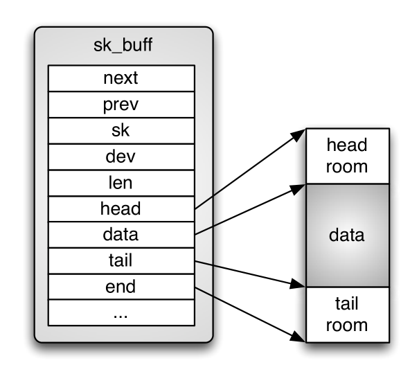
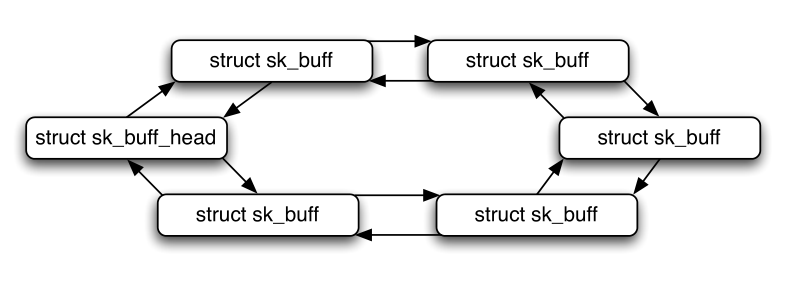

# Implementation of Transmission Control Protocol in Linux

## ABSTRACT

Transmission Control Protocol is the most used transmission layer protocol in the Internet. In addition to reliable and good performance in transmission between two nodes, it provides congestion control mechanism that is a major reason why Internet has not collapsed. Because of its complicated nature, implementations of it can be challenging to understand. This paper describes fundamental details of Transmission Control Protocol implementation in Linux kernel. Focus is on clarifying data structures and segments route through TCP stack.

传输控制协议是Internet中最常用的传输层协议。 除了在两个节点之间传输的可靠和良好性能之外，它还提供拥塞控制机制，这是因特网未崩溃的主要原因。 由于其复杂的性质，理解它的实现可能具有挑战性。本文描述了Linux内核中传输控制协议实现的基本细节。重点是澄清数据结构和通过 TCP 堆栈的路径。

## 1. INTRODUCTION

In May 1974 *Vint Cerf* and *Bob Kahn* published paper where they described an inter-networked protocol, which central control component was Transmission Control Program [3, 2].Later it was divided into modular architecture and in 1981 Transmission Control Protocol (TCP), as it is know today, was specified in RFC 793 [7].

1974年5月，*Vint Cerf* 和 *Bob Kahn* 发表论文，描述了一种网络间协议，其中央控制组件是传输控制程序[3, 2]。后来分为模块化架构和1981年传输控制协议（TCP）， 正如今天所知，在RFC 793 [7]中有详细说明。

Today, TCP is the most used transmission layer protocol in the Internet [4] providing reliable transmission between two hosts through networks [7]. In order to gain good performance for communication, implementations of TCP must be highly optimized. Therefore, TCP is one of the most complicated components in Linux networking stack. In kernel 3.5.4, it consists of over 21000 lines of code under `net/ipv4/` directory (all `tcp*.c` files together), while IPv4 consist of less than 13000 lines of code (all `ip*.c` files in the same directory). This paper explains the most fundamental data structures and operations used in Linux to implement TCP.

今天，TCP 是互联网中最常用的传输层协议[4]，通过网络在两台主机之间提供可靠的传输 [7]。为了获得良好的通信性能，必须高度优化 TCP 的实现。因此，TCP 是 Linux 网络堆栈中最复杂的组件之一。在 `kernel 3.5.4`中，它由 `net/ipv4/` 目录（所有 `tcp*.c` 文件一起）下的超过21000行代码组成，而IPv4由少于13000行代码组成（所有 `ip*.c` 文件在同一目录中）。本文解释了 Linux 中用于实现 TCP 的最基本的数据结构和操作。

TCP provides reliable communication over unreliable network by using acknowledgment messages. In addition to provide resending of the data, TCP also controls its sending rate by using so-called 'windows' to inform the other end how much of data receiver is ready to accept.

TCP 通过使用确认消息在不可靠的网络上提供可靠的通信。除了提供数据重发之外，TCP还通过使用所谓的 "窗口(windows)" 来控制其发送速率，以通知另一端有多少数据接收器已准备好接受。

As parts of the TCP code are dependent on network layer implementation, the scope of this paper is limited to IPv4 implementation as it is currently supported and used more widely than IPv6. However, most of the code is shared between IPv4 and IPv6, and `tcp_ipv6.c` is the only file related to TCP under net/ipv6/. In addition, TCP congestion control will be handled in a separate paper, so it will be handled very briefly. If other assumptions is made it is mentioned in the beginning of the related section.

由于 TCP 代码的一部分依赖于网络层实现，因此本文的范围仅限于 IPv4 实现，因为它目前支持和使用比 IPv6 更广泛。但是，大多数代码在 IPv4 和 IPv6 之间共享，而 `tcp_ipv6.c` 是 ``net/ipv6/` 下唯一与TCP相关的文件。此外，TCP 拥塞控制将在另一篇文章中处理，因此将非常简单地处理。如果做出其他假设，则在相关章节的开头提及。

Paper structure will be following: First section **"Overview of implementation"** will cover most important files and basic data structures used by TCP (`sk_buff`, `tcp_sock`), how data is stored inside these structures and how different queues are implemented, what timers TCP is using and how TCP sockets are kept in memory. Then socket initialization and data flows through TCP is discussed. Section **"Algorithms, optimizations and options"** will handle logic of TCP state machine, explain what is TCP fast path and discuss about socket options that can be used to modify behaviour of TCP.

论文的结构如下：第一部分 **“实现概述”** 将涵盖TCP（`sk_buff`，`tcp_sock`）使用的最重要的文件和基本数据结构，数据如何存储在这些结构中以及如何实现不同的队列，什么是TCP定时器，正在使用以及TCP套接字如何保存在内存中。 然后讨论套接字初始化和通过TCP的数据流。**“算法，优化和选项”** 部分将处理TCP状态机的逻辑，解释什么是 TCP 快速路径，并讨论可用于修改 TCP 行为的套接字选项。

## 2. OVERVIEW OF IMPLEMENTATION

In this section basic operation of TCP in Linux will be explained. It covers the most fundamental files and data structures used by TCP, as well as functions used when we are sending to or receiving from network.

在本节中，将解释Linux中TCP的基本操作。它涵盖了 TCP 使用的最基本的文件和数据结构，以及我们发送到网络或从网络接收时使用的功能。

The most important files of implementation are listed in table 1. In addion to `net/ipv4/` where most TCP files are located, there are also few headers located in `include/net/` and `include/linux/` directories.

最重要的实现文件列在 表1 中。除了大多数TCP文件所在的 `net/ipv4/` 之外，`include/net/` 和 `include/linux/` 目录中也有很少的头文件。

Table 1: Most important files of TCP

|File                    | Description
|------------------------|--------------------------------------------------------------------------
|`tcp.c`                 | Layer between user and kernel space   用户和内核空间之间的层
|`tcp_output.c`          | TCP output engine. Handles outgoing data and passes it to network layer    TCP输出引擎。处理传出数据并将其传递到网络层
|`tcp_input.c`           | TCP input engine. Handles incoming segments.    TCP输入引擎。处理传入的细分。
|`tcp_timer.c`           | TCP timer handling    TCP计时器处理
|`tcp_ipv4.c`            | IPv4 related functions, receives segments from network layer    IPv4相关功能，从网络层接收段
|`tcp_cong.c`            | Congestion control handler, includes also **TCP Reno** implementation   拥塞控制处理程序，还包括 **TCP Reno** 实现
|`tcp [veno|vegas|..].c` | Congestion control algorithms, named as `tcp_NAME.c`    拥塞控制算法，命名为 `tcp_NAME.c`
|`tcp.h`                 | Main header files of TCP. struct tcp sock is defined here. Note that there is `tcp.h` in both `include/net/` and `include/linux/`    TCP的主头文件。 struct tcp sock在这里定义。 请注意，`include/net/` 和 `include/linux/` 中都有`tcp.h`

### 2.1 Data structures

Data structures are crucial sections of any software in order of performance and re-usability. As TCP is a highly optimized and remarkably complex entirety, robust understanding of data structures used is mandatory for mastering the implementation.

数据结构是任何软件的关键部分，按性能和可重用性顺序排列。 由于TCP是一个高度优化且非常复杂的整体，因此必须对所使用的数据结构有深刻理解，以掌握实现。

#### 2.1.1 `struct sk_buff`

`struct sk_buff` (located in `include/linux/skbuff.h`) is used widely in the network implementation in Linux kernel. It is a socket buffer containing one slice of the data we are sending or receiving. In Figure 1 we see how data is stored inside structure. Data is hold in the continuous memory area surrounded by empty spaces, head and tail rooms. By having these empty spaces more data can be added to before or after current data without needing to copy or move it, and minimize risk of need to allocate more memory. However, if the data does not fit to space allocated, it will be fragmented to smaller segments and saved inside `struct skb_shared_info` that lives at the end of data (at the end pointer).

`struct sk_buff`（位于`include/linux/skbuff.h`）在 Linux 内核的网络实现中被广泛使用。它是一个套接字缓冲区，包含我们发送或接收的一个数据片。在图1中，我们看到数据如何存储在结构中。数据保存在由空的空间，头部和尾部空间包围的连续存储区域中。通过使这些空白空间可以在当前数据之前或之后添加更多数据，而无需复制或移动它，并最大限度地降低分配更多内存的风险。 但是，如果数据不适合分配的空间，它将被分段为较小的段并保存在生成数据末尾的 `struct skb_shared_info` 中（在结束指针处）。

All the data cannot be held in one large segment in the memory, and therefore we must have several socket buffers to be able to handle major amounts of data and to resend data segment that was lost during transmission to receiver. Because of that need of network data queues is obvious. In Linux these queues are implemented as ring-lists of `sk_buff` structures (Figure 2). Each socket buffer has a pointer to the previous and next buffers. There is also special data structure to represent the whole list, known as struct `sk_buff` head. More detailed  information about the data queues is in section 2.1.3.

所有数据都不能保存在内存中的一个大段中，因此我们必须有几个套接字缓冲区才能处理大量数据并重新发送在传输到接收器期间丢失的数据段。由于网络数据队列的需要是显而易见的。在Linux中，这些队列被实现为 `sk_buff` 结构的环形链表（图2）。每个套接字缓冲区都有一个指向前一个和下一个缓冲区的指针，还有特殊的数据结构来表示整个列表，称为struct`sk_buff`头。 有关数据队列的更多详细信息，请参见第2.1.3节。

In addition data pointers, `sk_buff` also has pointer to owning socket, device from where data is arriving from or leaving by and several other members. All the members are documented in `skbuff.h`.

此外，数据指针 `sk_buff` 还具有指向拥有套接字的指针，数据来自或离开的设备以及其他几个成员。所有成员都记录在`skbuff.h`中。
