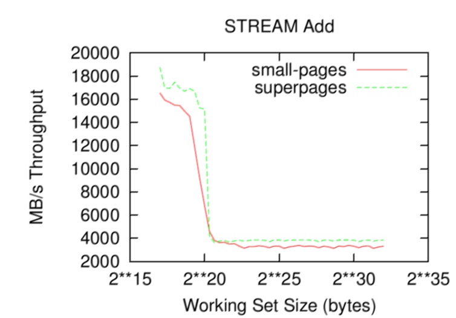
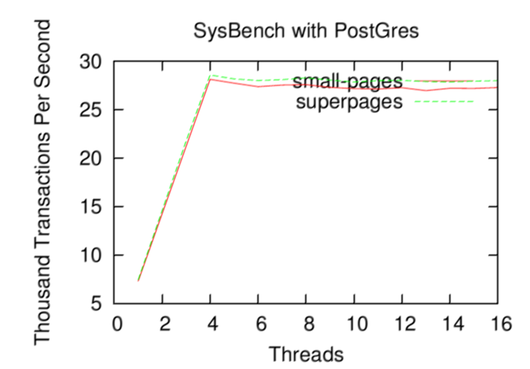
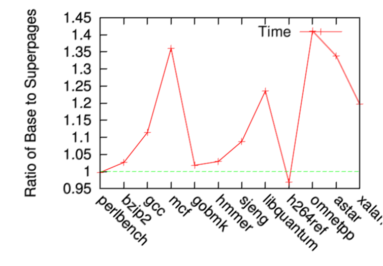
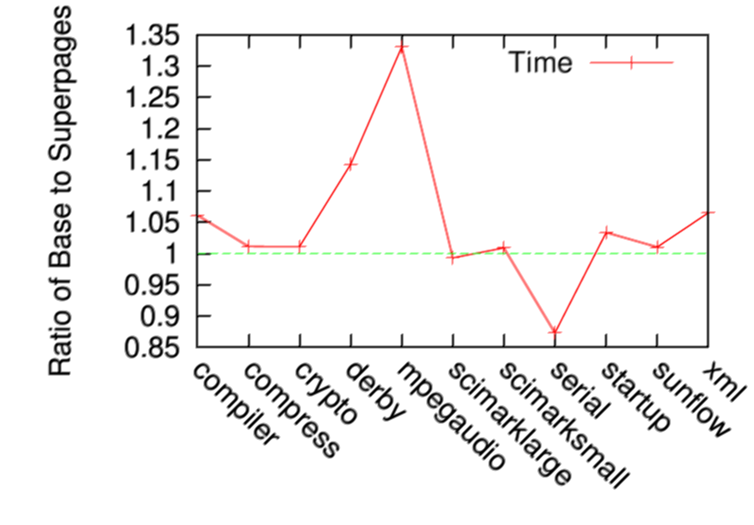

# Huge Pages

## Introduction

* [Huge pages part 1 (Introduction)](https://lwn.net/Articles/374424/)

One of the driving forces behind the development of Virtual Memory (VM) was to reduce the programming burden associated with fitting programs into limited memory. A fundamental property of VM is that the CPU references a virtual address that is translated via a combination of software and hardware to a physical address. This allows information only to be paged into memory on demand (demand paging) improving memory utilisation, allows modules to be arbitrary placed in memory for linking at run-time and provides a mechanism for the protection and controlled sharing of data between processes. Use of virtual memory is so pervasive that it has been described as an “one of the engineering triumphs of the computer age” [denning96] but this indirection is not without cost.

Typically, the total number of translations required by a program during its lifetime will require that the page tables are stored in main memory. Due to translation, a virtual memory reference necessitates multiple accesses to physical memory, multiplying the cost of an ordinary memory reference by a factor depending on the page table format. To cut the costs associated with translation, VM implementations take advantage of the principal of locality [denning71] by storing recent translations in a cache called the Translation Lookaside Buffer (TLB) [casep78,smith82,henessny90]. The amount of memory that can be translated by this cache is referred to as the "TLB reach" and depends on the size of the page and the number of TLB entries. Inevitably, a percentage of a program's execution time is spent accessing the TLB and servicing TLB misses.

The amount of time spent translating addresses depends on the workload as the access pattern determines if the TLB reach is sufficient to store all translations needed by the application. On a miss, the exact cost depends on whether the information necessary to translate the address is in the CPU cache or not. To work out the amount of time spent servicing the TLB misses, there are some simple formulas:

```latex
Cyclestlbhit = TLBHitRate * TLBHitPenalty
Cyclestlbmiss_cache = TLBMissRatecache * TLBMissPenaltycache

Cyclestlbmiss_full = TLBMissRatefull * TLBMissPenaltyfull

TLBMissCycles = Cyclestlbmiss_cache + Cycles_tlbmiss_full

TLBMissTime = (TLB Miss Cycles)/(Clock rate)
```

If the TLB miss time is a large percentage of overall program execution, then the time should be invested to reduce the miss rate and achieve better performance. One means of achieving this is to translate addresses in larger units than the base page size, as supported by many modern processors.

Using more than one page size was identified in the 1990s as one means of reducing the time spent servicing TLB misses by increasing TLB reach. The benefits of huge pages are twofold. The obvious performance gain is from fewer translations requiring fewer cycles. A less obvious benefit is that address translation information is typically stored in the L2 cache. With huge pages, more cache space is available for application data, which means that fewer cycles are spent accessing main memory. Broadly speaking, database workloads will gain about 2-7% performance using huge pages whereas scientific workloads can range between 1% and 45%.

Huge pages are not a universal gain, so transparent support for huge pages is limited in mainstream operating systems. On some TLB implementations, there may be different numbers of entries for small and huge pages. If the CPU supports a smaller number of TLB entries for huge pages, it is possible that huge pages will be slower if the workload reference pattern is very sparse and making a small number of references per-huge-page. There may also be architectural limitations on where in the virtual address space huge pages can be used.

Many modern operating systems, including Linux, support huge pages in a more explicit fashion, although this does not necessarily mandate application change. Linux has had support for huge pages since around 2003 where it was mainly used for large shared memory segments in database servers such as Oracle and DB2. Early support required application modification, which was considered by some to be a major problem. To compound the difficulties, tuning a Linux system to use huge pages was perceived to be a difficult task. There have been significant improvements made over the years to huge page support in Linux and as this article will show, using huge pages today can be a relatively painless exercise that involves no source modification.

This first article begins by installing some huge-page-related utilities and support libraries that make tuning and using huge pages a relatively painless exercise. It then covers the basics of how huge pages behave under Linux and some details of concern on NUMA. The second article covers the different interfaces to huge pages that exist in Linux. In the third article, the different considerations to make when tuning the system are examined as well as how to monitor huge-page-related activities in the system. The fourth article shows how easily benchmarks for different types of application can use huge pages without source modification. For the very curious, some in-depth details on TLBs and measuring the cost within an application are discussed before concluding.

### 1 Huge Page Utilities and Support Libraries

1 Huge Page Utilities and Support Libraries
There are a number of support utilities and a library packaged collectively as libhugetlbfs. Distributions may have packages, but this article assumes that libhugetlbfs 2.7 is installed. The latest version can always be cloned from git using the following instructions

```sh
  $ git clone git://libhugetlbfs.git.sourceforge.net/gitroot/libhugetlbfs/libhugetlbfs
  $ cd libhugetlbfs
  $ git checkout -b next origin/next
  $ make PREFIX=/usr/local
```

There is an install target that installs the library and all support utilities but there are install-bin, install-stat and install-man targets available in the event the existing library should be preserved during installation.

The library provides support for automatically backing text, data, heap and shared memory segments with huge pages. In addition, this package also provides a programming API and manual pages. The behaviour of the library is controlled by environment variables (as described in the libhugetlbfs.7 manual page) with a launcher utility hugectl that knows how to configure almost all of the variables. hugeadm, hugeedit and pagesize provide information about the system and provide support to system administration. tlbmiss_cost.sh automatically calculates the average cost of a TLB miss. cpupcstat and oprofile_start.sh provide help with monitoring the current behaviour of the system. Manual pages are available describing in further detail each utility.

### 2 Huge Page Fault Behaviour

In the following articles, there will be discussions on how different type of memory regions can be created and backed with huge pages. One important common point between them all is how huge pages are faulted and when the huge pages are allocated. Further, there are important differences between shared and private mappings depending on the exact kernel version used.

In the initial support for huge pages on Linux, huge pages were faulted at the same time as mmap() was called. This guaranteed that all references would succeed for shared mappings once mmap() returned successfully. Private mappings were safe until fork() was called. Once called, it's important that the child call exec() as soon as possible or that the huge page mappings were marked MADV_DONTFORK with madvise() in advance. Otherwise, a Copy-On-Write (COW) fault could result in application failure by either parent or child in the event of allocation failure.

Pre-faulting pages drastically increases the cost of mmap() and can perform sub-optimally on NUMA. Since 2.6.18, huge pages were faulted the same as normal mappings when the page was first referenced. To guarantee that faults would succeed, huge pages were reserved at the time the shared mapping is created but private mappings do not make any reservations. This is unfortunate as it means an application can fail without fork() being called. libhugetlbfs handles the private mapping problem on old kernels by using readv() to make sure the mapping is safe to access, but this approach is less than ideal.

Since 2.6.29, reservations are made for both shared and private mappings. Shared mappings are guaranteed to successfully fault regardless of what process accesses the mapping.

For private mappings, the number of child processes is indeterminable so only the process that creates the mapping mmap() is guaranteed to successfully fault. When that process fork()s, two processes are now accessing the same pages. If the child performs COW, an attempt will be made to allocate a new page. If it succeeds, the fault successfully completes. If the fault fails, the child gets terminated with a message logged to the kernel log noting that there were insufficient huge pages. If it is the parent process that performs COW, an attempt will also be made to allocate a huge page. In the event that allocation fails, the child's pages are unmapped and the event recorded. The parent successfully completes the fault but if the child accesses the unmapped page, it will be terminated.

### 3 Huge Pages and Swap

There is no support for the paging of huge pages to backing storage.

### 4 Huge Pages and NUMA

On NUMA, memory can be local or remote to the CPU, with significant penalty incurred for remote access. By default, Linux uses a node-local policy for the allocation of memory at page fault time. This policy applies to both base pages and huge pages. This leads to an important consideration while implementing a parallel workload.

The thread processing some data should be the same thread that caused the original page fault for that data. A general anti-pattern on NUMA is when a parent thread sets up and initialises all the workload's memory areas and then creates threads to process the data. On a NUMA system this can result in some of the worker threads being on CPUs remote with respect to the memory they will access. While this applies to all NUMA systems regardless of page size, the effect can be pronounced on systems where the split between worker threads is in the middle of a huge page incurring more remote accesses than might have otherwise occurred.

This scenario may occur for example when using huge pages with OpenMP, because OpenMP does not necessarily divide its data on page boundaries. This could lead to problems when using base pages, but the problem is more likely with huge pages because a single huge page will cover more data than a base page, thus making it more likely any given huge page covers data to be processed by different threads. Consider the following scenario. A first thread to touch a page will fault the full page's data into memory local to the CPU on which the thread is running. When the data is not split on huge-page-aligned boundaries, such a thread will fault its data and perhaps also some data that is to be processed by another thread, because the two threads' data are within the range of the same huge page. The second thread will fault the rest of its data into local memory, but will still have part of its data accesses be remote. This problem manifests as large standard deviations in performance when doing multiple runs of the same workload with the same input data. Profiling in such a case may show there are more cross-node accesses with huge pages than with base pages. In extreme circumstances, the performance with huge pages may even be slower than with base pages. For this reason it is important to consider on what boundary data is split when using huge pages on NUMA systems.

One work around for this instance of the general problem is to use MPI in combination with OpenMP. The use of MPI allows division of the workload with one MPI process per NUMA node. Each MPI process is bound to the list of CPUs local to a node. Parallelisation within the node is achieved using OpenMP, thus alleviating the issue of remote access.

### 5 Summary

In this article, the background to huge pages were introduced, what the performance benefits can be and some basics of how huge pages behave on Linux. The next article (to appear in the near future) discusses the interfaces used to access huge pages.

## Interfaces

* [Huge pages part 2: Interfaces](https://lwn.net/Articles/375096/)

In an ideal world, the operating system would automatically use huge pages where appropriate, but there are a few problems. First, the operating system must decide when it is appropriate to promote base pages to huge pages requiring the maintenance of metadata which, itself, has an associated cost which may or may not be offset by the use of huge pages. Second, there can be architectural limitations that prevent a different page size being used within an address range once one page has been inserted. Finally, differences in TLB structure make predicting how many huge pages can be used and still be of benefit problematic.

For these reasons, with one notable exception, operating systems provide a more explicit interface for huge pages to user space. It is up to application developers and system administrators to decide how they best be used. This chapter will cover the interfaces that exist for Linux.

### 1 Shared Memory

One of the oldest interfaces backs shared memory segments created by shmget() with huge pages. Today, it is commonly used due to its simplicity and the length of time it has been supported. Huge pages are requested by specifying the SHM_HUGETLB flag and ensuring the size is huge-page-aligned. Examples of how to do this are included in the kernel source tree under Documentation/vm/hugetlbpage.txt.

A limitation of this interface is that only the default huge page size (as indicated by the Hugepagesize field in /proc/meminfo) will be used. If one wanted to use 16GB pages as supported on later versions of POWER for example, the default_hugepagesz= field must be used on the kernel command line as documented in Documentation/kernel-parameters.txt in the kernel source.

The maximum amount of memory that can be committed to shared-memory huge pages is controlled by the shmmax sysctl parameter. This parameter will be discussed further in the next installment.

### 2 HugeTLBFS

For the creation of shared or private mappings, Linux provides a RAM-based filesystem called "hugetlbfs." Every file on this filesystem is backed by huge pages and is accessed with mmap() or read(). If no options are specified at mount time, the default huge page size is used to back the files. To use a different page size, specify pagesize=.

```sh
$ mount -t hugetlbfs none /mnt/hugetlbfs -o pagesize=64K
```

There are two ways to control the amount of memory which can be consumed by huge pages attached to a mount point. The size= mount parameter specifies (in bytes; the "K," "M," and "G" suffixes are understood) the maximum amount of memory which will be used by this mount. The size is rounded down to the nearest huge page size. It can also be specified as a percentage of the static huge page pool, though this option appears to be rarely used. The `nr_inodes=` parameter limits the number of files that can exist on the mount point which, in effect, limits the number of possible mappings. In combination, these options can be used to divvy up the available huge pages to groups or users in a shared system.

Hugetlbfs is a bare interface to the huge page capabilities of the underlying hardware; taking advantage of it requires application awareness or library support. Libhugetlbfs makes heavy use of this interface when automatically backing regions with huge pages.

For an application wishing to use the interface, the initial step is to discover the mount point by either reading `/proc/mounts` or using `libhugetlbfs`. Finding the mount point manually is relatively straightforward and already well known for debugfs but, for completeness, a very simple example program is shown below:

```c
#include <stdio.h>
#include <string.h>
#include <stdlib.h>
#include <sys/param.h>

char *find_hugetlbfs(char *fsmount, int len)
{
	char format[256];
	char fstype[256];
	char *ret = NULL;
	FILE *fd;

	snprintf(format, 255, "%%*s %%%ds %%255s %%*s %%*d %%*d", len);

	fd = fopen("/proc/mounts", "r");
	if (!fd) {
		perror("fopen");
		return NULL;
	}

	while (fscanf(fd, format, fsmount, fstype) == 2) {
		if (!strcmp(fstype, "hugetlbfs")) {
			ret = fsmount;
			break;
		}
	}

	fclose(fd);
	return ret;
}

int main() {
	char buffer[PATH_MAX+1];
	printf("hugetlbfs mounted at %s\n", find_hugetlbfs(buffer, PATH_MAX));
	return 0;
}
```

When there are multiple mount points (to make different page sizes available), it gets more complicated; libhugetlbfs also provides a number of functions to help with these mount points. `hugetlbfs_find_path()` returns a mount point similar to the example program above, while `hugetlbfs_find_path_for_size()` will return a mount point for a specific huge page size. If the developer wishes to test a particular path to see if it hugetlbfs or not, use `hugetlbfs_test_path()`.

### 3 Anonymous mmap()

As of kernel 2.6.32, support is available that allows anonymous mappings to be created backed by huge pages with mmap() by specifying the flags MAP_ANONYMOUS|MAP_HUGETLB. These mappings can be private or shared. It is somewhat of an oversight that the amount of memory that can be pinned for anonymous mmap() is limited only by huge page availability. This potential problem may be addressed in future kernel releases.

### 4 libhugetlbfs Allocation APIs

It is recognised that a number of applications want to simply get a buffer backed by huge pages. To facilitate this, libhugetlbfs provides two APIs since release 2.0, get_hugepage_region() and get_huge_pages() with corresponding free functions called free_hugepage_region() and free_huge_pages(). These are all provided with manual pages distributed with the libhugetlbfs package.

get_huge_pages() is intended for use with the development of custom allocators and not as a drop-in replacement for malloc(). It is required that the size parameter to this API be hugepage-aligned which can be discovered with the function gethugepagesize().

If an application wants to allocate a number of very large buffers but is not concerned with alignment or some wastage, it should use get_hugepage_region(). The calling convention to this function is much more relaxed and will optionally fallback to using small pages if necessary.

It is possible that applications need very tight control over how the mapping is placed in memory. If this is the case, libhugetlbfs provides hugetlbfs_unlinked_fd() and hugetlbfs_unlinked_fd_for_size() to create a file descriptor representing an unlinked file on a suitable hugetlbfs mount point. Using the file-descriptor, the application can mmap() with the appropriate parameters for accurate placement.

Converting existing applications and libraries to use the API where applicable should be straightforward, but basic examples of how to do it with the STREAM memory bandwidth benchmark suite are available [gorman09a].

### 5 Automatic Backing of Memory Regions

While applications can be modified to use any of the interfaces, it imposes a significant burden on the application developer. To make life easier, libhugetlbfs can back a number of memory region types automatically when it is either pre-linked or pre-loaded. This process is described in the HOWTO documentation and manual pages that come with libhugetlbfs.

Once loaded, libhugetlbfs's behaviour is determined by environment variables described in the libhugetlbfs.7 manual page. As manipulating environment variables is time-consuming and error-prone, a hugectl utility exists that does much of the configuring automatically and will output what steps it took if the --dry-run switch is specified.

To determine if huge pages are really being used, /proc can be examined, but libhugetlbfs will also warn if the verbosity is set sufficiently high and sufficient numbers of huge pages are not available. See below for an example of using a simple program that backs a 32MB segment with huge pages. Note how the first attempt to use huge pages failed and some configuration was required as no huge pages were previously configured on this system.

The manual pages are quite comprehensive so this section will only give a brief introduction as to how different sections of memory can be backed by huge pages without modification.

```sh
  $ ./hugetlbfs-shmget-test 
  shmid: 0x2130007
  shmaddr: 0xb5e37000
  Starting the writes: ................................
  Starting the Check...Done.

  $ hugectl --shm ./hugetlbfs-shmget-test
  libhugetlbfs: WARNING: While overriding shmget(33554432) to add
                         SHM_HUGETLB: Cannot allocate memory
  libhugetlbfs: WARNING: Using small pages for shmget despite
                         HUGETLB_SHM shmid: 0x2128007
  shmaddr: 0xb5d57000
  Starting the writes: ................................
  Starting the Check...Done.

  $ hugeadm --pool-pages-min 4M:32M
  $ hugectl --shm ./hugetlbfs-shmget-test 
  shmid: 0x2158007
  shmaddr: 0xb5c00000
  Starting the writes: ................................
  Starting the Check...Done.
```

#### 5.1 Shared Memory

When libhugetlbfs is preloaded or linked and the environment variable HUGETLB_SHM is set to yes, libhugetlbfs will override all calls to shmget(). Alternatively, launch the application with hugectl $--$shm. On setup, all shmget() requests will become aligned to a hugepage boundary and backed with huge pages if possible. If the system configuration does not allow huge pages to be used, the original request is honoured.

#### 5.2 Heap

Glibc defines a __morecore hook that is is called when the heap size needs to be increased; libhugetlbfs uses this hook to create regions of memory backed by huge pages. Similar to shared memory, base pages are used when huge pages are not available.

When libhugetlbfs is preloaded or linked and the environment variable HUGETLB_MORECORE set to yes, libhugetlbfs will configure the __morecore hook, causing malloc() requests will use huge pages. Alternatively, launch the application with hugectl --heap.

Unlike shared memory, the page size can also be specified if more than one page size is supported by the system. The first example below uses the default page size (e.g. 16M on Power5+) and the second example explicitly overrides a default, using 64K pages.

```sh
    $ hugectl --heap ./target-application
    $ hugectl --heap=64k ./target-application
```

If the application has already been linked with libhugetlbfs, it may be necessary to specify --no-preload when using --heap so that an attempt is not made to load the library twice.

By using the __morecore hook and setting the mallopt() option M_MMAP_MAX to zero, libhugetlbfs prevents glibc from making use of brk() to expand the heap. An application that calls brk() directly will be using base pages.

If a custom memory allocator is being used, it must support the __morecore hook to use huge pages. An alternative may be to provide a wrapper around malloc() that called the real underlying malloc() or get_hugepage_region() depending on the size of the buffer. A heavy solution would be to provide a fully-fledged implementation of malloc() with libhugetlbfs that uses huge pages where appropriate, but this is currently unavailable due to the lack of a demonstrable use case.

#### 5.3 Text and Data

Backing text or data is more involved as the application should first be relinked to align the sections to a huge page boundary. This is accomplished by linking against libhugetlbfs and specifying -Wl,--hugetlbfs-align -- assuming the version of binutils installed is sufficiently recent. More information on relinking applications is described in the libhugetlbfs HOWTO. Once the application is relinked, as before control is with environment variables or with hugectl.

```sh
    $ hugectl --text --data --bss ./target-application
```

When backing text or data by text, the relevant sections are copied to files on the hugetlbfs filesystem and mapped with mmap(). The files are then unlinked so that the memory is freed on application exit. If the application is to be invoked multiple times, it is worth sharing that data by specifying the --share-text switch. The consequence is that the memory remains in use when the application exits and must be manually deleted.

If it is not possible to relink the application, it is possible to force the loading of segments backed by huge pages by setting the environment variable HUGETLB_FORCE_ELFMAP to yes. This is not the preferred option as the method is not guaranteed to work. Segments must be large enough to overlap with a huge page and on architectures with limitations on where segments can be placed, it can be particularly problematic.

#### 5.4 Stack

Currently, the stack cannot be backed by huge pages. Support was implemented in the past but the vast majority of applications did not aggressively use the stack. In many distributions, there are ulimits on the size of the stack that are smaller than a huge page size. Upon investigation, only the bwaves test from the SPEC CPU 2006 benchmark benefited from stacks being backed by huge pages and only then when using a commercial compiler. When compiled with gcc, there was no benefit, hence support was dropped.

### 6 Summary

There are a small number of interfaces provided by Linux to access huge pages. While cumbersome to develop applications against, there is a programming API available with libhugetlbfs and it is possible to automatically back segments of memory with huge pages without application modification. In the next section, it will be discussed how the system should be tuned.

## Administration

* [Huge pages part 3: Administration](https://lwn.net/Articles/376606/)

In this chapter, the setup and the administration of huge pages within the system is addressed. Part 2 discussed the different interfaces between user and kernel space such as hugetlbfs and shared memory. For an application to use these interfaces, though, the system must first be properly configured. Use of hugetlbfs requires only that the filesystem must be mounted; shared memory needs additional tuning and huge pages must also be allocated. Huge pages can be statically allocated as part of a pool early in the lifetime of the system or the pool can be allowed to grow dynamically as required. Libhugetlbfs provides a hugeadm utility that removes much of the tedium involved in these tasks.

### 1 Identifying Available Page Sizes

Since kernel 2.6.27, Linux has supported more than one huge page size if the underlying hardware does. There will be one directory per page size supported in /sys/kernel/mm/hugepages and the "default" huge page size will be stored in the Hugepagesize field in /proc/meminfo.

The default huge page size can be important. While hugetlbfs can specify the page size at mount time, the same option is not available for shared memory or MAP_HUGETLB. This can be important when using 1G pages on AMD or 16G pages on Power 5+ and later. The default huge page size can be set either with the last hugepagesz= option on the kernel command line (see below) or explicitly with default_hugepagesz=.

Libhugetlbfs provides two means of identifying the huge page sizes. The first is using the pagesize utility with the -H switch printing the available huge page sizes and -a showing all page sizes. The programming equivalent are the gethugepagesizes() and getpagesizes() calls.

### 2 Huge Page Pool

Due to the inability to swap huge pages, none are allocated by default, so a pool must be configured with either a static or a dynamic size. The static size is the number of huge pages that are pre-allocated and guaranteed to be available for use by applications. Where it is known in advance how many huge pages are required, the static size should be set.

The size of the static pool may be set in a number of ways. First, it may be set at boot-time using the hugepages= kernel boot parameter. If there are multiple huge page sizes, the hugepagesz= parameter must be used and interleaved with hugepages= as described in Documentation/kernel-parameters. For example, Power 5+ and later support multiple page sizes including 64K and 16M; both could be configured with:

```sh
    hugepagesz=64k hugepages=128 hugepagesz=16M hugepages=4
```

Second, the default huge page pool size can be set with the vm.nr_hugepages sysctl, which, again, tunes the default huge page pool. Third, it may be set via sysfs by finding the appropriate nr_hugepages virtual file below /sys/kernel/mm/hugepages.

Knowing the exact huge page requirements in advance may not be possible. For example, the huge page requirements may be expected to vary throughout the lifetime of the system. In this case, the maximum number of additional huge pages that should be allocated is specified with the vm.nr_overcommit_hugepages. When a huge page pool does not have sufficient pages to satisfy a request for huge pages, an attempt to allocate up to nr_overcommit_hugepages is made. If an allocation fails, the result will be that mmap() will fail to avoid page fault failures as described in Huge Page Fault Behaviour in part 1.

It is easiest to tune the pools with hugeadm. The --pool-pages-min argument specifies the minimum number of huge pages that are guaranteed to be available. The --pool-pages-max argument specifies the maximum number of huge pages that will exist in the system, whether statically or dynamically allocated. The page size can be specified or it can be simply DEFAULT. The amount to allocate can be specified as either a number of huge pages or a size requirement.

In the following example, run on an x86 machine, the 4M huge page pool is being tuned. As 4M also happens to be the default huge page size, it could also have been specified as DEFAULT:32M and DEFAULT:64M respectively.

```sh
    $ hugeadm --pool-pages-min 4M:32M
    $ hugeadm --pool-pages-max 4M:64M
    $ hugeadm --pool-list
          Size  Minimum  Current  Maximum  Default
       4194304        8        8       16        *
```

To confirm the huge page pools are tuned to the satisfaction of requirements, hugeadm --pool-list will report on the minimum, maximum and current usage of huge pages of each size supported by the system.

### 3 Mounting HugeTLBFS

To access the special filesystem described in HugeTLBFS in part 2, it must first be mounted. What may be less obvious is that this is required to benefit from the use of the allocation API, or to automatically back segments with huge pages (as also described in part 2). The default huge page size is used for the mount if the pagesize= is not used. The following mounts two filesystem instances with different page sizes as supported on Power 5+.

```sh
  $ mount -t hugetlbfs /mnt/hugetlbfs-default
  $ mount -t hugetlbfs /mnt/hugetlbfs-64k -o pagesize=64K
```

Ordinarily it would be the responsibility of the administrator to set the permissions on this filesystem appropriately. hugeadm provides a range of different options for creating mount points with different permissions. The list of options are as follows and are self-explanatory.

`--create-mounts` <br>
Creates a mount point for each available huge page size on this system under `/var/lib/hugetlbfs`.

`--create-user-mounts <user>` <br>
Creates a mount point for each available huge page size under `/var/lib/hugetlbfs/<user>` usable by user `<user>`.

`--create-group-mounts <group>` <br>
Creates a mount point for each available huge page size under `/var/lib/hugetlbfs/<group>` usable by group `<group>`.

`--create-global-mounts` <br>
Creates a mount point for each available huge page size under `/var/lib/hugetlbfs/global` usable by anyone.

It is up to the discretion of the administrator whether to call hugeadm from a system initialization script or to create appropriate fstab entries. If it is unclear what mount points already exist, use --list-all-mounts to list all current hugetlbfs mounts and the options used.

#### 3.1 Quotas

A little-used feature of hugetlbfs is quota support which limits the number of huge pages that a filesystem instance can use even if more huge pages are available in the system. The expected use case would be to limit the number of huge pages available to a user or group. While it is not currently supported by hugeadm, the quota can be set with the size= option at mount time.

### 4 Enabling Shared Memory Use

There are two tunables that are relevant to the use of huge pages with shared memory. The first is the sysctl kernel.shmmax kernel parameter configured permanently in /etc/sysctl.conf or temporarily in /proc/sys/kernel/shmmax. The second is the sysctl vm.hugetlb_shm_group which stores which group ID (GID) is allowed to create shared memory segments. For example, lets say a JVM was to use shared memory with huge pages and ran as the user JVM with UID 1500 and GID 3000, then the value of this tunable should be 3000.

Again, hugeadm is able to tune both of these parameters with the switches --set-recommended-shmmax and --set-shm-group. As the recommended value is calculated based on the size of the static and dynamic huge page pools, this should be called after the pools have been configured.

### 5 Huge Page Allocation Success Rates

If the huge page pool is statically allocated at boot-time, then this section will not be relevant as the huge pages are guaranteed to exist. In the event the system needs to dynamically allocate huge pages throughout its lifetime, then external fragmentation may be a problem. "External fragmentation" in this context refers to the inability of the system to allocate a huge page even if enough memory is free overall because the free memory is not physically contiguous. There are two means by which external fragmentation can be controlled, greatly increasing the success rate of huge page allocations.

The first means is by tuning vm.min_free_kbytes to a higher value which helps the kernel's fragmentation-avoidance mechanism. The exact value depends on the type of system, the number of NUMA nodes and the huge page size, but hugeadm can calculate and set it with the --set-recommended-min_free_kbytes switch. If necessary, the effectiveness of this step can be measured by using the trace_mm_page_alloc_extfrag tracepoint and ftrace although how to do it is beyond the scope of this article.

While the static huge page pool is guaranteed to be available as it has already been allocated, tuning min_free_kbytes improves the success rate when dynamically growing the huge page pool beyond its minimum size. The static pool sets the lower bound but there is no guaranteed upper bound on the number of huge pages that are available. For example, an administrator might request a minimum pool of 1G and a maximum pool 8G but fragmentation may mean that the real upper bound is 4G.

If a guaranteed upper bound is required, a memory partition can be created using either the kernelcore= or movablecore= switch at boot time. These switches create a “Movable” zone that can be seen in /proc/zoneinfo or /proc/buddyinfo. Only pages that the kernel can migrate or reclaim exist in this zone. By default, huge pages are not allocated from this zone but it can be enabled by setting either vm.hugepages_treat_as_movable or using the hugeadm --enable-zone-movable switch.

### 6 Summary

In this chapter, four sets of system tunables were described. These relate to the allocation of huge pages, use of hugetlbfs filesystems, the use of shared memory, and simplifying the allocation of huge pages when dynamic pool sizing is in use. Once the administrator has made a choice, it should be implemented as part of a system initialization script. In the next chapter, it will be shown how some common benchmarks can be easily converted to use huge pages.

## benchmarking with huge pages

* [Huge pages part 4: benchmarking with huge pages](https://lwn.net/Articles/378641/)

In this installment, a small number of benchmarks are configured to use huge pages - STREAM, sysbench, SpecCPU 2006 and SpecJVM. In doing so, we show that utilising huge pages is a lot easier than in the past. In all cases, there is a heavy reliance on the hugeadm to simplify the machine configuration and hugectl to configure libhugetlbfs.

STREAM is a memory-intensive benchmark and, while its reference pattern has poor spacial and temporal locality, it can benefit from reduced TLB references. Sysbench is a simple OnLine Transaction Processing (OLTP) benchmark that can use Oracle, MySQL, or PostgreSQL as database backends. While there are better OLTP benchmarks out there, Sysbench is very simple to set up and reasonable for illustration. SpecCPU 2006 is a computational benchmark of interest to high-performance computing (HPC) and SpecJVM benchmarks basic classes of Java applications.

### 1 Machine Configuration

The machine used for this study is a Terrasoft Powerstation described in the table below.

|                |                                 |
|----------------|---------------------------------|
|Architecture    | PPC64 |
|CPU             | PPC970MP with altivec |
|CPU Frequency   |	2.5GHz |
|# Physical CPUs |	2 (4 cores) |
|L1 Cache per core |	32K Data, 64K Instruction |
|L2 Cache per core |	1024K Unified |
|L3 Cache per socket |	N/a |
|Main Memory |	8 GB |
|Mainboard |	Machine model specific |
|Superpage | Size	16MB |
|Machine Model |	Terrasoft Powerstation |

Configuring the system for use with huge pages was a simple matter of performing the following commands.

```sh
    $ hugeadm --create-global-mounts
    $ hugeadm --pool-pages-max DEFAULT:8G 
    $ hugeadm --set-recommended-min_free_kbytes
    $ hugeadm --set-recommended-shmmax
    $ hugeadm --pool-pages-min DEFAULT:2048MB
    $ hugeadm --pool-pages-max DEFAULT:8192MB
```

### 2 STREAM

STREAM [mccalpin07] is a synthetic memory bandwidth benchmark that measures the performance of four long vector operations: Copy, Scale, Add, and Triad. It can be used to calculate the number of floating point operations that can be performed during the time for the “average” memory access. Simplistically, more bandwidth is better.

The C version of the benchmark was selected and used three statically allocated arrays for calculations. Modified versions of the benchmark using malloc() and get_hugepage_region() were found to have similar performance characteristics.

The benchmark has two parameters: N, the size of the array, and OFFSET, the number of elements padding the end of the array. A range of values for N were used to generate workloads between 128K and 3GB in size. For each size of N chosen, the benchmark was run 10 times and an average taken. The benchmark is sensitive to cache placement and optimal layout varies between architectures; where the standard deviation of 10 iterations exceeded 5% of the throughput, OFFSET was increased to add one cache-line of padding between the arrays and the benchmark for that value of N was rerun. High standard deviations were only observed when the total working set was around the size of the L1, L2 or all caches combined.

The benchmark avoids data re-use, be it in registers or in the cache. Hence, benefits from huge pages would be due to fewer faults, a slight reduction in TLB misses as fewer TLB entries are needed for the working set and an increase in available cache as less translation information needs to be stored.

To use huge pages, the benchmark was first compiled with the libhugetlbfs ld wrapper to align the text and data sections to a huge page boundary [libhtlb09] such as in the following example.

```
   $ gcc -DN=1864135 -DOFFSET=0 -O2 -m64                     \
        -B /usr/share/libhugetlbfs -Wl,--hugetlbfs-align     \
        -Wl,--library-path=/usr/lib                          \
        -Wl,--library-path=/usr/lib64                        \
        -lhugetlbfs stream.c                                 \
        -o stream

   # Test launch of benchmark
   $ hugectl --text --data --no-preload ./stream
```

This page contains plots showing the performance results for a range of sizes running on the test machine; one of them appears to the right. Performance improvements range from 11.6% to 16.59% depending on the operation in use. Performance improvements would be typically lower for an X86 or X86-64 machine, likely in the 0% to 4% range. 



### 3 SysBench

SysBench is a OnLine Transaction Processing (OLTP) benchmark representing a general class of workload where clients perform a sequence of operations whose end result must appear to be an indivisible operation. TPC-C is considered an industry standard for the evaluation of OLTP but requires significant capital investment and is extremely complex to set up. SysBench is a system performance benchmark comprising file I/O, scheduler, memory allocation, threading and includes an OLTP benchmark. The setup requirements are less complicated and SysBench works for MySQL, PostgreSQL, and Oracle databases.

PostgreSQL was used for this experiment on the grounds that it uses a shared memory segment similar to Oracle, making it a meaningful comparison with a commercial database server. Sysbench 0.4.12 and Postgres 8.4.0 were built from source.

Postgres was configured to use a 756MB shared buffer, an effective cache of 150MB, a maximum of 6*NR_CPUs clients were allowed to connect. Note that the maximum number of clients allowed is greater than the number of clients used in the test. This is because a typical configuration would allow more connections than the expected number of clients to allow administrative processes to connect. The update_process_title parameter was turned off as a small optimisation. Options that checkout, fsync, log, or synchronise were turned off to avoid interference from I/O. The system was configured to allow the postgres user to use huge pages with shmget() as described in part 3. Postgres uses System V shared memory so pg_ctl was invoked as follows.

```sh
   $ hugectl --shm bin/pg_ctl -D `pwd`/data -l logfile start
```

For the test itself, the table size was 10 million rows, read-only to avoid I/O and the test type was “complex”, which means each operation by the client is a database transaction. Tests were run varying the number of clients accessing the database from one to four times the number of CPU cores in the system. For each thread count, the test was run multiple times until at least five iterations completed with a confidence level of 99% that the estimated mean is within 2% of the true mean. In practise, the initial iteration gets discarded due to increased I/O and faults incurred during the first run.

[SysBench benchmark result] The plot to the right (click for larger version) shows the performance results for different numbers of threads with performance improvements ranging in the 1%-3.5% mark. Unlike STREAM, the performance improvements would tend to be similar on X86 and X86-64 machines running this particular test configuration. The exact reasoning for this is beyond the scope of the article but it comes down to the fact that STREAM exhibits a very poor locality of reference, making cache behaviour a significant factor in the performance of the workload. As workloads would typically have a greater degree of reference locality than STREAM, the expectation would be that performance gains across different architectures would be similar.



### 4 SpecCPU 2006

SpecCPU 2006 v1.1 is a standardised CPU-intensive benchmark used in evaluations for HPC that also stresses the memory subsystem. A --reportable run was made comprising “test”, “train”, and three “ref” sets of input data. Three sets of runs compare base pages, huge pages backing just the heap, and huge pages backing text, data, and the heap. Only base tuning was used with no special compile options other than what was required to compile the tests.

To back the heap using huge pages, the tests were run with:

```sh
    hugectl --heap runspec ...
```

To also back the text and data, the SPEC configuration file was modified to build SPEC similar to STREAM described above, then the --text --data --bss switches were also specified to hugectl.

[SpecCPU benchmark result] This plot shows the performance results running the integer SpecCPU test (click for full size and the floating-point test results). As is clear, there are very large fluctuations depending on what the reference pattern of the workload was but many of the improvements are quite significant averaging around 13% for the Integer benchmarks and 7-8% for the floating-point operations. An interesting point to note is that for the Fortran applications, performance gains were similar whether text/data was backed or the heap. This heavily implies that the Fortran applications were using dynamic allocation. On older Fortran applications, relinking to back the text and data with huge pages may be required to see any performance gains.



### 5 SpecJVM (JVM/General)

Java is used in an increasing number of scenarios, including real time systems, and it dominates in the execution of business-logic related applications. Particularly within application servers, the Java Virtual Machine (JVM) uses large quantities of virtual address space that can benefit from being backed by huge pages. SpecJVM 2008 is a benchmark suite for Java Runtime Environments (JRE). According to the documentation, the intention is to reflect the performance of the processor and memory system with a low dependence on file or network I/O. Crucially for HPC, it includes SCIMark, which is a Java benchmark for scientific and numerical computing.

The 64-bit version of IBM Java Standard Edition Version 6 SP 3 was used, but support for huge pages is available in other JVMs. The JVM was configured to use a maximum of 756MB for the heap. Unlike the other benchmarks, the JVM is huge-page-aware and uses huge-page-backed shared memory segments when -Xlp is specified. An example invocation of the benchmark is as follows.

```sh
   $ java -Xlp -Xmx756m -jar SPECjvm2008.jar 120 300 --parseJvmArgs -i 1 --peak
```

[SpecJVM benchmark result] This plot shows the performance results running the full range of SpecJVM tests. The results are interesting as they show performance gains were not universal, with the serial benchmark being spectacularly poor. Despite this, performance was improved on average by 4.43% with very minimal work required on behalf of the administrator.



### 6 Summary

In this installment, it was shown that with minimal amounts of additional work, huge pages can be easily used to improve benchmarks. For the database and JVM benchmarks, the same configurations could easily be applied to a real-world deployment rather than as a benchmarking situation. For other benchmarks, the effort can be hidden with minimal use of initialisation scripts. Using huge pages on Linux in the past was a tricky affair but these examples show this is no longer the case.

## A deeper look at TLBs and costs

This chapter is not necessary to understand how huge pages are used and performance benefits from huge pages are often easiest to measure using an application-specific benchmark. However, there are the rare cases where a deeper understanding of the TLB can be enlightening. In this chapter, a closer look is taken at TLBs and analysing performance from a huge page perspective.

### 1 TLB Size and Characteristics

First off, it can be useful to know what sort of TLB the system has. On X86 and X86-64, the tool x86info can be used to discover the TLB size.

```sh
    $ x86info -c
      ...
      TLB info
       Instruction TLB: 4K pages, 4-way associative, 128 entries.
       Instruction TLB: 4MB pages, fully associative, 2 entries
       Data TLB: 4K pages, 4-way associative, 128 entries.
       Data TLB: 4MB pages, 4-way associative, 8 entries
      ...
```

On the PPC64 architecture, there is no automatic means of determining the number of TLB slots. PPC64 uses multiple translation-related caches of which the TLB is at the lowest layer. It is safe to assume on older revisions of POWER - such as the PPC970 - that 1024 entries are available. POWER 5+ systems will have 2048 entries and POWER 6 does not use a TLB. On PPC64, the topmost translation layer uses an Effective to Real Address Translation (ERAT) cache. On POWER 6, it supports 4K and 64K entries but typically the default huge page size of 16MB consumes multiple ERAT entries. Hence, the article will focus more on the TLB than on ERAT.

### 2 Calculating TLB Translation Cost

When deciding whether huge pages will be of benefit, the first step is estimating how much time is being spent translating addresses. This will approximate the upper-boundary of performance gains that can be achieved using huge pages. This requires that the number of TLB misses that occurred is calculated as well as the average cost of a TLB miss.

On much modern hardware, there is a Performance Measurement Unit (PMU) which provides a small number of hardware-based counters. The PMU is programmed to increment when a specific low-level event occurs and interrupt the CPU when a threshold, called the sample period, is reached. In many cases, there will be one low-level event that corresponds to a TLB miss so a reasonable estimate can be made of the number of TLB misses.

On Linux, the PMU can be programmed with oprofile on almost any kernel currently in use, or with perf on recent kernels. Unfortunately, perf is not suitable for the analysis we need in this installment. Perf maps high-level requests, such as cache misses, to suitable low-level events. However it is not currently able to map certain TLB events, such as the number of cycles spent walking a page table. It is technically possible to specify a raw event ID to perf, but figuring out the raw ID is error-prone and tricky to verify. Hence, we will be using oprofile to program the PMU in this installment.

A detailed examination of the hardware specification may yield an estimate for the cost of a TLB miss, but it is time-consuming and documentation is not always sufficient. Broadly speaking, there are three means of estimating the TLB cost in the absence of documentation. The simplest case is where the TLB is software-filled and the operating system is responsible for filling the TLB. Using a profiling tool, the number of times the TLB miss handler was called and the time spent can be recorded. This gives an average cost of the TLB miss but software-filled TLBs are not common in mainstream machines. The second method is to use an analysis program such as Calibrator [manegold04] that guesses characteristics of cache and the TLB. While there are other tools that exist that claim to be more accurate [yotov04a][yotov04b], Calibrator has the advantage of being still available for download and it works very well for X86 and X86-64 architectures. Its use is described below.

Calibrator does not work well on PPC64 as the TLB is the lowest layer where as Calibrator measures the cost of an ERAT miss at the highest layer. On PPC64, there is a hardware counter that calculates the number of cycles spent doing page table walks. Hence, when automatic measurement fails, it may be possible to measure the TLB cost using the PMU as described in Section 2.3, below.

Once the number of TLB misses and the average cost of a miss is known, the percentage time spent servicing TLB misses is easily calculated.

#### 2.1 Estimating Number of TLB Misses

Oprofile can be used to estimate the number of TLB misses using the PMU. This article will not go in-depth on how PMUs and oprofile work but, broadly speaking, the PMU counts low-level events such as a TLB miss. To avoid excessive overhead, only a sample-period number of events are recorded. When the sample-period is reached, an interrupt is raised and oprofile records the details of that event. An estimate of the real number of TLB misses that occurred is then

```latex
EstimatedTLBMisses = TLBMissesSampled * SamplePeriod
```

The output below shows an example oprofile session that sampled Data-TLB (DTLB) misses within a benchmark.

```sh
  $ opcontrol --setup --event PM_CYC_GRP22:50000 --event PM_DTLB_MISS_GRP22:1000
              --vmlinux=/vmlinux
  $ opcontrol --start
  Using 2.6+ OProfile kernel interface.
  Reading module info.
  Using log file /var/lib/oprofile/samples/oprofiled.log
  Daemon started.
  Profiler running.
  $ ./benchmark
  $ opcontrol --stop
  $ opcontrol --dump
  $ opreport
  CPU: ppc64 970MP, speed 2500 MHz (estimated)
  Counted PM_CYC_GRP22 events ((Group 22 pm_pe_bench4) Processor cycles)
          with a unit mask of 0x00 (No unit mask) count 50000
  Counted PM_DTLB_MISS_GRP22 events ((Group 22 pm_pe_bench4) Data TLB misses)
          with a unit mask of 0x00 (No unit mask) count 1000
  PM_CYC_GRP22:5...|PM_DTLB_MISS_G...|
    samples|      %|  samples|      %|
  ------------------------------------
     622512 98.4696      9651 97.8506 benchmark
       4170  0.6596        11  0.1115 libc-2.9.so
       3074  0.4862         1  0.0101 oprofiled
        840  0.1329         4  0.0406 bash
        731  0.1156       181  1.8351 vmlinux-2.6.31-rc5
        572  0.0905        14  0.1419 ld-2.9.so
```

Note in the figure that 9651 samples were taken and the sample period was 1000. Therefore it is reasonable to assume, using the equation above, that the benchmark incurred 9,651,000 DTLB misses. Analysis of a more complex benchmark would also include misses incurred by libraries.

#### 2.2 Estimating TLB Miss Cost using Calibrator

Calibrator should be used on machines where the TLB is the primary cache for translating virtual to physical addresses. This is the case for X86 and X86-64 machines but not for PPC64 where there are additional translation layers. The first step is to setup a working directory and obtain the calibrator tool.

```sh
  $ wget http://homepages.cwi.nl/~manegold/Calibrator/v0.9e/calibrator.c
  $ gcc calibrator.c -lm -o calibrator
  calibrator.c:131: warning: conflicting types for built-in function 'round'
```

The warning is harmless. Note the lack of compiler optimisation options specified which is important so as not to skew the results reported by the tool. Running Calibrator with no parameters gives:

```sh
  $ ./calibrator 
  Calibrator v0.9e
  (by Stefan.Manegold@cwi.nl, http://www.cwi.nl/ manegold/)

  ! usage: './calibrator <MHz> <size>[k|M|G] <filename>` !
```

The CPU MHz parameter is used to estimate the time in nanoseconds a TLB miss costs. The information is not automatically retrieved from /proc/ as the tool was intended to be usable on Windows, but this shell script should discover the MHz value on many Linux installations. size is the size of work array to allocate. It must be sufficiently large that the cache and TLB reach are both exceeded to have any chance of accuracy but in practice much higher values were required. The poorly named parameter filename is the prefix given to the output graphs and gnuplot files.

This page contains a wrapper script around Calibrator that outputs the approximate cost of a TLB miss as well as how many TLB misses must occur to consume a second of system time. An example running the script on an Intel Core Duo T2600 is as follows:

```sh
  $ ./run-calibrator.sh
  Running calibrator with size 13631488: 19 cycles 8.80 ns 
  Running calibrator with size 17563648: 19 cycles 8.80 ns matched 1 times
  Running calibrator with size 21495808: 19 cycles 8.80 ns matched 2 times
  Running calibrator with size 25427968: 19 cycles 8.80 ns matched 3 times

  TLB_MISS_LATENCY_TIME=8.80
  TLB_MISS_LATENCY_CYCLES=19
  TLB_MISSES_COST_ONE_SECOND=114052631
```

In this specific example, the estimated cost of a TLB miss is 19 clock cycles or 8.80ns. It is interesting to note that the cost of an L2 cache miss on the target machine is 210 cycles, making it likely that the hardware is hiding most of the latency cost using pre-fetching or a related technique. Compare the output with the following from an older generation machine based on the AMD Athlon 64 3000+, which has a two-level TLB structure:

```sh
  $ ./run-calibrator.sh 
  Running calibrator with size 13631488: 16 cycles 8.18 ns 
  Running calibrator with size 17563648: 19 cycles 9.62 ns 
  Running calibrator with size 21495808: 19 cycles 9.54 ns matched 1 times
  Running calibrator with size 25427968: 19 cycles 9.57 ns matched 2 times
  Running calibrator with size 29360128: 34 cycles 16.96 ns 
  Running calibrator with size 33292288: 34 cycles 16.99 ns matched 1 times
  Running calibrator with size 37224448: 37 cycles 18.17 ns 
  Running calibrator with size 41156608: 37 cycles 18.17 ns matched 1 times
  Running calibrator with size 45088768: 36 cycles 18.16 ns matched 2 times
  Running calibrator with size 49020928: 37 cycles 18.17 ns matched 3 times

  TLB_MISS_LATENCY_TIME=18.17
  TLB_MISS_LATENCY_CYCLES=37
  TLB_MISSES_COST_ONE_SECOND=54297297
```

While calibrator will give a reasonable estimate of the cost, some manual adjustment may be required based on observation.

#### 2.3 Estimating TLB Miss Cost using Hardware

When the TLB is not the topmost translation layer, Calibrator is not suitable to measure the cost of a TLB miss. In the specific case of PPC64, Calibrator measures the cost of an ERAT miss but the ERAT does not always support all the huge page sizes. In the event a TLB exists on POWER, it is the lowest level of translation and it supports huge pages. Due to this, measuring the cost of a TLB miss requires help from the PMU.

Two counters are minimally required - one to measure the number of TLB misses and a second to measure the number of cycles spent walking page tables. The exact name of the counters will vary but for the PPC970MP, the PM_DTLB_MISS_GRP22 counter for TLB misses and PM_DATA_TABLEWALK_CYC_GRP30 counters are suitable.

To use the PMU, a consistent test workload is required that generates a relatively fixed number of TLB misses per run. The simplest workload to use in this case is STREAM. First, download and build stream:

```sh
  $ wget http://www.cs.virginia.edu/stream/FTP/Code/stream.c
  $ gcc -O3 -DN=44739240 stream.c -o stream
```

The value of N is set such that the total working set of the benchmark will be approximately 1GB.

Ideally, the number of DTLB misses and cycles spent walking page tables would be measured at the same time but due to limitations of the PPC970MP, they must be measured in two separate runs. Because of this, it is very important that the cycles be sampled at the same time and it is essential that the samples taken for cycles in each of the two runs are approximately the same. This will require you to scale the sample rate for the DTLB and page table walk events appropriately. Here are two oprofile reports based on running STREAM.

```sh
  CPU: ppc64 970MP, speed 2500 MHz (estimated)
  Counted PM_CYC_GRP30 events ((Group 30 pm_isource) Processor cycles)
          with a unit mask of 0x00 (No unit mask) count 50000
  Counted PM_DATA_TABLEWALK_CYC_GRP30 events ((Group 30 pm_isource) Cycles
	  doing data tablewalks) with a unit mask of 0x00 (No unit mask)
	  count 10000
  PM_CYC_GRP30:5...|PM_DATA_TABLEW...|
    samples|      %|  samples|      %|
  ------------------------------------
     604695 97.9322    543702 99.3609 stream

  CPU: ppc64 970MP, speed 2500 MHz (estimated)
  Counted PM_CYC_GRP23 events ((Group 23 pm_hpmcount1) Processor cycles)
          with a unit mask of 0x00 (No unit mask) count 50000
  Counted PM_DTLB_MISS_GRP23 events ((Group 23 pm_hpmcount1) Data TLB mis
          with a unit mask of 0x00 (No unit mask) count 1000
  PM_CYC_GRP23:5...|PM_DTLB_MISS_G...|
    samples|      %|  samples|      %|
  ------------------------------------
     621541 98.5566      9644 98.0879 stream
```

The first point to note is that the samples taken for PM_CYC_GRP are approximately the same. This required that the sample period for PM_DATA_TABLEWALK_CYC_GRP30 be 10000 instead of the minimum allowed of 1000. The average cost of a DTLB miss is now trivial to estimate.

```latex
    PageTableCycles = CyclesSampled * SamplePeriod 
    		    = 543702 * 10000

    TLBMisses = TLBMissSampled * SamplePeriod 
    	      = 9644 * 1000

    TLBMissCost = PageTableWalkCycles/TLBMisses 
                = 5437020000/9644000 
		= ~563 cycles
```

Here the TLB-miss cost on PPC64 is observed to be much higher than on comparable X86 hardware. However, take into account that the ERAT translation cache hides most of the cost translating addresses and it's miss cost is comparable. This is similar in principal to having two levels of TLB.

#### 2.4 Estimating Percentage Time Translating

Once the TLB miss cost estimate is available, estimates for any workload depend on a profile showing cycles spent within the application and the DTLB samples such as the following report.

```sh
  CPU: ppc64 970MP, speed 2500 MHz (estimated)
  Counted PM_CYC_GRP22 events ((Group 22 pm_pe_bench4) Processor cycles)
          with a unit mask of 0x00 (No unit mask) count 50000
  Counted PM_DTLB_MISS_GRP22 events ((Group 22 pm_pe_bench4) Data TLB misses)
          with a unit mask of 0x00 (No unit mask) count 1000
  PM_CYC_GRP22:5...|PM_DTLB_MISS_G...|
    samples|      %|  samples|      %|
  ------------------------------------
     156295 95.7408      2425 96.4215 stream
```

The calculation of the percentage of time spent servicing TLB misses is then as follows

```latex
    CyclesExecuted = CyclesSamples * SampleRateOfCycles
     		   = 156292 * 50000 
		   = 7814600000 cycles

    TLBMissCycles = TLBMissSamples * SampleRateOfTLBMiss * TLBMissCost
     		  = 2425 * 1000 * 563 
    		  = 1365275000

    PercentageTimeTLBMiss = (TLBMissCycles * 100)/CyclesExecuted 
    			  = 17.57%
```

Hence, the best possible performance gain we might expect from using huge pages with this workload is about 17.57%.

#### 2.5 Verifying Accuracy

Once a TLB miss cost has been estimated, it should be validated. The easiest means of doing this is with the STREAM benchmark, modified using this patch to use malloc() and rebuilt. The system must be then minimally configured to use hugepages with the benchmark. The huge page size on PPC64 is 16MB so the following commands will configure the system adequately for the validation. Note that the hugepage pool allocation here represents roughly 1GB of huge pages for the STREAM benchmark.

```sh
    $ hugeadm --create-global-mounts
    $ hugeadm --pool-pages-min 16M:1040M
    $ hugeadm --pool-list
        Size  Minimum  Current  Maximum  Default
    16777216       65       65       65        *
```

We then run STREAM with base pages and profiling to make a prediction on what the hugepage overhead will be.

```sh
  $ oprofile_start.sh --sample-cycle-factor 5 --event timer --event dtlb_miss
  [ ... profiler starts ... ]
  $ /usr/bin/time ./stream
  [ ...]
  Function      Rate (MB/s)   Avg time     Min time     Max time
  Copy:        2783.1461       0.2585       0.2572       0.2594
  Scale:       2841.6449       0.2530       0.2519       0.2544
  Add:         3080.5153       0.3499       0.3486       0.3511
  Triad:       3077.4167       0.3498       0.3489       0.3510
  12.10user 1.36system 0:13.69elapsed 98%CPU (0avgtext+0avgdata 0maxresident)k
  0inputs+0outputs (0major+262325minor)pagefaults 0swaps

  $ opcontrol --stop
  $ opreport
  CPU: ppc64 970MP, speed 2500 MHz (estimated)
  Counted PM_CYC_GRP23 events ((Group 23 pm_hpmcount1) Processor cycles)
          with a unit mask of 0x00 (No unit mask) count 50000
  Counted PM_DTLB_MISS_GRP23 events ((Group 23 pm_hpmcount1) Data TLB misses)
          with a unit mask of 0x00 (No unit mask) count 1000
  PM_CYC_GRP23:5...|PM_DTLB_MISS_G...|
    samples|      %|  samples|      %|
  ------------------------------------
     599073 98.2975      9492 97.1844 stream
```

Using the methods described earlier, it is predicted that 17.84% of time is spent translating addresses. Note that time reported that the benchmark took 13.69 seconds to complete. Now rerun the benchmark using huge pages.

```sh
  $ oprofile_start.sh --sample-cycle-factor 5 --event timer --event dtlb_miss
  [ ... profiler starts ... ]
  $ hugectl --heap /usr/bin/time ./stream
  [ ...]
  Function      Rate (MB/s)   Avg time     Min time     Max time
  Copy:        3127.4279       0.2295       0.2289       0.2308
  Scale:       3116.6594       0.2303       0.2297       0.2317
  Add:         3596.7276       0.2988       0.2985       0.2992
  Triad:       3604.6241       0.2982       0.2979       0.2985
  10.92user 0.82system 0:11.95elapsed 98%CPU (0avgtext+0avgdata 0maxresident)k
  0inputs+0outputs (0major+295minor)pagefaults 0swaps

  $ opcontrol --stop
  $ opreport
  CPU: ppc64 970MP, speed 2500 MHz (estimated)
  Counted PM_CYC_GRP23 events ((Group 23 pm_hpmcount1) Processor cycles)
          with a unit mask of 0x00 (No unit mask) count 50000
  Counted PM_DTLB_MISS_GRP23 events ((Group 23 pm_hpmcount1) Data TLB misses)
          with a unit mask of 0x00 (No unit mask) count 1000
  PM_CYC_GRP23:5...|PM_DTLB_MISS_G...|
    samples|      %|  samples|      %|
  ------------------------------------
     538776 98.4168         0       0 stream
```

DTLB misses are not negligible within the STREAM benchmark and it now completes in 11.95 seconds instead of 13.69, which is about 12% faster. Of the four operations, Copy is now 12.37% faster, Scale is 9.67% faster, Add is 16.75% faster and Triad is 17.13% faster. Hence, the estimate of 563 cycles for DTLB misses on this machine is reasonable.

### 3 Calculating TLB Miss Cost with libhugetlbfs

The methods described in this section for measuring TLB costs were incorporated into libhugetlbfs as of release 2.7 in a script called tlbmiss_cost.sh and a manual page is included. It automatically detects whether calibrator or oprofile should be used to measure the cost of a TLB miss and optionally will download the necessary additional programs to use for the measurement. By default, it runs silently but in the following example where a miss cost of 19 cycles was measured, verbose output is enabled to show details of it working.

```sh
    $ tlbmiss_cost.sh -v
    TRACE: Beginning TLB measurement using calibrator
    TRACE: Measured CPU Speed: 2167 MHz
    TRACE: Starting Working Set Size (WSS): 13631488 bytes
    TRACE: Required tolerance for match: 3 cycles
    TRACE: Measured TLB Latency 19 cycles within tolerance. Matched 1/3
    TRACE: Measured TLB Latency 19 cycles within tolerance. Matched 2/3
    TRACE: Measured TLB Latency 19 cycles within tolerance. Matched 3/3
    TLB_MISS_COST=19
```

### 4 Summary

While a deep understanding of the TLB and oprofile is not necessary to take advantage of huge pages, it can be instructive to know more about the TLB and the expected performance benefits before any modifications are made to a system configuration. Using oprofile, reasonably accurate predictions can be made in advance.

## Conclusion

While virtual memory is an unparalleled success in engineering terms, it is not totally free. Despite multiple page sizes being available for over a decade, support within Linux was historically tricky to use and avoided by even skilled system administrators. Over the last number of years, effort within the community has brought huge pages to the point where they are relatively painless to configure and use with applications, even to the point of requiring no source level modifications to the applications. Using modern tools, it was shown that performance can be improved with minimal effort and a high degree of reliability.

In the future, there will still be a push for greater transparent support of huge pages, particularly for use with KVM. Patches are currently being developed by Andrea Arcangeli aiming at the goal of greater transparency. This represents a promising ideal but there is little excuse for avoiding huge page usage as they exist today.

Happy Benchmarking.

## Bibliography

* libhtlb09 <br>
  Various Authors. libhugetlbfs 2.8 HOWTO. Packaged with the libhugetlbfs source. http://sourceforge.net/projects/libhugetlbfs, 2009.
* casep78 <br>
  Richard P. Case and Andris Padegs. Architecture of the IBM system/370. Commun. ACM, 21(1):73--96, 1978.
* denning71 <br>
  Peter J. Denning. On modeling program behavior. In AFIPS '71 (Fall): Proceedings of the November 16-18, 1971, fall joint computer conference, pages 937--944, New York, NY, USA, 1971. ACM.
* denning96 <br>
  Peter J. Denning. Virtual memory. ACM Comput. Surv., 28(1):213--216, 1996.
* gorman09a <br>
  Mel Gorman. http://www.itwire.com/content/view/30575/1090/1/0. http://www.csn.ul.ie/~mel/docs/stream-api/, 2009.
* henessny90 <br>
  Henessny, J. L. and Patterson, D. A. Computer Architecture a Quantitative Approach. Morgan Kaufmann Publishers, 1990.
* manegold04 <br>
  Stefan Manegold and Peter Boncz. The Calibrator (v0.9e), a Cache-Memory and TLB Calibration Tool. http://homepages.cwi.nl/~manegold/Calibrator/calibrator.shtml, 2004.
* mccalpin07 <br>
  John D. McCalpin. STREAM: Sustainable Memory Bandwidth in High Performance Computers. In a continually updated technical report. http://www.cs.virginia.edu/stream/, 2007.
* smith82 <br>
  Smith, A. J. Cache memories. ACM Computing Surveys, 14(3):473--530, 1982.
* yotov04a <br>
  Kamen Yotov, Keshav Pingali, and Paul Stodghill. Automatic measurement of memory hierarchy parameters. Technical report, Cornell University, nov 2004.
* yotov04b <br>
  Kamen Yotov, Keshav Pingali, and Paul Stodghill. X-ray : Automatic measurement of hardware parameters. Technical report, Cornell University, oct 2004.
