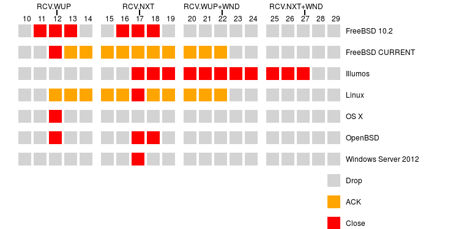

# [The many ways of handling TCP RST packets](https://www.snellman.net/blog/archive/2016-02-01-tcp-rst/)

What could be a simpler networking concept than TCP's RST packet? It just crudely closes down a connection, nothing subtle about it. Due to some odd RST behavior we saw at work, I went digging in RFCs to check what's the technically correct behavior and in different TCP implementations to see what's actually done in practice.

## Background

In the original TCP specification, RFC 793, RSTs are defined in terms of the following TCP state variables:

* RCV.NXT - The sequence number of the next byte of data the receiver is expecting from the sender
* RCV.WND - The amount of receive window space the receiver is advertising
* RCV.NXT + RCV.WND - The sequence number of the last byte of data the receiver is willing to accept at the moment.
* SND.UNA - The first sequence number that the sender has not yet seen the receiver acknowledge.
* SND.NXT - The sequence number of the next byte of payload data the sender would transmit.

An RST is accepted if the sequence number is in the receiver's window (i.e. RCV.NXT =< SEG.SEQ < RCV.NXT+RCV.WND). The effect of the RST is to immediately close the connection. This is slightly different from a FIN, which just says that the other endpoint will no longer be transmitting any new data but can still receive some.

There are two types of event that cause a RST to be emitted. A) the connection is explicitly aborted by the endpoint, e.g. the process holding the socket being killed (just closing the socket normally is not grounds for RST, even if there is still unreceived data). B) the TCP stack receiving certain kinds of invalid packets, e.g. a non-RST packet for a connection that doesn't exist or has already been closed.

The RST packet that should be generated is slightly different for these two cases. For case A the sequence number for the RST packet should be SND.NXT of the connection. For case B the sequence number should be set to the sequence number ACKed by the received packet. In the latter case the ACK bit will not be set in the RST. (Where the distiction matters, I'll call the first one RST-ABORT, the second a RST-REPLY).

## Receiving a RST

The RCV.NXT state variable is doing double duty in the original RFC 793. It's defined as "next sequence number expected on an incoming connection", but it's also implied that it's the most recent acknowledgement number sent out. This was true early on, but not after the introduction of delayed ACKs (RFC 1122). Which of these two interpretations should be used for checking whether the RST is in window?

Linux goes with the latter one, and splits the two roles out. RCV.NXT is strictly defined as the next expected sequence number, and RCV.WUP is the highest sequence number for which an ACK has actually been sent. RST handling is done using RCV.WUP, and in fact the following comment implies that RSTs are the main reason for this mechanism.

```sh
 * Also, controls (RST is main one) are accepted using RCV.WUP instead
 * of RCV.NXT. Peer still did not advance his SND.UNA when we
 * delayed ACK, so that hisSND.UNA<=ourRCV.WUP.
 * (borrowed from freebsd)
```

With code like this:

```c
return !before(end_seq, tp->rcv_wup) &&
       !after(seq, tp->rcv_nxt + tcp_receive_window(tp));
```

The use of RCV.NXT instead of RCV.WUP for the second subexpression is a clever ruse; due to the way tcp_receive_window() is defined, the final result is relative to RCV.WUP instead of RCV.NXT. But it is a slightly mysterious piece of code. Why is SND.UNA relevant? It should be SND.NXT that matters.

Sure, you can construct cases where a RST would be emitted with a sequence number where this makes a difference (but only for RST-REPLY, not for RST-ABORTs). In these particular you'd save one roundtrip. An example would be something like:

```
Client                      Server

sends 1000:1100
sends 1100:1200
                            receives 1000:1100
                            ACKs 1100
                            receives 1100:1200
                            delays ACK
aborts the connection
does not send a FIN
sends RST seqnr 1200
                            RST is lost
receives ACK for 1100
sends RST 1100 (not 1200)
                            receives RST 1100
                            closes connection iff using RCV.WUP
                            ACKs 1200
receives ACK for 1200
sends RST 1200
                            receives RST 1200
```

But that's extremely contrived, and would be easily broken by delays (all that needs to happen is for that delayed ACK to actually get emitted before the second RST is received, and it would get rejected).

I tried to do a bit of archaeology to see if historical context would help figure this out, but since it all happened in the dark pre-git ages, it's a bit tricky. The commit is in 585d5180 in netdev-vger-cvs, and while I couldn't track down any discussion from 2001/2002 when the change was made, there is a mailing list post from this decade (here). After reading these, I was still not really enlightened. Was/is there kit around that generates RSTs using SND.UNA rather than SND.NXT when closing a connection? (I mean genuine endpoints. There's of plenty of middleboxes around that generate RSTs with all kinds of sequence numbers, but those might not be the RSTs you want to be reacting to anyway.)

The original FreeBSD commit where this concept was introduced has some additional detail:

```c
/*
* Note: this does not take into account delayed ACKs, so
*   we should test against last_ack_sent instead of rcv_nxt.
*   Also, it does not make sense to allow reset segments with
*   sequence numbers greater than last_ack_sent to be processed
*   since these sequence numbers are just the acknowledgement
*   numbers in our outgoing packets being echoed back at us,
*   and these acknowledgement numbers are monotonically
*   increasing.
*/
```

The bit I bolded does make it appear that the motivation for the change was specifically RST-REPLYs, not RST-ABORTs. If you're looking for an exact match with some ACK you've sent, it'd be insane to try to match an ACK that had never been sent. But if the other kind of RST had been considered, it would have been obvious that in the presence of delayed ACKs a valid RST could have a sequence number higher than last_ack_sent.

This rule of exact match was indeed later changed in various ways; first reverted to accepting all RSTs in window (so just moving the window), then re-enabled while socket is in ESTABLISHED state but being less strict in other states, then loosened to accepting either RCV.NXT or last_ack_sent, or accepting either of those ± 1, etc.

If you're already tracking last_ack_sent / RCV.WUP, doing the window checks on that instead of RCV.NXT seems sensible. But it does feel like an optional thing, rather than one of those pieces of necessary TCP behavior that were only standardized in folklore.

But that's ancient history. In RFC 5961 the suggested rules for accepting a RST were changed to make RST spoofing attacks harder. There are now three possible reactions:

* RST completely out of window, do nothing
* RST matches RCV.NXT exactly, close connection
* RST in-window but not RCV.NXT, send an ACK (if the RST was genuine, the other endpoint will send a new one but this time with the correct sequence number).

This means that even for the above contrived case using a RST.WUP as the start of the window doesn't make a substantial difference. One extra round-trip is required no matter what; whether the ACK is the delayed ACK or the challenge ACK to a semi-bogus RST is immaterial.

That's pretty fertile ground for different implementations. One standard, one ambiguity that appears to have never been officially clarified, and one proposed standard. I could go into more detail on the archaeology or on how to perform the experiments for if the source code isn't available. But that'd get tedious, so here's a summary of my best understanding of how various operating systems work for RSTs received in the ESTABLISHED state (the picture assumes a last ACK sent of 12, last sequence number received of 17, and a window of 10).



Yes, seven operating systems and no two even agree on what an acceptable RST looks like! And there's still some scope for other reasonable but different implementations beyond those. RFC 5961 handling but with the window based on RCV.NXT, and RFC 5961 handling that accepts both RCV.WUP and RCV.NXT as the sequence number would be obvious examples. (To be fair, some of these differences will collapse away if no ACKs are currently being delayed when the RST is received).

The one data point in that table that seems particularly strange is RCV.NXT + 1 in OpenBSD. If you're going to widen the window of acceptable sequence numbers by 1, I would have thought that adjusting it downwards rather than up would be the obvious choice. The commit message is pretty spartan, just blaming Windows.

You could get into some further complications with the window handling for RSTs that include data (sigh, the awesome idea in RFC 1122 to embed the reason for the RST as ASCII payload), but AFAIK those don't exist in the wild so maybe this is enough for now.

## Interlude on RST handling in TCP aware middleboxes

The above was just considering RST handling from the point of view of the endpoints, where the main question is whether to react to an RST, not how you react to it. Things get different yet again for middlebox. The middlebox might not actually have the same understanding of the state variables as either of the endpoints. If the reaction of the middlebox to the RST is somehow destructive, the middlebox has to be careful. As a trivial example, imagine a firewall that blocks all packets for unknown connections. It would be quite bad for that firewall to react to a RST packet that the actual endpoint rejects.

What if the middlebox is not just TCP aware, but an active participant in the connection? At work we do a fully transparent non-terminating TCP optimizer for mobile networks (see previous post for more technical details if that's your kind of thing). Despite not terminating the connections, we still ACK data and thus take responsibility for delivering it. How should a device like that react to a RST if we still have undelivered but ACKed data? It actually depends on which directions we've seen a valid RST in. To a first approximation we should stop sending new data to the direction that we've gotten RSTs from, but not close the connection or forward the RST packet until all data that we've acknowledged has been delivered to the destination of the RST. (With the edge case of valid RSTs in both directions forcing connection closure even with undelivered data).

## Sending RSTs

So there are a bunch of different ways to process a RST, but surely sending RSTs is trivial? The rules on that are simple, unambiguous, and unlike for processing an incoming RST there should be no motivation to deviate from the rules. There are good reasons to be stricter about accepting RSTs, there should be no reason to send RSTs that will get rejected.

Ha-ha, just kidding.

First, what does SND.NXT really mean? RFC 793 only describes it as the "next sequence number to be sent". On the face of it this could mean two things; either it's the highest sequence number that has never been sent. Or it could be the next sequence number to be transmitted including retransmissions. The latter interpretation seems morally bankrupt. The RFC describes a mechanism by which SND.NXT increases, but not one by which it decreases. The glossary also explicitly mentions retransmissions as falling between SND.UNA and SND.NXT, which implies SND.NXT should not decrease.

But in reality you see a lot of clients reduce SND.NXT if they believe there's been a full tail loss. Something like this:

```
00:00:53.693026 client > server: Flags [P.], seq 973096734:973096882, ack 2107240749, win 4200, length 148
00:00:53.693043 server > client: Flags [.], ack 973095334, win 4000, options [sack 1 {973096734:973096882},eol], length 0
00:00:53.789417 client > server: Flags [.], seq 973095334:973096734, ack 2107240749, win 4200, length 1400
00:00:53.789434 server > client: Flags [.], ack 973096882, win 4000, length 0
00:00:53.789455 client > server: Flags [.], seq 973095334:973096734, ack 2107240749, win 4200, length 1400
00:00:53.789458 server > client: Flags [.], ack 973096882, win 4000, length 0
00:00:53.789475 client > server: Flags [R.], seq 973096734, ack 2107240749, win 0, length 0
```

In this example when the client sends the RST, SND.UNA should be 973095334 and SND.NXT should be 973096882 - highest sequence number sent, and in fact selectively acked. The RST is not generated with either of those, but the in-between sequence number of 973096734.

There's another problem, which will matter especially for FIN+RST connection teardowns. Here's what closing down a connection prematurely looks like on OS X:

```
00:43:09.299678 client > server: Flags [.], ack 3343152432, win 32722, length 0
00:43:09.300615 client > server: Flags [F.], seq 773912652, ack 3343155284, win 32768, length 0
00:43:09.300617 server > client: Flags [.], ack 773912653, win 6000, length 0
00:43:09.300981 client > server: Flags [R], seq 773912652, win 0, length 0
00:43:09.300983 client > server: Flags [R], seq 773912652, win 0, length 0
00:43:09.300984 client > server: Flags [R], seq 773912652, win 0, length 0
00:43:09.301449 client > server: Flags [R], seq 773912653, win 0, length 0
```

The first RST has the same sequence number as the FIN. That's the correct behavior, since that RST was sent in reply to a packet that was already in flight to the client by the time the server received the packet. Apperently OS X had the RST get triggered by an incoming packet before it got around to sending an RST with a useful sequence number. So there's an extra round trip's delay, and possibly an extra round trip's worth of packets. But that's not a huge deal.

What would really suck is if an operating system were to totally ignore the rule to reply with an RST when receiving a packet on a closed socket. Which is of course exactly what iOS does. I don't know the exact parameters of when it happens (e.g. it might be something that happens just when connected over cellular, not over Wifi), but what you get is something like this:

```
00:00:15.099703 client > server: Flags [.], ack 3593074068, win 8192, length 0
00:00:15.099705 client > server: Flags [F.], seq 80108342, ack 3593074068, win 8192, length 0
00:00:15.099706 server > client: Flags [.], ack 80108343, win 124, length 0
00:00:15.099706 client > server: Flags [R], seq 80108342, win 0, length 0
00:00:15.228490 server > client: Flags [.], seq 3593074068:3593075068, ack 80108343, win 125, length 1000
... [ crickets, while the same data gets regularly retransmitted to the client ] ...
00:02:11.646208 server > client: Flags [.], seq 3593074068:3593075068, ack 80108343, win 125, length 1000
```

We get a single RST, which for an active connection almost guaranteed to have a sequence number that will be rejected. Without at least one valid RST, the server has to keep the connection open, and data gets wastefully retransmitted over and over. This lasts until the server times out the connection, which might take anything from ten seconds to two minutes.

And just to be clear, the phone was still connected and functional for the full duration of that trace. There were other active connections to it, and those continued happily along. It's just the closed sockets that become total black holes.

Note that the RCV.WUP trickery discussed in the earlier section alone would not be sufficient to handle this kind of a situations. In addition you need to either delay ACKs to FINs (OS X), be more forgiving about RSTs after receiving a FIN (OSX, FreeBSD 10.2), or have a small amount of slack in the sequence number check (±1 in FreeBSD 10.2; OpenBSD has slack but in the wrong direction).

## Some statistics

To see how much of a difference these different variations have, I ran some simulations against a trace from a varied real world traffic mix and looked at what percentage of first RSTs received by the server would have been accepted, vs been dropped or caused a challenge ACK. (I grouped challenge ACKs together with dropping packets, since the point here is to see which policy is the most efficient at actually closing the connection as soon as possible. It's not to see which ones manage to do it eventually. Either they'll all manage to do it later since some packets will be sent eventually, or none of them will do it since the other device isn't properly sending followup RSTs. Also, an after the fact simulation can't possibly tell anything about the efficiency of the challenge ACKs).

The data was filtered such that we only looked at connections matching the following criteria. This was about 35k connections after the filtering, so not a huge data set. This was almost exactly 1/3 RST-ABORTs and 2/3 RST-REPLYs.

* The connection received an RST from the client at some point
* The RST arrived before the server had sent a FIN or a RST to the client
* The RST arrived after at least one data packet (not during handshake)

Also not that this is only comparing the different policies for RST acceptance, not for example the effects of different delayed ACK behavior in different TCP implementations.

% of first RSTs accepted
|RST receive policy|RST-ABORT               |RST-REPLY|
|------------------|------------------------|---------|
|FreeBSD 10.2      |96.60                   |96.81    |
|FreeBSD CURRENT   |94.86                   |83.90    |
|Illumos           |99.91                   |81.20    |
|Linux / Windows   |96.45                   |81.20    |
|OpenBSD           |96.58                   |83.90    |
|OS X              |95.05                   |83.90    |

Illumos is the only implementation here using the standard check against the massive full window (tens or hundreds of kilobytes, vs. 1-6 bytes for everything else. So it's not much of a surprise that it's more effective than the others at closing the connection on just about every RST-ABORT it receives. The tradeoff is that it's a lot more susceptible to RST spoofing attacks.

When handling a RST-ABORT, we'll almost always have seen a FIN just before. This means that RCV.WUP and RCV.NXT will be the same, so all the other options are very close to each other. The minor differences there come from:

* FreeBSD 10.2 accepts a superset of what OpenBSD does.
* OpenBSD accepts superset of what Linux and Windows do.
* When there is no FIN, checking RCV.NXT is more predictive of the sequence number of a RST-ABORT than RCV.WUP would be, so anything not checking RCV.NXT loses out.
* OS X relaxes the checks after receiving FIN, FreeBSD CURRENT no longer does.

For RST-REPLY, practically everyone gets the case of no FIN right. But if there's a FIN (like in the iOS example above), FreeBSD 10.2 is vastly more effective than anything else thanks to accepting RCV.NXT - 1. There's not much of a tradeoff. It's a good idea, and I'm a bit surprised that not only did it never spread outside of FreeBSD, but has now been removed from there too.

The other results are boring, with just the RCV.WUP vs. RCV.NXT difference (with the opposite results compared to RST-ABORTs).

## Conclusion

Almost every time I talk about TCP optimization to the general development public, the reaction is something along the lines of "ah, you're one of the guys who breaks the standard?". That's technically true but useless; nobody actually implements all the standards exactly as written. Hopefully this dive into just one relatively simple aspect shows a) everyone doesn't interpret the standards the same way, b) there are reasons to intentionally deviate from the standards, and c) everybody does it. You just can't be abusive when deviating from the standards.

Oh, and I'd already implemented accepting RSTs with sequence number RCV.NXT - 1 before looking at these details (resetting the connections promptly is kind of important for us due to reasons that I can't go into here). But this investigation did make me feel a lot better about that change.