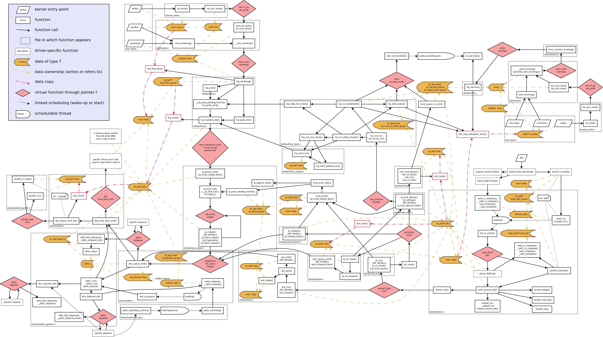

# Reference

* Linux networking stack from the ground up [part1](https://www.privateinternetaccess.com/blog/2016/01/linux-networking-stack-from-the-ground-up-part-1/), [part2](https://www.privateinternetaccess.com/blog/2016/01/linux-networking-stack-from-the-ground-up-part-2), [part3](https://www.privateinternetaccess.com/blog/2016/01/linux-networking-stack-from-the-ground-up-part-3), [part4](https://www.privateinternetaccess.com/blog/2016/01/linux-networking-stack-from-the-ground-up-part-4), [part5](https://www.privateinternetaccess.com/blog/2016/02/linux-networking-stack-from-the-ground-up-part-4-2/)
* [Monitoring and Tuning the Linux Networking Stack: Receiving Data](https://blog.packagecloud.io/eng/2016/06/22/monitoring-tuning-linux-networking-stack-receiving-data/)
* [Illustrated Guide to Monitoring and Tuning the Linux Networking Stack: Receiving Data](https://blog.packagecloud.io/eng/2016/10/11/monitoring-tuning-linux-networking-stack-receiving-data-illustrated/)
* [Monitoring and Tuning the Linux Networking Stack: Sending Data](https://blog.packagecloud.io/eng/2017/02/06/monitoring-tuning-linux-networking-stack-sending-data/)
* [Navigating the Linux kernel network stack: receive path](https://www.lmax.com/blog/staff-blogs/2016/05/06/navigating-linux-kernel-network-stack-receive-path/)
* [Understanding TCP/IP Network Stack & Writing Network Apps](https://www.cubrid.org/blog/understanding-tcp-ip-network-stack)
* [QUEUEING IN THE LINUX NETWORK STACK](https://www.coverfire.com/articles/queueing-in-the-linux-network-stack/)
