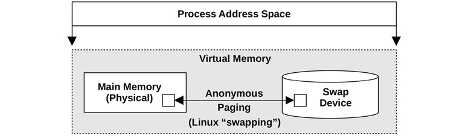
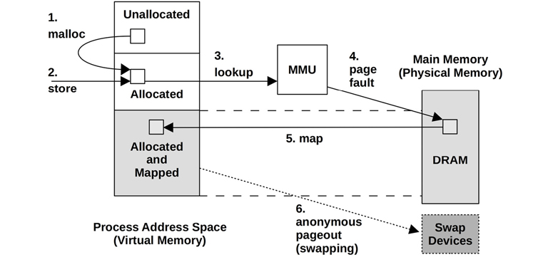
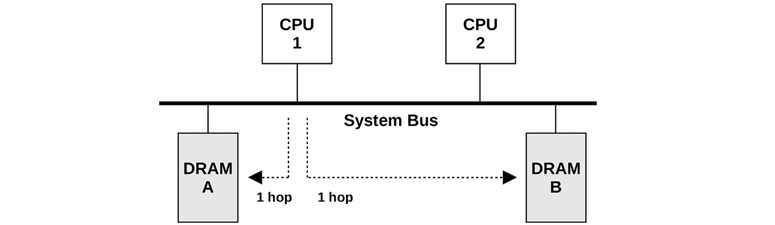
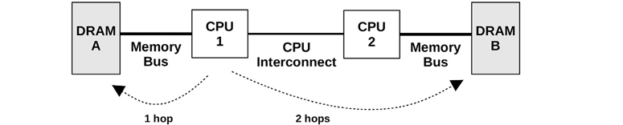

# Memory

System main memory stores application and kernel instructions, their working data, and file system caches. The secondary storage for this data is typically the storage devices—the disks—which operate orders of magnitude more slowly. Once main memory has filled, the system may begin switching data between main memory and the storage devices. This is a slow process that will often become a system bottleneck, dramatically decreasing performance. The system may also terminate the largest memory-consuming process, causing application outages.

系统主存存储应用程序和内核指令，以及它们的工作数据以及文件系统缓存。 此数据的辅助存储通常是存储设备（磁盘），它们的运行速度要慢几个数量级。 一旦主存已满，系统就可以开始在主存和存储设备（磁盘）之间切换数据。 这是一个缓慢的过程，通常会成为系统瓶颈，从而大大降低性能。 系统还可能终止最大的内存消耗过程，从而导致应用程序中断。

Other performance factors to consider include the CPU expense of allocating and freeing memory, copying memory, and managing memory address space mappings. On multisocket architectures, memory locality can become a factor, as memory attached to local sockets has lower access latency than remote sockets.

其他需要考虑的性能因素包括分配和释放内存，复制内存以及管理内存地址空间映射的CPU开销。 在多插槽体系结构上，内存局部性可能成为一个因素，因为连接到本地套接字的内存比远程套接字具有更低的访问延迟。

The learning objectives of this chapter are 本章的学习目标是：

* Understand memory concepts.   了解内存概念。
* Become familiar with memory hardware internals.   熟悉内存硬件内部。
* Become familiar with kernel and user allocator internals.   熟悉内核和用户分配器内部。
* Have a working knowledge of the MMU and TLB.   对MMU和TLB有一定的了解。
* Follow different methodologies for memory analysis.   遵循不同的方法进行内存分析。
* Characterize system-wide and per-process memory usage.   表征系统范围和每个进程的内存使用情况。
* Identify issues caused by low available memory.   确定由可用内存不足引起的问题。
* Locate memory usage in a process address space and kernel slabs.   在进程地址空间和内核平台中找到内存使用情况。
* Investigate memory usage using profilers, tracers, and flame graphs.   使用探查器，跟踪器和火焰图调查内存使用情况。
* Become aware of tunable parameters for memory.   意识到内存的可调参数。

This chapter has five parts, the first three providing the basis for memory analysis, and the last two showing its practical application to Linux-based systems. The parts are as follows:

本章分为五个部分，前三个部分提供了内存分析的基础，后两个部分显示了其在基于Linux的系统中的实际应用。 这些部分如下：

* **Background** introduces memory-related terminology and key memory performance concepts.   **背景技术**介绍了与内存有关的术语和关键的内存性能概念。
* **Architecture** provides generic descriptions of hardware and software memory architecture.   **体系结构**提供了硬件和软件存储器体系结构的一般描述。
* **Methodology** explains performance analysis methodology.   **方法论**解释了性能分析方法论。
* **Observability Tools** describes performance tools for memory analysis.   **观察工具**介绍了用于内存分析的性能工具。
* **Tuning** explains tuning and example tunable parameters.   **调优**说明了调优和示例可调参数。

The on-CPU memory caches (Level 1/2/3, TLB) are covered in Chapter 6, CPUs.

第6章，CPU中介绍了CPU上的内存缓存（级别1/2/3，TLB）。

## 7.1 TERMINOLOGY 术语

For reference, memory-related terminology used in this chapter includes the following:

* **Main memory**: Also referred to as physical memory, this describes the fast data storage area of a computer, commonly provided as DRAM.
* **Virtual memory**: An abstraction of main memory that is (almost) infinite and non-contended. Virtual memory is not real memory.
* **Resident memory**: Memory that currently resides in main memory.
* **Anonymous memory**: Memory with no file system location or path name. It includes the working data of a process address space, called the heap.
* **Address space**: A memory context. There are virtual address spaces for each process, and for the kernel.
* **Segment**: An area of virtual memory flagged for a particular purpose, such as for storing executable or writeable pages.
* **Instruction text**: Refers to CPU instructions in memory, usually in a segment.
* **OOM**: Out of memory, when the kernel detects low available memory.
* **Page**: A unit of memory, as used by the OS and CPUs. Historically it is either 4 or 8 Kbytes. Modern processors have multiple page size support for larger sizes.
* **Page fault**: An invalid memory access. These are normal occurrences when using on-demand virtual memory.
* **Paging**: The transfer of pages between main memory and the storage devices.
* **Swapping**: Linux uses the term swapping to refer to anonymous paging to the swap device (the transfer of swap pages). In Unix and other operating systems, swapping is the transfer of entire processes between main memory and the swap devices. This book uses the Linux version of the term.
* **Swap**: An on-disk area for paged anonymous data. It may be an area on a storage device, also called a physical swap device, or a file system file, called a swap file. Some tools use the term swap to refer to virtual memory (which is confusing and incorrect).

Other terms are introduced throughout this chapter. The Glossary includes basic terminology for reference if needed, including address, buffer, and DRAM. Also see the terminology sections in Chapters 2 and 3.

## 7.2 CONCEPTS 概念

The following are a selection of important concepts regarding memory and memory performance.

### 7.2.1 Virtual Memory

Virtual memory is an abstraction that provides each process and the kernel with its own large, linear, and private address space. It simplifies software development, leaving physical memory placement for the operating system to manage. It also supports multitasking (virtual address spaces are separated by design) and oversubscription (in-use memory can extend beyond main memory). Virtual memory was introduced in Chapter 3, Operating Systems, Section 3.2.8, Virtual Memory. For historical background, see [Denning 70].

Figure 7.1 shows the role of virtual memory for a process, on a system with a swap device (secondary storage). A page of memory is shown, as most virtual memory implementations are page-based.

Figure 7.1 Process virtual memory

The process address space is mapped by the virtual memory subsystem to main memory and the physical swap device. Pages of memory can be moved between them by the kernel as needed, a process Linux calls swapping (and other OSes call anonymous paging). This allows the kernel to oversubscribe main memory.

The kernel may impose a limit to oversubscription. A commonly used limit is the size of main memory plus the physical swap devices. The kernel can fail allocations that try to exceed this limit. Such “out of virtual memory” errors can be confusing at first glance, since virtual memory itself is an abstract resource.

Linux also allows other behaviors, including placing no bounds on memory allocation. This is termed overcommit and is described after the following sections on paging and demand paging, which are necessary for overcommit to work.

### 7.2.2 Paging

Paging is the movement of pages in and out of main memory, which are referred to as page-ins and page-outs, respectively. It was first introduced by the Atlas Computer in 1962 [Corbató 68], allowing:

* Partially loaded programs to execute
* Programs larger than main memory to execute
* Efficient movement of programs between main memory and storage devices

These abilities are still true today. Unlike the earlier technique of swapping out entire programs, paging is a fine-grained approach to managing and freeing main memory, since the page size unit is relatively small (e.g., 4 Kbytes).

Paging with virtual memory (*paged virtual memory*) was introduced to Unix via BSD [Babaoglu 79] and became the standard.

With the later addition of the page cache for sharing file system pages (see Chapter 8, File Systems), two different types of paging became available: file system paging and anonymous paging.

#### File System Paging

File system paging is caused by the reading and writing of pages in memory-mapped files. This is normal behavior for applications that use file memory mappings (mmap(2)) and on file systems that use the page cache (most do; see Chapter 8, File Systems). It has been referred to as “good” paging [McDougall 06a].

When needed, the kernel can free memory by paging some out. This is where the terminology gets a bit tricky: if a file system page has been modified in main memory (called dirty), the page-out will require it to be written to disk. If, instead, the file system page has not been modified (called clean), the page-out merely frees the memory for immediate reuse, since a copy already exists on disk. Because of this, the term page-out means that a page was moved out of memory—which may or may not have included a write to a storage device (you may see the term page-out defined differently in other texts).

#### Anonymous Paging (Swapping)

Anonymous paging involves data that is private to processes: the process heap and stacks. It is termed anonymous because it has no named location in the operating system (i.e., no file system path name). Anonymous page-outs require moving the data to the physical swap devices or swap files. Linux uses the term swapping to refer to this type of paging.

Anonymous paging hurts performance and has therefore been referred to as “bad” paging [McDougall 06a]. When applications access memory pages that have been paged out, they block on the disk I/O required to read them back to main memory.1 This is an anonymous page-in, which introduces synchronous latency to the application. Anonymous page-outs may not affect application performance directly, as they can be performed asynchronously by the kernel.

> 1If faster storage devices are used as swap devices, such as 3D XPoint with sub 10 μs latency, swapping may not be the same “bad” paging it once was, but rather become a simple way to intentionally extend main memory, one with mature kernel support.

Performance is best when there is no anonymous paging (swapping). This can be achieved by configuring applications to remain within the main memory available and by monitoring page scanning, memory utilization, and anonymous paging, to ensure that there are no indicators of a memory shortage.

### 7.2.3 Demand Paging

Operating systems that support demand paging (most do) map pages of virtual memory to physical memory on demand, as shown in Figure 7.2. This defers the CPU overhead of creating the mappings until they are actually needed and accessed, instead of at the time a range of memory is first allocated.

Figure 7.2 Page fault example

The sequence shown in Figure 7.2 begins with a malloc() (step 1) that provides allocated memory, and then a store instruction (step 2) to that newly allocated memory. For the MMU to determine the main memory location of the store, it performs a virtual to physical lookup (step 3) for the page of memory, which fails as there is not yet a mapping. This failure is termed a page fault (step 4), which triggers the kernel to create an on-demand mapping (step 5). Sometime later, the page of memory could be paged out to the swap devices to free up memory (step 6).

Step 2 could also be a load instruction in the case of a mapped file, which should contain data but isn’t yet mapped to this process address space.

If the mapping can be satisfied from another page in memory, it is called a minor fault. This may occur for mapping a new page from available memory, during memory growth of the process (as pictured). It can also occur for mapping to another existing page, such as reading a page from a mapped shared library.

Page faults that require storage device access (not shown in this figure), such as accessing an uncached memory-mapped file, are called major faults.

The result of the virtual memory model and demand allocation is that any page of virtual memory may be in one of the following states:

1. Unallocated
2. Allocated, but unmapped (unpopulated and not yet faulted)
3. Allocated, and mapped to main memory (RAM)
4. Allocated, and mapped to the physical swap device (disk)

State (D) is reached if the page is paged out due to system memory pressure. A transition from (B) to (C) is a page fault. If it requires disk I/O, it is a major page fault; otherwise, a minor page fault.

From these states, two memory usage terms can also be defined:

* **Resident set size (RSS)**: The size of allocated main memory pages (C)
* **Virtual memory size**: The size of all allocated areas (B + C + D)

Demand paging was added to Unix via BSD, along with paged virtual memory. It has become the standard and is used by Linux.

### 7.2.4 Overcommit

Linux supports the notion of overcommit, which allows more memory to be allocated than the system can possibly store—more than physical memory and swap devices combined. It relies on demand paging and the tendency of applications to not use much of the memory they have allocated.

With overcommit, application requests for memory (e.g., malloc(3)) will succeed when they would otherwise have failed. Instead of allocating memory conservatively to remain within virtual memory limits, an application programmer can allocate memory generously and later use it sparsely on demand.

On Linux, the behavior of overcommit can be configured with a tunable parameter. See Section 7.6, Tuning, for details. The consequences of overcommit depend on how the kernel manages memory pressure; see the discussion of the OOM killer in Section 7.3, Architecture.

### 7.2.5 Process Swapping

Process swapping is the movement of entire processes between main memory and the physical swap device or swap file. This is the original Unix technique for managing main memory and is the origin of the term swap [Thompson 78].

To swap out a process, all of its private data must be written to the swap device, including the process heap (anonymous data), its open file table, and other metadata that is only needed when the process is active. Data that originated from file systems and has not been modified can be dropped and read from the original locations again when needed.

Process swapping severely hurts performance, as a process that has been swapped out requires numerous disk I/O to run again. It made more sense on early Unix for the machines of the time, such as the PDP-11, which had a maximum process size of 64 Kbytes [Bach 86]. (Modern systems allow process sizes measured in the Gbytes.)

This description is provided for historical background. Linux systems do not swap processes at all and rely only on paging.

### 7.2.6 File System Cache Usage

It is normal for memory usage to grow after system boot as the operating system uses available memory to cache the file system, improving performance. The principle is: If there is spare main memory, use it for something useful. This can distress naïve users who see the available free memory shrink to near zero sometime after boot. But it does not pose a problem for applications, as the kernel should be able to quickly free memory from the file system cache when applications need it.

For more about the various file system caches that can consume main memory, see Chapter 8, File Systems.

### 7.2.7 Utilization and Saturation

Main memory utilization can be calculated as used memory versus total memory. Memory used by the file system cache can be treated as unused, as it is available for reuse by applications.

If demands for memory exceed the amount of main memory, main memory becomes saturated. The operating system may then free memory by employing paging, process swapping (if supported), and, on Linux, the OOM killer (described later). Any of these activities is an indicator of main memory saturation.

Virtual memory can also be studied in terms of capacity utilization, if the system imposes a limit on the amount of virtual memory it is willing to allocate (Linux overcommit does not). If so, once virtual memory is exhausted, the kernel will fail allocations; for example, malloc(3) fails with errno set to ENOMEM.

Note that the currently available virtual memory on a system is sometimes (confusingly) called available swap.

### 7.2.8 Allocators

While virtual memory handles multitasking of physical memory, the actual allocation and placement within a virtual address space are often handled by allocators. These are either user-land libraries or kernel-based routines, which provide the software programmer with an easy interface for memory usage (e.g., malloc(3), free(3)).

Allocators can have a significant effect on performance, and a system may provide multiple user-level allocator libraries to pick from. They can improve performance by use of techniques including per-thread object caching, but they can also hurt performance if allocation becomes fragmented and wasteful. Specific examples are covered in Section 7.3, Architecture.

### 7.2.9 Shared Memory

Memory can be shared between processes. This is commonly used for system libraries to save memory by sharing one copy of their read-only instruction text with all processes that use it.

This presents difficulties for observability tools that show per-process main memory usage. Should shared memory be included when reporting the total memory size of a process? One technique in use by Linux is to provide an additional measure, the proportional set size (PSS), which includes private memory (not shared) plus shared memory divided by the number of users. See Section 7.5.9, pmap, for a tool that can show PSS.

### 7.2.10 Working Set Size

Working set size (WSS) is the amount of main memory a process frequently uses to perform work. It is a useful concept for memory performance tuning: performance should greatly improve if the WSS can fit into the CPU caches, rather than main memory. Also, performance will greatly degrade if the WSS exceeds the main memory size, and the application must swap to perform work.

While useful as a concept, it is difficult to measure in practice: there is no WSS statistic in observability tools (they commonly report RSS, not WSS). Section 7.4.10, Memory Shrinking, describes an experimental methodology for WSS estimation, and Section 7.5.12, wss, shows an experimental working set size estimation tool, wss(8).

### 7.2.11 Word Size

As introduced in Chapter 6, CPUs, processors may support multiple word sizes, such as 32-bit and 64-bit, allowing software for either to run. As the address space size is bounded by the addressable range from the word size, applications requiring more than 4 Gbytes of memory are too large for a 32-bit address space and need to be compiled for 64 bits or higher.2

> 2There is also the Physical Address Extension (PAE) feature (workaround) for x86 allowing 32-bit processors to access larger memory ranges (but not in a single process).

Depending on the kernel and processor, some of the address space may be reserved for kernel addresses and is unavailable for application use. An extreme case is Windows with a 32-bit word size, where by default 2 Gbytes is reserved for the kernel, leaving only 2 Gbytes for the application [Hall 09]. On Linux (or Windows with the /3GB option enabled) the kernel reservation is 1 Gbyte. With a 64-bit word size (if the processor supports it) the address space is so much larger that the kernel reservation should not be an issue.

Depending on the CPU architecture, memory performance may also be improved by using larger bit widths, as instructions can operate on larger word sizes. A small amount of memory may be wasted, in cases where a data type has unused bits at the larger bit width.

## 7.3 ARCHITECTURE

This section introduces memory architecture, both hardware and software, including processor and operating system specifics.

These topics have been summarized as background for performance analysis and tuning. For more details, see the vendor processor manuals and texts on operating system internals listed at the end of this chapter.

### 7.3.1 Hardware

Memory hardware includes main memory, buses, CPU caches, and the MMU.

#### Main Memory

The common type of main memory in use today is *dynamic random-access memory* (DRAM). This is a type of volatile memory—its contents are lost when power is lost. DRAM provides high-density storage, as each bit is implemented using only two logical components: a capacitor and a transistor. The capacitor requires a periodic refresh to maintain charge.

Enterprise servers are configured with different amounts of DRAM depending on their purpose, typically ranging from one Gbyte to one Tbyte and larger. Cloud computing instances are typically smaller, ranging between 512 Mbytes and 256 Gbytes each.3 However, cloud computing is designed to spread load over a pool of instances, so they can collectively bring much more DRAM online for a distributed application, although at a much higher coherency cost.

> 3Exceptions include the AWS EC2 high memory instances, which reach 24 Tbytes of memory [Amazon 20].

#### Latency

The access time of main memory can be measured as the column address strobe (CAS) latency: the time between sending a memory module the desired address (column) and when the data is available to be read. This varies depending on the type of memory (for DDR4 it is around 10 to 20ns [Crucial 18]). For memory I/O transfers, this latency may occur multiple times for a memory bus (e.g., 64 bits wide) to transfer a cache line (e.g., at 64 bytes wide). There are also other latencies involved with the CPU and MMU for then reading the newly available data. Read instructions avoid these latencies when they return from a CPU cache; write instructions may avoid them as well, if the processor supports write-back caching (e.g., Intel processors).

#### Main Memory Architecture

An example main memory architecture for a generic two-processor uniform memory access (UMA) system is shown in Figure 7.3.

*
Figure 7.3 Example UMA main memory architecture, two-processor
*

Each CPU has uniform access latency to all of memory, via a shared system bus. When managed by a single operating system kernel instance that runs uniformly across all processors, this is also a symmetric multiprocessing (SMP) architecture.

For comparison, an example two-processor non-uniform memory access (NUMA) system is shown in Figure 7.4, which uses a CPU interconnect that becomes part of the memory architecture. For this architecture, the access time for main memory varies based on its location relative to the CPU.

*
Figure 7.4 Example NUMA main memory architecture, two-processor
*

CPU 1 can perform I/O to DRAM A directly, via its memory bus. This is referred to as local memory. CPU 1 performs I/O to DRAM B via CPU 2 and the CPU interconnect (two hops). This is referred to as remote memory and has a higher access latency.

The banks of memory connected to each CPU are referred to as memory nodes, or just nodes. The operating system may be aware of the memory node topology based on information provided by the processor. This then allows it to assign memory and schedule threads based on memory locality, favoring local memory as much as possible to improve performance.

#### Buses

How main memory is physically connected to the system depends on the main memory architecture, as previously pictured. The actual implementation may involve additional controllers and buses between the CPUs and memory. Main memory may be accessed in one of the following ways:

* **Shared system bus**: Single or multiprocessor, via a shared system bus, a memory bridge controller, and finally a memory bus. This was pictured as the UMA example, Figure 7.3, and as the Intel front-side bus example, Figure 6.9 in Chapter 6, CPUs. The memory controller in that example was a Northbridge.
* **Direct**: Single processor with directly attached memory via a memory bus.
* **Interconnect**: Multiprocessor, each with directly attached memory via a memory bus, and processors connected via a CPU interconnect. This was pictured earlier as the NUMA example in Figure 7.4; CPU interconnects are discussed in Chapter 6, CPUs.

If you suspect your system is none of the above, find a system functional diagram and follow the data path between CPUs and memory, noting all components along the way.

#### DDR SDRAM

The speed of the memory bus, for any architecture, is often dictated by the memory interface standard supported by the processor and system board. A common standard in use since 1996 is double data rate synchronous dynamic random-access memory (DDR SDRAM). The term double data rate refers to the transfer of data on both the rise and fall of the clock signal (also called double-pumped). The term synchronous refers to the memory being clocked synchronously with the CPUs.

Example DDR SDRAM standards are shown in Table 7.1.

*
Table 7.1 <b>Example DDR bandwidths</b>
*

|Standard| Specification Year |Memory Clock (MHz) | Data Rate (MT/s) | Peak Bandwidth (MB/s)
|---------|-------------|------------|------------------|--
|DDR-200  |2000|100|200|1,600|
|DDR-333  |2000|167|333|2,667|
|DDR2-667 |2003|167|667|5,333|
|DDR2-800 |2003|200|800|6,400|
|DDR3-1333|2007|167|1,333|10,667|
|DDR3-1600|2007|200|1,600|12,800|
|DDR4-3200|2012|200|3,200|25,600|
|DDR5-4800|2020|200|4,800|38,400|
|DDR5-6400|2020|200|6,400|51,200|

The DDR5 standard is expected to be released during 2020 by the JEDEC Solid State Technology Association. These standards are also named using “PC-” followed by the data transfer rate in megabytes per second, for example, PC-1600.
